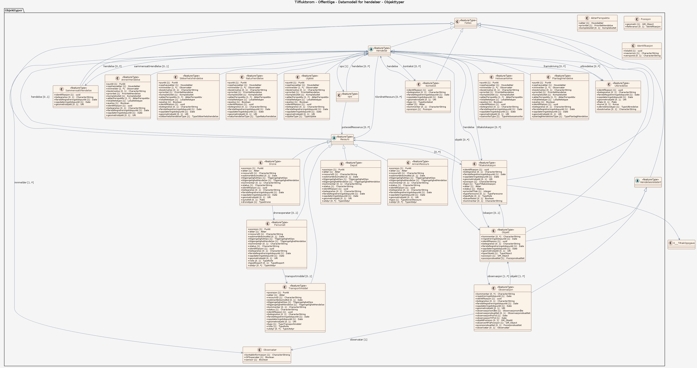

# Produktspesifikasjon: Tilfluktsrom - Offentlige

## Generelt om spesifikasjonen

### Unik identifisering

dbae9aae-10e7-4b75-8d67-7f0e8828f3d8

#### Fullstendig navn

Tilfluktsrom - Offentlige

#### Versjon

2019-09-09

### Referansedato

2026-03-12

### Ansvarlig organisasjon

Direktoratet for samfunnssikkerhet og beredskap

### Språk

nor

### Hovedtema

Norge digitalt, fellesDatakatalog, dataNorgeNo, Samfunnssikkerhet

### Temakategori

Samfunn og kultur

### Sammendrag

Offentlige tilfluktsrom i Norge. Tilfluktsrom er permanente beskyttelsesrom som skal verne befolkningen mot skader ved krigshandlinger. Offentlige tilfluktsrom er for befolkningen i et område og er bygget i byer og større tettsteder, samt i boligområder hvor dekningen av private tilfluktsrom ikke er tilfredsstillende.

### Romlig representasjonstype

Vektor

### Romlig oppløsning

**Ekvivalent målestokk**: 5000

### Utstrekning

**Geografisk utstrekning**:

- **Vest**: 2.0
- **Øst**: 33.0
- **Sør**: 57.0
- **Nord**: 72.0

**Tidsmessig utstrekning**:

- **Tidsperiode**:
  - **Fra**: 2019-09-09
  - **Til**: 2026-03-12

### Begrensninger

**Ressursbegrensninger**:

- **Bruksbegrensninger**: Ingen begrensninger på bruk er oppgitt.

**Juridiske begrensninger**:

- **Tilgangsbegrensninger**: Åpne data
- **Bruksbegrensninger**: Lisens
- **Lisens**: Norsk lisens for offentlige data (NLOD)
- **Lisenslenke**: <http://data.norge.no/nlod/no/1.0>
- **Andre begrensninger**: Ingen begrensninger oppgitt.

**Sikkerhetsbegrensninger**:

- **Klassifisering**: Ugradert

## Spesifikasjonsomfang

- **Omfang**:

  - **Identifikasjon**: hele datasettet
  - **Nivå**: dataset
  - **Utstrekning**: - **Beskrivelse**: National
  - **Nivåbeskrivelse**:
    #### Datamodell for hendelser
    Filer levert som FGDB, SOSI og Shape, gjennom Geonorge kartkatalog og massiv-klient, samt Atom Feed.

## Innhold og struktur

### Datamodell - Datamodell for hendelser

[Objektkatalog - Datamodell for hendelser](datamodell-for-hendelser/objektkatalog.html)

## Referansesystem

**Romlige referansesystemer**:

- **kode**: EPSG:25832
  **navn**: EUREF89 UTM sone 32, 2d

- **kode**: EPSG:25833
  **navn**: EUREF89 UTM sone 33, 2d

- **kode**: EPSG:25835
  **navn**: EUREF89 UTM sone 35, 2d

- **kode**: EPSG:25832
  **navn**: EUREF89 UTM sone 32, 2d

## Kvalitet

**Nivå**: dataset

- **Kvalitetsmål**: SOSI produktspesifikasjon: Tilfluktsrom - offentlige
  **Målebeskrivelse**: Dataene er ikke vurdert iht produktspesifikasjonen
  **Beskrivende resultat**: Dataene er ikke vurdert iht produktspesifikasjonen

- **Kvalitetsmål**: Sosi applikasjonsskjema
  **Målebeskrivelse**: GML-filer er ikke vurdert i henhold til applikasjonsskjema
  **Beskrivende resultat**: GML-filer er ikke vurdert i henhold til applikasjonsskjema

## Datafangst

**Datainnsamling og prosessering**:

- **Prosesstrinn**: - **Beskrivelse**: Ingen prosesshistorie tilgjengelig

## Datavedlikehold

**Vedlikeholdsfrekvens**: Etter behov

**Status**: Kontinuerlig oppdatert

## Leveranse

- **Leveranse**:

  - **Leveransemedium**:
    - **unitsOfDelivery**: fylkesvis, landsfiler
    - **Medienavn**: Geonorge nedlastning
    - **Leveransetjeneste**:
      - **Tjenesteendepunkt**: <https://nedlasting.geonorge.no/api/capabilities/>
      - **Tjenesteegenskap**:
        - **type**: Geonorge nedlastning
        - **Verdi**: GEONORGE:DOWNLOAD
  - **Leveranseformat**:
    - **Formatnavn**: FGDB

    - **Formatnavn**: GeoJSON

    - **Formatnavn**: GML

    - **Formatnavn**: PostGIS

- **Leveranse**:

  - **Leveransemedium**:
    - **unitsOfDelivery**: fylkesvis, landsfiler
    - **Medienavn**: Atom Feed
    - **Leveransetjeneste**:
      - **Tjenesteendepunkt**: <http://nedlasting.geonorge.no/geonorge/ATOM-feeds/TilfluktsromOffentlige_AtomFeedFGDB.xml>
      - **Tjenesteegenskap**:
        - **type**: Atom Feed
        - **Verdi**: W3C:AtomFeed
  - **Leveranseformat**: - **Formatnavn**: FGDB

- **Leveranse**:

  - **Leveransemedium**:
    - **unitsOfDelivery**: fylkesvis, landsfiler
    - **Medienavn**: Atom Feed
    - **Leveransetjeneste**:
      - **Tjenesteendepunkt**: <http://nedlasting.geonorge.no/geonorge/ATOM-feeds/TilfluktsromOffentlige_AtomFeedGML.xml>
      - **Tjenesteegenskap**:
        - **type**: Atom Feed
        - **Verdi**: W3C:AtomFeed
  - **Leveranseformat**: - **Formatnavn**: GML

- **Leveranse**:

  - **Leveransemedium**:
    - **unitsOfDelivery**: fylkesvis, landsfiler
    - **Medienavn**: Atom Feed
    - **Leveransetjeneste**:
      - **Tjenesteendepunkt**: <http://nedlasting.geonorge.no/geonorge/ATOM-feeds/TilfluktsromOffentlige_AtomFeedGEOJSON.xml>
      - **Tjenesteegenskap**:
        - **type**: Atom Feed
        - **Verdi**: W3C:AtomFeed
  - **Leveranseformat**: - **Formatnavn**: GeoJSON

- **Leveranse**:

  - **Leveransemedium**:
    - **unitsOfDelivery**: fylkesvis, landsfiler
    - **Medienavn**: Atom Feed
    - **Leveransetjeneste**:
      - **Tjenesteendepunkt**: <http://nedlasting.geonorge.no/geonorge/ATOM-feeds/TilfluktsromOffentlige_AtomFeedPostGIS.xml>
      - **Tjenesteegenskap**:
        - **type**: Atom Feed
        - **Verdi**: W3C:AtomFeed
  - **Leveranseformat**: - **Formatnavn**: PostGIS

- **Leveranse**:

  - **Leveransemedium**:
    - **Medienavn**: DSBs WMS-tjenester
    - **Leveransetjeneste**:
      - **Tjenesteendepunkt**: <https://ogc.dsb.no/wms.ashx?SERVICE=WMS&REQUEST=GetCapabilities&version=1.3.0>
      - **Tjenesteegenskap**:
        - **type**: DSBs WMS-tjenester
        - **Verdi**: WMS-tjeneste
  - **Leveranseformat**:
    - **Formatnavn**: WMS
      **versjon**: 1.3.0
  - **Leveranseomfang**: Tjeneste

## Metadata

**Metadatastandard**: ISO19115

**Metadatastandardversjon**: 2003

**Metadatadato**: 2026-03-12

**språk**: nor

**Kontakt**:

- **Organisasjon**: Direktoratet for samfunnssikkerhet og beredskap
- **Kontaktperson**: Lars Kjærstad
- **Logo**: <https://register.geonorge.no/data/organizations/974760983_dsb_liten.png>
- **Epost**: lars.kjaerstad@dsb.no
- **rolle**: pointOfContact

**Metadataidentifikator**:

- **Utsteder**: Geonorge
- **kode**: dbae9aae-10e7-4b75-8d67-7f0e8828f3d8
- **koderom**: <https://kartkatalog.geonorge.no/metadata/>
- **Metadatalenke**: <https://kartkatalog.geonorge.no/metadata/dbae9aae-10e7-4b75-8d67-7f0e8828f3d8>

**Lenker**:

- **lenke**: <https://www.geonorge.no/geonetwork/srv/nor/csw?service=CSW&request=GetRecordById&version=2.0.2&outputSchema=http://www.isotc211.org/2005/gmd&elementSetName=full&id=dbae9aae-10e7-4b75-8d67-7f0e8828f3d8>
  **relasjon**: describedby
  **type**: application/xml
  **tittel**: Metadata (ISO 19139)

- **lenke**: <https://www.sivilforsvaret.no/dette-er-sivilforsvaret/tilfluktsrom/>
  **relasjon**: about
  **type**: text/html
  **tittel**: Produktside

- **lenke**: <https://nedlasting.geonorge.no/api/capabilities/>
  **relasjon**: enclosure
  **type**: text/html
  **tittel**: Nedlasting

- **lenke**: #!?zoom=3&lon=306722&lat=7197864&wms=<https://ogc.dsb.no/wms.ashx>
  **relasjon**: service
  **type**: text/html
  **tittel**: Tjeneste

- **lenke**: <https://ogc.dsb.no/wms.ashx?SERVICE=WMS&REQUEST=GetCapabilities&version=1.3.0>
  **relasjon**: service
  **type**: application/xml
  **tittel**: Tjeneste-distribusjon
