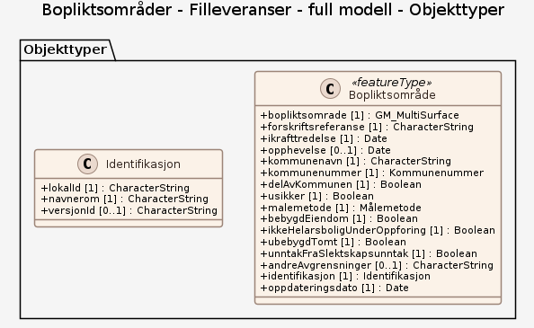

# Produktspesifikasjon: Bopliktsområder

## Generelt om spesifikasjonen

### Unik identifisering

49415185-d99f-4546-b976-18cfbf167827

#### Fullstendig navn

Bopliktsområder

#### Versjon

2025-12-11

### Referansedato

2025-12-11

### Ansvarlig organisasjon

Landbruksdirektoratet

### Språk

nor

### Sammendrag

Datasettet er under etablering.

Bopliktområder er områder med nedsatt konsesjonsgrense fastsatt med forskrift (nullgrenseforskrift). Dette er lokale regler som medfører at det er boplikt på eiendom som det etter konsesjonsloven i utgangspunktet ikke er boplikt på. Boplikten oppfylles ved at eier eller andre er registrerer seg som bosatt på eiendommen i Folkeregisteret. Formålet med slike forskrifter er å hindre at eiendommer som bør brukes til helårsbolig blir brukt til fritidsformål. Kommuner med nullgrenseforskrift har bestemt at reglene om konsesjonsfrihet uten boplikt helt eller delvis ikke gjelder.

Et bopliktområde kan gjelde en hel kommune, eller deler av denne, slik som angitt i datasettet.

En forskrift om nedsatt konsesjonsgrense kan innenfor bopliktområdet gjelde følgende eiendommer:

- bebygd eiendom som er eller har vært i bruk som helårsbolig
- eiendom med bebyggelse som ikke er tatt i bruk som helårsbolig herunder eiendom under oppføring regulert til boligformål
- ubebygd tomt regulert til boligformål

Kommunens forskrift kan fastsettes for ett eller flere av alternativene.

Nullgrenseforskriften kan også sette slektskapsunntaket ut av kraft. Det betyr at nær slekt heller ikke kan overta konsesjonsfritt uten krav om boplikt.

Forskriftene gjelder ikke der man har en bebygd eiendom som er større enn 100 dekar eller har mer enn 35 dekar fulldyrka eller overflatedyrka jord.

Datasettet er en del av tjenester for digitalisering av konsesjonsavklaringer og automatiserte tjenester knyttet til dette.

### Formål

Bopliktområdene er hjemlet i konsesjonsloven (https://lovdata.no/dokument/NL/lov/2003-11-28-98) og er fastsatt ved kommunale forskrifter (https://www.landbruksdirektoratet.no/nb/eiendom/konsesjon-paa-eiendom/kommuner-med-nedsatt-konsesjonsgrense-nullgrense). 

Formålet med datasettet er å ha en nasjonal oversikt og tilgang til områder med nedsatt konsesjonsgrense.

### Bruksområde

Bopliktområder er en del av de egenskaper knyttet til en eiendom som avgjør om denne kan omsettes konsesjonsfritt ved oppfyllelse av vilkår og innsendelse av egenerklæringsskjema, eller om det må søkes konsesjon. Datasettet kan brukes i innsynsløsninger for å informere om status for en eiendom, ved saksbehandling hos kommuner og Kartverket og ved automatiserte skjemaer for egenerklæring / konsesjonssøknad.

### Romlig representasjonstype

Vektor

### Utstrekning

**Geografisk utstrekning**:

- **Vest**: 2.0
- **Øst**: 33.0
- **Sør**: 57.0
- **Nord**: 72.0

**Tidsmessig utstrekning**:

- **Tidsperiode**:
  - **Fra**: 2025-12-11
  - **Til**: 2025-12-11

### Tilleggsinformasjon

Datasettet består av bopliktområder slik disse er definert i forskrifter. Forskriftene vedtas i hver enkelt kommune og fastsettes av Landbruksdirektoratet. Datasettet oppdateres når nye forskrifter fastsettes og publiseres på Lovdata. 

I tillegg til selve bopliktområdene inneholder datasettet informasjon om materielle vilkår knyttet til boplikten. 

I enkelte kommuner er forskriften formulert slik at en automatisk bekreftelse av hvorvidt en eiendom er omfattet av nedsatt konsesjonsgrense ikke er mulig. Disse områdene er gitt egenskapen "usikker = 1". I disse områdene forutsettes det en manuell verifisering av bopliktens geografiske avgrensning.

### Begrensninger

**Juridiske begrensninger**:

- **Tilgangsbegrensninger**: Åpne data
- **Bruksbegrensninger**: Lisens
- **Lisens**: No conditions apply to access and use
- **Lisenslenke**: <http://inspire.ec.europa.eu/metadata-codelist/ConditionsApplyingToAccessAndUse/noConditionsApply>

## Spesifikasjonsomfang

- **Omfang**:

  - **Identifikasjon**: hele datasettet
  - **Nivå**: dataset
  - **Utstrekning**: - **Beskrivelse**: National
  - **Nivåbeskrivelse**:
    #### Filleveranser - full modell
    Datamodellen dokumenterer filleveranser i form av GML-filer, SOSI-filer, Filgeodatabaser.

## Innhold og struktur

**Beskrivelse**: Bopliktområder er en del av de egenskaper knyttet til en eiendom som avgjør om denne kan omsettes konsesjonsfritt ved oppfyllelse av vilkår og innsendelse av egenerklæringsskjema, eller om det må søkes konsesjon. Datasettet kan brukes i innsynsløsninger for å informere om status for en eiendom, ved saksbehandling hos kommuner og Kartverket og ved automatiserte skjemaer for egenerklæring / konsesjonssøknad.

### Datamodell - Filleveranser - full modell

[Objektkatalog - Filleveranser - full modell](filleveranser-full-modell/objektkatalog.html)

## Kvalitet

**Nivå**: dataset

**Beskrivelse**:
Datasettet består av bopliktområder slik disse er definert i forskrifter. Forskriftene vedtas i hver enkelt kommune og fastsettes av Landbruksdirektoratet. Datasettet oppdateres når nye forskrifter fastsettes og publiseres på Lovdata. 

I tillegg til selve bopliktområdene inneholder datasettet informasjon om materielle vilkår knyttet til boplikten. 

I enkelte kommuner er forskriften formulert slik at en automatisk bekreftelse av hvorvidt en eiendom er omfattet av nedsatt konsesjonsgrense ikke er mulig. Disse områdene er gitt egenskapen "usikker = 1". I disse områdene forutsettes det en manuell verifisering av bopliktens geografiske avgrensning.

## Datavedlikehold

**Vedlikeholdsfrekvens**: Etter behov

## Leveranse

- **Leveranse**:

  - **Leveransemedium**:
    - **unitsOfDelivery**: landsfiler
    - **Medienavn**: Egen nedlastningsside
    - **Leveransetjeneste**:
      - **Tjenesteegenskap**:
        - **type**: Egen nedlastningsside
        - **Verdi**: WWW:DOWNLOAD-1.0-http--download
  - **Leveranseformat**: - **Formatnavn**: GeoJSON

## Metadata

**Metadatastandard**: ISO19115

**Metadatastandardversjon**: 2003

**Metadatadato**: 2026-01-29

**språk**: nor

**Kontakt**:

- **Organisasjon**: Landbruksdirektoratet
- **Logo**: <https://register.geonorge.no/data/organizations/981544315_Landbruksdirektoratet_liten.png>
- **Epost**: TorGunnar.overli@avinet.no
- **rolle**: pointOfContact

**Metadataidentifikator**:

- **Utsteder**: Geonorge
- **kode**: 49415185-d99f-4546-b976-18cfbf167827
- **koderom**: <https://kartkatalog.geonorge.no/metadata/>
- **Metadatalenke**: <https://kartkatalog.geonorge.no/metadata/49415185-d99f-4546-b976-18cfbf167827>

**Lenker**:

- **lenke**: <https://www.geonorge.no/geonetwork/srv/nor/csw?service=CSW&request=GetRecordById&version=2.0.2&outputSchema=http://www.isotc211.org/2005/gmd&elementSetName=full&id=49415185-d99f-4546-b976-18cfbf167827>
  **relasjon**: describedby
  **type**: application/xml
  **tittel**: Metadata (ISO 19139)
