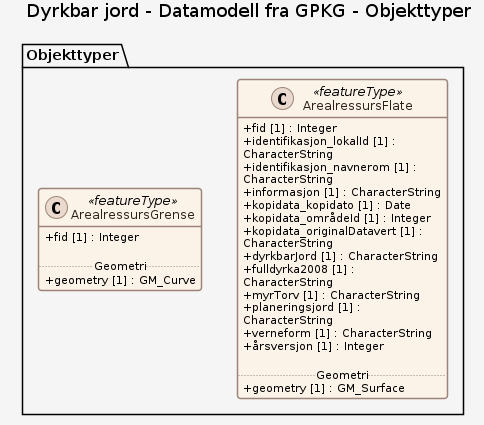

### Datamodell

**Kilde:** [GeoPackage](https://arnevik.net/test/FT_OK.gpkg)

#### ArealressursFlate

et sammenhengende areal som er tilordnet de samme egenskapsverdiene i henhold til et arealressursklassifikasjonssystem -- Definition -- a continuous area which has been assigned the same attribute values in accordance with an area resource classification system

Geometri: Elementtype: feature Type: geometry-polygon Lagrings-CRS: • <a href="http://www.opengis.net/def/crs/EPSG/0/25833"><http://www.opengis.net/def/crs/EPSG/0/25833></a> Koordinatreferansesystem (crs): • <a href="http://www.opengis.net/def/crs/EPSG/0/25833"><http://www.opengis.net/def/crs/EPSG/0/25833></a>

Egenskaper

<table class="feature-attribute-table">
  <colgroup>
    <col style="width: 35%;" />
    <col style="width: 65%;" />
  </colgroup>
  <tbody>
    <tr>
      <th scope="row">Navn:</th>
      <td><strong>geometry</strong></td>
    </tr>
    <tr>
      <th scope="row">Definisjon:</th>
      <td>Elementtype: feature</td>
    </tr>
    <tr>
      <th scope="row">Type:</th>
      <td>geometry-polygon</td>
    </tr>
    <tr>
      <th scope="row">OGC-rolle:</th>
      <td>primary-geometry</td>
    </tr>
  </tbody>
</table>

<table class="feature-attribute-table">
  <colgroup>
    <col style="width: 35%;" />
    <col style="width: 65%;" />
  </colgroup>
  <tbody>
    <tr>
      <th scope="row">Navn:</th>
      <td><strong>fid</strong></td>
    </tr>
    <tr>
      <th scope="row">Multiplisitet:</th>
      <td>1</td>
    </tr>
    <tr>
      <th scope="row">Type:</th>
      <td>integer</td>
    </tr>
    <tr>
      <th scope="row">OGC-rolle:</th>
      <td>id</td>
    </tr>
  </tbody>
</table>

<table class="feature-attribute-table">
  <colgroup>
    <col style="width: 35%;" />
    <col style="width: 65%;" />
  </colgroup>
  <tbody>
    <tr>
      <th scope="row">Navn:</th>
      <td><strong>identifikasjon_lokalId</strong></td>
    </tr>
    <tr>
      <th scope="row">Multiplisitet:</th>
      <td>1</td>
    </tr>
    <tr>
      <th scope="row">Type:</th>
      <td>string</td>
    </tr>
  </tbody>
</table>

<table class="feature-attribute-table">
  <colgroup>
    <col style="width: 35%;" />
    <col style="width: 65%;" />
  </colgroup>
  <tbody>
    <tr>
      <th scope="row">Navn:</th>
      <td><strong>identifikasjon_navnerom</strong></td>
    </tr>
    <tr>
      <th scope="row">Multiplisitet:</th>
      <td>1</td>
    </tr>
    <tr>
      <th scope="row">Type:</th>
      <td>string</td>
    </tr>
  </tbody>
</table>

<table class="feature-attribute-table">
  <colgroup>
    <col style="width: 35%;" />
    <col style="width: 65%;" />
  </colgroup>
  <tbody>
    <tr>
      <th scope="row">Navn:</th>
      <td><strong>informasjon</strong></td>
    </tr>
    <tr>
      <th scope="row">Multiplisitet:</th>
      <td>1</td>
    </tr>
    <tr>
      <th scope="row">Type:</th>
      <td>string</td>
    </tr>
  </tbody>
</table>

<table class="feature-attribute-table">
  <colgroup>
    <col style="width: 35%;" />
    <col style="width: 65%;" />
  </colgroup>
  <tbody>
    <tr>
      <th scope="row">Navn:</th>
      <td><strong>kopidata_kopidato</strong></td>
    </tr>
    <tr>
      <th scope="row">Multiplisitet:</th>
      <td>1</td>
    </tr>
    <tr>
      <th scope="row">Type:</th>
      <td>dateTime</td>
    </tr>
  </tbody>
</table>

<table class="feature-attribute-table">
  <colgroup>
    <col style="width: 35%;" />
    <col style="width: 65%;" />
  </colgroup>
  <tbody>
    <tr>
      <th scope="row">Navn:</th>
      <td><strong>kopidata_områdeId</strong></td>
    </tr>
    <tr>
      <th scope="row">Multiplisitet:</th>
      <td>1</td>
    </tr>
    <tr>
      <th scope="row">Type:</th>
      <td>integer</td>
    </tr>
  </tbody>
</table>

<table class="feature-attribute-table">
  <colgroup>
    <col style="width: 35%;" />
    <col style="width: 65%;" />
  </colgroup>
  <tbody>
    <tr>
      <th scope="row">Navn:</th>
      <td><strong>kopidata_originalDatavert</strong></td>
    </tr>
    <tr>
      <th scope="row">Multiplisitet:</th>
      <td>1</td>
    </tr>
    <tr>
      <th scope="row">Type:</th>
      <td>string</td>
    </tr>
  </tbody>
</table>

<table class="feature-attribute-table">
  <colgroup>
    <col style="width: 35%;" />
    <col style="width: 65%;" />
  </colgroup>
  <tbody>
    <tr>
      <th scope="row">Navn:</th>
      <td><strong>dyrkbarJord</strong></td>
    </tr>
    <tr>
      <th scope="row">Multiplisitet:</th>
      <td>1</td>
    </tr>
    <tr>
      <th scope="row">Type:</th>
      <td>string</td>
    </tr>
  </tbody>
</table>

<table class="feature-attribute-table">
  <colgroup>
    <col style="width: 35%;" />
    <col style="width: 65%;" />
  </colgroup>
  <tbody>
    <tr>
      <th scope="row">Navn:</th>
      <td><strong>fulldyrka2008</strong></td>
    </tr>
    <tr>
      <th scope="row">Multiplisitet:</th>
      <td>1</td>
    </tr>
    <tr>
      <th scope="row">Type:</th>
      <td>string</td>
    </tr>
  </tbody>
</table>

<table class="feature-attribute-table">
  <colgroup>
    <col style="width: 35%;" />
    <col style="width: 65%;" />
  </colgroup>
  <tbody>
    <tr>
      <th scope="row">Navn:</th>
      <td><strong>myrTorv</strong></td>
    </tr>
    <tr>
      <th scope="row">Multiplisitet:</th>
      <td>1</td>
    </tr>
    <tr>
      <th scope="row">Type:</th>
      <td>string</td>
    </tr>
  </tbody>
</table>

<table class="feature-attribute-table">
  <colgroup>
    <col style="width: 35%;" />
    <col style="width: 65%;" />
  </colgroup>
  <tbody>
    <tr>
      <th scope="row">Navn:</th>
      <td><strong>planeringsjord</strong></td>
    </tr>
    <tr>
      <th scope="row">Multiplisitet:</th>
      <td>1</td>
    </tr>
    <tr>
      <th scope="row">Type:</th>
      <td>string</td>
    </tr>
  </tbody>
</table>

<table class="feature-attribute-table">
  <colgroup>
    <col style="width: 35%;" />
    <col style="width: 65%;" />
  </colgroup>
  <tbody>
    <tr>
      <th scope="row">Navn:</th>
      <td><strong>verneform</strong></td>
    </tr>
    <tr>
      <th scope="row">Multiplisitet:</th>
      <td>1</td>
    </tr>
    <tr>
      <th scope="row">Type:</th>
      <td>string</td>
    </tr>
  </tbody>
</table>

<table class="feature-attribute-table">
  <colgroup>
    <col style="width: 35%;" />
    <col style="width: 65%;" />
  </colgroup>
  <tbody>
    <tr>
      <th scope="row">Navn:</th>
      <td><strong>årsversjon</strong></td>
    </tr>
    <tr>
      <th scope="row">Multiplisitet:</th>
      <td>1</td>
    </tr>
    <tr>
      <th scope="row">Type:</th>
      <td>integer</td>
    </tr>
  </tbody>
</table>

#### ArealressursGrense

avgrensing for en eller to arealressursflater -- Definition -- delimitation for one or two area resource surfaces

Geometri: Elementtype: feature Type: geometry-line Lagrings-CRS: • <a href="http://www.opengis.net/def/crs/EPSG/0/25833"><http://www.opengis.net/def/crs/EPSG/0/25833></a> Koordinatreferansesystem (crs): • <a href="http://www.opengis.net/def/crs/EPSG/0/25833"><http://www.opengis.net/def/crs/EPSG/0/25833></a>

Egenskaper

<table class="feature-attribute-table">
  <colgroup>
    <col style="width: 35%;" />
    <col style="width: 65%;" />
  </colgroup>
  <tbody>
    <tr>
      <th scope="row">Navn:</th>
      <td><strong>geometry</strong></td>
    </tr>
    <tr>
      <th scope="row">Definisjon:</th>
      <td>Elementtype: feature</td>
    </tr>
    <tr>
      <th scope="row">Type:</th>
      <td>geometry-line</td>
    </tr>
    <tr>
      <th scope="row">OGC-rolle:</th>
      <td>primary-geometry</td>
    </tr>
  </tbody>
</table>

<table class="feature-attribute-table">
  <colgroup>
    <col style="width: 35%;" />
    <col style="width: 65%;" />
  </colgroup>
  <tbody>
    <tr>
      <th scope="row">Navn:</th>
      <td><strong>fid</strong></td>
    </tr>
    <tr>
      <th scope="row">Multiplisitet:</th>
      <td>1</td>
    </tr>
    <tr>
      <th scope="row">Type:</th>
      <td>integer</td>
    </tr>
    <tr>
      <th scope="row">OGC-rolle:</th>
      <td>id</td>
    </tr>
  </tbody>
</table>
