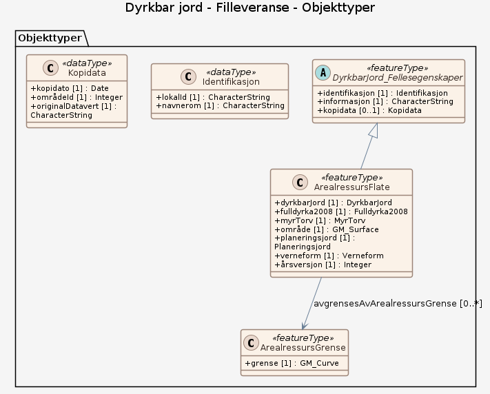

### Datamodell - Filleveranse

➡️ [Se full datamodell for omfang "Filleveranse" (diagram per pakke og objektkatalog)](filleveranse/objektkatalog.html)

### Datamodell - Datamodell fra GPKG

➡️ [Se full datamodell for omfang "Datamodell fra GPKG" (diagram per pakke og objektkatalog)](datamodell-fra-gpkg/objektkatalog.html)
