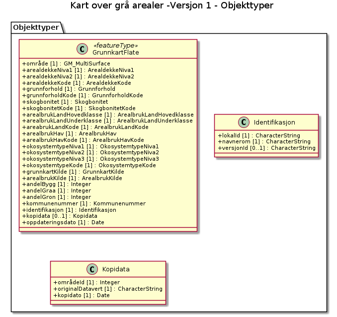

# Produktspesifikasjon: Kart over grå arealer -Versjon 1

## Innledning, historikk og endringslogg

### Innledning

### Historikk

### Endringslogg

### Normative referanser

## Definisjoner og forkortelser

### Definisjoner

### Forkortelser

## Generelt om spesifikasjonen

### Unik identifisering

c5f09d79-1546-495c-8b36-91efd4008bd7

#### Fullstendig navn

Kart over grå arealer -Versjon 1

#### Versjon

2025-11-24

### Referansedato

2025-11-24

### Ansvarlig organisasjon

Miljødirektoratet

### Språk

nor

### Hovedtema

Natur

### Temakategori

### Sammendrag

Kart over grå arealet -Versjon 1 er utviklet i samarbeidet mellom Miljødirektoratet, Kartverket, NIBIO og SSB.

Kartet er landsdekkende og viser grå arealer i henhold til Kommunal- og distriktsdepartementet sin definisjon;
«Arealer som allerede er tatt i bruk eller sterkt påvirket av menneskelig bygge- og anleggsaktivitet, inkludert bebyggelse, konstruksjoner, permanente overflater og tilhørende arealer.»

### Formål

Verktøy for planlegging 
Kartet skal kunne brukes som et verktøy for planlegging og bidra til å redusere nedbygging av natur - og jordbruksarealer, ved å synliggjøre allerede opparbeidede arealer.

Kartet er nå tilgjengelig og skal testes om det gir ønsket kunnskapsgrunnlag.

## Spesifikasjonsomfang

**Nivå**: dataset

**Utstrekning**:

- **romlig**: - **romlig omfang**: National
- **tidsmessig**: - **intervall**: - 2025-11-24, 2025-11-24

**Juridiske begrensninger**:

- **Tilgangsbegrensninger**: Norge digitalt begrenset
- **Bruksbegrensninger**: Lisens
- **Lisens**: No conditions apply to access and use
- **Lisenslenke**: <http://inspire.ec.europa.eu/metadata-codelist/ConditionsApplyingToAccessAndUse/noConditionsApply>

## Innhold og struktur

**Bruk**: Lett tilgjengelige oversikter over grå arealer i Norge vil være et viktig kunnskapsgrunnlag for å kunne realisere en mer arealgjerrig arealpolitikk gjennom fortetting og transformasjon, før nye utbyggingsområder tas i bruk.

### Datamodell

#### GrunnkartFlate

En flate i Grunnkartet som representerer et sammenhengende areal med egenskaper som arealdekke, arealbruk, økosystemtype og tilhørende informasjon om kildedata, brukt som grunnlag for arealanalyser og -regnskap.

Geometri:
- type: GM_MultiSurface

Egenskaper

<table class="feature-attribute-table">
  <colgroup>
    <col style="width: 35%;" />
    <col style="width: 65%;" />
  </colgroup>
  <tbody>
    <tr>
      <th scope="row">Navn:</th>
      <td><strong>geometry</strong></td>
    </tr>
    <tr>
      <th scope="row">Type:</th>
      <td>GM_MultiSurface</td>
    </tr>
    <tr>
      <th scope="row">OGC-rolle:</th>
      <td>primary-geometry</td>
    </tr>
  </tbody>
</table>

<table class="feature-attribute-table">
  <colgroup>
    <col style="width: 35%;" />
    <col style="width: 65%;" />
  </colgroup>
  <tbody>
    <tr>
      <th scope="row">Navn:</th>
      <td><strong>arealdekkeNiva1</strong></td>
    </tr>
    <tr>
      <th scope="row">Multiplisitet:</th>
      <td>1</td>
    </tr>
    <tr>
      <th scope="row">Type:</th>
      <td>ArealdekkeNiva1</td>
    </tr>
    <tr>
      <th scope="row">Tillatte verdier:</th>
      <td>- Kodeliste: <a href="https://register.geonorge.no/sosi-kodelister/temadata/grunnkart-arealanalyse/arealdekkeniva1">https://register.geonorge.no/sosi-kodelister/temadata/grunnkart-arealanalyse/arealdekkeniva1</a></td>
    </tr>
  </tbody>
</table>

<table class="feature-attribute-table">
  <colgroup>
    <col style="width: 35%;" />
    <col style="width: 65%;" />
  </colgroup>
  <tbody>
    <tr>
      <th scope="row">Navn:</th>
      <td><strong>arealdekkeNiva2</strong></td>
    </tr>
    <tr>
      <th scope="row">Multiplisitet:</th>
      <td>1</td>
    </tr>
    <tr>
      <th scope="row">Type:</th>
      <td>ArealdekkeNiva2</td>
    </tr>
    <tr>
      <th scope="row">Tillatte verdier:</th>
      <td>- Kodeliste: <a href="https://register.geonorge.no/sosi-kodelister/temadata/grunnkart-arealanalyse/arealdekkeniva2">https://register.geonorge.no/sosi-kodelister/temadata/grunnkart-arealanalyse/arealdekkeniva2</a></td>
    </tr>
  </tbody>
</table>

<table class="feature-attribute-table">
  <colgroup>
    <col style="width: 35%;" />
    <col style="width: 65%;" />
  </colgroup>
  <tbody>
    <tr>
      <th scope="row">Navn:</th>
      <td><strong>arealdekkeKode</strong></td>
    </tr>
    <tr>
      <th scope="row">Multiplisitet:</th>
      <td>1</td>
    </tr>
    <tr>
      <th scope="row">Type:</th>
      <td>ArealdekkeKode</td>
    </tr>
    <tr>
      <th scope="row">Tillatte verdier:</th>
      <td>- Kodeliste: <a href="https://register.geonorge.no/sosi-kodelister/temadata/grunnkart-arealanalyse/arealdekkekode">https://register.geonorge.no/sosi-kodelister/temadata/grunnkart-arealanalyse/arealdekkekode</a></td>
    </tr>
  </tbody>
</table>

<table class="feature-attribute-table">
  <colgroup>
    <col style="width: 35%;" />
    <col style="width: 65%;" />
  </colgroup>
  <tbody>
    <tr>
      <th scope="row">Navn:</th>
      <td><strong>grunnforhold</strong></td>
    </tr>
    <tr>
      <th scope="row">Multiplisitet:</th>
      <td>1</td>
    </tr>
    <tr>
      <th scope="row">Type:</th>
      <td>Grunnforhold</td>
    </tr>
  </tbody>
</table>

<table class="feature-attribute-table">
  <colgroup>
    <col style="width: 35%;" />
    <col style="width: 65%;" />
  </colgroup>
  <tbody>
    <tr>
      <th scope="row">Navn:</th>
      <td><strong>grunnforholdKode</strong></td>
    </tr>
    <tr>
      <th scope="row">Multiplisitet:</th>
      <td>1</td>
    </tr>
    <tr>
      <th scope="row">Type:</th>
      <td>GrunnforholdKode</td>
    </tr>
    <tr>
      <th scope="row">Tillatte verdier:</th>
      <td>- Kodeliste: <a href="https://register.geonorge.no/sosi-kodelister/temadata/grunnkart-arealanalyse/grunnforholdkode">https://register.geonorge.no/sosi-kodelister/temadata/grunnkart-arealanalyse/grunnforholdkode</a></td>
    </tr>
  </tbody>
</table>

<table class="feature-attribute-table">
  <colgroup>
    <col style="width: 35%;" />
    <col style="width: 65%;" />
  </colgroup>
  <tbody>
    <tr>
      <th scope="row">Navn:</th>
      <td><strong>skogbonitet</strong></td>
    </tr>
    <tr>
      <th scope="row">Multiplisitet:</th>
      <td>1</td>
    </tr>
    <tr>
      <th scope="row">Type:</th>
      <td>Skogbonitet</td>
    </tr>
    <tr>
      <th scope="row">Tillatte verdier:</th>
      <td>- Kodeliste: <a href="https://register.geonorge.no/sosi-kodelister/temadata/grunnkart-arealanalyse/skogbonitet">https://register.geonorge.no/sosi-kodelister/temadata/grunnkart-arealanalyse/skogbonitet</a></td>
    </tr>
  </tbody>
</table>

<table class="feature-attribute-table">
  <colgroup>
    <col style="width: 35%;" />
    <col style="width: 65%;" />
  </colgroup>
  <tbody>
    <tr>
      <th scope="row">Navn:</th>
      <td><strong>skogbonitetKode</strong></td>
    </tr>
    <tr>
      <th scope="row">Multiplisitet:</th>
      <td>1</td>
    </tr>
    <tr>
      <th scope="row">Type:</th>
      <td>SkogbonitetKode</td>
    </tr>
    <tr>
      <th scope="row">Tillatte verdier:</th>
      <td>- Kodeliste: <a href="https://register.geonorge.no/sosi-kodelister/temadata/grunnkart-arealanalyse/skogbonitetkode">https://register.geonorge.no/sosi-kodelister/temadata/grunnkart-arealanalyse/skogbonitetkode</a></td>
    </tr>
  </tbody>
</table>

<table class="feature-attribute-table">
  <colgroup>
    <col style="width: 35%;" />
    <col style="width: 65%;" />
  </colgroup>
  <tbody>
    <tr>
      <th scope="row">Navn:</th>
      <td><strong>arealbrukLandHovedklasse</strong></td>
    </tr>
    <tr>
      <th scope="row">Multiplisitet:</th>
      <td>1</td>
    </tr>
    <tr>
      <th scope="row">Type:</th>
      <td>ArealbrukLandHovedklasse</td>
    </tr>
    <tr>
      <th scope="row">Tillatte verdier:</th>
      <td>- Kodeliste: <a href="https://register.geonorge.no/sosi-kodelister/temadata/ssbarealbruk/ssbarealbrukhovedklasse">https://register.geonorge.no/sosi-kodelister/temadata/ssbarealbruk/ssbarealbrukhovedklasse</a></td>
    </tr>
  </tbody>
</table>

<table class="feature-attribute-table">
  <colgroup>
    <col style="width: 35%;" />
    <col style="width: 65%;" />
  </colgroup>
  <tbody>
    <tr>
      <th scope="row">Navn:</th>
      <td><strong>arealbrukLandUnderklasse</strong></td>
    </tr>
    <tr>
      <th scope="row">Multiplisitet:</th>
      <td>1</td>
    </tr>
    <tr>
      <th scope="row">Type:</th>
      <td>ArealbrukLandUnderklasse</td>
    </tr>
    <tr>
      <th scope="row">Tillatte verdier:</th>
      <td>- Kodeliste: <a href="https://register.geonorge.no/sosi-kodelister/temadata/ssbarealbruk/ssbarealbrukunderklasse">https://register.geonorge.no/sosi-kodelister/temadata/ssbarealbruk/ssbarealbrukunderklasse</a></td>
    </tr>
  </tbody>
</table>

<table class="feature-attribute-table">
  <colgroup>
    <col style="width: 35%;" />
    <col style="width: 65%;" />
  </colgroup>
  <tbody>
    <tr>
      <th scope="row">Navn:</th>
      <td><strong>areabrukLandKode</strong></td>
    </tr>
    <tr>
      <th scope="row">Multiplisitet:</th>
      <td>1</td>
    </tr>
    <tr>
      <th scope="row">Type:</th>
      <td>ArealbrukLandKode</td>
    </tr>
    <tr>
      <th scope="row">Tillatte verdier:</th>
      <td>- Kodeliste: <a href="https://register.geonorge.no/sosi-kodelister/temadata/ssbarealbruk/ssbarealbrukkode">https://register.geonorge.no/sosi-kodelister/temadata/ssbarealbruk/ssbarealbrukkode</a></td>
    </tr>
  </tbody>
</table>

<table class="feature-attribute-table">
  <colgroup>
    <col style="width: 35%;" />
    <col style="width: 65%;" />
  </colgroup>
  <tbody>
    <tr>
      <th scope="row">Navn:</th>
      <td><strong>arealbrukHav</strong></td>
    </tr>
    <tr>
      <th scope="row">Multiplisitet:</th>
      <td>1</td>
    </tr>
    <tr>
      <th scope="row">Type:</th>
      <td>ArealbrukHav</td>
    </tr>
  </tbody>
</table>

<table class="feature-attribute-table">
  <colgroup>
    <col style="width: 35%;" />
    <col style="width: 65%;" />
  </colgroup>
  <tbody>
    <tr>
      <th scope="row">Navn:</th>
      <td><strong>arealbrukHavKode</strong></td>
    </tr>
    <tr>
      <th scope="row">Multiplisitet:</th>
      <td>1</td>
    </tr>
    <tr>
      <th scope="row">Type:</th>
      <td>ArealbrukHavKode</td>
    </tr>
    <tr>
      <th scope="row">Tillatte verdier:</th>
      <td>- Kodeliste: <a href="https://register.geonorge.no/sosi-kodelister/temadata/ssbarealbruk/ssbarealbrukhavkode">https://register.geonorge.no/sosi-kodelister/temadata/ssbarealbruk/ssbarealbrukhavkode</a></td>
    </tr>
  </tbody>
</table>

<table class="feature-attribute-table">
  <colgroup>
    <col style="width: 35%;" />
    <col style="width: 65%;" />
  </colgroup>
  <tbody>
    <tr>
      <th scope="row">Navn:</th>
      <td><strong>okosystemtypeNiva1</strong></td>
    </tr>
    <tr>
      <th scope="row">Multiplisitet:</th>
      <td>1</td>
    </tr>
    <tr>
      <th scope="row">Type:</th>
      <td>OkosystemtypeNiva1</td>
    </tr>
    <tr>
      <th scope="row">Tillatte verdier:</th>
      <td>- Kodeliste: <a href="https://register.geonorge.no/sosi-kodelister/temadata/grunnkart-arealanalyse/okosystemtype1">https://register.geonorge.no/sosi-kodelister/temadata/grunnkart-arealanalyse/okosystemtype1</a></td>
    </tr>
  </tbody>
</table>

<table class="feature-attribute-table">
  <colgroup>
    <col style="width: 35%;" />
    <col style="width: 65%;" />
  </colgroup>
  <tbody>
    <tr>
      <th scope="row">Navn:</th>
      <td><strong>okosystemtypeNiva2</strong></td>
    </tr>
    <tr>
      <th scope="row">Multiplisitet:</th>
      <td>1</td>
    </tr>
    <tr>
      <th scope="row">Type:</th>
      <td>OkosystemtypeNiva2</td>
    </tr>
    <tr>
      <th scope="row">Tillatte verdier:</th>
      <td>- Kodeliste: <a href="https://register.geonorge.no/sosi-kodelister/temadata/grunnkart-arealanalyse/okosystemtype2">https://register.geonorge.no/sosi-kodelister/temadata/grunnkart-arealanalyse/okosystemtype2</a></td>
    </tr>
  </tbody>
</table>

<table class="feature-attribute-table">
  <colgroup>
    <col style="width: 35%;" />
    <col style="width: 65%;" />
  </colgroup>
  <tbody>
    <tr>
      <th scope="row">Navn:</th>
      <td><strong>okosystemtypeNiva3</strong></td>
    </tr>
    <tr>
      <th scope="row">Multiplisitet:</th>
      <td>1</td>
    </tr>
    <tr>
      <th scope="row">Type:</th>
      <td>OkosystemtypeNiva3</td>
    </tr>
    <tr>
      <th scope="row">Tillatte verdier:</th>
      <td>- Kodeliste: <a href="https://register.geonorge.no/sosi-kodelister/temadata/grunnkart-arealanalyse/okosystemtype3">https://register.geonorge.no/sosi-kodelister/temadata/grunnkart-arealanalyse/okosystemtype3</a></td>
    </tr>
  </tbody>
</table>

<table class="feature-attribute-table">
  <colgroup>
    <col style="width: 35%;" />
    <col style="width: 65%;" />
  </colgroup>
  <tbody>
    <tr>
      <th scope="row">Navn:</th>
      <td><strong>okosystemtypeKode</strong></td>
    </tr>
    <tr>
      <th scope="row">Multiplisitet:</th>
      <td>1</td>
    </tr>
    <tr>
      <th scope="row">Type:</th>
      <td>OkosystemtypeKode</td>
    </tr>
    <tr>
      <th scope="row">Tillatte verdier:</th>
      <td>- Kodeliste: <a href="https://register.geonorge.no/sosi-kodelister/temadata/grunnkart-arealanalyse/okosystemtypekode">https://register.geonorge.no/sosi-kodelister/temadata/grunnkart-arealanalyse/okosystemtypekode</a></td>
    </tr>
  </tbody>
</table>

<table class="feature-attribute-table">
  <colgroup>
    <col style="width: 35%;" />
    <col style="width: 65%;" />
  </colgroup>
  <tbody>
    <tr>
      <th scope="row">Navn:</th>
      <td><strong>grunnkartKilde</strong></td>
    </tr>
    <tr>
      <th scope="row">Multiplisitet:</th>
      <td>1</td>
    </tr>
    <tr>
      <th scope="row">Type:</th>
      <td>GrunnkartKilde</td>
    </tr>
    <tr>
      <th scope="row">Tillatte verdier:</th>
      <td>- Kodeliste: <a href="https://register.geonorge.no/sosi-kodelister/temadata/grunnkart-arealanalyse/grunnkartkilde">https://register.geonorge.no/sosi-kodelister/temadata/grunnkart-arealanalyse/grunnkartkilde</a></td>
    </tr>
  </tbody>
</table>

<table class="feature-attribute-table">
  <colgroup>
    <col style="width: 35%;" />
    <col style="width: 65%;" />
  </colgroup>
  <tbody>
    <tr>
      <th scope="row">Navn:</th>
      <td><strong>arealbrukKilde</strong></td>
    </tr>
    <tr>
      <th scope="row">Multiplisitet:</th>
      <td>1</td>
    </tr>
    <tr>
      <th scope="row">Type:</th>
      <td>ArealbrukKilde</td>
    </tr>
    <tr>
      <th scope="row">Tillatte verdier:</th>
      <td>- Kodeliste: <a href="https://register.geonorge.no/sosi-kodelister/temadata/ssbarealbruk/ssbarealbrukkilde">https://register.geonorge.no/sosi-kodelister/temadata/ssbarealbruk/ssbarealbrukkilde</a></td>
    </tr>
  </tbody>
</table>

<table class="feature-attribute-table">
  <colgroup>
    <col style="width: 35%;" />
    <col style="width: 65%;" />
  </colgroup>
  <tbody>
    <tr>
      <th scope="row">Navn:</th>
      <td><strong>andelBygg</strong></td>
    </tr>
    <tr>
      <th scope="row">Multiplisitet:</th>
      <td>1</td>
    </tr>
    <tr>
      <th scope="row">Type:</th>
      <td>Integer</td>
    </tr>
  </tbody>
</table>

<table class="feature-attribute-table">
  <colgroup>
    <col style="width: 35%;" />
    <col style="width: 65%;" />
  </colgroup>
  <tbody>
    <tr>
      <th scope="row">Navn:</th>
      <td><strong>andelGraa</strong></td>
    </tr>
    <tr>
      <th scope="row">Multiplisitet:</th>
      <td>1</td>
    </tr>
    <tr>
      <th scope="row">Type:</th>
      <td>Integer</td>
    </tr>
  </tbody>
</table>

<table class="feature-attribute-table">
  <colgroup>
    <col style="width: 35%;" />
    <col style="width: 65%;" />
  </colgroup>
  <tbody>
    <tr>
      <th scope="row">Navn:</th>
      <td><strong>andelGron</strong></td>
    </tr>
    <tr>
      <th scope="row">Multiplisitet:</th>
      <td>1</td>
    </tr>
    <tr>
      <th scope="row">Type:</th>
      <td>Integer</td>
    </tr>
  </tbody>
</table>

<table class="feature-attribute-table">
  <colgroup>
    <col style="width: 35%;" />
    <col style="width: 65%;" />
  </colgroup>
  <tbody>
    <tr>
      <th scope="row">Navn:</th>
      <td><strong>kommunenummer</strong></td>
    </tr>
    <tr>
      <th scope="row">Multiplisitet:</th>
      <td>1</td>
    </tr>
    <tr>
      <th scope="row">Type:</th>
      <td>Kommunenummer</td>
    </tr>
    <tr>
      <th scope="row">Tillatte verdier:</th>
      <td>- Kodeliste: <a href="https://register.geonorge.no/sosi-kodelister/inndelinger/inndelingsbase/kommunenummer">https://register.geonorge.no/sosi-kodelister/inndelinger/inndelingsbase/kommunenummer</a></td>
    </tr>
  </tbody>
</table>

<table class="feature-attribute-table">
  <colgroup>
    <col style="width: 35%;" />
    <col style="width: 65%;" />
  </colgroup>
  <tbody>
    <tr>
      <th scope="row">Navn:</th>
      <td><strong>identifikasjon</strong></td>
    </tr>
    <tr>
      <th scope="row">Definisjon:</th>
      <td>unik identifikasjon av et objekt</td>
    </tr>
    <tr>
      <th scope="row">Multiplisitet:</th>
      <td>1</td>
    </tr>
    <tr>
      <th scope="row">Type:</th>
      <td>Identifikasjon</td>
    </tr>
  </tbody>
</table>

<table class="feature-attribute-table">
  <colgroup>
    <col style="width: 35%;" />
    <col style="width: 65%;" />
  </colgroup>
  <tbody>
    <tr>
      <th scope="row">Navn:</th>
      <td><strong>identifikasjon.lokalId</strong></td>
    </tr>
    <tr>
      <th scope="row">Definisjon:</th>
      <td>lokal identifikator av et objekt  Merknad: Det er dataleverendørens ansvar å sørge for at den lokale identifikatoren er unik innenfor navnerommet.</td>
    </tr>
    <tr>
      <th scope="row">Multiplisitet:</th>
      <td>1</td>
    </tr>
    <tr>
      <th scope="row">Type:</th>
      <td>CharacterString</td>
    </tr>
  </tbody>
</table>

<table class="feature-attribute-table">
  <colgroup>
    <col style="width: 35%;" />
    <col style="width: 65%;" />
  </colgroup>
  <tbody>
    <tr>
      <th scope="row">Navn:</th>
      <td><strong>identifikasjon.navnerom</strong></td>
    </tr>
    <tr>
      <th scope="row">Definisjon:</th>
      <td>navnerom som unikt identifiserer datakilden til et objekt, anbefales å være en http-URI  Eksempel: <a href="http://data.geonorge.no/SentraltStedsnavnsregister/1.0">http://data.geonorge.no/SentraltStedsnavnsregister/1.0</a>  Merknad : Verdien for nanverom vil eies av den dataprodusent som har ansvar for de unike identifikatorene og må være registrert i data.geonorge.no eller data.norge.no</td>
    </tr>
    <tr>
      <th scope="row">Multiplisitet:</th>
      <td>1</td>
    </tr>
    <tr>
      <th scope="row">Type:</th>
      <td>CharacterString</td>
    </tr>
  </tbody>
</table>

<table class="feature-attribute-table">
  <colgroup>
    <col style="width: 35%;" />
    <col style="width: 65%;" />
  </colgroup>
  <tbody>
    <tr>
      <th scope="row">Navn:</th>
      <td><strong>identifikasjon.versjonId</strong></td>
    </tr>
    <tr>
      <th scope="row">Definisjon:</th>
      <td>identifikasjon av en spesiell versjon av et geografisk objekt (instans)</td>
    </tr>
    <tr>
      <th scope="row">Multiplisitet:</th>
      <td>0..1</td>
    </tr>
    <tr>
      <th scope="row">Type:</th>
      <td>CharacterString</td>
    </tr>
  </tbody>
</table>

<table class="feature-attribute-table">
  <colgroup>
    <col style="width: 35%;" />
    <col style="width: 65%;" />
  </colgroup>
  <tbody>
    <tr>
      <th scope="row">Navn:</th>
      <td><strong>kopidata</strong></td>
    </tr>
    <tr>
      <th scope="row">Definisjon:</th>
      <td>angivelse av at objektet er hentet fra et kopidatasett og ikke fra originaldatasettet  Merknad: Inneholder informasjon om når kopidatasettet ble kopiert fra originaldatasettet og hvem som er originaldataansvarlig</td>
    </tr>
    <tr>
      <th scope="row">Multiplisitet:</th>
      <td>0..1</td>
    </tr>
    <tr>
      <th scope="row">Type:</th>
      <td>Kopidata</td>
    </tr>
  </tbody>
</table>

<table class="feature-attribute-table">
  <colgroup>
    <col style="width: 35%;" />
    <col style="width: 65%;" />
  </colgroup>
  <tbody>
    <tr>
      <th scope="row">Navn:</th>
      <td><strong>kopidata.områdeId</strong></td>
    </tr>
    <tr>
      <th scope="row">Definisjon:</th>
      <td>identifikasjon av område som dataene dekker  Merknad: Kan angis med kommunenummer eller fylkesnummer. Disse bør spesifiseres nærmere.</td>
    </tr>
    <tr>
      <th scope="row">Multiplisitet:</th>
      <td>1</td>
    </tr>
    <tr>
      <th scope="row">Type:</th>
      <td>Integer</td>
    </tr>
  </tbody>
</table>

<table class="feature-attribute-table">
  <colgroup>
    <col style="width: 35%;" />
    <col style="width: 65%;" />
  </colgroup>
  <tbody>
    <tr>
      <th scope="row">Navn:</th>
      <td><strong>kopidata.originalDatavert</strong></td>
    </tr>
    <tr>
      <th scope="row">Definisjon:</th>
      <td>ansvarlig etat for forvaltning av data</td>
    </tr>
    <tr>
      <th scope="row">Multiplisitet:</th>
      <td>1</td>
    </tr>
    <tr>
      <th scope="row">Type:</th>
      <td>CharacterString</td>
    </tr>
  </tbody>
</table>

<table class="feature-attribute-table">
  <colgroup>
    <col style="width: 35%;" />
    <col style="width: 65%;" />
  </colgroup>
  <tbody>
    <tr>
      <th scope="row">Navn:</th>
      <td><strong>kopidata.kopidato</strong></td>
    </tr>
    <tr>
      <th scope="row">Definisjon:</th>
      <td>dato når objektet ble kopiert fra originaldatasettet  Merknad: Er en del av egenskapen Kopidata. Brukes i de tilfeller hvor en kopidatabase brukes til distribusjon. Å kopiere et datasett til en kopidatabase skal ikke føre til at Oppdateringsdato blir endret. Eventuell redigering av data i et kopidatasett medfører ny Oppdateringsdato, Datafangstdato og/eller Verifiseringsdato.</td>
    </tr>
    <tr>
      <th scope="row">Multiplisitet:</th>
      <td>1</td>
    </tr>
    <tr>
      <th scope="row">Type:</th>
      <td>DateTime</td>
    </tr>
  </tbody>
</table>

<table class="feature-attribute-table">
  <colgroup>
    <col style="width: 35%;" />
    <col style="width: 65%;" />
  </colgroup>
  <tbody>
    <tr>
      <th scope="row">Navn:</th>
      <td><strong>oppdateringsdato</strong></td>
    </tr>
    <tr>
      <th scope="row">Definisjon:</th>
      <td>tidspunkt for siste endring på objektet  Merknad: Oppdateringsdato kan være forskjellig fra datafangsdato ved at data som er registrert kan bufres en kortere eller lengre periode før disse legges inn i datasystemet (databasen).</td>
    </tr>
    <tr>
      <th scope="row">Multiplisitet:</th>
      <td>1</td>
    </tr>
    <tr>
      <th scope="row">Type:</th>
      <td>DateTime</td>
    </tr>
  </tbody>
</table>

## Referansesystem

**Romlige referansesystemer**:

- **kode**: EPSG:25833
  **navn**: EUREF89 UTM sone 33, 2d

- **kode**: EPSG:25833
  **navn**: EUREF89 UTM sone 33, 2d

**Romlig representasjonstype**: Vektor

## Kvalitet

**Nivå**: dataset

- **navn**: Prosentvis dekning i forhold til datasettets utstrekning
  **Måleparameter**: Datasettets faktiske kartlagte areal i forhold til datasettets spesifiserte utstrekning
  **Resultat**: 100

- **navn**: Coverage
  **Resultat**: Prosentvis dekning i forhold til datasettets utstrekning: 100%

## Datafangst

## Datavedlikehold

**Vedlikeholdsfrekvens**: Ikke planlagt

**Vedlikeholdsnotat**: Lett tilgjengelige oversikter over grå arealer i Norge vil være et viktig kunnskapsgrunnlag for å kunne realisere en mer arealgjerrig arealpolitikk gjennom fortetting og transformasjon, før nye utbyggingsområder tas i bruk.

**Status**: Under arbeid

## Presentasjon

**Tegnforklaring**:
<https://register.geonorge.no/tegneregler/kart-over-grå-arealer>

## Leveranse

**Distribusjoner**:

- **format**: - **format**: GEONORGE:DOWNLOAD
  **tilgang**:

  - **lenke**: <https://nedlasting.geonorge.no/api/capabilities/>
  - **protokoll**: GEONORGE:DOWNLOAD

- **tittel**: Geonorge nedlastning
  **format**: - **format**: Geonorge nedlastning
  **tilgang**:

  - **lenke**: <https://nedlasting.geonorge.no/api/capabilities/>
  - **protokoll**: GEONORGE:DOWNLOAD

- **tittel**: Kart over grå arealer WMS (Testversjon 1)
  **format**: - **format**: [{}]
  **tilgang**:

  - **lenke**: <https://wms.nibio.no/cgi-bin/graastruktur?service=wms&request=GetCapabilities>
  - **protokoll**: WMS-tjeneste
  - **Lisens**: Åpne data
  **Notater**: Tjeneste

## Metadata

**Standard**: ISO19115

**Standardversjon**: 2003

**Metadatadato**: 2025-12-16

**språk**: nor

**Kontaktpunkt**:

- **organisasjon**: Kartverket
- **epost**: bernt.audun.stromsli@kartverket.no
- **rolle**: pointOfContact

**Identifikatorer**:

- **Utsteder**: geonorge
  **kode**: c5f09d79-1546-495c-8b36-91efd4008bd7

**Metadatalenke**:
<https://www.geonorge.no/geonetwork/srv/nor/csw?service=CSW&request=GetRecordById&version=2.0.2&outputSchema=http://www.isotc211.org/2005/gmd&elementSetName=full&id=c5f09d79-1546-495c-8b36-91efd4008bd7>
