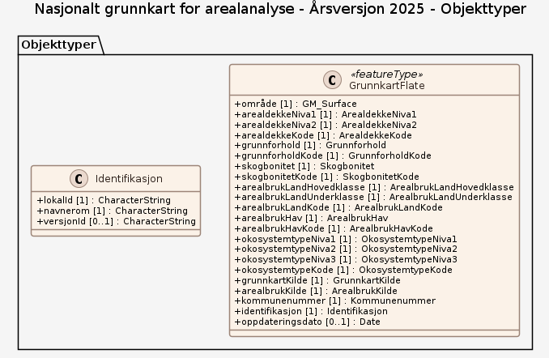

# Produktspesifikasjon: Nasjonalt grunnkart for arealanalyse - Årsversjon 2025

## Generelt om spesifikasjonen

### Unik identifisering

28c28e3a-d88f-4a34-8c60-5efe6d56a44d

#### Fullstendig navn

Nasjonalt grunnkart for arealanalyse - Årsversjon 2025

#### Versjon

2024-02-13

### Referansedato

2026-02-16

### Ansvarlig organisasjon

Statistisk sentralbyrå

### Språk

nor

### Hovedtema

Grunnkart, Arealregnskap, Arealstatistikk, Økosystemtyper, Arealanalyse, ØkologiskGrunnkart, Det offentlige kartgrunnlaget, geodataloven, arealplanerPBL, Plan

### Sammendrag

Nasjonalt grunnkart for arealanalyse er tilgjengelig som **årsversjon 2025**. 
Nå er GML- og Geopackage filer av årsversjon 2025 tilgjengelig for nedlasting. FGDB vil legges ut fortløpende når disse er klare.

**Dersom du ønsker å se på Årsversjon 2025 av Grunnkartet, er den nye WMS-tjenesten tilgjengelig.** Mer informasjon om WMS-tjenesten finner du på <https://kartkatalog.geonorge.no/Metadata/c7dc425b-60cd-42f7-a84e-202c7d7b912a>. 

- - -

Grunnkartet er utviklet i samarbeid mellom NIBIO, SSB, Kartverket og Miljødirektoratet, og er ment som et felles datagrunnlag for ulike typer arealanalyser.

Datasettet bygger på eksisterende data fra det offentlige kartgrunnlaget (DOK), som viser arealressurs- og arealbruksdata, og innebærer ingen nykartlegging.  Kildedata som er brukt i denne versjonen var oppdatert per 01.01.2025. I tillegg til arealressurs- og arealbruksdata er det lagt inn økosysteminformasjon i henhold til Eurostats klassifikasjonssystem. Grunnkartet kan kobles med andre datakilder, som for eksempel arealplaner, og benyttes som grunnlag for ulike typer arealanalyser og arealregnskap. Les mer om datainnhold og metode under Prosesshistorie.

**Rapporter**

* Alle endringer som er implementert i Årsversjon 2025 er samlet i rapporten [Nasjonalt grunnkart for arealanalyse - Årsversjon 2025](https://doi.org/10.21350/4m2k-7z04)

* Alle tilbakemeldinger til Testversjon 2 er samlet i rapporten [Nasjonalt grunnkart for arealanalyse, Testversjon 2 - Tilbakemeldinger og vurderinger](https://www.kartverket.no/globalassets/forskning-og-utvikling/rapporter/nasjonalt-grunnkart-for-arealanalyse-testversjon-2-tilbakemeldinger-og-vurderinger.pdf).

* Alle endringer som er implementert i Testversjon 2 er samlet i rapporten [Testversjon 2 - Nasjonalt grunnkart for bruk i arealregnskap](https://hdl.handle.net/11250/3185743)

* Alle tilbakemeldinger til Testversjon 1 er samlet i rapporten [Grunnkart for bruk i arealregnskap - Tilbakemeldinger, vurderinger og anbefalinger](https://www.kartverket.no/globalassets/forskning-og-utvikling/rapporter/rapport-grunnkart-for-bruk-i-arealregnskap-tilbakemeldinger-vurderinger-og-anbefalinger-2.pdf).

* Les mer om metode og bruk av Grunnkartet i rapporten [Grunnkart for bruk i arealregnskap](https://hdl.handle.net/11250/3120510)

### Formål

Nasjonalt grunnkart for arealanalyse er en sammenstilling av grunnleggende datasett som danner basis for ulike typer arealregnskap. Formålet er å tilrettelegge data for kommunal og regional forvaltning, slik at blant annet kostnadskrevende dobbeltarbeid unngås. Et felles kartgrunnlag gjør det også enklere å sammenligne arealregnskap på tvers av sektorer. Dette gir kommuner og fylker, sammen med rådgivende firmaer, mulighet til å fokusere på å tilrettelegge supplerende temadata for å lage sektorspesifikke regnskap.

## Spesifikasjonsomfang

**Nivå**: dataset

**Utstrekning**:

- **tidsmessig**: - **intervall**: - 2024-02-13, 2026-02-16

**Juridiske begrensninger**:

- **Tilgangsbegrensninger**: Norge digitalt begrenset
- **Bruksbegrensninger**: Lisens
- **Lisens**: No conditions apply to access and use
- **Lisenslenke**: <http://inspire.ec.europa.eu/metadata-codelist/ConditionsApplyingToAccessAndUse/noConditionsApply>

## Innhold og struktur

**Bruk**:
Grunnkartet kan brukes som grunnlag for etablering av arealanalyse, og kan suppleres med spesifikke data tilpasset ulike regnskapsformål, slik som kommuneplaner, miljødata eller jordegenskaper. 

Kommunal- og distriktsdepartementet (KDD) publiserte i 2023 en veileder for arealregnskap i kommunene (https://www.regjeringen.no/no/dokumenter/arealregnskap-i-kommuneplan/id3017913/), som gir oversikt over relevante datakilder og metoder. Årsversjonen 2025 av Grunnkartet supplerer og delvis erstatter datakildene som er nevnt i denne veilederen. For andre typer arealregnskap må det utvikles egne metoder med tilhørende veiledere.

### Datamodell

#### GrunnkartFlate

En flate i Grunnkartet som representerer et sammenhengende areal med egenskaper som arealdekke, arealbruk, økosystemtype og tilhørende informasjon om kildedata, brukt som grunnlag for arealanalyser og -regnskap.

Egenskaper

<table class="feature-attribute-table">
  <colgroup>
    <col style="width: 35%;" />
    <col style="width: 65%;" />
  </colgroup>
  <tbody>
    <tr>
      <th scope="row">Navn:</th>
      <td><strong>område</strong></td>
    </tr>
    <tr>
      <th scope="row">Definisjon:</th>
      <td>den geografiske avgrensingen av Grunnkartflaten</td>
    </tr>
    <tr>
      <th scope="row">Multiplisitet:</th>
      <td>1</td>
    </tr>
    <tr>
      <th scope="row">Type:</th>
      <td>GM_Surface</td>
    </tr>
  </tbody>
</table>

<table class="feature-attribute-table">
  <colgroup>
    <col style="width: 35%;" />
    <col style="width: 65%;" />
  </colgroup>
  <tbody>
    <tr>
      <th scope="row">Navn:</th>
      <td><strong>arealdekkeNiva1</strong></td>
    </tr>
    <tr>
      <th scope="row">Multiplisitet:</th>
      <td>1</td>
    </tr>
    <tr>
      <th scope="row">Type:</th>
      <td>ArealdekkeNiva1</td>
    </tr>
    <tr>
      <th scope="row">Tillatte verdier:</th>
      <td>- Kodeliste: <a href="https://register.geonorge.no/sosi-kodelister/temadata/grunnkart-arealanalyse/arealdekkeniva1">https://register.geonorge.no/sosi-kodelister/temadata/grunnkart-arealanalyse/arealdekkeniva1</a></td>
    </tr>
  </tbody>
</table>

<table class="feature-attribute-table">
  <colgroup>
    <col style="width: 35%;" />
    <col style="width: 65%;" />
  </colgroup>
  <tbody>
    <tr>
      <th scope="row">Navn:</th>
      <td><strong>arealdekkeNiva2</strong></td>
    </tr>
    <tr>
      <th scope="row">Multiplisitet:</th>
      <td>1</td>
    </tr>
    <tr>
      <th scope="row">Type:</th>
      <td>ArealdekkeNiva2</td>
    </tr>
    <tr>
      <th scope="row">Tillatte verdier:</th>
      <td>- Kodeliste: <a href="https://register.geonorge.no/sosi-kodelister/temadata/grunnkart-arealanalyse/arealdekkeniva2">https://register.geonorge.no/sosi-kodelister/temadata/grunnkart-arealanalyse/arealdekkeniva2</a></td>
    </tr>
  </tbody>
</table>

<table class="feature-attribute-table">
  <colgroup>
    <col style="width: 35%;" />
    <col style="width: 65%;" />
  </colgroup>
  <tbody>
    <tr>
      <th scope="row">Navn:</th>
      <td><strong>arealdekkeKode</strong></td>
    </tr>
    <tr>
      <th scope="row">Multiplisitet:</th>
      <td>1</td>
    </tr>
    <tr>
      <th scope="row">Type:</th>
      <td>ArealdekkeKode</td>
    </tr>
    <tr>
      <th scope="row">Tillatte verdier:</th>
      <td>- Kodeliste: <a href="https://register.geonorge.no/sosi-kodelister/temadata/grunnkart-arealanalyse/arealdekkekode">https://register.geonorge.no/sosi-kodelister/temadata/grunnkart-arealanalyse/arealdekkekode</a></td>
    </tr>
  </tbody>
</table>

<table class="feature-attribute-table">
  <colgroup>
    <col style="width: 35%;" />
    <col style="width: 65%;" />
  </colgroup>
  <tbody>
    <tr>
      <th scope="row">Navn:</th>
      <td><strong>grunnforhold</strong></td>
    </tr>
    <tr>
      <th scope="row">Multiplisitet:</th>
      <td>1</td>
    </tr>
    <tr>
      <th scope="row">Type:</th>
      <td>Grunnforhold</td>
    </tr>
    <tr>
      <th scope="row">Tillatte verdier:</th>
      <td>- Kodeliste: <a href="https://register.geonorge.no/sosi-kodelister/temadata/grunnkart-arealanalyse/grunnforhold">https://register.geonorge.no/sosi-kodelister/temadata/grunnkart-arealanalyse/grunnforhold</a></td>
    </tr>
  </tbody>
</table>

<table class="feature-attribute-table">
  <colgroup>
    <col style="width: 35%;" />
    <col style="width: 65%;" />
  </colgroup>
  <tbody>
    <tr>
      <th scope="row">Navn:</th>
      <td><strong>grunnforholdKode</strong></td>
    </tr>
    <tr>
      <th scope="row">Multiplisitet:</th>
      <td>1</td>
    </tr>
    <tr>
      <th scope="row">Type:</th>
      <td>GrunnforholdKode</td>
    </tr>
    <tr>
      <th scope="row">Tillatte verdier:</th>
      <td>- Kodeliste: <a href="https://register.geonorge.no/sosi-kodelister/temadata/grunnkart-arealanalyse/grunnforholdkode">https://register.geonorge.no/sosi-kodelister/temadata/grunnkart-arealanalyse/grunnforholdkode</a></td>
    </tr>
  </tbody>
</table>

<table class="feature-attribute-table">
  <colgroup>
    <col style="width: 35%;" />
    <col style="width: 65%;" />
  </colgroup>
  <tbody>
    <tr>
      <th scope="row">Navn:</th>
      <td><strong>skogbonitet</strong></td>
    </tr>
    <tr>
      <th scope="row">Multiplisitet:</th>
      <td>1</td>
    </tr>
    <tr>
      <th scope="row">Type:</th>
      <td>Skogbonitet</td>
    </tr>
    <tr>
      <th scope="row">Tillatte verdier:</th>
      <td>- Kodeliste: <a href="https://register.geonorge.no/sosi-kodelister/temadata/grunnkart-arealanalyse/skogbonitet">https://register.geonorge.no/sosi-kodelister/temadata/grunnkart-arealanalyse/skogbonitet</a></td>
    </tr>
  </tbody>
</table>

<table class="feature-attribute-table">
  <colgroup>
    <col style="width: 35%;" />
    <col style="width: 65%;" />
  </colgroup>
  <tbody>
    <tr>
      <th scope="row">Navn:</th>
      <td><strong>skogbonitetKode</strong></td>
    </tr>
    <tr>
      <th scope="row">Multiplisitet:</th>
      <td>1</td>
    </tr>
    <tr>
      <th scope="row">Type:</th>
      <td>SkogbonitetKode</td>
    </tr>
    <tr>
      <th scope="row">Tillatte verdier:</th>
      <td>- Kodeliste: <a href="https://register.geonorge.no/sosi-kodelister/temadata/grunnkart-arealanalyse/skogbonitetkode">https://register.geonorge.no/sosi-kodelister/temadata/grunnkart-arealanalyse/skogbonitetkode</a></td>
    </tr>
  </tbody>
</table>

<table class="feature-attribute-table">
  <colgroup>
    <col style="width: 35%;" />
    <col style="width: 65%;" />
  </colgroup>
  <tbody>
    <tr>
      <th scope="row">Navn:</th>
      <td><strong>arealbrukLandHovedklasse</strong></td>
    </tr>
    <tr>
      <th scope="row">Multiplisitet:</th>
      <td>1</td>
    </tr>
    <tr>
      <th scope="row">Type:</th>
      <td>ArealbrukLandHovedklasse</td>
    </tr>
    <tr>
      <th scope="row">Tillatte verdier:</th>
      <td>- Kodeliste: <a href="https://register.geonorge.no/sosi-kodelister/temadata/ssbarealbruk/ssbarealbrukhovedklasse">https://register.geonorge.no/sosi-kodelister/temadata/ssbarealbruk/ssbarealbrukhovedklasse</a></td>
    </tr>
  </tbody>
</table>

<table class="feature-attribute-table">
  <colgroup>
    <col style="width: 35%;" />
    <col style="width: 65%;" />
  </colgroup>
  <tbody>
    <tr>
      <th scope="row">Navn:</th>
      <td><strong>arealbrukLandUnderklasse</strong></td>
    </tr>
    <tr>
      <th scope="row">Multiplisitet:</th>
      <td>1</td>
    </tr>
    <tr>
      <th scope="row">Type:</th>
      <td>ArealbrukLandUnderklasse</td>
    </tr>
    <tr>
      <th scope="row">Tillatte verdier:</th>
      <td>- Kodeliste: <a href="https://register.geonorge.no/sosi-kodelister/temadata/ssbarealbruk/ssbarealbrukunderklasse">https://register.geonorge.no/sosi-kodelister/temadata/ssbarealbruk/ssbarealbrukunderklasse</a></td>
    </tr>
  </tbody>
</table>

<table class="feature-attribute-table">
  <colgroup>
    <col style="width: 35%;" />
    <col style="width: 65%;" />
  </colgroup>
  <tbody>
    <tr>
      <th scope="row">Navn:</th>
      <td><strong>arealbrukLandKode</strong></td>
    </tr>
    <tr>
      <th scope="row">Multiplisitet:</th>
      <td>1</td>
    </tr>
    <tr>
      <th scope="row">Type:</th>
      <td>ArealbrukLandKode</td>
    </tr>
    <tr>
      <th scope="row">Tillatte verdier:</th>
      <td>- Kodeliste: <a href="https://register.geonorge.no/sosi-kodelister/temadata/ssbarealbruk/ssbarealbrukkode">https://register.geonorge.no/sosi-kodelister/temadata/ssbarealbruk/ssbarealbrukkode</a></td>
    </tr>
  </tbody>
</table>

<table class="feature-attribute-table">
  <colgroup>
    <col style="width: 35%;" />
    <col style="width: 65%;" />
  </colgroup>
  <tbody>
    <tr>
      <th scope="row">Navn:</th>
      <td><strong>arealbrukHav</strong></td>
    </tr>
    <tr>
      <th scope="row">Multiplisitet:</th>
      <td>1</td>
    </tr>
    <tr>
      <th scope="row">Type:</th>
      <td>ArealbrukHav</td>
    </tr>
    <tr>
      <th scope="row">Tillatte verdier:</th>
      <td>- Kodeliste: <a href="https://register.geonorge.no/sosi-kodelister/temadata/ssbarealbruk/ssbarealbrukhav">https://register.geonorge.no/sosi-kodelister/temadata/ssbarealbruk/ssbarealbrukhav</a></td>
    </tr>
  </tbody>
</table>

<table class="feature-attribute-table">
  <colgroup>
    <col style="width: 35%;" />
    <col style="width: 65%;" />
  </colgroup>
  <tbody>
    <tr>
      <th scope="row">Navn:</th>
      <td><strong>arealbrukHavKode</strong></td>
    </tr>
    <tr>
      <th scope="row">Multiplisitet:</th>
      <td>1</td>
    </tr>
    <tr>
      <th scope="row">Type:</th>
      <td>ArealbrukHavKode</td>
    </tr>
    <tr>
      <th scope="row">Tillatte verdier:</th>
      <td>- Kodeliste: <a href="https://register.geonorge.no/sosi-kodelister/temadata/ssbarealbruk/ssbarealbrukhavkode">https://register.geonorge.no/sosi-kodelister/temadata/ssbarealbruk/ssbarealbrukhavkode</a></td>
    </tr>
  </tbody>
</table>

<table class="feature-attribute-table">
  <colgroup>
    <col style="width: 35%;" />
    <col style="width: 65%;" />
  </colgroup>
  <tbody>
    <tr>
      <th scope="row">Navn:</th>
      <td><strong>okosystemtypeNiva1</strong></td>
    </tr>
    <tr>
      <th scope="row">Multiplisitet:</th>
      <td>1</td>
    </tr>
    <tr>
      <th scope="row">Type:</th>
      <td>OkosystemtypeNiva1</td>
    </tr>
    <tr>
      <th scope="row">Tillatte verdier:</th>
      <td>- Kodeliste: <a href="https://register.geonorge.no/sosi-kodelister/temadata/grunnkart-arealanalyse/okosystemtypeniva1">https://register.geonorge.no/sosi-kodelister/temadata/grunnkart-arealanalyse/okosystemtypeniva1</a></td>
    </tr>
  </tbody>
</table>

<table class="feature-attribute-table">
  <colgroup>
    <col style="width: 35%;" />
    <col style="width: 65%;" />
  </colgroup>
  <tbody>
    <tr>
      <th scope="row">Navn:</th>
      <td><strong>okosystemtypeNiva2</strong></td>
    </tr>
    <tr>
      <th scope="row">Multiplisitet:</th>
      <td>1</td>
    </tr>
    <tr>
      <th scope="row">Type:</th>
      <td>OkosystemtypeNiva2</td>
    </tr>
    <tr>
      <th scope="row">Tillatte verdier:</th>
      <td>- Kodeliste: <a href="https://register.geonorge.no/sosi-kodelister/temadata/grunnkart-arealanalyse/okosystemtypeniva2">https://register.geonorge.no/sosi-kodelister/temadata/grunnkart-arealanalyse/okosystemtypeniva2</a></td>
    </tr>
  </tbody>
</table>

<table class="feature-attribute-table">
  <colgroup>
    <col style="width: 35%;" />
    <col style="width: 65%;" />
  </colgroup>
  <tbody>
    <tr>
      <th scope="row">Navn:</th>
      <td><strong>okosystemtypeNiva3</strong></td>
    </tr>
    <tr>
      <th scope="row">Multiplisitet:</th>
      <td>1</td>
    </tr>
    <tr>
      <th scope="row">Type:</th>
      <td>OkosystemtypeNiva3</td>
    </tr>
    <tr>
      <th scope="row">Tillatte verdier:</th>
      <td>- Kodeliste: <a href="https://register.geonorge.no/sosi-kodelister/temadata/grunnkart-arealanalyse/okosystemtypeniva3">https://register.geonorge.no/sosi-kodelister/temadata/grunnkart-arealanalyse/okosystemtypeniva3</a></td>
    </tr>
  </tbody>
</table>

<table class="feature-attribute-table">
  <colgroup>
    <col style="width: 35%;" />
    <col style="width: 65%;" />
  </colgroup>
  <tbody>
    <tr>
      <th scope="row">Navn:</th>
      <td><strong>okosystemtypeKode</strong></td>
    </tr>
    <tr>
      <th scope="row">Multiplisitet:</th>
      <td>1</td>
    </tr>
    <tr>
      <th scope="row">Type:</th>
      <td>OkosystemtypeKode</td>
    </tr>
    <tr>
      <th scope="row">Tillatte verdier:</th>
      <td>- Kodeliste: <a href="https://register.geonorge.no/sosi-kodelister/temadata/grunnkart-arealanalyse/okosystemtypekode">https://register.geonorge.no/sosi-kodelister/temadata/grunnkart-arealanalyse/okosystemtypekode</a></td>
    </tr>
  </tbody>
</table>

<table class="feature-attribute-table">
  <colgroup>
    <col style="width: 35%;" />
    <col style="width: 65%;" />
  </colgroup>
  <tbody>
    <tr>
      <th scope="row">Navn:</th>
      <td><strong>grunnkartKilde</strong></td>
    </tr>
    <tr>
      <th scope="row">Multiplisitet:</th>
      <td>1</td>
    </tr>
    <tr>
      <th scope="row">Type:</th>
      <td>GrunnkartKilde</td>
    </tr>
    <tr>
      <th scope="row">Tillatte verdier:</th>
      <td>- Kodeliste: <a href="https://register.geonorge.no/sosi-kodelister/temadata/grunnkart-arealanalyse/grunnkartkilde">https://register.geonorge.no/sosi-kodelister/temadata/grunnkart-arealanalyse/grunnkartkilde</a></td>
    </tr>
  </tbody>
</table>

<table class="feature-attribute-table">
  <colgroup>
    <col style="width: 35%;" />
    <col style="width: 65%;" />
  </colgroup>
  <tbody>
    <tr>
      <th scope="row">Navn:</th>
      <td><strong>arealbrukKilde</strong></td>
    </tr>
    <tr>
      <th scope="row">Multiplisitet:</th>
      <td>1</td>
    </tr>
    <tr>
      <th scope="row">Type:</th>
      <td>ArealbrukKilde</td>
    </tr>
    <tr>
      <th scope="row">Tillatte verdier:</th>
      <td>- Kodeliste: <a href="https://register.geonorge.no/sosi-kodelister/temadata/ssbarealbruk/ssbarealbrukkilde">https://register.geonorge.no/sosi-kodelister/temadata/ssbarealbruk/ssbarealbrukkilde</a></td>
    </tr>
  </tbody>
</table>

<table class="feature-attribute-table">
  <colgroup>
    <col style="width: 35%;" />
    <col style="width: 65%;" />
  </colgroup>
  <tbody>
    <tr>
      <th scope="row">Navn:</th>
      <td><strong>kommunenummer</strong></td>
    </tr>
    <tr>
      <th scope="row">Multiplisitet:</th>
      <td>1</td>
    </tr>
    <tr>
      <th scope="row">Type:</th>
      <td>Kommunenummer</td>
    </tr>
    <tr>
      <th scope="row">Tillatte verdier:</th>
      <td>- Kodeliste: <a href="https://register.geonorge.no/sosi-kodelister/inndelinger/inndelingsbase/kommunenummer">https://register.geonorge.no/sosi-kodelister/inndelinger/inndelingsbase/kommunenummer</a></td>
    </tr>
  </tbody>
</table>

<table class="feature-attribute-table">
  <colgroup>
    <col style="width: 35%;" />
    <col style="width: 65%;" />
  </colgroup>
  <tbody>
    <tr>
      <th scope="row">Navn:</th>
      <td><strong>identifikasjon</strong></td>
    </tr>
    <tr>
      <th scope="row">Definisjon:</th>
      <td>unik identifikasjon av et objekt</td>
    </tr>
    <tr>
      <th scope="row">Multiplisitet:</th>
      <td>1</td>
    </tr>
    <tr>
      <th scope="row">Type:</th>
      <td>Identifikasjon</td>
    </tr>
  </tbody>
</table>

<table class="feature-attribute-table">
  <colgroup>
    <col style="width: 35%;" />
    <col style="width: 65%;" />
  </colgroup>
  <tbody>
    <tr>
      <th scope="row">Navn:</th>
      <td><strong>identifikasjon.lokalId</strong></td>
    </tr>
    <tr>
      <th scope="row">Definisjon:</th>
      <td>lokal identifikator av et objekt  Merknad: Det er dataleverendørens ansvar å sørge for at den lokale identifikatoren er unik innenfor navnerommet.</td>
    </tr>
    <tr>
      <th scope="row">Multiplisitet:</th>
      <td>1</td>
    </tr>
    <tr>
      <th scope="row">Type:</th>
      <td>CharacterString</td>
    </tr>
  </tbody>
</table>

<table class="feature-attribute-table">
  <colgroup>
    <col style="width: 35%;" />
    <col style="width: 65%;" />
  </colgroup>
  <tbody>
    <tr>
      <th scope="row">Navn:</th>
      <td><strong>identifikasjon.navnerom</strong></td>
    </tr>
    <tr>
      <th scope="row">Definisjon:</th>
      <td>navnerom som unikt identifiserer datakilden til et objekt, anbefales å være en http-URI  Eksempel: <a href="http://data.geonorge.no/SentraltStedsnavnsregister/1.0">http://data.geonorge.no/SentraltStedsnavnsregister/1.0</a>  Merknad : Verdien for nanverom vil eies av den dataprodusent som har ansvar for de unike identifikatorene og må være registrert i data.geonorge.no eller data.norge.no</td>
    </tr>
    <tr>
      <th scope="row">Multiplisitet:</th>
      <td>1</td>
    </tr>
    <tr>
      <th scope="row">Type:</th>
      <td>CharacterString</td>
    </tr>
  </tbody>
</table>

<table class="feature-attribute-table">
  <colgroup>
    <col style="width: 35%;" />
    <col style="width: 65%;" />
  </colgroup>
  <tbody>
    <tr>
      <th scope="row">Navn:</th>
      <td><strong>identifikasjon.versjonId</strong></td>
    </tr>
    <tr>
      <th scope="row">Definisjon:</th>
      <td>identifikasjon av en spesiell versjon av et geografisk objekt (instans)</td>
    </tr>
    <tr>
      <th scope="row">Multiplisitet:</th>
      <td>0..1</td>
    </tr>
    <tr>
      <th scope="row">Type:</th>
      <td>CharacterString</td>
    </tr>
  </tbody>
</table>

<table class="feature-attribute-table">
  <colgroup>
    <col style="width: 35%;" />
    <col style="width: 65%;" />
  </colgroup>
  <tbody>
    <tr>
      <th scope="row">Navn:</th>
      <td><strong>oppdateringsdato</strong></td>
    </tr>
    <tr>
      <th scope="row">Definisjon:</th>
      <td>tidspunkt for siste endring på objektet  Merknad: Oppdateringsdato kan være forskjellig fra datafangsdato ved at data som er registrert kan bufres en kortere eller lengre periode før disse legges inn i datasystemet (databasen).</td>
    </tr>
    <tr>
      <th scope="row">Multiplisitet:</th>
      <td>0..1</td>
    </tr>
    <tr>
      <th scope="row">Type:</th>
      <td>DateTime</td>
    </tr>
  </tbody>
</table>

### Kodelister

#### «CodeList» ArealdekkeNiva1

**Definisjon:** Viser hovedklasser for arealressurser med vekt på produksjonsgrunnlaget for jord- og skogbruk, som jordbruksareal, skog, vann og bebygd areal

Profilparametre i tagged values

<table class="feature-attribute-table">
  <colgroup>
    <col style="width: 35%;" />
    <col style="width: 65%;" />
  </colgroup>
  <tbody>
    <tr>
      <th scope="row">asDictionary</th>
      <td>true</td>
    </tr>
    <tr>
      <th scope="row">codeList</th>
      <td><a href="https://register.geonorge.no/sosi-kodelister/temadata/grunnkart-arealanalyse/arealdekkeniva1">https://register.geonorge.no/sosi-kodelister/temadata/grunnkart-arealanalyse/arealdekkeniva1</a></td>
    </tr>
  </tbody>
</table>

#### «CodeList» ArealdekkeNiva2

**Definisjon:** Gir en mer detaljert inndeling av arealressursene innenfor hovedklassene, for eksempel fulldyrka jord, myr eller åpen fastmark

Profilparametre i tagged values

<table class="feature-attribute-table">
  <colgroup>
    <col style="width: 35%;" />
    <col style="width: 65%;" />
  </colgroup>
  <tbody>
    <tr>
      <th scope="row">asDictionary</th>
      <td>true</td>
    </tr>
    <tr>
      <th scope="row">codeList</th>
      <td><a href="https://register.geonorge.no/sosi-kodelister/temadata/grunnkart-arealanalyse/arealdekkeniva2">https://register.geonorge.no/sosi-kodelister/temadata/grunnkart-arealanalyse/arealdekkeniva2</a></td>
    </tr>
  </tbody>
</table>

#### «CodeList» ArealdekkeKode

**Definisjon:** Standardisert tallkode for arealdekke på begge nivåer

Profilparametre i tagged values

<table class="feature-attribute-table">
  <colgroup>
    <col style="width: 35%;" />
    <col style="width: 65%;" />
  </colgroup>
  <tbody>
    <tr>
      <th scope="row">asDictionary</th>
      <td>true</td>
    </tr>
    <tr>
      <th scope="row">codeList</th>
      <td><a href="https://register.geonorge.no/sosi-kodelister/temadata/grunnkart-arealanalyse/arealdekkekode">https://register.geonorge.no/sosi-kodelister/temadata/grunnkart-arealanalyse/arealdekkekode</a></td>
    </tr>
  </tbody>
</table>

#### «CodeList» Grunnforhold

**Definisjon:** Grunnforhold gir informasjon om tjukkelse, type og utbredelse av jorddekket i alle områder under skoggrensen

Profilparametre i tagged values

<table class="feature-attribute-table">
  <colgroup>
    <col style="width: 35%;" />
    <col style="width: 65%;" />
  </colgroup>
  <tbody>
    <tr>
      <th scope="row">asDictionary</th>
      <td>true</td>
    </tr>
    <tr>
      <th scope="row">codeList</th>
      <td><a href="https://register.geonorge.no/sosi-kodelister/temadata/grunnkart-arealanalyse/grunnforhold">https://register.geonorge.no/sosi-kodelister/temadata/grunnkart-arealanalyse/grunnforhold</a></td>
    </tr>
  </tbody>
</table>

#### «CodeList» GrunnforholdKode

**Definisjon:** Standardisert tallkode for grunnforhold

Profilparametre i tagged values

<table class="feature-attribute-table">
  <colgroup>
    <col style="width: 35%;" />
    <col style="width: 65%;" />
  </colgroup>
  <tbody>
    <tr>
      <th scope="row">asDictionary</th>
      <td>true</td>
    </tr>
    <tr>
      <th scope="row">codeList</th>
      <td><a href="https://register.geonorge.no/sosi-kodelister/temadata/grunnkart-arealanalyse/grunnforholdkode">https://register.geonorge.no/sosi-kodelister/temadata/grunnkart-arealanalyse/grunnforholdkode</a></td>
    </tr>
  </tbody>
</table>

#### «CodeList» Skogbonitet

**Definisjon:** Et mål på arealets evne til å produsere trevirke, basert på trærnes høydevekst, alder, vegetasjonstype og forekomst av spesielle plantearter

Profilparametre i tagged values

<table class="feature-attribute-table">
  <colgroup>
    <col style="width: 35%;" />
    <col style="width: 65%;" />
  </colgroup>
  <tbody>
    <tr>
      <th scope="row">asDictionary</th>
      <td>true</td>
    </tr>
    <tr>
      <th scope="row">codeList</th>
      <td><a href="https://register.geonorge.no/sosi-kodelister/temadata/grunnkart-arealanalyse/skogbonitet">https://register.geonorge.no/sosi-kodelister/temadata/grunnkart-arealanalyse/skogbonitet</a></td>
    </tr>
  </tbody>
</table>

#### «CodeList» SkogbonitetKode

**Definisjon:** Standardisert tallkode for skogbonitet

Profilparametre i tagged values

<table class="feature-attribute-table">
  <colgroup>
    <col style="width: 35%;" />
    <col style="width: 65%;" />
  </colgroup>
  <tbody>
    <tr>
      <th scope="row">asDictionary</th>
      <td>true</td>
    </tr>
    <tr>
      <th scope="row">codeList</th>
      <td><a href="https://register.geonorge.no/sosi-kodelister/temadata/grunnkart-arealanalyse/skogbonitetkode">https://register.geonorge.no/sosi-kodelister/temadata/grunnkart-arealanalyse/skogbonitetkode</a></td>
    </tr>
  </tbody>
</table>

#### «CodeList» ArealbrukLandHovedklasse

**Definisjon:** Gir oversikt over bebygd og opparbeidet areal og beskriver den fysiske bruken av arealet, som bolig, næring eller samferdsel på et overordnet nivå.

Profilparametre i tagged values

<table class="feature-attribute-table">
  <colgroup>
    <col style="width: 35%;" />
    <col style="width: 65%;" />
  </colgroup>
  <tbody>
    <tr>
      <th scope="row">asDictionary</th>
      <td>true</td>
    </tr>
    <tr>
      <th scope="row">codeList</th>
      <td><a href="https://register.geonorge.no/sosi-kodelister/temadata/ssbarealbruk/ssbarealbrukhovedklasse">https://register.geonorge.no/sosi-kodelister/temadata/ssbarealbruk/ssbarealbrukhovedklasse</a></td>
    </tr>
  </tbody>
</table>

#### «CodeList» ArealbrukLandUnderklasse

**Definisjon:** Gir oversikt over bebygd og opparbeidet areal og beskriver den fysiske bruken av arealet, som bolig, næring eller samferdsel på et detaljert nivå.

Profilparametre i tagged values

<table class="feature-attribute-table">
  <colgroup>
    <col style="width: 35%;" />
    <col style="width: 65%;" />
  </colgroup>
  <tbody>
    <tr>
      <th scope="row">asDictionary</th>
      <td>true</td>
    </tr>
    <tr>
      <th scope="row">codeList</th>
      <td><a href="https://register.geonorge.no/sosi-kodelister/temadata/ssbarealbruk/ssbarealbrukunderklasse">https://register.geonorge.no/sosi-kodelister/temadata/ssbarealbruk/ssbarealbrukunderklasse</a></td>
    </tr>
  </tbody>
</table>

#### «CodeList» ArealbrukLandKode

**Definisjon:** Standardisert tallkode for arealbruk på land for begge nivåer.

Profilparametre i tagged values

<table class="feature-attribute-table">
  <colgroup>
    <col style="width: 35%;" />
    <col style="width: 65%;" />
  </colgroup>
  <tbody>
    <tr>
      <th scope="row">asDictionary</th>
      <td>true</td>
    </tr>
    <tr>
      <th scope="row">codeList</th>
      <td><a href="https://register.geonorge.no/sosi-kodelister/temadata/ssbarealbruk/ssbarealbrukkode">https://register.geonorge.no/sosi-kodelister/temadata/ssbarealbruk/ssbarealbrukkode</a></td>
    </tr>
  </tbody>
</table>

#### «CodeList» ArealbrukHav

**Definisjon:** Klassifisering av stedbundet arealbruk i havområder.

Profilparametre i tagged values

<table class="feature-attribute-table">
  <colgroup>
    <col style="width: 35%;" />
    <col style="width: 65%;" />
  </colgroup>
  <tbody>
    <tr>
      <th scope="row">asDictionary</th>
      <td>true</td>
    </tr>
    <tr>
      <th scope="row">codeList</th>
      <td><a href="https://register.geonorge.no/sosi-kodelister/temadata/ssbarealbruk/ssbarealbrukhav">https://register.geonorge.no/sosi-kodelister/temadata/ssbarealbruk/ssbarealbrukhav</a></td>
    </tr>
  </tbody>
</table>

#### «CodeList» ArealbrukHavKode

**Definisjon:** Standardisert tallkode for arealbruk i hav.

Profilparametre i tagged values

<table class="feature-attribute-table">
  <colgroup>
    <col style="width: 35%;" />
    <col style="width: 65%;" />
  </colgroup>
  <tbody>
    <tr>
      <th scope="row">asDictionary</th>
      <td>true</td>
    </tr>
    <tr>
      <th scope="row">codeList</th>
      <td><a href="https://register.geonorge.no/sosi-kodelister/temadata/ssbarealbruk/ssbarealbrukhavkode">https://register.geonorge.no/sosi-kodelister/temadata/ssbarealbruk/ssbarealbrukhavkode</a></td>
    </tr>
  </tbody>
</table>

#### «CodeList» OkosystemtypeNiva1

**Definisjon:** Økosystemklasse nivå 1 har 12 klasser, og deler kartet inn i hovedøkosystemer etter europeisk arealtypologi utviklet spesielt til bruk i naturregnskap (Eurostat)

Profilparametre i tagged values

<table class="feature-attribute-table">
  <colgroup>
    <col style="width: 35%;" />
    <col style="width: 65%;" />
  </colgroup>
  <tbody>
    <tr>
      <th scope="row">asDictionary</th>
      <td>true</td>
    </tr>
    <tr>
      <th scope="row">codeList</th>
      <td><a href="https://register.geonorge.no/sosi-kodelister/temadata/grunnkart-arealanalyse/okosystemtypeniva1">https://register.geonorge.no/sosi-kodelister/temadata/grunnkart-arealanalyse/okosystemtypeniva1</a></td>
    </tr>
  </tbody>
</table>

#### «CodeList» OkosystemtypeNiva2

**Definisjon:** Økosystemklasse nivå 2 gir en videre inndeling av de 12 klassene i nivå 1. Inndelingen følger europeisk arealtypologi utviklet spesielt til bruk i naturregnskap (Eurostat)

Profilparametre i tagged values

<table class="feature-attribute-table">
  <colgroup>
    <col style="width: 35%;" />
    <col style="width: 65%;" />
  </colgroup>
  <tbody>
    <tr>
      <th scope="row">asDictionary</th>
      <td>true</td>
    </tr>
    <tr>
      <th scope="row">codeList</th>
      <td><a href="https://register.geonorge.no/sosi-kodelister/temadata/grunnkart-arealanalyse/okosystemtypeniva2">https://register.geonorge.no/sosi-kodelister/temadata/grunnkart-arealanalyse/okosystemtypeniva2</a></td>
    </tr>
  </tbody>
</table>

#### «CodeList» OkosystemtypeNiva3

**Definisjon:** Økosystemklasse nivå 3 gir en videre inndeling av økosystemklasse 1 og 2. Inndelingen følger europeisk arealtypologi utviklet spesielt til bruk i naturregnskap (Eurostat)

Profilparametre i tagged values

<table class="feature-attribute-table">
  <colgroup>
    <col style="width: 35%;" />
    <col style="width: 65%;" />
  </colgroup>
  <tbody>
    <tr>
      <th scope="row">asDictionary</th>
      <td>true</td>
    </tr>
    <tr>
      <th scope="row">codeList</th>
      <td><a href="https://register.geonorge.no/sosi-kodelister/temadata/grunnkart-arealanalyse/okosystemtypeniva3">https://register.geonorge.no/sosi-kodelister/temadata/grunnkart-arealanalyse/okosystemtypeniva3</a></td>
    </tr>
  </tbody>
</table>

#### «CodeList» OkosystemtypeKode

**Definisjon:** Standardisert tallkode for økosystemtyper på alle tre nivåer

Profilparametre i tagged values

<table class="feature-attribute-table">
  <colgroup>
    <col style="width: 35%;" />
    <col style="width: 65%;" />
  </colgroup>
  <tbody>
    <tr>
      <th scope="row">asDictionary</th>
      <td>true</td>
    </tr>
    <tr>
      <th scope="row">codeList</th>
      <td><a href="https://register.geonorge.no/sosi-kodelister/temadata/grunnkart-arealanalyse/okosystemtypekode">https://register.geonorge.no/sosi-kodelister/temadata/grunnkart-arealanalyse/okosystemtypekode</a></td>
    </tr>
  </tbody>
</table>

#### «CodeList» GrunnkartKilde

**Definisjon:** Spesifiserer kilden for avgrensningen av grunnkart-flaten

Profilparametre i tagged values

<table class="feature-attribute-table">
  <colgroup>
    <col style="width: 35%;" />
    <col style="width: 65%;" />
  </colgroup>
  <tbody>
    <tr>
      <th scope="row">asDictionary</th>
      <td>true</td>
    </tr>
    <tr>
      <th scope="row">codeList</th>
      <td><a href="https://register.geonorge.no/sosi-kodelister/temadata/grunnkart-arealanalyse/grunnkartkilde">https://register.geonorge.no/sosi-kodelister/temadata/grunnkart-arealanalyse/grunnkartkilde</a></td>
    </tr>
  </tbody>
</table>

#### «CodeList» ArealbrukKilde

**Definisjon:** Spesifiserer kilden for arealbruksinformasjonen.

Profilparametre i tagged values

<table class="feature-attribute-table">
  <colgroup>
    <col style="width: 35%;" />
    <col style="width: 65%;" />
  </colgroup>
  <tbody>
    <tr>
      <th scope="row">asDictionary</th>
      <td>true</td>
    </tr>
    <tr>
      <th scope="row">codeList</th>
      <td><a href="https://register.geonorge.no/sosi-kodelister/temadata/ssbarealbruk/ssbarealbrukkilde">https://register.geonorge.no/sosi-kodelister/temadata/ssbarealbruk/ssbarealbrukkilde</a></td>
    </tr>
  </tbody>
</table>

#### «CodeList» Kommunenummer

**Definisjon:** nummerering av kommunen i henhold til Statistisk sentralbyrå sin offisielle liste

Merknad: Det presiseres at kommune alltid skal ha 4 siffer, dvs. eventuelt med ledende null. Kommune benyttes for kopling mot en rekke andre registre som også benytter 4 siffer.

Profilparametre i tagged values

<table class="feature-attribute-table">
  <colgroup>
    <col style="width: 35%;" />
    <col style="width: 65%;" />
  </colgroup>
  <tbody>
    <tr>
      <th scope="row">asDictionary</th>
      <td>true</td>
    </tr>
    <tr>
      <th scope="row">codeList</th>
      <td><a href="https://register.geonorge.no/sosi-kodelister/inndelinger/inndelingsbase/kommunenummer">https://register.geonorge.no/sosi-kodelister/inndelinger/inndelingsbase/kommunenummer</a></td>
    </tr>
  </tbody>
</table>

## Referansesystem

**Romlige referansesystemer**:

- **kode**: EPSG:25832
  **navn**: EUREF89 UTM sone 32, 2d

- **kode**: EPSG:25833
  **navn**: EUREF89 UTM sone 33, 2d

- **kode**: EPSG:25835
  **navn**: EUREF89 UTM sone 35, 2d

- **kode**: EPSG:4258
  **navn**: EUREF 89 Geografisk (ETRS 89) 2d

- **kode**: EPSG:25832
  **navn**: EUREF89 UTM sone 32, 2d

**Romlig representasjonstype**: Vektor

## Kvalitet

**Nivå**: dataset

- **navn**: Prosentvis oppfyllelse av FAIR-prinsipper
  **Måleparameter**: Angir fullstendighet i forhold til krav fra FAIR-prinsippene (The FAIR Guiding Principles for scientific data management and stewardship)
  **Resultat**: 85

- **navn**: FAIR
  **Resultat**: Prosentvis oppfyllelse av FAIR-prinsipper: 85%

**Beskrivelse**:
Grunnkartet kan lastes ned kommunevis for Norge digitalt-parter. WMS-tjenesten er åpen og kan benyttes for innsyn av alle.

Hvis du har tilbakemeldinger om Grunnkartet, kan du gjerne sende oss en e-post. 
Alle samarbeidspartene i prosjektet kan kontaktes ved tilbakemeldinger og/eller spørsmål. 

For generelle spørsmål og spørsmål til metode: gisdrift@nibio.no

For spørsmål knyttet til Arealbruk: mailto: GISressurssenter@ssb.no

For spørsmål knyttet til Arealdekke: gisdrift@nibio.no

For spørsmål knyttet til Økosystemtype: post@miljodir.no

## Datafangst
Arbeidet med Nasjonalt grunnkart for arealanalyse startet i 2023 som et samarbeid mellom NIBIO, SSB, Kartverket og Miljødirektoratet. Arbeidet med å etablere Grunnkartet tok utgangspunkt i metoder og datagrunnlag som allerede benyttes i arbeidet med den offentlige arealbruks- og arealressursstatistikken. Dette grunnlaget er ytterligere beriket ved å tilføre data fra andre offentlige kartdatabaser og registre, samt tilføre datasettet en økosystemkoding.
#### Testversjon 1:
Testversjon 1 av Grunnkartet ble publisert i februar 2024. Våren 2024 ble det gjennomført brukerdialog gjennom møter med utvalgte brukere og spørreskjemaer. Tilbakemeldingene pekte på behov for retting av topologifeil, tematiske avklaringer og bedre brukerveiledning.
Testversjon 1 inneholdt følgende egenskaper: Arealdekke, Arealbruk, Økosystemklasse, Grøntandel, Areal og Kommunenummer.
#### Testversjon 2:
I arbeidet med Testversjon 2 har fokuset vært å lage et mer ryddig, enklere og mer intuitivt kart. Det er blant annet arbeidet med tematiske problemstillinger rundt nomenklaturen for arealdekke og arealbruk, og det er foretatt en mer systematisk topologi- og geometrirydding. I tillegg er det inkludert arealbruk i hav. Testversjon 2 ble publisert 1. april 2025, og inkluderer forbedringer basert på tilbakemeldingene etter Testversjon 1.
Ny periode med brukerinvolvering ble gjennomført våren 2025. Innspillene vurderes og eventuelle endringer implementeres frem mot en standardisert årsversjon, som er planlagt publisert i desember 2025. Målet er at Grunnkartet skal oppdateres årlig, og videreutvikles og forvaltes innenfor rammene av det nasjonale geodatasamarbeidet.
Testversjon 2 inneholder følgende egenskaper: Arealdekke, Arealbruk, Økosystemklasse, Areal, Kommunenummer, Kilde, Treslag, Grunnforhold og Arealbruk i hav (stedfast og ikke-stedfast).

#### Tematiske detaljer
Arealdekke baseres på klassifikasjonen av arealressurs i FKB-AR5, med tilleggsinformasjon om skog og snaumark. I Testversjon 2 er dette temaet oppdelt i fire temalag; arealdekke, treslag, skogbonitet og grunnforhold. Kodingen skal være gjenkjennbar for brukere som kjenner AR5-typologien, men med noen avvik og endringer.

Arealbruksklassifikasjonen baseres på SSB-arealbruk, slik den er tilgjengelig på Geonorge. En grov inndeling av arealbruken på land er gitt i arealbruk_hovedklasse, mens en mer fininndelt klassifisering finnes i arealbruk_underklasse. Nytt i testversjon 2 er at kildedata for hvert polygon er inkludert, noe som kan gi bedre innsikt i datakvalitet og gjør det enklere å spore og rette feil. Arealbruk er gitt for bebygde og opparbeida arealer, men for ubebygde områder vil disse kolonnene være blanke.

Arealbruk i hav er nytt i Testversjon 2, og vises i to kolonner. HavArealbrukStedbundet viser installasjoner, og annen klart stedbundet aktivitet, mens HavFiskeriBruk viser områder der det foregår fiske. De to kolonnene kan ansees som en smakebit på hvordan arealbruk i hav kan framstilles, og det vil være viktig å få brukernes tilbakemeldinger på disse.

Økosystemklassifikasjonen følger, så langt det er mulig, Eurostats anbefalte klassifikasjon (3 nivåer). I bebygde områder følges den til nivå 3 så langt det har latt seg gjøre. Miljødirektoratet, med bistand fra NINA, har tilordnet Eurostat-klasser til kombinasjoner av arealdekke, arealbruk, treslag, grunnforhold, bonitet og kysttilhørighet. Som hovedregel overstyrer arealbruk arealdekke ved konflikt.

Eurostats økosystemklassifikasjon er beskrevet i NIBIO rapport 9 (143) 2023 «Hovedøkosystemkart for Norge" <https://hdl.handle.net/11250/3106442>

## Datavedlikehold

**Vedlikeholdsfrekvens**: Årlig

**Vedlikeholdsnotat**:
Grunnkartet kan brukes som grunnlag for etablering av arealanalyse, og kan suppleres med spesifikke data tilpasset ulike regnskapsformål, slik som kommuneplaner, miljødata eller jordegenskaper. 

Kommunal- og distriktsdepartementet (KDD) publiserte i 2023 en veileder for arealregnskap i kommunene (https://www.regjeringen.no/no/dokumenter/arealregnskap-i-kommuneplan/id3017913/), som gir oversikt over relevante datakilder og metoder. Årsversjonen 2025 av Grunnkartet supplerer og delvis erstatter datakildene som er nevnt i denne veilederen. For andre typer arealregnskap må det utvikles egne metoder med tilhørende veiledere.

**Status**: Under arbeid

**dataAcquisitionAndProcessing**:

- **processStep**:
  - **description**:
    Arbeidet med Nasjonalt grunnkart for arealanalyse startet i 2023 som et samarbeid mellom NIBIO, SSB, Kartverket og Miljødirektoratet. Arbeidet med å etablere Grunnkartet tok utgangspunkt i metoder og datagrunnlag som allerede benyttes i arbeidet med den offentlige arealbruks- og arealressursstatistikken. Dette grunnlaget er ytterligere beriket ved å tilføre data fra andre offentlige kartdatabaser og registre, samt tilføre datasettet en økosystemkoding. 

    *Testversjon 1* av Grunnkartet ble publisert i februar 2024. Våren 2024 ble det gjennomført brukerdialog gjennom møter med utvalgte brukere og spørreskjemaer. Tilbakemeldingene pekte på behov for retting av topologifeil, tematiske avklaringer og bedre brukerveiledning. 

    Testversjon 1 inneholdt følgende egenskaper: Arealdekke, Arealbruk, Økosystemklasse, Grøntandel, Areal og Kommunenummer.

    *Testversjon 2* ble publisert 1. april 2025, og inkluderte forbedringer basert på tilbakemeldingene etter Testversjon 1. I arbeidet med Testversjon 2 har fokuset vært å lage et mer ryddig, enklere og mer intuitivt kart. Det er blant annet arbeidet med tematiske problemstillinger rundt nomenklaturen for arealdekke og arealbruk, og det er foretatt en mer systematisk topologi- og geometrirydding. I tillegg er det inkludert arealbruk i hav.

    Testversjon 2 inneholdt følgende egenskaper: Arealdekke, Arealbruk, Økosystemklasse, Areal, Kommunenummer, Kilde, Treslag, Grunnforhold og Arealbruk i hav (stedfast og ikke-stedfast).

    Det er gjennomført brukerinvolvering mot Testversjon 2 våren 2025. Innspill og endringer i Åsversjon 2025 er dokumentert i egne rapporter.

    *Årsversjon 2025* ble publisert som WMS-tjeneste 22. desember 2025. Årsversjon 2025 er dokumentert i rapporten ”Nasjonalt grunnkart for arealanalyse – Årsversjon 2025”. Videre vil datasettet dokumenteres i form av en standard produktspesifikasjon i løpet av første halvdel av 2026.

    Årsversjon 2025 inneholder følgende egenskaper: ArealdekkeNiva1, ArealdekkeNiva2, ArealbrukLandHovedklasse, ArealbrukLandUnderklasse, ArealbrukHav, ØkosystemtypeNiva1, ØkosystemtypeNiva2, ØkosystemtypeNiva3, Kommunenummer, GrunnkartKilde, ArealbrukKilde, Skogbonitet, Grunnforhold samt ArealdekkeKode, GrunnforholdKode, SkogbonitetKode, ArealbrukLandKode, ArealbrukHavKode og OkosystemtypeKode.

    - - - 
    Tematiske detaljer

    **Arealdekke** baseres på klassifikasjonen av arealressurs i FKB-AR5, med tilleggsinformasjon om skog og snaumark. Temaet er delt inn i fire temalag; ArealdekkeNiva1, ArealdekkeNiva2,  Skogbonitet og Grunnforhold. Kodingen skal være gjenkjennbar for brukere som kjenner AR5-typologien, men med noen avvik og endringer. 

    **Arealbruksklassifikasjonen** baseres på SSB-arealbruk, slik den er tilgjengelig på Geonorge. En grov inndeling av arealbruken på land er gitt i ArealbrukLandHovedklasse, mens en mer fininndelt klassifisering finnes i ArealbrukLandUnderklasse.  Kildedata for hvert polygon er inkludert, noe som kan gi bedre innsikt i datakvalitet og gjør det enklere å spore og rette feil. Arealbruk er gitt for bebygde og opparbeida arealer, men for ubebygde områder vil disse kolonnene være blanke.

    **Arealbruk i hav** viser installasjoner, og annen klart stedbundet aktivitet.

    **Økosystemklassifikasjonen** følger, så langt det er mulig, Eurostats anbefalte klassifikasjon (3 nivåer). I bebygde områder følges den til nivå 3 så langt det har latt seg gjøre. Miljødirektoratet, med bistand fra NINA, har tilordnet Eurostat-klasser til kombinasjoner av arealdekke, arealbruk, treslag, grunnforhold, bonitet og kysttilhørighet. Som hovedregel overstyrer arealbruk arealdekke ved konflikt.

    Eurostats økosystemklassifikasjon er beskrevet i [NIBIO rapport 9 (143) 2023 Hovedøkosystemkart for Norge](https://hdl.handle.net/11250/3106442)
    - - -

## Presentasjon

**Tegnforklaring**:
<https://register.geonorge.no/tegneregler/nasjonalt-grunnkart-for-arealanalyse-årsversjon-2025>

## Leveranse

**Distribusjoner**:

- **format**: - **format**: GEONORGE:DOWNLOAD
  **tilgang**:

  - **lenke**: <https://nedlasting.geonorge.no/api/capabilities/>
  - **protokoll**: GEONORGE:DOWNLOAD

- **tittel**: Geonorge nedlastning
  **format**: - **format**: Geonorge nedlastning
  **tilgang**:

  - **lenke**: <https://nedlasting.geonorge.no/api/capabilities/>
  - **protokoll**: GEONORGE:DOWNLOAD

- **tittel**: Nasjonalt grunnkart for arealanalyse WMS - årsversjon 2025
  **format**: - **format**: OGC WMS
  **tilgang**:

  - **lenke**: <https://wms.nibio.no/cgi-bin/grunnkart_arealanalyse?service=WMS&request=GetCapabilities>
  - **protokoll**: WMS-tjeneste
  - **Lisens**: Åpne data
  **Notater**: Tjeneste

## Metadata

**Standard**: ISO19115

**Standardversjon**: 2003

**Metadatadato**: 2026-02-24

**språk**: nor

**Kontaktpunkt**:

- **organisasjon**: Kartverket
- **epost**: post@kartverket.no
- **rolle**: pointOfContact

**Identifikatorer**:

- **Utsteder**: geonorge
  **kode**: 28c28e3a-d88f-4a34-8c60-5efe6d56a44d

**Metadatalenke**:
<https://www.geonorge.no/geonetwork/srv/nor/csw?service=CSW&request=GetRecordById&version=2.0.2&outputSchema=http://www.isotc211.org/2005/gmd&elementSetName=full&id=28c28e3a-d88f-4a34-8c60-5efe6d56a44d>
