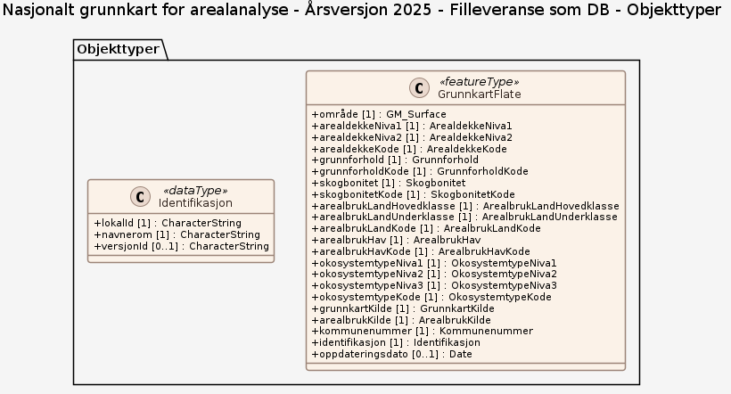

# Produktspesifikasjon: Nasjonalt grunnkart for arealanalyse - Årsversjon 2025

*Nasjonalt grunnkart for arealanalyse er tilgjengelig som **årsversjon 2025**. 
Nå er GML, FGDB og Geopackage filer av årsversjon 2025 tilgjengelig for nedlasting. 

**Dersom du ønsker å se på Årsversjon 2025 av Grunnkartet, er den nye WMS-tjenesten tilgjengelig.** Mer informasjon om WMS-tjenesten finner du på <https://kartkatalog.geonorge.no/Metadata/c7dc425b-60cd-42f7-a84e-202c7d7b912a>. 

- - - 
Velkommen til **webinar om årsversjon 2025 torsdag 23. april 2026 kl 09.00 - 10.30.** 
Du får en orientering til Grunnkartet, samt en gjennomgang av nyhetene i årsversjonen. Det vil også vises nok eksempler på praktisk bruk av kartet. 

Webinaret er åpent for alle og det vil være mulig å stille spørsmål. 
Her kan du melde deg og følge webinaret: <https://events.teams.microsoft.com/event/cc7eafa1-dcdd-492c-bde3-c30fd9cbf62e@7f74c8a2-43ce-46b2-b0e8-b6306cba73a3>

Webinaret blir ikke tatt opp. 
- - -

Grunnkartet er utviklet i samarbeid mellom NIBIO, SSB, Kartverket og Miljødirektoratet, og er ment som et felles datagrunnlag for ulike typer arealanalyser.

Datasettet bygger på eksisterende data fra det offentlige kartgrunnlaget (DOK), som viser arealressurs- og arealbruksdata, og innebærer ingen nykartlegging.  Kildedata som er brukt i denne versjonen var oppdatert per 01.01.2025. I tillegg til arealressurs- og arealbruksdata er det lagt inn økosysteminformasjon i henhold til Eurostats klassifikasjonssystem. Grunnkartet kan kobles med andre datakilder, som for eksempel arealplaner, og benyttes som grunnlag for ulike typer arealanalyser og arealregnskap. Les mer om datainnhold og metode under Prosesshistorie.

**Rapporter**

* Alle endringer som er implementert i Årsversjon 2025 er samlet i rapporten [Nasjonalt grunnkart for arealanalyse - Årsversjon 2025](https://doi.org/10.21350/4m2k-7z04)

* Alle tilbakemeldinger til Testversjon 2 er samlet i rapporten [Nasjonalt grunnkart for arealanalyse, Testversjon 2 - Tilbakemeldinger og vurderinger](https://www.kartverket.no/globalassets/forskning-og-utvikling/rapporter/nasjonalt-grunnkart-for-arealanalyse-testversjon-2-tilbakemeldinger-og-vurderinger.pdf).

* Alle endringer som er implementert i Testversjon 2 er samlet i rapporten [Testversjon 2 - Nasjonalt grunnkart for bruk i arealregnskap](https://hdl.handle.net/11250/3185743)

* Alle tilbakemeldinger til Testversjon 1 er samlet i rapporten [Grunnkart for bruk i arealregnskap - Tilbakemeldinger, vurderinger og anbefalinger](https://www.kartverket.no/globalassets/forskning-og-utvikling/rapporter/rapport-grunnkart-for-bruk-i-arealregnskap-tilbakemeldinger-vurderinger-og-anbefalinger-2.pdf).

* Les mer om metode og bruk av Grunnkartet i rapporten [Grunnkart for bruk i arealregnskap](https://hdl.handle.net/11250/3120510)*

**Nøkkelord:** Grunnkart, Arealregnskap, Arealstatistikk, Økosystemtyper, Arealanalyse, Norges fastland for landsdekkende datasett, ØkologiskGrunnkart, Det offentlige kartgrunnlaget, geodataloven, arealplanerPBL, Plan

**Emnekategorier:** 

**Geografisk utstrekning**:

- **Vest**: 2.0
- **Øst**: 33.0
- **Sør**: 57.0
- **Nord**: 72.0

**Tidsmessig utstrekning**:

- **Tidsperiode**:
  - **Fra**: 2024-02-13
  - **Til**: 2026-03-25

## Om spesifikasjonen

> **Denne versjonen av produktspesifikasjonen:**  
> **Opprettet dato:** 2024-02-13 
> **Endret dato:** 2026-03-25 
> **Språk:** nor 
> **Kontaktinformasjon:** Statistisk sentralbyrå

## Om produktet Nasjonalt grunnkart for arealanalyse - Årsversjon 2025

> **Romlig representasjonstype:** Vektor 
> **Unik identifikator:** 28c28e3a-d88f-4a34-8c60-5efe6d56a44d 
> **Kontaktinformasjon:** Statistisk sentralbyrå
>
> **Romlig oppløsning:**
>
> **Ekvivalent målestokk**: 1:500 - 1:50000
>
> **Begrensninger:**
>
> **Juridiske begrensninger**:
>
> - **Tilgangsbegrensninger**: Norge digitalt begrenset
> - **Bruksbegrensninger**: Lisens
> - **Lisens**: Norge digitalt-lisens
> - **Lisenslenke**: <https://www.geonorge.no/Geodataarbeid/geografisk-infrastruktur/Norge-digitalt/Avtaler-og-maler/Norge-digitalt-lisens/>
> - **Andre begrensninger**: Wms-tjenesten er åpen for alle. Nedlastbare data er begrenset til Norge digitalt-parter.

### Formål

Nasjonalt grunnkart for arealanalyse er en sammenstilling av grunnleggende datasett som danner basis for ulike typer arealregnskap. Formålet er å tilrettelegge data for kommunal og regional forvaltning, slik at blant annet kostnadskrevende dobbeltarbeid unngås. Et felles kartgrunnlag gjør det også enklere å sammenligne arealregnskap på tvers av sektorer. Dette gir kommuner og fylker, sammen med rådgivende firmaer, mulighet til å fokusere på å tilrettelegge supplerende temadata for å lage sektorspesifikke regnskap.

### Bruksområde

Grunnkartet kan brukes som grunnlag for etablering av arealanalyse, og kan suppleres med spesifikke data tilpasset ulike regnskapsformål, slik som kommuneplaner, miljødata eller jordegenskaper. 

Kommunal- og distriktsdepartementet (KDD) publiserte i 2023 en veileder for arealregnskap i kommunene (https://www.regjeringen.no/no/dokumenter/arealregnskap-i-kommuneplan/id3017913/), som gir oversikt over relevante datakilder og metoder. Årsversjonen 2025 av Grunnkartet supplerer og delvis erstatter datakildene som er nevnt i denne veilederen. For andre typer arealregnskap må det utvikles egne metoder med tilhørende veiledere.

## Omfang

### Filleveranse som DB

**Nivå**: dataset

**Nivåbeskrivelse**: Filer levert som FGDB, SOSI og Shape, gjennom Geonorge kartkatalog og massiv-klient, samt Atom Feed.

## Datainnhold og struktur

**Beskrivelse**:
Grunnkartet kan brukes som grunnlag for etablering av arealanalyse, og kan suppleres med spesifikke data tilpasset ulike regnskapsformål, slik som kommuneplaner, miljødata eller jordegenskaper. 

Kommunal- og distriktsdepartementet (KDD) publiserte i 2023 en veileder for arealregnskap i kommunene (https://www.regjeringen.no/no/dokumenter/arealregnskap-i-kommuneplan/id3017913/), som gir oversikt over relevante datakilder og metoder. Årsversjonen 2025 av Grunnkartet supplerer og delvis erstatter datakildene som er nevnt i denne veilederen. For andre typer arealregnskap må det utvikles egne metoder med tilhørende veiledere.

### Datamodell - Filleveranse som DB

[Objektkatalog - Filleveranse som DB](filleveranse-som-db/objektkatalog.html)

## Referansesystem

| EPSG-kode | Navn på referansesystem |
| --- | --- |
| [EPSG:25832](https://epsg.io/25832) | [EUREF89 UTM sone 32, 2d](https://register.geonorge.no/epsg-koder) |
| [EPSG:25833](https://epsg.io/25833) | [EUREF89 UTM sone 33, 2d](https://register.geonorge.no/epsg-koder) |
| [EPSG:25835](https://epsg.io/25835) | [EUREF89 UTM sone 35, 2d](https://register.geonorge.no/epsg-koder) |
| [EPSG:4258](https://epsg.io/4258) | [EUREF 89 Geografisk (ETRS 89) 2d](https://register.geonorge.no/epsg-koder) |

## Datakvalitet

**Nivå**: dataset

- **Kvalitetsmål**: SOSI produktspesifikasjon: Nasjonalt grunnkart for arealanalyse
  **Målebeskrivelse**: Dataene er i henhold til produktspesifikasjonen
  **Beskrivende resultat**: Dataene er i henhold til produktspesifikasjonen

- **Kvalitetsmål**: Sosi applikasjonsskjema
  **Målebeskrivelse**: GML-filer er i henhold til applikasjonsskjema
  **Beskrivende resultat**: GML-filer er i henhold til applikasjonsskjema

- **Kvalitetsmål**: Prosentvis oppfyllelse av FAIR-prinsipper
  **Målebeskrivelse**: Angir fullstendighet i forhold til krav fra FAIR-prinsippene (The FAIR Guiding Principles for scientific data management and stewardship)
  **Resultat**: 93

- **Kvalitetsmål**: FAIR
  **Resultat**: Prosentvis oppfyllelse av FAIR-prinsipper: 93%

**Beskrivelse**:
Grunnkartet kan lastes ned kommunevis for Norge digitalt-parter. WMS-tjenesten er åpen og kan benyttes for innsyn av alle.

Hvis du har tilbakemeldinger om Grunnkartet, kan du gjerne sende oss en e-post. 
Alle samarbeidspartene i prosjektet kan kontaktes ved tilbakemeldinger og/eller spørsmål. 

For generelle spørsmål og spørsmål til metode: gisdrift@nibio.no

For spørsmål knyttet til Arealbruk: GISressurssenter@ssb.no

For spørsmål knyttet til Arealdekke: gisdrift@nibio.no

For spørsmål knyttet til Økosystemtype: post@miljodir.no

## Datafangst og produksjon

**Datainnsamling og prosessering**:

- **Prosesstrinn**:
  - **Beskrivelse**:
    Arbeidet med Nasjonalt grunnkart for arealanalyse startet i 2023 som et samarbeid mellom NIBIO, SSB, Kartverket og Miljødirektoratet. Arbeidet med å etablere Grunnkartet tok utgangspunkt i metoder og datagrunnlag som allerede benyttes i arbeidet med den offentlige arealbruks- og arealressursstatistikken. Dette grunnlaget er ytterligere beriket ved å tilføre data fra andre offentlige kartdatabaser og registre, samt tilføre datasettet en økosystemkoding. 

    *Testversjon 1* av Grunnkartet ble publisert i februar 2024. Våren 2024 ble det gjennomført brukerdialog gjennom møter med utvalgte brukere og spørreskjemaer. Tilbakemeldingene pekte på behov for retting av topologifeil, tematiske avklaringer og bedre brukerveiledning. 

    Testversjon 1 inneholdt følgende egenskaper: Arealdekke, Arealbruk, Økosystemklasse, Grøntandel, Areal og Kommunenummer.

    *Testversjon 2* ble publisert 1. april 2025, og inkluderte forbedringer basert på tilbakemeldingene etter Testversjon 1. I arbeidet med Testversjon 2 har fokuset vært å lage et mer ryddig, enklere og mer intuitivt kart. Det er blant annet arbeidet med tematiske problemstillinger rundt nomenklaturen for arealdekke og arealbruk, og det er foretatt en mer systematisk topologi- og geometrirydding. I tillegg er det inkludert arealbruk i hav.

    Testversjon 2 inneholdt følgende egenskaper: Arealdekke, Arealbruk, Økosystemklasse, Areal, Kommunenummer, Kilde, Treslag, Grunnforhold og Arealbruk i hav (stedfast og ikke-stedfast).

    Det er gjennomført brukerinvolvering mot Testversjon 2 våren 2025. Innspill og endringer i Åsversjon 2025 er dokumentert i egne rapporter.

    *Årsversjon 2025* ble publisert som WMS-tjeneste 22. desember 2025. Årsversjon 2025 er dokumentert i rapporten ”Nasjonalt grunnkart for arealanalyse – Årsversjon 2025”. Videre vil datasettet dokumenteres i form av en standard produktspesifikasjon i løpet av første halvdel av 2026.

    Årsversjon 2025 inneholder følgende egenskaper: ArealdekkeNiva1, ArealdekkeNiva2, ArealbrukLandHovedklasse, ArealbrukLandUnderklasse, ArealbrukHav, ØkosystemtypeNiva1, ØkosystemtypeNiva2, ØkosystemtypeNiva3, Kommunenummer, GrunnkartKilde, ArealbrukKilde, Skogbonitet, Grunnforhold samt ArealdekkeKode, GrunnforholdKode, SkogbonitetKode, ArealbrukLandKode, ArealbrukHavKode og OkosystemtypeKode.

    - - - 
    Tematiske detaljer

    **Arealdekke** baseres på klassifikasjonen av arealressurs i FKB-AR5, med tilleggsinformasjon om skog og snaumark. Temaet er delt inn i fire temalag; ArealdekkeNiva1, ArealdekkeNiva2,  Skogbonitet og Grunnforhold. Kodingen skal være gjenkjennbar for brukere som kjenner AR5-typologien, men med noen avvik og endringer. 

    **Arealbruksklassifikasjonen** baseres på SSB-arealbruk, slik den er tilgjengelig på Geonorge. En grov inndeling av arealbruken på land er gitt i ArealbrukLandHovedklasse, mens en mer fininndelt klassifisering finnes i ArealbrukLandUnderklasse.  Kildedata for hver polygon er inkludert, noe som kan gi bedre innsikt i datakvalitet og gjør det enklere å spore og rette feil. Arealbruk er gitt for bebygde og opparbeida arealer, men for ubebygde områder vil disse kolonnene være blanke.

    **Arealbruk i hav** viser installasjoner, og annen klart stedbundet aktivitet.

    **Økosystemklassifikasjonen** følger, så langt det er mulig, Eurostats anbefalte klassifikasjon (3 nivåer). I bebygde områder følges den til nivå 3 så langt det har latt seg gjøre. Miljødirektoratet, med bistand fra NINA, har tilordnet Eurostat-klasser til kombinasjoner av arealdekke, arealbruk, treslag, grunnforhold, bonitet og kysttilhørighet. Som hovedregel overstyrer arealbruk arealdekke ved konflikt.

    Eurostats økosystemklassifikasjon er beskrevet i [NIBIO rapport 9 (143) 2023 Hovedøkosystemkart for Norge](https://hdl.handle.net/11250/3106442)
    - - -

## Vedlikehold

**Vedlikeholdsfrekvens**: Årlig

**Status**: Fullført

## Presentasjon

**navn**: Tegneregler

**Lenke**:
<https://register.geonorge.no/tegneregler/nasjonalt-grunnkart-for-arealanalyse-årsversjon-2025>

## Leveranse

| Tjeneste | Endepunkt | Type | Format | Leveranseenheter |
| --- | --- | --- | --- | --- |
| Geonorge nedlastning | [Lenke](https://nedlasting.geonorge.no/api/capabilities/) | GEONORGE:DOWNLOAD | FGDB, GML, GPKG | fylkesvis, kommunevis, landsfiler |
| Atom Feed | [Lenke](http://nedlasting.geonorge.no/geonorge/ATOM-feeds/GrunnkartArealanalyse_AtomFeedFGDB.xml) | W3C:AtomFeed | FGDB | fylkesvis, kommunevis, landsfiler |
| Atom Feed | [Lenke](http://nedlasting.geonorge.no/geonorge/ATOM-feeds/GrunnkartArealanalyse_AtomFeedGML.xml) | W3C:AtomFeed | GML | fylkesvis, kommunevis, landsfiler |
| Atom Feed | [Lenke](http://nedlasting.geonorge.no/geonorge/ATOM-feeds/GrunnkartArealanalyse_AtomFeedGPKG.xml) | W3C:AtomFeed | GPKG | fylkesvis, kommunevis, landsfiler |
| Nasjonalt grunnkart for arealanalyse WMS - årsversjon 2025 | [Lenke](https://wms.nibio.no/cgi-bin/grunnkart_arealanalyse?service=WMS&request=GetCapabilities) | WMS-tjeneste | OGC WMS |  |

## Metadata

**Metadatastandard**: ISO19115

**Metadatastandardversjon**: 2003

**Metadatadato**: 2026-04-06

**språk**: nor

**Kontakt**:

- **Organisasjon**: Kartverket
- **Kontaktperson**: Kontakt Kartverket
- **Logo**: <https://register.geonorge.no/data/organizations/971526920_SSB_liten.png>
- **Epost**: post@kartverket.no
- **rolle**: pointOfContact

**Metadataidentifikator**:

- **Utsteder**: Geonorge
- **kode**: 28c28e3a-d88f-4a34-8c60-5efe6d56a44d
- **koderom**: <https://kartkatalog.geonorge.no/metadata/>
- **Metadatalenke**: <https://kartkatalog.geonorge.no/metadata/28c28e3a-d88f-4a34-8c60-5efe6d56a44d>

**Lenker**:

- **lenke**: <https://www.geonorge.no/geonetwork/srv/nor/csw?service=CSW&request=GetRecordById&version=2.0.2&outputSchema=http://www.isotc211.org/2005/gmd&elementSetName=full&id=28c28e3a-d88f-4a34-8c60-5efe6d56a44d>
  **relasjon**: describedby
  **type**: application/xml
  **tittel**: Metadata (ISO 19139)

- **lenke**: <https://nibio.brage.unit.no/nibio-xmlui/handle/11250/3120510>
  **relasjon**: about
  **type**: text/html
  **tittel**: Produktside

- **lenke**: <https://nedlasting.geonorge.no/api/capabilities/>
  **relasjon**: enclosure
  **type**: text/html
  **tittel**: Nedlasting

- **lenke**: #!?zoom=3&lon=306722&lat=7197864&wms=<https://wms.nibio.no/cgi-bin/grunnkart_arealanalyse>
  **relasjon**: service
  **type**: text/html
  **tittel**: Tjeneste

- **lenke**: <https://wms.nibio.no/cgi-bin/grunnkart_arealanalyse?service=WMS&request=GetCapabilities>
  **relasjon**: service
  **type**: application/xml
  **tittel**: Tjeneste-distribusjon

## Tilleggsinformasjon

Grunnkartet kan lastes ned kommunevis for Norge digitalt-parter. WMS-tjenesten er åpen og kan benyttes for innsyn av alle.

Hvis du har tilbakemeldinger om Grunnkartet, kan du gjerne sende oss en e-post. 
Alle samarbeidspartene i prosjektet kan kontaktes ved tilbakemeldinger og/eller spørsmål. 

For generelle spørsmål og spørsmål til metode: gisdrift@nibio.no

For spørsmål knyttet til Arealbruk: GISressurssenter@ssb.no

For spørsmål knyttet til Arealdekke: gisdrift@nibio.no

For spørsmål knyttet til Økosystemtype: post@miljodir.no
