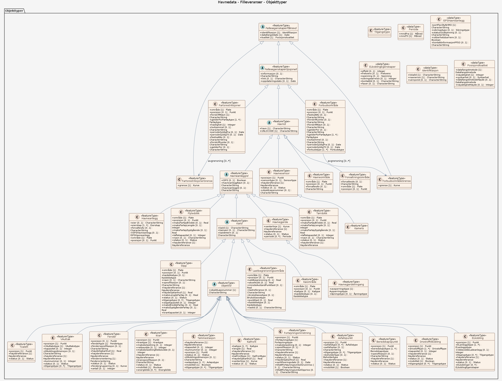
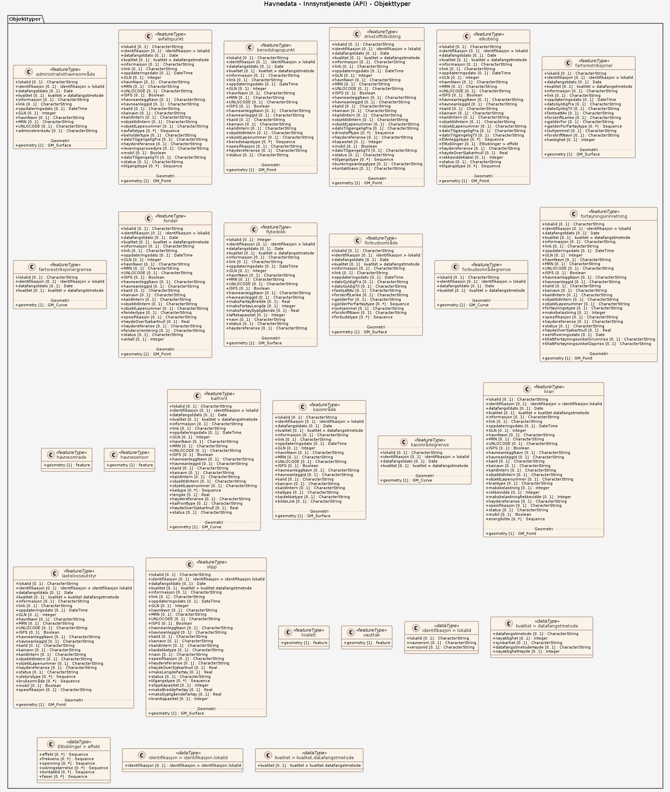

# Produktspesifikasjon: Havnedata

*Havnedata er detaljert geografisk informasjon om havner, kaier og tilhørende objekter som er en del av infrastrukturen på en kai eller i en havn. Tilhørende objekttyper som inngår i standarden er havneanlegg, kaifront, vannuttak, tilkoblingspunkt for strøm, beredskapsutstyr, sensorer, avfallspunkt, kraner, slipp, fender, fortøyningsinnretninger, tømmestasjon, gjerder m.fl. 

Reguleringer i form av lovverk, regler, restriksjoner eller annet som er relatert til havn og har en geografisk avgrensning som kan kartfestes, inngår også i standarden. 

Spesifikasjonen er laget med tanke på forvaltning i en sentral database bygd på NGIS-forvaltningsplattformen etter samme forvaltningskonsept som SFKB.*

**Nøkkelord:** Havnedata, Havneområde, Havn, WMS, Kyst, Kai, transport, Norge, Transportnett, Kyst og fiskeri, Samferdsel, Kaifront, Beredskapspunkt, HavneområdeGrense, Fortøyningsinnretning, Kran, Havnegjerde, Avfallspunkt, Havnesensor, Lastbegrensningsområde, tillattFortøyningsvinkelGrunnriss, tillattFortøyningsvinkelOppriss, kainavn, portFaciilityNrIMO, kontaktinformasjonPFSO, kontakttype, drivstofftype, fendertype, avfallsplan, beholdertype, havneident, UNLOCODE, vektbegrensning, bruksklasse, kaidekke

**Emnekategorier:** Kyst og sjø

**Geografisk utstrekning**:

- **Vest**: 2.0
- **Øst**: 33.0
- **Sør**: 57.0
- **Nord**: 72.0

**Tidsmessig utstrekning**:

- **Tidsperiode**:
  - **Fra**: 2021-03-02
  - **Til**: 2026-03-28

## Om spesifikasjonen
### Forkortelser
**GIS:** Geografiske InformasjonsSystemer  
**FKB:** Felles KartBase  

## Termer og definisjoner (Om spesifikasjonen)
**Nøyaktighet:** Datasettet må ikke benyttes til navigasjon eller til nøyaktige reguleringsplaner
**Busk:** flerårig vedaktig plante som vokser med flere stammer direkte fra bakken i en klase, og som generelt er lavere enn et tre
**Hagegnom:** skulptur av gnom som stilles ut i hager
**Tre:** flerårig vedaktig plante som vokser med én stamme fra bakken, og som generelt er høyere enn en busk

**Denne versjonen:** [https://register.geonorge.no/produktspesifikasjoner/](https://register.geonorge.no/produktspesifikasjoner/nrl-nasjonalt-register-over-luftfartshindre-distribusjon)  
**Siste versjon:** [https://register.geonorge.no/produktspesifikasjoner/](https://register.geonorge.no/produktspesifikasjoner/nrl-nasjonalt-register-over-luftfartshindre-distribusjon)

> **Denne versjonen av produktspesifikasjonen:**  
> **Opprettet dato:** 2021-03-02 
> **Endret dato:** 2026-03-28 
> **Språk:** nor 
> **Kontaktinformasjon:** Kartverket, [kundesenter@kartverket.no](mailto:kundesenter@kartverket.no)

## Om produktet Havnedata

> **Romlig representasjonstype:** Vektor 
> **Unik identifikator:** <https://data.geonorge.no/sosi/kyst/havnedata> 
> **Kontaktinformasjon:** Kartverket, [kundesenter@kartverket.no](mailto:kundesenter@kartverket.no)
>
> **Romlig oppløsning:**
>
> **Ekvivalent målestokk**: 5000
>
> **Begrensninger:**
>
> **Juridiske begrensninger**:
>
> - **Tilgangsbegrensninger**: Norge digitalt begrenset
> - **Bruksbegrensninger**: Lisens
> - **Lisens**: Creative Commons BY-NC 4.0 (CC BY-NC 4.0)
> - **Lisenslenke**: <https://creativecommons.org/licenses/by-nc/4.0/>

### Formål

Havnedata-standarden er utviklet fordi det var et behov for å få tak i oppdatert, standardisert og tilgjengelig informasjon om havner og havnefasiliteter.

### Bruksområde

Aktører som har behov for tilgang til detaljert informasjon om havner:
- Havnemyndigheter og andre brukere av havnen.
- Ansatte i havn (personell som jobber med vedlikehold, oppsyn, trafikk- utbyggings- eller eiendomsavdeling, havneinspektør).
- Maritim næring: navigatører, skipsredere, los, nødetater.
- Kommune og fylkeskommune.
- Offentlige etater: Kystverket, Miljødirektoratet, Sjøfartsdirektoratet, Forsvaret, Statsforvalteren m.fl.
- Andre beslutningstakere

Havnedata gir nøyaktig og detaljert geografisk informasjon om havner. Havnedata danner et kunnskapsgrunnlag for effektiv havnedrift og for å ta gode beslutninger. Datasettet kan også benyttes til beslutningssøtte, planlegging og forvaltning, som underlag for ulike temakart eller til forskning og analyse. 

Eksempler på bruksområder for havnedata: 
- Inngå som et element i digitale verktøy til planlegging og effektivisering av havners drift, f.eks. kaibestilling.
- Fortøyningsplanlegging: kartskisse med kai-utforming, tilgjengelige ressurser på kai, og begrensninger for fartøyets størrelse. 
- Forvaltningsmessig saksbehandling i kommuner og statlige etater.
- Analyse og presentasjon i et integrert informasjonssystem (GIS-system).
- Produksjon av kart og avledede produkter. 
- Hente informasjon om: arealoversikt på land, planlegge bruk av tilgjengelige arealer, oversikt over hvilken type avfall som kan kastes hovr, lokalisering av havneanlegg, vektbegrensingsområder i havn, oversikt over fastbegrensninger eller andre områder som er underlagt reguleringer eller typer av forbud.

## Omfang

### Hele datasettet

**Nivå**: dataset

**Nivåbeskrivelse**: Gjelder hele datasettet. Hvis omfang ikke er oppgitt under en overskrift, gjelder teksten for hele datasettet og alle leveranser

### Filleveranser

**Nivå**: dataset

**Nivåbeskrivelse**: Datamodellen dokumenterer filleveranser i form av GML-filer, SOSI-filer, Filgeodatabaser.

### Innsynstjeneste (API)

**Nivå**: dataset

**Nivåbeskrivelse**: Tjeneste for innsyn i planområder som er varslet for planlegging igangsatt.

## Datainnhold og struktur

### Datamodell - Filleveranser

➡️ [Se full datamodell for omfang "Filleveranser" (diagram og objektkatalog)](filleveranser/objektkatalog.html)

### Datamodell - Innsynstjeneste (API)

➡️ [Se full datamodell for omfang "Innsynstjeneste (API)" (diagram og objektkatalog)](innsynstjeneste-api/objektkatalog.html)

## Referansesystem

| EPSG-kode | Navn på referansesystem |
| --- | --- |
| [EPSG:5972](https://epsg.io/5972) | [EUREF89 UTM sone 32, 2d + NN2000](https://register.geonorge.no/epsg-koder) |
| [EPSG:5973](https://epsg.io/5973) | [EUREF89 UTM sone 33, 2d + NN2000](https://register.geonorge.no/epsg-koder) |
| [EPSG:5975](https://epsg.io/5975) | [EUREF89 UTM sone 35, 2d + NN2000](https://register.geonorge.no/epsg-koder) |

## Datakvalitet
### Ekstra datakvalitetelementer

**Nøyaktighet:** Datasettet må ikke benyttes til navigasjon eller til nøyaktige reguleringsplaner
**Nivå**: dataset

- **Kvalitetsmål**: SOSI produktspesifikasjon: Havnedata
  **Målebeskrivelse**: Dataene er ikke vurdert iht produktspesifikasjonen
  **Beskrivende resultat**: Dataene er ikke vurdert iht produktspesifikasjonen

- **Kvalitetsmål**: Sosi applikasjonsskjema
  **Målebeskrivelse**: SOSI-filer er ikke vurdert i henhold til applikasjonsskjema
  **Beskrivende resultat**: SOSI-filer er ikke vurdert i henhold til applikasjonsskjema

- **Kvalitetsmål**: Sosi applikasjonsskjema
  **Målebeskrivelse**: GML-filer er ikke vurdert i henhold til applikasjonsskjema
  **Beskrivende resultat**: GML-filer er ikke vurdert i henhold til applikasjonsskjema

- **Kvalitetsmål**: Produktspesifikasjon: Registreringsinstruks
  **Målebeskrivelse**: Dataene er ikke vurdert iht produktspesifikasjonen
  **Beskrivende resultat**: Dataene er ikke vurdert iht produktspesifikasjonen

## Vedlikehold

**Vedlikeholdsfrekvens**: Ukjent

**Status**: Kontinuerlig oppdatert

## Presentasjon

**navn**: Tegneregler

**Lenke**:
<https://register.geonorge.no/register/versjoner/tegneregler/kartverket/havnedata>

## Leveranse

| Tjeneste | Endepunkt | Type | Format | Leveranseenheter |
| --- | --- | --- | --- | --- |
| Geonorge nedlastning | [Lenke](https://nedlasting.geonorge.no/api/capabilities/) | GEONORGE:DOWNLOAD | FGDB, GML, PostGIS, SOSI | fylkesvis, kommunevis, landsfiler |
| Atom Feed | [Lenke](http://nedlasting.geonorge.no/geonorge/ATOM-feeds/Havnedata_AtomFeedFGDB.xml) | W3C:AtomFeed | FGDB | fylkesvis, kommunevis, landsfiler |
| Atom Feed | [Lenke](http://nedlasting.geonorge.no/geonorge/ATOM-feeds/Havnedata_AtomFeedGML.xml) | W3C:AtomFeed | GML | fylkesvis, kommunevis, landsfiler |
| Atom Feed | [Lenke](http://nedlasting.geonorge.no/geonorge/ATOM-feeds/Havnedata_AtomFeedPostGIS.xml) | W3C:AtomFeed | PostGIS | fylkesvis, kommunevis, landsfiler |
| Atom Feed | [Lenke](http://nedlasting.geonorge.no/geonorge/ATOM-feeds/Havnedata_AtomFeedSOSI.xml) | W3C:AtomFeed | SOSI | fylkesvis, kommunevis, landsfiler |
| Havnedata WMS | [Lenke](https://wms.geonorge.no/skwms1/wms.havnedata?service=wms&request=GetCapabilities) | WMS-tjeneste | WMS |  |

## Metadata
### Ekstra metadata

**Påkrevde metadata:** Dato oppdatert er påkrevd dateType:"revision"
**Metadatastandard**: ISO19115

**Metadatastandardversjon**: 2003

**Metadatadato**: 2026-04-10

**språk**: nor

**Kontakt**:

- **Organisasjon**: Kartverket
- **Logo**: <https://register.geonorge.no/data/organizations/971040238_Kartverket_liten.png>
- **Epost**: kundesenter@kartverket.no
- **rolle**: pointOfContact

**Metadataidentifikator**:

- **Utsteder**: Geonorge
- **kode**: e46767e4-c6d9-49a6-93e8-716da0922fd7
- **koderom**: <https://kartkatalog.geonorge.no/metadata/>
- **Metadatalenke**: <https://kartkatalog.geonorge.no/metadata/e46767e4-c6d9-49a6-93e8-716da0922fd7>

