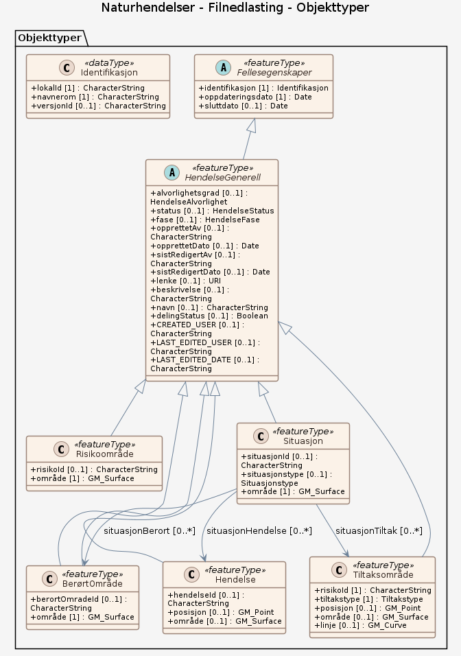

# Produktspesifikasjon: Naturhendelser

*Naturhendelser, tidligere kalt Flomhendelser.no, er en tjeneste levert av Norges vassdrags- og energi­direktorat (NVE). Tjenesten leverer digitale rapporter som beskriver værrelaterte hendelser som har ført til flom, oversvømmelser, overvann, skred og andre naturfarer i Norge. I dag finnes det mest informasjon om flomhendelser, men på sikt ønsker vi at tjenesten også skal gi informasjon om andre typer naturfarehendelser. Rapportene er utarbeidet av fageksperter fra NVE med mulige eksterne bidragsyter fra for eksempel Meteorologisk institutt (MET) og Statens vegvesen (SVV). Informasjonen er inndelt i følgende temaer:

Oversikt
Tidsforløp
Observasjoner
Vær og varsler
Skader
Dokumentasjon

Informasjonen som vises er en kombinasjon av redaksjonelt innhold og data hentet inn fra en rekke interne og eksterne kilder. Dette gir et detaljert og nyansert bilde av hendelsen.

Vårt mål er at Naturhendelser blir din primærkilde til informasjon om værrelaterte naturfarehendelser i Norge.*

**Nøkkelord:** Flom, Naturfare, Overvann, Ekstremvær, Samfunnssikkerhet

**Emnekategorier:** 

**Geografisk utstrekning**:

- **Vest**: 2.0
- **Øst**: 33.0
- **Sør**: 57.0
- **Nord**: 72.0

**Tidsmessig utstrekning**:

- **Tidsperiode**:
  - **Fra**: 2019-10-23
  - **Til**: 2019-10-23

## Om spesifikasjonen

> **Denne versjonen av produktspesifikasjonen:**  
> **Opprettet dato:** 2019-10-23 
> **Endret dato:** 2019-10-23 
> **Språk:**  
> **Kontaktinformasjon:** Norges vassdrags- og energidirektorat, [naturhendelser@nve.no](mailto:naturhendelser@nve.no)

## Om produktet Naturhendelser

> **Romlig representasjonstype:**  
> **Unik identifikator:** 4851c6ae-cf38-425f-af4e-0b418ef7bb43 
> **Kontaktinformasjon:** Norges vassdrags- og energidirektorat, [naturhendelser@nve.no](mailto:naturhendelser@nve.no)
>
> **Romlig oppløsning:**
>
>
>
> **Begrensninger:**
>
> **Juridiske begrensninger**:
>
> - **Tilgangsbegrensninger**: Åpne data
> - **Bruksbegrensninger**: Lisens
> - **Lisens**: No conditions apply to access and use
> - **Lisenslenke**: <http://inspire.ec.europa.eu/metadata-codelist/ConditionsApplyingToAccessAndUse/noConditionsApply>
>
> **Sikkerhetsbegrensninger**:
>
> - **Klassifisering**: Ugradert

### Formål

Vårt mål er at Naturhendelser blir din primærkilde til informasjon om værrelaterte naturfarehendelser i Norge.

### Bruksområde

Tjenesten leverer digitale rapporter som beskriver værrelaterte hendelser som har ført til flom, oversvømmelser, overvann, skred og andre naturfarer i Norge. I dag finnes det mest informasjon om flomhendelser, men på sikt ønsker vi at tjenesten også skal gi informasjon om andre typer naturfarehendelser. Denne informasjonen kan brukes som hjelp i arealplanlegging, evaluering av varsling, forberedelse før varslete hendelser (beredskap), forskning, undervisning m.m.

## Omfang

### Hele datasettet

**Nivå**: dataset

**Nivåbeskrivelse**: Gjelder hele datasettet. Hvis omfang ikke er oppgitt under en overskrift, gjelder teksten for hele datasettet og alle leveranser

### Filnedlasting

**Nivå**: dataset

**Nivåbeskrivelse**: Naturhendelser

## Datainnhold og struktur

### Datamodell - Filnedlasting

➡️ [Se full datamodell for omfang "Filnedlasting" (diagram og objektkatalog)](filnedlasting/objektkatalog.html)

## Datakvalitet

**Nivå**: software

## Vedlikehold

**Vedlikeholdsfrekvens**: Etter behov

## Leveranse

| Tjeneste | Endepunkt | Type | Format | Leveranseenheter |
| --- | --- | --- | --- | --- |
| Webside | [Lenke](https://naturhendelser.varsom.no/) | WWW:LINK-1.0-http--link |  |  |

## Metadata

**Metadatastandard**: ISO19115

**Metadatastandardversjon**: 2003

**Metadatadato**: 2023-07-28

**språk**: nor

**Kontakt**:

- **Organisasjon**: Norges vassdrags- og energidirektorat
- **Kontaktperson**: Yngve Antonsen
- **Logo**: <https://register.geonorge.no/data/organizations/970205039_NVE_liten.png>
- **Epost**: yaa@nve.no
- **rolle**: pointOfContact

**Metadataidentifikator**:

- **Utsteder**: Geonorge
- **kode**: 4851c6ae-cf38-425f-af4e-0b418ef7bb43
- **koderom**: <https://kartkatalog.geonorge.no/metadata/>
- **Metadatalenke**: <https://kartkatalog.geonorge.no/metadata/4851c6ae-cf38-425f-af4e-0b418ef7bb43>

