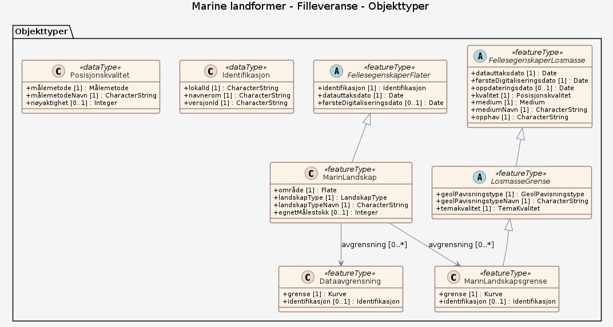

### Datamodell

#### Dataavgrensning

generell avgrensningslinje, f.eks. mellom datasett med ulik kvalitet, innhold eller detaljering

Egenskaper

<table class="feature-attribute-table">
  <colgroup>
    <col style="width: 35%;" />
    <col style="width: 65%;" />
  </colgroup>
  <tbody>
    <tr>
      <th scope="row">Navn:</th>
      <td><strong>grense</strong></td>
    </tr>
    <tr>
      <th scope="row">Definisjon:</th>
      <td>forløp som følger overgang mellom ulike fenomener</td>
    </tr>
    <tr>
      <th scope="row">Multiplisitet:</th>
      <td>1</td>
    </tr>
    <tr>
      <th scope="row">Type:</th>
      <td>Kurve</td>
    </tr>
  </tbody>
</table>

<table class="feature-attribute-table">
  <colgroup>
    <col style="width: 35%;" />
    <col style="width: 65%;" />
  </colgroup>
  <tbody>
    <tr>
      <th scope="row">Navn:</th>
      <td><strong>identifikasjon</strong></td>
    </tr>
    <tr>
      <th scope="row">Definisjon:</th>
      <td>unik identifikasjon av et objekt</td>
    </tr>
    <tr>
      <th scope="row">Multiplisitet:</th>
      <td>0..1</td>
    </tr>
    <tr>
      <th scope="row">Type:</th>
      <td>Identifikasjon</td>
    </tr>
  </tbody>
</table>

<table class="feature-attribute-table">
  <colgroup>
    <col style="width: 35%;" />
    <col style="width: 65%;" />
  </colgroup>
  <tbody>
    <tr>
      <th scope="row">Navn:</th>
      <td><strong>identifikasjon.lokalId</strong></td>
    </tr>
    <tr>
      <th scope="row">Definisjon:</th>
      <td>lokal identifikator, tildelt av dataleverendør/dataforvalter. Den lokale identifikatoren er unik innenfor navnerommet, ingen andre objekter har samme identifikator.  NOTE: Det er data leverendørens ansvar å sørge for at denne lokale identifikatoren er unik innenfor navnerommet.</td>
    </tr>
    <tr>
      <th scope="row">Multiplisitet:</th>
      <td>1</td>
    </tr>
    <tr>
      <th scope="row">Type:</th>
      <td>CharacterString</td>
    </tr>
  </tbody>
</table>

<table class="feature-attribute-table">
  <colgroup>
    <col style="width: 35%;" />
    <col style="width: 65%;" />
  </colgroup>
  <tbody>
    <tr>
      <th scope="row">Navn:</th>
      <td><strong>identifikasjon.navnerom</strong></td>
    </tr>
    <tr>
      <th scope="row">Definisjon:</th>
      <td>navnerom som unikt identifiserer datakilden til objektet, starter med to bokstavs kode jfr ISO 3166. Benytter understreking  ("_") dersom data produsenten ikke er assosiert med bare et land.  NOTE 1 : Verdien for nanverom vil eies av den dataprodusent som har ansvar for de unike identifikatorene og vil registreres i "INSPIRE external  Object Identifier Namespaces Register"  Eksempel: NO for Norge.</td>
    </tr>
    <tr>
      <th scope="row">Multiplisitet:</th>
      <td>1</td>
    </tr>
    <tr>
      <th scope="row">Type:</th>
      <td>CharacterString</td>
    </tr>
  </tbody>
</table>

<table class="feature-attribute-table">
  <colgroup>
    <col style="width: 35%;" />
    <col style="width: 65%;" />
  </colgroup>
  <tbody>
    <tr>
      <th scope="row">Navn:</th>
      <td><strong>identifikasjon.versjonId</strong></td>
    </tr>
    <tr>
      <th scope="row">Definisjon:</th>
      <td>identifikasjon av en spesiell versjon av et geografisk objekt (instans), maksimum lengde på 25 karakterers. Dersom spesifikasjonen av et geografisk objekt med en identifikasjon inkludererer livsløpssyklusinformasjon, benyttes denne versjonId for å skille mellom ulike versjoner av samme objekt. versjonId er en unik  identifikasjon av versjonen.  NOTE Maksimum lengde er valgt for å tillate tidsregistrering i henhold til  ISO 8601, slik som  "2007-02-12T12:12:12+05:30" som versjonId.</td>
    </tr>
    <tr>
      <th scope="row">Multiplisitet:</th>
      <td>1</td>
    </tr>
    <tr>
      <th scope="row">Type:</th>
      <td>CharacterString</td>
    </tr>
  </tbody>
</table>

#### MarinLandskapsgrense

grense for marine landskapsområder

Egenskaper

<table class="feature-attribute-table">
  <colgroup>
    <col style="width: 35%;" />
    <col style="width: 65%;" />
  </colgroup>
  <tbody>
    <tr>
      <th scope="row">Navn:</th>
      <td><strong>grense</strong></td>
    </tr>
    <tr>
      <th scope="row">Definisjon:</th>
      <td>forløp som følger overgang mellom ulike fenomener</td>
    </tr>
    <tr>
      <th scope="row">Multiplisitet:</th>
      <td>1</td>
    </tr>
    <tr>
      <th scope="row">Type:</th>
      <td>Kurve</td>
    </tr>
  </tbody>
</table>

<table class="feature-attribute-table">
  <colgroup>
    <col style="width: 35%;" />
    <col style="width: 65%;" />
  </colgroup>
  <tbody>
    <tr>
      <th scope="row">Navn:</th>
      <td><strong>identifikasjon</strong></td>
    </tr>
    <tr>
      <th scope="row">Definisjon:</th>
      <td>unik identifikasjon av et objekt</td>
    </tr>
    <tr>
      <th scope="row">Multiplisitet:</th>
      <td>0..1</td>
    </tr>
    <tr>
      <th scope="row">Type:</th>
      <td>Identifikasjon</td>
    </tr>
  </tbody>
</table>

<table class="feature-attribute-table">
  <colgroup>
    <col style="width: 35%;" />
    <col style="width: 65%;" />
  </colgroup>
  <tbody>
    <tr>
      <th scope="row">Navn:</th>
      <td><strong>identifikasjon.lokalId</strong></td>
    </tr>
    <tr>
      <th scope="row">Definisjon:</th>
      <td>lokal identifikator, tildelt av dataleverendør/dataforvalter. Den lokale identifikatoren er unik innenfor navnerommet, ingen andre objekter har samme identifikator.  NOTE: Det er data leverendørens ansvar å sørge for at denne lokale identifikatoren er unik innenfor navnerommet.</td>
    </tr>
    <tr>
      <th scope="row">Multiplisitet:</th>
      <td>1</td>
    </tr>
    <tr>
      <th scope="row">Type:</th>
      <td>CharacterString</td>
    </tr>
  </tbody>
</table>

<table class="feature-attribute-table">
  <colgroup>
    <col style="width: 35%;" />
    <col style="width: 65%;" />
  </colgroup>
  <tbody>
    <tr>
      <th scope="row">Navn:</th>
      <td><strong>identifikasjon.navnerom</strong></td>
    </tr>
    <tr>
      <th scope="row">Definisjon:</th>
      <td>navnerom som unikt identifiserer datakilden til objektet, starter med to bokstavs kode jfr ISO 3166. Benytter understreking  ("_") dersom data produsenten ikke er assosiert med bare et land.  NOTE 1 : Verdien for nanverom vil eies av den dataprodusent som har ansvar for de unike identifikatorene og vil registreres i "INSPIRE external  Object Identifier Namespaces Register"  Eksempel: NO for Norge.</td>
    </tr>
    <tr>
      <th scope="row">Multiplisitet:</th>
      <td>1</td>
    </tr>
    <tr>
      <th scope="row">Type:</th>
      <td>CharacterString</td>
    </tr>
  </tbody>
</table>

<table class="feature-attribute-table">
  <colgroup>
    <col style="width: 35%;" />
    <col style="width: 65%;" />
  </colgroup>
  <tbody>
    <tr>
      <th scope="row">Navn:</th>
      <td><strong>identifikasjon.versjonId</strong></td>
    </tr>
    <tr>
      <th scope="row">Definisjon:</th>
      <td>identifikasjon av en spesiell versjon av et geografisk objekt (instans), maksimum lengde på 25 karakterers. Dersom spesifikasjonen av et geografisk objekt med en identifikasjon inkludererer livsløpssyklusinformasjon, benyttes denne versjonId for å skille mellom ulike versjoner av samme objekt. versjonId er en unik  identifikasjon av versjonen.  NOTE Maksimum lengde er valgt for å tillate tidsregistrering i henhold til  ISO 8601, slik som  "2007-02-12T12:12:12+05:30" som versjonId.</td>
    </tr>
    <tr>
      <th scope="row">Multiplisitet:</th>
      <td>1</td>
    </tr>
    <tr>
      <th scope="row">Type:</th>
      <td>CharacterString</td>
    </tr>
  </tbody>
</table>

Relasjoner

**Arv**
LosmasseGrense

#### MarinLandskap

areal som viser utstrekningen til et visst landskap på havbunnen

Egenskaper

<table class="feature-attribute-table">
  <colgroup>
    <col style="width: 35%;" />
    <col style="width: 65%;" />
  </colgroup>
  <tbody>
    <tr>
      <th scope="row">Navn:</th>
      <td><strong>område</strong></td>
    </tr>
    <tr>
      <th scope="row">Definisjon:</th>
      <td>objektets utstrekning</td>
    </tr>
    <tr>
      <th scope="row">Multiplisitet:</th>
      <td>1</td>
    </tr>
    <tr>
      <th scope="row">Type:</th>
      <td>Flate</td>
    </tr>
  </tbody>
</table>

<table class="feature-attribute-table">
  <colgroup>
    <col style="width: 35%;" />
    <col style="width: 65%;" />
  </colgroup>
  <tbody>
    <tr>
      <th scope="row">Navn:</th>
      <td><strong>landskapType</strong></td>
    </tr>
    <tr>
      <th scope="row">Definisjon:</th>
      <td>inndeling av havområdene i ulike marine landskap. Landskap er definert som større geografiske områder med enhetlig visuelt preg</td>
    </tr>
    <tr>
      <th scope="row">Multiplisitet:</th>
      <td>1</td>
    </tr>
    <tr>
      <th scope="row">Type:</th>
      <td>LandskapType</td>
    </tr>
    <tr>
      <th scope="row">Tillatte verdier:</th>
      <td>- Strandflate – Relativt flat plattform av vanligvis krystalline bergarter, delvis over og delvis under havnivå. Strandflaten danner en småkupert sletteform eller plattform, klart avgrenset mot fjell/høyere land i bakkant og mot kontinentalsokkelen utenfor. - Jevn kontinentalskråning – Område av kontinentalskråningen mellom marine gjel. Kontinentalskråningen er området mellom kontinentalsokkel og dyphavsslette. - Marint gjel – Dyp innskjæring med bratte skråninger i kontinentalskråningen - Marin dal – Dal som gjennomskjærer kontinentalsokkelen og strandflaten med dyp &gt;200 m og bredde &gt;1 km. - Åpen fjord – Bred fjord med moderat dybde (vanndyp &lt;200 m) og fjordsider som stiger mindre enn 200 m over havnivå. Fjordsidene er relativt slake (10º til 15º). - Nedskåret fjord – Dyp fjord (vanndyp &gt;200 m) med fjordsider som stiger mer enn 200 m over havnivå. Fjordsidene er relativt bratte (&gt;15º, lokalt finnes flog og stup) i det meste av nedskjæringens (fjorddalens) lengde. Fjorder av denne type har vanligvis en markert terskel. - Dyphavsslette – Havbunnen i dyphavet nedenfor/under kontinentalskråningen. Dyphavsslette definert her inkluderer både dyphavsslette og kontinentalstigning. Relativt relieff er lavt (&lt;50 m/km2). - Kontinentalskråningsslette – Platå på kontinentalskråningen. Kontinentalskråningsslette har vanligvis små variasjoner i relieff og et tykt sedimentdekke. - Kontinentalsokkelslette – Relativt flat plattform på kontinentalsokkelen, mellom kontinentalskråningen og strandflaten/kysten. - Grunn marin dal – Forsenkning på kontinentalsokkelen, med dyp 100-200 m og bredde &gt;1 km. - Marint fjellandskap – Område av havbunnen med relativt relieff &gt;50 m innenfor en rute på 1 km&lt;sup&gt;2&lt;/sup&gt;, men uten veldefinerte daler. - Øy- og sundlandskap – Kystlandskap, både over og under havnivå, som ikke hører til strandflaten. Relativt relieff &gt;50 m innenfor en rute på 1 km&lt;sup&gt;2&lt;/sup&gt;. Tallrike små øyer adskilt av sund gjør øy- og sundlandskap til en karakteristisk landskapstype.</td>
    </tr>
  </tbody>
</table>

<table class="feature-attribute-table">
  <colgroup>
    <col style="width: 35%;" />
    <col style="width: 65%;" />
  </colgroup>
  <tbody>
    <tr>
      <th scope="row">Navn:</th>
      <td><strong>landskapTypeNavn</strong></td>
    </tr>
    <tr>
      <th scope="row">Definisjon:</th>
      <td>inndeling av havområdene i ulike marine landskap. Landskap er definert som større geografiske områder med enhetlig visuelt preg</td>
    </tr>
    <tr>
      <th scope="row">Multiplisitet:</th>
      <td>1</td>
    </tr>
    <tr>
      <th scope="row">Type:</th>
      <td>CharacterString</td>
    </tr>
  </tbody>
</table>

<table class="feature-attribute-table">
  <colgroup>
    <col style="width: 35%;" />
    <col style="width: 65%;" />
  </colgroup>
  <tbody>
    <tr>
      <th scope="row">Navn:</th>
      <td><strong>egnetMålestokk</strong></td>
    </tr>
    <tr>
      <th scope="row">Definisjon:</th>
      <td>beskriver det målestokksområdet hvor dataene er best egnet. Egenskapen viser målestokktallet, eksempel: 1:50 000 = 50000. Objekter kan være utvalgt, plassert eller generalisert i forhold til egnet målestokk. Denne egenskapen kan benyttes for å velge hvilke objekter som skal tegnes ut i ulike målestokker.</td>
    </tr>
    <tr>
      <th scope="row">Multiplisitet:</th>
      <td>0..1</td>
    </tr>
    <tr>
      <th scope="row">Type:</th>
      <td>Integer</td>
    </tr>
  </tbody>
</table>

Relasjoner

**Arv**
FellesegenskaperFlater

**Assosiasjoner**
Dataavgrensning – rolle: avgrensning – kardinalitet: 0..*
MarinLandskapsgrense – rolle: avgrensning – kardinalitet: 0..*

#### FellesegenskaperLosmasse (abstrakt)

abstrakt objekt som bærer en rekke egenskaper som er fagområde-uavhengige og kan benyttes for alle objekttyper  Merknad: Spesielt i produktspesifikasjonsarbeid vil en velge egenskaper og avgrensningslinjer fra denne klassen.

Egenskaper

<table class="feature-attribute-table">
  <colgroup>
    <col style="width: 35%;" />
    <col style="width: 65%;" />
  </colgroup>
  <tbody>
    <tr>
      <th scope="row">Navn:</th>
      <td><strong>datauttaksdato</strong></td>
    </tr>
    <tr>
      <th scope="row">Definisjon:</th>
      <td>dato for uttak fra en database  Merknad: Skiller seg fra Kopidato ved at en ikke skiller på om det er uttak fra en originaldatabase eller en kopidatabase.</td>
    </tr>
    <tr>
      <th scope="row">Multiplisitet:</th>
      <td>1</td>
    </tr>
    <tr>
      <th scope="row">Type:</th>
      <td>DateTime</td>
    </tr>
  </tbody>
</table>

<table class="feature-attribute-table">
  <colgroup>
    <col style="width: 35%;" />
    <col style="width: 65%;" />
  </colgroup>
  <tbody>
    <tr>
      <th scope="row">Navn:</th>
      <td><strong>førsteDigitaliseringsdato</strong></td>
    </tr>
    <tr>
      <th scope="row">Definisjon:</th>
      <td>dato når en representasjon av objektet i digital form første gang ble etablert  Merknad: førsteDigitaliseringsdato kan skille seg fra førsteDatafangstdato ved at den første datafangsten skjedde analogt og gjort om til digital form senere i en produksjonsprosess. Eventuelt at innlegging i databasen skjedde på et senere tidspunkt enn registreringen /observasjonen / målingen av objektet.</td>
    </tr>
    <tr>
      <th scope="row">Multiplisitet:</th>
      <td>1</td>
    </tr>
    <tr>
      <th scope="row">Type:</th>
      <td>DateTime</td>
    </tr>
  </tbody>
</table>

<table class="feature-attribute-table">
  <colgroup>
    <col style="width: 35%;" />
    <col style="width: 65%;" />
  </colgroup>
  <tbody>
    <tr>
      <th scope="row">Navn:</th>
      <td><strong>oppdateringsdato</strong></td>
    </tr>
    <tr>
      <th scope="row">Definisjon:</th>
      <td>dato for siste endring på objektetdataene  Merknad: Oppdateringsdato kan være forskjellig fra Datafangsdato ved at data som er registrert kan bufres en kortere eller lengre periode før disse legges inn i datasystemet (databasen).  -Definition- Date and time at which this version of the spatial object was inserted or changed in the spatial data set.</td>
    </tr>
    <tr>
      <th scope="row">Multiplisitet:</th>
      <td>0..1</td>
    </tr>
    <tr>
      <th scope="row">Type:</th>
      <td>DateTime</td>
    </tr>
  </tbody>
</table>

<table class="feature-attribute-table">
  <colgroup>
    <col style="width: 35%;" />
    <col style="width: 65%;" />
  </colgroup>
  <tbody>
    <tr>
      <th scope="row">Navn:</th>
      <td><strong>kvalitet</strong></td>
    </tr>
    <tr>
      <th scope="row">Definisjon:</th>
      <td>beskrivelse av kvaliteten på stedfestingen  Merknad: Denne er identisk med ..KVALITET i tidligere versjoner av SOSI.</td>
    </tr>
    <tr>
      <th scope="row">Multiplisitet:</th>
      <td>1</td>
    </tr>
    <tr>
      <th scope="row">Type:</th>
      <td>Posisjonskvalitet</td>
    </tr>
  </tbody>
</table>

<table class="feature-attribute-table">
  <colgroup>
    <col style="width: 35%;" />
    <col style="width: 65%;" />
  </colgroup>
  <tbody>
    <tr>
      <th scope="row">Navn:</th>
      <td><strong>kvalitet.målemetode</strong></td>
    </tr>
    <tr>
      <th scope="row">Definisjon:</th>
      <td>metode for måling i grunnriss (x,y), og høyde (z) når metoden er den samme som ved måling i grunnriss</td>
    </tr>
    <tr>
      <th scope="row">Multiplisitet:</th>
      <td>1</td>
    </tr>
    <tr>
      <th scope="row">Type:</th>
      <td>Målemetode</td>
    </tr>
    <tr>
      <th scope="row">Tillatte verdier:</th>
      <td>- Terrengmålt: Uspesifisert måleinstrument – Målt i terrenget , uspesifisert metode/måleinstrument - Terrengmålt: Totalstasjon – Målt i terrenget med totalstasjon - Terrengmålt: Teodolitt og el avstandsmåler – Målt i terrenget med teodolitt og elektronisk avstandsmåler - Terrengmålt: Teodolitt og målebånd – Målt i terrenget med teodolitt og målebånd - Terrengmålt: Ortogonalmetoden – Målt i terrenget, ortogonalmetoden - Utmål – Punkt beregnet på bakgrunn av måling mot andre punkter, slik som to avstander eller avstand og retning

-- Definition --
Point calculated on the basis of other items, such as two distances or distance + direction. - Tatt fra plan – Tatt fra plan eller godkjent tiltak - Annet  (denne har ingen mening, bør fjernes?) – Annet - Stereoinstrument – Målt i stereoinstrument, uspesifisert instrument - Aerotriangulert – Punkt beregnet ved aerotriangulering

-- Definition --
Point calculated by aerotriangulation - Stereoinstrument: Analytisk plotter – Målt i stereoinstrument, analytisk plotter - Stereoinstrument: Autograf – Målt i stereoinstrument, autograf, analogt instrument - Stereoinstrument: Digitalt – Målt i stereoinstrument, digitalt instrument - Scannet fra kart – Geometri overført fra kart maskinelt ved hjelp av skanner, uspesifisert kartmedium - Skannet fra kart: Blyantoriginal – Geometri overført fra kart maskinelt ved hjelp av skanner. Kartmedium er blyantoriginal - Skannet fra kart: Rissefolie – Geometri overført fra kart maskinelt ved hjelp av skanner. Kartmedium er rissefolie - Skannet fra kart: Transparent folie, god kvalitet – Geometri overført fra kart maskinelt ved hjelp av skanner. Kartmedium er transparent folie av  god kvalitet. - Skannet fra kart: Transparent folie, mindre god kvalitet – Geometri overført fra kart maskinelt ved hjelp av skanner. Kartmedium er transparent folie av mindre god kvalitet - Skannet fra kart: Papirkopi – Geometri overført fra kart maskinelt ved hjelp av skanner. Kartmedium er papirkopi. - Flybåren laserscanner – Målt med laserskanner fra fly - Bilbåren laser – Målt med laserskanner plassert i kjøretøy - Lineær referanse – brukes for objekter som er stedfestet med lineær referanse, enten disse leveres med stedfesting kun som lineære referanser, eller med koordinatgeometri avledet fra lineære referanser - Digitaliseringbord: Ortofoto eller flybilde – Geometri overført fra ortofoto eller flybilde ved hjelp av manuell registrering på et digitaliseringsbord, uspesifisert bildemedium - Digitaliseringbord: Ortofoto, film – Geometri overført fra ortofoto ved hjelp av manuell registrering på et digitaliseringsbord. Bildemedium er film - Digitaliseringbord: Ortofoto, fotokopi – Geometri overført fra ortofoto ved hjelp av manuell registrering på et digitaliseringsbord. Bildemedium er fotokopi - Digitaliseringbord: Flybilde, film – Geometri overført fra flybilde ved hjelp av manuell registrering på et digitaliseringsbord. Bildemedium er film - Digitaliseringbord: Flybilde, fotokopi – Geometri overført fra flybilde ved hjelp av manuell registrering på et digitaliseringsbord. Bildemedium er fotokopi - Digitalisert på skjerm fra ortofoto – Geometri overført fra ortofoto ved hjelp av manuell registrering på skjerm - Digitalisert på skjerm fra satellittbilde – Geometri overført fra satellittbilde ved hjelp av manuell registrering på skjerm - Digitalisert på skjerm fra andre digitale rasterdata - Digitalisert på skjerm fra tolkning av seismikk - Vektorisering av laserdata – Vektorisering fra laserdata, brukes også der vektoriseringen støttes av ortofoto - Digitaliseringsbord: Kart – Geometri overført fra kart ved hjelp av manuell registrering på et digitaliseringsbord, medium uspesifisert - Digitaliseringsbord: Kart, blyantoriginal – Geometri overført fra kart ved hjelp av manuell registrering på et digitaliseringsbord. Kartmedium er blyantoriginal - Digitaliseringsbord: Kart, rissefoile – Geometri overført fra kart ved hjelp av manuell registrering på et digitaliseringsbord. Kartmedium er rissefolie - Digitaliseringsbord: Kart, transparent foile, god kvalitet – Geometri overført fra kart ved hjelp av manuell registrering på et digitaliseringsbord. Kartmedium er transparent folie av god kvalitet, samkopi - Digitaliseringsbord: Kart, transparent foile, mindre god kvalitet – Geometri overført fra kart ved hjelp av manuell registrering på et digitaliseringsbord. Kartmedium er transparent folie av mindre god kvalitet, samkopi - Digitaliseringsbord: Kart, papirkopi – Geometri overført fra kart ved hjelp av manuell registrering på et digitaliseringsbord. Kartmedium er papirkopi - Digitalisert på skjerm fra skannet kart – Geometri overført fra kart ved hjelp av manuell registrering på skjerm, medium skannet kart (raster), samkopi - Genererte data (interpolasjon) – Genererte data, interpolasjonsmetode. Ikke nærmere spesifisert - Genererte data (interpolasjon): Terrengmodell – Genererte data, interpolasjonsmetode, fra terrengmodell - Genererte data (interpolasjon): Vektet middel – Genererte data, interpolasjonsmetode, vektet middel - Genererte data: Fra annen geometri – Genererte data: Sirkelgeometri, korridor eller annen geometri generert ut fra f.eks et punkt eller en linje (f.eks midtlinje veg) - Genererte data: Generalisering - Genererte data: Sentralpunkt - Genererte data: Sammenknytningspunkt, randpunkt – Genererte data: Sammenknytningspunkt (f.eks mellom ulike kartlegginger), randpunkt (f.eks mellom ulike kilder til kart) - Koordinater hentet fra GAB – Koordinater hentet fra GAB, forløperen til registerdelen av matrikkelen - Koordinater hentet fra JREG – Koordinater hentet fra JREG, jordregisteret - Beregnet – Beregnet, uspesifisert hvordan - Spesielle metoder – Spesielle metoder, uspesifisert - Spesielle metoder: Målt med stikkstang - Spesielle metoder: Målt med waterstang - Spesielle metoder: Målt med målehjul - Spesielle metoder: Målt med stigningsmåler - Fastsatt punkt – Punkt fastsatt ut fra et grunnlag (kart, bilde), f.eks ved partenes enighet ved en oppmålingsforretning - Fastsatt ved dom eller kongelig resolusjon – Geometri fastsatt ved dom, lov, traktat eller kongelig resolusjon - Annet (spesifiseres i filhode) ( bør vel fjernes, blir borte ved overføring mellom systemer) – Annet (spesifiseres i filhode) - Frihåndstegning – Digitalisert ut fra frihåndstegning.  Frihåndstegning er basert på svært grovt grunnlag eller ikke noe grunnlag - Frihåndstegning på kart – Digitalisert fra krokering på kart, dvs grovt skissert på kart - Frihåndstegning på skjerm – Digitalisert ut fra frihåndstegning (direkte på skjerm). Frihåndstegning er basert på svært grovt grunnlag eller ikke noe grunnlag - Treghetsstedfesting - GNSS: Kodemåling, relative målinger – Innmålt med satellittbaserte systemer for navigasjon og posisjonering med global dekning (f.eks GPS, GLONASS, GALILEO): Kodemåling, relative målinger. - GNSS: Kodemåling, enkle målinger – Innmålt med satellittbaserte systemer for navigasjon og posisjonering med global dekning (f.eks GPS, GLONASS, GALILEO): Kodemåling, enkle målinger. - GNSS: Fasemåling, statisk måling – Innmålt med satellittbaserte systemer for navigasjon og posisjonering med global dekning (f.eks GPS, GLONASS, GALILEO): Fasemåling statisk måling. - GNSS: Fasemåling, andre metoder – Innmålt med satellittbaserte systemer for navigasjon og posisjonering med global dekning (f.eks GPS, GLONASS, GALILEO): Fasemåling andre metoder. - Kombinasjon av GNSS/Treghet – Kombinasjon av GPS/Treghet - GNSS: Fasemåling RTK – Innmålt med satellittbaserte systemer for navigasjon og posisjonering med global dekning (f.eks GPS, GLONASS, GALILEO).: Fasemåling RTK (realtids kinematisk måling) - GNSS: Fasemåling , float-løsning – Innmålt med satellittbaserte systemer for navigasjon og posisjonering med global dekning (f.eks GPS, GLONASS, GALILEO). Fasemåling float-løsning - Ukjent målemetode – Målemetode er ukjent</td>
    </tr>
  </tbody>
</table>

<table class="feature-attribute-table">
  <colgroup>
    <col style="width: 35%;" />
    <col style="width: 65%;" />
  </colgroup>
  <tbody>
    <tr>
      <th scope="row">Navn:</th>
      <td><strong>kvalitet.målemetodeNavn</strong></td>
    </tr>
    <tr>
      <th scope="row">Definisjon:</th>
      <td>navn på metode for måling i grunnriss (x,y), og høyde (z) når metoden er den samme som ved måling i grunnriss</td>
    </tr>
    <tr>
      <th scope="row">Multiplisitet:</th>
      <td>1</td>
    </tr>
    <tr>
      <th scope="row">Type:</th>
      <td>CharacterString</td>
    </tr>
  </tbody>
</table>

<table class="feature-attribute-table">
  <colgroup>
    <col style="width: 35%;" />
    <col style="width: 65%;" />
  </colgroup>
  <tbody>
    <tr>
      <th scope="row">Navn:</th>
      <td><strong>kvalitet.nøyaktighet</strong></td>
    </tr>
    <tr>
      <th scope="row">Definisjon:</th>
      <td>punktstandardavviket i grunnriss for punkter samt tverravvik for linjer  Merknad: Oppgitt i cm</td>
    </tr>
    <tr>
      <th scope="row">Multiplisitet:</th>
      <td>0..1</td>
    </tr>
    <tr>
      <th scope="row">Type:</th>
      <td>Integer</td>
    </tr>
  </tbody>
</table>

<table class="feature-attribute-table">
  <colgroup>
    <col style="width: 35%;" />
    <col style="width: 65%;" />
  </colgroup>
  <tbody>
    <tr>
      <th scope="row">Navn:</th>
      <td><strong>medium</strong></td>
    </tr>
    <tr>
      <th scope="row">Definisjon:</th>
      <td>objektets beliggenhet i forhold til jordoverflaten  Eksempel: På bro, i tunnel, inne i et bygningsmessig anlegg, etc.</td>
    </tr>
    <tr>
      <th scope="row">Multiplisitet:</th>
      <td>1</td>
    </tr>
    <tr>
      <th scope="row">Type:</th>
      <td>Medium</td>
    </tr>
    <tr>
      <th scope="row">Tillatte verdier:</th>
      <td>- Alltid i vann - I bygning/bygningsmessig anlegg - I luft - På isbre - På sjøbunnen - På terrenget/på bakkenivå – default - På vannoverflaten - Tidvis under vann - Under isbre - Under sjøbunnen - Under terrenget - Ukjent – ukjent</td>
    </tr>
  </tbody>
</table>

<table class="feature-attribute-table">
  <colgroup>
    <col style="width: 35%;" />
    <col style="width: 65%;" />
  </colgroup>
  <tbody>
    <tr>
      <th scope="row">Navn:</th>
      <td><strong>mediumNavn</strong></td>
    </tr>
    <tr>
      <th scope="row">Definisjon:</th>
      <td>objektets beliggenhet i forhold til jordoverflaten  Eksempel: På bro, i tunnel, inne i et bygningsmessig anlegg, etc.</td>
    </tr>
    <tr>
      <th scope="row">Multiplisitet:</th>
      <td>1</td>
    </tr>
    <tr>
      <th scope="row">Type:</th>
      <td>CharacterString</td>
    </tr>
  </tbody>
</table>

<table class="feature-attribute-table">
  <colgroup>
    <col style="width: 35%;" />
    <col style="width: 65%;" />
  </colgroup>
  <tbody>
    <tr>
      <th scope="row">Navn:</th>
      <td><strong>opphav</strong></td>
    </tr>
    <tr>
      <th scope="row">Definisjon:</th>
      <td>referanse til opphavsmaterialet, kildematerialet, organisasjons/publiseringskilde  Merknad: Kan også beskrive navn på person og årsak til oppdatering</td>
    </tr>
    <tr>
      <th scope="row">Multiplisitet:</th>
      <td>1</td>
    </tr>
    <tr>
      <th scope="row">Type:</th>
      <td>CharacterString</td>
    </tr>
  </tbody>
</table>

#### LosmasseGrense (abstrakt)

avgrensning av ulike typer løsmasser (jordarter)

Egenskaper

<table class="feature-attribute-table">
  <colgroup>
    <col style="width: 35%;" />
    <col style="width: 65%;" />
  </colgroup>
  <tbody>
    <tr>
      <th scope="row">Navn:</th>
      <td><strong>geolPavisningstype</strong></td>
    </tr>
    <tr>
      <th scope="row">Definisjon:</th>
      <td>hvor sikkert et geologisk objekt er påvist i terrenget, eller hvilken metode som ligger til grunn for å påvisningen/registreringen -- Definition -- with what certainty a geological object has been identified in the terrain, or on which method the identification/registration is based</td>
    </tr>
    <tr>
      <th scope="row">Multiplisitet:</th>
      <td>1</td>
    </tr>
    <tr>
      <th scope="row">Type:</th>
      <td>GeolPavisningstype</td>
    </tr>
    <tr>
      <th scope="row">Tillatte verdier:</th>
      <td>- Ikke spesifisert - Sikker påvisning/observasjon – Avgrensningen eller registreringen av objektet er påvist eller observert i felt - Usikker påvisning/observasjon – Ikke påvist/observert men antatt avgrensning/registrering av objekt - Konstruert avgrensning – Tilfeldig plassert avgrensning og meget usikker.  Benyttes blant annet under vann- eller breoverflater - Geofysisk tolket grense – Avgrensning basert på geofysiske indikasjoner - Dårlig synlig avgrensning i terrenget – Basert på generalisert tolkning av objekter med små innbyrdes variasjoner (f.eks. skille mellom tynt humusdekke og bart fjell, eller mellom to svært like bergarter) - Overgangsmessig grense – Glidende overgang mellom to bergarter,  jordarter o.l. - Tolket avgrensning/registrering – Avgrensninger av geologisk objekt eller delobjekt fremkommet ved generalisering, samtolkning eller aggregering - Flyfototolket objekt eller delobjekt - Observasjon med usikker geografisk beliggenhet - Avgrensning ikke basert på geologi – Der f.eks. en administrativ grense eller kystkontur har bidratt til avgrensning av et geologisk objekt - Avgrensning basert på geofysiske data/metoder verifisert ved prøvetaking - Avgrensning basert på tolkning av tilgjengelige geologiske/geofysiske data (varierende oppløsning), litteratur og kart - Avgrensning basert på geologisk observasjon i felt, prøvetaking og analyser - Tolket avgrensning basert på tilgjengelig geologisk kartlegging - Avgrensning basert på prøvetaking - Avgrensning basert på seismikk - Avgrensning basert på detaljerte dybdedata – Avgrensning ved bruk av multistråleekkolodd eller interferometrisk sonar - Avgrensning basert på backscatter data/sidescan.sonar – Avgrensning basert på bunnreflektivitet/data fra sidescan.sonar - Avgrensning basert på prøvetaking og akustiske data/metoder - Avgrensning basert på akustiske data/metoder - Avgrensning basert på flere metoder/datatyper - Avgrensning basert på undervannsfoto og/eller -video - Aavgrensning basert på akustiske data/metoder verifisert ved prøvetaking, foto o.l. – Avgrensning basert på akustiske data/metoder verifisert ved prøvetaking, foto o.l. - Avgrensningen er foretatt ut fra tolkning basert på tilgjengelige batymetriske data (varierende oppløsning), litteratur og kart - Avgrensning basert på Lidardata, flyfoto og/eller multi-/hyperspektrale bilder og eksisterende geologisk informasjon - Avgrensning basert på romlig modellering med utgangspunkt i detaljerte dybdedata - Avgrensning basert på romlig modellering med utgangspunkt i detaljerte dybdedata, prøvetaking samt fysiske datasett som strøm, bølger, eksponering og lysforhold</td>
    </tr>
  </tbody>
</table>

<table class="feature-attribute-table">
  <colgroup>
    <col style="width: 35%;" />
    <col style="width: 65%;" />
  </colgroup>
  <tbody>
    <tr>
      <th scope="row">Navn:</th>
      <td><strong>geolPavisningstypeNavn</strong></td>
    </tr>
    <tr>
      <th scope="row">Definisjon:</th>
      <td>hvor sikkert et geologisk objekt er påvist i terrenget, eller hvilken metode som ligger til grunn for å påvisningen/registreringen.</td>
    </tr>
    <tr>
      <th scope="row">Multiplisitet:</th>
      <td>1</td>
    </tr>
    <tr>
      <th scope="row">Type:</th>
      <td>CharacterString</td>
    </tr>
  </tbody>
</table>

<table class="feature-attribute-table">
  <colgroup>
    <col style="width: 35%;" />
    <col style="width: 65%;" />
  </colgroup>
  <tbody>
    <tr>
      <th scope="row">Navn:</th>
      <td><strong>temakvalitet</strong></td>
    </tr>
    <tr>
      <th scope="row">Definisjon:</th>
      <td>kvaliteten på registrering/kartlegging av tema sett i forhold til faktiske forhold i naturen. Ulik tematisk oppløsning/generaliseringsgrad kan være styrt av temaets samfunnsmessige betydning, områdets arealmessige betydning eller prosjektets økonomi. Med nøyaktighet i denne sammenheng menes hvor korrekt registreringen avspeiler objektets posisjon i naturen og presisjonen i valg av tematisk innhold i forhold til generalisering  Merknad: Tematisk oppløsning/generaliseringsgrad kan være styrt av temaets samfunnsmessige betydning, områdets arealmessige betydning eller prosjektets målsetning</td>
    </tr>
    <tr>
      <th scope="row">Multiplisitet:</th>
      <td>1</td>
    </tr>
    <tr>
      <th scope="row">Type:</th>
      <td>TemaKvalitet</td>
    </tr>
    <tr>
      <th scope="row">Tillatte verdier:</th>
      <td>- Kodeliste: <a href="http://skjema.geonorge.no/SOSI/produktspesifikasjon/MarineBunnsedimenterKornstørrelse-20201201/TemaKvalitet">http://skjema.geonorge.no/SOSI/produktspesifikasjon/MarineBunnsedimenterKornstørrelse-20201201/TemaKvalitet</a> - Høyest mulig posisjonell og tematisk nøyaktighet – Den geologiske observasjonen/registreringen er stedfestet med høyest mulig posisjonell og tematisk nøyaktighet for direkte bruk i kommunenes reguleringsplaner (Målestokk under 1:20.000)

-- Definition --
The geological observation/registration is georeferenced with the highest possible positional and thematic accuracy for direct use in municipal development plans (Scale under 1:20.000) - Høy posisjonell- og tematisk nøyaktighet, høy oppløsning, lite generalisering – Registrering basert på det som for naturinformasjon må anses å være av høy posisjonell- og tematisk nøyaktighet (+/- 20 m). Høy oppløsning og lite generalisering. Kan anvendes i kommuneplanens arealdel. Minste arealenhet er 0.5-1 dekar (~M 1: 20.000) - God posisjonell- og tematisk nøyaktighet, god oppløsning, noe generalisert – Registrering stedfestet med nøyaktighet i terrenget på +/- 50m, akseptabelt for oversiktsinformasjon på kommunenivå (arealplan). Minste arealenhet er ca. 2 dekar for viktige tema, ca. 5 dekar for øvrige (~M 1:50.000) - Lav posisjonell- og tematisk nøyaktighet, lav oppløsning, med generalisering – Registrering med lav oppløsning (+/- 100 m) og hvor det er gjort generalisering, ofte basert på flyfototolkning. Minste gjengitte arealenhet ca. 10 dekar for viktige tema, ca 20 dekar for de øvrige. Kan med forbehold benyttes som oversiktsinformasjon på kommunenivå (~M 1:100.000) - Meget lav posisjonell- og tematisk nøyaktighet, meget lav oppløsning, stor grad generalisert – Registrering basert på oversiktskartlegging i liten målestokk. Meget lav oppløsning (+/- 250 m) og kan inneholde stor grad av generalisering. Minste arealenhet er ca. 60 dekar. Bør kun anvendes til regionale oversikter (~M 1:250.000) - Meget lav posisjonell- og tematisk nøyaktighet, sterkt generalisert – Beregnet for oversiktskart i meget små målestokker. Minste arealenhet er ca. 1000 dekar. Anvendelsesområdet er landsoversikter og oversikt over store regioner (~M &gt; 250.000).</td>
    </tr>
  </tbody>
</table>

Relasjoner

**Arv**
FellesegenskaperLosmasse

#### FellesegenskaperFlater (abstrakt)

abstrakt objekt som bærer en rekke egenskaper som er fagområde-uavhengige og kan benyttes for alle objekttyper  Merknad: Spesielt i produktspesifikasjonsarbeid vil en velge egenskaper og avgrensningslinjer fra denne klassen.

Egenskaper

<table class="feature-attribute-table">
  <colgroup>
    <col style="width: 35%;" />
    <col style="width: 65%;" />
  </colgroup>
  <tbody>
    <tr>
      <th scope="row">Navn:</th>
      <td><strong>identifikasjon</strong></td>
    </tr>
    <tr>
      <th scope="row">Definisjon:</th>
      <td>unik identifikasjon av et objekt</td>
    </tr>
    <tr>
      <th scope="row">Multiplisitet:</th>
      <td>1</td>
    </tr>
    <tr>
      <th scope="row">Type:</th>
      <td>Identifikasjon</td>
    </tr>
  </tbody>
</table>

<table class="feature-attribute-table">
  <colgroup>
    <col style="width: 35%;" />
    <col style="width: 65%;" />
  </colgroup>
  <tbody>
    <tr>
      <th scope="row">Navn:</th>
      <td><strong>identifikasjon.lokalId</strong></td>
    </tr>
    <tr>
      <th scope="row">Definisjon:</th>
      <td>lokal identifikator, tildelt av dataleverendør/dataforvalter. Den lokale identifikatoren er unik innenfor navnerommet, ingen andre objekter har samme identifikator.  NOTE: Det er data leverendørens ansvar å sørge for at denne lokale identifikatoren er unik innenfor navnerommet.</td>
    </tr>
    <tr>
      <th scope="row">Multiplisitet:</th>
      <td>1</td>
    </tr>
    <tr>
      <th scope="row">Type:</th>
      <td>CharacterString</td>
    </tr>
  </tbody>
</table>

<table class="feature-attribute-table">
  <colgroup>
    <col style="width: 35%;" />
    <col style="width: 65%;" />
  </colgroup>
  <tbody>
    <tr>
      <th scope="row">Navn:</th>
      <td><strong>identifikasjon.navnerom</strong></td>
    </tr>
    <tr>
      <th scope="row">Definisjon:</th>
      <td>navnerom som unikt identifiserer datakilden til objektet, starter med to bokstavs kode jfr ISO 3166. Benytter understreking  ("_") dersom data produsenten ikke er assosiert med bare et land.  NOTE 1 : Verdien for nanverom vil eies av den dataprodusent som har ansvar for de unike identifikatorene og vil registreres i "INSPIRE external  Object Identifier Namespaces Register"  Eksempel: NO for Norge.</td>
    </tr>
    <tr>
      <th scope="row">Multiplisitet:</th>
      <td>1</td>
    </tr>
    <tr>
      <th scope="row">Type:</th>
      <td>CharacterString</td>
    </tr>
  </tbody>
</table>

<table class="feature-attribute-table">
  <colgroup>
    <col style="width: 35%;" />
    <col style="width: 65%;" />
  </colgroup>
  <tbody>
    <tr>
      <th scope="row">Navn:</th>
      <td><strong>identifikasjon.versjonId</strong></td>
    </tr>
    <tr>
      <th scope="row">Definisjon:</th>
      <td>identifikasjon av en spesiell versjon av et geografisk objekt (instans), maksimum lengde på 25 karakterers. Dersom spesifikasjonen av et geografisk objekt med en identifikasjon inkludererer livsløpssyklusinformasjon, benyttes denne versjonId for å skille mellom ulike versjoner av samme objekt. versjonId er en unik  identifikasjon av versjonen.  NOTE Maksimum lengde er valgt for å tillate tidsregistrering i henhold til  ISO 8601, slik som  "2007-02-12T12:12:12+05:30" som versjonId.</td>
    </tr>
    <tr>
      <th scope="row">Multiplisitet:</th>
      <td>1</td>
    </tr>
    <tr>
      <th scope="row">Type:</th>
      <td>CharacterString</td>
    </tr>
  </tbody>
</table>

<table class="feature-attribute-table">
  <colgroup>
    <col style="width: 35%;" />
    <col style="width: 65%;" />
  </colgroup>
  <tbody>
    <tr>
      <th scope="row">Navn:</th>
      <td><strong>datauttaksdato</strong></td>
    </tr>
    <tr>
      <th scope="row">Definisjon:</th>
      <td>dato for uttak fra en database  Merknad: Skiller seg fra Kopidato ved at en ikke skiller på om det er uttak fra en originaldatabase eller en kopidatabase.</td>
    </tr>
    <tr>
      <th scope="row">Multiplisitet:</th>
      <td>1</td>
    </tr>
    <tr>
      <th scope="row">Type:</th>
      <td>DateTime</td>
    </tr>
  </tbody>
</table>

<table class="feature-attribute-table">
  <colgroup>
    <col style="width: 35%;" />
    <col style="width: 65%;" />
  </colgroup>
  <tbody>
    <tr>
      <th scope="row">Navn:</th>
      <td><strong>førsteDigitaliseringsdato</strong></td>
    </tr>
    <tr>
      <th scope="row">Definisjon:</th>
      <td>dato når en representasjon av objektet i digital form første gang ble etablert  Merknad: førsteDigitaliseringsdato kan skille seg fra førsteDatafangstdato ved at den første datafangsten skjedde analogt og gjort om til digital form senere i en produksjonsprosess. Eventuelt at innlegging i databasen skjedde på et senere tidspunkt enn registreringen /observasjonen / målingen av objektet.</td>
    </tr>
    <tr>
      <th scope="row">Multiplisitet:</th>
      <td>0..1</td>
    </tr>
    <tr>
      <th scope="row">Type:</th>
      <td>DateTime</td>
    </tr>
  </tbody>
</table>

### Kodelister

#### «Enumeration» LandskapType

**Definisjon:** inndeling av havområdene i ulike marine landskap. Landskap er definert som større geografiske områder med enhetlig visuelt preg

Koder

<table class="code-list-table">
  <thead>
    <tr>
      <th>Kodenavn:</th>
      <th>Definisjon:</th>
      <th>Kodeverdi:</th>
    </tr>
  </thead>
  <tbody>
    <tr>
      <td>Strandflate</td>
      <td>Relativt flat plattform av vanligvis krystalline bergarter, delvis over og delvis under havnivå. Strandflaten danner en småkupert sletteform eller plattform, klart avgrenset mot fjell/høyere land i bakkant og mot kontinentalsokkelen utenfor.</td>
      <td></td>
    </tr>
    <tr>
      <td>Jevn kontinentalskråning</td>
      <td>Område av kontinentalskråningen mellom marine gjel. Kontinentalskråningen er området mellom kontinentalsokkel og dyphavsslette.</td>
      <td></td>
    </tr>
    <tr>
      <td>Marint gjel</td>
      <td>Dyp innskjæring med bratte skråninger i kontinentalskråningen</td>
      <td></td>
    </tr>
    <tr>
      <td>Marin dal</td>
      <td>Dal som gjennomskjærer kontinentalsokkelen og strandflaten med dyp &gt;200 m og bredde &gt;1 km.</td>
      <td></td>
    </tr>
    <tr>
      <td>Åpen fjord</td>
      <td>Bred fjord med moderat dybde (vanndyp &lt;200 m) og fjordsider som stiger mindre enn 200 m over havnivå. Fjordsidene er relativt slake (10º til 15º).</td>
      <td></td>
    </tr>
    <tr>
      <td>Nedskåret fjord</td>
      <td>Dyp fjord (vanndyp &gt;200 m) med fjordsider som stiger mer enn 200 m over havnivå. Fjordsidene er relativt bratte (&gt;15º, lokalt finnes flog og stup) i det meste av nedskjæringens (fjorddalens) lengde. Fjorder av denne type har vanligvis en markert terskel.</td>
      <td></td>
    </tr>
    <tr>
      <td>Dyphavsslette</td>
      <td>Havbunnen i dyphavet nedenfor/under kontinentalskråningen. Dyphavsslette definert her inkluderer både dyphavsslette og kontinentalstigning. Relativt relieff er lavt (&lt;50 m/km2).</td>
      <td></td>
    </tr>
    <tr>
      <td>Kontinentalskråningsslette</td>
      <td>Platå på kontinentalskråningen. Kontinentalskråningsslette har vanligvis små variasjoner i relieff og et tykt sedimentdekke.</td>
      <td></td>
    </tr>
    <tr>
      <td>Kontinentalsokkelslette</td>
      <td>Relativt flat plattform på kontinentalsokkelen, mellom kontinentalskråningen og strandflaten/kysten.</td>
      <td></td>
    </tr>
    <tr>
      <td>Grunn marin dal</td>
      <td>Forsenkning på kontinentalsokkelen, med dyp 100-200 m og bredde &gt;1 km.</td>
      <td></td>
    </tr>
    <tr>
      <td>Marint fjellandskap</td>
      <td>Område av havbunnen med relativt relieff &gt;50 m innenfor en rute på 1 km&lt;sup&gt;2&lt;/sup&gt;, men uten veldefinerte daler.</td>
      <td></td>
    </tr>
    <tr>
      <td>Øy- og sundlandskap</td>
      <td>Kystlandskap, både over og under havnivå, som ikke hører til strandflaten. Relativt relieff &gt;50 m innenfor en rute på 1 km&lt;sup&gt;2&lt;/sup&gt;. Tallrike små øyer adskilt av sund gjør øy- og sundlandskap til en karakteristisk landskapstype.</td>
      <td></td>
    </tr>
  </tbody>
</table>

#### «Enumeration» Målemetode

**Definisjon:** metode som ligger til grunn for registrering av posisjon

-- Definition - -
method on which registration of position is based

Koder

<table class="code-list-table">
  <thead>
    <tr>
      <th>Kodenavn:</th>
      <th>Definisjon:</th>
      <th>Kodeverdi:</th>
    </tr>
  </thead>
  <tbody>
    <tr>
      <td>Terrengmålt: Uspesifisert måleinstrument</td>
      <td>Målt i terrenget , uspesifisert metode/måleinstrument</td>
      <td></td>
    </tr>
    <tr>
      <td>Terrengmålt: Totalstasjon</td>
      <td>Målt i terrenget med totalstasjon</td>
      <td></td>
    </tr>
    <tr>
      <td>Terrengmålt: Teodolitt og el avstandsmåler</td>
      <td>Målt i terrenget med teodolitt og elektronisk avstandsmåler</td>
      <td></td>
    </tr>
    <tr>
      <td>Terrengmålt: Teodolitt og målebånd</td>
      <td>Målt i terrenget med teodolitt og målebånd</td>
      <td></td>
    </tr>
    <tr>
      <td>Terrengmålt: Ortogonalmetoden</td>
      <td>Målt i terrenget, ortogonalmetoden</td>
      <td></td>
    </tr>
    <tr>
      <td>Utmål</td>
      <td>Punkt beregnet på bakgrunn av måling mot andre punkter, slik som to avstander eller avstand og retning

-- Definition --
Point calculated on the basis of other items, such as two distances or distance + direction.</td>
      <td></td>
    </tr>
    <tr>
      <td>Tatt fra plan</td>
      <td>Tatt fra plan eller godkjent tiltak</td>
      <td></td>
    </tr>
    <tr>
      <td>Annet  (denne har ingen mening, bør fjernes?)</td>
      <td>Annet</td>
      <td></td>
    </tr>
    <tr>
      <td>Stereoinstrument</td>
      <td>Målt i stereoinstrument, uspesifisert instrument</td>
      <td></td>
    </tr>
    <tr>
      <td>Aerotriangulert</td>
      <td>Punkt beregnet ved aerotriangulering

-- Definition --
Point calculated by aerotriangulation</td>
      <td></td>
    </tr>
    <tr>
      <td>Stereoinstrument: Analytisk plotter</td>
      <td>Målt i stereoinstrument, analytisk plotter</td>
      <td></td>
    </tr>
    <tr>
      <td>Stereoinstrument: Autograf</td>
      <td>Målt i stereoinstrument, autograf, analogt instrument</td>
      <td></td>
    </tr>
    <tr>
      <td>Stereoinstrument: Digitalt</td>
      <td>Målt i stereoinstrument, digitalt instrument</td>
      <td></td>
    </tr>
    <tr>
      <td>Scannet fra kart</td>
      <td>Geometri overført fra kart maskinelt ved hjelp av skanner, uspesifisert kartmedium</td>
      <td></td>
    </tr>
    <tr>
      <td>Skannet fra kart: Blyantoriginal</td>
      <td>Geometri overført fra kart maskinelt ved hjelp av skanner. Kartmedium er blyantoriginal</td>
      <td></td>
    </tr>
    <tr>
      <td>Skannet fra kart: Rissefolie</td>
      <td>Geometri overført fra kart maskinelt ved hjelp av skanner. Kartmedium er rissefolie</td>
      <td></td>
    </tr>
    <tr>
      <td>Skannet fra kart: Transparent folie, god kvalitet</td>
      <td>Geometri overført fra kart maskinelt ved hjelp av skanner. Kartmedium er transparent folie av  god kvalitet.</td>
      <td></td>
    </tr>
    <tr>
      <td>Skannet fra kart: Transparent folie, mindre god kvalitet</td>
      <td>Geometri overført fra kart maskinelt ved hjelp av skanner. Kartmedium er transparent folie av mindre god kvalitet</td>
      <td></td>
    </tr>
    <tr>
      <td>Skannet fra kart: Papirkopi</td>
      <td>Geometri overført fra kart maskinelt ved hjelp av skanner. Kartmedium er papirkopi.</td>
      <td></td>
    </tr>
    <tr>
      <td>Flybåren laserscanner</td>
      <td>Målt med laserskanner fra fly</td>
      <td></td>
    </tr>
    <tr>
      <td>Bilbåren laser</td>
      <td>Målt med laserskanner plassert i kjøretøy</td>
      <td></td>
    </tr>
    <tr>
      <td>Lineær referanse</td>
      <td>brukes for objekter som er stedfestet med lineær referanse, enten disse leveres med stedfesting kun som lineære referanser, eller med koordinatgeometri avledet fra lineære referanser</td>
      <td></td>
    </tr>
    <tr>
      <td>Digitaliseringbord: Ortofoto eller flybilde</td>
      <td>Geometri overført fra ortofoto eller flybilde ved hjelp av manuell registrering på et digitaliseringsbord, uspesifisert bildemedium</td>
      <td></td>
    </tr>
    <tr>
      <td>Digitaliseringbord: Ortofoto, film</td>
      <td>Geometri overført fra ortofoto ved hjelp av manuell registrering på et digitaliseringsbord. Bildemedium er film</td>
      <td></td>
    </tr>
    <tr>
      <td>Digitaliseringbord: Ortofoto, fotokopi</td>
      <td>Geometri overført fra ortofoto ved hjelp av manuell registrering på et digitaliseringsbord. Bildemedium er fotokopi</td>
      <td></td>
    </tr>
    <tr>
      <td>Digitaliseringbord: Flybilde, film</td>
      <td>Geometri overført fra flybilde ved hjelp av manuell registrering på et digitaliseringsbord. Bildemedium er film</td>
      <td></td>
    </tr>
    <tr>
      <td>Digitaliseringbord: Flybilde, fotokopi</td>
      <td>Geometri overført fra flybilde ved hjelp av manuell registrering på et digitaliseringsbord. Bildemedium er fotokopi</td>
      <td></td>
    </tr>
    <tr>
      <td>Digitalisert på skjerm fra ortofoto</td>
      <td>Geometri overført fra ortofoto ved hjelp av manuell registrering på skjerm</td>
      <td></td>
    </tr>
    <tr>
      <td>Digitalisert på skjerm fra satellittbilde</td>
      <td>Geometri overført fra satellittbilde ved hjelp av manuell registrering på skjerm</td>
      <td></td>
    </tr>
    <tr>
      <td>Digitalisert på skjerm fra andre digitale rasterdata</td>
      <td></td>
      <td></td>
    </tr>
    <tr>
      <td>Digitalisert på skjerm fra tolkning av seismikk</td>
      <td></td>
      <td></td>
    </tr>
    <tr>
      <td>Vektorisering av laserdata</td>
      <td>Vektorisering fra laserdata, brukes også der vektoriseringen støttes av ortofoto</td>
      <td></td>
    </tr>
    <tr>
      <td>Digitaliseringsbord: Kart</td>
      <td>Geometri overført fra kart ved hjelp av manuell registrering på et digitaliseringsbord, medium uspesifisert</td>
      <td></td>
    </tr>
    <tr>
      <td>Digitaliseringsbord: Kart, blyantoriginal</td>
      <td>Geometri overført fra kart ved hjelp av manuell registrering på et digitaliseringsbord. Kartmedium er blyantoriginal</td>
      <td></td>
    </tr>
    <tr>
      <td>Digitaliseringsbord: Kart, rissefoile</td>
      <td>Geometri overført fra kart ved hjelp av manuell registrering på et digitaliseringsbord. Kartmedium er rissefolie</td>
      <td></td>
    </tr>
    <tr>
      <td>Digitaliseringsbord: Kart, transparent foile, god kvalitet</td>
      <td>Geometri overført fra kart ved hjelp av manuell registrering på et digitaliseringsbord. Kartmedium er transparent folie av god kvalitet, samkopi</td>
      <td></td>
    </tr>
    <tr>
      <td>Digitaliseringsbord: Kart, transparent foile, mindre god kvalitet</td>
      <td>Geometri overført fra kart ved hjelp av manuell registrering på et digitaliseringsbord. Kartmedium er transparent folie av mindre god kvalitet, samkopi</td>
      <td></td>
    </tr>
    <tr>
      <td>Digitaliseringsbord: Kart, papirkopi</td>
      <td>Geometri overført fra kart ved hjelp av manuell registrering på et digitaliseringsbord. Kartmedium er papirkopi</td>
      <td></td>
    </tr>
    <tr>
      <td>Digitalisert på skjerm fra skannet kart</td>
      <td>Geometri overført fra kart ved hjelp av manuell registrering på skjerm, medium skannet kart (raster), samkopi</td>
      <td></td>
    </tr>
    <tr>
      <td>Genererte data (interpolasjon)</td>
      <td>Genererte data, interpolasjonsmetode. Ikke nærmere spesifisert</td>
      <td></td>
    </tr>
    <tr>
      <td>Genererte data (interpolasjon): Terrengmodell</td>
      <td>Genererte data, interpolasjonsmetode, fra terrengmodell</td>
      <td></td>
    </tr>
    <tr>
      <td>Genererte data (interpolasjon): Vektet middel</td>
      <td>Genererte data, interpolasjonsmetode, vektet middel</td>
      <td></td>
    </tr>
    <tr>
      <td>Genererte data: Fra annen geometri</td>
      <td>Genererte data: Sirkelgeometri, korridor eller annen geometri generert ut fra f.eks et punkt eller en linje (f.eks midtlinje veg)</td>
      <td></td>
    </tr>
    <tr>
      <td>Genererte data: Generalisering</td>
      <td></td>
      <td></td>
    </tr>
    <tr>
      <td>Genererte data: Sentralpunkt</td>
      <td></td>
      <td></td>
    </tr>
    <tr>
      <td>Genererte data: Sammenknytningspunkt, randpunkt</td>
      <td>Genererte data: Sammenknytningspunkt (f.eks mellom ulike kartlegginger), randpunkt (f.eks mellom ulike kilder til kart)</td>
      <td></td>
    </tr>
    <tr>
      <td>Koordinater hentet fra GAB</td>
      <td>Koordinater hentet fra GAB, forløperen til registerdelen av matrikkelen</td>
      <td></td>
    </tr>
    <tr>
      <td>Koordinater hentet fra JREG</td>
      <td>Koordinater hentet fra JREG, jordregisteret</td>
      <td></td>
    </tr>
    <tr>
      <td>Beregnet</td>
      <td>Beregnet, uspesifisert hvordan</td>
      <td></td>
    </tr>
    <tr>
      <td>Spesielle metoder</td>
      <td>Spesielle metoder, uspesifisert</td>
      <td></td>
    </tr>
    <tr>
      <td>Spesielle metoder: Målt med stikkstang</td>
      <td></td>
      <td></td>
    </tr>
    <tr>
      <td>Spesielle metoder: Målt med waterstang</td>
      <td></td>
      <td></td>
    </tr>
    <tr>
      <td>Spesielle metoder: Målt med målehjul</td>
      <td></td>
      <td></td>
    </tr>
    <tr>
      <td>Spesielle metoder: Målt med stigningsmåler</td>
      <td></td>
      <td></td>
    </tr>
    <tr>
      <td>Fastsatt punkt</td>
      <td>Punkt fastsatt ut fra et grunnlag (kart, bilde), f.eks ved partenes enighet ved en oppmålingsforretning</td>
      <td></td>
    </tr>
    <tr>
      <td>Fastsatt ved dom eller kongelig resolusjon</td>
      <td>Geometri fastsatt ved dom, lov, traktat eller kongelig resolusjon</td>
      <td></td>
    </tr>
    <tr>
      <td>Annet (spesifiseres i filhode) ( bør vel fjernes, blir borte ved overføring mellom systemer)</td>
      <td>Annet (spesifiseres i filhode)</td>
      <td></td>
    </tr>
    <tr>
      <td>Frihåndstegning</td>
      <td>Digitalisert ut fra frihåndstegning.  Frihåndstegning er basert på svært grovt grunnlag eller ikke noe grunnlag</td>
      <td></td>
    </tr>
    <tr>
      <td>Frihåndstegning på kart</td>
      <td>Digitalisert fra krokering på kart, dvs grovt skissert på kart</td>
      <td></td>
    </tr>
    <tr>
      <td>Frihåndstegning på skjerm</td>
      <td>Digitalisert ut fra frihåndstegning (direkte på skjerm). Frihåndstegning er basert på svært grovt grunnlag eller ikke noe grunnlag</td>
      <td></td>
    </tr>
    <tr>
      <td>Treghetsstedfesting</td>
      <td></td>
      <td></td>
    </tr>
    <tr>
      <td>GNSS: Kodemåling, relative målinger</td>
      <td>Innmålt med satellittbaserte systemer for navigasjon og posisjonering med global dekning (f.eks GPS, GLONASS, GALILEO): Kodemåling, relative målinger.</td>
      <td></td>
    </tr>
    <tr>
      <td>GNSS: Kodemåling, enkle målinger</td>
      <td>Innmålt med satellittbaserte systemer for navigasjon og posisjonering med global dekning (f.eks GPS, GLONASS, GALILEO): Kodemåling, enkle målinger.</td>
      <td></td>
    </tr>
    <tr>
      <td>GNSS: Fasemåling, statisk måling</td>
      <td>Innmålt med satellittbaserte systemer for navigasjon og posisjonering med global dekning (f.eks GPS, GLONASS, GALILEO): Fasemåling statisk måling.</td>
      <td></td>
    </tr>
    <tr>
      <td>GNSS: Fasemåling, andre metoder</td>
      <td>Innmålt med satellittbaserte systemer for navigasjon og posisjonering med global dekning (f.eks GPS, GLONASS, GALILEO): Fasemåling andre metoder.</td>
      <td></td>
    </tr>
    <tr>
      <td>Kombinasjon av GNSS/Treghet</td>
      <td>Kombinasjon av GPS/Treghet</td>
      <td></td>
    </tr>
    <tr>
      <td>GNSS: Fasemåling RTK</td>
      <td>Innmålt med satellittbaserte systemer for navigasjon og posisjonering med global dekning (f.eks GPS, GLONASS, GALILEO).: Fasemåling RTK (realtids kinematisk måling)</td>
      <td></td>
    </tr>
    <tr>
      <td>GNSS: Fasemåling , float-løsning</td>
      <td>Innmålt med satellittbaserte systemer for navigasjon og posisjonering med global dekning (f.eks GPS, GLONASS, GALILEO). Fasemåling float-løsning</td>
      <td></td>
    </tr>
    <tr>
      <td>Ukjent målemetode</td>
      <td>Målemetode er ukjent</td>
      <td></td>
    </tr>
  </tbody>
</table>

#### «Enumeration» Medium

**Definisjon:** objektets beliggenhet i forhold til jordoverflaten

Eksempel:
Veg på bro, i tunnel, inne i et bygningsmessig anlegg, etc.

Koder

<table class="code-list-table">
  <thead>
    <tr>
      <th>Kodenavn:</th>
      <th>Definisjon:</th>
      <th>Kodeverdi:</th>
    </tr>
  </thead>
  <tbody>
    <tr>
      <td>Alltid i vann</td>
      <td></td>
      <td></td>
    </tr>
    <tr>
      <td>I bygning/bygningsmessig anlegg</td>
      <td></td>
      <td></td>
    </tr>
    <tr>
      <td>I luft</td>
      <td></td>
      <td></td>
    </tr>
    <tr>
      <td>På isbre</td>
      <td></td>
      <td></td>
    </tr>
    <tr>
      <td>På sjøbunnen</td>
      <td></td>
      <td></td>
    </tr>
    <tr>
      <td>På terrenget/på bakkenivå</td>
      <td>default</td>
      <td></td>
    </tr>
    <tr>
      <td>På vannoverflaten</td>
      <td></td>
      <td></td>
    </tr>
    <tr>
      <td>Tidvis under vann</td>
      <td></td>
      <td></td>
    </tr>
    <tr>
      <td>Under isbre</td>
      <td></td>
      <td></td>
    </tr>
    <tr>
      <td>Under sjøbunnen</td>
      <td></td>
      <td></td>
    </tr>
    <tr>
      <td>Under terrenget</td>
      <td></td>
      <td></td>
    </tr>
    <tr>
      <td>Ukjent</td>
      <td>ukjent</td>
      <td></td>
    </tr>
  </tbody>
</table>

#### «Enumeration» GeolPavisningstype

**Definisjon:** hvor sikkert et geologisk objekt er påvist i terrenget, eller hvilken metode som ligger til grunn for påvisningen/registreringen

Koder

<table class="code-list-table">
  <thead>
    <tr>
      <th>Kodenavn:</th>
      <th>Definisjon:</th>
      <th>Kodeverdi:</th>
    </tr>
  </thead>
  <tbody>
    <tr>
      <td>Ikke spesifisert</td>
      <td></td>
      <td></td>
    </tr>
    <tr>
      <td>Sikker påvisning/observasjon</td>
      <td>Avgrensningen eller registreringen av objektet er påvist eller observert i felt</td>
      <td></td>
    </tr>
    <tr>
      <td>Usikker påvisning/observasjon</td>
      <td>Ikke påvist/observert men antatt avgrensning/registrering av objekt</td>
      <td></td>
    </tr>
    <tr>
      <td>Konstruert avgrensning</td>
      <td>Tilfeldig plassert avgrensning og meget usikker.  Benyttes blant annet under vann- eller breoverflater</td>
      <td></td>
    </tr>
    <tr>
      <td>Geofysisk tolket grense</td>
      <td>Avgrensning basert på geofysiske indikasjoner</td>
      <td></td>
    </tr>
    <tr>
      <td>Dårlig synlig avgrensning i terrenget</td>
      <td>Basert på generalisert tolkning av objekter med små innbyrdes variasjoner (f.eks. skille mellom tynt humusdekke og bart fjell, eller mellom to svært like bergarter)</td>
      <td></td>
    </tr>
    <tr>
      <td>Overgangsmessig grense</td>
      <td>Glidende overgang mellom to bergarter,  jordarter o.l.</td>
      <td></td>
    </tr>
    <tr>
      <td>Tolket avgrensning/registrering</td>
      <td>Avgrensninger av geologisk objekt eller delobjekt fremkommet ved generalisering, samtolkning eller aggregering</td>
      <td></td>
    </tr>
    <tr>
      <td>Flyfototolket objekt eller delobjekt</td>
      <td></td>
      <td></td>
    </tr>
    <tr>
      <td>Observasjon med usikker geografisk beliggenhet</td>
      <td></td>
      <td></td>
    </tr>
    <tr>
      <td>Avgrensning ikke basert på geologi</td>
      <td>Der f.eks. en administrativ grense eller kystkontur har bidratt til avgrensning av et geologisk objekt</td>
      <td></td>
    </tr>
    <tr>
      <td>Avgrensning basert på geofysiske data/metoder verifisert ved prøvetaking</td>
      <td></td>
      <td></td>
    </tr>
    <tr>
      <td>Avgrensning basert på tolkning av tilgjengelige geologiske/geofysiske data (varierende oppløsning), litteratur og kart</td>
      <td></td>
      <td></td>
    </tr>
    <tr>
      <td>Avgrensning basert på geologisk observasjon i felt, prøvetaking og analyser</td>
      <td></td>
      <td></td>
    </tr>
    <tr>
      <td>Tolket avgrensning basert på tilgjengelig geologisk kartlegging</td>
      <td></td>
      <td></td>
    </tr>
    <tr>
      <td>Avgrensning basert på prøvetaking</td>
      <td></td>
      <td></td>
    </tr>
    <tr>
      <td>Avgrensning basert på seismikk</td>
      <td></td>
      <td></td>
    </tr>
    <tr>
      <td>Avgrensning basert på detaljerte dybdedata</td>
      <td>Avgrensning ved bruk av multistråleekkolodd eller interferometrisk sonar</td>
      <td></td>
    </tr>
    <tr>
      <td>Avgrensning basert på backscatter data/sidescan.sonar</td>
      <td>Avgrensning basert på bunnreflektivitet/data fra sidescan.sonar</td>
      <td></td>
    </tr>
    <tr>
      <td>Avgrensning basert på prøvetaking og akustiske data/metoder</td>
      <td></td>
      <td></td>
    </tr>
    <tr>
      <td>Avgrensning basert på akustiske data/metoder</td>
      <td></td>
      <td></td>
    </tr>
    <tr>
      <td>Avgrensning basert på flere metoder/datatyper</td>
      <td></td>
      <td></td>
    </tr>
    <tr>
      <td>Avgrensning basert på undervannsfoto og/eller -video</td>
      <td></td>
      <td></td>
    </tr>
    <tr>
      <td>Aavgrensning basert på akustiske data/metoder verifisert ved prøvetaking, foto o.l.</td>
      <td>Avgrensning basert på akustiske data/metoder verifisert ved prøvetaking, foto o.l.</td>
      <td></td>
    </tr>
    <tr>
      <td>Avgrensningen er foretatt ut fra tolkning basert på tilgjengelige batymetriske data (varierende oppløsning), litteratur og kart</td>
      <td></td>
      <td></td>
    </tr>
    <tr>
      <td>Avgrensning basert på Lidardata, flyfoto og/eller multi-/hyperspektrale bilder og eksisterende geologisk informasjon</td>
      <td></td>
      <td></td>
    </tr>
    <tr>
      <td>Avgrensning basert på romlig modellering med utgangspunkt i detaljerte dybdedata</td>
      <td></td>
      <td></td>
    </tr>
    <tr>
      <td>Avgrensning basert på romlig modellering med utgangspunkt i detaljerte dybdedata, prøvetaking samt fysiske datasett som strøm, bølger, eksponering og lysforhold</td>
      <td></td>
      <td></td>
    </tr>
  </tbody>
</table>

#### «Enumeration» TemaKvalitet

**Definisjon:** kvaliteten på registrering/kartlegging av tema sett i forhold til faktiske forhold i naturen. Ulik tematisk oppløsning/generaliseringsgrad kan være styrt av temaets samfunnsmessige betydning, områdets arealmessige betydning eller prosjektets økonomi. Med nøyaktighet i denne sammenheng menes hvor korrekt registreringen avspeiler objektets posisjon i naturen og presisjonen i valg av tematisk innhold i forhold til generalisering

Merknad: Tematisk oppløsning/generaliseringsgrad kan være styrt av temaets samfunnsmessige betydning, områdets arealmessige betydning eller prosjektets målsetning

-- Definition - -
the quality of the registration/mapping of a geological thematic subject validated in relation to the actual conditions in nature, position accuracy and the preferred scale of the cartographic representation.

Profilparametre i tagged values

<table class="feature-attribute-table">
  <colgroup>
    <col style="width: 35%;" />
    <col style="width: 65%;" />
  </colgroup>
  <tbody>
    <tr>
      <th scope="row">asDictionary</th>
      <td>false</td>
    </tr>
    <tr>
      <th scope="row">codeList</th>
      <td><a href="http://skjema.geonorge.no/SOSI/produktspesifikasjon/MarineBunnsedimenterKornstørrelse-20201201/TemaKvalitet">http://skjema.geonorge.no/SOSI/produktspesifikasjon/MarineBunnsedimenterKornstørrelse-20201201/TemaKvalitet</a></td>
    </tr>
  </tbody>
</table>

Koder

<table class="code-list-table">
  <thead>
    <tr>
      <th>Kodenavn:</th>
      <th>Definisjon:</th>
      <th>Kodeverdi:</th>
    </tr>
  </thead>
  <tbody>
    <tr>
      <td>Høyest mulig posisjonell og tematisk nøyaktighet</td>
      <td>Den geologiske observasjonen/registreringen er stedfestet med høyest mulig posisjonell og tematisk nøyaktighet for direkte bruk i kommunenes reguleringsplaner (Målestokk under 1:20.000)

-- Definition --
The geological observation/registration is georeferenced with the highest possible positional and thematic accuracy for direct use in municipal development plans (Scale under 1:20.000)</td>
      <td></td>
    </tr>
    <tr>
      <td>Høy posisjonell- og tematisk nøyaktighet, høy oppløsning, lite generalisering</td>
      <td>Registrering basert på det som for naturinformasjon må anses å være av høy posisjonell- og tematisk nøyaktighet (+/- 20 m). Høy oppløsning og lite generalisering. Kan anvendes i kommuneplanens arealdel. Minste arealenhet er 0.5-1 dekar (~M 1: 20.000)</td>
      <td></td>
    </tr>
    <tr>
      <td>God posisjonell- og tematisk nøyaktighet, god oppløsning, noe generalisert</td>
      <td>Registrering stedfestet med nøyaktighet i terrenget på +/- 50m, akseptabelt for oversiktsinformasjon på kommunenivå (arealplan). Minste arealenhet er ca. 2 dekar for viktige tema, ca. 5 dekar for øvrige (~M 1:50.000)</td>
      <td></td>
    </tr>
    <tr>
      <td>Lav posisjonell- og tematisk nøyaktighet, lav oppløsning, med generalisering</td>
      <td>Registrering med lav oppløsning (+/- 100 m) og hvor det er gjort generalisering, ofte basert på flyfototolkning. Minste gjengitte arealenhet ca. 10 dekar for viktige tema, ca 20 dekar for de øvrige. Kan med forbehold benyttes som oversiktsinformasjon på kommunenivå (~M 1:100.000)</td>
      <td></td>
    </tr>
    <tr>
      <td>Meget lav posisjonell- og tematisk nøyaktighet, meget lav oppløsning, stor grad generalisert</td>
      <td>Registrering basert på oversiktskartlegging i liten målestokk. Meget lav oppløsning (+/- 250 m) og kan inneholde stor grad av generalisering. Minste arealenhet er ca. 60 dekar. Bør kun anvendes til regionale oversikter (~M 1:250.000)</td>
      <td></td>
    </tr>
    <tr>
      <td>Meget lav posisjonell- og tematisk nøyaktighet, sterkt generalisert</td>
      <td>Beregnet for oversiktskart i meget små målestokker. Minste arealenhet er ca. 1000 dekar. Anvendelsesområdet er landsoversikter og oversikt over store regioner (~M &gt; 250.000).</td>
      <td></td>
    </tr>
  </tbody>
</table>
