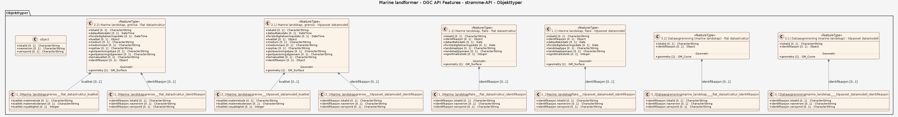

# Produktspesifikasjon: Marine landformer

## Generelt om spesifikasjonen

### Unik identifisering

5e8d9286-4d94-4e95-8546-2ef4b891c007

#### Fullstendig navn

Marine landformer

#### Versjon

2007-08-15

### Referansedato

2012-04-28

### Ansvarlig organisasjon

Norges geologiske undersøkelse

### Språk

nor

### Hovedtema

landformer, landform, terrengform, terreng, morfologi, dybde, ekkolodd, geologi, habitat, hav, havbunn, kartlegging, løsmasser, marin, maringeologi, natur, naturtype, prosesser, undervanns, sediment, sjøbunn, ras, skred, kanal, morene, morenerygg, sandbølge, gjel, isfjellpløyemerke, marine, landskap, Norge, Barentshavet, Norskehavet, Rijpfjorden, Kongsfjorden, Trondheimsfjorden, Drammensfjorden, Havområder, Inspire, Norge digitalt, geodataloven, Mareano, ØkologiskGrunnkart, MarineGrunnkart, modellbaserteVegprosjekter, fellesDatakatalog, NGU

### Temakategori

Geovitenskapelig informasjon

### Sammendrag

Datasettet viser en rekke landskapsformer på havbunnen på norsk kontinentalsokkel og i fjordene. Landformer kan være dannet under påvirkning av is (morenerygger, isfjellpløyemerker osv), ved utglidninger a sedimenter (skredformer), formet av bunnstrømmer (sandbølger) osv. Tolkningen er basert å detaljerte dybdedata og sedimentdata.

### Formål

Kunnskap om landformer på havbunnen gir oss forståelse av prosessene i det marine miljø, både de som formet havbunnen under og rett etter istiden, og de som påvirker havbunnen i dag.

### Bruksområde

Datasettet kan anvendes som underlag i overordnet areal- og miljøplanlegging, sårbarhetsanalyser, habitatskartlegging, i forbindelse med installasjoner på sjøbunnen osv.

### Romlig representasjonstype

Vektor

### Romlig oppløsning

**Ekvivalent målestokk**: 100000

### Utstrekning

**Geografisk utstrekning**:

- **Vest**: -6.7
- **Øst**: 32.0
- **Sør**: 57.0
- **Nord**: 82.0

**Tidsmessig utstrekning**:

- **Tidsperiode**:
  - **Fra**: 2007-08-15
  - **Til**: 2012-04-28

### Tilleggsinformasjon

Tolkningsgrunnlag for dette datasettet er detaljerte digitale dybdedata og sedimentdata.

### Begrensninger

**Ressursbegrensninger**:

- **Bruksbegrensninger**: Detaljnivået på datasettet tilsier bruk innenfor kartmålestokken: 1:50.000 - 1:250.000.

**Juridiske begrensninger**:

- **Tilgangsbegrensninger**: Åpne data
- **Bruksbegrensninger**: Lisens
- **Lisens**: Norsk lisens for offentlige data (NLOD)
- **Lisenslenke**: <http://data.norge.no/nlod/no/1.0>

## Spesifikasjonsomfang

### Hele datasettet  
**Nivå**: dataset  
**Utstrekning**:  
  - **Beskrivelse**: National  
**Nivåbeskrivelse**: Dette omganget dekker hele datasettet og alle leveranser 

### Filleveranse  
**Nivå**: datasett  
**Nivåbeskrivelse**: Filer levert som FGDB, SOSI og Shape, gjennom Geonorge kartkatalog og massiv-klient, samt Atom Feed.

### OGC API Features - strømme-API  
**Nivå**: tjeneste  
**Nivåbeskrivelse**: Tjeneste for for å strømme vektordata til kartapplikasjon eller for å inngå i en prosessering/analyse, eventuelt for nedlasting. API-et leverer data som JSON-FG, GML og GeoJSON i hebhold til en enklere datamodell enn nedlastbare filleveranser.

## Innhold og struktur

**Beskrivelse**: Datasettet kan anvendes som underlag i overordnet areal- og miljøplanlegging, sårbarhetsanalyser, habitatskartlegging, i forbindelse med installasjoner på sjøbunnen osv.

### Datamodell - Filleveranse

[Objektkatalog - Filleveranse](filleveranse/objektkatalog.html)

### Datamodell - OGC API Features - strømme-API

[Objektkatalog - OGC API Features - strømme-API](ogc-api-features-strmme-api/objektkatalog.html)

## Referansesystem

**Romlige referansesystemer**:

- **kode**: EPSG:25832
  **navn**: EUREF89 UTM sone 32, 2d

- **kode**: EPSG:25833
  **navn**: EUREF89 UTM sone 33, 2d

- **kode**: EPSG:25835
  **navn**: EUREF89 UTM sone 35, 2d

- **kode**: EPSG:32632
  **navn**: WGS84 UTM sone 32, 2d

- **kode**: EPSG:32633
  **navn**: WGS84 UTM sone 33, 2d

- **kode**: EPSG:32635
  **navn**: WGS84 UTM sone 35, 2d

- **kode**: EPSG:4326
  **navn**: WGS84 Geografisk

- **kode**: EPSG:25832
  **navn**: EUREF89 UTM sone 32, 2d

## Kvalitet

**Nivå**: dataset

- **Kvalitetsmål**: COMMISSION REGULATION (EU) No 1089/2010 of 23 November 2010 implementing Directive 2007/2/EC of the European Parliament and of the Council as regards interoperability of spatial data sets and services
  **Målebeskrivelse**: Datasettet er i henhold til nasjonal produktspesifikasjon
  **Beskrivende resultat**: Datasettet er i henhold til nasjonal produktspesifikasjon

- **Kvalitetsmål**: Prosentvis oppfyllelse av FAIR-prinsipper
  **Målebeskrivelse**: Angir fullstendighet i forhold til krav fra FAIR-prinsippene (The FAIR Guiding Principles for scientific data management and stewardship)
  **Resultat**: 91

- **Kvalitetsmål**: Prosentvis dekning i forhold til datasettets utstrekning
  **Målebeskrivelse**: Datasettets faktiske kartlagte areal i forhold til datasettets spesifiserte utstrekning
  **Resultat**: 50

- **Kvalitetsmål**: Prosentvis oppfyllelse av FAIR-prinsipper
  **Målebeskrivelse**: Angir fullstendighet i forhold til krav fra FAIR-prinsippene (The FAIR Guiding Principles for scientific data management and stewardship)
  **Resultat**: 91

- **Kvalitetsmål**: FAIR
  **Resultat**: Prosentvis oppfyllelse av FAIR-prinsipper: 91%

- **Kvalitetsmål**: Coverage
  **Resultat**: Prosentvis dekning i forhold til datasettets utstrekning: 50%

**Beskrivelse**: Tolkningsgrunnlag for dette datasettet er detaljerte digitale dybdedata og sedimentdata.

## Datafangst

**Datainnsamling og prosessering**:

- **Prosesstrinn**: - **Beskrivelse**: Datasettet er tolket og digitalisert av NGU, men grunnlaget for tolkninger er data fra Norges geologiske undersøkelse (NGU), Statens kartverk sjødivisjonen (SKS), Havforskningsinstituttet (HI), Forsvarets Forskningsinstitutt (FFI). Datatemaet Marine landformer er basert på kornstørrelsesdata, tolkning av video og prøver av sjøbunnen, tolkning av digitale reflektivitetsdata, samt tolkning av digitale seismiske data. Detaljerte vanndypsdata har inngått som støtte i tolkningen. Dataene er digitalisert og tilrettelagt vha. ArcGIS verktøy. Metodikken er beskrevet i egenskapsfeltene Målemetode og Geopåvisningtype.

## Datavedlikehold

**Vedlikeholdsfrekvens**: Etter behov

**Status**: Kontinuerlig oppdatert

## Presentasjon

**navn**: Tegneregler

**Lenke**:
<https://register.geonorge.no/register/versjoner/tegneregler/norges-geologiske-undersøkelse/marine-landformer>

## Leveranse

- **Leveranse**:

  - **Leveransemedium**:
    - **unitsOfDelivery**: fylkesvis, landsfiler, kommunevis
    - **Medienavn**: Atom Feed
    - **Leveransetjeneste**:
      - **Tjenesteendepunkt**: <https://nedlasting.ngu.no/api/atom/0f7c4324-e50d-4b68-b2b8-d10dcfaa05f7>
      - **Tjenesteegenskap**:
        - **type**: Atom Feed
        - **Verdi**: W3C:AtomFeed
  - **Leveranseformat**:
    - **Formatnavn**: FGDB

    - **Formatnavn**: Shape

    - **Formatnavn**: SOSI

- **Leveranse**:

  - **Leveransemedium**:
    - **unitsOfDelivery**: fylkesvis, landsfiler, kommunevis
    - **Medienavn**: Egen nedlastningsside
    - **Leveransetjeneste**:
      - **Tjenesteendepunkt**: <http://geo.ngu.no/download/order?dataset=710>
      - **Tjenesteegenskap**:
        - **type**: Egen nedlastningsside
        - **Verdi**: WWW:DOWNLOAD-1.0-http--download
  - **Leveranseformat**:
    - **Formatnavn**: FGDB

    - **Formatnavn**: Shape

    - **Formatnavn**: SOSI

- **Leveranse**:

  - **Leveransemedium**:
    - **unitsOfDelivery**: fylkesvis, landsfiler, kommunevis
    - **Medienavn**: WMS-tjeneste
    - **Leveransetjeneste**:
      - **Tjenesteendepunkt**: <https://geo.ngu.no/mapserver/MarinTerrengWMS2?REQUEST=GetCapabilities&SERVICE=WMS&VERSION=1.3.0>
      - **Tjenesteegenskap**:
        - **type**: WMS-tjeneste
        - **Verdi**: OGC:WMS

- **Leveranse**:

  - **Leveransemedium**:
    - **Medienavn**: Marine landformer WMS
    - **Leveransetjeneste**:
      - **Tjenesteendepunkt**: <https://geo.ngu.no/mapserver/MarinTerrengWMS2?request=GetCapabilities&service=WMS&version=1.3.0>
      - **Tjenesteegenskap**:
        - **type**: Marine landformer WMS
        - **Verdi**: WMS-tjeneste
  - **Leveranseformat**:
    - **Formatnavn**: image/png
      **versjon**: 1
  - **Leveranseomfang**: Tjeneste

- **Leveranse**:

  - **Leveransemedium**:
    - **Medienavn**: Marine landformer
    - **Leveransetjeneste**:
      - **Tjenesteendepunkt**: <https://geo.ngu.no/mapserver/MarinTerrengWMS2?REQUEST=GetCapabilities&SERVICE=WMS&VERSION=1.3.0>
      - **Tjenesteegenskap**:
        - **type**: Marine landformer
        - **Verdi**: WMS-tjeneste
  - **Leveranseformat**: - **Formatnavn**: [{}]
  - **Leveranseomfang**: Tjeneste

## Metadata

**Metadatastandard**: ISO19115

**Metadatastandardversjon**: 2003

**Metadatadato**: 2025-03-04

**språk**: nor

**Kontakt**:

- **Organisasjon**: Norges geologiske undersøkelse
- **Kontaktperson**: Janne Grete Wesche
- **Logo**: <https://register.geonorge.no/data/organizations/970188290_NGU_liten.png>
- **Epost**: Janne.Wesche@ngu.no
- **rolle**: pointOfContact

**Metadataidentifikator**:

- **Utsteder**: Geonorge
- **kode**: 5e8d9286-4d94-4e95-8546-2ef4b891c007
- **koderom**: <https://kartkatalog.geonorge.no/metadata/>
- **Metadatalenke**: <https://kartkatalog.geonorge.no/metadata/5e8d9286-4d94-4e95-8546-2ef4b891c007>

**Lenker**:

- **lenke**: <https://www.geonorge.no/geonetwork/srv/nor/csw?service=CSW&request=GetRecordById&version=2.0.2&outputSchema=http://www.isotc211.org/2005/gmd&elementSetName=full&id=5e8d9286-4d94-4e95-8546-2ef4b891c007>
  **relasjon**: describedby
  **type**: application/xml
  **tittel**: Metadata (ISO 19139)

- **lenke**: <http://www.mareano.no/tema/marine-landformer>
  **relasjon**: about
  **type**: text/html
  **tittel**: Produktside

- **lenke**: <http://geo.ngu.no/download/order?dataset=710>
  **relasjon**: enclosure
  **type**: text/html
  **tittel**: Nedlasting

- **lenke**: <https://geo.ngu.no/mapserver/MarinTerrengWMS2?REQUEST=GetCapabilities&SERVICE=WMS&VERSION=1.3.0>
  **relasjon**: alternate
  **type**: text/html
  **tittel**: Kartvisning

- **lenke**: #!?zoom=3&lon=306722&lat=7197864&wms=<https://geo.ngu.no/mapserver/MarinTerrengWMS2>
  **relasjon**: service
  **type**: text/html
  **tittel**: Tjeneste

- **lenke**: <https://geo.ngu.no/mapserver/MarinTerrengWMS2?request=GetCapabilities&service=WMS&version=1.3.0>
  **relasjon**: service
  **type**: application/xml
  **tittel**: Tjeneste-distribusjon
