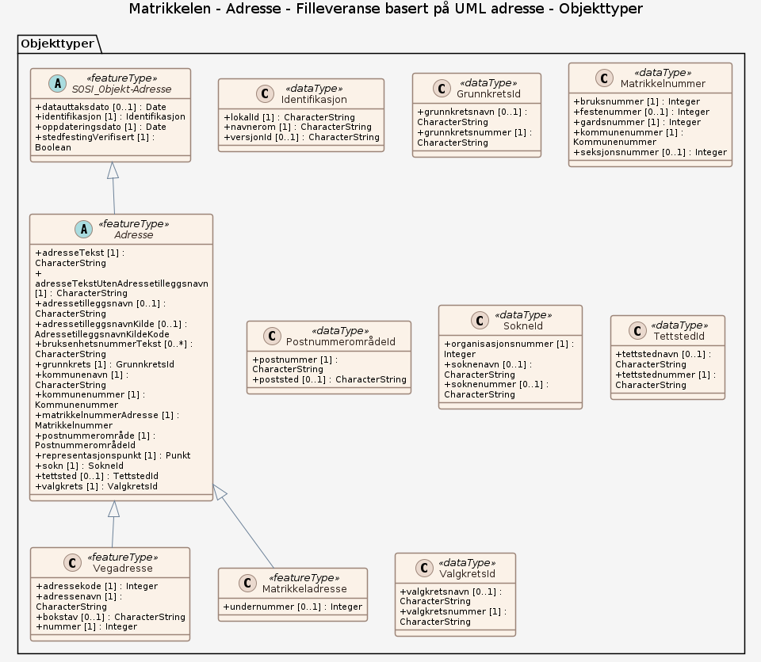

### Datamodell - Filleveranse basert på UML adresse

➡️ [Se full datamodell for omfang "Filleveranse basert på UML adresse" (diagram per pakke og objektkatalog)](filleveranse-basert-pa-uml-adresse/objektkatalog.html)
