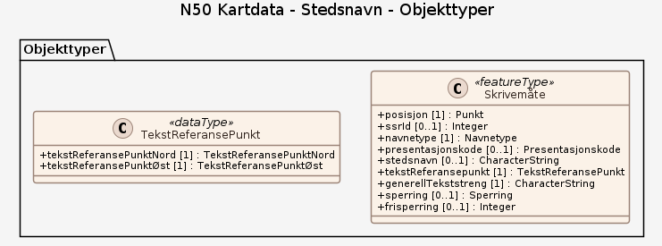

### Datamodell

#### Skrivemåte

ulike skrivemåter av navneenheten, ikke forskjellige navn

Egenskaper

<table class="feature-attribute-table">
  <colgroup>
    <col style="width: 35%;" />
    <col style="width: 65%;" />
  </colgroup>
  <tbody>
    <tr>
      <th scope="row">Navn:</th>
      <td><strong>posisjon</strong></td>
    </tr>
    <tr>
      <th scope="row">Definisjon:</th>
      <td>sted som objektet eksisterer på  merknad 1: Posisjon .PUNKT må mappes til .TEKST i henhold til SOSI 4.5 merknad 2: .TEKST angis med 3 koordinater. Første er objektkoordinat, andre er plasseringskoordinat og tredje er retningskoordinat</td>
    </tr>
    <tr>
      <th scope="row">Multiplisitet:</th>
      <td>1</td>
    </tr>
    <tr>
      <th scope="row">Type:</th>
      <td>Punkt</td>
    </tr>
  </tbody>
</table>

<table class="feature-attribute-table">
  <colgroup>
    <col style="width: 35%;" />
    <col style="width: 65%;" />
  </colgroup>
  <tbody>
    <tr>
      <th scope="row">Navn:</th>
      <td><strong>ssrId</strong></td>
    </tr>
    <tr>
      <th scope="row">Definisjon:</th>
      <td>koblingsnøkkel til navneenheten i SSR (Sentralt StedsnavnsRegister)</td>
    </tr>
    <tr>
      <th scope="row">Multiplisitet:</th>
      <td>0..1</td>
    </tr>
    <tr>
      <th scope="row">Type:</th>
      <td>Integer</td>
    </tr>
  </tbody>
</table>

<table class="feature-attribute-table">
  <colgroup>
    <col style="width: 35%;" />
    <col style="width: 65%;" />
  </colgroup>
  <tbody>
    <tr>
      <th scope="row">Navn:</th>
      <td><strong>navnetype</strong></td>
    </tr>
    <tr>
      <th scope="row">Definisjon:</th>
      <td>beskriver hvilke type terrengdetalj stedsnavnet representerer</td>
    </tr>
    <tr>
      <th scope="row">Multiplisitet:</th>
      <td>1</td>
    </tr>
    <tr>
      <th scope="row">Type:</th>
      <td>Navnetype</td>
    </tr>
    <tr>
      <th scope="row">Tillatte verdier:</th>
      <td>- Adm. by – Alle steder hvor kommunen har vedtatt bystatus - Adm. bydel – (Offisielt navn på bydelsforvaltningen). Se også Bydel  132. - Adm. tettsted – Statistisk sentralbyrås spesifikasjon. - Adressenavn – Omfatter et område, ev. som supplement til gate-/veiadresse. (Kommunalt adresseområde) - Allmenning – Område hvor rettighetene er regulert. (Alle typer. Noter i merknadsfelt) - Ankringsplass – F.eks. opplagsplass for store båter/skip - Annen adm. Inndeling – Landsdel, havnedistrikt, politidistrikt bispedømme, prestegjeld, skolekrets, valgkrets, postområde, etc. (Noter type i merknadsfelt) - Annen bygning for religiøse aktiviteter – Synagoge, moske,  frikirke, menighetshus, kloster, gravkapell,    bårehus, krematorium. Noter i merknadsfelt hvilken type + dato for merknaden. - Annen kulturdetalj – Alle typer kulturdetaljer f.eks. lekeplass, tårn, fiskeplass, etc. Noter forklaring med dato i merknadsfeltet - Badeplass – Offentlige og private badeplasser - Bakke – Skråning - Bakke i sjø – Skrånende sjøbunn - Banke – Flatt, større undervannsområde - Banke i sjø – Flatt, større undervannsområde - Barnehage – Offentlig eller privat barnehage - Bekk – Rennende vann i naturlig vannvei. Generelt smalere enn 3 meter - Bergverk (underjord./dagbrudd) – Gruve, skjerp - Boligblokk – Stort boligbygg med 2 eller flere etasjer hvor det er 5 eller flere boligenheter - Boligfelt – Regulert boligområde - Bomstasjon – Større bomanlegg på offentlig veg - Borettslag – Bofellesskap, vanligvis blokkbebyggelse - Botn – Dalende - Bru – Både for veg og jernbane. Angi ett punkt i hver ende for store bruer og ett midt på for små bruer. - Bruk (gardsbruk) – Landbruksbebyggelse som er eller har vært knyttet til jord- og/eller skogbruksdrift. Bruksnamn, namn på eigedom med eitt eller fleire bruksnummer eller festenummer under eit gardsnummer. Punktet ligger normalt på våningshuset (hvis dette finnes). - Brygge – Mindre, fast bryggeanlegg - Busstopp – Stoppested for rutegående vegtrafikk - By – Tettsted med handels- og servicefunksjoner. Bymessig med mer eller mindre sammenhengende, kvartalsbebyggelse (bykjerne). Bygninger med 2 eller flere etasjer. (Se også Adm. by 268). - Bydel – Kulturmessig del av by. F.eks. Gamlebyen, Vålerenga, Posebyen, Nordnes, Lade, Tromsdalen, Fagernes. (Se også Adm. bydel  269) - Bygdelag (bygd) – Stort uregulert gårdsbruk- og boligområde - Bygg for jordbruk, fiske og fangst – Bu, naust, uthus, fjøs, gamme - Båe – Stein under vannflaten - Båe i sjø – Stein under  vannflaten. - Båke – Offisiell og privat båke langs kysten og i innlandet, fast. - Campingplass – Alle typer både for campinghytter, campingvogner og telt - Dal – Mellomstor eller liten dal - Dalføre – Stor dal: Gudbrandsdalen, Namdalen, Setesdal, Valdres - Dam – Store reguleringsdammer og små fløtningsdammer - Del av innsjø – Mindre deler av store innsjøer. F.eks. Steinsfjorden i Tyrifjorden - Dyp (havdyp) – Område mer enn 200-300 meter under havflaten - Egg – Undersjøisk kant mot havdyp - Eid – Lavt/smalt parti mellom to vannkanter, elver eller vann - Eid i sjø – Lavt parti i terrenget mellom to sjøkanter - Eiendommer – Matrikulert eiendom - Elv – Rennende vann i naturlig vannvei. Generelt bredere enn 3 meter - Elvemel – Bratt sand- eller grus- skråning langs en elv (eller et vann) - Enebolig/mindre boligbygg (villa) – Enebolig eller tomannsbolig  Hus for fast bosetting, utenom våningshus, jf. 108. (Vanligvis dss. bruks­navn.) - Eng – Kultivert slåtte/gressmark - Fabrikk – Større industrivirksomhet - Farled/Skipslei – Normal strekning for skip f.eks. Trondheimsleia - Fengsel – Fengsel, arbeidskoloni - Ferjekai – Punktet legges på ferjelemmen på kaia for vegtrafikken - Ferjestrekning – Eksisterende ferjesamband som inngår i områdets samferdselsnett - Fiskeoppdrettsanlegg – På land, i sjø og i ferskvann - Fiskeplass – Fiskested, fiskemed i sjø. - Fjell – Stort fjell - Fjellheis – Gondolbane. - Fjellkant (aksel) – Skulder, nese, bryn - Fjellområde – Stort  fjellområde: Rondane, Saltfjellet, Lyseheiane - Fjellside – Vanligvis åpent skrånende terreng i fjellet - Fjord – Arm av havet inn i fastlandet - Fjordmunning – Område ytterst i en fjord - Flyplass – Landingsplass for rutegående flytrafikk og regulert privat flygning - Fløtningsannlegg – Kunstig fløtningsanlegg - Fonn – Liten snø- eller isflate - Fornøyelsespark – (Store, regulerte anlegg) - Forretningsbygg – Hus for kontor- og servicevirksomhet - Forsamlingshus/Kulturhus – Teater, kino, samf.hus, grendehus, etc. - Foss – Vann i tilnærmet fritt fall - Fritidsbolig (hytte, sommerhus) – Hus som ikke er ment for fast bosetting. (Vanligvis dass. bruks­navn.) - Fylke – (Offisielt navn) - Fyllplass – Plass for deponering av masse - Fyr(Fyrstasjon) – Offisielt fyr og fyrstasjon langs kysten. - Gammel bosettingsplass – Nedlagt bruk, seter, boplass, gamme. MRK !! Hus borte eller kun ruin. - Garasje/hangarbygg – Parkeringshus/ trikkestall/ bussgarasje/flyhangar/ lokomotivstall - Gard – Landbruksbebyggelse som er eller har vært knyttet til jord- og/eller skogbruksdrift. Gardsnamn, namnet på heile det gardsområdet som eitt eller fleire gardsnummer er knytte til. Punktet ligger normalt på våningshuset (hvis dette finnes) på et sentralt pla - Gjerde – Steingjerde, tregjerde etc. - Gravplass – Alle typer gravlunder, gravplasser. - Grend – Mindre uregulert gårdsbruk-, seterfelt- og boligområde - Grensemerke – Off. godkjent grensemerke (generelt): Varde, tre, stein, bolt, kors etc. - Grind – Port i gjerde - Grotte – Naturlig fjellgrotte f.eks. Grønnligrotta (Rana) - Grunne – Lite område under vann - Grunne i sjø – Forhøyning på bunnen som skiller seg vesentlig fra høyden på bunnen omkring - Grunnkrets – Se også 253 annen adm. inndeling - Gruppe av tjern – Flere små vann - Gruppe av vann – Flere middels store vann - Grustak/Steinbrudd – Uttaksplass, område, drevet i dagen for  sand, grus, pukk, skifer eller stein - Grøft – Rennende vann der forløpet er menneskeskapt  f.eks. dreneringsgrøfter i myr - Halvøy – Større nes i ferskvann med smalt eide mot fastland - Halvøy i sjø – Større nes med smalt eid mot fastland - Haug – Liten markant terrengform - Havn – Sted der fartøy  kan laste, losse eller søke ly for vær og sjø. - Havnehage – Inngjerdet beitemark - Havområde – Store områder: Barentshavet Nordsjøen, Atlanterhavet - Hei – Berglendt, høyere beliggende område med beitemark - Heller – Steinhule, steinsatt overnattingssted - Helseinstitusjon – Aldershjem, rekreasjonshjem og lignende - Holdeplass – Ubetjent stoppested for jernbane og trikk - Holme – Liten øy i ferskvann - Holme i sjø – Liten øy/skjær i sjø - Holmegruppe i sjø – Flere små skjær i sjø - Hotell – Offentlig godkjent overnattingssted - Hylle (hjell) – Flatt område i fjellside - Hyttefelt – Offentlig eller privat  hyttefelt. Område som har høy utnyttelsesgrad med tanke på hytter. - Høl – Dyp elvebunn under foss eller ved ende av stryk - Høyde – Mindre terrengform som ikke vurderes som fjell - Idrettsanlegg – (Alle typer utendørsanl. Noter type i merknadsfelt, f.eks. ridebane, fotballbane) - Idrettshall – Alle typer innendørsanlegg Ishall/svømmehall idrettshall. - Industriområde – Større sammenhengende område benyttet for industriformål - Innsjø – Stort vann: Altevatnet, Femunden, Mjøsa, Nisser - Isbre – Større sammenhengende snø- eller is område som ikke smelter i løpet av sommeren. F.eks. Svartisen eller Folgefonna - Jernbanestrekning – Lang  jernbanestrekning. F.eks.  Ofotbanen, Bergensbanen - Jorde – Kultivert dyrknings- mark - Juv – Kløftlignende dal, canyon - Kabel – Alle typer kabler i både sjø og ferskvann. - Kai – Større, fast bryggeanlegg - Kanal – Utgravd vannveg  i sjø og ferskvann - Kilde – Oppkomme, olle, vannkilde. Kildeutspring. Benyttes for å angi stedet hvor grunnvannet kommer i dagen - Kirke – Kirke / Kapell / Arbeidskirke knyttet til Den norske kirke - Klakk – Spiss grunne. (Trøndersk/Nordnorsk uttrykk) - Klopp – Gangbru over sjø og ferskvann - Kommune – (Offisielt navn) - Kraftgate (Rørgate) – Store tilførselsrør for kraftanlegg - Kraftledning – Vanligvis store overføringsledninger - Kraftstasjon – Alle størrelser for energi produksjon, (el. og varme) - Kryss (Veg/Gate) – (For alle type veger) - Landingsstripe – Landingsplass for privat flygning - Landskapsområde – Stort landskapsområde:  Dalane, Jæren, Romerike, Grenland, Salten, Varanger - Lanterne – Offisiell og privat lanterne langs kysten og i innlandet, fast - Li – Vanligvis skogkledd skrånende terreng - Lone – Nesten stillestående vik i elv eller bekk - Lykt (Fyrlykt) – Offisiell og privat lykt/fyrlykt langs kysten og i innlandet. - Lysbøye – Offisiell og privat lysbøye langs kysten og i innlandet, flytende - Melkeplass – Seterplass uten hus. Vanligvis i bratte områder på Vestlandet - Militært bygg/Anlegg – Militærleir, militært bygg - Mo – Flatt område, vanligvis skogkledd - Molo – Fast byggverk, utstikkende voll i sjøen - Museum/ Galleri/Bibliotek – Alle typer museum,  galleri og bibliotek - Myr – Alle typer fra gressmyr til våt moldjord - Nasjon – Selvstendig land (Offisielt navn) - Nes – Landområde stikkende ut i ferskvann - Nes i sjø – Landområde stikkende ut i saltvann - Nes ved elver – Landet mellom to møtende elver. Vanligvis kun brukt i samiske områder. Stedsnavnets skrivemåte skal IKKE avgjøre om navnet skal gis denne koden, men KUN lokalitetens størrelse eller fasong. - Offersted – Samisk, norsk eller finsk offersted - Oljeinstallasjon (Sjø) – Stasjonære oljeinstallasjoner (faste og flytende) - Os – Innløp eller utløp av elv eller bekk i innsjø/vann/tjern eller sjø (saltvann) - Overett – Offisiell og privat. To stenger med/uten lys overett langs kysten og i innlandet, faste. - Park – Kultivert område med eller uten trær. Kolonihage (i by eller tettbygd strøk) - Parkeringsplass – Offentlig og privat - Pensjonat – Offentlig godkjent overnattingssted - Plass/torg – (I tettsted eller by) - Poststed (Postkontor) – Offisielt poststed - Pytt – Liten dam, myrpytt - Rasteplass – Rasteplass med ansvarlig Statens vegvesen eller annen offentlig myndighet - Renne – Undersjøisk dal - Rygg – Langstrakt terrengform - Rygg i sjø – Undersjøisk ås - Rørledning – Alle typer rørledninger: Olje, gass, vann, etc. - Rådhus (komm, fylke, stat) – Adm. senteret (-huset) i adm. enheten. - Sand – Sand-grusområde over vannkontur/kystkontur. Morenemateriale - Senkning – Flat forsenkning, dalsenkning - Serveringssted – Serveringssted utenfor tettbygd område - Seter (sel, støl) – Enklere landbruksbe­byggelse. Kan ha periodisk fast bosetting, vanligvis sommerstid. - Setervoll – Ryddet, gressbevokst område på ei seter, med   eller uten hus - Severdighet – Noter forklaring i merknadsfeltet, f.eks. minnesmerke - Sjøstykke – Del av sjøen, vanligvis innaskjærs eller i kystnære farvann. F.eks. Folda, Hustadvika - Skar – Markant senkning i fjell - Skiheis – Skitrekk og stolheis i skianlegg. - Skjær – Stein i vannflaten - Skjær i sjø – Stein i vannflaten. - Skog – Alle typer fra stor barskog til vierkratt i Finnmark - Skogområde – Stort skogområde: Nordmarka, Bymarka, Finnskogen - Skole – Offentlig og privat skole - Skred – Rasområde: Alle typer materiale  (f.eks. stein, jord, sand, leire, o.l.) - Skytebane – Pistol- eller geværbane (o.l. våpen) - Skytefelt – Militære skytefelt. - Slalåm- og utforbakke – Alle typer regulerte alpinanlegg. - Slette – Åpent, flatt, ikke skogbevokst område - Sluse – Kunstig løfteanretning for båter i vassdrag - Småbåthavn – Regulerte havneanlegg for småbåter - Sogn – Kirkesogn Knyttet til Den norske kirke - Soneinndeling til havs – Fiskerisone, havrettssone, etc. (Noter type i merknadsfelt) - Stake – Offisiell og privat stake langs kysten og i innlandet, flytende - Stang – Offisiell og privat jernstang langs kysten og i innlandet, fast - Stasjon – Betjent stoppested for jernbane og trikk - Stein – F.eks. flyttstein i fjellet - Sti – Stistrekning, sleper (gamle drifteveger), reindriftsveger - Strand – Sand-, grus- eller steindekket område i vannkanten - Strand i sjø – Sand-, grus- eller steindekket område i sjøkanten - Stryk – Parti der vannet går i stryk og skiller seg tydelig fra resten av elv eller bekk - Stup – Loddrett eller svært bratt, fallende terreng - Stø – Båtstø, båtplass i  vannkanten uten naust - Sund – Innsnevret område i vann eller vassdrag - Sund i sjø – Innsnevret område mellom øyer eller fastland - Sva – Bart fjell-/steinparti - Sykehus – Offentlig og privat sykehus - Søkk – Mindre markant, begrenset fordypning - Søkk i sjø – Stor eller liten grop på sjøbunnen - Taubane – Uten persontrafikk. Se også 193 - Terrengdetalj – Alle typer små naturdetaljer. f.eks. sprekker, hulveier, sand-/stein-/grusflater, etc. - Tettbebyggelse – Mindre bebygd område uten sentrumskarakter f.eks. boligområde - Tettsted – Mindre bymessig bebygd område av sentrumskarakter - Tettsteddel – Kulturmessig del av tettsted. Se også navnetype 101. - Tjern – Lite vann - Topp (fjelltopp/tind) – Øverste fjelltopp - Torvtak – Sted for uttak av myrtorv / brenntorv / veksttorv. - Traktorveg – Driftsveger for kjøretøyer hvor vegen ikke kan kjøres med vanlig bil. - Tunnel – Vanlig tunnel, rasoverbygg, undergang. Både gangveg, veg og jernbane. Angi ett punkt i hver ende for lange og ett punkt midt på for korte tunneler - Turisthytte – Overnattingssted - TV/Radio-mast – TV/Radio ?tårn. Alle typer bakkebasert telekommunikasjon - Tømmerrenne – Kunstig tømmeranlegg - Tømmervelte – Midlertidig lagringsplass for tømmer - Universitet/høgskole – Offentlig og privat høyskole og universitet - Ur – Steinområde, steinrøys - Utmark – Ikke inngjerdet beitemark - Utsiktspunkt – Både i tårn og på bakken f.eks. Kongens utsikt - Utstikker – Flytende bryggeanlegg - Vad – Vassested i elv, bekk vann eller sjø. - Vaktstasjon/Beredsskapsbygning – Bygning for Politi/Brann/Los/Toll/Ambulanse/Fly- og skipsovervåkning - Vann – Middels stort vann - Vanndetalj – Alle typer : Noter forklaring i merknadsfeltet - Varde – F.eks. merkerøys, steinrøys. Langs kysten og i innlandet - Veg (Gate) – Formelle veg/gatenavn ellers kode 240 - Vegbom – Mindre bomanlegg på privat veg - Verksted – Mindre industrivirksomhet - Verneområder – (Alle typer både sjø og land. Noter type f.eks. Nasjonalpark i merknadsfelt) - Vidde – Høyere liggende større område uten skog med lave terrengvariasjoner innenfor området. F.eks. Valdresflyi, Hardangervidda, Finnmarksvidda, Laksefjordvidda - Vik – Kil, bukt i vann eller vassdrag. - Vik i sjø – Kil, bukt - Våg – Fjordarm, større vik - Øy – Tørt landområde i ferskvann atskilt fra fastlandet - Øy i sjø – Tørt landområde i saltvann atskilt fra fastlandet - Øygruppe – To eller flere øyer i ferskvann - Øygruppe i sjø – To eller flere øyer i saltvann f.eks. Hvaler og Lofoten - Øyr – Sand-grusområde i elvemunning, elvedelta både mot innsjø/vann og saltvann - Ås – Langstrakt, vanligvis skogkledd høydedrag.</td>
    </tr>
  </tbody>
</table>

<table class="feature-attribute-table">
  <colgroup>
    <col style="width: 35%;" />
    <col style="width: 65%;" />
  </colgroup>
  <tbody>
    <tr>
      <th scope="row">Navn:</th>
      <td><strong>presentasjonskode</strong></td>
    </tr>
    <tr>
      <th scope="row">Definisjon:</th>
      <td>koplingsnøkkel mot presentasjonsinformasjon. Merknad: Kan brukes for både tekst og symbol</td>
    </tr>
    <tr>
      <th scope="row">Multiplisitet:</th>
      <td>0..1</td>
    </tr>
    <tr>
      <th scope="row">Type:</th>
      <td>Presentasjonskode</td>
    </tr>
    <tr>
      <th scope="row">Tillatte verdier:</th>
      <td>- Kodeliste: <a href="http://skjema.geonorge.no/legg_inn_riktig_url">http://skjema.geonorge.no/legg_inn_riktig_url</a></td>
    </tr>
  </tbody>
</table>

<table class="feature-attribute-table">
  <colgroup>
    <col style="width: 35%;" />
    <col style="width: 65%;" />
  </colgroup>
  <tbody>
    <tr>
      <th scope="row">Navn:</th>
      <td><strong>stedsnavn</strong></td>
    </tr>
    <tr>
      <th scope="row">Definisjon:</th>
      <td>navneenhetens skrivemåte uten forkortninger</td>
    </tr>
    <tr>
      <th scope="row">Multiplisitet:</th>
      <td>0..1</td>
    </tr>
    <tr>
      <th scope="row">Type:</th>
      <td>CharacterString</td>
    </tr>
  </tbody>
</table>

<table class="feature-attribute-table">
  <colgroup>
    <col style="width: 35%;" />
    <col style="width: 65%;" />
  </colgroup>
  <tbody>
    <tr>
      <th scope="row">Navn:</th>
      <td><strong>tekstReferansepunkt</strong></td>
    </tr>
    <tr>
      <th scope="row">Definisjon:</th>
      <td>Tekstens referansepunkt er det stedet på teksten  hvor en tekstplassering refererer seg til. Hvis teksten består av flere linjer er det fremdeles referert ut fra første del av strengen (dvs i første linje). Merknad: Hvis ikke andre verdier er oppgitt, er default plassering av TREF som følger: TRNORD = 1, TRØST = 0, dvs nedre venstre punkt til første bokstav.</td>
    </tr>
    <tr>
      <th scope="row">Multiplisitet:</th>
      <td>1</td>
    </tr>
    <tr>
      <th scope="row">Type:</th>
      <td>TekstReferansePunkt</td>
    </tr>
  </tbody>
</table>

<table class="feature-attribute-table">
  <colgroup>
    <col style="width: 35%;" />
    <col style="width: 65%;" />
  </colgroup>
  <tbody>
    <tr>
      <th scope="row">Navn:</th>
      <td><strong>tekstReferansepunkt.tekstReferansePunktNord</strong></td>
    </tr>
    <tr>
      <th scope="row">Definisjon:</th>
      <td>vertikal plassering av teksten. Merknad: N50 Kartdata plasseres alltid teksten langs bunnlinja, dvs. TRNORD = 0</td>
    </tr>
    <tr>
      <th scope="row">Multiplisitet:</th>
      <td>1</td>
    </tr>
    <tr>
      <th scope="row">Type:</th>
      <td>TekstReferansePunktNord</td>
    </tr>
    <tr>
      <th scope="row">Tillatte verdier:</th>
      <td>- Kodeliste: <a href="http://skjema.geonorge.no/legg_inn_riktig_url">http://skjema.geonorge.no/legg_inn_riktig_url</a> - Bunnlinje - Midtlinje - Øvre kant - Grunnlinje</td>
    </tr>
  </tbody>
</table>

<table class="feature-attribute-table">
  <colgroup>
    <col style="width: 35%;" />
    <col style="width: 65%;" />
  </colgroup>
  <tbody>
    <tr>
      <th scope="row">Navn:</th>
      <td><strong>tekstReferansepunkt.tekstReferansePunktØst</strong></td>
    </tr>
    <tr>
      <th scope="row">Definisjon:</th>
      <td>horisontal plassering av teksten</td>
    </tr>
    <tr>
      <th scope="row">Multiplisitet:</th>
      <td>1</td>
    </tr>
    <tr>
      <th scope="row">Type:</th>
      <td>TekstReferansePunktØst</td>
    </tr>
    <tr>
      <th scope="row">Tillatte verdier:</th>
      <td>- Kodeliste: <a href="http://skjema.geonorge.no/legg_inn_riktig_url">http://skjema.geonorge.no/legg_inn_riktig_url</a> - Venstre kant - Midt i - Høyre kant</td>
    </tr>
  </tbody>
</table>

<table class="feature-attribute-table">
  <colgroup>
    <col style="width: 35%;" />
    <col style="width: 65%;" />
  </colgroup>
  <tbody>
    <tr>
      <th scope="row">Navn:</th>
      <td><strong>generellTekststreng</strong></td>
    </tr>
    <tr>
      <th scope="row">Definisjon:</th>
      <td>navneenhetens skrivemåte</td>
    </tr>
    <tr>
      <th scope="row">Multiplisitet:</th>
      <td>1</td>
    </tr>
    <tr>
      <th scope="row">Type:</th>
      <td>CharacterString</td>
    </tr>
  </tbody>
</table>

<table class="feature-attribute-table">
  <colgroup>
    <col style="width: 35%;" />
    <col style="width: 65%;" />
  </colgroup>
  <tbody>
    <tr>
      <th scope="row">Navn:</th>
      <td><strong>sperring</strong></td>
    </tr>
    <tr>
      <th scope="row">Definisjon:</th>
      <td>sperring regulerer avstanden mellom bokstavene i teksten. Dette gjøres ved forholdstall relatert til størrelsen på største bokstavblokk</td>
    </tr>
    <tr>
      <th scope="row">Multiplisitet:</th>
      <td>0..1</td>
    </tr>
    <tr>
      <th scope="row">Type:</th>
      <td>Sperring</td>
    </tr>
    <tr>
      <th scope="row">Tillatte verdier:</th>
      <td>- Kodeliste: <a href="http://skjema.geonorge.no/legg_inn_riktig_url">http://skjema.geonorge.no/legg_inn_riktig_url</a> - Liten sperring – Liten sperring = 1 drittel, dvs 1/3 av "største bokstavblokk" mellom hver bokstav. - Middels sperring – Middels sperring = halvgefirt, dvs 1/2 av "største bokstavblokk" mellom hver bokstav. - Stor sperring – Stor sperring = 1 gefirt, dvs 1 (største) "bokstavblokk" mellom hver bokstav.</td>
    </tr>
  </tbody>
</table>

<table class="feature-attribute-table">
  <colgroup>
    <col style="width: 35%;" />
    <col style="width: 65%;" />
  </colgroup>
  <tbody>
    <tr>
      <th scope="row">Navn:</th>
      <td><strong>frisperring</strong></td>
    </tr>
    <tr>
      <th scope="row">Definisjon:</th>
      <td>skriftlengden i mm på presentasjonsmedium</td>
    </tr>
    <tr>
      <th scope="row">Multiplisitet:</th>
      <td>0..1</td>
    </tr>
    <tr>
      <th scope="row">Type:</th>
      <td>Integer</td>
    </tr>
  </tbody>
</table>

### Kodelister

#### «Enumeration» Navnetype

**Definisjon:** navnetype er en underinndeling av TEMA-koden, brukt for mer detaljert koding. Denne forteller hva slags begrep navneheten står til
Merknad: Kun typer som er beskrevet i tabellen kan benyttes. Listen er delt inn i hovedgrupper og undergrupper.

Koder

<table class="code-list-table">
  <thead>
    <tr>
      <th>Kodenavn:</th>
      <th>Definisjon:</th>
      <th>Kodeverdi:</th>
    </tr>
  </thead>
  <tbody>
    <tr>
      <td>Adm. by</td>
      <td>Alle steder hvor kommunen har vedtatt bystatus</td>
      <td></td>
    </tr>
    <tr>
      <td>Adm. bydel</td>
      <td>(Offisielt navn på bydelsforvaltningen). Se også Bydel  132.</td>
      <td></td>
    </tr>
    <tr>
      <td>Adm. tettsted</td>
      <td>Statistisk sentralbyrås spesifikasjon.</td>
      <td></td>
    </tr>
    <tr>
      <td>Adressenavn</td>
      <td>Omfatter et område, ev. som supplement til gate-/veiadresse. (Kommunalt adresseområde)</td>
      <td></td>
    </tr>
    <tr>
      <td>Allmenning</td>
      <td>Område hvor rettighetene er regulert. (Alle typer. Noter i merknadsfelt)</td>
      <td></td>
    </tr>
    <tr>
      <td>Ankringsplass</td>
      <td>F.eks. opplagsplass for store båter/skip</td>
      <td></td>
    </tr>
    <tr>
      <td>Annen adm. Inndeling</td>
      <td>Landsdel, havnedistrikt, politidistrikt bispedømme, prestegjeld, skolekrets, valgkrets, postområde, etc. (Noter type i merknadsfelt)</td>
      <td></td>
    </tr>
    <tr>
      <td>Annen bygning for religiøse aktiviteter</td>
      <td>Synagoge, moske,  frikirke, menighetshus, kloster, gravkapell,    bårehus, krematorium. Noter i merknadsfelt hvilken type + dato for merknaden.</td>
      <td></td>
    </tr>
    <tr>
      <td>Annen kulturdetalj</td>
      <td>Alle typer kulturdetaljer f.eks. lekeplass, tårn, fiskeplass, etc. Noter forklaring med dato i merknadsfeltet</td>
      <td></td>
    </tr>
    <tr>
      <td>Badeplass</td>
      <td>Offentlige og private badeplasser</td>
      <td></td>
    </tr>
    <tr>
      <td>Bakke</td>
      <td>Skråning</td>
      <td></td>
    </tr>
    <tr>
      <td>Bakke i sjø</td>
      <td>Skrånende sjøbunn</td>
      <td></td>
    </tr>
    <tr>
      <td>Banke</td>
      <td>Flatt, større undervannsområde</td>
      <td></td>
    </tr>
    <tr>
      <td>Banke i sjø</td>
      <td>Flatt, større undervannsområde</td>
      <td></td>
    </tr>
    <tr>
      <td>Barnehage</td>
      <td>Offentlig eller privat barnehage</td>
      <td></td>
    </tr>
    <tr>
      <td>Bekk</td>
      <td>Rennende vann i naturlig vannvei. Generelt smalere enn 3 meter</td>
      <td></td>
    </tr>
    <tr>
      <td>Bergverk (underjord./dagbrudd)</td>
      <td>Gruve, skjerp</td>
      <td></td>
    </tr>
    <tr>
      <td>Boligblokk</td>
      <td>Stort boligbygg med 2 eller flere etasjer hvor det er 5 eller flere boligenheter</td>
      <td></td>
    </tr>
    <tr>
      <td>Boligfelt</td>
      <td>Regulert boligområde</td>
      <td></td>
    </tr>
    <tr>
      <td>Bomstasjon</td>
      <td>Større bomanlegg på offentlig veg</td>
      <td></td>
    </tr>
    <tr>
      <td>Borettslag</td>
      <td>Bofellesskap, vanligvis blokkbebyggelse</td>
      <td></td>
    </tr>
    <tr>
      <td>Botn</td>
      <td>Dalende</td>
      <td></td>
    </tr>
    <tr>
      <td>Bru</td>
      <td>Både for veg og jernbane. Angi ett punkt i hver ende for store bruer og ett midt på for små bruer.</td>
      <td></td>
    </tr>
    <tr>
      <td>Bruk (gardsbruk)</td>
      <td>Landbruksbebyggelse som er eller har vært knyttet til jord- og/eller skogbruksdrift. Bruksnamn, namn på eigedom med eitt eller fleire bruksnummer eller festenummer under eit gardsnummer. Punktet ligger normalt på våningshuset (hvis dette finnes).</td>
      <td></td>
    </tr>
    <tr>
      <td>Brygge</td>
      <td>Mindre, fast bryggeanlegg</td>
      <td></td>
    </tr>
    <tr>
      <td>Busstopp</td>
      <td>Stoppested for rutegående vegtrafikk</td>
      <td></td>
    </tr>
    <tr>
      <td>By</td>
      <td>Tettsted med handels- og servicefunksjoner. Bymessig med mer eller mindre sammenhengende, kvartalsbebyggelse (bykjerne). Bygninger med 2 eller flere etasjer. (Se også Adm. by 268).</td>
      <td></td>
    </tr>
    <tr>
      <td>Bydel</td>
      <td>Kulturmessig del av by. F.eks. Gamlebyen, Vålerenga, Posebyen, Nordnes, Lade, Tromsdalen, Fagernes. (Se også Adm. bydel  269)</td>
      <td></td>
    </tr>
    <tr>
      <td>Bygdelag (bygd)</td>
      <td>Stort uregulert gårdsbruk- og boligområde</td>
      <td></td>
    </tr>
    <tr>
      <td>Bygg for jordbruk, fiske og fangst</td>
      <td>Bu, naust, uthus, fjøs, gamme</td>
      <td></td>
    </tr>
    <tr>
      <td>Båe</td>
      <td>Stein under vannflaten</td>
      <td></td>
    </tr>
    <tr>
      <td>Båe i sjø</td>
      <td>Stein under  vannflaten.</td>
      <td></td>
    </tr>
    <tr>
      <td>Båke</td>
      <td>Offisiell og privat båke langs kysten og i innlandet, fast.</td>
      <td></td>
    </tr>
    <tr>
      <td>Campingplass</td>
      <td>Alle typer både for campinghytter, campingvogner og telt</td>
      <td></td>
    </tr>
    <tr>
      <td>Dal</td>
      <td>Mellomstor eller liten dal</td>
      <td></td>
    </tr>
    <tr>
      <td>Dalføre</td>
      <td>Stor dal: Gudbrandsdalen, Namdalen, Setesdal, Valdres</td>
      <td></td>
    </tr>
    <tr>
      <td>Dam</td>
      <td>Store reguleringsdammer og små fløtningsdammer</td>
      <td></td>
    </tr>
    <tr>
      <td>Del av innsjø</td>
      <td>Mindre deler av store innsjøer. F.eks. Steinsfjorden i Tyrifjorden</td>
      <td></td>
    </tr>
    <tr>
      <td>Dyp (havdyp)</td>
      <td>Område mer enn 200-300 meter under havflaten</td>
      <td></td>
    </tr>
    <tr>
      <td>Egg</td>
      <td>Undersjøisk kant mot havdyp</td>
      <td></td>
    </tr>
    <tr>
      <td>Eid</td>
      <td>Lavt/smalt parti mellom to vannkanter, elver eller vann</td>
      <td></td>
    </tr>
    <tr>
      <td>Eid i sjø</td>
      <td>Lavt parti i terrenget mellom to sjøkanter</td>
      <td></td>
    </tr>
    <tr>
      <td>Eiendommer</td>
      <td>Matrikulert eiendom</td>
      <td></td>
    </tr>
    <tr>
      <td>Elv</td>
      <td>Rennende vann i naturlig vannvei. Generelt bredere enn 3 meter</td>
      <td></td>
    </tr>
    <tr>
      <td>Elvemel</td>
      <td>Bratt sand- eller grus- skråning langs en elv (eller et vann)</td>
      <td></td>
    </tr>
    <tr>
      <td>Enebolig/mindre boligbygg (villa)</td>
      <td>Enebolig eller tomannsbolig  Hus for fast bosetting, utenom våningshus, jf. 108. (Vanligvis dss. bruks­navn.)</td>
      <td></td>
    </tr>
    <tr>
      <td>Eng</td>
      <td>Kultivert slåtte/gressmark</td>
      <td></td>
    </tr>
    <tr>
      <td>Fabrikk</td>
      <td>Større industrivirksomhet</td>
      <td></td>
    </tr>
    <tr>
      <td>Farled/Skipslei</td>
      <td>Normal strekning for skip f.eks. Trondheimsleia</td>
      <td></td>
    </tr>
    <tr>
      <td>Fengsel</td>
      <td>Fengsel, arbeidskoloni</td>
      <td></td>
    </tr>
    <tr>
      <td>Ferjekai</td>
      <td>Punktet legges på ferjelemmen på kaia for vegtrafikken</td>
      <td></td>
    </tr>
    <tr>
      <td>Ferjestrekning</td>
      <td>Eksisterende ferjesamband som inngår i områdets samferdselsnett</td>
      <td></td>
    </tr>
    <tr>
      <td>Fiskeoppdrettsanlegg</td>
      <td>På land, i sjø og i ferskvann</td>
      <td></td>
    </tr>
    <tr>
      <td>Fiskeplass</td>
      <td>Fiskested, fiskemed i sjø.</td>
      <td></td>
    </tr>
    <tr>
      <td>Fjell</td>
      <td>Stort fjell</td>
      <td></td>
    </tr>
    <tr>
      <td>Fjellheis</td>
      <td>Gondolbane.</td>
      <td></td>
    </tr>
    <tr>
      <td>Fjellkant (aksel)</td>
      <td>Skulder, nese, bryn</td>
      <td></td>
    </tr>
    <tr>
      <td>Fjellområde</td>
      <td>Stort  fjellområde: Rondane, Saltfjellet, Lyseheiane</td>
      <td></td>
    </tr>
    <tr>
      <td>Fjellside</td>
      <td>Vanligvis åpent skrånende terreng i fjellet</td>
      <td></td>
    </tr>
    <tr>
      <td>Fjord</td>
      <td>Arm av havet inn i fastlandet</td>
      <td></td>
    </tr>
    <tr>
      <td>Fjordmunning</td>
      <td>Område ytterst i en fjord</td>
      <td></td>
    </tr>
    <tr>
      <td>Flyplass</td>
      <td>Landingsplass for rutegående flytrafikk og regulert privat flygning</td>
      <td></td>
    </tr>
    <tr>
      <td>Fløtningsannlegg</td>
      <td>Kunstig fløtningsanlegg</td>
      <td></td>
    </tr>
    <tr>
      <td>Fonn</td>
      <td>Liten snø- eller isflate</td>
      <td></td>
    </tr>
    <tr>
      <td>Fornøyelsespark</td>
      <td>(Store, regulerte anlegg)</td>
      <td></td>
    </tr>
    <tr>
      <td>Forretningsbygg</td>
      <td>Hus for kontor- og servicevirksomhet</td>
      <td></td>
    </tr>
    <tr>
      <td>Forsamlingshus/Kulturhus</td>
      <td>Teater, kino, samf.hus, grendehus, etc.</td>
      <td></td>
    </tr>
    <tr>
      <td>Foss</td>
      <td>Vann i tilnærmet fritt fall</td>
      <td></td>
    </tr>
    <tr>
      <td>Fritidsbolig (hytte, sommerhus)</td>
      <td>Hus som ikke er ment for fast bosetting. (Vanligvis dass. bruks­navn.)</td>
      <td></td>
    </tr>
    <tr>
      <td>Fylke</td>
      <td>(Offisielt navn)</td>
      <td></td>
    </tr>
    <tr>
      <td>Fyllplass</td>
      <td>Plass for deponering av masse</td>
      <td></td>
    </tr>
    <tr>
      <td>Fyr(Fyrstasjon)</td>
      <td>Offisielt fyr og fyrstasjon langs kysten.</td>
      <td></td>
    </tr>
    <tr>
      <td>Gammel bosettingsplass</td>
      <td>Nedlagt bruk, seter, boplass, gamme. MRK !! Hus borte eller kun ruin.</td>
      <td></td>
    </tr>
    <tr>
      <td>Garasje/hangarbygg</td>
      <td>Parkeringshus/ trikkestall/ bussgarasje/flyhangar/ lokomotivstall</td>
      <td></td>
    </tr>
    <tr>
      <td>Gard</td>
      <td>Landbruksbebyggelse som er eller har vært knyttet til jord- og/eller skogbruksdrift. Gardsnamn, namnet på heile det gardsområdet som eitt eller fleire gardsnummer er knytte til. Punktet ligger normalt på våningshuset (hvis dette finnes) på et sentralt pla</td>
      <td></td>
    </tr>
    <tr>
      <td>Gjerde</td>
      <td>Steingjerde, tregjerde etc.</td>
      <td></td>
    </tr>
    <tr>
      <td>Gravplass</td>
      <td>Alle typer gravlunder, gravplasser.</td>
      <td></td>
    </tr>
    <tr>
      <td>Grend</td>
      <td>Mindre uregulert gårdsbruk-, seterfelt- og boligområde</td>
      <td></td>
    </tr>
    <tr>
      <td>Grensemerke</td>
      <td>Off. godkjent grensemerke (generelt): Varde, tre, stein, bolt, kors etc.</td>
      <td></td>
    </tr>
    <tr>
      <td>Grind</td>
      <td>Port i gjerde</td>
      <td></td>
    </tr>
    <tr>
      <td>Grotte</td>
      <td>Naturlig fjellgrotte f.eks. Grønnligrotta (Rana)</td>
      <td></td>
    </tr>
    <tr>
      <td>Grunne</td>
      <td>Lite område under vann</td>
      <td></td>
    </tr>
    <tr>
      <td>Grunne i sjø</td>
      <td>Forhøyning på bunnen som skiller seg vesentlig fra høyden på bunnen omkring</td>
      <td></td>
    </tr>
    <tr>
      <td>Grunnkrets</td>
      <td>Se også 253 annen adm. inndeling</td>
      <td></td>
    </tr>
    <tr>
      <td>Gruppe av tjern</td>
      <td>Flere små vann</td>
      <td></td>
    </tr>
    <tr>
      <td>Gruppe av vann</td>
      <td>Flere middels store vann</td>
      <td></td>
    </tr>
    <tr>
      <td>Grustak/Steinbrudd</td>
      <td>Uttaksplass, område, drevet i dagen for  sand, grus, pukk, skifer eller stein</td>
      <td></td>
    </tr>
    <tr>
      <td>Grøft</td>
      <td>Rennende vann der forløpet er menneskeskapt  f.eks. dreneringsgrøfter i myr</td>
      <td></td>
    </tr>
    <tr>
      <td>Halvøy</td>
      <td>Større nes i ferskvann med smalt eide mot fastland</td>
      <td></td>
    </tr>
    <tr>
      <td>Halvøy i sjø</td>
      <td>Større nes med smalt eid mot fastland</td>
      <td></td>
    </tr>
    <tr>
      <td>Haug</td>
      <td>Liten markant terrengform</td>
      <td></td>
    </tr>
    <tr>
      <td>Havn</td>
      <td>Sted der fartøy  kan laste, losse eller søke ly for vær og sjø.</td>
      <td></td>
    </tr>
    <tr>
      <td>Havnehage</td>
      <td>Inngjerdet beitemark</td>
      <td></td>
    </tr>
    <tr>
      <td>Havområde</td>
      <td>Store områder: Barentshavet Nordsjøen, Atlanterhavet</td>
      <td></td>
    </tr>
    <tr>
      <td>Hei</td>
      <td>Berglendt, høyere beliggende område med beitemark</td>
      <td></td>
    </tr>
    <tr>
      <td>Heller</td>
      <td>Steinhule, steinsatt overnattingssted</td>
      <td></td>
    </tr>
    <tr>
      <td>Helseinstitusjon</td>
      <td>Aldershjem, rekreasjonshjem og lignende</td>
      <td></td>
    </tr>
    <tr>
      <td>Holdeplass</td>
      <td>Ubetjent stoppested for jernbane og trikk</td>
      <td></td>
    </tr>
    <tr>
      <td>Holme</td>
      <td>Liten øy i ferskvann</td>
      <td></td>
    </tr>
    <tr>
      <td>Holme i sjø</td>
      <td>Liten øy/skjær i sjø</td>
      <td></td>
    </tr>
    <tr>
      <td>Holmegruppe i sjø</td>
      <td>Flere små skjær i sjø</td>
      <td></td>
    </tr>
    <tr>
      <td>Hotell</td>
      <td>Offentlig godkjent overnattingssted</td>
      <td></td>
    </tr>
    <tr>
      <td>Hylle (hjell)</td>
      <td>Flatt område i fjellside</td>
      <td></td>
    </tr>
    <tr>
      <td>Hyttefelt</td>
      <td>Offentlig eller privat  hyttefelt. Område som har høy utnyttelsesgrad med tanke på hytter.</td>
      <td></td>
    </tr>
    <tr>
      <td>Høl</td>
      <td>Dyp elvebunn under foss eller ved ende av stryk</td>
      <td></td>
    </tr>
    <tr>
      <td>Høyde</td>
      <td>Mindre terrengform som ikke vurderes som fjell</td>
      <td></td>
    </tr>
    <tr>
      <td>Idrettsanlegg</td>
      <td>(Alle typer utendørsanl. Noter type i merknadsfelt, f.eks. ridebane, fotballbane)</td>
      <td></td>
    </tr>
    <tr>
      <td>Idrettshall</td>
      <td>Alle typer innendørsanlegg Ishall/svømmehall idrettshall.</td>
      <td></td>
    </tr>
    <tr>
      <td>Industriområde</td>
      <td>Større sammenhengende område benyttet for industriformål</td>
      <td></td>
    </tr>
    <tr>
      <td>Innsjø</td>
      <td>Stort vann: Altevatnet, Femunden, Mjøsa, Nisser</td>
      <td></td>
    </tr>
    <tr>
      <td>Isbre</td>
      <td>Større sammenhengende snø- eller is område som ikke smelter i løpet av sommeren. F.eks. Svartisen eller Folgefonna</td>
      <td></td>
    </tr>
    <tr>
      <td>Jernbanestrekning</td>
      <td>Lang  jernbanestrekning. F.eks.  Ofotbanen, Bergensbanen</td>
      <td></td>
    </tr>
    <tr>
      <td>Jorde</td>
      <td>Kultivert dyrknings- mark</td>
      <td></td>
    </tr>
    <tr>
      <td>Juv</td>
      <td>Kløftlignende dal, canyon</td>
      <td></td>
    </tr>
    <tr>
      <td>Kabel</td>
      <td>Alle typer kabler i både sjø og ferskvann.</td>
      <td></td>
    </tr>
    <tr>
      <td>Kai</td>
      <td>Større, fast bryggeanlegg</td>
      <td></td>
    </tr>
    <tr>
      <td>Kanal</td>
      <td>Utgravd vannveg  i sjø og ferskvann</td>
      <td></td>
    </tr>
    <tr>
      <td>Kilde</td>
      <td>Oppkomme, olle, vannkilde. Kildeutspring. Benyttes for å angi stedet hvor grunnvannet kommer i dagen</td>
      <td></td>
    </tr>
    <tr>
      <td>Kirke</td>
      <td>Kirke / Kapell / Arbeidskirke knyttet til Den norske kirke</td>
      <td></td>
    </tr>
    <tr>
      <td>Klakk</td>
      <td>Spiss grunne. (Trøndersk/Nordnorsk uttrykk)</td>
      <td></td>
    </tr>
    <tr>
      <td>Klopp</td>
      <td>Gangbru over sjø og ferskvann</td>
      <td></td>
    </tr>
    <tr>
      <td>Kommune</td>
      <td>(Offisielt navn)</td>
      <td></td>
    </tr>
    <tr>
      <td>Kraftgate (Rørgate)</td>
      <td>Store tilførselsrør for kraftanlegg</td>
      <td></td>
    </tr>
    <tr>
      <td>Kraftledning</td>
      <td>Vanligvis store overføringsledninger</td>
      <td></td>
    </tr>
    <tr>
      <td>Kraftstasjon</td>
      <td>Alle størrelser for energi produksjon, (el. og varme)</td>
      <td></td>
    </tr>
    <tr>
      <td>Kryss (Veg/Gate)</td>
      <td>(For alle type veger)</td>
      <td></td>
    </tr>
    <tr>
      <td>Landingsstripe</td>
      <td>Landingsplass for privat flygning</td>
      <td></td>
    </tr>
    <tr>
      <td>Landskapsområde</td>
      <td>Stort landskapsområde:  Dalane, Jæren, Romerike, Grenland, Salten, Varanger</td>
      <td></td>
    </tr>
    <tr>
      <td>Lanterne</td>
      <td>Offisiell og privat lanterne langs kysten og i innlandet, fast</td>
      <td></td>
    </tr>
    <tr>
      <td>Li</td>
      <td>Vanligvis skogkledd skrånende terreng</td>
      <td></td>
    </tr>
    <tr>
      <td>Lone</td>
      <td>Nesten stillestående vik i elv eller bekk</td>
      <td></td>
    </tr>
    <tr>
      <td>Lykt (Fyrlykt)</td>
      <td>Offisiell og privat lykt/fyrlykt langs kysten og i innlandet.</td>
      <td></td>
    </tr>
    <tr>
      <td>Lysbøye</td>
      <td>Offisiell og privat lysbøye langs kysten og i innlandet, flytende</td>
      <td></td>
    </tr>
    <tr>
      <td>Melkeplass</td>
      <td>Seterplass uten hus. Vanligvis i bratte områder på Vestlandet</td>
      <td></td>
    </tr>
    <tr>
      <td>Militært bygg/Anlegg</td>
      <td>Militærleir, militært bygg</td>
      <td></td>
    </tr>
    <tr>
      <td>Mo</td>
      <td>Flatt område, vanligvis skogkledd</td>
      <td></td>
    </tr>
    <tr>
      <td>Molo</td>
      <td>Fast byggverk, utstikkende voll i sjøen</td>
      <td></td>
    </tr>
    <tr>
      <td>Museum/ Galleri/Bibliotek</td>
      <td>Alle typer museum,  galleri og bibliotek</td>
      <td></td>
    </tr>
    <tr>
      <td>Myr</td>
      <td>Alle typer fra gressmyr til våt moldjord</td>
      <td></td>
    </tr>
    <tr>
      <td>Nasjon</td>
      <td>Selvstendig land (Offisielt navn)</td>
      <td></td>
    </tr>
    <tr>
      <td>Nes</td>
      <td>Landområde stikkende ut i ferskvann</td>
      <td></td>
    </tr>
    <tr>
      <td>Nes i sjø</td>
      <td>Landområde stikkende ut i saltvann</td>
      <td></td>
    </tr>
    <tr>
      <td>Nes ved elver</td>
      <td>Landet mellom to møtende elver. Vanligvis kun brukt i samiske områder. Stedsnavnets skrivemåte skal IKKE avgjøre om navnet skal gis denne koden, men KUN lokalitetens størrelse eller fasong.</td>
      <td></td>
    </tr>
    <tr>
      <td>Offersted</td>
      <td>Samisk, norsk eller finsk offersted</td>
      <td></td>
    </tr>
    <tr>
      <td>Oljeinstallasjon (Sjø)</td>
      <td>Stasjonære oljeinstallasjoner (faste og flytende)</td>
      <td></td>
    </tr>
    <tr>
      <td>Os</td>
      <td>Innløp eller utløp av elv eller bekk i innsjø/vann/tjern eller sjø (saltvann)</td>
      <td></td>
    </tr>
    <tr>
      <td>Overett</td>
      <td>Offisiell og privat. To stenger med/uten lys overett langs kysten og i innlandet, faste.</td>
      <td></td>
    </tr>
    <tr>
      <td>Park</td>
      <td>Kultivert område med eller uten trær. Kolonihage (i by eller tettbygd strøk)</td>
      <td></td>
    </tr>
    <tr>
      <td>Parkeringsplass</td>
      <td>Offentlig og privat</td>
      <td></td>
    </tr>
    <tr>
      <td>Pensjonat</td>
      <td>Offentlig godkjent overnattingssted</td>
      <td></td>
    </tr>
    <tr>
      <td>Plass/torg</td>
      <td>(I tettsted eller by)</td>
      <td></td>
    </tr>
    <tr>
      <td>Poststed (Postkontor)</td>
      <td>Offisielt poststed</td>
      <td></td>
    </tr>
    <tr>
      <td>Pytt</td>
      <td>Liten dam, myrpytt</td>
      <td></td>
    </tr>
    <tr>
      <td>Rasteplass</td>
      <td>Rasteplass med ansvarlig Statens vegvesen eller annen offentlig myndighet</td>
      <td></td>
    </tr>
    <tr>
      <td>Renne</td>
      <td>Undersjøisk dal</td>
      <td></td>
    </tr>
    <tr>
      <td>Rygg</td>
      <td>Langstrakt terrengform</td>
      <td></td>
    </tr>
    <tr>
      <td>Rygg i sjø</td>
      <td>Undersjøisk ås</td>
      <td></td>
    </tr>
    <tr>
      <td>Rørledning</td>
      <td>Alle typer rørledninger: Olje, gass, vann, etc.</td>
      <td></td>
    </tr>
    <tr>
      <td>Rådhus (komm, fylke, stat)</td>
      <td>Adm. senteret (-huset) i adm. enheten.</td>
      <td></td>
    </tr>
    <tr>
      <td>Sand</td>
      <td>Sand-grusområde over vannkontur/kystkontur. Morenemateriale</td>
      <td></td>
    </tr>
    <tr>
      <td>Senkning</td>
      <td>Flat forsenkning, dalsenkning</td>
      <td></td>
    </tr>
    <tr>
      <td>Serveringssted</td>
      <td>Serveringssted utenfor tettbygd område</td>
      <td></td>
    </tr>
    <tr>
      <td>Seter (sel, støl)</td>
      <td>Enklere landbruksbe­byggelse. Kan ha periodisk fast bosetting, vanligvis sommerstid.</td>
      <td></td>
    </tr>
    <tr>
      <td>Setervoll</td>
      <td>Ryddet, gressbevokst område på ei seter, med   eller uten hus</td>
      <td></td>
    </tr>
    <tr>
      <td>Severdighet</td>
      <td>Noter forklaring i merknadsfeltet, f.eks. minnesmerke</td>
      <td></td>
    </tr>
    <tr>
      <td>Sjøstykke</td>
      <td>Del av sjøen, vanligvis innaskjærs eller i kystnære farvann. F.eks. Folda, Hustadvika</td>
      <td></td>
    </tr>
    <tr>
      <td>Skar</td>
      <td>Markant senkning i fjell</td>
      <td></td>
    </tr>
    <tr>
      <td>Skiheis</td>
      <td>Skitrekk og stolheis i skianlegg.</td>
      <td></td>
    </tr>
    <tr>
      <td>Skjær</td>
      <td>Stein i vannflaten</td>
      <td></td>
    </tr>
    <tr>
      <td>Skjær i sjø</td>
      <td>Stein i vannflaten.</td>
      <td></td>
    </tr>
    <tr>
      <td>Skog</td>
      <td>Alle typer fra stor barskog til vierkratt i Finnmark</td>
      <td></td>
    </tr>
    <tr>
      <td>Skogområde</td>
      <td>Stort skogområde: Nordmarka, Bymarka, Finnskogen</td>
      <td></td>
    </tr>
    <tr>
      <td>Skole</td>
      <td>Offentlig og privat skole</td>
      <td></td>
    </tr>
    <tr>
      <td>Skred</td>
      <td>Rasområde: Alle typer materiale  (f.eks. stein, jord, sand, leire, o.l.)</td>
      <td></td>
    </tr>
    <tr>
      <td>Skytebane</td>
      <td>Pistol- eller geværbane (o.l. våpen)</td>
      <td></td>
    </tr>
    <tr>
      <td>Skytefelt</td>
      <td>Militære skytefelt.</td>
      <td></td>
    </tr>
    <tr>
      <td>Slalåm- og utforbakke</td>
      <td>Alle typer regulerte alpinanlegg.</td>
      <td></td>
    </tr>
    <tr>
      <td>Slette</td>
      <td>Åpent, flatt, ikke skogbevokst område</td>
      <td></td>
    </tr>
    <tr>
      <td>Sluse</td>
      <td>Kunstig løfteanretning for båter i vassdrag</td>
      <td></td>
    </tr>
    <tr>
      <td>Småbåthavn</td>
      <td>Regulerte havneanlegg for småbåter</td>
      <td></td>
    </tr>
    <tr>
      <td>Sogn</td>
      <td>Kirkesogn Knyttet til Den norske kirke</td>
      <td></td>
    </tr>
    <tr>
      <td>Soneinndeling til havs</td>
      <td>Fiskerisone, havrettssone, etc. (Noter type i merknadsfelt)</td>
      <td></td>
    </tr>
    <tr>
      <td>Stake</td>
      <td>Offisiell og privat stake langs kysten og i innlandet, flytende</td>
      <td></td>
    </tr>
    <tr>
      <td>Stang</td>
      <td>Offisiell og privat jernstang langs kysten og i innlandet, fast</td>
      <td></td>
    </tr>
    <tr>
      <td>Stasjon</td>
      <td>Betjent stoppested for jernbane og trikk</td>
      <td></td>
    </tr>
    <tr>
      <td>Stein</td>
      <td>F.eks. flyttstein i fjellet</td>
      <td></td>
    </tr>
    <tr>
      <td>Sti</td>
      <td>Stistrekning, sleper (gamle drifteveger), reindriftsveger</td>
      <td></td>
    </tr>
    <tr>
      <td>Strand</td>
      <td>Sand-, grus- eller steindekket område i vannkanten</td>
      <td></td>
    </tr>
    <tr>
      <td>Strand i sjø</td>
      <td>Sand-, grus- eller steindekket område i sjøkanten</td>
      <td></td>
    </tr>
    <tr>
      <td>Stryk</td>
      <td>Parti der vannet går i stryk og skiller seg tydelig fra resten av elv eller bekk</td>
      <td></td>
    </tr>
    <tr>
      <td>Stup</td>
      <td>Loddrett eller svært bratt, fallende terreng</td>
      <td></td>
    </tr>
    <tr>
      <td>Stø</td>
      <td>Båtstø, båtplass i  vannkanten uten naust</td>
      <td></td>
    </tr>
    <tr>
      <td>Sund</td>
      <td>Innsnevret område i vann eller vassdrag</td>
      <td></td>
    </tr>
    <tr>
      <td>Sund i sjø</td>
      <td>Innsnevret område mellom øyer eller fastland</td>
      <td></td>
    </tr>
    <tr>
      <td>Sva</td>
      <td>Bart fjell-/steinparti</td>
      <td></td>
    </tr>
    <tr>
      <td>Sykehus</td>
      <td>Offentlig og privat sykehus</td>
      <td></td>
    </tr>
    <tr>
      <td>Søkk</td>
      <td>Mindre markant, begrenset fordypning</td>
      <td></td>
    </tr>
    <tr>
      <td>Søkk i sjø</td>
      <td>Stor eller liten grop på sjøbunnen</td>
      <td></td>
    </tr>
    <tr>
      <td>Taubane</td>
      <td>Uten persontrafikk. Se også 193</td>
      <td></td>
    </tr>
    <tr>
      <td>Terrengdetalj</td>
      <td>Alle typer små naturdetaljer. f.eks. sprekker, hulveier, sand-/stein-/grusflater, etc.</td>
      <td></td>
    </tr>
    <tr>
      <td>Tettbebyggelse</td>
      <td>Mindre bebygd område uten sentrumskarakter f.eks. boligområde</td>
      <td></td>
    </tr>
    <tr>
      <td>Tettsted</td>
      <td>Mindre bymessig bebygd område av sentrumskarakter</td>
      <td></td>
    </tr>
    <tr>
      <td>Tettsteddel</td>
      <td>Kulturmessig del av tettsted. Se også navnetype 101.</td>
      <td></td>
    </tr>
    <tr>
      <td>Tjern</td>
      <td>Lite vann</td>
      <td></td>
    </tr>
    <tr>
      <td>Topp (fjelltopp/tind)</td>
      <td>Øverste fjelltopp</td>
      <td></td>
    </tr>
    <tr>
      <td>Torvtak</td>
      <td>Sted for uttak av myrtorv / brenntorv / veksttorv.</td>
      <td></td>
    </tr>
    <tr>
      <td>Traktorveg</td>
      <td>Driftsveger for kjøretøyer hvor vegen ikke kan kjøres med vanlig bil.</td>
      <td></td>
    </tr>
    <tr>
      <td>Tunnel</td>
      <td>Vanlig tunnel, rasoverbygg, undergang. Både gangveg, veg og jernbane. Angi ett punkt i hver ende for lange og ett punkt midt på for korte tunneler</td>
      <td></td>
    </tr>
    <tr>
      <td>Turisthytte</td>
      <td>Overnattingssted</td>
      <td></td>
    </tr>
    <tr>
      <td>TV/Radio-mast</td>
      <td>TV/Radio ?tårn. Alle typer bakkebasert telekommunikasjon</td>
      <td></td>
    </tr>
    <tr>
      <td>Tømmerrenne</td>
      <td>Kunstig tømmeranlegg</td>
      <td></td>
    </tr>
    <tr>
      <td>Tømmervelte</td>
      <td>Midlertidig lagringsplass for tømmer</td>
      <td></td>
    </tr>
    <tr>
      <td>Universitet/høgskole</td>
      <td>Offentlig og privat høyskole og universitet</td>
      <td></td>
    </tr>
    <tr>
      <td>Ur</td>
      <td>Steinområde, steinrøys</td>
      <td></td>
    </tr>
    <tr>
      <td>Utmark</td>
      <td>Ikke inngjerdet beitemark</td>
      <td></td>
    </tr>
    <tr>
      <td>Utsiktspunkt</td>
      <td>Både i tårn og på bakken f.eks. Kongens utsikt</td>
      <td></td>
    </tr>
    <tr>
      <td>Utstikker</td>
      <td>Flytende bryggeanlegg</td>
      <td></td>
    </tr>
    <tr>
      <td>Vad</td>
      <td>Vassested i elv, bekk vann eller sjø.</td>
      <td></td>
    </tr>
    <tr>
      <td>Vaktstasjon/Beredsskapsbygning</td>
      <td>Bygning for Politi/Brann/Los/Toll/Ambulanse/Fly- og skipsovervåkning</td>
      <td></td>
    </tr>
    <tr>
      <td>Vann</td>
      <td>Middels stort vann</td>
      <td></td>
    </tr>
    <tr>
      <td>Vanndetalj</td>
      <td>Alle typer : Noter forklaring i merknadsfeltet</td>
      <td></td>
    </tr>
    <tr>
      <td>Varde</td>
      <td>F.eks. merkerøys, steinrøys. Langs kysten og i innlandet</td>
      <td></td>
    </tr>
    <tr>
      <td>Veg (Gate)</td>
      <td>Formelle veg/gatenavn ellers kode 240</td>
      <td></td>
    </tr>
    <tr>
      <td>Vegbom</td>
      <td>Mindre bomanlegg på privat veg</td>
      <td></td>
    </tr>
    <tr>
      <td>Verksted</td>
      <td>Mindre industrivirksomhet</td>
      <td></td>
    </tr>
    <tr>
      <td>Verneområder</td>
      <td>(Alle typer både sjø og land. Noter type f.eks. Nasjonalpark i merknadsfelt)</td>
      <td></td>
    </tr>
    <tr>
      <td>Vidde</td>
      <td>Høyere liggende større område uten skog med lave terrengvariasjoner innenfor området. F.eks. Valdresflyi, Hardangervidda, Finnmarksvidda, Laksefjordvidda</td>
      <td></td>
    </tr>
    <tr>
      <td>Vik</td>
      <td>Kil, bukt i vann eller vassdrag.</td>
      <td></td>
    </tr>
    <tr>
      <td>Vik i sjø</td>
      <td>Kil, bukt</td>
      <td></td>
    </tr>
    <tr>
      <td>Våg</td>
      <td>Fjordarm, større vik</td>
      <td></td>
    </tr>
    <tr>
      <td>Øy</td>
      <td>Tørt landområde i ferskvann atskilt fra fastlandet</td>
      <td></td>
    </tr>
    <tr>
      <td>Øy i sjø</td>
      <td>Tørt landområde i saltvann atskilt fra fastlandet</td>
      <td></td>
    </tr>
    <tr>
      <td>Øygruppe</td>
      <td>To eller flere øyer i ferskvann</td>
      <td></td>
    </tr>
    <tr>
      <td>Øygruppe i sjø</td>
      <td>To eller flere øyer i saltvann f.eks. Hvaler og Lofoten</td>
      <td></td>
    </tr>
    <tr>
      <td>Øyr</td>
      <td>Sand-grusområde i elvemunning, elvedelta både mot innsjø/vann og saltvann</td>
      <td></td>
    </tr>
    <tr>
      <td>Ås</td>
      <td>Langstrakt, vanligvis skogkledd høydedrag.</td>
      <td></td>
    </tr>
  </tbody>
</table>

#### «CodeList» Presentasjonskode

**Definisjon:** koplingsnøkkel mot presentasjonsinformasjon.
Merknad: Kan brukes for både tekst og symbol

NB: Dette er en tom kodeliste, innholdet følger med
dokumentversjonen av produktspesifikasjonen for N50 Kartdata

Profilparametre i tagged values

<table class="feature-attribute-table">
  <colgroup>
    <col style="width: 35%;" />
    <col style="width: 65%;" />
  </colgroup>
  <tbody>
    <tr>
      <th scope="row">asDictionary</th>
      <td>true</td>
    </tr>
    <tr>
      <th scope="row">codeList</th>
      <td><a href="http://skjema.geonorge.no/legg_inn_riktig_url">http://skjema.geonorge.no/legg_inn_riktig_url</a></td>
    </tr>
  </tbody>
</table>

#### «Enumeration» TekstReferansePunktNord

**Definisjon:** vertikal plassering av teksten

Profilparametre i tagged values

<table class="feature-attribute-table">
  <colgroup>
    <col style="width: 35%;" />
    <col style="width: 65%;" />
  </colgroup>
  <tbody>
    <tr>
      <th scope="row">asDictionary</th>
      <td>true</td>
    </tr>
    <tr>
      <th scope="row">codeList</th>
      <td><a href="http://skjema.geonorge.no/legg_inn_riktig_url">http://skjema.geonorge.no/legg_inn_riktig_url</a></td>
    </tr>
  </tbody>
</table>

Koder

<table class="code-list-table">
  <thead>
    <tr>
      <th>Kodenavn:</th>
      <th>Definisjon:</th>
      <th>Kodeverdi:</th>
    </tr>
  </thead>
  <tbody>
    <tr>
      <td>Bunnlinje</td>
      <td></td>
      <td></td>
    </tr>
    <tr>
      <td>Midtlinje</td>
      <td></td>
      <td></td>
    </tr>
    <tr>
      <td>Øvre kant</td>
      <td></td>
      <td></td>
    </tr>
    <tr>
      <td>Grunnlinje</td>
      <td></td>
      <td></td>
    </tr>
  </tbody>
</table>

#### «Enumeration» TekstReferansePunktØst

**Definisjon:** horisontal plassering av teksten

Profilparametre i tagged values

<table class="feature-attribute-table">
  <colgroup>
    <col style="width: 35%;" />
    <col style="width: 65%;" />
  </colgroup>
  <tbody>
    <tr>
      <th scope="row">asDictionary</th>
      <td>true</td>
    </tr>
    <tr>
      <th scope="row">codeList</th>
      <td><a href="http://skjema.geonorge.no/legg_inn_riktig_url">http://skjema.geonorge.no/legg_inn_riktig_url</a></td>
    </tr>
  </tbody>
</table>

Koder

<table class="code-list-table">
  <thead>
    <tr>
      <th>Kodenavn:</th>
      <th>Definisjon:</th>
      <th>Kodeverdi:</th>
    </tr>
  </thead>
  <tbody>
    <tr>
      <td>Venstre kant</td>
      <td></td>
      <td></td>
    </tr>
    <tr>
      <td>Midt i</td>
      <td></td>
      <td></td>
    </tr>
    <tr>
      <td>Høyre kant</td>
      <td></td>
      <td></td>
    </tr>
  </tbody>
</table>

#### «Enumeration» Sperring

**Definisjon:** sperring regulerer avstanden mellom bokstavene i teksten. Dette gjøres ved forhåndstall regulert til størrelsen på største bokstavblokk

Profilparametre i tagged values

<table class="feature-attribute-table">
  <colgroup>
    <col style="width: 35%;" />
    <col style="width: 65%;" />
  </colgroup>
  <tbody>
    <tr>
      <th scope="row">asDictionary</th>
      <td>true</td>
    </tr>
    <tr>
      <th scope="row">codeList</th>
      <td><a href="http://skjema.geonorge.no/legg_inn_riktig_url">http://skjema.geonorge.no/legg_inn_riktig_url</a></td>
    </tr>
  </tbody>
</table>

Koder

<table class="code-list-table">
  <thead>
    <tr>
      <th>Kodenavn:</th>
      <th>Definisjon:</th>
      <th>Kodeverdi:</th>
    </tr>
  </thead>
  <tbody>
    <tr>
      <td>Liten sperring</td>
      <td>Liten sperring = 1 drittel, dvs 1/3 av "største bokstavblokk" mellom hver bokstav.</td>
      <td></td>
    </tr>
    <tr>
      <td>Middels sperring</td>
      <td>Middels sperring = halvgefirt, dvs 1/2 av "største bokstavblokk" mellom hver bokstav.</td>
      <td></td>
    </tr>
    <tr>
      <td>Stor sperring</td>
      <td>Stor sperring = 1 gefirt, dvs 1 (største) "bokstavblokk" mellom hver bokstav.</td>
      <td></td>
    </tr>
  </tbody>
</table>
