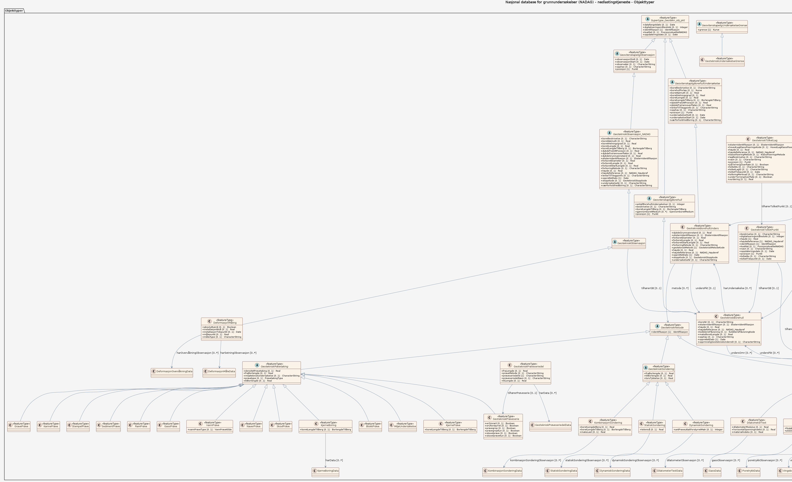

# Produktspesifikasjon: Nasjonal database for grunnundersøkelser (NADAG)

*NGU har utviklet Nasjonal database for grunnundersøkelser (NADAG) med tilhørende karttjenester og muligheter for innmelding og nedlasting av data fra geotekniske undersøkelser. Fra og med 2025 er det lovfestet plikt for innmelding av komplette geotekniske grunnundersøkelser til NADAG. Eldre data har stor nytteverdi, og ønskes også meldt inn. Prosjektet for utvikling av NADAG er et samarbeid mellom NGU og etatene Statens vegvesen, Bane NOR, og Norges vassdrags- og energidirektorat (NVE). NGU samarbeider også med ulike konsulenter i utviklingen av løsningene. 

Punktene i NADAGs kartinnsyn representerer geotekniske borehull (GB), hvor metadata vises (f.eks. boretype, oppdragsfirma, oppdragsgiver, stedfestelse (posisjon), boret dybde, ev. dyp til berg). For noen punkter vil mer informasjon være tilgjengelig (f.eks. lenke til rapport og ev. rådata, boreprofil og måleresultater). NADAGs datamodell er basert på en datastruktur beskrevet i SOSI-standardene for Geovitenskapelige undersøkelser og Geotekniske undersøkelser. NADAG er innlemmet i listen over datasett til DOK. Visningstjenesten til NADAG har to innsynsløsninger, der «Mobilvennlig versjon» ligner de andre kartinnsynene til NGU, mens «NADAG fullversjon» har litt annet oppsett og andre verktøy. 

Nye data skal leveres komplett til NADAG, enten ved bruk av GeoSuite toolbox eller gjennom et innmeldings-API som er under utarbeidelse. Eldre data kan alternativt leveres gjennom NADAG WebReg. 

NADAG er landsdekkende. Alle data som ligger i NADAG er fritt tilgjengelig for alle, og lastes ned vederlagsfritt. Det vil være varierende mengde informasjon tilhørende hvert datapunkt, noe som vil avhenge blant annet av formatet data er levert på, og dataeiers vilje til å offentliggjøre data utover kun å vise metadata. Tilgjengelige rapporter (pdf) kan lastes ned fra NADAGs infoark. Data kan lastes ned på formatene GML, Filgeodatabase og GeoSuite. I tillegg kan man benytte NADAGs WMS, samt at det arbeides med lese-API (OGC API Features). Nedlasting kan gjøres via Geonorge, men dette gjelder enkle datasett, dvs. primært metadata og URL-lenker til rapporter. Komplette data må lastes ned gjennom NADAGs kartinnsyn. 

NADAG og bidragsytere er ikke ansvarlige for den enkeltes bruk av datasettene. Datasettene og rapportene ble laget for bestemte formål/prosjekt. Den som benytter data for nye formål/prosjekt må gjøre egne og selvstendige vurderinger av dataenes kvalitet, egnethet og gyldighet. Ved bruk av data skal det refereres til rapport/dataeier. Datasettet er gjort tilgjengelig under Norsk lisens for offentlige data (NLOD). Ved å starte NADAG nettjeneste godtar du disse vilkårene for bruk.*

**Nøkkelord:** NADAG, geotekniske borehull, grunnundersøkelser, geodataloven, Det offentlige kartgrunnlaget, Norge digitalt, dataNorgeNo, modellbaserteVegprosjekter, fellesDatakatalog, Geologi

**Emnekategorier:** Geovitenskapelig informasjon

**Geografisk utstrekning**:

- **Vest**: 2.0
- **Øst**: 33.0
- **Sør**: 57.0
- **Nord**: 72.0

**Tidsmessig utstrekning**:

- **Tidsperiode**:
  - **Fra**: 2016-01-08
  - **Til**: 2026-04-03

## Om spesifikasjonen

> **Denne versjonen av produktspesifikasjonen:**  
> **Opprettet dato:** 2016-01-08 
> **Endret dato:** 2026-04-03 
> **Språk:** nor 
> **Kontaktinformasjon:** Norges geologiske undersøkelse, [inger-lise.solberg@ngu.no](mailto:inger-lise.solberg@ngu.no)

## Om produktet Nasjonal database for grunnundersøkelser (NADAG)

> **Romlig representasjonstype:** Vektor 
> **Unik identifikator:** <https://data.geonorge.no/sosi/geologi/nadag> 
> **Kontaktinformasjon:** Norges geologiske undersøkelse, [inger-lise.solberg@ngu.no](mailto:inger-lise.solberg@ngu.no)
>
> **Romlig oppløsning:**
>
> **Ekvivalent målestokk**: varierer
>
> **Begrensninger:**
>
> **Juridiske begrensninger**:
>
> - **Tilgangsbegrensninger**: Åpne data
> - **Bruksbegrensninger**: Lisens
> - **Lisens**: Norsk lisens for offentlige data (NLOD)
> - **Lisenslenke**: <http://data.norge.no/nlod/no/1.0>
>
> **Sikkerhetsbegrensninger**:
>
> - **Klassifisering**: Ugradert

### Formål

Formålet er å kunne gi en samlet oversikt over hvilke grunnundersøkelser som er utført hvor, og gi en mer effektiv tilgang til data.

### Bruksområde

Fra og med 2025 er det lovfestet plikt for innmelding av geotekniske grunnundersøkelser til NADAG. For at gjenbruk av data fra grunnundersøkelser skal bli mest mulig effektiv og til nytte for samfunnet, bør også data fra eldre prosjekter leveres til NADAG. Disse må gjerne også leveres mest mulig komplett, siden de da blir enklere å gjenbruke i nye prosjekter for konsulenter og andre aktører. En rask og oppdatert oversikt over utførte geotekniske undersøkelser i et gitt område vil være nyttig som verktøy i arealplanlegging, utbygging og ressursleting. Rask tilgang til data om undergrunnen vil også være avgjørende for beredskap og krisehåndtering i forbindelse med naturfare. I tillegg vil informasjon om hvor undersøkelser er utført kunne redusere behovet for nye undersøkelser, og hindre dobbeltarbeid. Ved å samle grunnundersøkelsene i Norge vil dette være et langt steg framover mot å bygge opp en forståelse av grunnforholdene i tre dimensjoner. Løsningen sørger for en lik strukturering (harmonisering) av data.

## Omfang

### Hele datasettet

**Nivå**: dataset

**Nivåbeskrivelse**: Gjelder hele datasettet. Hvis omfang ikke er oppgitt under en overskrift, gjelder teksten for hele datasettet og alle leveranser

### nedlastingstjeneste

**Nivå**: dataset

**Nivåbeskrivelse**: Grunnundersøkelser

### Innsynstjeneste (API)

**Nivå**: dataset

**Nivåbeskrivelse**: Tjeneste for innsyn i Grunnundersøkelser

## Datainnhold og struktur

### Datamodell - nedlastingstjeneste

➡️ [Se full datamodell for omfang "nedlastingstjeneste" (diagram og objektkatalog)](nedlastingstjeneste/objektkatalog.html)

### Datamodell - Innsynstjeneste (API)

➡️ [Se full datamodell for omfang "Innsynstjeneste (API)" (diagram og objektkatalog)](innsynstjeneste-api/objektkatalog.html)

## Referansesystem

| EPSG-kode | Navn på referansesystem |
| --- | --- |
| [EPSG:25832](https://epsg.io/25832) | [EUREF89 UTM sone 32, 2d](https://register.geonorge.no/epsg-koder) |
| [EPSG:25833](https://epsg.io/25833) | [EUREF89 UTM sone 33, 2d](https://register.geonorge.no/epsg-koder) |
| [EPSG:25835](https://epsg.io/25835) | [EUREF89 UTM sone 35, 2d](https://register.geonorge.no/epsg-koder) |

## Datakvalitet

**Nivå**: dataset

- **Kvalitetsmål**: Prosentvis oppfyllelse av FAIR-prinsipper
  **Målebeskrivelse**: Angir fullstendighet i forhold til krav fra FAIR-prinsippene (The FAIR Guiding Principles for scientific data management and stewardship)
  **Resultat**: 88

- **Kvalitetsmål**: FAIR
  **Resultat**: Prosentvis oppfyllelse av FAIR-prinsipper: 88%

## Datafangst og produksjon

**Datainnsamling og prosessering**:

- **Prosesstrinn**:
  - **Beskrivelse**: Datafangsten er basert på at dataeiere selv, eller de som har tatt oppdraget, leverer inn data via bestemte løsninger for opplasting. Ulike aktører på nasjonalt og kommunalt nivå, både offentlige og private, bidrar med sine data. Data leveres til databasen på ulike format, og i ulik detaljgrad. Datainnholdet i de enkelte undersøkelser varierer fra enkle metadata til komplette datasett med måledata og rådata. NGU foretar teknisk kvalitetskontroll, men retter ikke eventuelle feil i selve datasettene.

## Vedlikehold

**Vedlikeholdsfrekvens**: Kontinuerlig

**Status**: Kontinuerlig oppdatert

## Presentasjon

**navn**: Tegneregler

**Lenke**:
<https://register.geonorge.no/tegneregler/geotekniske-undersøkelser-nadag>

## Leveranse

| Tjeneste | Endepunkt | Type | Format | Leveranseenheter |
| --- | --- | --- | --- | --- |
| Egen nedlastningsside | [Lenke](https://geo.ngu.no/kart/nadag) | WWW:DOWNLOAD-1.0-http--download | GeoSuite |  |
| Geonorge nedlastning | [Lenke](https://nedlasting.ngu.no/api/capabilities/) | GEONORGE:DOWNLOAD | FGDB, GML | landsfiler, fylkesvis, kommunevis |
| OGC API-Features | [Lenke](https://geo.ngu.no/api/features/grunnundersokelser_utvidet) | OGC:API-Features | JSON, GeoJSON | landsfiler |
| Atom Feed | [Lenke](https://nedlasting.ngu.no/api/atom/bf45a463-434d-4b4d-84dc-9325780ab5fb) | W3C:AtomFeed | FGDB, GML |  |
| NADAG WMS | [Lenke](https://geo.ngu.no/geoserver/nadag/ows?request=GetCapabilities&service=WMS&version=1.3.0) | WMS-tjeneste | WMS-tjeneste |  |

## Metadata

**Metadatastandard**: ISO19115

**Metadatastandardversjon**: 2003

**Metadatadato**: 2026-04-22

**språk**: nor

**Kontakt**:

- **Organisasjon**: Norges geologiske undersøkelse
- **Logo**: <https://register.geonorge.no/data/organizations/970188290_NGU_hovedlogo_svart.svg> thumbnail.png
- **Epost**: nadag@ngu.no
- **rolle**: pointOfContact

**Metadataidentifikator**:

- **Utsteder**: Geonorge
- **kode**: bf45a463-434d-4b4d-84dc-9325780ab5fb
- **koderom**: <https://kartkatalog.geonorge.no/metadata/>
- **Metadatalenke**: <https://kartkatalog.geonorge.no/metadata/bf45a463-434d-4b4d-84dc-9325780ab5fb>

## Tilleggsinformasjon

Nedlastingen via Geonorge gjelder enkle datasett, dvs. primært metadata og URL-lenker til rapporter. Komplette data må lastes ned gjennom NADAGs kartinnsyn.
