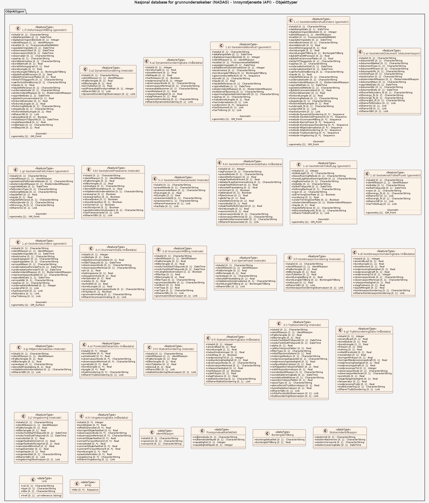

### Datamodell

#### 1.f) DeformasjonMåling (geometri)

Undersøkelse for måling av setninger og deformasjoner i felt Investigation for measurement of settlements and deformations in the field

Geometri: Elementtype: feature Type: geometry-point Lagrings-CRS: • <a href="http://www.opengis.net/def/crs/EPSG/0/25833"><http://www.opengis.net/def/crs/EPSG/0/25833></a> Koordinatreferansesystem (crs): • #/crs • <a href="http://www.opengis.net/def/crs/OGC/1.3/CRS84"><http://www.opengis.net/def/crs/OGC/1.3/CRS84></a>

Egenskaper

<table class="feature-attribute-table">
  <colgroup>
    <col style="width: 35%;" />
    <col style="width: 65%;" />
  </colgroup>
  <tbody>
    <tr>
      <th scope="row">Navn:</th>
      <td><strong>geometry</strong></td>
    </tr>
    <tr>
      <th scope="row">Definisjon:</th>
      <td>Elementtype: feature</td>
    </tr>
    <tr>
      <th scope="row">Type:</th>
      <td>geometry-point</td>
    </tr>
    <tr>
      <th scope="row">OGC-rolle:</th>
      <td>primary-geometry</td>
    </tr>
  </tbody>
</table>

<table class="feature-attribute-table">
  <colgroup>
    <col style="width: 35%;" />
    <col style="width: 65%;" />
  </colgroup>
  <tbody>
    <tr>
      <th scope="row">Navn:</th>
      <td><strong>lokalid</strong></td>
    </tr>
    <tr>
      <th scope="row">Definisjon:</th>
      <td>lokalid</td>
    </tr>
    <tr>
      <th scope="row">Multiplisitet:</th>
      <td>0..1</td>
    </tr>
    <tr>
      <th scope="row">Type:</th>
      <td>string</td>
    </tr>
    <tr>
      <th scope="row">OGC-rolle:</th>
      <td>id</td>
    </tr>
  </tbody>
</table>

<table class="feature-attribute-table">
  <colgroup>
    <col style="width: 35%;" />
    <col style="width: 65%;" />
  </colgroup>
  <tbody>
    <tr>
      <th scope="row">Navn:</th>
      <td><strong>datafangstdato</strong></td>
    </tr>
    <tr>
      <th scope="row">Definisjon:</th>
      <td>Dato når objektet siste gang ble registrert/observert/målt i terrenget Merknad: I mange tilfeller er denne forskjellig fra Oppdateringsdato, da registrerte endringer kan bufres i en kortere eller lengre periode før disse legges inn i databasen. Ved førstegangsregistrering settes Datafangstdato lik førsteDatafangstdato.</td>
    </tr>
    <tr>
      <th scope="row">Multiplisitet:</th>
      <td>0..1</td>
    </tr>
    <tr>
      <th scope="row">Type:</th>
      <td>date-time (string)</td>
    </tr>
    <tr>
      <th scope="row">OGC-rolle:</th>
      <td>primary-instant</td>
    </tr>
  </tbody>
</table>

<table class="feature-attribute-table">
  <colgroup>
    <col style="width: 35%;" />
    <col style="width: 65%;" />
  </colgroup>
  <tbody>
    <tr>
      <th scope="row">Navn:</th>
      <td><strong>digitaliseringsmålestokk</strong></td>
    </tr>
    <tr>
      <th scope="row">Definisjon:</th>
      <td>Kartmålestokk registreringene/ datene er hentet fra/ registrert på Eksempel: 1:50 000 = 50000.</td>
    </tr>
    <tr>
      <th scope="row">Multiplisitet:</th>
      <td>0..1</td>
    </tr>
    <tr>
      <th scope="row">Type:</th>
      <td>integer</td>
    </tr>
  </tbody>
</table>

<table class="feature-attribute-table">
  <colgroup>
    <col style="width: 35%;" />
    <col style="width: 65%;" />
  </colgroup>
  <tbody>
    <tr>
      <th scope="row">Navn:</th>
      <td><strong>identifikasjon</strong></td>
    </tr>
    <tr>
      <th scope="row">Multiplisitet:</th>
      <td>1..1</td>
    </tr>
    <tr>
      <th scope="row">Type:</th>
      <td>Identifikasjon</td>
    </tr>
  </tbody>
</table>

<table class="feature-attribute-table">
  <colgroup>
    <col style="width: 35%;" />
    <col style="width: 65%;" />
  </colgroup>
  <tbody>
    <tr>
      <th scope="row">Navn:</th>
      <td><strong>identifikasjon.lokalId</strong></td>
    </tr>
    <tr>
      <th scope="row">Definisjon:</th>
      <td>Lokal identifikator, tildelt av dataleverendør/dataforvalter. Den lokale identifikatoren er unik innenfor navnerommet, ingen andre objekter har samme identifikator. NOTE: Det er data leverendørens ansvar å sørge for at denne lokale identifikatoren er unik innenfor navnerommet.</td>
    </tr>
    <tr>
      <th scope="row">Multiplisitet:</th>
      <td>0..1</td>
    </tr>
    <tr>
      <th scope="row">Type:</th>
      <td>string</td>
    </tr>
  </tbody>
</table>

<table class="feature-attribute-table">
  <colgroup>
    <col style="width: 35%;" />
    <col style="width: 65%;" />
  </colgroup>
  <tbody>
    <tr>
      <th scope="row">Navn:</th>
      <td><strong>identifikasjon.navnerom</strong></td>
    </tr>
    <tr>
      <th scope="row">Definisjon:</th>
      <td>Navnerom som unikt identifiserer datakilden til objektet, starter med to bokstavs kode jfr ISO 3166. Benytter understreking  ("_") dersom data produsenten ikke er assosiert med bare et land. NOTE 1 : Verdien for nanverom vil eies av den dataprodusent som har ansvar for de unike identifikatorene og vil registreres i "INSPIRE external  Object Identifier Namespaces Register" Eksempel: NO for Norge.</td>
    </tr>
    <tr>
      <th scope="row">Multiplisitet:</th>
      <td>0..1</td>
    </tr>
    <tr>
      <th scope="row">Type:</th>
      <td>string</td>
    </tr>
  </tbody>
</table>

<table class="feature-attribute-table">
  <colgroup>
    <col style="width: 35%;" />
    <col style="width: 65%;" />
  </colgroup>
  <tbody>
    <tr>
      <th scope="row">Navn:</th>
      <td><strong>identifikasjon.versjonId</strong></td>
    </tr>
    <tr>
      <th scope="row">Definisjon:</th>
      <td>Identifikasjon av en spesiell versjon av et geografisk objekt (instans), maksimum lengde på 25 karakterers. Dersom spesifikasjonen av et geografisk objekt med en identifikasjon inkludererer livsløpssyklusinformasjon, benyttes denne versjonId for å skille mellom ulike versjoner av samme objekt. versjonId er en unik  identifikasjon av versjonen. NOTE Maksimum lengde er valgt for å tillate tidsregistrering i henhold til  ISO 8601, slik som  "2007-02-12T12:12:12+05:30" som versjonId.</td>
    </tr>
    <tr>
      <th scope="row">Multiplisitet:</th>
      <td>0..1</td>
    </tr>
    <tr>
      <th scope="row">Type:</th>
      <td>string</td>
    </tr>
  </tbody>
</table>

<table class="feature-attribute-table">
  <colgroup>
    <col style="width: 35%;" />
    <col style="width: 65%;" />
  </colgroup>
  <tbody>
    <tr>
      <th scope="row">Navn:</th>
      <td><strong>kvalitet</strong></td>
    </tr>
    <tr>
      <th scope="row">Multiplisitet:</th>
      <td>0..1</td>
    </tr>
    <tr>
      <th scope="row">Type:</th>
      <td>PosisjonskvalitetNADAG</td>
    </tr>
  </tbody>
</table>

<table class="feature-attribute-table">
  <colgroup>
    <col style="width: 35%;" />
    <col style="width: 65%;" />
  </colgroup>
  <tbody>
    <tr>
      <th scope="row">Navn:</th>
      <td><strong>kvalitet.målemetode</strong></td>
    </tr>
    <tr>
      <th scope="row">Definisjon:</th>
      <td>Metode for måling i grunnriss (x,y), og høyde (z) når metoden er den samme som ved måling i grunnriss</td>
    </tr>
    <tr>
      <th scope="row">Multiplisitet:</th>
      <td>0..1</td>
    </tr>
    <tr>
      <th scope="row">Type:</th>
      <td>string</td>
    </tr>
    <tr>
      <th scope="row">Tillatte verdier:</th>
      <td>- 10 - 11 - 12 - 13 - 14 - 15 - 18 - 19 - 20 - 21 - 22 - 23 - 24 - 30 - 31 - 32 - 33 - 34 - 35 - 36 - 40 - 41 - 42 - 43 - 44 - 45 - 46 - 50 - 51 - 52 - 53 - 54 - 55 - 56 - 60 - 61 - 62 - 63 - 64 - 65 - 66 - 67 - 68 - 69 - 70 - 71 - 72 - 73 - 74 - 77 - 78 - 79 - 80 - 81 - 82 - 90 - 91 - 92 - 93 - 94 - 95 - 96 - 97 - 99</td>
    </tr>
  </tbody>
</table>

<table class="feature-attribute-table">
  <colgroup>
    <col style="width: 35%;" />
    <col style="width: 65%;" />
  </colgroup>
  <tbody>
    <tr>
      <th scope="row">Navn:</th>
      <td><strong>kvalitet.målemetodeHøyde</strong></td>
    </tr>
    <tr>
      <th scope="row">Definisjon:</th>
      <td>Metode for å måle høyden</td>
    </tr>
    <tr>
      <th scope="row">Multiplisitet:</th>
      <td>0..1</td>
    </tr>
    <tr>
      <th scope="row">Type:</th>
      <td>string</td>
    </tr>
    <tr>
      <th scope="row">Tillatte verdier:</th>
      <td>- 10 - 11 - 12 - 13 - 14 - 15 - 18 - 19 - 20 - 21 - 22 - 23 - 24 - 36 - 60 - 61 - 62 - 63 - 64 - 66 - 67 - 68 - 69 - 70 - 74 - 78 - 79 - 90 - 91 - 92 - 93 - 94 - 95 - 96 - 99</td>
    </tr>
  </tbody>
</table>

<table class="feature-attribute-table">
  <colgroup>
    <col style="width: 35%;" />
    <col style="width: 65%;" />
  </colgroup>
  <tbody>
    <tr>
      <th scope="row">Navn:</th>
      <td><strong>kvalitet.nøyaktighet</strong></td>
    </tr>
    <tr>
      <th scope="row">Definisjon:</th>
      <td>Punktstandardavviket i grunnriss for punkter samt tverravvik for linjer</td>
    </tr>
    <tr>
      <th scope="row">Multiplisitet:</th>
      <td>0..1</td>
    </tr>
    <tr>
      <th scope="row">Type:</th>
      <td>integer</td>
    </tr>
  </tbody>
</table>

<table class="feature-attribute-table">
  <colgroup>
    <col style="width: 35%;" />
    <col style="width: 65%;" />
  </colgroup>
  <tbody>
    <tr>
      <th scope="row">Navn:</th>
      <td><strong>kvalitet.nøyaktighetHøyde</strong></td>
    </tr>
    <tr>
      <th scope="row">Definisjon:</th>
      <td>Nøyaktighet for høyden i cm</td>
    </tr>
    <tr>
      <th scope="row">Multiplisitet:</th>
      <td>0..1</td>
    </tr>
    <tr>
      <th scope="row">Type:</th>
      <td>integer</td>
    </tr>
  </tbody>
</table>

<table class="feature-attribute-table">
  <colgroup>
    <col style="width: 35%;" />
    <col style="width: 65%;" />
  </colgroup>
  <tbody>
    <tr>
      <th scope="row">Navn:</th>
      <td><strong>oppdateringsdato</strong></td>
    </tr>
    <tr>
      <th scope="row">Definisjon:</th>
      <td>Dato for siste endring på objektetdataene Merknad: Oppdateringsdato kan være forskjellig fra Datafangsdato ved at data som er registrert kan bufres en kortere eller lengre periode før disse legges inn i datasystemet (databasen). -Definition- Date and time at which this version of the spatial object was inserted or changed in the spatial data set.</td>
    </tr>
    <tr>
      <th scope="row">Multiplisitet:</th>
      <td>0..1</td>
    </tr>
    <tr>
      <th scope="row">Type:</th>
      <td>date-time (string)</td>
    </tr>
  </tbody>
</table>

<table class="feature-attribute-table">
  <colgroup>
    <col style="width: 35%;" />
    <col style="width: 65%;" />
  </colgroup>
  <tbody>
    <tr>
      <th scope="row">Navn:</th>
      <td><strong>observasjonStart</strong></td>
    </tr>
    <tr>
      <th scope="row">Definisjon:</th>
      <td>Startdato for observasjon Starting date of the observation</td>
    </tr>
    <tr>
      <th scope="row">Multiplisitet:</th>
      <td>0..1</td>
    </tr>
    <tr>
      <th scope="row">Type:</th>
      <td>date-time (string)</td>
    </tr>
  </tbody>
</table>

<table class="feature-attribute-table">
  <colgroup>
    <col style="width: 35%;" />
    <col style="width: 65%;" />
  </colgroup>
  <tbody>
    <tr>
      <th scope="row">Navn:</th>
      <td><strong>observasjonSlutt</strong></td>
    </tr>
    <tr>
      <th scope="row">Definisjon:</th>
      <td>Sluttdato for observasjon Ending date of the observation</td>
    </tr>
    <tr>
      <th scope="row">Multiplisitet:</th>
      <td>0..1</td>
    </tr>
    <tr>
      <th scope="row">Type:</th>
      <td>date-time (string)</td>
    </tr>
  </tbody>
</table>

<table class="feature-attribute-table">
  <colgroup>
    <col style="width: 35%;" />
    <col style="width: 65%;" />
  </colgroup>
  <tbody>
    <tr>
      <th scope="row">Navn:</th>
      <td><strong>observatør</strong></td>
    </tr>
    <tr>
      <th scope="row">Definisjon:</th>
      <td>Identifikasjon av operatøren som utfører observasjonen Identification of the operator performing the observation</td>
    </tr>
    <tr>
      <th scope="row">Multiplisitet:</th>
      <td>0..1</td>
    </tr>
    <tr>
      <th scope="row">Type:</th>
      <td>string</td>
    </tr>
  </tbody>
</table>

<table class="feature-attribute-table">
  <colgroup>
    <col style="width: 35%;" />
    <col style="width: 65%;" />
  </colgroup>
  <tbody>
    <tr>
      <th scope="row">Navn:</th>
      <td><strong>opphav</strong></td>
    </tr>
    <tr>
      <th scope="row">Definisjon:</th>
      <td>Referanse til opphavsmaterialet, kildematerialet, organisasjons/publiseringskilde Merknad: Kan også beskrive navn på person og årsak til oppdatering Reference to copyright, source, organization/publication source Note: May also include name of person and cause of update</td>
    </tr>
    <tr>
      <th scope="row">Multiplisitet:</th>
      <td>0..1</td>
    </tr>
    <tr>
      <th scope="row">Type:</th>
      <td>string</td>
    </tr>
  </tbody>
</table>

<table class="feature-attribute-table">
  <colgroup>
    <col style="width: 35%;" />
    <col style="width: 65%;" />
  </colgroup>
  <tbody>
    <tr>
      <th scope="row">Navn:</th>
      <td><strong>boreBeskrivelse</strong></td>
    </tr>
    <tr>
      <th scope="row">Definisjon:</th>
      <td>description</td>
    </tr>
    <tr>
      <th scope="row">Multiplisitet:</th>
      <td>0..1</td>
    </tr>
    <tr>
      <th scope="row">Type:</th>
      <td>string</td>
    </tr>
  </tbody>
</table>

<table class="feature-attribute-table">
  <colgroup>
    <col style="width: 35%;" />
    <col style="width: 65%;" />
  </colgroup>
  <tbody>
    <tr>
      <th scope="row">Navn:</th>
      <td><strong>boretAzimuth</strong></td>
    </tr>
    <tr>
      <th scope="row">Definisjon:</th>
      <td>Vinkelen mellom en referansevektor i et referanseplan og en annen vektor i det samme planet som peker mot noe av interesse</td>
    </tr>
    <tr>
      <th scope="row">Multiplisitet:</th>
      <td>0..1</td>
    </tr>
    <tr>
      <th scope="row">Type:</th>
      <td>number</td>
    </tr>
  </tbody>
</table>

<table class="feature-attribute-table">
  <colgroup>
    <col style="width: 35%;" />
    <col style="width: 65%;" />
  </colgroup>
  <tbody>
    <tr>
      <th scope="row">Navn:</th>
      <td><strong>boretHelningsgrad</strong></td>
    </tr>
    <tr>
      <th scope="row">Definisjon:</th>
      <td>Helning hvor  90 grader er vertikalt , 0 grader er horisontalt</td>
    </tr>
    <tr>
      <th scope="row">Multiplisitet:</th>
      <td>0..1</td>
    </tr>
    <tr>
      <th scope="row">Type:</th>
      <td>number</td>
    </tr>
  </tbody>
</table>

<table class="feature-attribute-table">
  <colgroup>
    <col style="width: 35%;" />
    <col style="width: 65%;" />
  </colgroup>
  <tbody>
    <tr>
      <th scope="row">Navn:</th>
      <td><strong>boretLengde</strong></td>
    </tr>
    <tr>
      <th scope="row">Definisjon:</th>
      <td>Total lengde av borehullets forløp, tilsvarer dyp ved vertikal boring</td>
    </tr>
    <tr>
      <th scope="row">Multiplisitet:</th>
      <td>0..1</td>
    </tr>
    <tr>
      <th scope="row">Type:</th>
      <td>number</td>
    </tr>
  </tbody>
</table>

<table class="feature-attribute-table">
  <colgroup>
    <col style="width: 35%;" />
    <col style="width: 65%;" />
  </colgroup>
  <tbody>
    <tr>
      <th scope="row">Navn:</th>
      <td><strong>boretLengdeTilBerg</strong></td>
    </tr>
    <tr>
      <th scope="row">Multiplisitet:</th>
      <td>0..1</td>
    </tr>
    <tr>
      <th scope="row">Type:</th>
      <td>BorlengdeTilBerg</td>
    </tr>
  </tbody>
</table>

<table class="feature-attribute-table">
  <colgroup>
    <col style="width: 35%;" />
    <col style="width: 65%;" />
  </colgroup>
  <tbody>
    <tr>
      <th scope="row">Navn:</th>
      <td><strong>boretLengdeTilBerg.borlengdeKvalitet</strong></td>
    </tr>
    <tr>
      <th scope="row">Definisjon:</th>
      <td>Beskriver om dybden til berg er antatt eller påvist med en sikker metode  Defines the quality of the depth information either assumed or confirmed by a secure method</td>
    </tr>
    <tr>
      <th scope="row">Multiplisitet:</th>
      <td>0..1</td>
    </tr>
    <tr>
      <th scope="row">Type:</th>
      <td>string</td>
    </tr>
    <tr>
      <th scope="row">Tillatte verdier:</th>
      <td>- 1 - 2</td>
    </tr>
  </tbody>
</table>

<table class="feature-attribute-table">
  <colgroup>
    <col style="width: 35%;" />
    <col style="width: 65%;" />
  </colgroup>
  <tbody>
    <tr>
      <th scope="row">Navn:</th>
      <td><strong>boretLengdeTilBerg.borlengdeTilBerg</strong></td>
    </tr>
    <tr>
      <th scope="row">Definisjon:</th>
      <td>Dybde til fjell som ikke er målt men basert på tolkning Depth to bedrock based on interpretation</td>
    </tr>
    <tr>
      <th scope="row">Multiplisitet:</th>
      <td>0..1</td>
    </tr>
    <tr>
      <th scope="row">Type:</th>
      <td>number</td>
    </tr>
  </tbody>
</table>

<table class="feature-attribute-table">
  <colgroup>
    <col style="width: 35%;" />
    <col style="width: 65%;" />
  </colgroup>
  <tbody>
    <tr>
      <th scope="row">Navn:</th>
      <td><strong>dybdeFraGittPosisjon</strong></td>
    </tr>
    <tr>
      <th scope="row">Definisjon:</th>
      <td>Avstanden fra måleutstyret og ned til det punkt på jordoverflaten hvor boring/måling faktisk starter Merknad: Borehullundersøkelsens posisjon er vanligvis angitt med x,y,z-koordinat. Disse verdiene representerer vanligvis et punkt på jordoverflaten. Dybden fra denne gitte posisjon vil da være 0. Hvis boringen derimot er utført fra flåte,  skip eller is, er det viktig at dybdeFraGittPosisjon blir angitt. Denne vil da være avstanden fra måleutstyrets senter (0 dybde) og ned til havbunnen, innsjøbunnen eller elvebunnen hvor sonderingen/boringen faktisk starter fra). Distance from the drill or measure equipment down to the vertical level where the borehole/measurement actually begins Note: This is important to specify if the drilling/sounding is performed from e.g. a raft, ship or from ice. The depth will then be the depth from the measuring equipments origin (0 depth) and down to where drilling/sounding actually begins (on the sea surface, bottom of a lake or river, etc.)</td>
    </tr>
    <tr>
      <th scope="row">Multiplisitet:</th>
      <td>0..1</td>
    </tr>
    <tr>
      <th scope="row">Type:</th>
      <td>number</td>
    </tr>
  </tbody>
</table>

<table class="feature-attribute-table">
  <colgroup>
    <col style="width: 35%;" />
    <col style="width: 65%;" />
  </colgroup>
  <tbody>
    <tr>
      <th scope="row">Navn:</th>
      <td><strong>dybdeFraVannoverflaten</strong></td>
    </tr>
    <tr>
      <th scope="row">Definisjon:</th>
      <td>Den lengden hvor sonderingsutstyret befinner seg i vann</td>
    </tr>
    <tr>
      <th scope="row">Multiplisitet:</th>
      <td>0..1</td>
    </tr>
    <tr>
      <th scope="row">Type:</th>
      <td>number</td>
    </tr>
  </tbody>
</table>

<table class="feature-attribute-table">
  <colgroup>
    <col style="width: 35%;" />
    <col style="width: 65%;" />
  </colgroup>
  <tbody>
    <tr>
      <th scope="row">Navn:</th>
      <td><strong>lenkeTilTileggsinfo</strong></td>
    </tr>
    <tr>
      <th scope="row">Definisjon:</th>
      <td>Lenke til mer informasjon (URL)</td>
    </tr>
    <tr>
      <th scope="row">Multiplisitet:</th>
      <td>0..1</td>
    </tr>
    <tr>
      <th scope="row">Type:</th>
      <td>string</td>
    </tr>
  </tbody>
</table>

<table class="feature-attribute-table">
  <colgroup>
    <col style="width: 35%;" />
    <col style="width: 65%;" />
  </colgroup>
  <tbody>
    <tr>
      <th scope="row">Navn:</th>
      <td><strong>værforholdVedBoring</strong></td>
    </tr>
    <tr>
      <th scope="row">Definisjon:</th>
      <td>Beskrivelse av værforhold under utførelsen av borehullundersøkelsen Weather conditions - general description.</td>
    </tr>
    <tr>
      <th scope="row">Multiplisitet:</th>
      <td>0..1</td>
    </tr>
    <tr>
      <th scope="row">Type:</th>
      <td>string</td>
    </tr>
  </tbody>
</table>

<table class="feature-attribute-table">
  <colgroup>
    <col style="width: 35%;" />
    <col style="width: 65%;" />
  </colgroup>
  <tbody>
    <tr>
      <th scope="row">Navn:</th>
      <td><strong>høyde</strong></td>
    </tr>
    <tr>
      <th scope="row">Definisjon:</th>
      <td>Terrenghøyde ved start observasjon</td>
    </tr>
    <tr>
      <th scope="row">Multiplisitet:</th>
      <td>0..1</td>
    </tr>
    <tr>
      <th scope="row">Type:</th>
      <td>number</td>
    </tr>
  </tbody>
</table>

<table class="feature-attribute-table">
  <colgroup>
    <col style="width: 35%;" />
    <col style="width: 65%;" />
  </colgroup>
  <tbody>
    <tr>
      <th scope="row">Navn:</th>
      <td><strong>høydeReferanse</strong></td>
    </tr>
    <tr>
      <th scope="row">Definisjon:</th>
      <td>Referansesystem for høydeangivelse</td>
    </tr>
    <tr>
      <th scope="row">Multiplisitet:</th>
      <td>0..1</td>
    </tr>
    <tr>
      <th scope="row">Type:</th>
      <td>string</td>
    </tr>
  </tbody>
</table>

<table class="feature-attribute-table">
  <colgroup>
    <col style="width: 35%;" />
    <col style="width: 65%;" />
  </colgroup>
  <tbody>
    <tr>
      <th scope="row">Navn:</th>
      <td><strong>undersøkelseNr</strong></td>
    </tr>
    <tr>
      <th scope="row">Definisjon:</th>
      <td>Nummer på observasjon benyttet i den geotekniske undersøkelsen</td>
    </tr>
    <tr>
      <th scope="row">Multiplisitet:</th>
      <td>0..1</td>
    </tr>
    <tr>
      <th scope="row">Type:</th>
      <td>string</td>
    </tr>
  </tbody>
</table>

<table class="feature-attribute-table">
  <colgroup>
    <col style="width: 35%;" />
    <col style="width: 65%;" />
  </colgroup>
  <tbody>
    <tr>
      <th scope="row">Navn:</th>
      <td><strong>eksternIdentifikasjon</strong></td>
    </tr>
    <tr>
      <th scope="row">Multiplisitet:</th>
      <td>0..1</td>
    </tr>
    <tr>
      <th scope="row">Type:</th>
      <td>EksternIdentifikasjon</td>
    </tr>
  </tbody>
</table>

<table class="feature-attribute-table">
  <colgroup>
    <col style="width: 35%;" />
    <col style="width: 65%;" />
  </colgroup>
  <tbody>
    <tr>
      <th scope="row">Navn:</th>
      <td><strong>eksternIdentifikasjon.eksternId</strong></td>
    </tr>
    <tr>
      <th scope="row">Definisjon:</th>
      <td>Lokal identifikator, tildelt av ekstern leverendør. Det er data leverendørens ansvar å sørge for at denne eksterne identifikatoren er unik innenfor navnerommet.</td>
    </tr>
    <tr>
      <th scope="row">Multiplisitet:</th>
      <td>0..1</td>
    </tr>
    <tr>
      <th scope="row">Type:</th>
      <td>string</td>
    </tr>
  </tbody>
</table>

<table class="feature-attribute-table">
  <colgroup>
    <col style="width: 35%;" />
    <col style="width: 65%;" />
  </colgroup>
  <tbody>
    <tr>
      <th scope="row">Navn:</th>
      <td><strong>eksternIdentifikasjon.eksternNavnerom</strong></td>
    </tr>
    <tr>
      <th scope="row">Definisjon:</th>
      <td>Navnerom som identifiserer datakilden/leverandør til objektet</td>
    </tr>
    <tr>
      <th scope="row">Multiplisitet:</th>
      <td>0..1</td>
    </tr>
    <tr>
      <th scope="row">Type:</th>
      <td>string</td>
    </tr>
  </tbody>
</table>

<table class="feature-attribute-table">
  <colgroup>
    <col style="width: 35%;" />
    <col style="width: 65%;" />
  </colgroup>
  <tbody>
    <tr>
      <th scope="row">Navn:</th>
      <td><strong>eksternIdentifikasjon.eksternVersjonId</strong></td>
    </tr>
    <tr>
      <th scope="row">Definisjon:</th>
      <td>Identifikasjon av en spesiell versjon av et geografisk objekt  Dersom spesifikasjonen av et geografisk objekt med en identifikasjon inkludererer livsløpssyklusinformasjon, benyttes denne versjonId for å skille mellom ulike versjoner av samme objekt. versjonId er en unik  identifikasjon av versjonen.</td>
    </tr>
    <tr>
      <th scope="row">Multiplisitet:</th>
      <td>0..1</td>
    </tr>
    <tr>
      <th scope="row">Type:</th>
      <td>string</td>
    </tr>
  </tbody>
</table>

<table class="feature-attribute-table">
  <colgroup>
    <col style="width: 35%;" />
    <col style="width: 65%;" />
  </colgroup>
  <tbody>
    <tr>
      <th scope="row">Navn:</th>
      <td><strong>eksternIdentifikasjon.eksternLeveringDato</strong></td>
    </tr>
    <tr>
      <th scope="row">Definisjon:</th>
      <td>Når objektet ble levert til database (Nadag)</td>
    </tr>
    <tr>
      <th scope="row">Multiplisitet:</th>
      <td>0..1</td>
    </tr>
    <tr>
      <th scope="row">Type:</th>
      <td>date-time (string)</td>
    </tr>
  </tbody>
</table>

<table class="feature-attribute-table">
  <colgroup>
    <col style="width: 35%;" />
    <col style="width: 65%;" />
  </colgroup>
  <tbody>
    <tr>
      <th scope="row">Navn:</th>
      <td><strong>opprettetDato</strong></td>
    </tr>
    <tr>
      <th scope="row">Definisjon:</th>
      <td>Når objektet ble opprettet i database (Nadag)</td>
    </tr>
    <tr>
      <th scope="row">Multiplisitet:</th>
      <td>1..1</td>
    </tr>
    <tr>
      <th scope="row">Type:</th>
      <td>date-time (string)</td>
    </tr>
  </tbody>
</table>

<table class="feature-attribute-table">
  <colgroup>
    <col style="width: 35%;" />
    <col style="width: 65%;" />
  </colgroup>
  <tbody>
    <tr>
      <th scope="row">Navn:</th>
      <td><strong>dybdeGrunnvannstand</strong></td>
    </tr>
    <tr>
      <th scope="row">Definisjon:</th>
      <td>Dybde [m] fra terrengoverflaten til det nivå i grunnen der alle porene i jorden er mettet med vann og poretrykket begynner å stige Depth [m] from the terrain surface to the level in the ground where all voids are saturated with water, and where the pore pressure starts to increase</td>
    </tr>
    <tr>
      <th scope="row">Multiplisitet:</th>
      <td>0..1</td>
    </tr>
    <tr>
      <th scope="row">Type:</th>
      <td>number</td>
    </tr>
  </tbody>
</table>

<table class="feature-attribute-table">
  <colgroup>
    <col style="width: 35%;" />
    <col style="width: 65%;" />
  </colgroup>
  <tbody>
    <tr>
      <th scope="row">Navn:</th>
      <td><strong>forboretDiameter</strong></td>
    </tr>
    <tr>
      <th scope="row">Definisjon:</th>
      <td>Diameter [m] av forboret hull i en borhullundersøkelse Diameter [m] of a predrilled hole in a borehole investigation</td>
    </tr>
    <tr>
      <th scope="row">Multiplisitet:</th>
      <td>0..1</td>
    </tr>
    <tr>
      <th scope="row">Type:</th>
      <td>number</td>
    </tr>
  </tbody>
</table>

<table class="feature-attribute-table">
  <colgroup>
    <col style="width: 35%;" />
    <col style="width: 65%;" />
  </colgroup>
  <tbody>
    <tr>
      <th scope="row">Navn:</th>
      <td><strong>forboretLengde</strong></td>
    </tr>
    <tr>
      <th scope="row">Definisjon:</th>
      <td>Lengde[m] av forboret hull i en borhullundersøkelse Length[m] of a predrilled borehole in a borehole investigation</td>
    </tr>
    <tr>
      <th scope="row">Multiplisitet:</th>
      <td>0..1</td>
    </tr>
    <tr>
      <th scope="row">Type:</th>
      <td>number</td>
    </tr>
  </tbody>
</table>

<table class="feature-attribute-table">
  <colgroup>
    <col style="width: 35%;" />
    <col style="width: 65%;" />
  </colgroup>
  <tbody>
    <tr>
      <th scope="row">Navn:</th>
      <td><strong>forboringMetode</strong></td>
    </tr>
    <tr>
      <th scope="row">Definisjon:</th>
      <td>Metode brukt til boring uten registrering av data Pre boring method</td>
    </tr>
    <tr>
      <th scope="row">Multiplisitet:</th>
      <td>0..1</td>
    </tr>
    <tr>
      <th scope="row">Type:</th>
      <td>string</td>
    </tr>
  </tbody>
</table>

<table class="feature-attribute-table">
  <colgroup>
    <col style="width: 35%;" />
    <col style="width: 65%;" />
  </colgroup>
  <tbody>
    <tr>
      <th scope="row">Navn:</th>
      <td><strong>stoppKode</strong></td>
    </tr>
    <tr>
      <th scope="row">Definisjon:</th>
      <td>Tosifret tall som benyttes for å angi årsak til avslutning av borehullundersøkelse Code used to explain the reason for termination of a borehole investigation</td>
    </tr>
    <tr>
      <th scope="row">Multiplisitet:</th>
      <td>0..1</td>
    </tr>
    <tr>
      <th scope="row">Type:</th>
      <td>string</td>
    </tr>
    <tr>
      <th scope="row">Tillatte verdier:</th>
      <td>- 0 - 88 - 89 - 90 - 91 - 92 - 93 - 94 - 95 - 96 - 97 - 98 - 99</td>
    </tr>
  </tbody>
</table>

<table class="feature-attribute-table">
  <colgroup>
    <col style="width: 35%;" />
    <col style="width: 65%;" />
  </colgroup>
  <tbody>
    <tr>
      <th scope="row">Navn:</th>
      <td><strong>forboretStartLengde</strong></td>
    </tr>
    <tr>
      <th scope="row">Definisjon:</th>
      <td>Startlengde[m] for hvor forboring startet i en borhullundersøkelse Start depth[m] where the predrilling in the  borehole investigation started</td>
    </tr>
    <tr>
      <th scope="row">Multiplisitet:</th>
      <td>0..1</td>
    </tr>
    <tr>
      <th scope="row">Type:</th>
      <td>number</td>
    </tr>
  </tbody>
</table>

<table class="feature-attribute-table">
  <colgroup>
    <col style="width: 35%;" />
    <col style="width: 65%;" />
  </colgroup>
  <tbody>
    <tr>
      <th scope="row">Navn:</th>
      <td><strong>tilhørerGB</strong></td>
    </tr>
    <tr>
      <th scope="row">Multiplisitet:</th>
      <td>0..1</td>
    </tr>
    <tr>
      <th scope="row">Type:</th>
      <td>Link</td>
    </tr>
  </tbody>
</table>

<table class="feature-attribute-table">
  <colgroup>
    <col style="width: 35%;" />
    <col style="width: 65%;" />
  </colgroup>
  <tbody>
    <tr>
      <th scope="row">Navn:</th>
      <td><strong>tilhørerGB.href</strong></td>
    </tr>
    <tr>
      <th scope="row">Multiplisitet:</th>
      <td>0..1</td>
    </tr>
    <tr>
      <th scope="row">Type:</th>
      <td>uri-reference (string)</td>
    </tr>
  </tbody>
</table>

<table class="feature-attribute-table">
  <colgroup>
    <col style="width: 35%;" />
    <col style="width: 65%;" />
  </colgroup>
  <tbody>
    <tr>
      <th scope="row">Navn:</th>
      <td><strong>tilhørerGB.rel</strong></td>
    </tr>
    <tr>
      <th scope="row">Multiplisitet:</th>
      <td>0..1</td>
    </tr>
    <tr>
      <th scope="row">Type:</th>
      <td>string</td>
    </tr>
  </tbody>
</table>

<table class="feature-attribute-table">
  <colgroup>
    <col style="width: 35%;" />
    <col style="width: 65%;" />
  </colgroup>
  <tbody>
    <tr>
      <th scope="row">Navn:</th>
      <td><strong>tilhørerGB.type</strong></td>
    </tr>
    <tr>
      <th scope="row">Multiplisitet:</th>
      <td>0..1</td>
    </tr>
    <tr>
      <th scope="row">Type:</th>
      <td>string</td>
    </tr>
  </tbody>
</table>

<table class="feature-attribute-table">
  <colgroup>
    <col style="width: 35%;" />
    <col style="width: 65%;" />
  </colgroup>
  <tbody>
    <tr>
      <th scope="row">Navn:</th>
      <td><strong>tilhørerGB.title</strong></td>
    </tr>
    <tr>
      <th scope="row">Definisjon:</th>
      <td>tilhørerGB &gt; GeotekniskBorehull-title</td>
    </tr>
    <tr>
      <th scope="row">Multiplisitet:</th>
      <td>0..1</td>
    </tr>
    <tr>
      <th scope="row">Type:</th>
      <td>string</td>
    </tr>
  </tbody>
</table>

<table class="feature-attribute-table">
  <colgroup>
    <col style="width: 35%;" />
    <col style="width: 65%;" />
  </colgroup>
  <tbody>
    <tr>
      <th scope="row">Navn:</th>
      <td><strong>absoluttverdi</strong></td>
    </tr>
    <tr>
      <th scope="row">Definisjon:</th>
      <td>Verdi for målt bevegelse, uten angitt forteg Value for measured deformation, without sign</td>
    </tr>
    <tr>
      <th scope="row">Multiplisitet:</th>
      <td>0..1</td>
    </tr>
    <tr>
      <th scope="row">Type:</th>
      <td>boolean</td>
    </tr>
  </tbody>
</table>

<table class="feature-attribute-table">
  <colgroup>
    <col style="width: 35%;" />
    <col style="width: 65%;" />
  </colgroup>
  <tbody>
    <tr>
      <th scope="row">Navn:</th>
      <td><strong>installasjonTidspunkt</strong></td>
    </tr>
    <tr>
      <th scope="row">Definisjon:</th>
      <td>Tidspunktet måleren ble installert Time of installation for the settlement gauge</td>
    </tr>
    <tr>
      <th scope="row">Multiplisitet:</th>
      <td>0..1</td>
    </tr>
    <tr>
      <th scope="row">Type:</th>
      <td>date-time (string)</td>
    </tr>
  </tbody>
</table>

<table class="feature-attribute-table">
  <colgroup>
    <col style="width: 35%;" />
    <col style="width: 65%;" />
  </colgroup>
  <tbody>
    <tr>
      <th scope="row">Navn:</th>
      <td><strong>installasjonNivå</strong></td>
    </tr>
    <tr>
      <th scope="row">Definisjon:</th>
      <td>Dybdemåleren er installert i og det punkt der setningen måles (z-nivå installasjon) Depth of the settlement gauge where settlements are recorded (z-level installation)</td>
    </tr>
    <tr>
      <th scope="row">Multiplisitet:</th>
      <td>0..1</td>
    </tr>
    <tr>
      <th scope="row">Type:</th>
      <td>number</td>
    </tr>
  </tbody>
</table>

<table class="feature-attribute-table">
  <colgroup>
    <col style="width: 35%;" />
    <col style="width: 65%;" />
  </colgroup>
  <tbody>
    <tr>
      <th scope="row">Navn:</th>
      <td><strong>målertype</strong></td>
    </tr>
    <tr>
      <th scope="row">Definisjon:</th>
      <td>Type setningsmåler (setningsplate, setningsbolt, slange) Type of settlement gauge (settlement plate, bolt, settlement hose)</td>
    </tr>
    <tr>
      <th scope="row">Multiplisitet:</th>
      <td>0..1</td>
    </tr>
    <tr>
      <th scope="row">Type:</th>
      <td>string</td>
    </tr>
  </tbody>
</table>

<table class="feature-attribute-table">
  <colgroup>
    <col style="width: 35%;" />
    <col style="width: 65%;" />
  </colgroup>
  <tbody>
    <tr>
      <th scope="row">Navn:</th>
      <td><strong>målepunkt</strong></td>
    </tr>
    <tr>
      <th scope="row">Definisjon:</th>
      <td>Registrering av referansepunkt for setningsmåling (z-nivå måling). Kan avvike fra installasjonsnivå Recording of reference level for settlements (z-level measurements). My deviate from installation level</td>
    </tr>
    <tr>
      <th scope="row">Multiplisitet:</th>
      <td>0..1</td>
    </tr>
    <tr>
      <th scope="row">Type:</th>
      <td>number</td>
    </tr>
  </tbody>
</table>

#### 3.a) DynamiskSondering (metode)

Sondering som benytter slag på borstrengen ved penetrasjon, benevnes også som ramsondering, flere liknende metoder aktuelle Sounding using strokes on the drill string during penetration, several similar methods are applicable

Egenskaper

<table class="feature-attribute-table">
  <colgroup>
    <col style="width: 35%;" />
    <col style="width: 65%;" />
  </colgroup>
  <tbody>
    <tr>
      <th scope="row">Navn:</th>
      <td><strong>lokalid</strong></td>
    </tr>
    <tr>
      <th scope="row">Definisjon:</th>
      <td>lokalid</td>
    </tr>
    <tr>
      <th scope="row">Multiplisitet:</th>
      <td>0..1</td>
    </tr>
    <tr>
      <th scope="row">Type:</th>
      <td>string</td>
    </tr>
    <tr>
      <th scope="row">OGC-rolle:</th>
      <td>id</td>
    </tr>
  </tbody>
</table>

<table class="feature-attribute-table">
  <colgroup>
    <col style="width: 35%;" />
    <col style="width: 65%;" />
  </colgroup>
  <tbody>
    <tr>
      <th scope="row">Navn:</th>
      <td><strong>identifikasjon</strong></td>
    </tr>
    <tr>
      <th scope="row">Multiplisitet:</th>
      <td>1..1</td>
    </tr>
    <tr>
      <th scope="row">Type:</th>
      <td>Identifikasjon</td>
    </tr>
  </tbody>
</table>

<table class="feature-attribute-table">
  <colgroup>
    <col style="width: 35%;" />
    <col style="width: 65%;" />
  </colgroup>
  <tbody>
    <tr>
      <th scope="row">Navn:</th>
      <td><strong>identifikasjon.lokalId</strong></td>
    </tr>
    <tr>
      <th scope="row">Definisjon:</th>
      <td>Lokal identifikator, tildelt av dataleverendør/dataforvalter. Den lokale identifikatoren er unik innenfor navnerommet, ingen andre objekter har samme identifikator. NOTE: Det er data leverendørens ansvar å sørge for at denne lokale identifikatoren er unik innenfor navnerommet.</td>
    </tr>
    <tr>
      <th scope="row">Multiplisitet:</th>
      <td>0..1</td>
    </tr>
    <tr>
      <th scope="row">Type:</th>
      <td>string</td>
    </tr>
  </tbody>
</table>

<table class="feature-attribute-table">
  <colgroup>
    <col style="width: 35%;" />
    <col style="width: 65%;" />
  </colgroup>
  <tbody>
    <tr>
      <th scope="row">Navn:</th>
      <td><strong>identifikasjon.navnerom</strong></td>
    </tr>
    <tr>
      <th scope="row">Definisjon:</th>
      <td>Navnerom som unikt identifiserer datakilden til objektet, starter med to bokstavs kode jfr ISO 3166. Benytter understreking  ("_") dersom data produsenten ikke er assosiert med bare et land. NOTE 1 : Verdien for nanverom vil eies av den dataprodusent som har ansvar for de unike identifikatorene og vil registreres i "INSPIRE external  Object Identifier Namespaces Register" Eksempel: NO for Norge.</td>
    </tr>
    <tr>
      <th scope="row">Multiplisitet:</th>
      <td>0..1</td>
    </tr>
    <tr>
      <th scope="row">Type:</th>
      <td>string</td>
    </tr>
  </tbody>
</table>

<table class="feature-attribute-table">
  <colgroup>
    <col style="width: 35%;" />
    <col style="width: 65%;" />
  </colgroup>
  <tbody>
    <tr>
      <th scope="row">Navn:</th>
      <td><strong>identifikasjon.versjonId</strong></td>
    </tr>
    <tr>
      <th scope="row">Definisjon:</th>
      <td>Identifikasjon av en spesiell versjon av et geografisk objekt (instans), maksimum lengde på 25 karakterers. Dersom spesifikasjonen av et geografisk objekt med en identifikasjon inkludererer livsløpssyklusinformasjon, benyttes denne versjonId for å skille mellom ulike versjoner av samme objekt. versjonId er en unik  identifikasjon av versjonen. NOTE Maksimum lengde er valgt for å tillate tidsregistrering i henhold til  ISO 8601, slik som  "2007-02-12T12:12:12+05:30" som versjonId.</td>
    </tr>
    <tr>
      <th scope="row">Multiplisitet:</th>
      <td>0..1</td>
    </tr>
    <tr>
      <th scope="row">Type:</th>
      <td>string</td>
    </tr>
  </tbody>
</table>

<table class="feature-attribute-table">
  <colgroup>
    <col style="width: 35%;" />
    <col style="width: 65%;" />
  </colgroup>
  <tbody>
    <tr>
      <th scope="row">Navn:</th>
      <td><strong>fraBorlengde</strong></td>
    </tr>
    <tr>
      <th scope="row">Definisjon:</th>
      <td>Lengde målt fra toppen av kurven/linja som beskriver borehullforløpet Distance measured from the top of  the curve describing the borehole geometry</td>
    </tr>
    <tr>
      <th scope="row">Multiplisitet:</th>
      <td>0..1</td>
    </tr>
    <tr>
      <th scope="row">Type:</th>
      <td>number</td>
    </tr>
  </tbody>
</table>

<table class="feature-attribute-table">
  <colgroup>
    <col style="width: 35%;" />
    <col style="width: 65%;" />
  </colgroup>
  <tbody>
    <tr>
      <th scope="row">Navn:</th>
      <td><strong>tilBorlengde</strong></td>
    </tr>
    <tr>
      <th scope="row">Definisjon:</th>
      <td>Lengde målt fra toppen av kurven/linja som beskriver borehullforløpet Distance measured from the top of  the curve describing the borehole geometry</td>
    </tr>
    <tr>
      <th scope="row">Multiplisitet:</th>
      <td>0..1</td>
    </tr>
    <tr>
      <th scope="row">Type:</th>
      <td>number</td>
    </tr>
  </tbody>
</table>

<table class="feature-attribute-table">
  <colgroup>
    <col style="width: 35%;" />
    <col style="width: 65%;" />
  </colgroup>
  <tbody>
    <tr>
      <th scope="row">Navn:</th>
      <td><strong>torvTykkelse</strong></td>
    </tr>
    <tr>
      <th scope="row">Definisjon:</th>
      <td>Tykkelse på torvlag i meter Thickness of peat in meter</td>
    </tr>
    <tr>
      <th scope="row">Multiplisitet:</th>
      <td>0..1</td>
    </tr>
    <tr>
      <th scope="row">Type:</th>
      <td>number</td>
    </tr>
  </tbody>
</table>

<table class="feature-attribute-table">
  <colgroup>
    <col style="width: 35%;" />
    <col style="width: 65%;" />
  </colgroup>
  <tbody>
    <tr>
      <th scope="row">Navn:</th>
      <td><strong>antPrøveuttakForstyrretMatr</strong></td>
    </tr>
    <tr>
      <th scope="row">Definisjon:</th>
      <td>Antall prøver av fysisk prøvemateriale som er tatt opp under sonderingen Number of samples retrieved during sounding</td>
    </tr>
    <tr>
      <th scope="row">Multiplisitet:</th>
      <td>0..1</td>
    </tr>
    <tr>
      <th scope="row">Type:</th>
      <td>integer</td>
    </tr>
  </tbody>
</table>

<table class="feature-attribute-table">
  <colgroup>
    <col style="width: 35%;" />
    <col style="width: 65%;" />
  </colgroup>
  <tbody>
    <tr>
      <th scope="row">Navn:</th>
      <td><strong>tilhørerGBU</strong></td>
    </tr>
    <tr>
      <th scope="row">Multiplisitet:</th>
      <td>0..1</td>
    </tr>
    <tr>
      <th scope="row">Type:</th>
      <td>Link</td>
    </tr>
  </tbody>
</table>

<table class="feature-attribute-table">
  <colgroup>
    <col style="width: 35%;" />
    <col style="width: 65%;" />
  </colgroup>
  <tbody>
    <tr>
      <th scope="row">Navn:</th>
      <td><strong>tilhørerGBU.href</strong></td>
    </tr>
    <tr>
      <th scope="row">Multiplisitet:</th>
      <td>0..1</td>
    </tr>
    <tr>
      <th scope="row">Type:</th>
      <td>uri-reference (string)</td>
    </tr>
  </tbody>
</table>

<table class="feature-attribute-table">
  <colgroup>
    <col style="width: 35%;" />
    <col style="width: 65%;" />
  </colgroup>
  <tbody>
    <tr>
      <th scope="row">Navn:</th>
      <td><strong>tilhørerGBU.rel</strong></td>
    </tr>
    <tr>
      <th scope="row">Multiplisitet:</th>
      <td>0..1</td>
    </tr>
    <tr>
      <th scope="row">Type:</th>
      <td>string</td>
    </tr>
  </tbody>
</table>

<table class="feature-attribute-table">
  <colgroup>
    <col style="width: 35%;" />
    <col style="width: 65%;" />
  </colgroup>
  <tbody>
    <tr>
      <th scope="row">Navn:</th>
      <td><strong>tilhørerGBU.type</strong></td>
    </tr>
    <tr>
      <th scope="row">Multiplisitet:</th>
      <td>0..1</td>
    </tr>
    <tr>
      <th scope="row">Type:</th>
      <td>string</td>
    </tr>
  </tbody>
</table>

<table class="feature-attribute-table">
  <colgroup>
    <col style="width: 35%;" />
    <col style="width: 65%;" />
  </colgroup>
  <tbody>
    <tr>
      <th scope="row">Navn:</th>
      <td><strong>tilhørerGBU.title</strong></td>
    </tr>
    <tr>
      <th scope="row">Multiplisitet:</th>
      <td>0..1</td>
    </tr>
    <tr>
      <th scope="row">Type:</th>
      <td>string</td>
    </tr>
  </tbody>
</table>

<table class="feature-attribute-table">
  <colgroup>
    <col style="width: 35%;" />
    <col style="width: 65%;" />
  </colgroup>
  <tbody>
    <tr>
      <th scope="row">Navn:</th>
      <td><strong>dynamiskSonderingObservasjon</strong></td>
    </tr>
    <tr>
      <th scope="row">Multiplisitet:</th>
      <td>0..1</td>
    </tr>
    <tr>
      <th scope="row">Type:</th>
      <td>Link</td>
    </tr>
  </tbody>
</table>

<table class="feature-attribute-table">
  <colgroup>
    <col style="width: 35%;" />
    <col style="width: 65%;" />
  </colgroup>
  <tbody>
    <tr>
      <th scope="row">Navn:</th>
      <td><strong>dynamiskSonderingObservasjon.href</strong></td>
    </tr>
    <tr>
      <th scope="row">Multiplisitet:</th>
      <td>0..1</td>
    </tr>
    <tr>
      <th scope="row">Type:</th>
      <td>uri-reference (string)</td>
    </tr>
  </tbody>
</table>

<table class="feature-attribute-table">
  <colgroup>
    <col style="width: 35%;" />
    <col style="width: 65%;" />
  </colgroup>
  <tbody>
    <tr>
      <th scope="row">Navn:</th>
      <td><strong>dynamiskSonderingObservasjon.rel</strong></td>
    </tr>
    <tr>
      <th scope="row">Multiplisitet:</th>
      <td>0..1</td>
    </tr>
    <tr>
      <th scope="row">Type:</th>
      <td>string</td>
    </tr>
  </tbody>
</table>

<table class="feature-attribute-table">
  <colgroup>
    <col style="width: 35%;" />
    <col style="width: 65%;" />
  </colgroup>
  <tbody>
    <tr>
      <th scope="row">Navn:</th>
      <td><strong>dynamiskSonderingObservasjon.type</strong></td>
    </tr>
    <tr>
      <th scope="row">Multiplisitet:</th>
      <td>0..1</td>
    </tr>
    <tr>
      <th scope="row">Type:</th>
      <td>string</td>
    </tr>
  </tbody>
</table>

<table class="feature-attribute-table">
  <colgroup>
    <col style="width: 35%;" />
    <col style="width: 65%;" />
  </colgroup>
  <tbody>
    <tr>
      <th scope="row">Navn:</th>
      <td><strong>dynamiskSonderingObservasjon.title</strong></td>
    </tr>
    <tr>
      <th scope="row">Multiplisitet:</th>
      <td>0..1</td>
    </tr>
    <tr>
      <th scope="row">Type:</th>
      <td>string</td>
    </tr>
  </tbody>
</table>

#### 4.a) DynamiskSonderingData (måledata)

Egenskaper

<table class="feature-attribute-table">
  <colgroup>
    <col style="width: 35%;" />
    <col style="width: 65%;" />
  </colgroup>
  <tbody>
    <tr>
      <th scope="row">Navn:</th>
      <td><strong>lokalid</strong></td>
    </tr>
    <tr>
      <th scope="row">Definisjon:</th>
      <td>lokalid</td>
    </tr>
    <tr>
      <th scope="row">Multiplisitet:</th>
      <td>0..1</td>
    </tr>
    <tr>
      <th scope="row">Type:</th>
      <td>integer</td>
    </tr>
    <tr>
      <th scope="row">OGC-rolle:</th>
      <td>id</td>
    </tr>
  </tbody>
</table>

<table class="feature-attribute-table">
  <colgroup>
    <col style="width: 35%;" />
    <col style="width: 65%;" />
  </colgroup>
  <tbody>
    <tr>
      <th scope="row">Navn:</th>
      <td><strong>boretLengde</strong></td>
    </tr>
    <tr>
      <th scope="row">Definisjon:</th>
      <td>Boret dybde i forhold til terrengoverflaten eller annet angitt referansenivå Drilled depth related to the terrain surface or any other given reference level</td>
    </tr>
    <tr>
      <th scope="row">Multiplisitet:</th>
      <td>1..1</td>
    </tr>
    <tr>
      <th scope="row">Type:</th>
      <td>number</td>
    </tr>
  </tbody>
</table>

<table class="feature-attribute-table">
  <colgroup>
    <col style="width: 35%;" />
    <col style="width: 65%;" />
  </colgroup>
  <tbody>
    <tr>
      <th scope="row">Navn:</th>
      <td><strong>dreieMoment</strong></td>
    </tr>
    <tr>
      <th scope="row">Definisjon:</th>
      <td>Anvendt dreiemoment på borstrengen ved penetrasjon og rotasjon av stangsystemet Torque applied on the rod system during penetration and rotation of the drill string</td>
    </tr>
    <tr>
      <th scope="row">Multiplisitet:</th>
      <td>0..1</td>
    </tr>
    <tr>
      <th scope="row">Type:</th>
      <td>number</td>
    </tr>
  </tbody>
</table>

<table class="feature-attribute-table">
  <colgroup>
    <col style="width: 35%;" />
    <col style="width: 65%;" />
  </colgroup>
  <tbody>
    <tr>
      <th scope="row">Navn:</th>
      <td><strong>fallHøyde</strong></td>
    </tr>
    <tr>
      <th scope="row">Definisjon:</th>
      <td>Høyde for slagenhet over topp av stangsystemet i sonderingen Level of the percussive unit above the top of the rod system during sounding</td>
    </tr>
    <tr>
      <th scope="row">Multiplisitet:</th>
      <td>0..1</td>
    </tr>
    <tr>
      <th scope="row">Type:</th>
      <td>number</td>
    </tr>
  </tbody>
</table>

<table class="feature-attribute-table">
  <colgroup>
    <col style="width: 35%;" />
    <col style="width: 65%;" />
  </colgroup>
  <tbody>
    <tr>
      <th scope="row">Navn:</th>
      <td><strong>harRotasjon</strong></td>
    </tr>
    <tr>
      <th scope="row">Definisjon:</th>
      <td>Markering av rotasjon ved penetrasjon av borstreng Marking of rotation during penetration of the drill string</td>
    </tr>
    <tr>
      <th scope="row">Multiplisitet:</th>
      <td>0..1</td>
    </tr>
    <tr>
      <th scope="row">Type:</th>
      <td>boolean</td>
    </tr>
  </tbody>
</table>

<table class="feature-attribute-table">
  <colgroup>
    <col style="width: 35%;" />
    <col style="width: 65%;" />
  </colgroup>
  <tbody>
    <tr>
      <th scope="row">Navn:</th>
      <td><strong>nedpressingTid</strong></td>
    </tr>
    <tr>
      <th scope="row">Definisjon:</th>
      <td>Tidsangivelse ved nedpressing av stangsystemet time record during penetration of the rod system, referring to the previous depth</td>
    </tr>
    <tr>
      <th scope="row">Multiplisitet:</th>
      <td>0..1</td>
    </tr>
    <tr>
      <th scope="row">Type:</th>
      <td>integer</td>
    </tr>
  </tbody>
</table>

<table class="feature-attribute-table">
  <colgroup>
    <col style="width: 35%;" />
    <col style="width: 65%;" />
  </colgroup>
  <tbody>
    <tr>
      <th scope="row">Navn:</th>
      <td><strong>observasjonKode</strong></td>
    </tr>
    <tr>
      <th scope="row">Definisjon:</th>
      <td>Observasjonskoder for markering av hendelser i sonderingen. Kodene er [0..*] tallkoder gitt i en tekststreng med mellomrom mellom hver kode hvis mer enn 1. Kodene er beskrevet i kodelisten GeotekniskBoreObservasjonskode. Observation codes for marking of incidents during sounding. The codes are [0..*] numeric codes given in a text string with spaces between each code if more than 1. The codes are described in the code list GeotekniskBoreObservasjonskode.</td>
    </tr>
    <tr>
      <th scope="row">Multiplisitet:</th>
      <td>0..1</td>
    </tr>
    <tr>
      <th scope="row">Type:</th>
      <td>string</td>
    </tr>
  </tbody>
</table>

<table class="feature-attribute-table">
  <colgroup>
    <col style="width: 35%;" />
    <col style="width: 65%;" />
  </colgroup>
  <tbody>
    <tr>
      <th scope="row">Navn:</th>
      <td><strong>observasjonMerknad</strong></td>
    </tr>
    <tr>
      <th scope="row">Definisjon:</th>
      <td>Merknad til observasjoner i sonderingen Remarks to observations made during sounding</td>
    </tr>
    <tr>
      <th scope="row">Multiplisitet:</th>
      <td>0..1</td>
    </tr>
    <tr>
      <th scope="row">Type:</th>
      <td>string</td>
    </tr>
  </tbody>
</table>

<table class="feature-attribute-table">
  <colgroup>
    <col style="width: 35%;" />
    <col style="width: 65%;" />
  </colgroup>
  <tbody>
    <tr>
      <th scope="row">Navn:</th>
      <td><strong>prøveuttakNummer</strong></td>
    </tr>
    <tr>
      <th scope="row">Definisjon:</th>
      <td>Markering av prøvenummer ved opptak av fysisk prøvemateriale under sonderingen Marking of sample number in collection of sampled material during sounding</td>
    </tr>
    <tr>
      <th scope="row">Multiplisitet:</th>
      <td>0..1</td>
    </tr>
    <tr>
      <th scope="row">Type:</th>
      <td>string</td>
    </tr>
  </tbody>
</table>

<table class="feature-attribute-table">
  <colgroup>
    <col style="width: 35%;" />
    <col style="width: 65%;" />
  </colgroup>
  <tbody>
    <tr>
      <th scope="row">Navn:</th>
      <td><strong>ramMotstand</strong></td>
    </tr>
    <tr>
      <th scope="row">Definisjon:</th>
      <td>Penetrasjonsmotstand mot ramming av borstrengen uttrykt i synk per antall påførte slag Penetration resistance on the hammered drill string expressed in sink per number of applied strokes</td>
    </tr>
    <tr>
      <th scope="row">Multiplisitet:</th>
      <td>0..1</td>
    </tr>
    <tr>
      <th scope="row">Type:</th>
      <td>number</td>
    </tr>
  </tbody>
</table>

<table class="feature-attribute-table">
  <colgroup>
    <col style="width: 35%;" />
    <col style="width: 65%;" />
  </colgroup>
  <tbody>
    <tr>
      <th scope="row">Navn:</th>
      <td><strong>rotasjonHastighet</strong></td>
    </tr>
    <tr>
      <th scope="row">Definisjon:</th>
      <td>Antall omdreininger av stangsystemet per tidsenhet ved penetrasjon av borstrengen Number of turns of the rod system per time unit during penetration of the drill string</td>
    </tr>
    <tr>
      <th scope="row">Multiplisitet:</th>
      <td>0..1</td>
    </tr>
    <tr>
      <th scope="row">Type:</th>
      <td>number</td>
    </tr>
  </tbody>
</table>

<table class="feature-attribute-table">
  <colgroup>
    <col style="width: 35%;" />
    <col style="width: 65%;" />
  </colgroup>
  <tbody>
    <tr>
      <th scope="row">Navn:</th>
      <td><strong>slagFrekvens</strong></td>
    </tr>
    <tr>
      <th scope="row">Definisjon:</th>
      <td>Slagfrekvens ved anvendelse av slag på borstrengen Stroke frequency during application of strokes on the drill string in rock control mode, defined by the number of strokes per time unit</td>
    </tr>
    <tr>
      <th scope="row">Multiplisitet:</th>
      <td>0..1</td>
    </tr>
    <tr>
      <th scope="row">Type:</th>
      <td>number</td>
    </tr>
  </tbody>
</table>

<table class="feature-attribute-table">
  <colgroup>
    <col style="width: 35%;" />
    <col style="width: 65%;" />
  </colgroup>
  <tbody>
    <tr>
      <th scope="row">Navn:</th>
      <td><strong>dynamiskSondering</strong></td>
    </tr>
    <tr>
      <th scope="row">Definisjon:</th>
      <td>dynamiskSondering</td>
    </tr>
    <tr>
      <th scope="row">Multiplisitet:</th>
      <td>0..1</td>
    </tr>
    <tr>
      <th scope="row">Type:</th>
      <td>string</td>
    </tr>
  </tbody>
</table>

<table class="feature-attribute-table">
  <colgroup>
    <col style="width: 35%;" />
    <col style="width: 65%;" />
  </colgroup>
  <tbody>
    <tr>
      <th scope="row">Navn:</th>
      <td><strong>tilhørerDynamiskSondering</strong></td>
    </tr>
    <tr>
      <th scope="row">Multiplisitet:</th>
      <td>0..1</td>
    </tr>
    <tr>
      <th scope="row">Type:</th>
      <td>Link</td>
    </tr>
  </tbody>
</table>

<table class="feature-attribute-table">
  <colgroup>
    <col style="width: 35%;" />
    <col style="width: 65%;" />
  </colgroup>
  <tbody>
    <tr>
      <th scope="row">Navn:</th>
      <td><strong>tilhørerDynamiskSondering.href</strong></td>
    </tr>
    <tr>
      <th scope="row">Multiplisitet:</th>
      <td>0..1</td>
    </tr>
    <tr>
      <th scope="row">Type:</th>
      <td>uri-reference (string)</td>
    </tr>
  </tbody>
</table>

<table class="feature-attribute-table">
  <colgroup>
    <col style="width: 35%;" />
    <col style="width: 65%;" />
  </colgroup>
  <tbody>
    <tr>
      <th scope="row">Navn:</th>
      <td><strong>tilhørerDynamiskSondering.rel</strong></td>
    </tr>
    <tr>
      <th scope="row">Multiplisitet:</th>
      <td>0..1</td>
    </tr>
    <tr>
      <th scope="row">Type:</th>
      <td>string</td>
    </tr>
  </tbody>
</table>

<table class="feature-attribute-table">
  <colgroup>
    <col style="width: 35%;" />
    <col style="width: 65%;" />
  </colgroup>
  <tbody>
    <tr>
      <th scope="row">Navn:</th>
      <td><strong>tilhørerDynamiskSondering.type</strong></td>
    </tr>
    <tr>
      <th scope="row">Multiplisitet:</th>
      <td>0..1</td>
    </tr>
    <tr>
      <th scope="row">Type:</th>
      <td>string</td>
    </tr>
  </tbody>
</table>

<table class="feature-attribute-table">
  <colgroup>
    <col style="width: 35%;" />
    <col style="width: 65%;" />
  </colgroup>
  <tbody>
    <tr>
      <th scope="row">Navn:</th>
      <td><strong>tilhørerDynamiskSondering.title</strong></td>
    </tr>
    <tr>
      <th scope="row">Definisjon:</th>
      <td>tilhørerDynamiskSondering &gt; DynamiskSondering-title</td>
    </tr>
    <tr>
      <th scope="row">Multiplisitet:</th>
      <td>0..1</td>
    </tr>
    <tr>
      <th scope="row">Type:</th>
      <td>string</td>
    </tr>
  </tbody>
</table>

#### 1.b) GeotekniskBorehull (geometri)

Geografisk område representert ved et punkt som er den logiske enhet for tolking av laginndeling og egenskaper til de forskjellige jordlag Geographical area represented by a location which is the logical unit for interpretation of stratification and properties for the different strata

Geometri: Elementtype: feature Type: geometry-point Lagrings-CRS: • <a href="http://www.opengis.net/def/crs/EPSG/0/25833"><http://www.opengis.net/def/crs/EPSG/0/25833></a> Koordinatreferansesystem (crs): • #/crs • <a href="http://www.opengis.net/def/crs/OGC/1.3/CRS84"><http://www.opengis.net/def/crs/OGC/1.3/CRS84></a>

Egenskaper

<table class="feature-attribute-table">
  <colgroup>
    <col style="width: 35%;" />
    <col style="width: 65%;" />
  </colgroup>
  <tbody>
    <tr>
      <th scope="row">Navn:</th>
      <td><strong>geometry</strong></td>
    </tr>
    <tr>
      <th scope="row">Definisjon:</th>
      <td>Elementtype: feature</td>
    </tr>
    <tr>
      <th scope="row">Type:</th>
      <td>geometry-point</td>
    </tr>
    <tr>
      <th scope="row">OGC-rolle:</th>
      <td>primary-geometry</td>
    </tr>
  </tbody>
</table>

<table class="feature-attribute-table">
  <colgroup>
    <col style="width: 35%;" />
    <col style="width: 65%;" />
  </colgroup>
  <tbody>
    <tr>
      <th scope="row">Navn:</th>
      <td><strong>lokalid</strong></td>
    </tr>
    <tr>
      <th scope="row">Definisjon:</th>
      <td>lokalid</td>
    </tr>
    <tr>
      <th scope="row">Multiplisitet:</th>
      <td>0..1</td>
    </tr>
    <tr>
      <th scope="row">Type:</th>
      <td>string</td>
    </tr>
    <tr>
      <th scope="row">OGC-rolle:</th>
      <td>id</td>
    </tr>
  </tbody>
</table>

<table class="feature-attribute-table">
  <colgroup>
    <col style="width: 35%;" />
    <col style="width: 65%;" />
  </colgroup>
  <tbody>
    <tr>
      <th scope="row">Navn:</th>
      <td><strong>datafangstdato</strong></td>
    </tr>
    <tr>
      <th scope="row">Definisjon:</th>
      <td>Dato når objektet siste gang ble registrert/observert/målt i terrenget Merknad: I mange tilfeller er denne forskjellig fra Oppdateringsdato, da registrerte endringer kan bufres i en kortere eller lengre periode før disse legges inn i databasen. Ved førstegangsregistrering settes Datafangstdato lik førsteDatafangstdato.</td>
    </tr>
    <tr>
      <th scope="row">Multiplisitet:</th>
      <td>0..1</td>
    </tr>
    <tr>
      <th scope="row">Type:</th>
      <td>date-time (string)</td>
    </tr>
    <tr>
      <th scope="row">OGC-rolle:</th>
      <td>primary-instant</td>
    </tr>
  </tbody>
</table>

<table class="feature-attribute-table">
  <colgroup>
    <col style="width: 35%;" />
    <col style="width: 65%;" />
  </colgroup>
  <tbody>
    <tr>
      <th scope="row">Navn:</th>
      <td><strong>digitaliseringsmålestokk</strong></td>
    </tr>
    <tr>
      <th scope="row">Definisjon:</th>
      <td>Kartmålestokk registreringene/ datene er hentet fra/ registrert på Eksempel: 1:50 000 = 50000.</td>
    </tr>
    <tr>
      <th scope="row">Multiplisitet:</th>
      <td>0..1</td>
    </tr>
    <tr>
      <th scope="row">Type:</th>
      <td>integer</td>
    </tr>
  </tbody>
</table>

<table class="feature-attribute-table">
  <colgroup>
    <col style="width: 35%;" />
    <col style="width: 65%;" />
  </colgroup>
  <tbody>
    <tr>
      <th scope="row">Navn:</th>
      <td><strong>identifikasjon</strong></td>
    </tr>
    <tr>
      <th scope="row">Multiplisitet:</th>
      <td>1..1</td>
    </tr>
    <tr>
      <th scope="row">Type:</th>
      <td>Identifikasjon</td>
    </tr>
  </tbody>
</table>

<table class="feature-attribute-table">
  <colgroup>
    <col style="width: 35%;" />
    <col style="width: 65%;" />
  </colgroup>
  <tbody>
    <tr>
      <th scope="row">Navn:</th>
      <td><strong>identifikasjon.lokalId</strong></td>
    </tr>
    <tr>
      <th scope="row">Definisjon:</th>
      <td>Lokal identifikator, tildelt av dataleverendør/dataforvalter. Den lokale identifikatoren er unik innenfor navnerommet, ingen andre objekter har samme identifikator. NOTE: Det er data leverendørens ansvar å sørge for at denne lokale identifikatoren er unik innenfor navnerommet.</td>
    </tr>
    <tr>
      <th scope="row">Multiplisitet:</th>
      <td>0..1</td>
    </tr>
    <tr>
      <th scope="row">Type:</th>
      <td>string</td>
    </tr>
  </tbody>
</table>

<table class="feature-attribute-table">
  <colgroup>
    <col style="width: 35%;" />
    <col style="width: 65%;" />
  </colgroup>
  <tbody>
    <tr>
      <th scope="row">Navn:</th>
      <td><strong>identifikasjon.navnerom</strong></td>
    </tr>
    <tr>
      <th scope="row">Definisjon:</th>
      <td>Navnerom som unikt identifiserer datakilden til objektet, starter med to bokstavs kode jfr ISO 3166. Benytter understreking  ("_") dersom data produsenten ikke er assosiert med bare et land. NOTE 1 : Verdien for nanverom vil eies av den dataprodusent som har ansvar for de unike identifikatorene og vil registreres i "INSPIRE external  Object Identifier Namespaces Register" Eksempel: NO for Norge.</td>
    </tr>
    <tr>
      <th scope="row">Multiplisitet:</th>
      <td>0..1</td>
    </tr>
    <tr>
      <th scope="row">Type:</th>
      <td>string</td>
    </tr>
  </tbody>
</table>

<table class="feature-attribute-table">
  <colgroup>
    <col style="width: 35%;" />
    <col style="width: 65%;" />
  </colgroup>
  <tbody>
    <tr>
      <th scope="row">Navn:</th>
      <td><strong>identifikasjon.versjonId</strong></td>
    </tr>
    <tr>
      <th scope="row">Definisjon:</th>
      <td>Identifikasjon av en spesiell versjon av et geografisk objekt (instans), maksimum lengde på 25 karakterers. Dersom spesifikasjonen av et geografisk objekt med en identifikasjon inkludererer livsløpssyklusinformasjon, benyttes denne versjonId for å skille mellom ulike versjoner av samme objekt. versjonId er en unik  identifikasjon av versjonen. NOTE Maksimum lengde er valgt for å tillate tidsregistrering i henhold til  ISO 8601, slik som  "2007-02-12T12:12:12+05:30" som versjonId.</td>
    </tr>
    <tr>
      <th scope="row">Multiplisitet:</th>
      <td>0..1</td>
    </tr>
    <tr>
      <th scope="row">Type:</th>
      <td>string</td>
    </tr>
  </tbody>
</table>

<table class="feature-attribute-table">
  <colgroup>
    <col style="width: 35%;" />
    <col style="width: 65%;" />
  </colgroup>
  <tbody>
    <tr>
      <th scope="row">Navn:</th>
      <td><strong>kvalitet</strong></td>
    </tr>
    <tr>
      <th scope="row">Multiplisitet:</th>
      <td>0..1</td>
    </tr>
    <tr>
      <th scope="row">Type:</th>
      <td>PosisjonskvalitetNADAG</td>
    </tr>
  </tbody>
</table>

<table class="feature-attribute-table">
  <colgroup>
    <col style="width: 35%;" />
    <col style="width: 65%;" />
  </colgroup>
  <tbody>
    <tr>
      <th scope="row">Navn:</th>
      <td><strong>kvalitet.målemetode</strong></td>
    </tr>
    <tr>
      <th scope="row">Definisjon:</th>
      <td>Metode for måling i grunnriss (x,y), og høyde (z) når metoden er den samme som ved måling i grunnriss</td>
    </tr>
    <tr>
      <th scope="row">Multiplisitet:</th>
      <td>0..1</td>
    </tr>
    <tr>
      <th scope="row">Type:</th>
      <td>string</td>
    </tr>
    <tr>
      <th scope="row">Tillatte verdier:</th>
      <td>- 10 - 11 - 12 - 13 - 14 - 15 - 18 - 19 - 20 - 21 - 22 - 23 - 24 - 30 - 31 - 32 - 33 - 34 - 35 - 36 - 40 - 41 - 42 - 43 - 44 - 45 - 46 - 50 - 51 - 52 - 53 - 54 - 55 - 56 - 60 - 61 - 62 - 63 - 64 - 65 - 66 - 67 - 68 - 69 - 70 - 71 - 72 - 73 - 74 - 77 - 78 - 79 - 80 - 81 - 82 - 90 - 91 - 92 - 93 - 94 - 95 - 96 - 97 - 99</td>
    </tr>
  </tbody>
</table>

<table class="feature-attribute-table">
  <colgroup>
    <col style="width: 35%;" />
    <col style="width: 65%;" />
  </colgroup>
  <tbody>
    <tr>
      <th scope="row">Navn:</th>
      <td><strong>kvalitet.målemetodeHøyde</strong></td>
    </tr>
    <tr>
      <th scope="row">Definisjon:</th>
      <td>Metode for å måle høyden</td>
    </tr>
    <tr>
      <th scope="row">Multiplisitet:</th>
      <td>0..1</td>
    </tr>
    <tr>
      <th scope="row">Type:</th>
      <td>string</td>
    </tr>
    <tr>
      <th scope="row">Tillatte verdier:</th>
      <td>- 10 - 11 - 12 - 13 - 14 - 15 - 18 - 19 - 20 - 21 - 22 - 23 - 24 - 36 - 60 - 61 - 62 - 63 - 64 - 66 - 67 - 68 - 69 - 70 - 74 - 78 - 79 - 90 - 91 - 92 - 93 - 94 - 95 - 96 - 99</td>
    </tr>
  </tbody>
</table>

<table class="feature-attribute-table">
  <colgroup>
    <col style="width: 35%;" />
    <col style="width: 65%;" />
  </colgroup>
  <tbody>
    <tr>
      <th scope="row">Navn:</th>
      <td><strong>kvalitet.nøyaktighet</strong></td>
    </tr>
    <tr>
      <th scope="row">Definisjon:</th>
      <td>Punktstandardavviket i grunnriss for punkter samt tverravvik for linjer</td>
    </tr>
    <tr>
      <th scope="row">Multiplisitet:</th>
      <td>0..1</td>
    </tr>
    <tr>
      <th scope="row">Type:</th>
      <td>integer</td>
    </tr>
  </tbody>
</table>

<table class="feature-attribute-table">
  <colgroup>
    <col style="width: 35%;" />
    <col style="width: 65%;" />
  </colgroup>
  <tbody>
    <tr>
      <th scope="row">Navn:</th>
      <td><strong>kvalitet.nøyaktighetHøyde</strong></td>
    </tr>
    <tr>
      <th scope="row">Definisjon:</th>
      <td>Nøyaktighet for høyden i cm</td>
    </tr>
    <tr>
      <th scope="row">Multiplisitet:</th>
      <td>0..1</td>
    </tr>
    <tr>
      <th scope="row">Type:</th>
      <td>integer</td>
    </tr>
  </tbody>
</table>

<table class="feature-attribute-table">
  <colgroup>
    <col style="width: 35%;" />
    <col style="width: 65%;" />
  </colgroup>
  <tbody>
    <tr>
      <th scope="row">Navn:</th>
      <td><strong>oppdateringsdato</strong></td>
    </tr>
    <tr>
      <th scope="row">Definisjon:</th>
      <td>Dato for siste endring på objektetdataene Merknad: Oppdateringsdato kan være forskjellig fra Datafangsdato ved at data som er registrert kan bufres en kortere eller lengre periode før disse legges inn i datasystemet (databasen). -Definition- Date and time at which this version of the spatial object was inserted or changed in the spatial data set.</td>
    </tr>
    <tr>
      <th scope="row">Multiplisitet:</th>
      <td>0..1</td>
    </tr>
    <tr>
      <th scope="row">Type:</th>
      <td>date-time (string)</td>
    </tr>
  </tbody>
</table>

<table class="feature-attribute-table">
  <colgroup>
    <col style="width: 35%;" />
    <col style="width: 65%;" />
  </colgroup>
  <tbody>
    <tr>
      <th scope="row">Navn:</th>
      <td><strong>antallBorehullUndersøkelser</strong></td>
    </tr>
    <tr>
      <th scope="row">Definisjon:</th>
      <td>Antall borehullsundersøkeelser i borehullets område Merknad: Borhullet er et logisk borhull hvor det innen et lite område er foretatt flere fysiske borhullsundersøkelser som tilhører det samme borehull. Number of boreholeInvestigations (virtual boreholes) performed at the location of the borehole Note: A virtual borehole is a fictitious feature for all boreholes/soundings performed within an reasonable small area (e.g.</td>
    </tr>
    <tr>
      <th scope="row">Multiplisitet:</th>
      <td>0..1</td>
    </tr>
    <tr>
      <th scope="row">Type:</th>
      <td>integer</td>
    </tr>
  </tbody>
</table>

<table class="feature-attribute-table">
  <colgroup>
    <col style="width: 35%;" />
    <col style="width: 65%;" />
  </colgroup>
  <tbody>
    <tr>
      <th scope="row">Navn:</th>
      <td><strong>beskrivelse</strong></td>
    </tr>
    <tr>
      <th scope="row">Definisjon:</th>
      <td>Forklaring til objektet og undersøkelser utført på lokaliteten A short description of the investigations at the location of the borehole</td>
    </tr>
    <tr>
      <th scope="row">Multiplisitet:</th>
      <td>0..1</td>
    </tr>
    <tr>
      <th scope="row">Type:</th>
      <td>string</td>
    </tr>
  </tbody>
</table>

<table class="feature-attribute-table">
  <colgroup>
    <col style="width: 35%;" />
    <col style="width: 65%;" />
  </colgroup>
  <tbody>
    <tr>
      <th scope="row">Navn:</th>
      <td><strong>boretLengdeTilBerg</strong></td>
    </tr>
    <tr>
      <th scope="row">Multiplisitet:</th>
      <td>0..1</td>
    </tr>
    <tr>
      <th scope="row">Type:</th>
      <td>BorlengdeTilBerg</td>
    </tr>
  </tbody>
</table>

<table class="feature-attribute-table">
  <colgroup>
    <col style="width: 35%;" />
    <col style="width: 65%;" />
  </colgroup>
  <tbody>
    <tr>
      <th scope="row">Navn:</th>
      <td><strong>boretLengdeTilBerg.borlengdeKvalitet</strong></td>
    </tr>
    <tr>
      <th scope="row">Definisjon:</th>
      <td>Beskriver om dybden til berg er antatt eller påvist med en sikker metode  Defines the quality of the depth information either assumed or confirmed by a secure method</td>
    </tr>
    <tr>
      <th scope="row">Multiplisitet:</th>
      <td>0..1</td>
    </tr>
    <tr>
      <th scope="row">Type:</th>
      <td>string</td>
    </tr>
    <tr>
      <th scope="row">Tillatte verdier:</th>
      <td>- 1 - 2</td>
    </tr>
  </tbody>
</table>

<table class="feature-attribute-table">
  <colgroup>
    <col style="width: 35%;" />
    <col style="width: 65%;" />
  </colgroup>
  <tbody>
    <tr>
      <th scope="row">Navn:</th>
      <td><strong>boretLengdeTilBerg.borlengdeTilBerg</strong></td>
    </tr>
    <tr>
      <th scope="row">Definisjon:</th>
      <td>Dybde til fjell som ikke er målt men basert på tolkning Depth to bedrock based on interpretation</td>
    </tr>
    <tr>
      <th scope="row">Multiplisitet:</th>
      <td>0..1</td>
    </tr>
    <tr>
      <th scope="row">Type:</th>
      <td>number</td>
    </tr>
  </tbody>
</table>

<table class="feature-attribute-table">
  <colgroup>
    <col style="width: 35%;" />
    <col style="width: 65%;" />
  </colgroup>
  <tbody>
    <tr>
      <th scope="row">Navn:</th>
      <td><strong>gjennomboretMedium</strong></td>
    </tr>
    <tr>
      <th scope="row">Definisjon:</th>
      <td>Material som er gjennomboret Merknad: spesifisert ved å bruke kodeliste GjennomboretMedium. Material penetrated by the borehole Note: Specified by using codes from codelist: GjennomboretMedium</td>
    </tr>
    <tr>
      <th scope="row">Multiplisitet:</th>
      <td>0..*</td>
    </tr>
    <tr>
      <th scope="row">Type:</th>
      <td>array</td>
    </tr>
    <tr>
      <th scope="row">Tillatte verdier:</th>
      <td>- 0 - 1 - 2 - 3 - 4 - 5</td>
    </tr>
  </tbody>
</table>

<table class="feature-attribute-table">
  <colgroup>
    <col style="width: 35%;" />
    <col style="width: 65%;" />
  </colgroup>
  <tbody>
    <tr>
      <th scope="row">Navn:</th>
      <td><strong>boreNr</strong></td>
    </tr>
    <tr>
      <th scope="row">Definisjon:</th>
      <td>Nummer på borehull benyttet i den geotekniske undersøkelsen</td>
    </tr>
    <tr>
      <th scope="row">Multiplisitet:</th>
      <td>0..1</td>
    </tr>
    <tr>
      <th scope="row">Type:</th>
      <td>string</td>
    </tr>
  </tbody>
</table>

<table class="feature-attribute-table">
  <colgroup>
    <col style="width: 35%;" />
    <col style="width: 65%;" />
  </colgroup>
  <tbody>
    <tr>
      <th scope="row">Navn:</th>
      <td><strong>høyde</strong></td>
    </tr>
    <tr>
      <th scope="row">Definisjon:</th>
      <td>Terrenghøyde ved start borehull</td>
    </tr>
    <tr>
      <th scope="row">Multiplisitet:</th>
      <td>0..1</td>
    </tr>
    <tr>
      <th scope="row">Type:</th>
      <td>number</td>
    </tr>
  </tbody>
</table>

<table class="feature-attribute-table">
  <colgroup>
    <col style="width: 35%;" />
    <col style="width: 65%;" />
  </colgroup>
  <tbody>
    <tr>
      <th scope="row">Navn:</th>
      <td><strong>høydeReferanse</strong></td>
    </tr>
    <tr>
      <th scope="row">Definisjon:</th>
      <td>Referansesystem for høydeangivelse</td>
    </tr>
    <tr>
      <th scope="row">Multiplisitet:</th>
      <td>0..1</td>
    </tr>
    <tr>
      <th scope="row">Type:</th>
      <td>string</td>
    </tr>
  </tbody>
</table>

<table class="feature-attribute-table">
  <colgroup>
    <col style="width: 35%;" />
    <col style="width: 65%;" />
  </colgroup>
  <tbody>
    <tr>
      <th scope="row">Navn:</th>
      <td><strong>opprettetDato</strong></td>
    </tr>
    <tr>
      <th scope="row">Definisjon:</th>
      <td>Når objektet ble opprettet i database (Nadag)</td>
    </tr>
    <tr>
      <th scope="row">Multiplisitet:</th>
      <td>1..1</td>
    </tr>
    <tr>
      <th scope="row">Type:</th>
      <td>date-time (string)</td>
    </tr>
  </tbody>
</table>

<table class="feature-attribute-table">
  <colgroup>
    <col style="width: 35%;" />
    <col style="width: 65%;" />
  </colgroup>
  <tbody>
    <tr>
      <th scope="row">Navn:</th>
      <td><strong>eksternIdentifikasjon</strong></td>
    </tr>
    <tr>
      <th scope="row">Multiplisitet:</th>
      <td>0..1</td>
    </tr>
    <tr>
      <th scope="row">Type:</th>
      <td>EksternIdentifikasjon</td>
    </tr>
  </tbody>
</table>

<table class="feature-attribute-table">
  <colgroup>
    <col style="width: 35%;" />
    <col style="width: 65%;" />
  </colgroup>
  <tbody>
    <tr>
      <th scope="row">Navn:</th>
      <td><strong>eksternIdentifikasjon.eksternId</strong></td>
    </tr>
    <tr>
      <th scope="row">Definisjon:</th>
      <td>Lokal identifikator, tildelt av ekstern leverendør. Det er data leverendørens ansvar å sørge for at denne eksterne identifikatoren er unik innenfor navnerommet.</td>
    </tr>
    <tr>
      <th scope="row">Multiplisitet:</th>
      <td>0..1</td>
    </tr>
    <tr>
      <th scope="row">Type:</th>
      <td>string</td>
    </tr>
  </tbody>
</table>

<table class="feature-attribute-table">
  <colgroup>
    <col style="width: 35%;" />
    <col style="width: 65%;" />
  </colgroup>
  <tbody>
    <tr>
      <th scope="row">Navn:</th>
      <td><strong>eksternIdentifikasjon.eksternNavnerom</strong></td>
    </tr>
    <tr>
      <th scope="row">Definisjon:</th>
      <td>Navnerom som identifiserer datakilden/leverandør til objektet</td>
    </tr>
    <tr>
      <th scope="row">Multiplisitet:</th>
      <td>0..1</td>
    </tr>
    <tr>
      <th scope="row">Type:</th>
      <td>string</td>
    </tr>
  </tbody>
</table>

<table class="feature-attribute-table">
  <colgroup>
    <col style="width: 35%;" />
    <col style="width: 65%;" />
  </colgroup>
  <tbody>
    <tr>
      <th scope="row">Navn:</th>
      <td><strong>eksternIdentifikasjon.eksternVersjonId</strong></td>
    </tr>
    <tr>
      <th scope="row">Definisjon:</th>
      <td>Identifikasjon av en spesiell versjon av et geografisk objekt  Dersom spesifikasjonen av et geografisk objekt med en identifikasjon inkludererer livsløpssyklusinformasjon, benyttes denne versjonId for å skille mellom ulike versjoner av samme objekt. versjonId er en unik  identifikasjon av versjonen.</td>
    </tr>
    <tr>
      <th scope="row">Multiplisitet:</th>
      <td>0..1</td>
    </tr>
    <tr>
      <th scope="row">Type:</th>
      <td>string</td>
    </tr>
  </tbody>
</table>

<table class="feature-attribute-table">
  <colgroup>
    <col style="width: 35%;" />
    <col style="width: 65%;" />
  </colgroup>
  <tbody>
    <tr>
      <th scope="row">Navn:</th>
      <td><strong>eksternIdentifikasjon.eksternLeveringDato</strong></td>
    </tr>
    <tr>
      <th scope="row">Definisjon:</th>
      <td>Når objektet ble levert til database (Nadag)</td>
    </tr>
    <tr>
      <th scope="row">Multiplisitet:</th>
      <td>0..1</td>
    </tr>
    <tr>
      <th scope="row">Type:</th>
      <td>date-time (string)</td>
    </tr>
  </tbody>
</table>

<table class="feature-attribute-table">
  <colgroup>
    <col style="width: 35%;" />
    <col style="width: 65%;" />
  </colgroup>
  <tbody>
    <tr>
      <th scope="row">Navn:</th>
      <td><strong>kvikkleirePåvisning</strong></td>
    </tr>
    <tr>
      <th scope="row">Definisjon:</th>
      <td>Grad av sikkerhet for påvisning av kvikkleire (omrørt skjærfasthet mindre eller lik 0,5 kPa) eller sprøbruddmateriale (omrørt skjærfasthet mindre enn 2 kPa)</td>
    </tr>
    <tr>
      <th scope="row">Multiplisitet:</th>
      <td>0..1</td>
    </tr>
    <tr>
      <th scope="row">Type:</th>
      <td>string</td>
    </tr>
    <tr>
      <th scope="row">Tillatte verdier:</th>
      <td>- Antatt - AntattIkkeKvikk - IkkeVurdert - Sikker - Usikker</td>
    </tr>
  </tbody>
</table>

<table class="feature-attribute-table">
  <colgroup>
    <col style="width: 35%;" />
    <col style="width: 65%;" />
  </colgroup>
  <tbody>
    <tr>
      <th scope="row">Navn:</th>
      <td><strong>opprinneligGeotekniskUndersID</strong></td>
    </tr>
    <tr>
      <th scope="row">Definisjon:</th>
      <td>OpprinneligGeotekniskUndersID - LokalID fra opprinnelig Geoteknisk undersøkelse. Benyttes for å identifisere orginal undersøkelse med rapporter etc. ved bruk av samme GeotekniskBorehull i flere undersøkelser.</td>
    </tr>
    <tr>
      <th scope="row">Multiplisitet:</th>
      <td>0..1</td>
    </tr>
    <tr>
      <th scope="row">Type:</th>
      <td>string</td>
    </tr>
  </tbody>
</table>

<table class="feature-attribute-table">
  <colgroup>
    <col style="width: 35%;" />
    <col style="width: 65%;" />
  </colgroup>
  <tbody>
    <tr>
      <th scope="row">Navn:</th>
      <td><strong>opphav</strong></td>
    </tr>
    <tr>
      <th scope="row">Definisjon:</th>
      <td>Referanse til opphavsmaterialet, kildematerialet, organisasjons/publiseringskilde</td>
    </tr>
    <tr>
      <th scope="row">Multiplisitet:</th>
      <td>0..1</td>
    </tr>
    <tr>
      <th scope="row">Type:</th>
      <td>string</td>
    </tr>
  </tbody>
</table>

<table class="feature-attribute-table">
  <colgroup>
    <col style="width: 35%;" />
    <col style="width: 65%;" />
  </colgroup>
  <tbody>
    <tr>
      <th scope="row">Navn:</th>
      <td><strong>maksBoretLengde</strong></td>
    </tr>
    <tr>
      <th scope="row">Definisjon:</th>
      <td>Lengste boret lengde for borehullsundersøkelsene i dette borhullet</td>
    </tr>
    <tr>
      <th scope="row">Multiplisitet:</th>
      <td>0..1</td>
    </tr>
    <tr>
      <th scope="row">Type:</th>
      <td>number</td>
    </tr>
  </tbody>
</table>

<table class="feature-attribute-table">
  <colgroup>
    <col style="width: 35%;" />
    <col style="width: 65%;" />
  </colgroup>
  <tbody>
    <tr>
      <th scope="row">Navn:</th>
      <td><strong>harUndersøkelse</strong></td>
    </tr>
    <tr>
      <th scope="row">Multiplisitet:</th>
      <td>0..1</td>
    </tr>
    <tr>
      <th scope="row">Type:</th>
      <td>Link</td>
    </tr>
  </tbody>
</table>

<table class="feature-attribute-table">
  <colgroup>
    <col style="width: 35%;" />
    <col style="width: 65%;" />
  </colgroup>
  <tbody>
    <tr>
      <th scope="row">Navn:</th>
      <td><strong>harUndersøkelse.href</strong></td>
    </tr>
    <tr>
      <th scope="row">Multiplisitet:</th>
      <td>0..1</td>
    </tr>
    <tr>
      <th scope="row">Type:</th>
      <td>uri-reference (string)</td>
    </tr>
  </tbody>
</table>

<table class="feature-attribute-table">
  <colgroup>
    <col style="width: 35%;" />
    <col style="width: 65%;" />
  </colgroup>
  <tbody>
    <tr>
      <th scope="row">Navn:</th>
      <td><strong>harUndersøkelse.rel</strong></td>
    </tr>
    <tr>
      <th scope="row">Multiplisitet:</th>
      <td>0..1</td>
    </tr>
    <tr>
      <th scope="row">Type:</th>
      <td>string</td>
    </tr>
  </tbody>
</table>

<table class="feature-attribute-table">
  <colgroup>
    <col style="width: 35%;" />
    <col style="width: 65%;" />
  </colgroup>
  <tbody>
    <tr>
      <th scope="row">Navn:</th>
      <td><strong>harUndersøkelse.type</strong></td>
    </tr>
    <tr>
      <th scope="row">Multiplisitet:</th>
      <td>0..1</td>
    </tr>
    <tr>
      <th scope="row">Type:</th>
      <td>string</td>
    </tr>
  </tbody>
</table>

<table class="feature-attribute-table">
  <colgroup>
    <col style="width: 35%;" />
    <col style="width: 65%;" />
  </colgroup>
  <tbody>
    <tr>
      <th scope="row">Navn:</th>
      <td><strong>harUndersøkelse.title</strong></td>
    </tr>
    <tr>
      <th scope="row">Multiplisitet:</th>
      <td>0..1</td>
    </tr>
    <tr>
      <th scope="row">Type:</th>
      <td>string</td>
    </tr>
  </tbody>
</table>

<table class="feature-attribute-table">
  <colgroup>
    <col style="width: 35%;" />
    <col style="width: 65%;" />
  </colgroup>
  <tbody>
    <tr>
      <th scope="row">Navn:</th>
      <td><strong>undersOmr</strong></td>
    </tr>
    <tr>
      <th scope="row">Multiplisitet:</th>
      <td>0..*</td>
    </tr>
    <tr>
      <th scope="row">Type:</th>
      <td>array</td>
    </tr>
  </tbody>
</table>

<table class="feature-attribute-table">
  <colgroup>
    <col style="width: 35%;" />
    <col style="width: 65%;" />
  </colgroup>
  <tbody>
    <tr>
      <th scope="row">Navn:</th>
      <td><strong>undersOmr.title</strong></td>
    </tr>
    <tr>
      <th scope="row">Definisjon:</th>
      <td>undersOmr &gt; GeotekniskUnders-title</td>
    </tr>
    <tr>
      <th scope="row">Multiplisitet:</th>
      <td>0..*</td>
    </tr>
    <tr>
      <th scope="row">Type:</th>
      <td>array</td>
    </tr>
  </tbody>
</table>

<table class="feature-attribute-table">
  <colgroup>
    <col style="width: 35%;" />
    <col style="width: 65%;" />
  </colgroup>
  <tbody>
    <tr>
      <th scope="row">Navn:</th>
      <td><strong>harDokument</strong></td>
    </tr>
    <tr>
      <th scope="row">Multiplisitet:</th>
      <td>0..1</td>
    </tr>
    <tr>
      <th scope="row">Type:</th>
      <td>Link</td>
    </tr>
  </tbody>
</table>

<table class="feature-attribute-table">
  <colgroup>
    <col style="width: 35%;" />
    <col style="width: 65%;" />
  </colgroup>
  <tbody>
    <tr>
      <th scope="row">Navn:</th>
      <td><strong>harDokument.href</strong></td>
    </tr>
    <tr>
      <th scope="row">Multiplisitet:</th>
      <td>0..1</td>
    </tr>
    <tr>
      <th scope="row">Type:</th>
      <td>uri-reference (string)</td>
    </tr>
  </tbody>
</table>

<table class="feature-attribute-table">
  <colgroup>
    <col style="width: 35%;" />
    <col style="width: 65%;" />
  </colgroup>
  <tbody>
    <tr>
      <th scope="row">Navn:</th>
      <td><strong>harDokument.rel</strong></td>
    </tr>
    <tr>
      <th scope="row">Multiplisitet:</th>
      <td>0..1</td>
    </tr>
    <tr>
      <th scope="row">Type:</th>
      <td>string</td>
    </tr>
  </tbody>
</table>

<table class="feature-attribute-table">
  <colgroup>
    <col style="width: 35%;" />
    <col style="width: 65%;" />
  </colgroup>
  <tbody>
    <tr>
      <th scope="row">Navn:</th>
      <td><strong>harDokument.type</strong></td>
    </tr>
    <tr>
      <th scope="row">Multiplisitet:</th>
      <td>0..1</td>
    </tr>
    <tr>
      <th scope="row">Type:</th>
      <td>string</td>
    </tr>
  </tbody>
</table>

<table class="feature-attribute-table">
  <colgroup>
    <col style="width: 35%;" />
    <col style="width: 65%;" />
  </colgroup>
  <tbody>
    <tr>
      <th scope="row">Navn:</th>
      <td><strong>harDokument.title</strong></td>
    </tr>
    <tr>
      <th scope="row">Multiplisitet:</th>
      <td>0..1</td>
    </tr>
    <tr>
      <th scope="row">Type:</th>
      <td>string</td>
    </tr>
  </tbody>
</table>

<table class="feature-attribute-table">
  <colgroup>
    <col style="width: 35%;" />
    <col style="width: 65%;" />
  </colgroup>
  <tbody>
    <tr>
      <th scope="row">Navn:</th>
      <td><strong>harTolkning</strong></td>
    </tr>
    <tr>
      <th scope="row">Multiplisitet:</th>
      <td>0..1</td>
    </tr>
    <tr>
      <th scope="row">Type:</th>
      <td>Link</td>
    </tr>
  </tbody>
</table>

<table class="feature-attribute-table">
  <colgroup>
    <col style="width: 35%;" />
    <col style="width: 65%;" />
  </colgroup>
  <tbody>
    <tr>
      <th scope="row">Navn:</th>
      <td><strong>harTolkning.href</strong></td>
    </tr>
    <tr>
      <th scope="row">Multiplisitet:</th>
      <td>0..1</td>
    </tr>
    <tr>
      <th scope="row">Type:</th>
      <td>uri-reference (string)</td>
    </tr>
  </tbody>
</table>

<table class="feature-attribute-table">
  <colgroup>
    <col style="width: 35%;" />
    <col style="width: 65%;" />
  </colgroup>
  <tbody>
    <tr>
      <th scope="row">Navn:</th>
      <td><strong>harTolkning.rel</strong></td>
    </tr>
    <tr>
      <th scope="row">Multiplisitet:</th>
      <td>0..1</td>
    </tr>
    <tr>
      <th scope="row">Type:</th>
      <td>string</td>
    </tr>
  </tbody>
</table>

<table class="feature-attribute-table">
  <colgroup>
    <col style="width: 35%;" />
    <col style="width: 65%;" />
  </colgroup>
  <tbody>
    <tr>
      <th scope="row">Navn:</th>
      <td><strong>harTolkning.type</strong></td>
    </tr>
    <tr>
      <th scope="row">Multiplisitet:</th>
      <td>0..1</td>
    </tr>
    <tr>
      <th scope="row">Type:</th>
      <td>string</td>
    </tr>
  </tbody>
</table>

<table class="feature-attribute-table">
  <colgroup>
    <col style="width: 35%;" />
    <col style="width: 65%;" />
  </colgroup>
  <tbody>
    <tr>
      <th scope="row">Navn:</th>
      <td><strong>harTolkning.title</strong></td>
    </tr>
    <tr>
      <th scope="row">Multiplisitet:</th>
      <td>0..1</td>
    </tr>
    <tr>
      <th scope="row">Type:</th>
      <td>string</td>
    </tr>
  </tbody>
</table>

#### 1.c) GeotekniskBorehullUnders (geometri)

Geografisk punkt hvor det er utført feltforsøk, prøvetaking, måling av poretrykk osv. med tilhørende observasjoner Geographical location where field tests, sampling, pore pressure measurements etc. with corresponding observations have been carried out

Geometri: Elementtype: feature Type: geometry-point Lagrings-CRS: • <a href="http://www.opengis.net/def/crs/EPSG/0/25833"><http://www.opengis.net/def/crs/EPSG/0/25833></a> Koordinatreferansesystem (crs): • #/crs • <a href="http://www.opengis.net/def/crs/OGC/1.3/CRS84"><http://www.opengis.net/def/crs/OGC/1.3/CRS84></a>

Egenskaper

<table class="feature-attribute-table">
  <colgroup>
    <col style="width: 35%;" />
    <col style="width: 65%;" />
  </colgroup>
  <tbody>
    <tr>
      <th scope="row">Navn:</th>
      <td><strong>geometry</strong></td>
    </tr>
    <tr>
      <th scope="row">Definisjon:</th>
      <td>Elementtype: feature</td>
    </tr>
    <tr>
      <th scope="row">Type:</th>
      <td>geometry-point</td>
    </tr>
    <tr>
      <th scope="row">OGC-rolle:</th>
      <td>primary-geometry</td>
    </tr>
  </tbody>
</table>

<table class="feature-attribute-table">
  <colgroup>
    <col style="width: 35%;" />
    <col style="width: 65%;" />
  </colgroup>
  <tbody>
    <tr>
      <th scope="row">Navn:</th>
      <td><strong>lokalid</strong></td>
    </tr>
    <tr>
      <th scope="row">Definisjon:</th>
      <td>lokalid</td>
    </tr>
    <tr>
      <th scope="row">Multiplisitet:</th>
      <td>0..1</td>
    </tr>
    <tr>
      <th scope="row">Type:</th>
      <td>string</td>
    </tr>
    <tr>
      <th scope="row">OGC-rolle:</th>
      <td>id</td>
    </tr>
  </tbody>
</table>

<table class="feature-attribute-table">
  <colgroup>
    <col style="width: 35%;" />
    <col style="width: 65%;" />
  </colgroup>
  <tbody>
    <tr>
      <th scope="row">Navn:</th>
      <td><strong>datafangstdato</strong></td>
    </tr>
    <tr>
      <th scope="row">Definisjon:</th>
      <td>Dato når objektet siste gang ble registrert/observert/målt i terrenget Merknad: I mange tilfeller er denne forskjellig fra Oppdateringsdato, da registrerte endringer kan bufres i en kortere eller lengre periode før disse legges inn i databasen. Ved førstegangsregistrering settes Datafangstdato lik førsteDatafangstdato.</td>
    </tr>
    <tr>
      <th scope="row">Multiplisitet:</th>
      <td>0..1</td>
    </tr>
    <tr>
      <th scope="row">Type:</th>
      <td>date-time (string)</td>
    </tr>
    <tr>
      <th scope="row">OGC-rolle:</th>
      <td>primary-instant</td>
    </tr>
  </tbody>
</table>

<table class="feature-attribute-table">
  <colgroup>
    <col style="width: 35%;" />
    <col style="width: 65%;" />
  </colgroup>
  <tbody>
    <tr>
      <th scope="row">Navn:</th>
      <td><strong>digitaliseringsmålestokk</strong></td>
    </tr>
    <tr>
      <th scope="row">Definisjon:</th>
      <td>Kartmålestokk registreringene/ datene er hentet fra/ registrert på Eksempel: 1:50 000 = 50000.</td>
    </tr>
    <tr>
      <th scope="row">Multiplisitet:</th>
      <td>0..1</td>
    </tr>
    <tr>
      <th scope="row">Type:</th>
      <td>integer</td>
    </tr>
  </tbody>
</table>

<table class="feature-attribute-table">
  <colgroup>
    <col style="width: 35%;" />
    <col style="width: 65%;" />
  </colgroup>
  <tbody>
    <tr>
      <th scope="row">Navn:</th>
      <td><strong>identifikasjon</strong></td>
    </tr>
    <tr>
      <th scope="row">Multiplisitet:</th>
      <td>1..1</td>
    </tr>
    <tr>
      <th scope="row">Type:</th>
      <td>Identifikasjon</td>
    </tr>
  </tbody>
</table>

<table class="feature-attribute-table">
  <colgroup>
    <col style="width: 35%;" />
    <col style="width: 65%;" />
  </colgroup>
  <tbody>
    <tr>
      <th scope="row">Navn:</th>
      <td><strong>identifikasjon.lokalId</strong></td>
    </tr>
    <tr>
      <th scope="row">Definisjon:</th>
      <td>Lokal identifikator, tildelt av dataleverendør/dataforvalter. Den lokale identifikatoren er unik innenfor navnerommet, ingen andre objekter har samme identifikator. NOTE: Det er data leverendørens ansvar å sørge for at denne lokale identifikatoren er unik innenfor navnerommet.</td>
    </tr>
    <tr>
      <th scope="row">Multiplisitet:</th>
      <td>0..1</td>
    </tr>
    <tr>
      <th scope="row">Type:</th>
      <td>string</td>
    </tr>
  </tbody>
</table>

<table class="feature-attribute-table">
  <colgroup>
    <col style="width: 35%;" />
    <col style="width: 65%;" />
  </colgroup>
  <tbody>
    <tr>
      <th scope="row">Navn:</th>
      <td><strong>identifikasjon.navnerom</strong></td>
    </tr>
    <tr>
      <th scope="row">Definisjon:</th>
      <td>Navnerom som unikt identifiserer datakilden til objektet, starter med to bokstavs kode jfr ISO 3166. Benytter understreking  ("_") dersom data produsenten ikke er assosiert med bare et land. NOTE 1 : Verdien for nanverom vil eies av den dataprodusent som har ansvar for de unike identifikatorene og vil registreres i "INSPIRE external  Object Identifier Namespaces Register" Eksempel: NO for Norge.</td>
    </tr>
    <tr>
      <th scope="row">Multiplisitet:</th>
      <td>0..1</td>
    </tr>
    <tr>
      <th scope="row">Type:</th>
      <td>string</td>
    </tr>
  </tbody>
</table>

<table class="feature-attribute-table">
  <colgroup>
    <col style="width: 35%;" />
    <col style="width: 65%;" />
  </colgroup>
  <tbody>
    <tr>
      <th scope="row">Navn:</th>
      <td><strong>identifikasjon.versjonId</strong></td>
    </tr>
    <tr>
      <th scope="row">Definisjon:</th>
      <td>Identifikasjon av en spesiell versjon av et geografisk objekt (instans), maksimum lengde på 25 karakterers. Dersom spesifikasjonen av et geografisk objekt med en identifikasjon inkludererer livsløpssyklusinformasjon, benyttes denne versjonId for å skille mellom ulike versjoner av samme objekt. versjonId er en unik  identifikasjon av versjonen. NOTE Maksimum lengde er valgt for å tillate tidsregistrering i henhold til  ISO 8601, slik som  "2007-02-12T12:12:12+05:30" som versjonId.</td>
    </tr>
    <tr>
      <th scope="row">Multiplisitet:</th>
      <td>0..1</td>
    </tr>
    <tr>
      <th scope="row">Type:</th>
      <td>string</td>
    </tr>
  </tbody>
</table>

<table class="feature-attribute-table">
  <colgroup>
    <col style="width: 35%;" />
    <col style="width: 65%;" />
  </colgroup>
  <tbody>
    <tr>
      <th scope="row">Navn:</th>
      <td><strong>kvalitet</strong></td>
    </tr>
    <tr>
      <th scope="row">Multiplisitet:</th>
      <td>0..1</td>
    </tr>
    <tr>
      <th scope="row">Type:</th>
      <td>PosisjonskvalitetNADAG</td>
    </tr>
  </tbody>
</table>

<table class="feature-attribute-table">
  <colgroup>
    <col style="width: 35%;" />
    <col style="width: 65%;" />
  </colgroup>
  <tbody>
    <tr>
      <th scope="row">Navn:</th>
      <td><strong>kvalitet.målemetode</strong></td>
    </tr>
    <tr>
      <th scope="row">Definisjon:</th>
      <td>Metode for måling i grunnriss (x,y), og høyde (z) når metoden er den samme som ved måling i grunnriss</td>
    </tr>
    <tr>
      <th scope="row">Multiplisitet:</th>
      <td>0..1</td>
    </tr>
    <tr>
      <th scope="row">Type:</th>
      <td>string</td>
    </tr>
    <tr>
      <th scope="row">Tillatte verdier:</th>
      <td>- 10 - 11 - 12 - 13 - 14 - 15 - 18 - 19 - 20 - 21 - 22 - 23 - 24 - 30 - 31 - 32 - 33 - 34 - 35 - 36 - 40 - 41 - 42 - 43 - 44 - 45 - 46 - 50 - 51 - 52 - 53 - 54 - 55 - 56 - 60 - 61 - 62 - 63 - 64 - 65 - 66 - 67 - 68 - 69 - 70 - 71 - 72 - 73 - 74 - 77 - 78 - 79 - 80 - 81 - 82 - 90 - 91 - 92 - 93 - 94 - 95 - 96 - 97 - 99</td>
    </tr>
  </tbody>
</table>

<table class="feature-attribute-table">
  <colgroup>
    <col style="width: 35%;" />
    <col style="width: 65%;" />
  </colgroup>
  <tbody>
    <tr>
      <th scope="row">Navn:</th>
      <td><strong>kvalitet.målemetodeHøyde</strong></td>
    </tr>
    <tr>
      <th scope="row">Definisjon:</th>
      <td>Metode for å måle høyden</td>
    </tr>
    <tr>
      <th scope="row">Multiplisitet:</th>
      <td>0..1</td>
    </tr>
    <tr>
      <th scope="row">Type:</th>
      <td>string</td>
    </tr>
    <tr>
      <th scope="row">Tillatte verdier:</th>
      <td>- 10 - 11 - 12 - 13 - 14 - 15 - 18 - 19 - 20 - 21 - 22 - 23 - 24 - 36 - 60 - 61 - 62 - 63 - 64 - 66 - 67 - 68 - 69 - 70 - 74 - 78 - 79 - 90 - 91 - 92 - 93 - 94 - 95 - 96 - 99</td>
    </tr>
  </tbody>
</table>

<table class="feature-attribute-table">
  <colgroup>
    <col style="width: 35%;" />
    <col style="width: 65%;" />
  </colgroup>
  <tbody>
    <tr>
      <th scope="row">Navn:</th>
      <td><strong>kvalitet.nøyaktighet</strong></td>
    </tr>
    <tr>
      <th scope="row">Definisjon:</th>
      <td>Punktstandardavviket i grunnriss for punkter samt tverravvik for linjer</td>
    </tr>
    <tr>
      <th scope="row">Multiplisitet:</th>
      <td>0..1</td>
    </tr>
    <tr>
      <th scope="row">Type:</th>
      <td>integer</td>
    </tr>
  </tbody>
</table>

<table class="feature-attribute-table">
  <colgroup>
    <col style="width: 35%;" />
    <col style="width: 65%;" />
  </colgroup>
  <tbody>
    <tr>
      <th scope="row">Navn:</th>
      <td><strong>kvalitet.nøyaktighetHøyde</strong></td>
    </tr>
    <tr>
      <th scope="row">Definisjon:</th>
      <td>Nøyaktighet for høyden i cm</td>
    </tr>
    <tr>
      <th scope="row">Multiplisitet:</th>
      <td>0..1</td>
    </tr>
    <tr>
      <th scope="row">Type:</th>
      <td>integer</td>
    </tr>
  </tbody>
</table>

<table class="feature-attribute-table">
  <colgroup>
    <col style="width: 35%;" />
    <col style="width: 65%;" />
  </colgroup>
  <tbody>
    <tr>
      <th scope="row">Navn:</th>
      <td><strong>oppdateringsdato</strong></td>
    </tr>
    <tr>
      <th scope="row">Definisjon:</th>
      <td>Dato for siste endring på objektetdataene Merknad: Oppdateringsdato kan være forskjellig fra Datafangsdato ved at data som er registrert kan bufres en kortere eller lengre periode før disse legges inn i datasystemet (databasen). -Definition- Date and time at which this version of the spatial object was inserted or changed in the spatial data set.</td>
    </tr>
    <tr>
      <th scope="row">Multiplisitet:</th>
      <td>0..1</td>
    </tr>
    <tr>
      <th scope="row">Type:</th>
      <td>date-time (string)</td>
    </tr>
  </tbody>
</table>

<table class="feature-attribute-table">
  <colgroup>
    <col style="width: 35%;" />
    <col style="width: 65%;" />
  </colgroup>
  <tbody>
    <tr>
      <th scope="row">Navn:</th>
      <td><strong>boreBeskrivelse</strong></td>
    </tr>
    <tr>
      <th scope="row">Definisjon:</th>
      <td>Forklaring av hva som er utført og/eller observert i denne undersøkelsen A general description of actions performed and/or observed in this investigation</td>
    </tr>
    <tr>
      <th scope="row">Multiplisitet:</th>
      <td>0..1</td>
    </tr>
    <tr>
      <th scope="row">Type:</th>
      <td>string</td>
    </tr>
  </tbody>
</table>

<table class="feature-attribute-table">
  <colgroup>
    <col style="width: 35%;" />
    <col style="width: 65%;" />
  </colgroup>
  <tbody>
    <tr>
      <th scope="row">Navn:</th>
      <td><strong>boretAzimuth</strong></td>
    </tr>
    <tr>
      <th scope="row">Definisjon:</th>
      <td>Vinkelen mellom en referansevektor i et referanseplan og en annen vektor i det samme planet som peker mot noe av interesse The vector from an observer (origin) to a point of interest is projected perpendicularly onto a reference plane, the angle between the projected vector and the reference vector on the reference plane is called the azimuth</td>
    </tr>
    <tr>
      <th scope="row">Multiplisitet:</th>
      <td>0..1</td>
    </tr>
    <tr>
      <th scope="row">Type:</th>
      <td>number</td>
    </tr>
  </tbody>
</table>

<table class="feature-attribute-table">
  <colgroup>
    <col style="width: 35%;" />
    <col style="width: 65%;" />
  </colgroup>
  <tbody>
    <tr>
      <th scope="row">Navn:</th>
      <td><strong>boretHelningsgrad</strong></td>
    </tr>
    <tr>
      <th scope="row">Definisjon:</th>
      <td>Helning hvor  90 grader er vertikalt , 0 grader er horisontalt The inclination of the borehole Note: 90 degrees represent the vertical inclination and 0 degrees the horizontal</td>
    </tr>
    <tr>
      <th scope="row">Multiplisitet:</th>
      <td>0..1</td>
    </tr>
    <tr>
      <th scope="row">Type:</th>
      <td>number</td>
    </tr>
  </tbody>
</table>

<table class="feature-attribute-table">
  <colgroup>
    <col style="width: 35%;" />
    <col style="width: 65%;" />
  </colgroup>
  <tbody>
    <tr>
      <th scope="row">Navn:</th>
      <td><strong>boretLengde</strong></td>
    </tr>
    <tr>
      <th scope="row">Definisjon:</th>
      <td>Total lengde av borehullets forløp, tilsvarer dyp ved vertikal boring Total length of the investigation in the physical borehole, the same as depth in a vertical borehole</td>
    </tr>
    <tr>
      <th scope="row">Multiplisitet:</th>
      <td>0..1</td>
    </tr>
    <tr>
      <th scope="row">Type:</th>
      <td>number</td>
    </tr>
  </tbody>
</table>

<table class="feature-attribute-table">
  <colgroup>
    <col style="width: 35%;" />
    <col style="width: 65%;" />
  </colgroup>
  <tbody>
    <tr>
      <th scope="row">Navn:</th>
      <td><strong>boretLengdeTilBerg</strong></td>
    </tr>
    <tr>
      <th scope="row">Multiplisitet:</th>
      <td>0..1</td>
    </tr>
    <tr>
      <th scope="row">Type:</th>
      <td>BorlengdeTilBerg</td>
    </tr>
  </tbody>
</table>

<table class="feature-attribute-table">
  <colgroup>
    <col style="width: 35%;" />
    <col style="width: 65%;" />
  </colgroup>
  <tbody>
    <tr>
      <th scope="row">Navn:</th>
      <td><strong>boretLengdeTilBerg.borlengdeKvalitet</strong></td>
    </tr>
    <tr>
      <th scope="row">Definisjon:</th>
      <td>Beskriver om dybden til berg er antatt eller påvist med en sikker metode  Defines the quality of the depth information either assumed or confirmed by a secure method</td>
    </tr>
    <tr>
      <th scope="row">Multiplisitet:</th>
      <td>0..1</td>
    </tr>
    <tr>
      <th scope="row">Type:</th>
      <td>string</td>
    </tr>
    <tr>
      <th scope="row">Tillatte verdier:</th>
      <td>- 1 - 2</td>
    </tr>
  </tbody>
</table>

<table class="feature-attribute-table">
  <colgroup>
    <col style="width: 35%;" />
    <col style="width: 65%;" />
  </colgroup>
  <tbody>
    <tr>
      <th scope="row">Navn:</th>
      <td><strong>boretLengdeTilBerg.borlengdeTilBerg</strong></td>
    </tr>
    <tr>
      <th scope="row">Definisjon:</th>
      <td>Dybde til fjell som ikke er målt men basert på tolkning Depth to bedrock based on interpretation</td>
    </tr>
    <tr>
      <th scope="row">Multiplisitet:</th>
      <td>0..1</td>
    </tr>
    <tr>
      <th scope="row">Type:</th>
      <td>number</td>
    </tr>
  </tbody>
</table>

<table class="feature-attribute-table">
  <colgroup>
    <col style="width: 35%;" />
    <col style="width: 65%;" />
  </colgroup>
  <tbody>
    <tr>
      <th scope="row">Navn:</th>
      <td><strong>dybdeFraGittPosisjon</strong></td>
    </tr>
    <tr>
      <th scope="row">Definisjon:</th>
      <td>Avstanden fra måleutstyret og ned til det punkt på jordoverflaten hvor boring/måling faktisk starter Merknad: Borehullundersøkelsens posisjon er vanligvis angitt med x,y,z-koordinat. Disse verdiene representerer vanligvis et punkt på jordoverflaten. Dybden fra denne gitte posisjon vil da være 0. Hvis boringen derimot er utført fra flåte,  skip eller is, er det viktig at dybdeFraGittPosisjon blir angitt. Denne vil da være avstanden fra måleutstyrets senter (0 dybde) og ned til havbunnen, innsjøbunnen eller elvebunnen hvor sonderingen/boringen faktisk starter fra). Distance from the drill or measure equipment down to the vertical level where the borehole/measurement actually begins Note: This is important to specify if the drilling/sounding is performed from e.g. a raft, ship or from ice. The depth will then be the depth from the measuring equipments origin (0 depth) and down to where drilling/sounding actually begins (on the sea surface, bottom of a lake or river, etc.)</td>
    </tr>
    <tr>
      <th scope="row">Multiplisitet:</th>
      <td>0..1</td>
    </tr>
    <tr>
      <th scope="row">Type:</th>
      <td>number</td>
    </tr>
  </tbody>
</table>

<table class="feature-attribute-table">
  <colgroup>
    <col style="width: 35%;" />
    <col style="width: 65%;" />
  </colgroup>
  <tbody>
    <tr>
      <th scope="row">Navn:</th>
      <td><strong>dybdeFraVannoverflaten</strong></td>
    </tr>
    <tr>
      <th scope="row">Definisjon:</th>
      <td>Den lengden hvor sonderingsutstyret befinner seg i vann Merknad: Av spesiell interesse hvis boring er utført fra is eller fra flåte/skip. Free water depth at the location of the sounding [m] Note: Of special interest if drilling is performed from raft or ice.</td>
    </tr>
    <tr>
      <th scope="row">Multiplisitet:</th>
      <td>0..1</td>
    </tr>
    <tr>
      <th scope="row">Type:</th>
      <td>number</td>
    </tr>
  </tbody>
</table>

<table class="feature-attribute-table">
  <colgroup>
    <col style="width: 35%;" />
    <col style="width: 65%;" />
  </colgroup>
  <tbody>
    <tr>
      <th scope="row">Navn:</th>
      <td><strong>lenkeTilTileggsinfo</strong></td>
    </tr>
    <tr>
      <th scope="row">Definisjon:</th>
      <td>Lenke til hvor en finner tilleggsinformasjon om borehullsundersøkelsen Merknad: URL/URI for aktuelt dokument, bilde, video etc. Link to extra information about the borehole investigation Note: URL/URI for the particular document, picture, video</td>
    </tr>
    <tr>
      <th scope="row">Multiplisitet:</th>
      <td>0..1</td>
    </tr>
    <tr>
      <th scope="row">Type:</th>
      <td>string</td>
    </tr>
  </tbody>
</table>

<table class="feature-attribute-table">
  <colgroup>
    <col style="width: 35%;" />
    <col style="width: 65%;" />
  </colgroup>
  <tbody>
    <tr>
      <th scope="row">Navn:</th>
      <td><strong>opphav</strong></td>
    </tr>
    <tr>
      <th scope="row">Definisjon:</th>
      <td>Referanse til opphavsmaterialet, kildematerialet, organisasjons/publiseringskilde Merknad: Kan også beskrive navn på person og årsak til oppdatering Reference to copyright, source, organization/publication source Note: May also include name of person and cause of update</td>
    </tr>
    <tr>
      <th scope="row">Multiplisitet:</th>
      <td>0..1</td>
    </tr>
    <tr>
      <th scope="row">Type:</th>
      <td>string</td>
    </tr>
  </tbody>
</table>

<table class="feature-attribute-table">
  <colgroup>
    <col style="width: 35%;" />
    <col style="width: 65%;" />
  </colgroup>
  <tbody>
    <tr>
      <th scope="row">Navn:</th>
      <td><strong>undersøkelseSlutt</strong></td>
    </tr>
    <tr>
      <th scope="row">Definisjon:</th>
      <td>Tidspunkt for stopp av undersøkelsen End time/date for the investigation</td>
    </tr>
    <tr>
      <th scope="row">Multiplisitet:</th>
      <td>0..1</td>
    </tr>
    <tr>
      <th scope="row">Type:</th>
      <td>date-time (string)</td>
    </tr>
  </tbody>
</table>

<table class="feature-attribute-table">
  <colgroup>
    <col style="width: 35%;" />
    <col style="width: 65%;" />
  </colgroup>
  <tbody>
    <tr>
      <th scope="row">Navn:</th>
      <td><strong>undersøkelseStart</strong></td>
    </tr>
    <tr>
      <th scope="row">Definisjon:</th>
      <td>Tidspunkt for start av undersøkelsen Start time/date for the investigation</td>
    </tr>
    <tr>
      <th scope="row">Multiplisitet:</th>
      <td>0..1</td>
    </tr>
    <tr>
      <th scope="row">Type:</th>
      <td>date-time (string)</td>
    </tr>
  </tbody>
</table>

<table class="feature-attribute-table">
  <colgroup>
    <col style="width: 35%;" />
    <col style="width: 65%;" />
  </colgroup>
  <tbody>
    <tr>
      <th scope="row">Navn:</th>
      <td><strong>værforholdVedBoring</strong></td>
    </tr>
    <tr>
      <th scope="row">Definisjon:</th>
      <td>Beskrivelse av værforhold under utførelsen av borehullundersøkelsen Weather conditions - general description.</td>
    </tr>
    <tr>
      <th scope="row">Multiplisitet:</th>
      <td>0..1</td>
    </tr>
    <tr>
      <th scope="row">Type:</th>
      <td>string</td>
    </tr>
  </tbody>
</table>

<table class="feature-attribute-table">
  <colgroup>
    <col style="width: 35%;" />
    <col style="width: 65%;" />
  </colgroup>
  <tbody>
    <tr>
      <th scope="row">Navn:</th>
      <td><strong>høyde</strong></td>
    </tr>
    <tr>
      <th scope="row">Definisjon:</th>
      <td>Terrenghøyde ved start borehullsundersøkelse</td>
    </tr>
    <tr>
      <th scope="row">Multiplisitet:</th>
      <td>0..1</td>
    </tr>
    <tr>
      <th scope="row">Type:</th>
      <td>number</td>
    </tr>
  </tbody>
</table>

<table class="feature-attribute-table">
  <colgroup>
    <col style="width: 35%;" />
    <col style="width: 65%;" />
  </colgroup>
  <tbody>
    <tr>
      <th scope="row">Navn:</th>
      <td><strong>høydeReferanse</strong></td>
    </tr>
    <tr>
      <th scope="row">Definisjon:</th>
      <td>Referansesystem for høydeangivelse</td>
    </tr>
    <tr>
      <th scope="row">Multiplisitet:</th>
      <td>0..1</td>
    </tr>
    <tr>
      <th scope="row">Type:</th>
      <td>string</td>
    </tr>
  </tbody>
</table>

<table class="feature-attribute-table">
  <colgroup>
    <col style="width: 35%;" />
    <col style="width: 65%;" />
  </colgroup>
  <tbody>
    <tr>
      <th scope="row">Navn:</th>
      <td><strong>undersøkelseNr</strong></td>
    </tr>
    <tr>
      <th scope="row">Definisjon:</th>
      <td>Nummer på borehullundersøkelse benyttet i den geotekniske undersøkelsen</td>
    </tr>
    <tr>
      <th scope="row">Multiplisitet:</th>
      <td>0..1</td>
    </tr>
    <tr>
      <th scope="row">Type:</th>
      <td>string</td>
    </tr>
  </tbody>
</table>

<table class="feature-attribute-table">
  <colgroup>
    <col style="width: 35%;" />
    <col style="width: 65%;" />
  </colgroup>
  <tbody>
    <tr>
      <th scope="row">Navn:</th>
      <td><strong>eksternIdentifikasjon</strong></td>
    </tr>
    <tr>
      <th scope="row">Multiplisitet:</th>
      <td>0..1</td>
    </tr>
    <tr>
      <th scope="row">Type:</th>
      <td>EksternIdentifikasjon</td>
    </tr>
  </tbody>
</table>

<table class="feature-attribute-table">
  <colgroup>
    <col style="width: 35%;" />
    <col style="width: 65%;" />
  </colgroup>
  <tbody>
    <tr>
      <th scope="row">Navn:</th>
      <td><strong>eksternIdentifikasjon.eksternId</strong></td>
    </tr>
    <tr>
      <th scope="row">Definisjon:</th>
      <td>Lokal identifikator, tildelt av ekstern leverendør. Det er data leverendørens ansvar å sørge for at denne eksterne identifikatoren er unik innenfor navnerommet.</td>
    </tr>
    <tr>
      <th scope="row">Multiplisitet:</th>
      <td>0..1</td>
    </tr>
    <tr>
      <th scope="row">Type:</th>
      <td>string</td>
    </tr>
  </tbody>
</table>

<table class="feature-attribute-table">
  <colgroup>
    <col style="width: 35%;" />
    <col style="width: 65%;" />
  </colgroup>
  <tbody>
    <tr>
      <th scope="row">Navn:</th>
      <td><strong>eksternIdentifikasjon.eksternNavnerom</strong></td>
    </tr>
    <tr>
      <th scope="row">Definisjon:</th>
      <td>Navnerom som identifiserer datakilden/leverandør til objektet</td>
    </tr>
    <tr>
      <th scope="row">Multiplisitet:</th>
      <td>0..1</td>
    </tr>
    <tr>
      <th scope="row">Type:</th>
      <td>string</td>
    </tr>
  </tbody>
</table>

<table class="feature-attribute-table">
  <colgroup>
    <col style="width: 35%;" />
    <col style="width: 65%;" />
  </colgroup>
  <tbody>
    <tr>
      <th scope="row">Navn:</th>
      <td><strong>eksternIdentifikasjon.eksternVersjonId</strong></td>
    </tr>
    <tr>
      <th scope="row">Definisjon:</th>
      <td>Identifikasjon av en spesiell versjon av et geografisk objekt  Dersom spesifikasjonen av et geografisk objekt med en identifikasjon inkludererer livsløpssyklusinformasjon, benyttes denne versjonId for å skille mellom ulike versjoner av samme objekt. versjonId er en unik  identifikasjon av versjonen.</td>
    </tr>
    <tr>
      <th scope="row">Multiplisitet:</th>
      <td>0..1</td>
    </tr>
    <tr>
      <th scope="row">Type:</th>
      <td>string</td>
    </tr>
  </tbody>
</table>

<table class="feature-attribute-table">
  <colgroup>
    <col style="width: 35%;" />
    <col style="width: 65%;" />
  </colgroup>
  <tbody>
    <tr>
      <th scope="row">Navn:</th>
      <td><strong>eksternIdentifikasjon.eksternLeveringDato</strong></td>
    </tr>
    <tr>
      <th scope="row">Definisjon:</th>
      <td>Når objektet ble levert til database (Nadag)</td>
    </tr>
    <tr>
      <th scope="row">Multiplisitet:</th>
      <td>0..1</td>
    </tr>
    <tr>
      <th scope="row">Type:</th>
      <td>date-time (string)</td>
    </tr>
  </tbody>
</table>

<table class="feature-attribute-table">
  <colgroup>
    <col style="width: 35%;" />
    <col style="width: 65%;" />
  </colgroup>
  <tbody>
    <tr>
      <th scope="row">Navn:</th>
      <td><strong>opprettetDato</strong></td>
    </tr>
    <tr>
      <th scope="row">Definisjon:</th>
      <td>Når objektet ble opprettet i database (Nadag)</td>
    </tr>
    <tr>
      <th scope="row">Multiplisitet:</th>
      <td>1..1</td>
    </tr>
    <tr>
      <th scope="row">Type:</th>
      <td>date-time (string)</td>
    </tr>
  </tbody>
</table>

<table class="feature-attribute-table">
  <colgroup>
    <col style="width: 35%;" />
    <col style="width: 65%;" />
  </colgroup>
  <tbody>
    <tr>
      <th scope="row">Navn:</th>
      <td><strong>geotekniskMetode</strong></td>
    </tr>
    <tr>
      <th scope="row">Definisjon:</th>
      <td>Metoder benyttet ved geotekniske borehullundersøkelser</td>
    </tr>
    <tr>
      <th scope="row">Multiplisitet:</th>
      <td>1..1</td>
    </tr>
    <tr>
      <th scope="row">Type:</th>
      <td>string</td>
    </tr>
    <tr>
      <th scope="row">Tillatte verdier:</th>
      <td>- 1 - 10 - 11 - 12 - 13 - 14 - 15 - 16 - 17 - 18 - 19 - 2 - 20 - 21 - 22 - 23 - 24 - 25 - 26 - 27 - 28 - 29 - 3 - 30 - 31 - 32 - 33 - 34 - 35 - 36 - 37 - 38 - 39 - 4 - 40 - 41 - 42 - 43 - 44 - 45 - 46 - 47 - 48 - 49 - 5 - 50 - 51 - 6 - 7 - 8 - 9</td>
    </tr>
  </tbody>
</table>

<table class="feature-attribute-table">
  <colgroup>
    <col style="width: 35%;" />
    <col style="width: 65%;" />
  </colgroup>
  <tbody>
    <tr>
      <th scope="row">Navn:</th>
      <td><strong>dybdeGrunnvannstand</strong></td>
    </tr>
    <tr>
      <th scope="row">Definisjon:</th>
      <td>Dybde [m] fra terrengoverflaten til det nivå i grunnen der alle porene i jorden er mettet med vann og poretrykket begynner å stige Depth [m] from the terrain surface to the level in the ground where all voids are saturated with water, and where the pore pressure starts to increase</td>
    </tr>
    <tr>
      <th scope="row">Multiplisitet:</th>
      <td>0..1</td>
    </tr>
    <tr>
      <th scope="row">Type:</th>
      <td>number</td>
    </tr>
  </tbody>
</table>

<table class="feature-attribute-table">
  <colgroup>
    <col style="width: 35%;" />
    <col style="width: 65%;" />
  </colgroup>
  <tbody>
    <tr>
      <th scope="row">Navn:</th>
      <td><strong>forboretDiameter</strong></td>
    </tr>
    <tr>
      <th scope="row">Definisjon:</th>
      <td>Diameter [m] av forboret hull i en borhullundersøkelse Diameter [m] of a predrilled hole in a borehole investigation</td>
    </tr>
    <tr>
      <th scope="row">Multiplisitet:</th>
      <td>0..1</td>
    </tr>
    <tr>
      <th scope="row">Type:</th>
      <td>number</td>
    </tr>
  </tbody>
</table>

<table class="feature-attribute-table">
  <colgroup>
    <col style="width: 35%;" />
    <col style="width: 65%;" />
  </colgroup>
  <tbody>
    <tr>
      <th scope="row">Navn:</th>
      <td><strong>forboretLengde</strong></td>
    </tr>
    <tr>
      <th scope="row">Definisjon:</th>
      <td>Lengde[m] av forboret hull i en borhullundersøkelse Length[m] of a predrilled borehole in a borehole investigation</td>
    </tr>
    <tr>
      <th scope="row">Multiplisitet:</th>
      <td>0..1</td>
    </tr>
    <tr>
      <th scope="row">Type:</th>
      <td>number</td>
    </tr>
  </tbody>
</table>

<table class="feature-attribute-table">
  <colgroup>
    <col style="width: 35%;" />
    <col style="width: 65%;" />
  </colgroup>
  <tbody>
    <tr>
      <th scope="row">Navn:</th>
      <td><strong>forboringMetode</strong></td>
    </tr>
    <tr>
      <th scope="row">Definisjon:</th>
      <td>Metode brukt til boring uten registrering av data Pre boring method</td>
    </tr>
    <tr>
      <th scope="row">Multiplisitet:</th>
      <td>0..1</td>
    </tr>
    <tr>
      <th scope="row">Type:</th>
      <td>string</td>
    </tr>
  </tbody>
</table>

<table class="feature-attribute-table">
  <colgroup>
    <col style="width: 35%;" />
    <col style="width: 65%;" />
  </colgroup>
  <tbody>
    <tr>
      <th scope="row">Navn:</th>
      <td><strong>stoppKode</strong></td>
    </tr>
    <tr>
      <th scope="row">Definisjon:</th>
      <td>Tosifret tall som benyttes for å angi årsak til avslutning av borehullundersøkelse Code used to explain the reason for termination of a borehole investigation</td>
    </tr>
    <tr>
      <th scope="row">Multiplisitet:</th>
      <td>0..1</td>
    </tr>
    <tr>
      <th scope="row">Type:</th>
      <td>string</td>
    </tr>
    <tr>
      <th scope="row">Tillatte verdier:</th>
      <td>- 0 - 88 - 89 - 90 - 91 - 92 - 93 - 94 - 95 - 96 - 97 - 98 - 99</td>
    </tr>
  </tbody>
</table>

<table class="feature-attribute-table">
  <colgroup>
    <col style="width: 35%;" />
    <col style="width: 65%;" />
  </colgroup>
  <tbody>
    <tr>
      <th scope="row">Navn:</th>
      <td><strong>forboretStartLengde</strong></td>
    </tr>
    <tr>
      <th scope="row">Definisjon:</th>
      <td>Startlengde[m] for hvor forboring startet i en borhullundersøkelse Start depth[m] where the predrilling in the  borehole investigation started</td>
    </tr>
    <tr>
      <th scope="row">Multiplisitet:</th>
      <td>0..1</td>
    </tr>
    <tr>
      <th scope="row">Type:</th>
      <td>number</td>
    </tr>
  </tbody>
</table>

<table class="feature-attribute-table">
  <colgroup>
    <col style="width: 35%;" />
    <col style="width: 65%;" />
  </colgroup>
  <tbody>
    <tr>
      <th scope="row">Navn:</th>
      <td><strong>underspkt_fk</strong></td>
    </tr>
    <tr>
      <th scope="row">Definisjon:</th>
      <td>Fremmednøkkel til geoteknisk borehull.</td>
    </tr>
    <tr>
      <th scope="row">Multiplisitet:</th>
      <td>0..1</td>
    </tr>
    <tr>
      <th scope="row">Type:</th>
      <td>string</td>
    </tr>
  </tbody>
</table>

<table class="feature-attribute-table">
  <colgroup>
    <col style="width: 35%;" />
    <col style="width: 65%;" />
  </colgroup>
  <tbody>
    <tr>
      <th scope="row">Navn:</th>
      <td><strong>undersPkt</strong></td>
    </tr>
    <tr>
      <th scope="row">Multiplisitet:</th>
      <td>0..1</td>
    </tr>
    <tr>
      <th scope="row">Type:</th>
      <td>Link</td>
    </tr>
  </tbody>
</table>

<table class="feature-attribute-table">
  <colgroup>
    <col style="width: 35%;" />
    <col style="width: 65%;" />
  </colgroup>
  <tbody>
    <tr>
      <th scope="row">Navn:</th>
      <td><strong>undersPkt.href</strong></td>
    </tr>
    <tr>
      <th scope="row">Multiplisitet:</th>
      <td>0..1</td>
    </tr>
    <tr>
      <th scope="row">Type:</th>
      <td>uri-reference (string)</td>
    </tr>
  </tbody>
</table>

<table class="feature-attribute-table">
  <colgroup>
    <col style="width: 35%;" />
    <col style="width: 65%;" />
  </colgroup>
  <tbody>
    <tr>
      <th scope="row">Navn:</th>
      <td><strong>undersPkt.rel</strong></td>
    </tr>
    <tr>
      <th scope="row">Multiplisitet:</th>
      <td>0..1</td>
    </tr>
    <tr>
      <th scope="row">Type:</th>
      <td>string</td>
    </tr>
  </tbody>
</table>

<table class="feature-attribute-table">
  <colgroup>
    <col style="width: 35%;" />
    <col style="width: 65%;" />
  </colgroup>
  <tbody>
    <tr>
      <th scope="row">Navn:</th>
      <td><strong>undersPkt.type</strong></td>
    </tr>
    <tr>
      <th scope="row">Multiplisitet:</th>
      <td>0..1</td>
    </tr>
    <tr>
      <th scope="row">Type:</th>
      <td>string</td>
    </tr>
  </tbody>
</table>

<table class="feature-attribute-table">
  <colgroup>
    <col style="width: 35%;" />
    <col style="width: 65%;" />
  </colgroup>
  <tbody>
    <tr>
      <th scope="row">Navn:</th>
      <td><strong>undersPkt.title</strong></td>
    </tr>
    <tr>
      <th scope="row">Definisjon:</th>
      <td>undersPkt &gt; GeotekniskBorehull-title</td>
    </tr>
    <tr>
      <th scope="row">Multiplisitet:</th>
      <td>0..1</td>
    </tr>
    <tr>
      <th scope="row">Type:</th>
      <td>string</td>
    </tr>
  </tbody>
</table>

<table class="feature-attribute-table">
  <colgroup>
    <col style="width: 35%;" />
    <col style="width: 65%;" />
  </colgroup>
  <tbody>
    <tr>
      <th scope="row">Navn:</th>
      <td><strong>harDokument</strong></td>
    </tr>
    <tr>
      <th scope="row">Multiplisitet:</th>
      <td>0..1</td>
    </tr>
    <tr>
      <th scope="row">Type:</th>
      <td>Link</td>
    </tr>
  </tbody>
</table>

<table class="feature-attribute-table">
  <colgroup>
    <col style="width: 35%;" />
    <col style="width: 65%;" />
  </colgroup>
  <tbody>
    <tr>
      <th scope="row">Navn:</th>
      <td><strong>harDokument.href</strong></td>
    </tr>
    <tr>
      <th scope="row">Multiplisitet:</th>
      <td>0..1</td>
    </tr>
    <tr>
      <th scope="row">Type:</th>
      <td>uri-reference (string)</td>
    </tr>
  </tbody>
</table>

<table class="feature-attribute-table">
  <colgroup>
    <col style="width: 35%;" />
    <col style="width: 65%;" />
  </colgroup>
  <tbody>
    <tr>
      <th scope="row">Navn:</th>
      <td><strong>harDokument.rel</strong></td>
    </tr>
    <tr>
      <th scope="row">Multiplisitet:</th>
      <td>0..1</td>
    </tr>
    <tr>
      <th scope="row">Type:</th>
      <td>string</td>
    </tr>
  </tbody>
</table>

<table class="feature-attribute-table">
  <colgroup>
    <col style="width: 35%;" />
    <col style="width: 65%;" />
  </colgroup>
  <tbody>
    <tr>
      <th scope="row">Navn:</th>
      <td><strong>harDokument.type</strong></td>
    </tr>
    <tr>
      <th scope="row">Multiplisitet:</th>
      <td>0..1</td>
    </tr>
    <tr>
      <th scope="row">Type:</th>
      <td>string</td>
    </tr>
  </tbody>
</table>

<table class="feature-attribute-table">
  <colgroup>
    <col style="width: 35%;" />
    <col style="width: 65%;" />
  </colgroup>
  <tbody>
    <tr>
      <th scope="row">Navn:</th>
      <td><strong>harDokument.title</strong></td>
    </tr>
    <tr>
      <th scope="row">Multiplisitet:</th>
      <td>0..1</td>
    </tr>
    <tr>
      <th scope="row">Type:</th>
      <td>string</td>
    </tr>
  </tbody>
</table>

<table class="feature-attribute-table">
  <colgroup>
    <col style="width: 35%;" />
    <col style="width: 65%;" />
  </colgroup>
  <tbody>
    <tr>
      <th scope="row">Navn:</th>
      <td><strong>metode-DynamiskSondering</strong></td>
    </tr>
    <tr>
      <th scope="row">Multiplisitet:</th>
      <td>0..*</td>
    </tr>
    <tr>
      <th scope="row">Type:</th>
      <td>array</td>
    </tr>
  </tbody>
</table>

<table class="feature-attribute-table">
  <colgroup>
    <col style="width: 35%;" />
    <col style="width: 65%;" />
  </colgroup>
  <tbody>
    <tr>
      <th scope="row">Navn:</th>
      <td><strong>metode-GeotekniskPrøveserie</strong></td>
    </tr>
    <tr>
      <th scope="row">Multiplisitet:</th>
      <td>0..*</td>
    </tr>
    <tr>
      <th scope="row">Type:</th>
      <td>array</td>
    </tr>
  </tbody>
</table>

<table class="feature-attribute-table">
  <colgroup>
    <col style="width: 35%;" />
    <col style="width: 65%;" />
  </colgroup>
  <tbody>
    <tr>
      <th scope="row">Navn:</th>
      <td><strong>metode-GrunnvannMåling</strong></td>
    </tr>
    <tr>
      <th scope="row">Multiplisitet:</th>
      <td>0..*</td>
    </tr>
    <tr>
      <th scope="row">Type:</th>
      <td>array</td>
    </tr>
  </tbody>
</table>

<table class="feature-attribute-table">
  <colgroup>
    <col style="width: 35%;" />
    <col style="width: 65%;" />
  </colgroup>
  <tbody>
    <tr>
      <th scope="row">Navn:</th>
      <td><strong>metode-KjernePrøve</strong></td>
    </tr>
    <tr>
      <th scope="row">Multiplisitet:</th>
      <td>0..*</td>
    </tr>
    <tr>
      <th scope="row">Type:</th>
      <td>array</td>
    </tr>
  </tbody>
</table>

<table class="feature-attribute-table">
  <colgroup>
    <col style="width: 35%;" />
    <col style="width: 65%;" />
  </colgroup>
  <tbody>
    <tr>
      <th scope="row">Navn:</th>
      <td><strong>metode-KombinasjonSondering</strong></td>
    </tr>
    <tr>
      <th scope="row">Multiplisitet:</th>
      <td>0..*</td>
    </tr>
    <tr>
      <th scope="row">Type:</th>
      <td>array</td>
    </tr>
  </tbody>
</table>

<table class="feature-attribute-table">
  <colgroup>
    <col style="width: 35%;" />
    <col style="width: 65%;" />
  </colgroup>
  <tbody>
    <tr>
      <th scope="row">Navn:</th>
      <td><strong>metode-MiljøUndersøkelse</strong></td>
    </tr>
    <tr>
      <th scope="row">Multiplisitet:</th>
      <td>0..*</td>
    </tr>
    <tr>
      <th scope="row">Type:</th>
      <td>array</td>
    </tr>
  </tbody>
</table>

<table class="feature-attribute-table">
  <colgroup>
    <col style="width: 35%;" />
    <col style="width: 65%;" />
  </colgroup>
  <tbody>
    <tr>
      <th scope="row">Navn:</th>
      <td><strong>metode-StatiskSondering</strong></td>
    </tr>
    <tr>
      <th scope="row">Multiplisitet:</th>
      <td>0..*</td>
    </tr>
    <tr>
      <th scope="row">Type:</th>
      <td>array</td>
    </tr>
  </tbody>
</table>

<table class="feature-attribute-table">
  <colgroup>
    <col style="width: 35%;" />
    <col style="width: 65%;" />
  </colgroup>
  <tbody>
    <tr>
      <th scope="row">Navn:</th>
      <td><strong>metode-Trykksondering</strong></td>
    </tr>
    <tr>
      <th scope="row">Multiplisitet:</th>
      <td>0..*</td>
    </tr>
    <tr>
      <th scope="row">Type:</th>
      <td>array</td>
    </tr>
  </tbody>
</table>

<table class="feature-attribute-table">
  <colgroup>
    <col style="width: 35%;" />
    <col style="width: 65%;" />
  </colgroup>
  <tbody>
    <tr>
      <th scope="row">Navn:</th>
      <td><strong>metode-Vingeboring</strong></td>
    </tr>
    <tr>
      <th scope="row">Multiplisitet:</th>
      <td>0..*</td>
    </tr>
    <tr>
      <th scope="row">Type:</th>
      <td>array</td>
    </tr>
  </tbody>
</table>

#### 2.a) GeotekniskDokument (dokumentasjon)

Dokument(er) tilhørende geotekniske undersøkelsesområder og borehull Accompanying documents to geotechnical investigation areas and boreholes

Egenskaper

<table class="feature-attribute-table">
  <colgroup>
    <col style="width: 35%;" />
    <col style="width: 65%;" />
  </colgroup>
  <tbody>
    <tr>
      <th scope="row">Navn:</th>
      <td><strong>lokalid</strong></td>
    </tr>
    <tr>
      <th scope="row">Definisjon:</th>
      <td>lokalid</td>
    </tr>
    <tr>
      <th scope="row">Multiplisitet:</th>
      <td>0..1</td>
    </tr>
    <tr>
      <th scope="row">Type:</th>
      <td>string</td>
    </tr>
    <tr>
      <th scope="row">OGC-rolle:</th>
      <td>id</td>
    </tr>
  </tbody>
</table>

<table class="feature-attribute-table">
  <colgroup>
    <col style="width: 35%;" />
    <col style="width: 65%;" />
  </colgroup>
  <tbody>
    <tr>
      <th scope="row">Navn:</th>
      <td><strong>dokumentID</strong></td>
    </tr>
    <tr>
      <th scope="row">Definisjon:</th>
      <td>Unik nøkkel for dokument.</td>
    </tr>
    <tr>
      <th scope="row">Multiplisitet:</th>
      <td>0..1</td>
    </tr>
    <tr>
      <th scope="row">Type:</th>
      <td>string</td>
    </tr>
  </tbody>
</table>

<table class="feature-attribute-table">
  <colgroup>
    <col style="width: 35%;" />
    <col style="width: 65%;" />
  </colgroup>
  <tbody>
    <tr>
      <th scope="row">Navn:</th>
      <td><strong>dokumentNøkkel</strong></td>
    </tr>
    <tr>
      <th scope="row">Definisjon:</th>
      <td>Benyttes til å angi nøkkelverdi ved kall til Web-api.</td>
    </tr>
    <tr>
      <th scope="row">Multiplisitet:</th>
      <td>0..1</td>
    </tr>
    <tr>
      <th scope="row">Type:</th>
      <td>string</td>
    </tr>
  </tbody>
</table>

<table class="feature-attribute-table">
  <colgroup>
    <col style="width: 35%;" />
    <col style="width: 65%;" />
  </colgroup>
  <tbody>
    <tr>
      <th scope="row">Navn:</th>
      <td><strong>dokumentType</strong></td>
    </tr>
    <tr>
      <th scope="row">Definisjon:</th>
      <td>Type dokument. Feks. GeoReport, ProfilePdf</td>
    </tr>
    <tr>
      <th scope="row">Multiplisitet:</th>
      <td>1..1</td>
    </tr>
    <tr>
      <th scope="row">Type:</th>
      <td>string</td>
    </tr>
  </tbody>
</table>

<table class="feature-attribute-table">
  <colgroup>
    <col style="width: 35%;" />
    <col style="width: 65%;" />
  </colgroup>
  <tbody>
    <tr>
      <th scope="row">Navn:</th>
      <td><strong>dokumentFilnavn</strong></td>
    </tr>
    <tr>
      <th scope="row">Definisjon:</th>
      <td>Filnavn på dokumentet.</td>
    </tr>
    <tr>
      <th scope="row">Multiplisitet:</th>
      <td>0..1</td>
    </tr>
    <tr>
      <th scope="row">Type:</th>
      <td>string</td>
    </tr>
  </tbody>
</table>

<table class="feature-attribute-table">
  <colgroup>
    <col style="width: 35%;" />
    <col style="width: 65%;" />
  </colgroup>
  <tbody>
    <tr>
      <th scope="row">Navn:</th>
      <td><strong>dokumentURL</strong></td>
    </tr>
    <tr>
      <th scope="row">Definisjon:</th>
      <td>Komplett URL for dokument med id.</td>
    </tr>
    <tr>
      <th scope="row">Multiplisitet:</th>
      <td>0..1</td>
    </tr>
    <tr>
      <th scope="row">Type:</th>
      <td>string</td>
    </tr>
  </tbody>
</table>

<table class="feature-attribute-table">
  <colgroup>
    <col style="width: 35%;" />
    <col style="width: 65%;" />
  </colgroup>
  <tbody>
    <tr>
      <th scope="row">Navn:</th>
      <td><strong>innholdType</strong></td>
    </tr>
    <tr>
      <th scope="row">Definisjon:</th>
      <td>Type dokumentformat, feks. Image/png, pdf</td>
    </tr>
    <tr>
      <th scope="row">Multiplisitet:</th>
      <td>0..1</td>
    </tr>
    <tr>
      <th scope="row">Type:</th>
      <td>string</td>
    </tr>
  </tbody>
</table>

<table class="feature-attribute-table">
  <colgroup>
    <col style="width: 35%;" />
    <col style="width: 65%;" />
  </colgroup>
  <tbody>
    <tr>
      <th scope="row">Navn:</th>
      <td><strong>beskrivelse</strong></td>
    </tr>
    <tr>
      <th scope="row">Definisjon:</th>
      <td>Kort informasjon om dokumentet</td>
    </tr>
    <tr>
      <th scope="row">Multiplisitet:</th>
      <td>0..1</td>
    </tr>
    <tr>
      <th scope="row">Type:</th>
      <td>string</td>
    </tr>
  </tbody>
</table>

<table class="feature-attribute-table">
  <colgroup>
    <col style="width: 35%;" />
    <col style="width: 65%;" />
  </colgroup>
  <tbody>
    <tr>
      <th scope="row">Navn:</th>
      <td><strong>eksternIdentifikasjon</strong></td>
    </tr>
    <tr>
      <th scope="row">Multiplisitet:</th>
      <td>0..1</td>
    </tr>
    <tr>
      <th scope="row">Type:</th>
      <td>EksternIdentifikasjon</td>
    </tr>
  </tbody>
</table>

<table class="feature-attribute-table">
  <colgroup>
    <col style="width: 35%;" />
    <col style="width: 65%;" />
  </colgroup>
  <tbody>
    <tr>
      <th scope="row">Navn:</th>
      <td><strong>eksternIdentifikasjon.eksternId</strong></td>
    </tr>
    <tr>
      <th scope="row">Definisjon:</th>
      <td>Lokal identifikator, tildelt av ekstern leverendør. Det er data leverendørens ansvar å sørge for at denne eksterne identifikatoren er unik innenfor navnerommet.</td>
    </tr>
    <tr>
      <th scope="row">Multiplisitet:</th>
      <td>0..1</td>
    </tr>
    <tr>
      <th scope="row">Type:</th>
      <td>string</td>
    </tr>
  </tbody>
</table>

<table class="feature-attribute-table">
  <colgroup>
    <col style="width: 35%;" />
    <col style="width: 65%;" />
  </colgroup>
  <tbody>
    <tr>
      <th scope="row">Navn:</th>
      <td><strong>eksternIdentifikasjon.eksternNavnerom</strong></td>
    </tr>
    <tr>
      <th scope="row">Definisjon:</th>
      <td>Navnerom som identifiserer datakilden/leverandør til objektet</td>
    </tr>
    <tr>
      <th scope="row">Multiplisitet:</th>
      <td>0..1</td>
    </tr>
    <tr>
      <th scope="row">Type:</th>
      <td>string</td>
    </tr>
  </tbody>
</table>

<table class="feature-attribute-table">
  <colgroup>
    <col style="width: 35%;" />
    <col style="width: 65%;" />
  </colgroup>
  <tbody>
    <tr>
      <th scope="row">Navn:</th>
      <td><strong>eksternIdentifikasjon.eksternVersjonId</strong></td>
    </tr>
    <tr>
      <th scope="row">Definisjon:</th>
      <td>Identifikasjon av en spesiell versjon av et geografisk objekt  Dersom spesifikasjonen av et geografisk objekt med en identifikasjon inkludererer livsløpssyklusinformasjon, benyttes denne versjonId for å skille mellom ulike versjoner av samme objekt. versjonId er en unik  identifikasjon av versjonen.</td>
    </tr>
    <tr>
      <th scope="row">Multiplisitet:</th>
      <td>0..1</td>
    </tr>
    <tr>
      <th scope="row">Type:</th>
      <td>string</td>
    </tr>
  </tbody>
</table>

<table class="feature-attribute-table">
  <colgroup>
    <col style="width: 35%;" />
    <col style="width: 65%;" />
  </colgroup>
  <tbody>
    <tr>
      <th scope="row">Navn:</th>
      <td><strong>eksternIdentifikasjon.eksternLeveringDato</strong></td>
    </tr>
    <tr>
      <th scope="row">Definisjon:</th>
      <td>Når objektet ble levert til database (Nadag)</td>
    </tr>
    <tr>
      <th scope="row">Multiplisitet:</th>
      <td>0..1</td>
    </tr>
    <tr>
      <th scope="row">Type:</th>
      <td>date-time (string)</td>
    </tr>
  </tbody>
</table>

<table class="feature-attribute-table">
  <colgroup>
    <col style="width: 35%;" />
    <col style="width: 65%;" />
  </colgroup>
  <tbody>
    <tr>
      <th scope="row">Navn:</th>
      <td><strong>dokumentNavn</strong></td>
    </tr>
    <tr>
      <th scope="row">Definisjon:</th>
      <td>Navn på dokument</td>
    </tr>
    <tr>
      <th scope="row">Multiplisitet:</th>
      <td>0..1</td>
    </tr>
    <tr>
      <th scope="row">Type:</th>
      <td>string</td>
    </tr>
  </tbody>
</table>

<table class="feature-attribute-table">
  <colgroup>
    <col style="width: 35%;" />
    <col style="width: 65%;" />
  </colgroup>
  <tbody>
    <tr>
      <th scope="row">Navn:</th>
      <td><strong>opprettetDato</strong></td>
    </tr>
    <tr>
      <th scope="row">Definisjon:</th>
      <td>Når objektet ble opprettet i database (Nadag)</td>
    </tr>
    <tr>
      <th scope="row">Multiplisitet:</th>
      <td>0..1</td>
    </tr>
    <tr>
      <th scope="row">Type:</th>
      <td>date-time (string)</td>
    </tr>
    <tr>
      <th scope="row">OGC-rolle:</th>
      <td>primary-instant</td>
    </tr>
  </tbody>
</table>

<table class="feature-attribute-table">
  <colgroup>
    <col style="width: 35%;" />
    <col style="width: 65%;" />
  </colgroup>
  <tbody>
    <tr>
      <th scope="row">Navn:</th>
      <td><strong>dokumentNr</strong></td>
    </tr>
    <tr>
      <th scope="row">Definisjon:</th>
      <td>Feks. rapportNr.</td>
    </tr>
    <tr>
      <th scope="row">Multiplisitet:</th>
      <td>0..1</td>
    </tr>
    <tr>
      <th scope="row">Type:</th>
      <td>string</td>
    </tr>
  </tbody>
</table>

<table class="feature-attribute-table">
  <colgroup>
    <col style="width: 35%;" />
    <col style="width: 65%;" />
  </colgroup>
  <tbody>
    <tr>
      <th scope="row">Navn:</th>
      <td><strong>dokumentDato</strong></td>
    </tr>
    <tr>
      <th scope="row">Definisjon:</th>
      <td>Dato når dokument ble opprettet</td>
    </tr>
    <tr>
      <th scope="row">Multiplisitet:</th>
      <td>0..1</td>
    </tr>
    <tr>
      <th scope="row">Type:</th>
      <td>date-time (string)</td>
    </tr>
  </tbody>
</table>

<table class="feature-attribute-table">
  <colgroup>
    <col style="width: 35%;" />
    <col style="width: 65%;" />
  </colgroup>
  <tbody>
    <tr>
      <th scope="row">Navn:</th>
      <td><strong>tilhorerfeltunders_fk</strong></td>
    </tr>
    <tr>
      <th scope="row">Definisjon:</th>
      <td>Fremmednøkkel til geoteknisk borehullsundersøkelse.</td>
    </tr>
    <tr>
      <th scope="row">Multiplisitet:</th>
      <td>0..1</td>
    </tr>
    <tr>
      <th scope="row">Type:</th>
      <td>string</td>
    </tr>
  </tbody>
</table>

<table class="feature-attribute-table">
  <colgroup>
    <col style="width: 35%;" />
    <col style="width: 65%;" />
  </colgroup>
  <tbody>
    <tr>
      <th scope="row">Navn:</th>
      <td><strong>tilhorergu_fk</strong></td>
    </tr>
    <tr>
      <th scope="row">Definisjon:</th>
      <td>Fremmednøkkel til geoteknisk undersøkelse.</td>
    </tr>
    <tr>
      <th scope="row">Multiplisitet:</th>
      <td>0..1</td>
    </tr>
    <tr>
      <th scope="row">Type:</th>
      <td>string</td>
    </tr>
  </tbody>
</table>

<table class="feature-attribute-table">
  <colgroup>
    <col style="width: 35%;" />
    <col style="width: 65%;" />
  </colgroup>
  <tbody>
    <tr>
      <th scope="row">Navn:</th>
      <td><strong>tilhorergb_fk</strong></td>
    </tr>
    <tr>
      <th scope="row">Definisjon:</th>
      <td>Fremmednøkkel til geoteknisk borehull.</td>
    </tr>
    <tr>
      <th scope="row">Multiplisitet:</th>
      <td>0..1</td>
    </tr>
    <tr>
      <th scope="row">Type:</th>
      <td>string</td>
    </tr>
  </tbody>
</table>

<table class="feature-attribute-table">
  <colgroup>
    <col style="width: 35%;" />
    <col style="width: 65%;" />
  </colgroup>
  <tbody>
    <tr>
      <th scope="row">Navn:</th>
      <td><strong>tilhorergbu_fk</strong></td>
    </tr>
    <tr>
      <th scope="row">Definisjon:</th>
      <td>Fremmednøkkel til geoteknisk borehullsundersøkelse.</td>
    </tr>
    <tr>
      <th scope="row">Multiplisitet:</th>
      <td>0..1</td>
    </tr>
    <tr>
      <th scope="row">Type:</th>
      <td>string</td>
    </tr>
  </tbody>
</table>

<table class="feature-attribute-table">
  <colgroup>
    <col style="width: 35%;" />
    <col style="width: 65%;" />
  </colgroup>
  <tbody>
    <tr>
      <th scope="row">Navn:</th>
      <td><strong>tilhørerFeltUnders</strong></td>
    </tr>
    <tr>
      <th scope="row">Multiplisitet:</th>
      <td>0..1</td>
    </tr>
    <tr>
      <th scope="row">Type:</th>
      <td>Link</td>
    </tr>
  </tbody>
</table>

<table class="feature-attribute-table">
  <colgroup>
    <col style="width: 35%;" />
    <col style="width: 65%;" />
  </colgroup>
  <tbody>
    <tr>
      <th scope="row">Navn:</th>
      <td><strong>tilhørerFeltUnders.href</strong></td>
    </tr>
    <tr>
      <th scope="row">Multiplisitet:</th>
      <td>0..1</td>
    </tr>
    <tr>
      <th scope="row">Type:</th>
      <td>uri-reference (string)</td>
    </tr>
  </tbody>
</table>

<table class="feature-attribute-table">
  <colgroup>
    <col style="width: 35%;" />
    <col style="width: 65%;" />
  </colgroup>
  <tbody>
    <tr>
      <th scope="row">Navn:</th>
      <td><strong>tilhørerFeltUnders.rel</strong></td>
    </tr>
    <tr>
      <th scope="row">Multiplisitet:</th>
      <td>0..1</td>
    </tr>
    <tr>
      <th scope="row">Type:</th>
      <td>string</td>
    </tr>
  </tbody>
</table>

<table class="feature-attribute-table">
  <colgroup>
    <col style="width: 35%;" />
    <col style="width: 65%;" />
  </colgroup>
  <tbody>
    <tr>
      <th scope="row">Navn:</th>
      <td><strong>tilhørerFeltUnders.type</strong></td>
    </tr>
    <tr>
      <th scope="row">Multiplisitet:</th>
      <td>0..1</td>
    </tr>
    <tr>
      <th scope="row">Type:</th>
      <td>string</td>
    </tr>
  </tbody>
</table>

<table class="feature-attribute-table">
  <colgroup>
    <col style="width: 35%;" />
    <col style="width: 65%;" />
  </colgroup>
  <tbody>
    <tr>
      <th scope="row">Navn:</th>
      <td><strong>tilhørerFeltUnders.title</strong></td>
    </tr>
    <tr>
      <th scope="row">Definisjon:</th>
      <td>tilhørerFeltUnders &gt; GeotekniskFeltUnders-title</td>
    </tr>
    <tr>
      <th scope="row">Multiplisitet:</th>
      <td>0..1</td>
    </tr>
    <tr>
      <th scope="row">Type:</th>
      <td>string</td>
    </tr>
  </tbody>
</table>

<table class="feature-attribute-table">
  <colgroup>
    <col style="width: 35%;" />
    <col style="width: 65%;" />
  </colgroup>
  <tbody>
    <tr>
      <th scope="row">Navn:</th>
      <td><strong>tilhørerGU</strong></td>
    </tr>
    <tr>
      <th scope="row">Multiplisitet:</th>
      <td>0..1</td>
    </tr>
    <tr>
      <th scope="row">Type:</th>
      <td>Link</td>
    </tr>
  </tbody>
</table>

<table class="feature-attribute-table">
  <colgroup>
    <col style="width: 35%;" />
    <col style="width: 65%;" />
  </colgroup>
  <tbody>
    <tr>
      <th scope="row">Navn:</th>
      <td><strong>tilhørerGU.href</strong></td>
    </tr>
    <tr>
      <th scope="row">Multiplisitet:</th>
      <td>0..1</td>
    </tr>
    <tr>
      <th scope="row">Type:</th>
      <td>uri-reference (string)</td>
    </tr>
  </tbody>
</table>

<table class="feature-attribute-table">
  <colgroup>
    <col style="width: 35%;" />
    <col style="width: 65%;" />
  </colgroup>
  <tbody>
    <tr>
      <th scope="row">Navn:</th>
      <td><strong>tilhørerGU.rel</strong></td>
    </tr>
    <tr>
      <th scope="row">Multiplisitet:</th>
      <td>0..1</td>
    </tr>
    <tr>
      <th scope="row">Type:</th>
      <td>string</td>
    </tr>
  </tbody>
</table>

<table class="feature-attribute-table">
  <colgroup>
    <col style="width: 35%;" />
    <col style="width: 65%;" />
  </colgroup>
  <tbody>
    <tr>
      <th scope="row">Navn:</th>
      <td><strong>tilhørerGU.type</strong></td>
    </tr>
    <tr>
      <th scope="row">Multiplisitet:</th>
      <td>0..1</td>
    </tr>
    <tr>
      <th scope="row">Type:</th>
      <td>string</td>
    </tr>
  </tbody>
</table>

<table class="feature-attribute-table">
  <colgroup>
    <col style="width: 35%;" />
    <col style="width: 65%;" />
  </colgroup>
  <tbody>
    <tr>
      <th scope="row">Navn:</th>
      <td><strong>tilhørerGU.title</strong></td>
    </tr>
    <tr>
      <th scope="row">Definisjon:</th>
      <td>tilhørerGU &gt; GeotekniskUnders-title</td>
    </tr>
    <tr>
      <th scope="row">Multiplisitet:</th>
      <td>0..1</td>
    </tr>
    <tr>
      <th scope="row">Type:</th>
      <td>string</td>
    </tr>
  </tbody>
</table>

<table class="feature-attribute-table">
  <colgroup>
    <col style="width: 35%;" />
    <col style="width: 65%;" />
  </colgroup>
  <tbody>
    <tr>
      <th scope="row">Navn:</th>
      <td><strong>tilhørerGB</strong></td>
    </tr>
    <tr>
      <th scope="row">Multiplisitet:</th>
      <td>0..1</td>
    </tr>
    <tr>
      <th scope="row">Type:</th>
      <td>Link</td>
    </tr>
  </tbody>
</table>

<table class="feature-attribute-table">
  <colgroup>
    <col style="width: 35%;" />
    <col style="width: 65%;" />
  </colgroup>
  <tbody>
    <tr>
      <th scope="row">Navn:</th>
      <td><strong>tilhørerGB.href</strong></td>
    </tr>
    <tr>
      <th scope="row">Multiplisitet:</th>
      <td>0..1</td>
    </tr>
    <tr>
      <th scope="row">Type:</th>
      <td>uri-reference (string)</td>
    </tr>
  </tbody>
</table>

<table class="feature-attribute-table">
  <colgroup>
    <col style="width: 35%;" />
    <col style="width: 65%;" />
  </colgroup>
  <tbody>
    <tr>
      <th scope="row">Navn:</th>
      <td><strong>tilhørerGB.rel</strong></td>
    </tr>
    <tr>
      <th scope="row">Multiplisitet:</th>
      <td>0..1</td>
    </tr>
    <tr>
      <th scope="row">Type:</th>
      <td>string</td>
    </tr>
  </tbody>
</table>

<table class="feature-attribute-table">
  <colgroup>
    <col style="width: 35%;" />
    <col style="width: 65%;" />
  </colgroup>
  <tbody>
    <tr>
      <th scope="row">Navn:</th>
      <td><strong>tilhørerGB.type</strong></td>
    </tr>
    <tr>
      <th scope="row">Multiplisitet:</th>
      <td>0..1</td>
    </tr>
    <tr>
      <th scope="row">Type:</th>
      <td>string</td>
    </tr>
  </tbody>
</table>

<table class="feature-attribute-table">
  <colgroup>
    <col style="width: 35%;" />
    <col style="width: 65%;" />
  </colgroup>
  <tbody>
    <tr>
      <th scope="row">Navn:</th>
      <td><strong>tilhørerGB.title</strong></td>
    </tr>
    <tr>
      <th scope="row">Definisjon:</th>
      <td>tilhørerGB &gt; GeotekniskBorehull-title</td>
    </tr>
    <tr>
      <th scope="row">Multiplisitet:</th>
      <td>0..1</td>
    </tr>
    <tr>
      <th scope="row">Type:</th>
      <td>string</td>
    </tr>
  </tbody>
</table>

<table class="feature-attribute-table">
  <colgroup>
    <col style="width: 35%;" />
    <col style="width: 65%;" />
  </colgroup>
  <tbody>
    <tr>
      <th scope="row">Navn:</th>
      <td><strong>tilhørerGBU</strong></td>
    </tr>
    <tr>
      <th scope="row">Multiplisitet:</th>
      <td>0..1</td>
    </tr>
    <tr>
      <th scope="row">Type:</th>
      <td>Link</td>
    </tr>
  </tbody>
</table>

<table class="feature-attribute-table">
  <colgroup>
    <col style="width: 35%;" />
    <col style="width: 65%;" />
  </colgroup>
  <tbody>
    <tr>
      <th scope="row">Navn:</th>
      <td><strong>tilhørerGBU.href</strong></td>
    </tr>
    <tr>
      <th scope="row">Multiplisitet:</th>
      <td>0..1</td>
    </tr>
    <tr>
      <th scope="row">Type:</th>
      <td>uri-reference (string)</td>
    </tr>
  </tbody>
</table>

<table class="feature-attribute-table">
  <colgroup>
    <col style="width: 35%;" />
    <col style="width: 65%;" />
  </colgroup>
  <tbody>
    <tr>
      <th scope="row">Navn:</th>
      <td><strong>tilhørerGBU.rel</strong></td>
    </tr>
    <tr>
      <th scope="row">Multiplisitet:</th>
      <td>0..1</td>
    </tr>
    <tr>
      <th scope="row">Type:</th>
      <td>string</td>
    </tr>
  </tbody>
</table>

<table class="feature-attribute-table">
  <colgroup>
    <col style="width: 35%;" />
    <col style="width: 65%;" />
  </colgroup>
  <tbody>
    <tr>
      <th scope="row">Navn:</th>
      <td><strong>tilhørerGBU.type</strong></td>
    </tr>
    <tr>
      <th scope="row">Multiplisitet:</th>
      <td>0..1</td>
    </tr>
    <tr>
      <th scope="row">Type:</th>
      <td>string</td>
    </tr>
  </tbody>
</table>

<table class="feature-attribute-table">
  <colgroup>
    <col style="width: 35%;" />
    <col style="width: 65%;" />
  </colgroup>
  <tbody>
    <tr>
      <th scope="row">Navn:</th>
      <td><strong>tilhørerGBU.title</strong></td>
    </tr>
    <tr>
      <th scope="row">Definisjon:</th>
      <td>tilhørerGBU &gt; GeotekniskBorehullUnders-title</td>
    </tr>
    <tr>
      <th scope="row">Multiplisitet:</th>
      <td>0..1</td>
    </tr>
    <tr>
      <th scope="row">Type:</th>
      <td>string</td>
    </tr>
  </tbody>
</table>

#### 1.g) GeotekniskFeltUnders (geometri)

Geoteknisk feltundersøkelse

Geometri: Elementtype: feature Type: geometry-point Lagrings-CRS: • <a href="http://www.opengis.net/def/crs/EPSG/0/25833"><http://www.opengis.net/def/crs/EPSG/0/25833></a> Koordinatreferansesystem (crs): • #/crs • <a href="http://www.opengis.net/def/crs/OGC/1.3/CRS84"><http://www.opengis.net/def/crs/OGC/1.3/CRS84></a>

Egenskaper

<table class="feature-attribute-table">
  <colgroup>
    <col style="width: 35%;" />
    <col style="width: 65%;" />
  </colgroup>
  <tbody>
    <tr>
      <th scope="row">Navn:</th>
      <td><strong>geometry</strong></td>
    </tr>
    <tr>
      <th scope="row">Definisjon:</th>
      <td>Elementtype: feature</td>
    </tr>
    <tr>
      <th scope="row">Type:</th>
      <td>geometry-point</td>
    </tr>
    <tr>
      <th scope="row">OGC-rolle:</th>
      <td>primary-geometry</td>
    </tr>
  </tbody>
</table>

<table class="feature-attribute-table">
  <colgroup>
    <col style="width: 35%;" />
    <col style="width: 65%;" />
  </colgroup>
  <tbody>
    <tr>
      <th scope="row">Navn:</th>
      <td><strong>lokalid</strong></td>
    </tr>
    <tr>
      <th scope="row">Definisjon:</th>
      <td>lokalid</td>
    </tr>
    <tr>
      <th scope="row">Multiplisitet:</th>
      <td>0..1</td>
    </tr>
    <tr>
      <th scope="row">Type:</th>
      <td>string</td>
    </tr>
    <tr>
      <th scope="row">OGC-rolle:</th>
      <td>id</td>
    </tr>
  </tbody>
</table>

<table class="feature-attribute-table">
  <colgroup>
    <col style="width: 35%;" />
    <col style="width: 65%;" />
  </colgroup>
  <tbody>
    <tr>
      <th scope="row">Navn:</th>
      <td><strong>identifikasjon</strong></td>
    </tr>
    <tr>
      <th scope="row">Multiplisitet:</th>
      <td>1..1</td>
    </tr>
    <tr>
      <th scope="row">Type:</th>
      <td>Identifikasjon</td>
    </tr>
  </tbody>
</table>

<table class="feature-attribute-table">
  <colgroup>
    <col style="width: 35%;" />
    <col style="width: 65%;" />
  </colgroup>
  <tbody>
    <tr>
      <th scope="row">Navn:</th>
      <td><strong>identifikasjon.lokalId</strong></td>
    </tr>
    <tr>
      <th scope="row">Definisjon:</th>
      <td>Lokal identifikator, tildelt av dataleverendør/dataforvalter. Den lokale identifikatoren er unik innenfor navnerommet, ingen andre objekter har samme identifikator. NOTE: Det er data leverendørens ansvar å sørge for at denne lokale identifikatoren er unik innenfor navnerommet.</td>
    </tr>
    <tr>
      <th scope="row">Multiplisitet:</th>
      <td>0..1</td>
    </tr>
    <tr>
      <th scope="row">Type:</th>
      <td>string</td>
    </tr>
  </tbody>
</table>

<table class="feature-attribute-table">
  <colgroup>
    <col style="width: 35%;" />
    <col style="width: 65%;" />
  </colgroup>
  <tbody>
    <tr>
      <th scope="row">Navn:</th>
      <td><strong>identifikasjon.navnerom</strong></td>
    </tr>
    <tr>
      <th scope="row">Definisjon:</th>
      <td>Navnerom som unikt identifiserer datakilden til objektet, starter med to bokstavs kode jfr ISO 3166. Benytter understreking  ("_") dersom data produsenten ikke er assosiert med bare et land. NOTE 1 : Verdien for nanverom vil eies av den dataprodusent som har ansvar for de unike identifikatorene og vil registreres i "INSPIRE external  Object Identifier Namespaces Register" Eksempel: NO for Norge.</td>
    </tr>
    <tr>
      <th scope="row">Multiplisitet:</th>
      <td>0..1</td>
    </tr>
    <tr>
      <th scope="row">Type:</th>
      <td>string</td>
    </tr>
  </tbody>
</table>

<table class="feature-attribute-table">
  <colgroup>
    <col style="width: 35%;" />
    <col style="width: 65%;" />
  </colgroup>
  <tbody>
    <tr>
      <th scope="row">Navn:</th>
      <td><strong>identifikasjon.versjonId</strong></td>
    </tr>
    <tr>
      <th scope="row">Definisjon:</th>
      <td>Identifikasjon av en spesiell versjon av et geografisk objekt (instans), maksimum lengde på 25 karakterers. Dersom spesifikasjonen av et geografisk objekt med en identifikasjon inkludererer livsløpssyklusinformasjon, benyttes denne versjonId for å skille mellom ulike versjoner av samme objekt. versjonId er en unik  identifikasjon av versjonen. NOTE Maksimum lengde er valgt for å tillate tidsregistrering i henhold til  ISO 8601, slik som  "2007-02-12T12:12:12+05:30" som versjonId.</td>
    </tr>
    <tr>
      <th scope="row">Multiplisitet:</th>
      <td>0..1</td>
    </tr>
    <tr>
      <th scope="row">Type:</th>
      <td>string</td>
    </tr>
  </tbody>
</table>

<table class="feature-attribute-table">
  <colgroup>
    <col style="width: 35%;" />
    <col style="width: 65%;" />
  </colgroup>
  <tbody>
    <tr>
      <th scope="row">Navn:</th>
      <td><strong>geotekniskFeltUndersMetode</strong></td>
    </tr>
    <tr>
      <th scope="row">Definisjon:</th>
      <td>Metoder benyttet ved geotekniske feltundersøkelser</td>
    </tr>
    <tr>
      <th scope="row">Multiplisitet:</th>
      <td>0..1</td>
    </tr>
    <tr>
      <th scope="row">Type:</th>
      <td>string</td>
    </tr>
    <tr>
      <th scope="row">Tillatte verdier:</th>
      <td>- 21 - 42 - 54 - 55 - 56 - 57 - 58 - 61 - 63</td>
    </tr>
  </tbody>
</table>

<table class="feature-attribute-table">
  <colgroup>
    <col style="width: 35%;" />
    <col style="width: 65%;" />
  </colgroup>
  <tbody>
    <tr>
      <th scope="row">Navn:</th>
      <td><strong>eksternidentifikasjon</strong></td>
    </tr>
    <tr>
      <th scope="row">Multiplisitet:</th>
      <td>0..1</td>
    </tr>
    <tr>
      <th scope="row">Type:</th>
      <td>EksternIdentifikasjon</td>
    </tr>
  </tbody>
</table>

<table class="feature-attribute-table">
  <colgroup>
    <col style="width: 35%;" />
    <col style="width: 65%;" />
  </colgroup>
  <tbody>
    <tr>
      <th scope="row">Navn:</th>
      <td><strong>eksternidentifikasjon.eksternId</strong></td>
    </tr>
    <tr>
      <th scope="row">Definisjon:</th>
      <td>Lokal identifikator, tildelt av ekstern leverendør. Det er data leverendørens ansvar å sørge for at denne eksterne identifikatoren er unik innenfor navnerommet.</td>
    </tr>
    <tr>
      <th scope="row">Multiplisitet:</th>
      <td>0..1</td>
    </tr>
    <tr>
      <th scope="row">Type:</th>
      <td>string</td>
    </tr>
  </tbody>
</table>

<table class="feature-attribute-table">
  <colgroup>
    <col style="width: 35%;" />
    <col style="width: 65%;" />
  </colgroup>
  <tbody>
    <tr>
      <th scope="row">Navn:</th>
      <td><strong>eksternidentifikasjon.eksternNavnerom</strong></td>
    </tr>
    <tr>
      <th scope="row">Definisjon:</th>
      <td>Navnerom som identifiserer datakilden/leverandør til objektet</td>
    </tr>
    <tr>
      <th scope="row">Multiplisitet:</th>
      <td>0..1</td>
    </tr>
    <tr>
      <th scope="row">Type:</th>
      <td>string</td>
    </tr>
  </tbody>
</table>

<table class="feature-attribute-table">
  <colgroup>
    <col style="width: 35%;" />
    <col style="width: 65%;" />
  </colgroup>
  <tbody>
    <tr>
      <th scope="row">Navn:</th>
      <td><strong>eksternidentifikasjon.eksternVersjonId</strong></td>
    </tr>
    <tr>
      <th scope="row">Definisjon:</th>
      <td>Identifikasjon av en spesiell versjon av et geografisk objekt  Dersom spesifikasjonen av et geografisk objekt med en identifikasjon inkludererer livsløpssyklusinformasjon, benyttes denne versjonId for å skille mellom ulike versjoner av samme objekt. versjonId er en unik  identifikasjon av versjonen.</td>
    </tr>
    <tr>
      <th scope="row">Multiplisitet:</th>
      <td>0..1</td>
    </tr>
    <tr>
      <th scope="row">Type:</th>
      <td>string</td>
    </tr>
  </tbody>
</table>

<table class="feature-attribute-table">
  <colgroup>
    <col style="width: 35%;" />
    <col style="width: 65%;" />
  </colgroup>
  <tbody>
    <tr>
      <th scope="row">Navn:</th>
      <td><strong>eksternidentifikasjon.eksternLeveringDato</strong></td>
    </tr>
    <tr>
      <th scope="row">Definisjon:</th>
      <td>Når objektet ble levert til database (Nadag)</td>
    </tr>
    <tr>
      <th scope="row">Multiplisitet:</th>
      <td>0..1</td>
    </tr>
    <tr>
      <th scope="row">Type:</th>
      <td>date-time (string)</td>
    </tr>
  </tbody>
</table>

<table class="feature-attribute-table">
  <colgroup>
    <col style="width: 35%;" />
    <col style="width: 65%;" />
  </colgroup>
  <tbody>
    <tr>
      <th scope="row">Navn:</th>
      <td><strong>opprettetDato</strong></td>
    </tr>
    <tr>
      <th scope="row">Definisjon:</th>
      <td>Når objektet ble opprettet i database (Nadag)</td>
    </tr>
    <tr>
      <th scope="row">Multiplisitet:</th>
      <td>0..1</td>
    </tr>
    <tr>
      <th scope="row">Type:</th>
      <td>date-time (string)</td>
    </tr>
    <tr>
      <th scope="row">OGC-rolle:</th>
      <td>primary-instant</td>
    </tr>
  </tbody>
</table>

<table class="feature-attribute-table">
  <colgroup>
    <col style="width: 35%;" />
    <col style="width: 65%;" />
  </colgroup>
  <tbody>
    <tr>
      <th scope="row">Navn:</th>
      <td><strong>feltundersType</strong></td>
    </tr>
    <tr>
      <th scope="row">Definisjon:</th>
      <td>feltundersType</td>
    </tr>
    <tr>
      <th scope="row">Multiplisitet:</th>
      <td>0..1</td>
    </tr>
    <tr>
      <th scope="row">Type:</th>
      <td>string</td>
    </tr>
    <tr>
      <th scope="row">Tillatte verdier:</th>
      <td>- 10 - 20 - 30</td>
    </tr>
  </tbody>
</table>

<table class="feature-attribute-table">
  <colgroup>
    <col style="width: 35%;" />
    <col style="width: 65%;" />
  </colgroup>
  <tbody>
    <tr>
      <th scope="row">Navn:</th>
      <td><strong>tolkningMetode</strong></td>
    </tr>
    <tr>
      <th scope="row">Definisjon:</th>
      <td>Metoder benyttet for tolkning av geotekniske feltundersøkelser</td>
    </tr>
    <tr>
      <th scope="row">Multiplisitet:</th>
      <td>0..1</td>
    </tr>
    <tr>
      <th scope="row">Type:</th>
      <td>string</td>
    </tr>
    <tr>
      <th scope="row">Tillatte verdier:</th>
      <td>- 10 - 20 - 30 - 40</td>
    </tr>
  </tbody>
</table>

<table class="feature-attribute-table">
  <colgroup>
    <col style="width: 35%;" />
    <col style="width: 65%;" />
  </colgroup>
  <tbody>
    <tr>
      <th scope="row">Navn:</th>
      <td><strong>høydeFjell</strong></td>
    </tr>
    <tr>
      <th scope="row">Definisjon:</th>
      <td>Høyde på observert fjell</td>
    </tr>
    <tr>
      <th scope="row">Multiplisitet:</th>
      <td>0..1</td>
    </tr>
    <tr>
      <th scope="row">Type:</th>
      <td>number</td>
    </tr>
  </tbody>
</table>

<table class="feature-attribute-table">
  <colgroup>
    <col style="width: 35%;" />
    <col style="width: 65%;" />
  </colgroup>
  <tbody>
    <tr>
      <th scope="row">Navn:</th>
      <td><strong>høyde</strong></td>
    </tr>
    <tr>
      <th scope="row">Definisjon:</th>
      <td>Terrenghøyde ved start feltundersøkelse</td>
    </tr>
    <tr>
      <th scope="row">Multiplisitet:</th>
      <td>0..1</td>
    </tr>
    <tr>
      <th scope="row">Type:</th>
      <td>number</td>
    </tr>
  </tbody>
</table>

<table class="feature-attribute-table">
  <colgroup>
    <col style="width: 35%;" />
    <col style="width: 65%;" />
  </colgroup>
  <tbody>
    <tr>
      <th scope="row">Navn:</th>
      <td><strong>høydeReferanse</strong></td>
    </tr>
    <tr>
      <th scope="row">Definisjon:</th>
      <td>Referansesystem for høydeangivelse</td>
    </tr>
    <tr>
      <th scope="row">Multiplisitet:</th>
      <td>0..1</td>
    </tr>
    <tr>
      <th scope="row">Type:</th>
      <td>string</td>
    </tr>
  </tbody>
</table>

<table class="feature-attribute-table">
  <colgroup>
    <col style="width: 35%;" />
    <col style="width: 65%;" />
  </colgroup>
  <tbody>
    <tr>
      <th scope="row">Navn:</th>
      <td><strong>feltundersNr</strong></td>
    </tr>
    <tr>
      <th scope="row">Definisjon:</th>
      <td>Nummer på feltundersøkelse benyttet i den geotekniske undersøkelsen</td>
    </tr>
    <tr>
      <th scope="row">Multiplisitet:</th>
      <td>0..1</td>
    </tr>
    <tr>
      <th scope="row">Type:</th>
      <td>string</td>
    </tr>
  </tbody>
</table>

<table class="feature-attribute-table">
  <colgroup>
    <col style="width: 35%;" />
    <col style="width: 65%;" />
  </colgroup>
  <tbody>
    <tr>
      <th scope="row">Navn:</th>
      <td><strong>tilhorergu_fk</strong></td>
    </tr>
    <tr>
      <th scope="row">Definisjon:</th>
      <td>Fremmednøkkel til geotekniskunders</td>
    </tr>
    <tr>
      <th scope="row">Multiplisitet:</th>
      <td>0..1</td>
    </tr>
    <tr>
      <th scope="row">Type:</th>
      <td>string</td>
    </tr>
  </tbody>
</table>

<table class="feature-attribute-table">
  <colgroup>
    <col style="width: 35%;" />
    <col style="width: 65%;" />
  </colgroup>
  <tbody>
    <tr>
      <th scope="row">Navn:</th>
      <td><strong>tilhørerGU</strong></td>
    </tr>
    <tr>
      <th scope="row">Multiplisitet:</th>
      <td>0..1</td>
    </tr>
    <tr>
      <th scope="row">Type:</th>
      <td>Link</td>
    </tr>
  </tbody>
</table>

<table class="feature-attribute-table">
  <colgroup>
    <col style="width: 35%;" />
    <col style="width: 65%;" />
  </colgroup>
  <tbody>
    <tr>
      <th scope="row">Navn:</th>
      <td><strong>tilhørerGU.href</strong></td>
    </tr>
    <tr>
      <th scope="row">Multiplisitet:</th>
      <td>0..1</td>
    </tr>
    <tr>
      <th scope="row">Type:</th>
      <td>uri-reference (string)</td>
    </tr>
  </tbody>
</table>

<table class="feature-attribute-table">
  <colgroup>
    <col style="width: 35%;" />
    <col style="width: 65%;" />
  </colgroup>
  <tbody>
    <tr>
      <th scope="row">Navn:</th>
      <td><strong>tilhørerGU.rel</strong></td>
    </tr>
    <tr>
      <th scope="row">Multiplisitet:</th>
      <td>0..1</td>
    </tr>
    <tr>
      <th scope="row">Type:</th>
      <td>string</td>
    </tr>
  </tbody>
</table>

<table class="feature-attribute-table">
  <colgroup>
    <col style="width: 35%;" />
    <col style="width: 65%;" />
  </colgroup>
  <tbody>
    <tr>
      <th scope="row">Navn:</th>
      <td><strong>tilhørerGU.type</strong></td>
    </tr>
    <tr>
      <th scope="row">Multiplisitet:</th>
      <td>0..1</td>
    </tr>
    <tr>
      <th scope="row">Type:</th>
      <td>string</td>
    </tr>
  </tbody>
</table>

<table class="feature-attribute-table">
  <colgroup>
    <col style="width: 35%;" />
    <col style="width: 65%;" />
  </colgroup>
  <tbody>
    <tr>
      <th scope="row">Navn:</th>
      <td><strong>tilhørerGU.title</strong></td>
    </tr>
    <tr>
      <th scope="row">Definisjon:</th>
      <td>tilhørerGU &gt; GeotekniskUnders-title</td>
    </tr>
    <tr>
      <th scope="row">Multiplisitet:</th>
      <td>0..1</td>
    </tr>
    <tr>
      <th scope="row">Type:</th>
      <td>string</td>
    </tr>
  </tbody>
</table>

#### 3.b) GeotekniskPrøveserie (metode)

Undersøkelse gjort i et borehull i form av en prøveserie Soli test

Egenskaper

<table class="feature-attribute-table">
  <colgroup>
    <col style="width: 35%;" />
    <col style="width: 65%;" />
  </colgroup>
  <tbody>
    <tr>
      <th scope="row">Navn:</th>
      <td><strong>lokalid</strong></td>
    </tr>
    <tr>
      <th scope="row">Definisjon:</th>
      <td>lokalid</td>
    </tr>
    <tr>
      <th scope="row">Multiplisitet:</th>
      <td>0..1</td>
    </tr>
    <tr>
      <th scope="row">Type:</th>
      <td>string</td>
    </tr>
    <tr>
      <th scope="row">OGC-rolle:</th>
      <td>id</td>
    </tr>
  </tbody>
</table>

<table class="feature-attribute-table">
  <colgroup>
    <col style="width: 35%;" />
    <col style="width: 65%;" />
  </colgroup>
  <tbody>
    <tr>
      <th scope="row">Navn:</th>
      <td><strong>identifikasjon</strong></td>
    </tr>
    <tr>
      <th scope="row">Multiplisitet:</th>
      <td>1..1</td>
    </tr>
    <tr>
      <th scope="row">Type:</th>
      <td>Identifikasjon</td>
    </tr>
  </tbody>
</table>

<table class="feature-attribute-table">
  <colgroup>
    <col style="width: 35%;" />
    <col style="width: 65%;" />
  </colgroup>
  <tbody>
    <tr>
      <th scope="row">Navn:</th>
      <td><strong>identifikasjon.lokalId</strong></td>
    </tr>
    <tr>
      <th scope="row">Definisjon:</th>
      <td>Lokal identifikator, tildelt av dataleverendør/dataforvalter. Den lokale identifikatoren er unik innenfor navnerommet, ingen andre objekter har samme identifikator. NOTE: Det er data leverendørens ansvar å sørge for at denne lokale identifikatoren er unik innenfor navnerommet.</td>
    </tr>
    <tr>
      <th scope="row">Multiplisitet:</th>
      <td>0..1</td>
    </tr>
    <tr>
      <th scope="row">Type:</th>
      <td>string</td>
    </tr>
  </tbody>
</table>

<table class="feature-attribute-table">
  <colgroup>
    <col style="width: 35%;" />
    <col style="width: 65%;" />
  </colgroup>
  <tbody>
    <tr>
      <th scope="row">Navn:</th>
      <td><strong>identifikasjon.navnerom</strong></td>
    </tr>
    <tr>
      <th scope="row">Definisjon:</th>
      <td>Navnerom som unikt identifiserer datakilden til objektet, starter med to bokstavs kode jfr ISO 3166. Benytter understreking  ("_") dersom data produsenten ikke er assosiert med bare et land. NOTE 1 : Verdien for nanverom vil eies av den dataprodusent som har ansvar for de unike identifikatorene og vil registreres i "INSPIRE external  Object Identifier Namespaces Register" Eksempel: NO for Norge.</td>
    </tr>
    <tr>
      <th scope="row">Multiplisitet:</th>
      <td>0..1</td>
    </tr>
    <tr>
      <th scope="row">Type:</th>
      <td>string</td>
    </tr>
  </tbody>
</table>

<table class="feature-attribute-table">
  <colgroup>
    <col style="width: 35%;" />
    <col style="width: 65%;" />
  </colgroup>
  <tbody>
    <tr>
      <th scope="row">Navn:</th>
      <td><strong>identifikasjon.versjonId</strong></td>
    </tr>
    <tr>
      <th scope="row">Definisjon:</th>
      <td>Identifikasjon av en spesiell versjon av et geografisk objekt (instans), maksimum lengde på 25 karakterers. Dersom spesifikasjonen av et geografisk objekt med en identifikasjon inkludererer livsløpssyklusinformasjon, benyttes denne versjonId for å skille mellom ulike versjoner av samme objekt. versjonId er en unik  identifikasjon av versjonen. NOTE Maksimum lengde er valgt for å tillate tidsregistrering i henhold til  ISO 8601, slik som  "2007-02-12T12:12:12+05:30" som versjonId.</td>
    </tr>
    <tr>
      <th scope="row">Multiplisitet:</th>
      <td>0..1</td>
    </tr>
    <tr>
      <th scope="row">Type:</th>
      <td>string</td>
    </tr>
  </tbody>
</table>

<table class="feature-attribute-table">
  <colgroup>
    <col style="width: 35%;" />
    <col style="width: 65%;" />
  </colgroup>
  <tbody>
    <tr>
      <th scope="row">Navn:</th>
      <td><strong>fraBorlengde</strong></td>
    </tr>
    <tr>
      <th scope="row">Definisjon:</th>
      <td>Lengde målt fra toppen av kurven/linja som beskriver borehullforløpet Distance measured from the top of  the curve describing the borehole geometry</td>
    </tr>
    <tr>
      <th scope="row">Multiplisitet:</th>
      <td>0..1</td>
    </tr>
    <tr>
      <th scope="row">Type:</th>
      <td>number</td>
    </tr>
  </tbody>
</table>

<table class="feature-attribute-table">
  <colgroup>
    <col style="width: 35%;" />
    <col style="width: 65%;" />
  </colgroup>
  <tbody>
    <tr>
      <th scope="row">Navn:</th>
      <td><strong>tilBorlengde</strong></td>
    </tr>
    <tr>
      <th scope="row">Definisjon:</th>
      <td>Lengde målt fra toppen av kurven/linja som beskriver borehullforløpet Distance measured from the top of  the curve describing the borehole geometry</td>
    </tr>
    <tr>
      <th scope="row">Multiplisitet:</th>
      <td>0..1</td>
    </tr>
    <tr>
      <th scope="row">Type:</th>
      <td>number</td>
    </tr>
  </tbody>
</table>

<table class="feature-attribute-table">
  <colgroup>
    <col style="width: 35%;" />
    <col style="width: 65%;" />
  </colgroup>
  <tbody>
    <tr>
      <th scope="row">Navn:</th>
      <td><strong>prøvetype</strong></td>
    </tr>
    <tr>
      <th scope="row">Definisjon:</th>
      <td>Klassifisering av fysisk prøvemateriale, avhengig av type prøvetaking og jordart Classification of sampled material, depending on type of sampling and soil type</td>
    </tr>
    <tr>
      <th scope="row">Multiplisitet:</th>
      <td>0..1</td>
    </tr>
    <tr>
      <th scope="row">Type:</th>
      <td>string</td>
    </tr>
    <tr>
      <th scope="row">Tillatte verdier:</th>
      <td>- 1 - 2 - 3 - 4 - 5 - 6</td>
    </tr>
  </tbody>
</table>

<table class="feature-attribute-table">
  <colgroup>
    <col style="width: 35%;" />
    <col style="width: 65%;" />
  </colgroup>
  <tbody>
    <tr>
      <th scope="row">Navn:</th>
      <td><strong>densitetPrøvetaking</strong></td>
    </tr>
    <tr>
      <th scope="row">Definisjon:</th>
      <td>Tyngde pr. volumenhet (kN/m3) Gravity by unit of space (kN/m3)</td>
    </tr>
    <tr>
      <th scope="row">Multiplisitet:</th>
      <td>0..1</td>
    </tr>
    <tr>
      <th scope="row">Type:</th>
      <td>number</td>
    </tr>
  </tbody>
</table>

<table class="feature-attribute-table">
  <colgroup>
    <col style="width: 35%;" />
    <col style="width: 65%;" />
  </colgroup>
  <tbody>
    <tr>
      <th scope="row">Navn:</th>
      <td><strong>miljøtekniskUndersøkelse</strong></td>
    </tr>
    <tr>
      <th scope="row">Definisjon:</th>
      <td>Beskrivelse og resultater fra miljøteknisk undersøkelse Description and results from environmental investigation</td>
    </tr>
    <tr>
      <th scope="row">Multiplisitet:</th>
      <td>0..1</td>
    </tr>
    <tr>
      <th scope="row">Type:</th>
      <td>string</td>
    </tr>
  </tbody>
</table>

<table class="feature-attribute-table">
  <colgroup>
    <col style="width: 35%;" />
    <col style="width: 65%;" />
  </colgroup>
  <tbody>
    <tr>
      <th scope="row">Navn:</th>
      <td><strong>prøvegrop</strong></td>
    </tr>
    <tr>
      <th scope="row">Definisjon:</th>
      <td>Om det er benyttet prøvegrop indicating whether a soil test has a bag sample</td>
    </tr>
    <tr>
      <th scope="row">Multiplisitet:</th>
      <td>0..1</td>
    </tr>
    <tr>
      <th scope="row">Type:</th>
      <td>boolean</td>
    </tr>
  </tbody>
</table>

<table class="feature-attribute-table">
  <colgroup>
    <col style="width: 35%;" />
    <col style="width: 65%;" />
  </colgroup>
  <tbody>
    <tr>
      <th scope="row">Navn:</th>
      <td><strong>prøvegropKun</strong></td>
    </tr>
    <tr>
      <th scope="row">Definisjon:</th>
      <td>Om det kun er benyttet prøvegrop Indicating whether a soil test has only a bag sample</td>
    </tr>
    <tr>
      <th scope="row">Multiplisitet:</th>
      <td>0..1</td>
    </tr>
    <tr>
      <th scope="row">Type:</th>
      <td>boolean</td>
    </tr>
  </tbody>
</table>

<table class="feature-attribute-table">
  <colgroup>
    <col style="width: 35%;" />
    <col style="width: 65%;" />
  </colgroup>
  <tbody>
    <tr>
      <th scope="row">Navn:</th>
      <td><strong>skovelprøve</strong></td>
    </tr>
    <tr>
      <th scope="row">Definisjon:</th>
      <td>Om det er benyttet skovlprøve Indicating whether a soil test has grab (Skv) sample</td>
    </tr>
    <tr>
      <th scope="row">Multiplisitet:</th>
      <td>0..1</td>
    </tr>
    <tr>
      <th scope="row">Type:</th>
      <td>boolean</td>
    </tr>
  </tbody>
</table>

<table class="feature-attribute-table">
  <colgroup>
    <col style="width: 35%;" />
    <col style="width: 65%;" />
  </colgroup>
  <tbody>
    <tr>
      <th scope="row">Navn:</th>
      <td><strong>skovelprøveKun</strong></td>
    </tr>
    <tr>
      <th scope="row">Definisjon:</th>
      <td>Om det kun er benyttet skovlprøve indicating whether a soil test has only a grab (Skv) sample</td>
    </tr>
    <tr>
      <th scope="row">Multiplisitet:</th>
      <td>0..1</td>
    </tr>
    <tr>
      <th scope="row">Type:</th>
      <td>boolean</td>
    </tr>
  </tbody>
</table>

<table class="feature-attribute-table">
  <colgroup>
    <col style="width: 35%;" />
    <col style="width: 65%;" />
  </colgroup>
  <tbody>
    <tr>
      <th scope="row">Navn:</th>
      <td><strong>erOmrørt</strong></td>
    </tr>
    <tr>
      <th scope="row">Definisjon:</th>
      <td>Om prøvserien er omrørt Indicating whether a soil test is disturbed</td>
    </tr>
    <tr>
      <th scope="row">Multiplisitet:</th>
      <td>0..1</td>
    </tr>
    <tr>
      <th scope="row">Type:</th>
      <td>boolean</td>
    </tr>
  </tbody>
</table>

<table class="feature-attribute-table">
  <colgroup>
    <col style="width: 35%;" />
    <col style="width: 65%;" />
  </colgroup>
  <tbody>
    <tr>
      <th scope="row">Navn:</th>
      <td><strong>erUforstyrret</strong></td>
    </tr>
    <tr>
      <th scope="row">Definisjon:</th>
      <td>Om prøvserien er uforstyrret Indicating whether a soil test is undisturbed</td>
    </tr>
    <tr>
      <th scope="row">Multiplisitet:</th>
      <td>0..1</td>
    </tr>
    <tr>
      <th scope="row">Type:</th>
      <td>boolean</td>
    </tr>
  </tbody>
</table>

<table class="feature-attribute-table">
  <colgroup>
    <col style="width: 35%;" />
    <col style="width: 65%;" />
  </colgroup>
  <tbody>
    <tr>
      <th scope="row">Navn:</th>
      <td><strong>geotekniskborehullunders</strong></td>
    </tr>
    <tr>
      <th scope="row">Definisjon:</th>
      <td>geotekniskborehullunders</td>
    </tr>
    <tr>
      <th scope="row">Multiplisitet:</th>
      <td>0..1</td>
    </tr>
    <tr>
      <th scope="row">Type:</th>
      <td>string</td>
    </tr>
  </tbody>
</table>

<table class="feature-attribute-table">
  <colgroup>
    <col style="width: 35%;" />
    <col style="width: 65%;" />
  </colgroup>
  <tbody>
    <tr>
      <th scope="row">Navn:</th>
      <td><strong>harPrøveseriedel</strong></td>
    </tr>
    <tr>
      <th scope="row">Multiplisitet:</th>
      <td>0..1</td>
    </tr>
    <tr>
      <th scope="row">Type:</th>
      <td>Link</td>
    </tr>
  </tbody>
</table>

<table class="feature-attribute-table">
  <colgroup>
    <col style="width: 35%;" />
    <col style="width: 65%;" />
  </colgroup>
  <tbody>
    <tr>
      <th scope="row">Navn:</th>
      <td><strong>harPrøveseriedel.href</strong></td>
    </tr>
    <tr>
      <th scope="row">Multiplisitet:</th>
      <td>0..1</td>
    </tr>
    <tr>
      <th scope="row">Type:</th>
      <td>uri-reference (string)</td>
    </tr>
  </tbody>
</table>

<table class="feature-attribute-table">
  <colgroup>
    <col style="width: 35%;" />
    <col style="width: 65%;" />
  </colgroup>
  <tbody>
    <tr>
      <th scope="row">Navn:</th>
      <td><strong>harPrøveseriedel.rel</strong></td>
    </tr>
    <tr>
      <th scope="row">Multiplisitet:</th>
      <td>0..1</td>
    </tr>
    <tr>
      <th scope="row">Type:</th>
      <td>string</td>
    </tr>
  </tbody>
</table>

<table class="feature-attribute-table">
  <colgroup>
    <col style="width: 35%;" />
    <col style="width: 65%;" />
  </colgroup>
  <tbody>
    <tr>
      <th scope="row">Navn:</th>
      <td><strong>harPrøveseriedel.type</strong></td>
    </tr>
    <tr>
      <th scope="row">Multiplisitet:</th>
      <td>0..1</td>
    </tr>
    <tr>
      <th scope="row">Type:</th>
      <td>string</td>
    </tr>
  </tbody>
</table>

<table class="feature-attribute-table">
  <colgroup>
    <col style="width: 35%;" />
    <col style="width: 65%;" />
  </colgroup>
  <tbody>
    <tr>
      <th scope="row">Navn:</th>
      <td><strong>harPrøveseriedel.title</strong></td>
    </tr>
    <tr>
      <th scope="row">Multiplisitet:</th>
      <td>0..1</td>
    </tr>
    <tr>
      <th scope="row">Type:</th>
      <td>string</td>
    </tr>
  </tbody>
</table>

<table class="feature-attribute-table">
  <colgroup>
    <col style="width: 35%;" />
    <col style="width: 65%;" />
  </colgroup>
  <tbody>
    <tr>
      <th scope="row">Navn:</th>
      <td><strong>tilhørerGBU</strong></td>
    </tr>
    <tr>
      <th scope="row">Multiplisitet:</th>
      <td>0..1</td>
    </tr>
    <tr>
      <th scope="row">Type:</th>
      <td>Link</td>
    </tr>
  </tbody>
</table>

<table class="feature-attribute-table">
  <colgroup>
    <col style="width: 35%;" />
    <col style="width: 65%;" />
  </colgroup>
  <tbody>
    <tr>
      <th scope="row">Navn:</th>
      <td><strong>tilhørerGBU.href</strong></td>
    </tr>
    <tr>
      <th scope="row">Multiplisitet:</th>
      <td>0..1</td>
    </tr>
    <tr>
      <th scope="row">Type:</th>
      <td>uri-reference (string)</td>
    </tr>
  </tbody>
</table>

<table class="feature-attribute-table">
  <colgroup>
    <col style="width: 35%;" />
    <col style="width: 65%;" />
  </colgroup>
  <tbody>
    <tr>
      <th scope="row">Navn:</th>
      <td><strong>tilhørerGBU.rel</strong></td>
    </tr>
    <tr>
      <th scope="row">Multiplisitet:</th>
      <td>0..1</td>
    </tr>
    <tr>
      <th scope="row">Type:</th>
      <td>string</td>
    </tr>
  </tbody>
</table>

<table class="feature-attribute-table">
  <colgroup>
    <col style="width: 35%;" />
    <col style="width: 65%;" />
  </colgroup>
  <tbody>
    <tr>
      <th scope="row">Navn:</th>
      <td><strong>tilhørerGBU.type</strong></td>
    </tr>
    <tr>
      <th scope="row">Multiplisitet:</th>
      <td>0..1</td>
    </tr>
    <tr>
      <th scope="row">Type:</th>
      <td>string</td>
    </tr>
  </tbody>
</table>

<table class="feature-attribute-table">
  <colgroup>
    <col style="width: 35%;" />
    <col style="width: 65%;" />
  </colgroup>
  <tbody>
    <tr>
      <th scope="row">Navn:</th>
      <td><strong>tilhørerGBU.title</strong></td>
    </tr>
    <tr>
      <th scope="row">Definisjon:</th>
      <td>tilhørerGBU &gt; GeotekniskBorehullUnders-title</td>
    </tr>
    <tr>
      <th scope="row">Multiplisitet:</th>
      <td>0..1</td>
    </tr>
    <tr>
      <th scope="row">Type:</th>
      <td>string</td>
    </tr>
  </tbody>
</table>

#### 3.c) GeotekniskPrøveseriedel (metode)

Delprøve av en  prøveserie Soli test part

Egenskaper

<table class="feature-attribute-table">
  <colgroup>
    <col style="width: 35%;" />
    <col style="width: 65%;" />
  </colgroup>
  <tbody>
    <tr>
      <th scope="row">Navn:</th>
      <td><strong>lokalid</strong></td>
    </tr>
    <tr>
      <th scope="row">Definisjon:</th>
      <td>lokalid</td>
    </tr>
    <tr>
      <th scope="row">Multiplisitet:</th>
      <td>0..1</td>
    </tr>
    <tr>
      <th scope="row">Type:</th>
      <td>string</td>
    </tr>
    <tr>
      <th scope="row">OGC-rolle:</th>
      <td>id</td>
    </tr>
  </tbody>
</table>

<table class="feature-attribute-table">
  <colgroup>
    <col style="width: 35%;" />
    <col style="width: 65%;" />
  </colgroup>
  <tbody>
    <tr>
      <th scope="row">Navn:</th>
      <td><strong>prøveMetode</strong></td>
    </tr>
    <tr>
      <th scope="row">Definisjon:</th>
      <td>Metode benyttet for å ta prøven Method identifier</td>
    </tr>
    <tr>
      <th scope="row">Multiplisitet:</th>
      <td>0..1</td>
    </tr>
    <tr>
      <th scope="row">Type:</th>
      <td>string</td>
    </tr>
  </tbody>
</table>

<table class="feature-attribute-table">
  <colgroup>
    <col style="width: 35%;" />
    <col style="width: 65%;" />
  </colgroup>
  <tbody>
    <tr>
      <th scope="row">Navn:</th>
      <td><strong>prøveseriedelNavn</strong></td>
    </tr>
    <tr>
      <th scope="row">Definisjon:</th>
      <td>Navn på prøveseriedelen Name</td>
    </tr>
    <tr>
      <th scope="row">Multiplisitet:</th>
      <td>0..1</td>
    </tr>
    <tr>
      <th scope="row">Type:</th>
      <td>string</td>
    </tr>
  </tbody>
</table>

<table class="feature-attribute-table">
  <colgroup>
    <col style="width: 35%;" />
    <col style="width: 65%;" />
  </colgroup>
  <tbody>
    <tr>
      <th scope="row">Navn:</th>
      <td><strong>fraLengde</strong></td>
    </tr>
    <tr>
      <th scope="row">Definisjon:</th>
      <td>Lengde målt fra toppen av kurven/linja som beskriver borehullforløpet The start length, the depth at top of the specimen[m]</td>
    </tr>
    <tr>
      <th scope="row">Multiplisitet:</th>
      <td>0..1</td>
    </tr>
    <tr>
      <th scope="row">Type:</th>
      <td>number</td>
    </tr>
  </tbody>
</table>

<table class="feature-attribute-table">
  <colgroup>
    <col style="width: 35%;" />
    <col style="width: 65%;" />
  </colgroup>
  <tbody>
    <tr>
      <th scope="row">Navn:</th>
      <td><strong>tilLengde</strong></td>
    </tr>
    <tr>
      <th scope="row">Definisjon:</th>
      <td>Lengde målt fra toppen av kurven/linja som beskriver borehullforløpet The length of the stop, the lower depth limitation of the sample [m]</td>
    </tr>
    <tr>
      <th scope="row">Multiplisitet:</th>
      <td>0..1</td>
    </tr>
    <tr>
      <th scope="row">Type:</th>
      <td>number</td>
    </tr>
  </tbody>
</table>

<table class="feature-attribute-table">
  <colgroup>
    <col style="width: 35%;" />
    <col style="width: 65%;" />
  </colgroup>
  <tbody>
    <tr>
      <th scope="row">Navn:</th>
      <td><strong>prøveseriedelId</strong></td>
    </tr>
    <tr>
      <th scope="row">Definisjon:</th>
      <td>Primærnøkkel for relasjon</td>
    </tr>
    <tr>
      <th scope="row">Multiplisitet:</th>
      <td>1..1</td>
    </tr>
    <tr>
      <th scope="row">Type:</th>
      <td>string</td>
    </tr>
  </tbody>
</table>

<table class="feature-attribute-table">
  <colgroup>
    <col style="width: 35%;" />
    <col style="width: 65%;" />
  </colgroup>
  <tbody>
    <tr>
      <th scope="row">Navn:</th>
      <td><strong>prøveserieId</strong></td>
    </tr>
    <tr>
      <th scope="row">Definisjon:</th>
      <td>Fremmednøkkel for prøveserie</td>
    </tr>
    <tr>
      <th scope="row">Multiplisitet:</th>
      <td>1..1</td>
    </tr>
    <tr>
      <th scope="row">Type:</th>
      <td>string</td>
    </tr>
  </tbody>
</table>

<table class="feature-attribute-table">
  <colgroup>
    <col style="width: 35%;" />
    <col style="width: 65%;" />
  </colgroup>
  <tbody>
    <tr>
      <th scope="row">Navn:</th>
      <td><strong>tilhørerPrøveserie</strong></td>
    </tr>
    <tr>
      <th scope="row">Multiplisitet:</th>
      <td>0..1</td>
    </tr>
    <tr>
      <th scope="row">Type:</th>
      <td>Link</td>
    </tr>
  </tbody>
</table>

<table class="feature-attribute-table">
  <colgroup>
    <col style="width: 35%;" />
    <col style="width: 65%;" />
  </colgroup>
  <tbody>
    <tr>
      <th scope="row">Navn:</th>
      <td><strong>tilhørerPrøveserie.href</strong></td>
    </tr>
    <tr>
      <th scope="row">Multiplisitet:</th>
      <td>0..1</td>
    </tr>
    <tr>
      <th scope="row">Type:</th>
      <td>uri-reference (string)</td>
    </tr>
  </tbody>
</table>

<table class="feature-attribute-table">
  <colgroup>
    <col style="width: 35%;" />
    <col style="width: 65%;" />
  </colgroup>
  <tbody>
    <tr>
      <th scope="row">Navn:</th>
      <td><strong>tilhørerPrøveserie.rel</strong></td>
    </tr>
    <tr>
      <th scope="row">Multiplisitet:</th>
      <td>0..1</td>
    </tr>
    <tr>
      <th scope="row">Type:</th>
      <td>string</td>
    </tr>
  </tbody>
</table>

<table class="feature-attribute-table">
  <colgroup>
    <col style="width: 35%;" />
    <col style="width: 65%;" />
  </colgroup>
  <tbody>
    <tr>
      <th scope="row">Navn:</th>
      <td><strong>tilhørerPrøveserie.type</strong></td>
    </tr>
    <tr>
      <th scope="row">Multiplisitet:</th>
      <td>0..1</td>
    </tr>
    <tr>
      <th scope="row">Type:</th>
      <td>string</td>
    </tr>
  </tbody>
</table>

<table class="feature-attribute-table">
  <colgroup>
    <col style="width: 35%;" />
    <col style="width: 65%;" />
  </colgroup>
  <tbody>
    <tr>
      <th scope="row">Navn:</th>
      <td><strong>tilhørerPrøveserie.title</strong></td>
    </tr>
    <tr>
      <th scope="row">Definisjon:</th>
      <td>tilhørerPrøveserie &gt; GeotekniskPrøveserie-title</td>
    </tr>
    <tr>
      <th scope="row">Multiplisitet:</th>
      <td>0..1</td>
    </tr>
    <tr>
      <th scope="row">Type:</th>
      <td>string</td>
    </tr>
  </tbody>
</table>

<table class="feature-attribute-table">
  <colgroup>
    <col style="width: 35%;" />
    <col style="width: 65%;" />
  </colgroup>
  <tbody>
    <tr>
      <th scope="row">Navn:</th>
      <td><strong>harData</strong></td>
    </tr>
    <tr>
      <th scope="row">Multiplisitet:</th>
      <td>0..1</td>
    </tr>
    <tr>
      <th scope="row">Type:</th>
      <td>Link</td>
    </tr>
  </tbody>
</table>

<table class="feature-attribute-table">
  <colgroup>
    <col style="width: 35%;" />
    <col style="width: 65%;" />
  </colgroup>
  <tbody>
    <tr>
      <th scope="row">Navn:</th>
      <td><strong>harData.href</strong></td>
    </tr>
    <tr>
      <th scope="row">Multiplisitet:</th>
      <td>0..1</td>
    </tr>
    <tr>
      <th scope="row">Type:</th>
      <td>uri-reference (string)</td>
    </tr>
  </tbody>
</table>

<table class="feature-attribute-table">
  <colgroup>
    <col style="width: 35%;" />
    <col style="width: 65%;" />
  </colgroup>
  <tbody>
    <tr>
      <th scope="row">Navn:</th>
      <td><strong>harData.rel</strong></td>
    </tr>
    <tr>
      <th scope="row">Multiplisitet:</th>
      <td>0..1</td>
    </tr>
    <tr>
      <th scope="row">Type:</th>
      <td>string</td>
    </tr>
  </tbody>
</table>

<table class="feature-attribute-table">
  <colgroup>
    <col style="width: 35%;" />
    <col style="width: 65%;" />
  </colgroup>
  <tbody>
    <tr>
      <th scope="row">Navn:</th>
      <td><strong>harData.type</strong></td>
    </tr>
    <tr>
      <th scope="row">Multiplisitet:</th>
      <td>0..1</td>
    </tr>
    <tr>
      <th scope="row">Type:</th>
      <td>string</td>
    </tr>
  </tbody>
</table>

<table class="feature-attribute-table">
  <colgroup>
    <col style="width: 35%;" />
    <col style="width: 65%;" />
  </colgroup>
  <tbody>
    <tr>
      <th scope="row">Navn:</th>
      <td><strong>harData.title</strong></td>
    </tr>
    <tr>
      <th scope="row">Multiplisitet:</th>
      <td>0..1</td>
    </tr>
    <tr>
      <th scope="row">Type:</th>
      <td>string</td>
    </tr>
  </tbody>
</table>

#### 4.b) GeotekniskPrøveseriedelData (måledata)

Egenskaper

<table class="feature-attribute-table">
  <colgroup>
    <col style="width: 35%;" />
    <col style="width: 65%;" />
  </colgroup>
  <tbody>
    <tr>
      <th scope="row">Navn:</th>
      <td><strong>lokalid</strong></td>
    </tr>
    <tr>
      <th scope="row">Definisjon:</th>
      <td>lokalid</td>
    </tr>
    <tr>
      <th scope="row">Multiplisitet:</th>
      <td>0..1</td>
    </tr>
    <tr>
      <th scope="row">Type:</th>
      <td>integer</td>
    </tr>
    <tr>
      <th scope="row">OGC-rolle:</th>
      <td>id</td>
    </tr>
  </tbody>
</table>

<table class="feature-attribute-table">
  <colgroup>
    <col style="width: 35%;" />
    <col style="width: 65%;" />
  </colgroup>
  <tbody>
    <tr>
      <th scope="row">Navn:</th>
      <td><strong>lagPosisjon</strong></td>
    </tr>
    <tr>
      <th scope="row">Definisjon:</th>
      <td>I hvilken del av prøvedelen som det er gjort undersøkelser</td>
    </tr>
    <tr>
      <th scope="row">Multiplisitet:</th>
      <td>0..1</td>
    </tr>
    <tr>
      <th scope="row">Type:</th>
      <td>string</td>
    </tr>
    <tr>
      <th scope="row">Tillatte verdier:</th>
      <td>- 0 - 1 - 2 - 3</td>
    </tr>
  </tbody>
</table>

<table class="feature-attribute-table">
  <colgroup>
    <col style="width: 35%;" />
    <col style="width: 65%;" />
  </colgroup>
  <tbody>
    <tr>
      <th scope="row">Navn:</th>
      <td><strong>prøveMetode</strong></td>
    </tr>
    <tr>
      <th scope="row">Definisjon:</th>
      <td>Metode benyttet for å ta prøven Method identifier</td>
    </tr>
    <tr>
      <th scope="row">Multiplisitet:</th>
      <td>0..1</td>
    </tr>
    <tr>
      <th scope="row">Type:</th>
      <td>string</td>
    </tr>
  </tbody>
</table>

<table class="feature-attribute-table">
  <colgroup>
    <col style="width: 35%;" />
    <col style="width: 65%;" />
  </colgroup>
  <tbody>
    <tr>
      <th scope="row">Navn:</th>
      <td><strong>aksielDeformasjon</strong></td>
    </tr>
    <tr>
      <th scope="row">Definisjon:</th>
      <td>Angis i % the axial deformation (bruddef) [%]</td>
    </tr>
    <tr>
      <th scope="row">Multiplisitet:</th>
      <td>0..1</td>
    </tr>
    <tr>
      <th scope="row">Type:</th>
      <td>number</td>
    </tr>
  </tbody>
</table>

<table class="feature-attribute-table">
  <colgroup>
    <col style="width: 35%;" />
    <col style="width: 65%;" />
  </colgroup>
  <tbody>
    <tr>
      <th scope="row">Navn:</th>
      <td><strong>skjærfasthetUdrenert</strong></td>
    </tr>
    <tr>
      <th scope="row">Definisjon:</th>
      <td>Bestemmelse av udrenert skjærfasthet ved enaksial trykkprøving i laboratoriet The axial shear strength, the undrained shear strength by unconfined compression testing (sue) [kPa].</td>
    </tr>
    <tr>
      <th scope="row">Multiplisitet:</th>
      <td>0..1</td>
    </tr>
    <tr>
      <th scope="row">Type:</th>
      <td>number</td>
    </tr>
  </tbody>
</table>

<table class="feature-attribute-table">
  <colgroup>
    <col style="width: 35%;" />
    <col style="width: 65%;" />
  </colgroup>
  <tbody>
    <tr>
      <th scope="row">Navn:</th>
      <td><strong>detaljertLagSammensetning</strong></td>
    </tr>
    <tr>
      <th scope="row">Definisjon:</th>
      <td>Tekst som beskriver lagsammensetningen The detailed layer composition, a text containing a detailed layer composition</td>
    </tr>
    <tr>
      <th scope="row">Multiplisitet:</th>
      <td>0..1</td>
    </tr>
    <tr>
      <th scope="row">Type:</th>
      <td>string</td>
    </tr>
  </tbody>
</table>

<table class="feature-attribute-table">
  <colgroup>
    <col style="width: 35%;" />
    <col style="width: 65%;" />
  </colgroup>
  <tbody>
    <tr>
      <th scope="row">Navn:</th>
      <td><strong>skjærfasthetOmrørt</strong></td>
    </tr>
    <tr>
      <th scope="row">Definisjon:</th>
      <td>Skjærfasthet for en kohesjonsjordart med fullstendig omrørt struktur The shear strength for a remoulded test material (suo) [kPa]</td>
    </tr>
    <tr>
      <th scope="row">Multiplisitet:</th>
      <td>0..1</td>
    </tr>
    <tr>
      <th scope="row">Type:</th>
      <td>number</td>
    </tr>
  </tbody>
</table>

<table class="feature-attribute-table">
  <colgroup>
    <col style="width: 35%;" />
    <col style="width: 65%;" />
  </colgroup>
  <tbody>
    <tr>
      <th scope="row">Navn:</th>
      <td><strong>densitetPrøvetaking</strong></td>
    </tr>
    <tr>
      <th scope="row">Definisjon:</th>
      <td>Tyngde pr. volumenhet (kN/m3) Gravity by unit of space (kN/m3)</td>
    </tr>
    <tr>
      <th scope="row">Multiplisitet:</th>
      <td>0..1</td>
    </tr>
    <tr>
      <th scope="row">Type:</th>
      <td>number</td>
    </tr>
  </tbody>
</table>

<table class="feature-attribute-table">
  <colgroup>
    <col style="width: 35%;" />
    <col style="width: 65%;" />
  </colgroup>
  <tbody>
    <tr>
      <th scope="row">Navn:</th>
      <td><strong>erOmrørt</strong></td>
    </tr>
    <tr>
      <th scope="row">Definisjon:</th>
      <td>Om prøvserien er omrørt Indicating whether a soil test is disturbed</td>
    </tr>
    <tr>
      <th scope="row">Multiplisitet:</th>
      <td>0..1</td>
    </tr>
    <tr>
      <th scope="row">Type:</th>
      <td>boolean</td>
    </tr>
  </tbody>
</table>

<table class="feature-attribute-table">
  <colgroup>
    <col style="width: 35%;" />
    <col style="width: 65%;" />
  </colgroup>
  <tbody>
    <tr>
      <th scope="row">Navn:</th>
      <td><strong>labAnalyse</strong></td>
    </tr>
    <tr>
      <th scope="row">Definisjon:</th>
      <td>Om prøven har blitt analysert på laboratorium indicating whether the soil test has been analyzed at laboratory</td>
    </tr>
    <tr>
      <th scope="row">Multiplisitet:</th>
      <td>0..1</td>
    </tr>
    <tr>
      <th scope="row">Type:</th>
      <td>boolean</td>
    </tr>
  </tbody>
</table>

<table class="feature-attribute-table">
  <colgroup>
    <col style="width: 35%;" />
    <col style="width: 65%;" />
  </colgroup>
  <tbody>
    <tr>
      <th scope="row">Navn:</th>
      <td><strong>flyteGrense</strong></td>
    </tr>
    <tr>
      <th scope="row">Definisjon:</th>
      <td>Bestemmelse av flytegrense ved hjelp av støt- eller konusmetode i laboratoriet Merknad: Flytegrensen angir det vanninnhold der en omrørt leire går over fra å være flytende til å bli plastisk (formbar) Determination of liquid limit flytegrense by percussionor fall cone method in the laboratory Note:The liquid limit corresponds to a water content where the remoulded material goes from a liquid to a plastic state</td>
    </tr>
    <tr>
      <th scope="row">Multiplisitet:</th>
      <td>0..1</td>
    </tr>
    <tr>
      <th scope="row">Type:</th>
      <td>number</td>
    </tr>
  </tbody>
</table>

<table class="feature-attribute-table">
  <colgroup>
    <col style="width: 35%;" />
    <col style="width: 65%;" />
  </colgroup>
  <tbody>
    <tr>
      <th scope="row">Navn:</th>
      <td><strong>glødeTap</strong></td>
    </tr>
    <tr>
      <th scope="row">Definisjon:</th>
      <td>The loss on ignition, the loss of mass (% left of initial mass) due to heating</td>
    </tr>
    <tr>
      <th scope="row">Multiplisitet:</th>
      <td>0..1</td>
    </tr>
    <tr>
      <th scope="row">Type:</th>
      <td>number</td>
    </tr>
  </tbody>
</table>

<table class="feature-attribute-table">
  <colgroup>
    <col style="width: 35%;" />
    <col style="width: 65%;" />
  </colgroup>
  <tbody>
    <tr>
      <th scope="row">Navn:</th>
      <td><strong>plastitetsGrense</strong></td>
    </tr>
    <tr>
      <th scope="row">Definisjon:</th>
      <td>Bestemmelse av plastisitetsgrense ved hjelp av utrullingsmetode Merknad: Også kalt utrullingsgrense som angir det vanninnhold der en omrørt leire går over fra plastisk (formbar) til smuldrende konsistens Determination of the plasticity limit by a hand rolling method Note: Expresses the water content where a remoulded clay leaves the plastic state and starts to crumble</td>
    </tr>
    <tr>
      <th scope="row">Multiplisitet:</th>
      <td>0..1</td>
    </tr>
    <tr>
      <th scope="row">Type:</th>
      <td>number</td>
    </tr>
  </tbody>
</table>

<table class="feature-attribute-table">
  <colgroup>
    <col style="width: 35%;" />
    <col style="width: 65%;" />
  </colgroup>
  <tbody>
    <tr>
      <th scope="row">Navn:</th>
      <td><strong>sensitivitet</strong></td>
    </tr>
    <tr>
      <th scope="row">Definisjon:</th>
      <td>Forholdet mellom uforstyrret og omrørt udrenert skjærfasthet for kohesjonsjord Ratio between undisturbed and remoulded undrained shear strength for cohesive soils</td>
    </tr>
    <tr>
      <th scope="row">Multiplisitet:</th>
      <td>0..1</td>
    </tr>
    <tr>
      <th scope="row">Type:</th>
      <td>number</td>
    </tr>
  </tbody>
</table>

<table class="feature-attribute-table">
  <colgroup>
    <col style="width: 35%;" />
    <col style="width: 65%;" />
  </colgroup>
  <tbody>
    <tr>
      <th scope="row">Navn:</th>
      <td><strong>skjærfasthetUforstyrret</strong></td>
    </tr>
    <tr>
      <th scope="row">Definisjon:</th>
      <td>Skjærfasthet for en kohesjonsjordart med uforstyrret, intakt struktur Shear strength for cohesive soils with an intact, undisturbed structure</td>
    </tr>
    <tr>
      <th scope="row">Multiplisitet:</th>
      <td>0..1</td>
    </tr>
    <tr>
      <th scope="row">Type:</th>
      <td>number</td>
    </tr>
  </tbody>
</table>

<table class="feature-attribute-table">
  <colgroup>
    <col style="width: 35%;" />
    <col style="width: 65%;" />
  </colgroup>
  <tbody>
    <tr>
      <th scope="row">Navn:</th>
      <td><strong>boretLengde</strong></td>
    </tr>
    <tr>
      <th scope="row">Definisjon:</th>
      <td>Boret lengde i forhold til terrengoverflaten eller annet angitt Referansenivå Drilled length related to the terrain surface or any other given reference level</td>
    </tr>
    <tr>
      <th scope="row">Multiplisitet:</th>
      <td>0..1</td>
    </tr>
    <tr>
      <th scope="row">Type:</th>
      <td>number</td>
    </tr>
  </tbody>
</table>

<table class="feature-attribute-table">
  <colgroup>
    <col style="width: 35%;" />
    <col style="width: 65%;" />
  </colgroup>
  <tbody>
    <tr>
      <th scope="row">Navn:</th>
      <td><strong>vanninnhold</strong></td>
    </tr>
    <tr>
      <th scope="row">Definisjon:</th>
      <td>Undersøkelse for bestemmelse av prøvematerialets vanninnhold ved tørking. Angir forholdet mellom masse vann og masse fast stoff Determination of the water content of the sample by oven drying. Corresponds to the ratio between mass of water and the mass of solid particles</td>
    </tr>
    <tr>
      <th scope="row">Multiplisitet:</th>
      <td>0..1</td>
    </tr>
    <tr>
      <th scope="row">Type:</th>
      <td>number</td>
    </tr>
  </tbody>
</table>

<table class="feature-attribute-table">
  <colgroup>
    <col style="width: 35%;" />
    <col style="width: 65%;" />
  </colgroup>
  <tbody>
    <tr>
      <th scope="row">Navn:</th>
      <td><strong>observasjonKode</strong></td>
    </tr>
    <tr>
      <th scope="row">Definisjon:</th>
      <td>Observasjonskoder for markering av hendelser i sonderingen. Kodene er [0..*] tallkoder gitt i en tekststreng med mellomrom mellom hver kode hvis mer enn 1. Kodene er beskrevet i kodelisten GeotekniskBoreObservasjonskode. Observation codes for marking of incidents during sounding. The codes are [0..*] numeric codes given in a text string with spaces between each code if more than 1. The codes are described in the code list GeotekniskBoreObservasjonskode.</td>
    </tr>
    <tr>
      <th scope="row">Multiplisitet:</th>
      <td>0..1</td>
    </tr>
    <tr>
      <th scope="row">Type:</th>
      <td>string</td>
    </tr>
  </tbody>
</table>

<table class="feature-attribute-table">
  <colgroup>
    <col style="width: 35%;" />
    <col style="width: 65%;" />
  </colgroup>
  <tbody>
    <tr>
      <th scope="row">Navn:</th>
      <td><strong>observasjonMerknad</strong></td>
    </tr>
    <tr>
      <th scope="row">Definisjon:</th>
      <td>Merknad til observasjoner i sonderingen Remarks to observations made during sounding</td>
    </tr>
    <tr>
      <th scope="row">Multiplisitet:</th>
      <td>0..1</td>
    </tr>
    <tr>
      <th scope="row">Type:</th>
      <td>string</td>
    </tr>
  </tbody>
</table>

<table class="feature-attribute-table">
  <colgroup>
    <col style="width: 35%;" />
    <col style="width: 65%;" />
  </colgroup>
  <tbody>
    <tr>
      <th scope="row">Navn:</th>
      <td><strong>geotekniskproveseriedel</strong></td>
    </tr>
    <tr>
      <th scope="row">Definisjon:</th>
      <td>geotekniskproveseriedel</td>
    </tr>
    <tr>
      <th scope="row">Multiplisitet:</th>
      <td>0..1</td>
    </tr>
    <tr>
      <th scope="row">Type:</th>
      <td>string</td>
    </tr>
  </tbody>
</table>

<table class="feature-attribute-table">
  <colgroup>
    <col style="width: 35%;" />
    <col style="width: 65%;" />
  </colgroup>
  <tbody>
    <tr>
      <th scope="row">Navn:</th>
      <td><strong>tilhørerPrøveseriedel</strong></td>
    </tr>
    <tr>
      <th scope="row">Multiplisitet:</th>
      <td>0..1</td>
    </tr>
    <tr>
      <th scope="row">Type:</th>
      <td>Link</td>
    </tr>
  </tbody>
</table>

<table class="feature-attribute-table">
  <colgroup>
    <col style="width: 35%;" />
    <col style="width: 65%;" />
  </colgroup>
  <tbody>
    <tr>
      <th scope="row">Navn:</th>
      <td><strong>tilhørerPrøveseriedel.href</strong></td>
    </tr>
    <tr>
      <th scope="row">Multiplisitet:</th>
      <td>0..1</td>
    </tr>
    <tr>
      <th scope="row">Type:</th>
      <td>uri-reference (string)</td>
    </tr>
  </tbody>
</table>

<table class="feature-attribute-table">
  <colgroup>
    <col style="width: 35%;" />
    <col style="width: 65%;" />
  </colgroup>
  <tbody>
    <tr>
      <th scope="row">Navn:</th>
      <td><strong>tilhørerPrøveseriedel.rel</strong></td>
    </tr>
    <tr>
      <th scope="row">Multiplisitet:</th>
      <td>0..1</td>
    </tr>
    <tr>
      <th scope="row">Type:</th>
      <td>string</td>
    </tr>
  </tbody>
</table>

<table class="feature-attribute-table">
  <colgroup>
    <col style="width: 35%;" />
    <col style="width: 65%;" />
  </colgroup>
  <tbody>
    <tr>
      <th scope="row">Navn:</th>
      <td><strong>tilhørerPrøveseriedel.type</strong></td>
    </tr>
    <tr>
      <th scope="row">Multiplisitet:</th>
      <td>0..1</td>
    </tr>
    <tr>
      <th scope="row">Type:</th>
      <td>string</td>
    </tr>
  </tbody>
</table>

<table class="feature-attribute-table">
  <colgroup>
    <col style="width: 35%;" />
    <col style="width: 65%;" />
  </colgroup>
  <tbody>
    <tr>
      <th scope="row">Navn:</th>
      <td><strong>tilhørerPrøveseriedel.title</strong></td>
    </tr>
    <tr>
      <th scope="row">Definisjon:</th>
      <td>tilhørerPrøveseriedel &gt; GeotekniskPrøveseriedel-title</td>
    </tr>
    <tr>
      <th scope="row">Multiplisitet:</th>
      <td>0..1</td>
    </tr>
    <tr>
      <th scope="row">Type:</th>
      <td>string</td>
    </tr>
  </tbody>
</table>

#### 1.e) GeotekniskTolketLag (geometri)

Lag med geoteknisk tolkning

Geometri: Elementtype: feature Type: geometry-point Lagrings-CRS: • <a href="http://www.opengis.net/def/crs/EPSG/0/25833"><http://www.opengis.net/def/crs/EPSG/0/25833></a> Koordinatreferansesystem (crs): • #/crs • <a href="http://www.opengis.net/def/crs/OGC/1.3/CRS84"><http://www.opengis.net/def/crs/OGC/1.3/CRS84></a>

Egenskaper

<table class="feature-attribute-table">
  <colgroup>
    <col style="width: 35%;" />
    <col style="width: 65%;" />
  </colgroup>
  <tbody>
    <tr>
      <th scope="row">Navn:</th>
      <td><strong>geometry</strong></td>
    </tr>
    <tr>
      <th scope="row">Definisjon:</th>
      <td>Elementtype: feature</td>
    </tr>
    <tr>
      <th scope="row">Type:</th>
      <td>geometry-point</td>
    </tr>
    <tr>
      <th scope="row">OGC-rolle:</th>
      <td>primary-geometry</td>
    </tr>
  </tbody>
</table>

<table class="feature-attribute-table">
  <colgroup>
    <col style="width: 35%;" />
    <col style="width: 65%;" />
  </colgroup>
  <tbody>
    <tr>
      <th scope="row">Navn:</th>
      <td><strong>lokalid</strong></td>
    </tr>
    <tr>
      <th scope="row">Definisjon:</th>
      <td>lokalid</td>
    </tr>
    <tr>
      <th scope="row">Multiplisitet:</th>
      <td>0..1</td>
    </tr>
    <tr>
      <th scope="row">Type:</th>
      <td>integer</td>
    </tr>
  </tbody>
</table>

<table class="feature-attribute-table">
  <colgroup>
    <col style="width: 35%;" />
    <col style="width: 65%;" />
  </colgroup>
  <tbody>
    <tr>
      <th scope="row">Navn:</th>
      <td><strong>tolketLagID</strong></td>
    </tr>
    <tr>
      <th scope="row">Definisjon:</th>
      <td>Unik nøkkel for tolktet lag</td>
    </tr>
    <tr>
      <th scope="row">Multiplisitet:</th>
      <td>0..1</td>
    </tr>
    <tr>
      <th scope="row">Type:</th>
      <td>string</td>
    </tr>
    <tr>
      <th scope="row">OGC-rolle:</th>
      <td>id</td>
    </tr>
  </tbody>
</table>

<table class="feature-attribute-table">
  <colgroup>
    <col style="width: 35%;" />
    <col style="width: 65%;" />
  </colgroup>
  <tbody>
    <tr>
      <th scope="row">Navn:</th>
      <td><strong>klassifiseringMetode</strong></td>
    </tr>
    <tr>
      <th scope="row">Definisjon:</th>
      <td>Oversikt over klassifiseringsmetoder for bestemmelse av grunnforhold</td>
    </tr>
    <tr>
      <th scope="row">Multiplisitet:</th>
      <td>0..1</td>
    </tr>
    <tr>
      <th scope="row">Type:</th>
      <td>string</td>
    </tr>
    <tr>
      <th scope="row">Tillatte verdier:</th>
      <td>- 0 - 1 - 2 - 3 - 4 - 5 - 6 - 7 - 8</td>
    </tr>
  </tbody>
</table>

<table class="feature-attribute-table">
  <colgroup>
    <col style="width: 35%;" />
    <col style="width: 65%;" />
  </colgroup>
  <tbody>
    <tr>
      <th scope="row">Navn:</th>
      <td><strong>hovedLagKlassifiseringsKode</strong></td>
    </tr>
    <tr>
      <th scope="row">Definisjon:</th>
      <td>Oversikt over lagdeling og jordart for klassifisering og identifisering av grunnforhold</td>
    </tr>
    <tr>
      <th scope="row">Multiplisitet:</th>
      <td>0..1</td>
    </tr>
    <tr>
      <th scope="row">Type:</th>
      <td>string</td>
    </tr>
    <tr>
      <th scope="row">Tillatte verdier:</th>
      <td>- 0 - 1 - 10 - 11 - 12 - 13 - 14 - 15 - 16 - 17 - 18 - 19 - 2 - 20 - 21 - 22 - 23 - 24 - 25 - 26 - 27 - 28 - 29 - 3 - 30 - 31 - 32 - 33 - 34 - 35 - 36 - 37 - 38 - 39 - 4 - 40 - 5 - 6 - 7 - 8 - 9</td>
    </tr>
  </tbody>
</table>

<table class="feature-attribute-table">
  <colgroup>
    <col style="width: 35%;" />
    <col style="width: 65%;" />
  </colgroup>
  <tbody>
    <tr>
      <th scope="row">Navn:</th>
      <td><strong>lagBeskrivelse</strong></td>
    </tr>
    <tr>
      <th scope="row">Definisjon:</th>
      <td>Beskrivelse av tolket lag feks. Sand</td>
    </tr>
    <tr>
      <th scope="row">Multiplisitet:</th>
      <td>0..1</td>
    </tr>
    <tr>
      <th scope="row">Type:</th>
      <td>string</td>
    </tr>
  </tbody>
</table>

<table class="feature-attribute-table">
  <colgroup>
    <col style="width: 35%;" />
    <col style="width: 65%;" />
  </colgroup>
  <tbody>
    <tr>
      <th scope="row">Navn:</th>
      <td><strong>tolketAv</strong></td>
    </tr>
    <tr>
      <th scope="row">Definisjon:</th>
      <td>Hvem som har gjort tolkning</td>
    </tr>
    <tr>
      <th scope="row">Multiplisitet:</th>
      <td>0..1</td>
    </tr>
    <tr>
      <th scope="row">Type:</th>
      <td>string</td>
    </tr>
  </tbody>
</table>

<table class="feature-attribute-table">
  <colgroup>
    <col style="width: 35%;" />
    <col style="width: 65%;" />
  </colgroup>
  <tbody>
    <tr>
      <th scope="row">Navn:</th>
      <td><strong>tolketTidspunkt</strong></td>
    </tr>
    <tr>
      <th scope="row">Definisjon:</th>
      <td>Når tolkning ble utført</td>
    </tr>
    <tr>
      <th scope="row">Multiplisitet:</th>
      <td>0..1</td>
    </tr>
    <tr>
      <th scope="row">Type:</th>
      <td>date-time (string)</td>
    </tr>
    <tr>
      <th scope="row">OGC-rolle:</th>
      <td>primary-instant</td>
    </tr>
  </tbody>
</table>

<table class="feature-attribute-table">
  <colgroup>
    <col style="width: 35%;" />
    <col style="width: 65%;" />
  </colgroup>
  <tbody>
    <tr>
      <th scope="row">Navn:</th>
      <td><strong>tolkningMerknad</strong></td>
    </tr>
    <tr>
      <th scope="row">Definisjon:</th>
      <td>Kommentar til tolkning</td>
    </tr>
    <tr>
      <th scope="row">Multiplisitet:</th>
      <td>0..1</td>
    </tr>
    <tr>
      <th scope="row">Type:</th>
      <td>string</td>
    </tr>
  </tbody>
</table>

<table class="feature-attribute-table">
  <colgroup>
    <col style="width: 35%;" />
    <col style="width: 65%;" />
  </colgroup>
  <tbody>
    <tr>
      <th scope="row">Navn:</th>
      <td><strong>navn</strong></td>
    </tr>
    <tr>
      <th scope="row">Definisjon:</th>
      <td>Navn på tolket lag</td>
    </tr>
    <tr>
      <th scope="row">Multiplisitet:</th>
      <td>0..1</td>
    </tr>
    <tr>
      <th scope="row">Type:</th>
      <td>string</td>
    </tr>
  </tbody>
</table>

<table class="feature-attribute-table">
  <colgroup>
    <col style="width: 35%;" />
    <col style="width: 65%;" />
  </colgroup>
  <tbody>
    <tr>
      <th scope="row">Navn:</th>
      <td><strong>påTerrengOverflate</strong></td>
    </tr>
    <tr>
      <th scope="row">Definisjon:</th>
      <td>Om tolkning er på terrengoverflate</td>
    </tr>
    <tr>
      <th scope="row">Multiplisitet:</th>
      <td>0..1</td>
    </tr>
    <tr>
      <th scope="row">Type:</th>
      <td>boolean</td>
    </tr>
  </tbody>
</table>

<table class="feature-attribute-table">
  <colgroup>
    <col style="width: 35%;" />
    <col style="width: 65%;" />
  </colgroup>
  <tbody>
    <tr>
      <th scope="row">Navn:</th>
      <td><strong>vurdering</strong></td>
    </tr>
    <tr>
      <th scope="row">Definisjon:</th>
      <td>Hvor sikker tolkning er, med  0=Udefinert,5=Sikker og glidende skala imellom.</td>
    </tr>
    <tr>
      <th scope="row">Multiplisitet:</th>
      <td>0..1</td>
    </tr>
    <tr>
      <th scope="row">Type:</th>
      <td>number</td>
    </tr>
  </tbody>
</table>

<table class="feature-attribute-table">
  <colgroup>
    <col style="width: 35%;" />
    <col style="width: 65%;" />
  </colgroup>
  <tbody>
    <tr>
      <th scope="row">Navn:</th>
      <td><strong>underTerrengOverflate</strong></td>
    </tr>
    <tr>
      <th scope="row">Definisjon:</th>
      <td>Om tolkning er under terrengoverflate</td>
    </tr>
    <tr>
      <th scope="row">Multiplisitet:</th>
      <td>0..1</td>
    </tr>
    <tr>
      <th scope="row">Type:</th>
      <td>boolean</td>
    </tr>
  </tbody>
</table>

<table class="feature-attribute-table">
  <colgroup>
    <col style="width: 35%;" />
    <col style="width: 65%;" />
  </colgroup>
  <tbody>
    <tr>
      <th scope="row">Navn:</th>
      <td><strong>eksternIdentifikasjon</strong></td>
    </tr>
    <tr>
      <th scope="row">Multiplisitet:</th>
      <td>0..1</td>
    </tr>
    <tr>
      <th scope="row">Type:</th>
      <td>EksternIdentifikasjon</td>
    </tr>
  </tbody>
</table>

<table class="feature-attribute-table">
  <colgroup>
    <col style="width: 35%;" />
    <col style="width: 65%;" />
  </colgroup>
  <tbody>
    <tr>
      <th scope="row">Navn:</th>
      <td><strong>eksternIdentifikasjon.eksternId</strong></td>
    </tr>
    <tr>
      <th scope="row">Definisjon:</th>
      <td>Lokal identifikator, tildelt av ekstern leverendør. Det er data leverendørens ansvar å sørge for at denne eksterne identifikatoren er unik innenfor navnerommet.</td>
    </tr>
    <tr>
      <th scope="row">Multiplisitet:</th>
      <td>0..1</td>
    </tr>
    <tr>
      <th scope="row">Type:</th>
      <td>string</td>
    </tr>
  </tbody>
</table>

<table class="feature-attribute-table">
  <colgroup>
    <col style="width: 35%;" />
    <col style="width: 65%;" />
  </colgroup>
  <tbody>
    <tr>
      <th scope="row">Navn:</th>
      <td><strong>eksternIdentifikasjon.eksternNavnerom</strong></td>
    </tr>
    <tr>
      <th scope="row">Definisjon:</th>
      <td>Navnerom som identifiserer datakilden/leverandør til objektet</td>
    </tr>
    <tr>
      <th scope="row">Multiplisitet:</th>
      <td>0..1</td>
    </tr>
    <tr>
      <th scope="row">Type:</th>
      <td>string</td>
    </tr>
  </tbody>
</table>

<table class="feature-attribute-table">
  <colgroup>
    <col style="width: 35%;" />
    <col style="width: 65%;" />
  </colgroup>
  <tbody>
    <tr>
      <th scope="row">Navn:</th>
      <td><strong>eksternIdentifikasjon.eksternVersjonId</strong></td>
    </tr>
    <tr>
      <th scope="row">Definisjon:</th>
      <td>Identifikasjon av en spesiell versjon av et geografisk objekt  Dersom spesifikasjonen av et geografisk objekt med en identifikasjon inkludererer livsløpssyklusinformasjon, benyttes denne versjonId for å skille mellom ulike versjoner av samme objekt. versjonId er en unik  identifikasjon av versjonen.</td>
    </tr>
    <tr>
      <th scope="row">Multiplisitet:</th>
      <td>0..1</td>
    </tr>
    <tr>
      <th scope="row">Type:</th>
      <td>string</td>
    </tr>
  </tbody>
</table>

<table class="feature-attribute-table">
  <colgroup>
    <col style="width: 35%;" />
    <col style="width: 65%;" />
  </colgroup>
  <tbody>
    <tr>
      <th scope="row">Navn:</th>
      <td><strong>eksternIdentifikasjon.eksternLeveringDato</strong></td>
    </tr>
    <tr>
      <th scope="row">Definisjon:</th>
      <td>Når objektet ble levert til database (Nadag)</td>
    </tr>
    <tr>
      <th scope="row">Multiplisitet:</th>
      <td>0..1</td>
    </tr>
    <tr>
      <th scope="row">Type:</th>
      <td>date-time (string)</td>
    </tr>
  </tbody>
</table>

<table class="feature-attribute-table">
  <colgroup>
    <col style="width: 35%;" />
    <col style="width: 65%;" />
  </colgroup>
  <tbody>
    <tr>
      <th scope="row">Navn:</th>
      <td><strong>høyde</strong></td>
    </tr>
    <tr>
      <th scope="row">Definisjon:</th>
      <td>Terrenghøyde ved start tolkning</td>
    </tr>
    <tr>
      <th scope="row">Multiplisitet:</th>
      <td>0..1</td>
    </tr>
    <tr>
      <th scope="row">Type:</th>
      <td>number</td>
    </tr>
  </tbody>
</table>

<table class="feature-attribute-table">
  <colgroup>
    <col style="width: 35%;" />
    <col style="width: 65%;" />
  </colgroup>
  <tbody>
    <tr>
      <th scope="row">Navn:</th>
      <td><strong>høydeReferanse</strong></td>
    </tr>
    <tr>
      <th scope="row">Definisjon:</th>
      <td>Referansesystem for høydeangivelse</td>
    </tr>
    <tr>
      <th scope="row">Multiplisitet:</th>
      <td>0..1</td>
    </tr>
    <tr>
      <th scope="row">Type:</th>
      <td>string</td>
    </tr>
  </tbody>
</table>

<table class="feature-attribute-table">
  <colgroup>
    <col style="width: 35%;" />
    <col style="width: 65%;" />
  </colgroup>
  <tbody>
    <tr>
      <th scope="row">Navn:</th>
      <td><strong>tilhorertolketpunkt_fk</strong></td>
    </tr>
    <tr>
      <th scope="row">Definisjon:</th>
      <td>Fremmednøkkel til geoteknisktolketpunkt</td>
    </tr>
    <tr>
      <th scope="row">Multiplisitet:</th>
      <td>0..1</td>
    </tr>
    <tr>
      <th scope="row">Type:</th>
      <td>string</td>
    </tr>
  </tbody>
</table>

<table class="feature-attribute-table">
  <colgroup>
    <col style="width: 35%;" />
    <col style="width: 65%;" />
  </colgroup>
  <tbody>
    <tr>
      <th scope="row">Navn:</th>
      <td><strong>tilhørerTolketPunkt</strong></td>
    </tr>
    <tr>
      <th scope="row">Multiplisitet:</th>
      <td>0..1</td>
    </tr>
    <tr>
      <th scope="row">Type:</th>
      <td>Link</td>
    </tr>
  </tbody>
</table>

<table class="feature-attribute-table">
  <colgroup>
    <col style="width: 35%;" />
    <col style="width: 65%;" />
  </colgroup>
  <tbody>
    <tr>
      <th scope="row">Navn:</th>
      <td><strong>tilhørerTolketPunkt.href</strong></td>
    </tr>
    <tr>
      <th scope="row">Multiplisitet:</th>
      <td>0..1</td>
    </tr>
    <tr>
      <th scope="row">Type:</th>
      <td>uri-reference (string)</td>
    </tr>
  </tbody>
</table>

<table class="feature-attribute-table">
  <colgroup>
    <col style="width: 35%;" />
    <col style="width: 65%;" />
  </colgroup>
  <tbody>
    <tr>
      <th scope="row">Navn:</th>
      <td><strong>tilhørerTolketPunkt.rel</strong></td>
    </tr>
    <tr>
      <th scope="row">Multiplisitet:</th>
      <td>0..1</td>
    </tr>
    <tr>
      <th scope="row">Type:</th>
      <td>string</td>
    </tr>
  </tbody>
</table>

<table class="feature-attribute-table">
  <colgroup>
    <col style="width: 35%;" />
    <col style="width: 65%;" />
  </colgroup>
  <tbody>
    <tr>
      <th scope="row">Navn:</th>
      <td><strong>tilhørerTolketPunkt.type</strong></td>
    </tr>
    <tr>
      <th scope="row">Multiplisitet:</th>
      <td>0..1</td>
    </tr>
    <tr>
      <th scope="row">Type:</th>
      <td>string</td>
    </tr>
  </tbody>
</table>

<table class="feature-attribute-table">
  <colgroup>
    <col style="width: 35%;" />
    <col style="width: 65%;" />
  </colgroup>
  <tbody>
    <tr>
      <th scope="row">Navn:</th>
      <td><strong>tilhørerTolketPunkt.title</strong></td>
    </tr>
    <tr>
      <th scope="row">Definisjon:</th>
      <td>tilhørerTolketPunkt &gt; GeotekniskTolketPunkt-title</td>
    </tr>
    <tr>
      <th scope="row">Multiplisitet:</th>
      <td>0..1</td>
    </tr>
    <tr>
      <th scope="row">Type:</th>
      <td>string</td>
    </tr>
  </tbody>
</table>

#### 1.d) GeotekniskTolketPunkt (geometri)

Punkt med geoteknisk tolkning

Geometri: Elementtype: feature Type: geometry-point Lagrings-CRS: • <a href="http://www.opengis.net/def/crs/EPSG/0/25833"><http://www.opengis.net/def/crs/EPSG/0/25833></a> Koordinatreferansesystem (crs): • #/crs • <a href="http://www.opengis.net/def/crs/OGC/1.3/CRS84"><http://www.opengis.net/def/crs/OGC/1.3/CRS84></a>

Egenskaper

<table class="feature-attribute-table">
  <colgroup>
    <col style="width: 35%;" />
    <col style="width: 65%;" />
  </colgroup>
  <tbody>
    <tr>
      <th scope="row">Navn:</th>
      <td><strong>geometry</strong></td>
    </tr>
    <tr>
      <th scope="row">Definisjon:</th>
      <td>Elementtype: feature</td>
    </tr>
    <tr>
      <th scope="row">Type:</th>
      <td>geometry-point</td>
    </tr>
    <tr>
      <th scope="row">OGC-rolle:</th>
      <td>primary-geometry</td>
    </tr>
  </tbody>
</table>

<table class="feature-attribute-table">
  <colgroup>
    <col style="width: 35%;" />
    <col style="width: 65%;" />
  </colgroup>
  <tbody>
    <tr>
      <th scope="row">Navn:</th>
      <td><strong>lokalid</strong></td>
    </tr>
    <tr>
      <th scope="row">Definisjon:</th>
      <td>lokalid</td>
    </tr>
    <tr>
      <th scope="row">Multiplisitet:</th>
      <td>0..1</td>
    </tr>
    <tr>
      <th scope="row">Type:</th>
      <td>string</td>
    </tr>
    <tr>
      <th scope="row">OGC-rolle:</th>
      <td>id</td>
    </tr>
  </tbody>
</table>

<table class="feature-attribute-table">
  <colgroup>
    <col style="width: 35%;" />
    <col style="width: 65%;" />
  </colgroup>
  <tbody>
    <tr>
      <th scope="row">Navn:</th>
      <td><strong>identifikasjon</strong></td>
    </tr>
    <tr>
      <th scope="row">Multiplisitet:</th>
      <td>1..1</td>
    </tr>
    <tr>
      <th scope="row">Type:</th>
      <td>Identifikasjon</td>
    </tr>
  </tbody>
</table>

<table class="feature-attribute-table">
  <colgroup>
    <col style="width: 35%;" />
    <col style="width: 65%;" />
  </colgroup>
  <tbody>
    <tr>
      <th scope="row">Navn:</th>
      <td><strong>identifikasjon.lokalId</strong></td>
    </tr>
    <tr>
      <th scope="row">Definisjon:</th>
      <td>Lokal identifikator, tildelt av dataleverendør/dataforvalter. Den lokale identifikatoren er unik innenfor navnerommet, ingen andre objekter har samme identifikator. NOTE: Det er data leverendørens ansvar å sørge for at denne lokale identifikatoren er unik innenfor navnerommet.</td>
    </tr>
    <tr>
      <th scope="row">Multiplisitet:</th>
      <td>0..1</td>
    </tr>
    <tr>
      <th scope="row">Type:</th>
      <td>string</td>
    </tr>
  </tbody>
</table>

<table class="feature-attribute-table">
  <colgroup>
    <col style="width: 35%;" />
    <col style="width: 65%;" />
  </colgroup>
  <tbody>
    <tr>
      <th scope="row">Navn:</th>
      <td><strong>identifikasjon.navnerom</strong></td>
    </tr>
    <tr>
      <th scope="row">Definisjon:</th>
      <td>Navnerom som unikt identifiserer datakilden til objektet, starter med to bokstavs kode jfr ISO 3166. Benytter understreking  ("_") dersom data produsenten ikke er assosiert med bare et land. NOTE 1 : Verdien for nanverom vil eies av den dataprodusent som har ansvar for de unike identifikatorene og vil registreres i "INSPIRE external  Object Identifier Namespaces Register" Eksempel: NO for Norge.</td>
    </tr>
    <tr>
      <th scope="row">Multiplisitet:</th>
      <td>0..1</td>
    </tr>
    <tr>
      <th scope="row">Type:</th>
      <td>string</td>
    </tr>
  </tbody>
</table>

<table class="feature-attribute-table">
  <colgroup>
    <col style="width: 35%;" />
    <col style="width: 65%;" />
  </colgroup>
  <tbody>
    <tr>
      <th scope="row">Navn:</th>
      <td><strong>identifikasjon.versjonId</strong></td>
    </tr>
    <tr>
      <th scope="row">Definisjon:</th>
      <td>Identifikasjon av en spesiell versjon av et geografisk objekt (instans), maksimum lengde på 25 karakterers. Dersom spesifikasjonen av et geografisk objekt med en identifikasjon inkludererer livsløpssyklusinformasjon, benyttes denne versjonId for å skille mellom ulike versjoner av samme objekt. versjonId er en unik  identifikasjon av versjonen. NOTE Maksimum lengde er valgt for å tillate tidsregistrering i henhold til  ISO 8601, slik som  "2007-02-12T12:12:12+05:30" som versjonId.</td>
    </tr>
    <tr>
      <th scope="row">Multiplisitet:</th>
      <td>0..1</td>
    </tr>
    <tr>
      <th scope="row">Type:</th>
      <td>string</td>
    </tr>
  </tbody>
</table>

<table class="feature-attribute-table">
  <colgroup>
    <col style="width: 35%;" />
    <col style="width: 65%;" />
  </colgroup>
  <tbody>
    <tr>
      <th scope="row">Navn:</th>
      <td><strong>tolketAv</strong></td>
    </tr>
    <tr>
      <th scope="row">Definisjon:</th>
      <td>Hvem som har tolket punktet</td>
    </tr>
    <tr>
      <th scope="row">Multiplisitet:</th>
      <td>0..1</td>
    </tr>
    <tr>
      <th scope="row">Type:</th>
      <td>string</td>
    </tr>
  </tbody>
</table>

<table class="feature-attribute-table">
  <colgroup>
    <col style="width: 35%;" />
    <col style="width: 65%;" />
  </colgroup>
  <tbody>
    <tr>
      <th scope="row">Navn:</th>
      <td><strong>tolketTidspunkt</strong></td>
    </tr>
    <tr>
      <th scope="row">Definisjon:</th>
      <td>Når tolkning ble utført</td>
    </tr>
    <tr>
      <th scope="row">Multiplisitet:</th>
      <td>0..1</td>
    </tr>
    <tr>
      <th scope="row">Type:</th>
      <td>date-time (string)</td>
    </tr>
    <tr>
      <th scope="row">OGC-rolle:</th>
      <td>primary-instant</td>
    </tr>
  </tbody>
</table>

<table class="feature-attribute-table">
  <colgroup>
    <col style="width: 35%;" />
    <col style="width: 65%;" />
  </colgroup>
  <tbody>
    <tr>
      <th scope="row">Navn:</th>
      <td><strong>navn</strong></td>
    </tr>
    <tr>
      <th scope="row">Definisjon:</th>
      <td>Navn på tolket punkt</td>
    </tr>
    <tr>
      <th scope="row">Multiplisitet:</th>
      <td>0..1</td>
    </tr>
    <tr>
      <th scope="row">Type:</th>
      <td>string</td>
    </tr>
  </tbody>
</table>

<table class="feature-attribute-table">
  <colgroup>
    <col style="width: 35%;" />
    <col style="width: 65%;" />
  </colgroup>
  <tbody>
    <tr>
      <th scope="row">Navn:</th>
      <td><strong>tilhorergu_fk</strong></td>
    </tr>
    <tr>
      <th scope="row">Definisjon:</th>
      <td>Fremmednøkkel til geotekniskunders</td>
    </tr>
    <tr>
      <th scope="row">Multiplisitet:</th>
      <td>0..1</td>
    </tr>
    <tr>
      <th scope="row">Type:</th>
      <td>string</td>
    </tr>
  </tbody>
</table>

<table class="feature-attribute-table">
  <colgroup>
    <col style="width: 35%;" />
    <col style="width: 65%;" />
  </colgroup>
  <tbody>
    <tr>
      <th scope="row">Navn:</th>
      <td><strong>tilhørerGU</strong></td>
    </tr>
    <tr>
      <th scope="row">Multiplisitet:</th>
      <td>0..1</td>
    </tr>
    <tr>
      <th scope="row">Type:</th>
      <td>Link</td>
    </tr>
  </tbody>
</table>

<table class="feature-attribute-table">
  <colgroup>
    <col style="width: 35%;" />
    <col style="width: 65%;" />
  </colgroup>
  <tbody>
    <tr>
      <th scope="row">Navn:</th>
      <td><strong>tilhørerGU.href</strong></td>
    </tr>
    <tr>
      <th scope="row">Multiplisitet:</th>
      <td>0..1</td>
    </tr>
    <tr>
      <th scope="row">Type:</th>
      <td>uri-reference (string)</td>
    </tr>
  </tbody>
</table>

<table class="feature-attribute-table">
  <colgroup>
    <col style="width: 35%;" />
    <col style="width: 65%;" />
  </colgroup>
  <tbody>
    <tr>
      <th scope="row">Navn:</th>
      <td><strong>tilhørerGU.rel</strong></td>
    </tr>
    <tr>
      <th scope="row">Multiplisitet:</th>
      <td>0..1</td>
    </tr>
    <tr>
      <th scope="row">Type:</th>
      <td>string</td>
    </tr>
  </tbody>
</table>

<table class="feature-attribute-table">
  <colgroup>
    <col style="width: 35%;" />
    <col style="width: 65%;" />
  </colgroup>
  <tbody>
    <tr>
      <th scope="row">Navn:</th>
      <td><strong>tilhørerGU.type</strong></td>
    </tr>
    <tr>
      <th scope="row">Multiplisitet:</th>
      <td>0..1</td>
    </tr>
    <tr>
      <th scope="row">Type:</th>
      <td>string</td>
    </tr>
  </tbody>
</table>

<table class="feature-attribute-table">
  <colgroup>
    <col style="width: 35%;" />
    <col style="width: 65%;" />
  </colgroup>
  <tbody>
    <tr>
      <th scope="row">Navn:</th>
      <td><strong>tilhørerGU.title</strong></td>
    </tr>
    <tr>
      <th scope="row">Definisjon:</th>
      <td>tilhørerGU &gt; GeotekniskUnders-title</td>
    </tr>
    <tr>
      <th scope="row">Multiplisitet:</th>
      <td>0..1</td>
    </tr>
    <tr>
      <th scope="row">Type:</th>
      <td>string</td>
    </tr>
  </tbody>
</table>

<table class="feature-attribute-table">
  <colgroup>
    <col style="width: 35%;" />
    <col style="width: 65%;" />
  </colgroup>
  <tbody>
    <tr>
      <th scope="row">Navn:</th>
      <td><strong>tilhorergb_fk</strong></td>
    </tr>
    <tr>
      <th scope="row">Definisjon:</th>
      <td>Fremmednøkkel til geotekniskborehull</td>
    </tr>
    <tr>
      <th scope="row">Multiplisitet:</th>
      <td>0..1</td>
    </tr>
    <tr>
      <th scope="row">Type:</th>
      <td>string</td>
    </tr>
  </tbody>
</table>

<table class="feature-attribute-table">
  <colgroup>
    <col style="width: 35%;" />
    <col style="width: 65%;" />
  </colgroup>
  <tbody>
    <tr>
      <th scope="row">Navn:</th>
      <td><strong>tilhørerGB</strong></td>
    </tr>
    <tr>
      <th scope="row">Multiplisitet:</th>
      <td>0..1</td>
    </tr>
    <tr>
      <th scope="row">Type:</th>
      <td>Link</td>
    </tr>
  </tbody>
</table>

<table class="feature-attribute-table">
  <colgroup>
    <col style="width: 35%;" />
    <col style="width: 65%;" />
  </colgroup>
  <tbody>
    <tr>
      <th scope="row">Navn:</th>
      <td><strong>tilhørerGB.href</strong></td>
    </tr>
    <tr>
      <th scope="row">Multiplisitet:</th>
      <td>0..1</td>
    </tr>
    <tr>
      <th scope="row">Type:</th>
      <td>uri-reference (string)</td>
    </tr>
  </tbody>
</table>

<table class="feature-attribute-table">
  <colgroup>
    <col style="width: 35%;" />
    <col style="width: 65%;" />
  </colgroup>
  <tbody>
    <tr>
      <th scope="row">Navn:</th>
      <td><strong>tilhørerGB.rel</strong></td>
    </tr>
    <tr>
      <th scope="row">Multiplisitet:</th>
      <td>0..1</td>
    </tr>
    <tr>
      <th scope="row">Type:</th>
      <td>string</td>
    </tr>
  </tbody>
</table>

<table class="feature-attribute-table">
  <colgroup>
    <col style="width: 35%;" />
    <col style="width: 65%;" />
  </colgroup>
  <tbody>
    <tr>
      <th scope="row">Navn:</th>
      <td><strong>tilhørerGB.type</strong></td>
    </tr>
    <tr>
      <th scope="row">Multiplisitet:</th>
      <td>0..1</td>
    </tr>
    <tr>
      <th scope="row">Type:</th>
      <td>string</td>
    </tr>
  </tbody>
</table>

<table class="feature-attribute-table">
  <colgroup>
    <col style="width: 35%;" />
    <col style="width: 65%;" />
  </colgroup>
  <tbody>
    <tr>
      <th scope="row">Navn:</th>
      <td><strong>tilhørerGB.title</strong></td>
    </tr>
    <tr>
      <th scope="row">Definisjon:</th>
      <td>tilhørerGB &gt; GeotekniskBorehull-title</td>
    </tr>
    <tr>
      <th scope="row">Multiplisitet:</th>
      <td>0..1</td>
    </tr>
    <tr>
      <th scope="row">Type:</th>
      <td>string</td>
    </tr>
  </tbody>
</table>

<table class="feature-attribute-table">
  <colgroup>
    <col style="width: 35%;" />
    <col style="width: 65%;" />
  </colgroup>
  <tbody>
    <tr>
      <th scope="row">Navn:</th>
      <td><strong>harTolketLag</strong></td>
    </tr>
    <tr>
      <th scope="row">Multiplisitet:</th>
      <td>0..1</td>
    </tr>
    <tr>
      <th scope="row">Type:</th>
      <td>Link</td>
    </tr>
  </tbody>
</table>

<table class="feature-attribute-table">
  <colgroup>
    <col style="width: 35%;" />
    <col style="width: 65%;" />
  </colgroup>
  <tbody>
    <tr>
      <th scope="row">Navn:</th>
      <td><strong>harTolketLag.href</strong></td>
    </tr>
    <tr>
      <th scope="row">Multiplisitet:</th>
      <td>0..1</td>
    </tr>
    <tr>
      <th scope="row">Type:</th>
      <td>uri-reference (string)</td>
    </tr>
  </tbody>
</table>

<table class="feature-attribute-table">
  <colgroup>
    <col style="width: 35%;" />
    <col style="width: 65%;" />
  </colgroup>
  <tbody>
    <tr>
      <th scope="row">Navn:</th>
      <td><strong>harTolketLag.rel</strong></td>
    </tr>
    <tr>
      <th scope="row">Multiplisitet:</th>
      <td>0..1</td>
    </tr>
    <tr>
      <th scope="row">Type:</th>
      <td>string</td>
    </tr>
  </tbody>
</table>

<table class="feature-attribute-table">
  <colgroup>
    <col style="width: 35%;" />
    <col style="width: 65%;" />
  </colgroup>
  <tbody>
    <tr>
      <th scope="row">Navn:</th>
      <td><strong>harTolketLag.type</strong></td>
    </tr>
    <tr>
      <th scope="row">Multiplisitet:</th>
      <td>0..1</td>
    </tr>
    <tr>
      <th scope="row">Type:</th>
      <td>string</td>
    </tr>
  </tbody>
</table>

<table class="feature-attribute-table">
  <colgroup>
    <col style="width: 35%;" />
    <col style="width: 65%;" />
  </colgroup>
  <tbody>
    <tr>
      <th scope="row">Navn:</th>
      <td><strong>harTolketLag.title</strong></td>
    </tr>
    <tr>
      <th scope="row">Multiplisitet:</th>
      <td>0..1</td>
    </tr>
    <tr>
      <th scope="row">Type:</th>
      <td>string</td>
    </tr>
  </tbody>
</table>

#### 1.a) GeotekniskUnders (geometri)

Geografisk område hvor det finnes eller er planlagt geotekniske borehull tilhørende et gitt prosjekt Geographical area where there are or are planned geotechnical boreholes for a given project

Geometri: Elementtype: feature Type: geometry-polygon Lagrings-CRS: • <a href="http://www.opengis.net/def/crs/EPSG/0/25833"><http://www.opengis.net/def/crs/EPSG/0/25833></a> Koordinatreferansesystem (crs): • #/crs • <a href="http://www.opengis.net/def/crs/OGC/1.3/CRS84"><http://www.opengis.net/def/crs/OGC/1.3/CRS84></a>

Egenskaper

<table class="feature-attribute-table">
  <colgroup>
    <col style="width: 35%;" />
    <col style="width: 65%;" />
  </colgroup>
  <tbody>
    <tr>
      <th scope="row">Navn:</th>
      <td><strong>geometry</strong></td>
    </tr>
    <tr>
      <th scope="row">Definisjon:</th>
      <td>Elementtype: feature</td>
    </tr>
    <tr>
      <th scope="row">Type:</th>
      <td>geometry-polygon</td>
    </tr>
    <tr>
      <th scope="row">OGC-rolle:</th>
      <td>primary-geometry</td>
    </tr>
  </tbody>
</table>

<table class="feature-attribute-table">
  <colgroup>
    <col style="width: 35%;" />
    <col style="width: 65%;" />
  </colgroup>
  <tbody>
    <tr>
      <th scope="row">Navn:</th>
      <td><strong>lokalid</strong></td>
    </tr>
    <tr>
      <th scope="row">Definisjon:</th>
      <td>lokalid</td>
    </tr>
    <tr>
      <th scope="row">Multiplisitet:</th>
      <td>0..1</td>
    </tr>
    <tr>
      <th scope="row">Type:</th>
      <td>string</td>
    </tr>
    <tr>
      <th scope="row">OGC-rolle:</th>
      <td>id</td>
    </tr>
  </tbody>
</table>

<table class="feature-attribute-table">
  <colgroup>
    <col style="width: 35%;" />
    <col style="width: 65%;" />
  </colgroup>
  <tbody>
    <tr>
      <th scope="row">Navn:</th>
      <td><strong>identifikasjon</strong></td>
    </tr>
    <tr>
      <th scope="row">Multiplisitet:</th>
      <td>1..1</td>
    </tr>
    <tr>
      <th scope="row">Type:</th>
      <td>Identifikasjon</td>
    </tr>
  </tbody>
</table>

<table class="feature-attribute-table">
  <colgroup>
    <col style="width: 35%;" />
    <col style="width: 65%;" />
  </colgroup>
  <tbody>
    <tr>
      <th scope="row">Navn:</th>
      <td><strong>identifikasjon.lokalId</strong></td>
    </tr>
    <tr>
      <th scope="row">Definisjon:</th>
      <td>Lokal identifikator, tildelt av dataleverendør/dataforvalter. Den lokale identifikatoren er unik innenfor navnerommet, ingen andre objekter har samme identifikator. NOTE: Det er data leverendørens ansvar å sørge for at denne lokale identifikatoren er unik innenfor navnerommet.</td>
    </tr>
    <tr>
      <th scope="row">Multiplisitet:</th>
      <td>0..1</td>
    </tr>
    <tr>
      <th scope="row">Type:</th>
      <td>string</td>
    </tr>
  </tbody>
</table>

<table class="feature-attribute-table">
  <colgroup>
    <col style="width: 35%;" />
    <col style="width: 65%;" />
  </colgroup>
  <tbody>
    <tr>
      <th scope="row">Navn:</th>
      <td><strong>identifikasjon.navnerom</strong></td>
    </tr>
    <tr>
      <th scope="row">Definisjon:</th>
      <td>Navnerom som unikt identifiserer datakilden til objektet, starter med to bokstavs kode jfr ISO 3166. Benytter understreking  ("_") dersom data produsenten ikke er assosiert med bare et land. NOTE 1 : Verdien for nanverom vil eies av den dataprodusent som har ansvar for de unike identifikatorene og vil registreres i "INSPIRE external  Object Identifier Namespaces Register" Eksempel: NO for Norge.</td>
    </tr>
    <tr>
      <th scope="row">Multiplisitet:</th>
      <td>0..1</td>
    </tr>
    <tr>
      <th scope="row">Type:</th>
      <td>string</td>
    </tr>
  </tbody>
</table>

<table class="feature-attribute-table">
  <colgroup>
    <col style="width: 35%;" />
    <col style="width: 65%;" />
  </colgroup>
  <tbody>
    <tr>
      <th scope="row">Navn:</th>
      <td><strong>identifikasjon.versjonId</strong></td>
    </tr>
    <tr>
      <th scope="row">Definisjon:</th>
      <td>Identifikasjon av en spesiell versjon av et geografisk objekt (instans), maksimum lengde på 25 karakterers. Dersom spesifikasjonen av et geografisk objekt med en identifikasjon inkludererer livsløpssyklusinformasjon, benyttes denne versjonId for å skille mellom ulike versjoner av samme objekt. versjonId er en unik  identifikasjon av versjonen. NOTE Maksimum lengde er valgt for å tillate tidsregistrering i henhold til  ISO 8601, slik som  "2007-02-12T12:12:12+05:30" som versjonId.</td>
    </tr>
    <tr>
      <th scope="row">Multiplisitet:</th>
      <td>0..1</td>
    </tr>
    <tr>
      <th scope="row">Type:</th>
      <td>string</td>
    </tr>
  </tbody>
</table>

<table class="feature-attribute-table">
  <colgroup>
    <col style="width: 35%;" />
    <col style="width: 65%;" />
  </colgroup>
  <tbody>
    <tr>
      <th scope="row">Navn:</th>
      <td><strong>oppdateringsdato</strong></td>
    </tr>
    <tr>
      <th scope="row">Definisjon:</th>
      <td>Dato for siste endring på objektetdataene Merknad: Oppdateringsdato kan være forskjellig fra Datafangsdato ved at data som er registrert kan bufres en kortere eller lengre periode før disse legges inn i datasystemet (databasen). -Definition- Date and time at which this version of the spatial object was inserted or changed in the spatial data set.</td>
    </tr>
    <tr>
      <th scope="row">Multiplisitet:</th>
      <td>0..1</td>
    </tr>
    <tr>
      <th scope="row">Type:</th>
      <td>date-time (string)</td>
    </tr>
    <tr>
      <th scope="row">OGC-rolle:</th>
      <td>primary-instant</td>
    </tr>
  </tbody>
</table>

<table class="feature-attribute-table">
  <colgroup>
    <col style="width: 35%;" />
    <col style="width: 65%;" />
  </colgroup>
  <tbody>
    <tr>
      <th scope="row">Navn:</th>
      <td><strong>beskrivelse</strong></td>
    </tr>
    <tr>
      <th scope="row">Definisjon:</th>
      <td>Beskrivelse av de geovitenskaplige undersøkelsene Description of the geoscientific investigations</td>
    </tr>
    <tr>
      <th scope="row">Multiplisitet:</th>
      <td>0..1</td>
    </tr>
    <tr>
      <th scope="row">Type:</th>
      <td>string</td>
    </tr>
  </tbody>
</table>

<table class="feature-attribute-table">
  <colgroup>
    <col style="width: 35%;" />
    <col style="width: 65%;" />
  </colgroup>
  <tbody>
    <tr>
      <th scope="row">Navn:</th>
      <td><strong>oppdragsgiver</strong></td>
    </tr>
    <tr>
      <th scope="row">Definisjon:</th>
      <td>Identifikasjon av bestiller (kunde) og dennes organisasjon Identifikation of the the customer organisation</td>
    </tr>
    <tr>
      <th scope="row">Multiplisitet:</th>
      <td>0..1</td>
    </tr>
    <tr>
      <th scope="row">Type:</th>
      <td>string</td>
    </tr>
  </tbody>
</table>

<table class="feature-attribute-table">
  <colgroup>
    <col style="width: 35%;" />
    <col style="width: 65%;" />
  </colgroup>
  <tbody>
    <tr>
      <th scope="row">Navn:</th>
      <td><strong>oppdragstaker</strong></td>
    </tr>
    <tr>
      <th scope="row">Definisjon:</th>
      <td>Identifikasjon av utførende organisasjon Identification of the the organisation responsible for carrying out the project</td>
    </tr>
    <tr>
      <th scope="row">Multiplisitet:</th>
      <td>0..1</td>
    </tr>
    <tr>
      <th scope="row">Type:</th>
      <td>string</td>
    </tr>
  </tbody>
</table>

<table class="feature-attribute-table">
  <colgroup>
    <col style="width: 35%;" />
    <col style="width: 65%;" />
  </colgroup>
  <tbody>
    <tr>
      <th scope="row">Navn:</th>
      <td><strong>prosjektNavn</strong></td>
    </tr>
    <tr>
      <th scope="row">Definisjon:</th>
      <td>Prosjekt navn og/eller nummer Name or number of the project - e.g. projectnumber</td>
    </tr>
    <tr>
      <th scope="row">Multiplisitet:</th>
      <td>0..1</td>
    </tr>
    <tr>
      <th scope="row">Type:</th>
      <td>string</td>
    </tr>
  </tbody>
</table>

<table class="feature-attribute-table">
  <colgroup>
    <col style="width: 35%;" />
    <col style="width: 65%;" />
  </colgroup>
  <tbody>
    <tr>
      <th scope="row">Navn:</th>
      <td><strong>undersøkelsePeriodeFra</strong></td>
    </tr>
    <tr>
      <th scope="row">Definisjon:</th>
      <td>Startdato for undersøkelsen Starting date of the investigation</td>
    </tr>
    <tr>
      <th scope="row">Multiplisitet:</th>
      <td>0..1</td>
    </tr>
    <tr>
      <th scope="row">Type:</th>
      <td>date-time (string)</td>
    </tr>
  </tbody>
</table>

<table class="feature-attribute-table">
  <colgroup>
    <col style="width: 35%;" />
    <col style="width: 65%;" />
  </colgroup>
  <tbody>
    <tr>
      <th scope="row">Navn:</th>
      <td><strong>undersøkelsePeriodeTil</strong></td>
    </tr>
    <tr>
      <th scope="row">Definisjon:</th>
      <td>Sluttdato for undersøkelsen Ending date of the investigation</td>
    </tr>
    <tr>
      <th scope="row">Multiplisitet:</th>
      <td>0..1</td>
    </tr>
    <tr>
      <th scope="row">Type:</th>
      <td>date-time (string)</td>
    </tr>
  </tbody>
</table>

<table class="feature-attribute-table">
  <colgroup>
    <col style="width: 35%;" />
    <col style="width: 65%;" />
  </colgroup>
  <tbody>
    <tr>
      <th scope="row">Navn:</th>
      <td><strong>eksternIdentifikasjon</strong></td>
    </tr>
    <tr>
      <th scope="row">Multiplisitet:</th>
      <td>0..1</td>
    </tr>
    <tr>
      <th scope="row">Type:</th>
      <td>EksternIdentifikasjon</td>
    </tr>
  </tbody>
</table>

<table class="feature-attribute-table">
  <colgroup>
    <col style="width: 35%;" />
    <col style="width: 65%;" />
  </colgroup>
  <tbody>
    <tr>
      <th scope="row">Navn:</th>
      <td><strong>eksternIdentifikasjon.eksternId</strong></td>
    </tr>
    <tr>
      <th scope="row">Definisjon:</th>
      <td>Lokal identifikator, tildelt av ekstern leverendør. Det er data leverendørens ansvar å sørge for at denne eksterne identifikatoren er unik innenfor navnerommet.</td>
    </tr>
    <tr>
      <th scope="row">Multiplisitet:</th>
      <td>0..1</td>
    </tr>
    <tr>
      <th scope="row">Type:</th>
      <td>string</td>
    </tr>
  </tbody>
</table>

<table class="feature-attribute-table">
  <colgroup>
    <col style="width: 35%;" />
    <col style="width: 65%;" />
  </colgroup>
  <tbody>
    <tr>
      <th scope="row">Navn:</th>
      <td><strong>eksternIdentifikasjon.eksternNavnerom</strong></td>
    </tr>
    <tr>
      <th scope="row">Definisjon:</th>
      <td>Navnerom som identifiserer datakilden/leverandør til objektet</td>
    </tr>
    <tr>
      <th scope="row">Multiplisitet:</th>
      <td>0..1</td>
    </tr>
    <tr>
      <th scope="row">Type:</th>
      <td>string</td>
    </tr>
  </tbody>
</table>

<table class="feature-attribute-table">
  <colgroup>
    <col style="width: 35%;" />
    <col style="width: 65%;" />
  </colgroup>
  <tbody>
    <tr>
      <th scope="row">Navn:</th>
      <td><strong>eksternIdentifikasjon.eksternVersjonId</strong></td>
    </tr>
    <tr>
      <th scope="row">Definisjon:</th>
      <td>Identifikasjon av en spesiell versjon av et geografisk objekt  Dersom spesifikasjonen av et geografisk objekt med en identifikasjon inkludererer livsløpssyklusinformasjon, benyttes denne versjonId for å skille mellom ulike versjoner av samme objekt. versjonId er en unik  identifikasjon av versjonen.</td>
    </tr>
    <tr>
      <th scope="row">Multiplisitet:</th>
      <td>0..1</td>
    </tr>
    <tr>
      <th scope="row">Type:</th>
      <td>string</td>
    </tr>
  </tbody>
</table>

<table class="feature-attribute-table">
  <colgroup>
    <col style="width: 35%;" />
    <col style="width: 65%;" />
  </colgroup>
  <tbody>
    <tr>
      <th scope="row">Navn:</th>
      <td><strong>eksternIdentifikasjon.eksternLeveringDato</strong></td>
    </tr>
    <tr>
      <th scope="row">Definisjon:</th>
      <td>Når objektet ble levert til database (Nadag)</td>
    </tr>
    <tr>
      <th scope="row">Multiplisitet:</th>
      <td>0..1</td>
    </tr>
    <tr>
      <th scope="row">Type:</th>
      <td>date-time (string)</td>
    </tr>
  </tbody>
</table>

<table class="feature-attribute-table">
  <colgroup>
    <col style="width: 35%;" />
    <col style="width: 65%;" />
  </colgroup>
  <tbody>
    <tr>
      <th scope="row">Navn:</th>
      <td><strong>representasjonKvalitet</strong></td>
    </tr>
    <tr>
      <th scope="row">Definisjon:</th>
      <td>Angir hva avgrensningen/polygonen for en geoteknisk undersøkelse fysisk representerer.</td>
    </tr>
    <tr>
      <th scope="row">Multiplisitet:</th>
      <td>0..1</td>
    </tr>
    <tr>
      <th scope="row">Type:</th>
      <td>string</td>
    </tr>
    <tr>
      <th scope="row">Tillatte verdier:</th>
      <td>- 0 - 10 - 20 - 30 - 40 - 42 - 45 - 50</td>
    </tr>
  </tbody>
</table>

<table class="feature-attribute-table">
  <colgroup>
    <col style="width: 35%;" />
    <col style="width: 65%;" />
  </colgroup>
  <tbody>
    <tr>
      <th scope="row">Navn:</th>
      <td><strong>opprettetDato</strong></td>
    </tr>
    <tr>
      <th scope="row">Definisjon:</th>
      <td>Når objektet ble opprettet i database (Nadag)</td>
    </tr>
    <tr>
      <th scope="row">Multiplisitet:</th>
      <td>1..1</td>
    </tr>
    <tr>
      <th scope="row">Type:</th>
      <td>date-time (string)</td>
    </tr>
  </tbody>
</table>

<table class="feature-attribute-table">
  <colgroup>
    <col style="width: 35%;" />
    <col style="width: 65%;" />
  </colgroup>
  <tbody>
    <tr>
      <th scope="row">Navn:</th>
      <td><strong>prosjektNr</strong></td>
    </tr>
    <tr>
      <th scope="row">Definisjon:</th>
      <td>Nummer på prosjekt benyttet for den geotekniske undersøkelsen</td>
    </tr>
    <tr>
      <th scope="row">Multiplisitet:</th>
      <td>0..1</td>
    </tr>
    <tr>
      <th scope="row">Type:</th>
      <td>string</td>
    </tr>
  </tbody>
</table>

<table class="feature-attribute-table">
  <colgroup>
    <col style="width: 35%;" />
    <col style="width: 65%;" />
  </colgroup>
  <tbody>
    <tr>
      <th scope="row">Navn:</th>
      <td><strong>opphav</strong></td>
    </tr>
    <tr>
      <th scope="row">Definisjon:</th>
      <td>Referanse til opphavsmaterialet, kildematerialet, organisasjons/publiseringskilde</td>
    </tr>
    <tr>
      <th scope="row">Multiplisitet:</th>
      <td>0..1</td>
    </tr>
    <tr>
      <th scope="row">Type:</th>
      <td>string</td>
    </tr>
  </tbody>
</table>

<table class="feature-attribute-table">
  <colgroup>
    <col style="width: 35%;" />
    <col style="width: 65%;" />
  </colgroup>
  <tbody>
    <tr>
      <th scope="row">Navn:</th>
      <td><strong>undersøkelseÅrAntatt</strong></td>
    </tr>
    <tr>
      <th scope="row">Definisjon:</th>
      <td>Antatt år for gjennomføring av den geotekniske undersøkelsen. For største delen av de leverte dataene har det vært dårlig infomasjon i egenskapene for undersøkelseperiode og derfor utvides det med denne egenskapen. Årstallet her er hentet fra ulike kilder i leveransene og avhengig av hva for leveranser det er varierer usikkerheten på på det antatte årstallet.</td>
    </tr>
    <tr>
      <th scope="row">Multiplisitet:</th>
      <td>0..1</td>
    </tr>
    <tr>
      <th scope="row">Type:</th>
      <td>integer</td>
    </tr>
  </tbody>
</table>

<table class="feature-attribute-table">
  <colgroup>
    <col style="width: 35%;" />
    <col style="width: 65%;" />
  </colgroup>
  <tbody>
    <tr>
      <th scope="row">Navn:</th>
      <td><strong>undersPkt</strong></td>
    </tr>
    <tr>
      <th scope="row">Multiplisitet:</th>
      <td>0..1</td>
    </tr>
    <tr>
      <th scope="row">Type:</th>
      <td>Link</td>
    </tr>
  </tbody>
</table>

<table class="feature-attribute-table">
  <colgroup>
    <col style="width: 35%;" />
    <col style="width: 65%;" />
  </colgroup>
  <tbody>
    <tr>
      <th scope="row">Navn:</th>
      <td><strong>undersPkt.href</strong></td>
    </tr>
    <tr>
      <th scope="row">Multiplisitet:</th>
      <td>0..1</td>
    </tr>
    <tr>
      <th scope="row">Type:</th>
      <td>uri-reference (string)</td>
    </tr>
  </tbody>
</table>

<table class="feature-attribute-table">
  <colgroup>
    <col style="width: 35%;" />
    <col style="width: 65%;" />
  </colgroup>
  <tbody>
    <tr>
      <th scope="row">Navn:</th>
      <td><strong>undersPkt.rel</strong></td>
    </tr>
    <tr>
      <th scope="row">Multiplisitet:</th>
      <td>0..1</td>
    </tr>
    <tr>
      <th scope="row">Type:</th>
      <td>string</td>
    </tr>
  </tbody>
</table>

<table class="feature-attribute-table">
  <colgroup>
    <col style="width: 35%;" />
    <col style="width: 65%;" />
  </colgroup>
  <tbody>
    <tr>
      <th scope="row">Navn:</th>
      <td><strong>undersPkt.type</strong></td>
    </tr>
    <tr>
      <th scope="row">Multiplisitet:</th>
      <td>0..1</td>
    </tr>
    <tr>
      <th scope="row">Type:</th>
      <td>string</td>
    </tr>
  </tbody>
</table>

<table class="feature-attribute-table">
  <colgroup>
    <col style="width: 35%;" />
    <col style="width: 65%;" />
  </colgroup>
  <tbody>
    <tr>
      <th scope="row">Navn:</th>
      <td><strong>undersPkt.title</strong></td>
    </tr>
    <tr>
      <th scope="row">Multiplisitet:</th>
      <td>0..1</td>
    </tr>
    <tr>
      <th scope="row">Type:</th>
      <td>string</td>
    </tr>
  </tbody>
</table>

<table class="feature-attribute-table">
  <colgroup>
    <col style="width: 35%;" />
    <col style="width: 65%;" />
  </colgroup>
  <tbody>
    <tr>
      <th scope="row">Navn:</th>
      <td><strong>harDokument</strong></td>
    </tr>
    <tr>
      <th scope="row">Multiplisitet:</th>
      <td>0..1</td>
    </tr>
    <tr>
      <th scope="row">Type:</th>
      <td>Link</td>
    </tr>
  </tbody>
</table>

<table class="feature-attribute-table">
  <colgroup>
    <col style="width: 35%;" />
    <col style="width: 65%;" />
  </colgroup>
  <tbody>
    <tr>
      <th scope="row">Navn:</th>
      <td><strong>harDokument.href</strong></td>
    </tr>
    <tr>
      <th scope="row">Multiplisitet:</th>
      <td>0..1</td>
    </tr>
    <tr>
      <th scope="row">Type:</th>
      <td>uri-reference (string)</td>
    </tr>
  </tbody>
</table>

<table class="feature-attribute-table">
  <colgroup>
    <col style="width: 35%;" />
    <col style="width: 65%;" />
  </colgroup>
  <tbody>
    <tr>
      <th scope="row">Navn:</th>
      <td><strong>harDokument.rel</strong></td>
    </tr>
    <tr>
      <th scope="row">Multiplisitet:</th>
      <td>0..1</td>
    </tr>
    <tr>
      <th scope="row">Type:</th>
      <td>string</td>
    </tr>
  </tbody>
</table>

<table class="feature-attribute-table">
  <colgroup>
    <col style="width: 35%;" />
    <col style="width: 65%;" />
  </colgroup>
  <tbody>
    <tr>
      <th scope="row">Navn:</th>
      <td><strong>harDokument.type</strong></td>
    </tr>
    <tr>
      <th scope="row">Multiplisitet:</th>
      <td>0..1</td>
    </tr>
    <tr>
      <th scope="row">Type:</th>
      <td>string</td>
    </tr>
  </tbody>
</table>

<table class="feature-attribute-table">
  <colgroup>
    <col style="width: 35%;" />
    <col style="width: 65%;" />
  </colgroup>
  <tbody>
    <tr>
      <th scope="row">Navn:</th>
      <td><strong>harDokument.title</strong></td>
    </tr>
    <tr>
      <th scope="row">Multiplisitet:</th>
      <td>0..1</td>
    </tr>
    <tr>
      <th scope="row">Type:</th>
      <td>string</td>
    </tr>
  </tbody>
</table>

<table class="feature-attribute-table">
  <colgroup>
    <col style="width: 35%;" />
    <col style="width: 65%;" />
  </colgroup>
  <tbody>
    <tr>
      <th scope="row">Navn:</th>
      <td><strong>feltUnders</strong></td>
    </tr>
    <tr>
      <th scope="row">Multiplisitet:</th>
      <td>0..1</td>
    </tr>
    <tr>
      <th scope="row">Type:</th>
      <td>Link</td>
    </tr>
  </tbody>
</table>

<table class="feature-attribute-table">
  <colgroup>
    <col style="width: 35%;" />
    <col style="width: 65%;" />
  </colgroup>
  <tbody>
    <tr>
      <th scope="row">Navn:</th>
      <td><strong>feltUnders.href</strong></td>
    </tr>
    <tr>
      <th scope="row">Multiplisitet:</th>
      <td>0..1</td>
    </tr>
    <tr>
      <th scope="row">Type:</th>
      <td>uri-reference (string)</td>
    </tr>
  </tbody>
</table>

<table class="feature-attribute-table">
  <colgroup>
    <col style="width: 35%;" />
    <col style="width: 65%;" />
  </colgroup>
  <tbody>
    <tr>
      <th scope="row">Navn:</th>
      <td><strong>feltUnders.rel</strong></td>
    </tr>
    <tr>
      <th scope="row">Multiplisitet:</th>
      <td>0..1</td>
    </tr>
    <tr>
      <th scope="row">Type:</th>
      <td>string</td>
    </tr>
  </tbody>
</table>

<table class="feature-attribute-table">
  <colgroup>
    <col style="width: 35%;" />
    <col style="width: 65%;" />
  </colgroup>
  <tbody>
    <tr>
      <th scope="row">Navn:</th>
      <td><strong>feltUnders.type</strong></td>
    </tr>
    <tr>
      <th scope="row">Multiplisitet:</th>
      <td>0..1</td>
    </tr>
    <tr>
      <th scope="row">Type:</th>
      <td>string</td>
    </tr>
  </tbody>
</table>

<table class="feature-attribute-table">
  <colgroup>
    <col style="width: 35%;" />
    <col style="width: 65%;" />
  </colgroup>
  <tbody>
    <tr>
      <th scope="row">Navn:</th>
      <td><strong>feltUnders.title</strong></td>
    </tr>
    <tr>
      <th scope="row">Multiplisitet:</th>
      <td>0..1</td>
    </tr>
    <tr>
      <th scope="row">Type:</th>
      <td>string</td>
    </tr>
  </tbody>
</table>

<table class="feature-attribute-table">
  <colgroup>
    <col style="width: 35%;" />
    <col style="width: 65%;" />
  </colgroup>
  <tbody>
    <tr>
      <th scope="row">Navn:</th>
      <td><strong>harTolkning</strong></td>
    </tr>
    <tr>
      <th scope="row">Multiplisitet:</th>
      <td>0..1</td>
    </tr>
    <tr>
      <th scope="row">Type:</th>
      <td>Link</td>
    </tr>
  </tbody>
</table>

<table class="feature-attribute-table">
  <colgroup>
    <col style="width: 35%;" />
    <col style="width: 65%;" />
  </colgroup>
  <tbody>
    <tr>
      <th scope="row">Navn:</th>
      <td><strong>harTolkning.href</strong></td>
    </tr>
    <tr>
      <th scope="row">Multiplisitet:</th>
      <td>0..1</td>
    </tr>
    <tr>
      <th scope="row">Type:</th>
      <td>uri-reference (string)</td>
    </tr>
  </tbody>
</table>

<table class="feature-attribute-table">
  <colgroup>
    <col style="width: 35%;" />
    <col style="width: 65%;" />
  </colgroup>
  <tbody>
    <tr>
      <th scope="row">Navn:</th>
      <td><strong>harTolkning.rel</strong></td>
    </tr>
    <tr>
      <th scope="row">Multiplisitet:</th>
      <td>0..1</td>
    </tr>
    <tr>
      <th scope="row">Type:</th>
      <td>string</td>
    </tr>
  </tbody>
</table>

<table class="feature-attribute-table">
  <colgroup>
    <col style="width: 35%;" />
    <col style="width: 65%;" />
  </colgroup>
  <tbody>
    <tr>
      <th scope="row">Navn:</th>
      <td><strong>harTolkning.type</strong></td>
    </tr>
    <tr>
      <th scope="row">Multiplisitet:</th>
      <td>0..1</td>
    </tr>
    <tr>
      <th scope="row">Type:</th>
      <td>string</td>
    </tr>
  </tbody>
</table>

<table class="feature-attribute-table">
  <colgroup>
    <col style="width: 35%;" />
    <col style="width: 65%;" />
  </colgroup>
  <tbody>
    <tr>
      <th scope="row">Navn:</th>
      <td><strong>harTolkning.title</strong></td>
    </tr>
    <tr>
      <th scope="row">Multiplisitet:</th>
      <td>0..1</td>
    </tr>
    <tr>
      <th scope="row">Type:</th>
      <td>string</td>
    </tr>
  </tbody>
</table>

#### 4.c) GrunnvannData (måledata)

Egenskaper

<table class="feature-attribute-table">
  <colgroup>
    <col style="width: 35%;" />
    <col style="width: 65%;" />
  </colgroup>
  <tbody>
    <tr>
      <th scope="row">Navn:</th>
      <td><strong>lokalid</strong></td>
    </tr>
    <tr>
      <th scope="row">Definisjon:</th>
      <td>lokalid</td>
    </tr>
    <tr>
      <th scope="row">Multiplisitet:</th>
      <td>0..1</td>
    </tr>
    <tr>
      <th scope="row">Type:</th>
      <td>integer</td>
    </tr>
    <tr>
      <th scope="row">OGC-rolle:</th>
      <td>id</td>
    </tr>
  </tbody>
</table>

<table class="feature-attribute-table">
  <colgroup>
    <col style="width: 35%;" />
    <col style="width: 65%;" />
  </colgroup>
  <tbody>
    <tr>
      <th scope="row">Navn:</th>
      <td><strong>måleDato</strong></td>
    </tr>
    <tr>
      <th scope="row">Definisjon:</th>
      <td>Dato for utførelse av grunnvannsmålingen Date for measurements</td>
    </tr>
    <tr>
      <th scope="row">Multiplisitet:</th>
      <td>0..1</td>
    </tr>
    <tr>
      <th scope="row">Type:</th>
      <td>date (string)</td>
    </tr>
    <tr>
      <th scope="row">OGC-rolle:</th>
      <td>primary-instant</td>
    </tr>
  </tbody>
</table>

<table class="feature-attribute-table">
  <colgroup>
    <col style="width: 35%;" />
    <col style="width: 65%;" />
  </colgroup>
  <tbody>
    <tr>
      <th scope="row">Navn:</th>
      <td><strong>dybdeGrunnvannstand</strong></td>
    </tr>
    <tr>
      <th scope="row">Definisjon:</th>
      <td>Angivelse av vannstand i grunnen og/eller i målerør (z-nivå) Water level in the ground and / or inside a measurement tube (z-level)</td>
    </tr>
    <tr>
      <th scope="row">Multiplisitet:</th>
      <td>0..1</td>
    </tr>
    <tr>
      <th scope="row">Type:</th>
      <td>number</td>
    </tr>
  </tbody>
</table>

<table class="feature-attribute-table">
  <colgroup>
    <col style="width: 35%;" />
    <col style="width: 65%;" />
  </colgroup>
  <tbody>
    <tr>
      <th scope="row">Navn:</th>
      <td><strong>måleTidspunkt</strong></td>
    </tr>
    <tr>
      <th scope="row">Definisjon:</th>
      <td>Tidspunkt for gjennomføring av grunnvannsmålingen Time for measurements</td>
    </tr>
    <tr>
      <th scope="row">Multiplisitet:</th>
      <td>0..1</td>
    </tr>
    <tr>
      <th scope="row">Type:</th>
      <td>date-time (string)</td>
    </tr>
  </tbody>
</table>

<table class="feature-attribute-table">
  <colgroup>
    <col style="width: 35%;" />
    <col style="width: 65%;" />
  </colgroup>
  <tbody>
    <tr>
      <th scope="row">Navn:</th>
      <td><strong>observasjonKode</strong></td>
    </tr>
    <tr>
      <th scope="row">Definisjon:</th>
      <td>Observasjonskoder for markering av hendelser i grunnvannsmålingen. Kodene er [0..*] tallkoder gitt i en tekststreng med mellomrom mellom hver kode hvis mer enn 1. Kodene er beskrevet i kodelisten GeotekniskBoreObservasjonskode. Observation codes for marking of incidents during ground water measurements. The codes are [0..*] numeric codes given in a text string with spaces between each code if more than 1. The codes are described in the code list GeotekniskBoreObservasjonskode.</td>
    </tr>
    <tr>
      <th scope="row">Multiplisitet:</th>
      <td>0..1</td>
    </tr>
    <tr>
      <th scope="row">Type:</th>
      <td>string</td>
    </tr>
  </tbody>
</table>

<table class="feature-attribute-table">
  <colgroup>
    <col style="width: 35%;" />
    <col style="width: 65%;" />
  </colgroup>
  <tbody>
    <tr>
      <th scope="row">Navn:</th>
      <td><strong>observasjonMerknad</strong></td>
    </tr>
    <tr>
      <th scope="row">Definisjon:</th>
      <td>Merknad til observasjoner i grunnvannsmålingen Remarks to observations made during ground water measurements</td>
    </tr>
    <tr>
      <th scope="row">Multiplisitet:</th>
      <td>0..1</td>
    </tr>
    <tr>
      <th scope="row">Type:</th>
      <td>string</td>
    </tr>
  </tbody>
</table>

<table class="feature-attribute-table">
  <colgroup>
    <col style="width: 35%;" />
    <col style="width: 65%;" />
  </colgroup>
  <tbody>
    <tr>
      <th scope="row">Navn:</th>
      <td><strong>pH</strong></td>
    </tr>
    <tr>
      <th scope="row">Definisjon:</th>
      <td>Surhetsgrad</td>
    </tr>
    <tr>
      <th scope="row">Multiplisitet:</th>
      <td>0..1</td>
    </tr>
    <tr>
      <th scope="row">Type:</th>
      <td>number</td>
    </tr>
  </tbody>
</table>

<table class="feature-attribute-table">
  <colgroup>
    <col style="width: 35%;" />
    <col style="width: 65%;" />
  </colgroup>
  <tbody>
    <tr>
      <th scope="row">Navn:</th>
      <td><strong>ledningsevne</strong></td>
    </tr>
    <tr>
      <th scope="row">Definisjon:</th>
      <td>Hydraulisk ledningsevne [uS/cm] Hydraulic conductivity</td>
    </tr>
    <tr>
      <th scope="row">Multiplisitet:</th>
      <td>0..1</td>
    </tr>
    <tr>
      <th scope="row">Type:</th>
      <td>number</td>
    </tr>
  </tbody>
</table>

<table class="feature-attribute-table">
  <colgroup>
    <col style="width: 35%;" />
    <col style="width: 65%;" />
  </colgroup>
  <tbody>
    <tr>
      <th scope="row">Navn:</th>
      <td><strong>oksygenInnhold</strong></td>
    </tr>
    <tr>
      <th scope="row">Definisjon:</th>
      <td>Innhold av oksygen Oxygen content</td>
    </tr>
    <tr>
      <th scope="row">Multiplisitet:</th>
      <td>0..1</td>
    </tr>
    <tr>
      <th scope="row">Type:</th>
      <td>number</td>
    </tr>
  </tbody>
</table>

<table class="feature-attribute-table">
  <colgroup>
    <col style="width: 35%;" />
    <col style="width: 65%;" />
  </colgroup>
  <tbody>
    <tr>
      <th scope="row">Navn:</th>
      <td><strong>temperatur</strong></td>
    </tr>
    <tr>
      <th scope="row">Definisjon:</th>
      <td>Temperatur [C] Temperature [C]</td>
    </tr>
    <tr>
      <th scope="row">Multiplisitet:</th>
      <td>0..1</td>
    </tr>
    <tr>
      <th scope="row">Type:</th>
      <td>number</td>
    </tr>
  </tbody>
</table>

<table class="feature-attribute-table">
  <colgroup>
    <col style="width: 35%;" />
    <col style="width: 65%;" />
  </colgroup>
  <tbody>
    <tr>
      <th scope="row">Navn:</th>
      <td><strong>redoks</strong></td>
    </tr>
    <tr>
      <th scope="row">Definisjon:</th>
      <td>Red-oks-potensiale [mV] Redox potential</td>
    </tr>
    <tr>
      <th scope="row">Multiplisitet:</th>
      <td>0..1</td>
    </tr>
    <tr>
      <th scope="row">Type:</th>
      <td>number</td>
    </tr>
  </tbody>
</table>

<table class="feature-attribute-table">
  <colgroup>
    <col style="width: 35%;" />
    <col style="width: 65%;" />
  </colgroup>
  <tbody>
    <tr>
      <th scope="row">Navn:</th>
      <td><strong>turbiditet</strong></td>
    </tr>
    <tr>
      <th scope="row">Definisjon:</th>
      <td>Angir gjennomsnittlig partikkelinnhold [NTU] Average particle content</td>
    </tr>
    <tr>
      <th scope="row">Multiplisitet:</th>
      <td>0..1</td>
    </tr>
    <tr>
      <th scope="row">Type:</th>
      <td>number</td>
    </tr>
  </tbody>
</table>

<table class="feature-attribute-table">
  <colgroup>
    <col style="width: 35%;" />
    <col style="width: 65%;" />
  </colgroup>
  <tbody>
    <tr>
      <th scope="row">Navn:</th>
      <td><strong>boretLengde</strong></td>
    </tr>
    <tr>
      <th scope="row">Definisjon:</th>
      <td>Total lengde av borehullets forløp, tilsvarer dyp ved vertikal boring Total length of the investigation in the physical borehole, the same as depth in a vertical borehole</td>
    </tr>
    <tr>
      <th scope="row">Multiplisitet:</th>
      <td>0..1</td>
    </tr>
    <tr>
      <th scope="row">Type:</th>
      <td>number</td>
    </tr>
  </tbody>
</table>

<table class="feature-attribute-table">
  <colgroup>
    <col style="width: 35%;" />
    <col style="width: 65%;" />
  </colgroup>
  <tbody>
    <tr>
      <th scope="row">Navn:</th>
      <td><strong>grunnvannObservasjonKode</strong></td>
    </tr>
    <tr>
      <th scope="row">Definisjon:</th>
      <td>Observasjonskoder for grunnvann</td>
    </tr>
    <tr>
      <th scope="row">Multiplisitet:</th>
      <td>0..1</td>
    </tr>
    <tr>
      <th scope="row">Type:</th>
      <td>string</td>
    </tr>
    <tr>
      <th scope="row">Tillatte verdier:</th>
      <td>- 0 - 1 - 2 - 3 - 4 - 5 - 6 - 7 - 8 - 9</td>
    </tr>
  </tbody>
</table>

<table class="feature-attribute-table">
  <colgroup>
    <col style="width: 35%;" />
    <col style="width: 65%;" />
  </colgroup>
  <tbody>
    <tr>
      <th scope="row">Navn:</th>
      <td><strong>erGyldig</strong></td>
    </tr>
    <tr>
      <th scope="row">Definisjon:</th>
      <td>Gyldighet av data, hvis falsk så er det kun til informasjon validity of data, if false only to be used as information</td>
    </tr>
    <tr>
      <th scope="row">Multiplisitet:</th>
      <td>0..1</td>
    </tr>
    <tr>
      <th scope="row">Type:</th>
      <td>boolean</td>
    </tr>
  </tbody>
</table>

<table class="feature-attribute-table">
  <colgroup>
    <col style="width: 35%;" />
    <col style="width: 65%;" />
  </colgroup>
  <tbody>
    <tr>
      <th scope="row">Navn:</th>
      <td><strong>grunnvannmaling</strong></td>
    </tr>
    <tr>
      <th scope="row">Definisjon:</th>
      <td>grunnvannmaling</td>
    </tr>
    <tr>
      <th scope="row">Multiplisitet:</th>
      <td>0..1</td>
    </tr>
    <tr>
      <th scope="row">Type:</th>
      <td>string</td>
    </tr>
  </tbody>
</table>

<table class="feature-attribute-table">
  <colgroup>
    <col style="width: 35%;" />
    <col style="width: 65%;" />
  </colgroup>
  <tbody>
    <tr>
      <th scope="row">Navn:</th>
      <td><strong>tilhørerGrunnvannmaling</strong></td>
    </tr>
    <tr>
      <th scope="row">Multiplisitet:</th>
      <td>0..1</td>
    </tr>
    <tr>
      <th scope="row">Type:</th>
      <td>Link</td>
    </tr>
  </tbody>
</table>

<table class="feature-attribute-table">
  <colgroup>
    <col style="width: 35%;" />
    <col style="width: 65%;" />
  </colgroup>
  <tbody>
    <tr>
      <th scope="row">Navn:</th>
      <td><strong>tilhørerGrunnvannmaling.href</strong></td>
    </tr>
    <tr>
      <th scope="row">Multiplisitet:</th>
      <td>0..1</td>
    </tr>
    <tr>
      <th scope="row">Type:</th>
      <td>uri-reference (string)</td>
    </tr>
  </tbody>
</table>

<table class="feature-attribute-table">
  <colgroup>
    <col style="width: 35%;" />
    <col style="width: 65%;" />
  </colgroup>
  <tbody>
    <tr>
      <th scope="row">Navn:</th>
      <td><strong>tilhørerGrunnvannmaling.rel</strong></td>
    </tr>
    <tr>
      <th scope="row">Multiplisitet:</th>
      <td>0..1</td>
    </tr>
    <tr>
      <th scope="row">Type:</th>
      <td>string</td>
    </tr>
  </tbody>
</table>

<table class="feature-attribute-table">
  <colgroup>
    <col style="width: 35%;" />
    <col style="width: 65%;" />
  </colgroup>
  <tbody>
    <tr>
      <th scope="row">Navn:</th>
      <td><strong>tilhørerGrunnvannmaling.type</strong></td>
    </tr>
    <tr>
      <th scope="row">Multiplisitet:</th>
      <td>0..1</td>
    </tr>
    <tr>
      <th scope="row">Type:</th>
      <td>string</td>
    </tr>
  </tbody>
</table>

<table class="feature-attribute-table">
  <colgroup>
    <col style="width: 35%;" />
    <col style="width: 65%;" />
  </colgroup>
  <tbody>
    <tr>
      <th scope="row">Navn:</th>
      <td><strong>tilhørerGrunnvannmaling.title</strong></td>
    </tr>
    <tr>
      <th scope="row">Definisjon:</th>
      <td>tilhørerGrunnvannmaling &gt; Grunnvannmåling-title</td>
    </tr>
    <tr>
      <th scope="row">Multiplisitet:</th>
      <td>0..1</td>
    </tr>
    <tr>
      <th scope="row">Type:</th>
      <td>string</td>
    </tr>
  </tbody>
</table>

#### 3.d) GrunnvannMåling (metode)

Måling av grunnvannstand i felt Measurement of the ground water table in the field

Egenskaper

<table class="feature-attribute-table">
  <colgroup>
    <col style="width: 35%;" />
    <col style="width: 65%;" />
  </colgroup>
  <tbody>
    <tr>
      <th scope="row">Navn:</th>
      <td><strong>lokalid</strong></td>
    </tr>
    <tr>
      <th scope="row">Definisjon:</th>
      <td>lokalid</td>
    </tr>
    <tr>
      <th scope="row">Multiplisitet:</th>
      <td>0..1</td>
    </tr>
    <tr>
      <th scope="row">Type:</th>
      <td>string</td>
    </tr>
    <tr>
      <th scope="row">OGC-rolle:</th>
      <td>id</td>
    </tr>
  </tbody>
</table>

<table class="feature-attribute-table">
  <colgroup>
    <col style="width: 35%;" />
    <col style="width: 65%;" />
  </colgroup>
  <tbody>
    <tr>
      <th scope="row">Navn:</th>
      <td><strong>identifikasjon</strong></td>
    </tr>
    <tr>
      <th scope="row">Multiplisitet:</th>
      <td>1..1</td>
    </tr>
    <tr>
      <th scope="row">Type:</th>
      <td>Identifikasjon</td>
    </tr>
  </tbody>
</table>

<table class="feature-attribute-table">
  <colgroup>
    <col style="width: 35%;" />
    <col style="width: 65%;" />
  </colgroup>
  <tbody>
    <tr>
      <th scope="row">Navn:</th>
      <td><strong>identifikasjon.lokalId</strong></td>
    </tr>
    <tr>
      <th scope="row">Definisjon:</th>
      <td>Lokal identifikator, tildelt av dataleverendør/dataforvalter. Den lokale identifikatoren er unik innenfor navnerommet, ingen andre objekter har samme identifikator. NOTE: Det er data leverendørens ansvar å sørge for at denne lokale identifikatoren er unik innenfor navnerommet.</td>
    </tr>
    <tr>
      <th scope="row">Multiplisitet:</th>
      <td>0..1</td>
    </tr>
    <tr>
      <th scope="row">Type:</th>
      <td>string</td>
    </tr>
  </tbody>
</table>

<table class="feature-attribute-table">
  <colgroup>
    <col style="width: 35%;" />
    <col style="width: 65%;" />
  </colgroup>
  <tbody>
    <tr>
      <th scope="row">Navn:</th>
      <td><strong>identifikasjon.navnerom</strong></td>
    </tr>
    <tr>
      <th scope="row">Definisjon:</th>
      <td>Navnerom som unikt identifiserer datakilden til objektet, starter med to bokstavs kode jfr ISO 3166. Benytter understreking  ("_") dersom data produsenten ikke er assosiert med bare et land. NOTE 1 : Verdien for nanverom vil eies av den dataprodusent som har ansvar for de unike identifikatorene og vil registreres i "INSPIRE external  Object Identifier Namespaces Register" Eksempel: NO for Norge.</td>
    </tr>
    <tr>
      <th scope="row">Multiplisitet:</th>
      <td>0..1</td>
    </tr>
    <tr>
      <th scope="row">Type:</th>
      <td>string</td>
    </tr>
  </tbody>
</table>

<table class="feature-attribute-table">
  <colgroup>
    <col style="width: 35%;" />
    <col style="width: 65%;" />
  </colgroup>
  <tbody>
    <tr>
      <th scope="row">Navn:</th>
      <td><strong>identifikasjon.versjonId</strong></td>
    </tr>
    <tr>
      <th scope="row">Definisjon:</th>
      <td>Identifikasjon av en spesiell versjon av et geografisk objekt (instans), maksimum lengde på 25 karakterers. Dersom spesifikasjonen av et geografisk objekt med en identifikasjon inkludererer livsløpssyklusinformasjon, benyttes denne versjonId for å skille mellom ulike versjoner av samme objekt. versjonId er en unik  identifikasjon av versjonen. NOTE Maksimum lengde er valgt for å tillate tidsregistrering i henhold til  ISO 8601, slik som  "2007-02-12T12:12:12+05:30" som versjonId.</td>
    </tr>
    <tr>
      <th scope="row">Multiplisitet:</th>
      <td>0..1</td>
    </tr>
    <tr>
      <th scope="row">Type:</th>
      <td>string</td>
    </tr>
  </tbody>
</table>

<table class="feature-attribute-table">
  <colgroup>
    <col style="width: 35%;" />
    <col style="width: 65%;" />
  </colgroup>
  <tbody>
    <tr>
      <th scope="row">Navn:</th>
      <td><strong>fraBorlengde</strong></td>
    </tr>
    <tr>
      <th scope="row">Definisjon:</th>
      <td>Lengde målt fra toppen av kurven/linja som beskriver borehullforløpet Distance measured from the top of  the curve describing the borehole geometry</td>
    </tr>
    <tr>
      <th scope="row">Multiplisitet:</th>
      <td>0..1</td>
    </tr>
    <tr>
      <th scope="row">Type:</th>
      <td>number</td>
    </tr>
  </tbody>
</table>

<table class="feature-attribute-table">
  <colgroup>
    <col style="width: 35%;" />
    <col style="width: 65%;" />
  </colgroup>
  <tbody>
    <tr>
      <th scope="row">Navn:</th>
      <td><strong>tilBorlengde</strong></td>
    </tr>
    <tr>
      <th scope="row">Definisjon:</th>
      <td>Lengde målt fra toppen av kurven/linja som beskriver borehullforløpet Distance measured from the top of  the curve describing the borehole geometry</td>
    </tr>
    <tr>
      <th scope="row">Multiplisitet:</th>
      <td>0..1</td>
    </tr>
    <tr>
      <th scope="row">Type:</th>
      <td>number</td>
    </tr>
  </tbody>
</table>

<table class="feature-attribute-table">
  <colgroup>
    <col style="width: 35%;" />
    <col style="width: 65%;" />
  </colgroup>
  <tbody>
    <tr>
      <th scope="row">Navn:</th>
      <td><strong>insituTestStartTidspunkt</strong></td>
    </tr>
    <tr>
      <th scope="row">Definisjon:</th>
      <td>Tidspunkt for start av in situ prøvningen Start time for in situ testing</td>
    </tr>
    <tr>
      <th scope="row">Multiplisitet:</th>
      <td>0..1</td>
    </tr>
    <tr>
      <th scope="row">Type:</th>
      <td>date-time (string)</td>
    </tr>
    <tr>
      <th scope="row">OGC-rolle:</th>
      <td>primary-instant</td>
    </tr>
  </tbody>
</table>

<table class="feature-attribute-table">
  <colgroup>
    <col style="width: 35%;" />
    <col style="width: 65%;" />
  </colgroup>
  <tbody>
    <tr>
      <th scope="row">Navn:</th>
      <td><strong>insituTestSluttTidspunkt</strong></td>
    </tr>
    <tr>
      <th scope="row">Definisjon:</th>
      <td>Tidspunkt for stopp av in situ prøvningen Stop time for in situ testing</td>
    </tr>
    <tr>
      <th scope="row">Multiplisitet:</th>
      <td>0..1</td>
    </tr>
    <tr>
      <th scope="row">Type:</th>
      <td>date-time (string)</td>
    </tr>
  </tbody>
</table>

<table class="feature-attribute-table">
  <colgroup>
    <col style="width: 35%;" />
    <col style="width: 65%;" />
  </colgroup>
  <tbody>
    <tr>
      <th scope="row">Navn:</th>
      <td><strong>erLangtidsobservasjon</strong></td>
    </tr>
    <tr>
      <th scope="row">Definisjon:</th>
      <td>Indikerer varighet av måleperiode ved langtidsmåling Indicates duration of the test period in long-term measurements</td>
    </tr>
    <tr>
      <th scope="row">Multiplisitet:</th>
      <td>1..1</td>
    </tr>
    <tr>
      <th scope="row">Type:</th>
      <td>boolean</td>
    </tr>
  </tbody>
</table>

<table class="feature-attribute-table">
  <colgroup>
    <col style="width: 35%;" />
    <col style="width: 65%;" />
  </colgroup>
  <tbody>
    <tr>
      <th scope="row">Navn:</th>
      <td><strong>filterDyp</strong></td>
    </tr>
    <tr>
      <th scope="row">Definisjon:</th>
      <td>Dybde til midten av filteret i forhold til rørTopp (m) Depth to center of filter in relation to height at top of pipe [m]</td>
    </tr>
    <tr>
      <th scope="row">Multiplisitet:</th>
      <td>0..1</td>
    </tr>
    <tr>
      <th scope="row">Type:</th>
      <td>number</td>
    </tr>
  </tbody>
</table>

<table class="feature-attribute-table">
  <colgroup>
    <col style="width: 35%;" />
    <col style="width: 65%;" />
  </colgroup>
  <tbody>
    <tr>
      <th scope="row">Navn:</th>
      <td><strong>filterLengde</strong></td>
    </tr>
    <tr>
      <th scope="row">Definisjon:</th>
      <td>Lengde av filter i målerør Length of the filter in measurement tube</td>
    </tr>
    <tr>
      <th scope="row">Multiplisitet:</th>
      <td>0..1</td>
    </tr>
    <tr>
      <th scope="row">Type:</th>
      <td>number</td>
    </tr>
  </tbody>
</table>

<table class="feature-attribute-table">
  <colgroup>
    <col style="width: 35%;" />
    <col style="width: 65%;" />
  </colgroup>
  <tbody>
    <tr>
      <th scope="row">Navn:</th>
      <td><strong>filterType</strong></td>
    </tr>
    <tr>
      <th scope="row">Definisjon:</th>
      <td>Type filter i målerør Type of filter in measurement tube</td>
    </tr>
    <tr>
      <th scope="row">Multiplisitet:</th>
      <td>0..1</td>
    </tr>
    <tr>
      <th scope="row">Type:</th>
      <td>string</td>
    </tr>
  </tbody>
</table>

<table class="feature-attribute-table">
  <colgroup>
    <col style="width: 35%;" />
    <col style="width: 65%;" />
  </colgroup>
  <tbody>
    <tr>
      <th scope="row">Navn:</th>
      <td><strong>grunnvannAkvifer</strong></td>
    </tr>
    <tr>
      <th scope="row">Definisjon:</th>
      <td>Type og størrelse av grunnvannsreservoir Type and size of groundwater reservoir</td>
    </tr>
    <tr>
      <th scope="row">Multiplisitet:</th>
      <td>0..1</td>
    </tr>
    <tr>
      <th scope="row">Type:</th>
      <td>string</td>
    </tr>
    <tr>
      <th scope="row">Tillatte verdier:</th>
      <td>- 0 - 1 - 2 - 3 - 4</td>
    </tr>
  </tbody>
</table>

<table class="feature-attribute-table">
  <colgroup>
    <col style="width: 35%;" />
    <col style="width: 65%;" />
  </colgroup>
  <tbody>
    <tr>
      <th scope="row">Navn:</th>
      <td><strong>rørBunn</strong></td>
    </tr>
    <tr>
      <th scope="row">Definisjon:</th>
      <td>Nivå (høyde) for bunn av målerør Level (height) for the base of the measurement tube</td>
    </tr>
    <tr>
      <th scope="row">Multiplisitet:</th>
      <td>0..1</td>
    </tr>
    <tr>
      <th scope="row">Type:</th>
      <td>number</td>
    </tr>
  </tbody>
</table>

<table class="feature-attribute-table">
  <colgroup>
    <col style="width: 35%;" />
    <col style="width: 65%;" />
  </colgroup>
  <tbody>
    <tr>
      <th scope="row">Navn:</th>
      <td><strong>rørTopp</strong></td>
    </tr>
    <tr>
      <th scope="row">Definisjon:</th>
      <td>Nivå (høyde) for topp av målerør Level (height) for the top of the measurement tube</td>
    </tr>
    <tr>
      <th scope="row">Multiplisitet:</th>
      <td>0..1</td>
    </tr>
    <tr>
      <th scope="row">Type:</th>
      <td>number</td>
    </tr>
  </tbody>
</table>

<table class="feature-attribute-table">
  <colgroup>
    <col style="width: 35%;" />
    <col style="width: 65%;" />
  </colgroup>
  <tbody>
    <tr>
      <th scope="row">Navn:</th>
      <td><strong>rørType</strong></td>
    </tr>
    <tr>
      <th scope="row">Definisjon:</th>
      <td>Type målerør for utførelse av hydraulisk måling Type of measurement tube for performance of groundwater measurements</td>
    </tr>
    <tr>
      <th scope="row">Multiplisitet:</th>
      <td>0..1</td>
    </tr>
    <tr>
      <th scope="row">Type:</th>
      <td>string</td>
    </tr>
  </tbody>
</table>

<table class="feature-attribute-table">
  <colgroup>
    <col style="width: 35%;" />
    <col style="width: 65%;" />
  </colgroup>
  <tbody>
    <tr>
      <th scope="row">Navn:</th>
      <td><strong>tilhørerGBU</strong></td>
    </tr>
    <tr>
      <th scope="row">Multiplisitet:</th>
      <td>0..1</td>
    </tr>
    <tr>
      <th scope="row">Type:</th>
      <td>Link</td>
    </tr>
  </tbody>
</table>

<table class="feature-attribute-table">
  <colgroup>
    <col style="width: 35%;" />
    <col style="width: 65%;" />
  </colgroup>
  <tbody>
    <tr>
      <th scope="row">Navn:</th>
      <td><strong>tilhørerGBU.href</strong></td>
    </tr>
    <tr>
      <th scope="row">Multiplisitet:</th>
      <td>0..1</td>
    </tr>
    <tr>
      <th scope="row">Type:</th>
      <td>uri-reference (string)</td>
    </tr>
  </tbody>
</table>

<table class="feature-attribute-table">
  <colgroup>
    <col style="width: 35%;" />
    <col style="width: 65%;" />
  </colgroup>
  <tbody>
    <tr>
      <th scope="row">Navn:</th>
      <td><strong>tilhørerGBU.rel</strong></td>
    </tr>
    <tr>
      <th scope="row">Multiplisitet:</th>
      <td>0..1</td>
    </tr>
    <tr>
      <th scope="row">Type:</th>
      <td>string</td>
    </tr>
  </tbody>
</table>

<table class="feature-attribute-table">
  <colgroup>
    <col style="width: 35%;" />
    <col style="width: 65%;" />
  </colgroup>
  <tbody>
    <tr>
      <th scope="row">Navn:</th>
      <td><strong>tilhørerGBU.type</strong></td>
    </tr>
    <tr>
      <th scope="row">Multiplisitet:</th>
      <td>0..1</td>
    </tr>
    <tr>
      <th scope="row">Type:</th>
      <td>string</td>
    </tr>
  </tbody>
</table>

<table class="feature-attribute-table">
  <colgroup>
    <col style="width: 35%;" />
    <col style="width: 65%;" />
  </colgroup>
  <tbody>
    <tr>
      <th scope="row">Navn:</th>
      <td><strong>tilhørerGBU.title</strong></td>
    </tr>
    <tr>
      <th scope="row">Definisjon:</th>
      <td>tilhørerGBU &gt; GeotekniskBorehull-title</td>
    </tr>
    <tr>
      <th scope="row">Multiplisitet:</th>
      <td>0..1</td>
    </tr>
    <tr>
      <th scope="row">Type:</th>
      <td>string</td>
    </tr>
  </tbody>
</table>

<table class="feature-attribute-table">
  <colgroup>
    <col style="width: 35%;" />
    <col style="width: 65%;" />
  </colgroup>
  <tbody>
    <tr>
      <th scope="row">Navn:</th>
      <td><strong>grunnvannObservasjon</strong></td>
    </tr>
    <tr>
      <th scope="row">Multiplisitet:</th>
      <td>0..1</td>
    </tr>
    <tr>
      <th scope="row">Type:</th>
      <td>Link</td>
    </tr>
  </tbody>
</table>

<table class="feature-attribute-table">
  <colgroup>
    <col style="width: 35%;" />
    <col style="width: 65%;" />
  </colgroup>
  <tbody>
    <tr>
      <th scope="row">Navn:</th>
      <td><strong>grunnvannObservasjon.href</strong></td>
    </tr>
    <tr>
      <th scope="row">Multiplisitet:</th>
      <td>0..1</td>
    </tr>
    <tr>
      <th scope="row">Type:</th>
      <td>uri-reference (string)</td>
    </tr>
  </tbody>
</table>

<table class="feature-attribute-table">
  <colgroup>
    <col style="width: 35%;" />
    <col style="width: 65%;" />
  </colgroup>
  <tbody>
    <tr>
      <th scope="row">Navn:</th>
      <td><strong>grunnvannObservasjon.rel</strong></td>
    </tr>
    <tr>
      <th scope="row">Multiplisitet:</th>
      <td>0..1</td>
    </tr>
    <tr>
      <th scope="row">Type:</th>
      <td>string</td>
    </tr>
  </tbody>
</table>

<table class="feature-attribute-table">
  <colgroup>
    <col style="width: 35%;" />
    <col style="width: 65%;" />
  </colgroup>
  <tbody>
    <tr>
      <th scope="row">Navn:</th>
      <td><strong>grunnvannObservasjon.type</strong></td>
    </tr>
    <tr>
      <th scope="row">Multiplisitet:</th>
      <td>0..1</td>
    </tr>
    <tr>
      <th scope="row">Type:</th>
      <td>string</td>
    </tr>
  </tbody>
</table>

<table class="feature-attribute-table">
  <colgroup>
    <col style="width: 35%;" />
    <col style="width: 65%;" />
  </colgroup>
  <tbody>
    <tr>
      <th scope="row">Navn:</th>
      <td><strong>grunnvannObservasjon.title</strong></td>
    </tr>
    <tr>
      <th scope="row">Multiplisitet:</th>
      <td>0..1</td>
    </tr>
    <tr>
      <th scope="row">Type:</th>
      <td>string</td>
    </tr>
  </tbody>
</table>

#### 3.e) KjernePrøve (metode)

Kjerneprøve tatt i faste masser eller løst berg Core sample

Egenskaper

<table class="feature-attribute-table">
  <colgroup>
    <col style="width: 35%;" />
    <col style="width: 65%;" />
  </colgroup>
  <tbody>
    <tr>
      <th scope="row">Navn:</th>
      <td><strong>lokalid</strong></td>
    </tr>
    <tr>
      <th scope="row">Definisjon:</th>
      <td>lokalid</td>
    </tr>
    <tr>
      <th scope="row">Multiplisitet:</th>
      <td>0..1</td>
    </tr>
    <tr>
      <th scope="row">Type:</th>
      <td>string</td>
    </tr>
    <tr>
      <th scope="row">OGC-rolle:</th>
      <td>id</td>
    </tr>
  </tbody>
</table>

<table class="feature-attribute-table">
  <colgroup>
    <col style="width: 35%;" />
    <col style="width: 65%;" />
  </colgroup>
  <tbody>
    <tr>
      <th scope="row">Navn:</th>
      <td><strong>identifikasjon</strong></td>
    </tr>
    <tr>
      <th scope="row">Multiplisitet:</th>
      <td>1..1</td>
    </tr>
    <tr>
      <th scope="row">Type:</th>
      <td>Identifikasjon</td>
    </tr>
  </tbody>
</table>

<table class="feature-attribute-table">
  <colgroup>
    <col style="width: 35%;" />
    <col style="width: 65%;" />
  </colgroup>
  <tbody>
    <tr>
      <th scope="row">Navn:</th>
      <td><strong>identifikasjon.lokalId</strong></td>
    </tr>
    <tr>
      <th scope="row">Definisjon:</th>
      <td>Lokal identifikator, tildelt av dataleverendør/dataforvalter. Den lokale identifikatoren er unik innenfor navnerommet, ingen andre objekter har samme identifikator. NOTE: Det er data leverendørens ansvar å sørge for at denne lokale identifikatoren er unik innenfor navnerommet.</td>
    </tr>
    <tr>
      <th scope="row">Multiplisitet:</th>
      <td>0..1</td>
    </tr>
    <tr>
      <th scope="row">Type:</th>
      <td>string</td>
    </tr>
  </tbody>
</table>

<table class="feature-attribute-table">
  <colgroup>
    <col style="width: 35%;" />
    <col style="width: 65%;" />
  </colgroup>
  <tbody>
    <tr>
      <th scope="row">Navn:</th>
      <td><strong>identifikasjon.navnerom</strong></td>
    </tr>
    <tr>
      <th scope="row">Definisjon:</th>
      <td>Navnerom som unikt identifiserer datakilden til objektet, starter med to bokstavs kode jfr ISO 3166. Benytter understreking  ("_") dersom data produsenten ikke er assosiert med bare et land. NOTE 1 : Verdien for nanverom vil eies av den dataprodusent som har ansvar for de unike identifikatorene og vil registreres i "INSPIRE external  Object Identifier Namespaces Register" Eksempel: NO for Norge.</td>
    </tr>
    <tr>
      <th scope="row">Multiplisitet:</th>
      <td>0..1</td>
    </tr>
    <tr>
      <th scope="row">Type:</th>
      <td>string</td>
    </tr>
  </tbody>
</table>

<table class="feature-attribute-table">
  <colgroup>
    <col style="width: 35%;" />
    <col style="width: 65%;" />
  </colgroup>
  <tbody>
    <tr>
      <th scope="row">Navn:</th>
      <td><strong>identifikasjon.versjonId</strong></td>
    </tr>
    <tr>
      <th scope="row">Definisjon:</th>
      <td>Identifikasjon av en spesiell versjon av et geografisk objekt (instans), maksimum lengde på 25 karakterers. Dersom spesifikasjonen av et geografisk objekt med en identifikasjon inkludererer livsløpssyklusinformasjon, benyttes denne versjonId for å skille mellom ulike versjoner av samme objekt. versjonId er en unik  identifikasjon av versjonen. NOTE Maksimum lengde er valgt for å tillate tidsregistrering i henhold til  ISO 8601, slik som  "2007-02-12T12:12:12+05:30" som versjonId.</td>
    </tr>
    <tr>
      <th scope="row">Multiplisitet:</th>
      <td>0..1</td>
    </tr>
    <tr>
      <th scope="row">Type:</th>
      <td>string</td>
    </tr>
  </tbody>
</table>

<table class="feature-attribute-table">
  <colgroup>
    <col style="width: 35%;" />
    <col style="width: 65%;" />
  </colgroup>
  <tbody>
    <tr>
      <th scope="row">Navn:</th>
      <td><strong>fraBorlengde</strong></td>
    </tr>
    <tr>
      <th scope="row">Definisjon:</th>
      <td>Lengde målt fra toppen av kurven/linja som beskriver borehullforløpet Distance measured from the top of  the curve describing the borehole geometry</td>
    </tr>
    <tr>
      <th scope="row">Multiplisitet:</th>
      <td>0..1</td>
    </tr>
    <tr>
      <th scope="row">Type:</th>
      <td>number</td>
    </tr>
  </tbody>
</table>

<table class="feature-attribute-table">
  <colgroup>
    <col style="width: 35%;" />
    <col style="width: 65%;" />
  </colgroup>
  <tbody>
    <tr>
      <th scope="row">Navn:</th>
      <td><strong>tilBorlengde</strong></td>
    </tr>
    <tr>
      <th scope="row">Definisjon:</th>
      <td>Lengde målt fra toppen av kurven/linja som beskriver borehullforløpet Distance measured from the top of  the curve describing the borehole geometry</td>
    </tr>
    <tr>
      <th scope="row">Multiplisitet:</th>
      <td>0..1</td>
    </tr>
    <tr>
      <th scope="row">Type:</th>
      <td>number</td>
    </tr>
  </tbody>
</table>

<table class="feature-attribute-table">
  <colgroup>
    <col style="width: 35%;" />
    <col style="width: 65%;" />
  </colgroup>
  <tbody>
    <tr>
      <th scope="row">Navn:</th>
      <td><strong>prøvetype</strong></td>
    </tr>
    <tr>
      <th scope="row">Definisjon:</th>
      <td>Klassifisering av fysisk prøvemateriale, avhengig av type prøvetaking og jordart Classification of sampled material, depending on type of sampling and soil type</td>
    </tr>
    <tr>
      <th scope="row">Multiplisitet:</th>
      <td>0..1</td>
    </tr>
    <tr>
      <th scope="row">Type:</th>
      <td>string</td>
    </tr>
    <tr>
      <th scope="row">Tillatte verdier:</th>
      <td>- 1 - 2 - 3 - 4 - 5 - 6</td>
    </tr>
  </tbody>
</table>

<table class="feature-attribute-table">
  <colgroup>
    <col style="width: 35%;" />
    <col style="width: 65%;" />
  </colgroup>
  <tbody>
    <tr>
      <th scope="row">Navn:</th>
      <td><strong>densitetPrøvetaking</strong></td>
    </tr>
    <tr>
      <th scope="row">Definisjon:</th>
      <td>Tyngde pr. volumenhet (kN/m3) Gravity by unit of space (kN/m3)</td>
    </tr>
    <tr>
      <th scope="row">Multiplisitet:</th>
      <td>0..1</td>
    </tr>
    <tr>
      <th scope="row">Type:</th>
      <td>number</td>
    </tr>
  </tbody>
</table>

<table class="feature-attribute-table">
  <colgroup>
    <col style="width: 35%;" />
    <col style="width: 65%;" />
  </colgroup>
  <tbody>
    <tr>
      <th scope="row">Navn:</th>
      <td><strong>miljøtekniskUndersøkelse</strong></td>
    </tr>
    <tr>
      <th scope="row">Definisjon:</th>
      <td>Beskrivelse og resultater fra miljøteknisk undersøkelse Description and results from environmental investigation</td>
    </tr>
    <tr>
      <th scope="row">Multiplisitet:</th>
      <td>0..1</td>
    </tr>
    <tr>
      <th scope="row">Type:</th>
      <td>string</td>
    </tr>
  </tbody>
</table>

<table class="feature-attribute-table">
  <colgroup>
    <col style="width: 35%;" />
    <col style="width: 65%;" />
  </colgroup>
  <tbody>
    <tr>
      <th scope="row">Navn:</th>
      <td><strong>boretLengdeTilBerg</strong></td>
    </tr>
    <tr>
      <th scope="row">Multiplisitet:</th>
      <td>0..1</td>
    </tr>
    <tr>
      <th scope="row">Type:</th>
      <td>BorlengdeTilBerg</td>
    </tr>
  </tbody>
</table>

<table class="feature-attribute-table">
  <colgroup>
    <col style="width: 35%;" />
    <col style="width: 65%;" />
  </colgroup>
  <tbody>
    <tr>
      <th scope="row">Navn:</th>
      <td><strong>boretLengdeTilBerg.borlengdeKvalitet</strong></td>
    </tr>
    <tr>
      <th scope="row">Definisjon:</th>
      <td>Beskriver om dybden til berg er antatt eller påvist med en sikker metode  Defines the quality of the depth information either assumed or confirmed by a secure method</td>
    </tr>
    <tr>
      <th scope="row">Multiplisitet:</th>
      <td>0..1</td>
    </tr>
    <tr>
      <th scope="row">Type:</th>
      <td>string</td>
    </tr>
    <tr>
      <th scope="row">Tillatte verdier:</th>
      <td>- 1 - 2</td>
    </tr>
  </tbody>
</table>

<table class="feature-attribute-table">
  <colgroup>
    <col style="width: 35%;" />
    <col style="width: 65%;" />
  </colgroup>
  <tbody>
    <tr>
      <th scope="row">Navn:</th>
      <td><strong>boretLengdeTilBerg.borlengdeTilBerg</strong></td>
    </tr>
    <tr>
      <th scope="row">Definisjon:</th>
      <td>Dybde til fjell som ikke er målt men basert på tolkning Depth to bedrock based on interpretation</td>
    </tr>
    <tr>
      <th scope="row">Multiplisitet:</th>
      <td>0..1</td>
    </tr>
    <tr>
      <th scope="row">Type:</th>
      <td>number</td>
    </tr>
  </tbody>
</table>

<table class="feature-attribute-table">
  <colgroup>
    <col style="width: 35%;" />
    <col style="width: 65%;" />
  </colgroup>
  <tbody>
    <tr>
      <th scope="row">Navn:</th>
      <td><strong>tilhørerGBU</strong></td>
    </tr>
    <tr>
      <th scope="row">Multiplisitet:</th>
      <td>0..1</td>
    </tr>
    <tr>
      <th scope="row">Type:</th>
      <td>Link</td>
    </tr>
  </tbody>
</table>

<table class="feature-attribute-table">
  <colgroup>
    <col style="width: 35%;" />
    <col style="width: 65%;" />
  </colgroup>
  <tbody>
    <tr>
      <th scope="row">Navn:</th>
      <td><strong>tilhørerGBU.href</strong></td>
    </tr>
    <tr>
      <th scope="row">Multiplisitet:</th>
      <td>0..1</td>
    </tr>
    <tr>
      <th scope="row">Type:</th>
      <td>uri-reference (string)</td>
    </tr>
  </tbody>
</table>

<table class="feature-attribute-table">
  <colgroup>
    <col style="width: 35%;" />
    <col style="width: 65%;" />
  </colgroup>
  <tbody>
    <tr>
      <th scope="row">Navn:</th>
      <td><strong>tilhørerGBU.rel</strong></td>
    </tr>
    <tr>
      <th scope="row">Multiplisitet:</th>
      <td>0..1</td>
    </tr>
    <tr>
      <th scope="row">Type:</th>
      <td>string</td>
    </tr>
  </tbody>
</table>

<table class="feature-attribute-table">
  <colgroup>
    <col style="width: 35%;" />
    <col style="width: 65%;" />
  </colgroup>
  <tbody>
    <tr>
      <th scope="row">Navn:</th>
      <td><strong>tilhørerGBU.type</strong></td>
    </tr>
    <tr>
      <th scope="row">Multiplisitet:</th>
      <td>0..1</td>
    </tr>
    <tr>
      <th scope="row">Type:</th>
      <td>string</td>
    </tr>
  </tbody>
</table>

<table class="feature-attribute-table">
  <colgroup>
    <col style="width: 35%;" />
    <col style="width: 65%;" />
  </colgroup>
  <tbody>
    <tr>
      <th scope="row">Navn:</th>
      <td><strong>tilhørerGBU.title</strong></td>
    </tr>
    <tr>
      <th scope="row">Definisjon:</th>
      <td>tilhørerGBU &gt; GeotekniskBorehull-title</td>
    </tr>
    <tr>
      <th scope="row">Multiplisitet:</th>
      <td>0..1</td>
    </tr>
    <tr>
      <th scope="row">Type:</th>
      <td>string</td>
    </tr>
  </tbody>
</table>

#### 3.f) KombinasjonSondering (metode)

Kombinasjon av boremetodene dreietrykksondering og fjellkontrollboring som gjør det mulig å bore både i løsmasse og berg Combination of the boring methods rotary pressure sounding and rock control boring which enables drilling in both soils and rock.

Egenskaper

<table class="feature-attribute-table">
  <colgroup>
    <col style="width: 35%;" />
    <col style="width: 65%;" />
  </colgroup>
  <tbody>
    <tr>
      <th scope="row">Navn:</th>
      <td><strong>lokalid</strong></td>
    </tr>
    <tr>
      <th scope="row">Definisjon:</th>
      <td>lokalid</td>
    </tr>
    <tr>
      <th scope="row">Multiplisitet:</th>
      <td>0..1</td>
    </tr>
    <tr>
      <th scope="row">Type:</th>
      <td>string</td>
    </tr>
    <tr>
      <th scope="row">OGC-rolle:</th>
      <td>id</td>
    </tr>
  </tbody>
</table>

<table class="feature-attribute-table">
  <colgroup>
    <col style="width: 35%;" />
    <col style="width: 65%;" />
  </colgroup>
  <tbody>
    <tr>
      <th scope="row">Navn:</th>
      <td><strong>identifikasjon</strong></td>
    </tr>
    <tr>
      <th scope="row">Multiplisitet:</th>
      <td>1..1</td>
    </tr>
    <tr>
      <th scope="row">Type:</th>
      <td>Identifikasjon</td>
    </tr>
  </tbody>
</table>

<table class="feature-attribute-table">
  <colgroup>
    <col style="width: 35%;" />
    <col style="width: 65%;" />
  </colgroup>
  <tbody>
    <tr>
      <th scope="row">Navn:</th>
      <td><strong>identifikasjon.lokalId</strong></td>
    </tr>
    <tr>
      <th scope="row">Definisjon:</th>
      <td>Lokal identifikator, tildelt av dataleverendør/dataforvalter. Den lokale identifikatoren er unik innenfor navnerommet, ingen andre objekter har samme identifikator. NOTE: Det er data leverendørens ansvar å sørge for at denne lokale identifikatoren er unik innenfor navnerommet.</td>
    </tr>
    <tr>
      <th scope="row">Multiplisitet:</th>
      <td>0..1</td>
    </tr>
    <tr>
      <th scope="row">Type:</th>
      <td>string</td>
    </tr>
  </tbody>
</table>

<table class="feature-attribute-table">
  <colgroup>
    <col style="width: 35%;" />
    <col style="width: 65%;" />
  </colgroup>
  <tbody>
    <tr>
      <th scope="row">Navn:</th>
      <td><strong>identifikasjon.navnerom</strong></td>
    </tr>
    <tr>
      <th scope="row">Definisjon:</th>
      <td>Navnerom som unikt identifiserer datakilden til objektet, starter med to bokstavs kode jfr ISO 3166. Benytter understreking  ("_") dersom data produsenten ikke er assosiert med bare et land. NOTE 1 : Verdien for nanverom vil eies av den dataprodusent som har ansvar for de unike identifikatorene og vil registreres i "INSPIRE external  Object Identifier Namespaces Register" Eksempel: NO for Norge.</td>
    </tr>
    <tr>
      <th scope="row">Multiplisitet:</th>
      <td>0..1</td>
    </tr>
    <tr>
      <th scope="row">Type:</th>
      <td>string</td>
    </tr>
  </tbody>
</table>

<table class="feature-attribute-table">
  <colgroup>
    <col style="width: 35%;" />
    <col style="width: 65%;" />
  </colgroup>
  <tbody>
    <tr>
      <th scope="row">Navn:</th>
      <td><strong>identifikasjon.versjonId</strong></td>
    </tr>
    <tr>
      <th scope="row">Definisjon:</th>
      <td>Identifikasjon av en spesiell versjon av et geografisk objekt (instans), maksimum lengde på 25 karakterers. Dersom spesifikasjonen av et geografisk objekt med en identifikasjon inkludererer livsløpssyklusinformasjon, benyttes denne versjonId for å skille mellom ulike versjoner av samme objekt. versjonId er en unik  identifikasjon av versjonen. NOTE Maksimum lengde er valgt for å tillate tidsregistrering i henhold til  ISO 8601, slik som  "2007-02-12T12:12:12+05:30" som versjonId.</td>
    </tr>
    <tr>
      <th scope="row">Multiplisitet:</th>
      <td>0..1</td>
    </tr>
    <tr>
      <th scope="row">Type:</th>
      <td>string</td>
    </tr>
  </tbody>
</table>

<table class="feature-attribute-table">
  <colgroup>
    <col style="width: 35%;" />
    <col style="width: 65%;" />
  </colgroup>
  <tbody>
    <tr>
      <th scope="row">Navn:</th>
      <td><strong>fraBorlengde</strong></td>
    </tr>
    <tr>
      <th scope="row">Definisjon:</th>
      <td>Lengde målt fra toppen av kurven/linja som beskriver borehullforløpet Distance measured from the top of  the curve describing the borehole geometry</td>
    </tr>
    <tr>
      <th scope="row">Multiplisitet:</th>
      <td>0..1</td>
    </tr>
    <tr>
      <th scope="row">Type:</th>
      <td>number</td>
    </tr>
  </tbody>
</table>

<table class="feature-attribute-table">
  <colgroup>
    <col style="width: 35%;" />
    <col style="width: 65%;" />
  </colgroup>
  <tbody>
    <tr>
      <th scope="row">Navn:</th>
      <td><strong>tilBorlengde</strong></td>
    </tr>
    <tr>
      <th scope="row">Definisjon:</th>
      <td>Lengde målt fra toppen av kurven/linja som beskriver borehullforløpet Distance measured from the top of  the curve describing the borehole geometry</td>
    </tr>
    <tr>
      <th scope="row">Multiplisitet:</th>
      <td>0..1</td>
    </tr>
    <tr>
      <th scope="row">Type:</th>
      <td>number</td>
    </tr>
  </tbody>
</table>

<table class="feature-attribute-table">
  <colgroup>
    <col style="width: 35%;" />
    <col style="width: 65%;" />
  </colgroup>
  <tbody>
    <tr>
      <th scope="row">Navn:</th>
      <td><strong>torvTykkelse</strong></td>
    </tr>
    <tr>
      <th scope="row">Definisjon:</th>
      <td>Tykkelse på torvlag i meter Thickness of peat in meter</td>
    </tr>
    <tr>
      <th scope="row">Multiplisitet:</th>
      <td>0..1</td>
    </tr>
    <tr>
      <th scope="row">Type:</th>
      <td>number</td>
    </tr>
  </tbody>
</table>

<table class="feature-attribute-table">
  <colgroup>
    <col style="width: 35%;" />
    <col style="width: 65%;" />
  </colgroup>
  <tbody>
    <tr>
      <th scope="row">Navn:</th>
      <td><strong>boretLengdeIBerg</strong></td>
    </tr>
    <tr>
      <th scope="row">Definisjon:</th>
      <td>Boret dybde til bergoverflaten Drilled depth to the rock surface</td>
    </tr>
    <tr>
      <th scope="row">Multiplisitet:</th>
      <td>0..1</td>
    </tr>
    <tr>
      <th scope="row">Type:</th>
      <td>number</td>
    </tr>
  </tbody>
</table>

<table class="feature-attribute-table">
  <colgroup>
    <col style="width: 35%;" />
    <col style="width: 65%;" />
  </colgroup>
  <tbody>
    <tr>
      <th scope="row">Navn:</th>
      <td><strong>boretLengdeTilBerg</strong></td>
    </tr>
    <tr>
      <th scope="row">Multiplisitet:</th>
      <td>0..1</td>
    </tr>
    <tr>
      <th scope="row">Type:</th>
      <td>BorlengdeTilBerg</td>
    </tr>
  </tbody>
</table>

<table class="feature-attribute-table">
  <colgroup>
    <col style="width: 35%;" />
    <col style="width: 65%;" />
  </colgroup>
  <tbody>
    <tr>
      <th scope="row">Navn:</th>
      <td><strong>boretLengdeTilBerg.borlengdeKvalitet</strong></td>
    </tr>
    <tr>
      <th scope="row">Definisjon:</th>
      <td>Beskriver om dybden til berg er antatt eller påvist med en sikker metode  Defines the quality of the depth information either assumed or confirmed by a secure method</td>
    </tr>
    <tr>
      <th scope="row">Multiplisitet:</th>
      <td>0..1</td>
    </tr>
    <tr>
      <th scope="row">Type:</th>
      <td>string</td>
    </tr>
    <tr>
      <th scope="row">Tillatte verdier:</th>
      <td>- 1 - 2</td>
    </tr>
  </tbody>
</table>

<table class="feature-attribute-table">
  <colgroup>
    <col style="width: 35%;" />
    <col style="width: 65%;" />
  </colgroup>
  <tbody>
    <tr>
      <th scope="row">Navn:</th>
      <td><strong>boretLengdeTilBerg.borlengdeTilBerg</strong></td>
    </tr>
    <tr>
      <th scope="row">Definisjon:</th>
      <td>Dybde til fjell som ikke er målt men basert på tolkning Depth to bedrock based on interpretation</td>
    </tr>
    <tr>
      <th scope="row">Multiplisitet:</th>
      <td>0..1</td>
    </tr>
    <tr>
      <th scope="row">Type:</th>
      <td>number</td>
    </tr>
  </tbody>
</table>

<table class="feature-attribute-table">
  <colgroup>
    <col style="width: 35%;" />
    <col style="width: 65%;" />
  </colgroup>
  <tbody>
    <tr>
      <th scope="row">Navn:</th>
      <td><strong>maksLast</strong></td>
    </tr>
    <tr>
      <th scope="row">Definisjon:</th>
      <td>Maksimal nedpressingskraft registrert på overflaten Maximum penetration force recorded on the surface</td>
    </tr>
    <tr>
      <th scope="row">Multiplisitet:</th>
      <td>0..1</td>
    </tr>
    <tr>
      <th scope="row">Type:</th>
      <td>number</td>
    </tr>
  </tbody>
</table>

<table class="feature-attribute-table">
  <colgroup>
    <col style="width: 35%;" />
    <col style="width: 65%;" />
  </colgroup>
  <tbody>
    <tr>
      <th scope="row">Navn:</th>
      <td><strong>tilhørerGBU</strong></td>
    </tr>
    <tr>
      <th scope="row">Multiplisitet:</th>
      <td>0..1</td>
    </tr>
    <tr>
      <th scope="row">Type:</th>
      <td>Link</td>
    </tr>
  </tbody>
</table>

<table class="feature-attribute-table">
  <colgroup>
    <col style="width: 35%;" />
    <col style="width: 65%;" />
  </colgroup>
  <tbody>
    <tr>
      <th scope="row">Navn:</th>
      <td><strong>tilhørerGBU.href</strong></td>
    </tr>
    <tr>
      <th scope="row">Multiplisitet:</th>
      <td>0..1</td>
    </tr>
    <tr>
      <th scope="row">Type:</th>
      <td>uri-reference (string)</td>
    </tr>
  </tbody>
</table>

<table class="feature-attribute-table">
  <colgroup>
    <col style="width: 35%;" />
    <col style="width: 65%;" />
  </colgroup>
  <tbody>
    <tr>
      <th scope="row">Navn:</th>
      <td><strong>tilhørerGBU.rel</strong></td>
    </tr>
    <tr>
      <th scope="row">Multiplisitet:</th>
      <td>0..1</td>
    </tr>
    <tr>
      <th scope="row">Type:</th>
      <td>string</td>
    </tr>
  </tbody>
</table>

<table class="feature-attribute-table">
  <colgroup>
    <col style="width: 35%;" />
    <col style="width: 65%;" />
  </colgroup>
  <tbody>
    <tr>
      <th scope="row">Navn:</th>
      <td><strong>tilhørerGBU.type</strong></td>
    </tr>
    <tr>
      <th scope="row">Multiplisitet:</th>
      <td>0..1</td>
    </tr>
    <tr>
      <th scope="row">Type:</th>
      <td>string</td>
    </tr>
  </tbody>
</table>

<table class="feature-attribute-table">
  <colgroup>
    <col style="width: 35%;" />
    <col style="width: 65%;" />
  </colgroup>
  <tbody>
    <tr>
      <th scope="row">Navn:</th>
      <td><strong>tilhørerGBU.title</strong></td>
    </tr>
    <tr>
      <th scope="row">Definisjon:</th>
      <td>tilhørerGBU &gt; GeotekniskBorehull-title</td>
    </tr>
    <tr>
      <th scope="row">Multiplisitet:</th>
      <td>0..1</td>
    </tr>
    <tr>
      <th scope="row">Type:</th>
      <td>string</td>
    </tr>
  </tbody>
</table>

<table class="feature-attribute-table">
  <colgroup>
    <col style="width: 35%;" />
    <col style="width: 65%;" />
  </colgroup>
  <tbody>
    <tr>
      <th scope="row">Navn:</th>
      <td><strong>kombinasjonSonderingObservasjon</strong></td>
    </tr>
    <tr>
      <th scope="row">Multiplisitet:</th>
      <td>0..1</td>
    </tr>
    <tr>
      <th scope="row">Type:</th>
      <td>Link</td>
    </tr>
  </tbody>
</table>

<table class="feature-attribute-table">
  <colgroup>
    <col style="width: 35%;" />
    <col style="width: 65%;" />
  </colgroup>
  <tbody>
    <tr>
      <th scope="row">Navn:</th>
      <td><strong>kombinasjonSonderingObservasjon.href</strong></td>
    </tr>
    <tr>
      <th scope="row">Multiplisitet:</th>
      <td>0..1</td>
    </tr>
    <tr>
      <th scope="row">Type:</th>
      <td>uri-reference (string)</td>
    </tr>
  </tbody>
</table>

<table class="feature-attribute-table">
  <colgroup>
    <col style="width: 35%;" />
    <col style="width: 65%;" />
  </colgroup>
  <tbody>
    <tr>
      <th scope="row">Navn:</th>
      <td><strong>kombinasjonSonderingObservasjon.rel</strong></td>
    </tr>
    <tr>
      <th scope="row">Multiplisitet:</th>
      <td>0..1</td>
    </tr>
    <tr>
      <th scope="row">Type:</th>
      <td>string</td>
    </tr>
  </tbody>
</table>

<table class="feature-attribute-table">
  <colgroup>
    <col style="width: 35%;" />
    <col style="width: 65%;" />
  </colgroup>
  <tbody>
    <tr>
      <th scope="row">Navn:</th>
      <td><strong>kombinasjonSonderingObservasjon.type</strong></td>
    </tr>
    <tr>
      <th scope="row">Multiplisitet:</th>
      <td>0..1</td>
    </tr>
    <tr>
      <th scope="row">Type:</th>
      <td>string</td>
    </tr>
  </tbody>
</table>

<table class="feature-attribute-table">
  <colgroup>
    <col style="width: 35%;" />
    <col style="width: 65%;" />
  </colgroup>
  <tbody>
    <tr>
      <th scope="row">Navn:</th>
      <td><strong>kombinasjonSonderingObservasjon.title</strong></td>
    </tr>
    <tr>
      <th scope="row">Multiplisitet:</th>
      <td>0..1</td>
    </tr>
    <tr>
      <th scope="row">Type:</th>
      <td>string</td>
    </tr>
  </tbody>
</table>

#### 4.d) KombinasjonSonderingData (måledata)

Egenskaper

<table class="feature-attribute-table">
  <colgroup>
    <col style="width: 35%;" />
    <col style="width: 65%;" />
  </colgroup>
  <tbody>
    <tr>
      <th scope="row">Navn:</th>
      <td><strong>lokalid</strong></td>
    </tr>
    <tr>
      <th scope="row">Definisjon:</th>
      <td>lokalid</td>
    </tr>
    <tr>
      <th scope="row">Multiplisitet:</th>
      <td>0..1</td>
    </tr>
    <tr>
      <th scope="row">Type:</th>
      <td>integer</td>
    </tr>
    <tr>
      <th scope="row">OGC-rolle:</th>
      <td>id</td>
    </tr>
  </tbody>
</table>

<table class="feature-attribute-table">
  <colgroup>
    <col style="width: 35%;" />
    <col style="width: 65%;" />
  </colgroup>
  <tbody>
    <tr>
      <th scope="row">Navn:</th>
      <td><strong>anvendtLast</strong></td>
    </tr>
    <tr>
      <th scope="row">Definisjon:</th>
      <td>Anvendt nedpressingskraft registrert på overflaten under sonderingen Applied penetration force recorded on the surface</td>
    </tr>
    <tr>
      <th scope="row">Multiplisitet:</th>
      <td>0..1</td>
    </tr>
    <tr>
      <th scope="row">Type:</th>
      <td>number</td>
    </tr>
  </tbody>
</table>

<table class="feature-attribute-table">
  <colgroup>
    <col style="width: 35%;" />
    <col style="width: 65%;" />
  </colgroup>
  <tbody>
    <tr>
      <th scope="row">Navn:</th>
      <td><strong>boretLengde</strong></td>
    </tr>
    <tr>
      <th scope="row">Definisjon:</th>
      <td>Boret dybde i forhold til terrengoverflaten eller annet angitt referansenivå Drilled depth related to the terrain surface or any other given reference level</td>
    </tr>
    <tr>
      <th scope="row">Multiplisitet:</th>
      <td>1..1</td>
    </tr>
    <tr>
      <th scope="row">Type:</th>
      <td>number</td>
    </tr>
  </tbody>
</table>

<table class="feature-attribute-table">
  <colgroup>
    <col style="width: 35%;" />
    <col style="width: 65%;" />
  </colgroup>
  <tbody>
    <tr>
      <th scope="row">Navn:</th>
      <td><strong>dreieMoment</strong></td>
    </tr>
    <tr>
      <th scope="row">Definisjon:</th>
      <td>Anvendt dreiemoment på borstrengen ved penetrasjon og rotasjon av stangsystemet Torque applied on the rod system during penetration and rotation of the drill string</td>
    </tr>
    <tr>
      <th scope="row">Multiplisitet:</th>
      <td>0..1</td>
    </tr>
    <tr>
      <th scope="row">Type:</th>
      <td>number</td>
    </tr>
  </tbody>
</table>

<table class="feature-attribute-table">
  <colgroup>
    <col style="width: 35%;" />
    <col style="width: 65%;" />
  </colgroup>
  <tbody>
    <tr>
      <th scope="row">Navn:</th>
      <td><strong>nedpressingHastighet</strong></td>
    </tr>
    <tr>
      <th scope="row">Definisjon:</th>
      <td>Penetrasjonshastighet for stangsystemet ved nedpressing Penetration of the rod system per unit time (rate of penetration)</td>
    </tr>
    <tr>
      <th scope="row">Multiplisitet:</th>
      <td>0..1</td>
    </tr>
    <tr>
      <th scope="row">Type:</th>
      <td>number</td>
    </tr>
  </tbody>
</table>

<table class="feature-attribute-table">
  <colgroup>
    <col style="width: 35%;" />
    <col style="width: 65%;" />
  </colgroup>
  <tbody>
    <tr>
      <th scope="row">Navn:</th>
      <td><strong>nedpressingKraft</strong></td>
    </tr>
    <tr>
      <th scope="row">Definisjon:</th>
      <td>Nedpressingskraft påført stangsystemet ved penetrasjon og rotasjon av borstrengen Penetration force applied on the rod system during penetration and rotation of the drill string</td>
    </tr>
    <tr>
      <th scope="row">Multiplisitet:</th>
      <td>0..1</td>
    </tr>
    <tr>
      <th scope="row">Type:</th>
      <td>number</td>
    </tr>
  </tbody>
</table>

<table class="feature-attribute-table">
  <colgroup>
    <col style="width: 35%;" />
    <col style="width: 65%;" />
  </colgroup>
  <tbody>
    <tr>
      <th scope="row">Navn:</th>
      <td><strong>nedpressingTid</strong></td>
    </tr>
    <tr>
      <th scope="row">Definisjon:</th>
      <td>Tidsangivelse ved nedpressing av stangsystemet, regnet siden forrige dybde Time record during penetration of the rod system, referring to the previous depth</td>
    </tr>
    <tr>
      <th scope="row">Multiplisitet:</th>
      <td>0..1</td>
    </tr>
    <tr>
      <th scope="row">Type:</th>
      <td>integer</td>
    </tr>
  </tbody>
</table>

<table class="feature-attribute-table">
  <colgroup>
    <col style="width: 35%;" />
    <col style="width: 65%;" />
  </colgroup>
  <tbody>
    <tr>
      <th scope="row">Navn:</th>
      <td><strong>observasjonKode</strong></td>
    </tr>
    <tr>
      <th scope="row">Definisjon:</th>
      <td>Observasjonskoder for markering av hendelser i sonderingen. Kodene er [0..*] tallkoder gitt i en tekststreng med mellomrom mellom hver kode hvis mer enn 1. Kodene er beskrevet i kodelisten GeotekniskBoreObservasjonskode. Observation codes for marking of incidents during sounding. The codes are [0..*] numeric codes given in a text string with spaces between each code if more than 1. The codes are described in the code list GeotekniskBoreObservasjonskode.</td>
    </tr>
    <tr>
      <th scope="row">Multiplisitet:</th>
      <td>0..1</td>
    </tr>
    <tr>
      <th scope="row">Type:</th>
      <td>string</td>
    </tr>
  </tbody>
</table>

<table class="feature-attribute-table">
  <colgroup>
    <col style="width: 35%;" />
    <col style="width: 65%;" />
  </colgroup>
  <tbody>
    <tr>
      <th scope="row">Navn:</th>
      <td><strong>observasjonMerknad</strong></td>
    </tr>
    <tr>
      <th scope="row">Definisjon:</th>
      <td>Merknad til observasjoner i sonderingen Remarks to observations made during sounding</td>
    </tr>
    <tr>
      <th scope="row">Multiplisitet:</th>
      <td>0..1</td>
    </tr>
    <tr>
      <th scope="row">Type:</th>
      <td>string</td>
    </tr>
  </tbody>
</table>

<table class="feature-attribute-table">
  <colgroup>
    <col style="width: 35%;" />
    <col style="width: 65%;" />
  </colgroup>
  <tbody>
    <tr>
      <th scope="row">Navn:</th>
      <td><strong>rotasjonHastighet</strong></td>
    </tr>
    <tr>
      <th scope="row">Definisjon:</th>
      <td>Antall omdreininger av stangsystemet per tidsenhet ved penetrasjon av borstrengen Number of turns of the rod system per time unit during penetration of the drill string</td>
    </tr>
    <tr>
      <th scope="row">Multiplisitet:</th>
      <td>0..1</td>
    </tr>
    <tr>
      <th scope="row">Type:</th>
      <td>number</td>
    </tr>
  </tbody>
</table>

<table class="feature-attribute-table">
  <colgroup>
    <col style="width: 35%;" />
    <col style="width: 65%;" />
  </colgroup>
  <tbody>
    <tr>
      <th scope="row">Navn:</th>
      <td><strong>slagFrekvens</strong></td>
    </tr>
    <tr>
      <th scope="row">Definisjon:</th>
      <td>Slagfrekvens ved anvendelse av slag på borstrengen i fjellkontrollmodus, angitt ved antall slag per tidsenhet Stroke frequency during application of strokes on the drill string in rock control mode, defined by the number of strokes per time unit</td>
    </tr>
    <tr>
      <th scope="row">Multiplisitet:</th>
      <td>0..1</td>
    </tr>
    <tr>
      <th scope="row">Type:</th>
      <td>number</td>
    </tr>
  </tbody>
</table>

<table class="feature-attribute-table">
  <colgroup>
    <col style="width: 35%;" />
    <col style="width: 65%;" />
  </colgroup>
  <tbody>
    <tr>
      <th scope="row">Navn:</th>
      <td><strong>spyleMengde</strong></td>
    </tr>
    <tr>
      <th scope="row">Definisjon:</th>
      <td>Volum spylevæske ved anvendelse av spyling gjennom borkronen i fjellkontrollmodus Volume of flushing fluid when flushing through the drill bit in rock control mode</td>
    </tr>
    <tr>
      <th scope="row">Multiplisitet:</th>
      <td>0..1</td>
    </tr>
    <tr>
      <th scope="row">Type:</th>
      <td>number</td>
    </tr>
  </tbody>
</table>

<table class="feature-attribute-table">
  <colgroup>
    <col style="width: 35%;" />
    <col style="width: 65%;" />
  </colgroup>
  <tbody>
    <tr>
      <th scope="row">Navn:</th>
      <td><strong>kombinasjonSondering</strong></td>
    </tr>
    <tr>
      <th scope="row">Definisjon:</th>
      <td>kombinasjonSondering</td>
    </tr>
    <tr>
      <th scope="row">Multiplisitet:</th>
      <td>0..1</td>
    </tr>
    <tr>
      <th scope="row">Type:</th>
      <td>string</td>
    </tr>
  </tbody>
</table>

<table class="feature-attribute-table">
  <colgroup>
    <col style="width: 35%;" />
    <col style="width: 65%;" />
  </colgroup>
  <tbody>
    <tr>
      <th scope="row">Navn:</th>
      <td><strong>tilhørerKombinasjonSondering</strong></td>
    </tr>
    <tr>
      <th scope="row">Multiplisitet:</th>
      <td>0..1</td>
    </tr>
    <tr>
      <th scope="row">Type:</th>
      <td>Link</td>
    </tr>
  </tbody>
</table>

<table class="feature-attribute-table">
  <colgroup>
    <col style="width: 35%;" />
    <col style="width: 65%;" />
  </colgroup>
  <tbody>
    <tr>
      <th scope="row">Navn:</th>
      <td><strong>tilhørerKombinasjonSondering.href</strong></td>
    </tr>
    <tr>
      <th scope="row">Multiplisitet:</th>
      <td>0..1</td>
    </tr>
    <tr>
      <th scope="row">Type:</th>
      <td>uri-reference (string)</td>
    </tr>
  </tbody>
</table>

<table class="feature-attribute-table">
  <colgroup>
    <col style="width: 35%;" />
    <col style="width: 65%;" />
  </colgroup>
  <tbody>
    <tr>
      <th scope="row">Navn:</th>
      <td><strong>tilhørerKombinasjonSondering.rel</strong></td>
    </tr>
    <tr>
      <th scope="row">Multiplisitet:</th>
      <td>0..1</td>
    </tr>
    <tr>
      <th scope="row">Type:</th>
      <td>string</td>
    </tr>
  </tbody>
</table>

<table class="feature-attribute-table">
  <colgroup>
    <col style="width: 35%;" />
    <col style="width: 65%;" />
  </colgroup>
  <tbody>
    <tr>
      <th scope="row">Navn:</th>
      <td><strong>tilhørerKombinasjonSondering.type</strong></td>
    </tr>
    <tr>
      <th scope="row">Multiplisitet:</th>
      <td>0..1</td>
    </tr>
    <tr>
      <th scope="row">Type:</th>
      <td>string</td>
    </tr>
  </tbody>
</table>

<table class="feature-attribute-table">
  <colgroup>
    <col style="width: 35%;" />
    <col style="width: 65%;" />
  </colgroup>
  <tbody>
    <tr>
      <th scope="row">Navn:</th>
      <td><strong>tilhørerKombinasjonSondering.title</strong></td>
    </tr>
    <tr>
      <th scope="row">Definisjon:</th>
      <td>tilhørerKombinasjonSondering &gt; KombinasjonSondering-title</td>
    </tr>
    <tr>
      <th scope="row">Multiplisitet:</th>
      <td>0..1</td>
    </tr>
    <tr>
      <th scope="row">Type:</th>
      <td>string</td>
    </tr>
  </tbody>
</table>

#### 3.g) MiljøUndersøkelse (metode)

Miljøundersøkelse Environmental investigation

Egenskaper

<table class="feature-attribute-table">
  <colgroup>
    <col style="width: 35%;" />
    <col style="width: 65%;" />
  </colgroup>
  <tbody>
    <tr>
      <th scope="row">Navn:</th>
      <td><strong>lokalid</strong></td>
    </tr>
    <tr>
      <th scope="row">Definisjon:</th>
      <td>lokalid</td>
    </tr>
    <tr>
      <th scope="row">Multiplisitet:</th>
      <td>0..1</td>
    </tr>
    <tr>
      <th scope="row">Type:</th>
      <td>string</td>
    </tr>
    <tr>
      <th scope="row">OGC-rolle:</th>
      <td>id</td>
    </tr>
  </tbody>
</table>

<table class="feature-attribute-table">
  <colgroup>
    <col style="width: 35%;" />
    <col style="width: 65%;" />
  </colgroup>
  <tbody>
    <tr>
      <th scope="row">Navn:</th>
      <td><strong>identifikasjon</strong></td>
    </tr>
    <tr>
      <th scope="row">Multiplisitet:</th>
      <td>1..1</td>
    </tr>
    <tr>
      <th scope="row">Type:</th>
      <td>Identifikasjon</td>
    </tr>
  </tbody>
</table>

<table class="feature-attribute-table">
  <colgroup>
    <col style="width: 35%;" />
    <col style="width: 65%;" />
  </colgroup>
  <tbody>
    <tr>
      <th scope="row">Navn:</th>
      <td><strong>identifikasjon.lokalId</strong></td>
    </tr>
    <tr>
      <th scope="row">Definisjon:</th>
      <td>Lokal identifikator, tildelt av dataleverendør/dataforvalter. Den lokale identifikatoren er unik innenfor navnerommet, ingen andre objekter har samme identifikator. NOTE: Det er data leverendørens ansvar å sørge for at denne lokale identifikatoren er unik innenfor navnerommet.</td>
    </tr>
    <tr>
      <th scope="row">Multiplisitet:</th>
      <td>0..1</td>
    </tr>
    <tr>
      <th scope="row">Type:</th>
      <td>string</td>
    </tr>
  </tbody>
</table>

<table class="feature-attribute-table">
  <colgroup>
    <col style="width: 35%;" />
    <col style="width: 65%;" />
  </colgroup>
  <tbody>
    <tr>
      <th scope="row">Navn:</th>
      <td><strong>identifikasjon.navnerom</strong></td>
    </tr>
    <tr>
      <th scope="row">Definisjon:</th>
      <td>Navnerom som unikt identifiserer datakilden til objektet, starter med to bokstavs kode jfr ISO 3166. Benytter understreking  ("_") dersom data produsenten ikke er assosiert med bare et land. NOTE 1 : Verdien for nanverom vil eies av den dataprodusent som har ansvar for de unike identifikatorene og vil registreres i "INSPIRE external  Object Identifier Namespaces Register" Eksempel: NO for Norge.</td>
    </tr>
    <tr>
      <th scope="row">Multiplisitet:</th>
      <td>0..1</td>
    </tr>
    <tr>
      <th scope="row">Type:</th>
      <td>string</td>
    </tr>
  </tbody>
</table>

<table class="feature-attribute-table">
  <colgroup>
    <col style="width: 35%;" />
    <col style="width: 65%;" />
  </colgroup>
  <tbody>
    <tr>
      <th scope="row">Navn:</th>
      <td><strong>identifikasjon.versjonId</strong></td>
    </tr>
    <tr>
      <th scope="row">Definisjon:</th>
      <td>Identifikasjon av en spesiell versjon av et geografisk objekt (instans), maksimum lengde på 25 karakterers. Dersom spesifikasjonen av et geografisk objekt med en identifikasjon inkludererer livsløpssyklusinformasjon, benyttes denne versjonId for å skille mellom ulike versjoner av samme objekt. versjonId er en unik  identifikasjon av versjonen. NOTE Maksimum lengde er valgt for å tillate tidsregistrering i henhold til  ISO 8601, slik som  "2007-02-12T12:12:12+05:30" som versjonId.</td>
    </tr>
    <tr>
      <th scope="row">Multiplisitet:</th>
      <td>0..1</td>
    </tr>
    <tr>
      <th scope="row">Type:</th>
      <td>string</td>
    </tr>
  </tbody>
</table>

<table class="feature-attribute-table">
  <colgroup>
    <col style="width: 35%;" />
    <col style="width: 65%;" />
  </colgroup>
  <tbody>
    <tr>
      <th scope="row">Navn:</th>
      <td><strong>fraBorlengde</strong></td>
    </tr>
    <tr>
      <th scope="row">Definisjon:</th>
      <td>Lengde målt fra toppen av kurven/linja som beskriver borehullforløpet Distance measured from the top of  the curve describing the borehole geometry</td>
    </tr>
    <tr>
      <th scope="row">Multiplisitet:</th>
      <td>0..1</td>
    </tr>
    <tr>
      <th scope="row">Type:</th>
      <td>number</td>
    </tr>
  </tbody>
</table>

<table class="feature-attribute-table">
  <colgroup>
    <col style="width: 35%;" />
    <col style="width: 65%;" />
  </colgroup>
  <tbody>
    <tr>
      <th scope="row">Navn:</th>
      <td><strong>tilBorlengde</strong></td>
    </tr>
    <tr>
      <th scope="row">Definisjon:</th>
      <td>Lengde målt fra toppen av kurven/linja som beskriver borehullforløpet Distance measured from the top of  the curve describing the borehole geometry</td>
    </tr>
    <tr>
      <th scope="row">Multiplisitet:</th>
      <td>0..1</td>
    </tr>
    <tr>
      <th scope="row">Type:</th>
      <td>number</td>
    </tr>
  </tbody>
</table>

<table class="feature-attribute-table">
  <colgroup>
    <col style="width: 35%;" />
    <col style="width: 65%;" />
  </colgroup>
  <tbody>
    <tr>
      <th scope="row">Navn:</th>
      <td><strong>prøvetype</strong></td>
    </tr>
    <tr>
      <th scope="row">Definisjon:</th>
      <td>Klassifisering av fysisk prøvemateriale, avhengig av type prøvetaking og jordart Classification of sampled material, depending on type of sampling and soil type</td>
    </tr>
    <tr>
      <th scope="row">Multiplisitet:</th>
      <td>0..1</td>
    </tr>
    <tr>
      <th scope="row">Type:</th>
      <td>string</td>
    </tr>
    <tr>
      <th scope="row">Tillatte verdier:</th>
      <td>- 1 - 2 - 3 - 4 - 5 - 6</td>
    </tr>
  </tbody>
</table>

<table class="feature-attribute-table">
  <colgroup>
    <col style="width: 35%;" />
    <col style="width: 65%;" />
  </colgroup>
  <tbody>
    <tr>
      <th scope="row">Navn:</th>
      <td><strong>densitetPrøvetaking</strong></td>
    </tr>
    <tr>
      <th scope="row">Definisjon:</th>
      <td>Tyngde pr. volumenhet (kN/m3) Gravity by unit of space (kN/m3)</td>
    </tr>
    <tr>
      <th scope="row">Multiplisitet:</th>
      <td>0..1</td>
    </tr>
    <tr>
      <th scope="row">Type:</th>
      <td>number</td>
    </tr>
  </tbody>
</table>

<table class="feature-attribute-table">
  <colgroup>
    <col style="width: 35%;" />
    <col style="width: 65%;" />
  </colgroup>
  <tbody>
    <tr>
      <th scope="row">Navn:</th>
      <td><strong>miljøtekniskUndersøkelse</strong></td>
    </tr>
    <tr>
      <th scope="row">Definisjon:</th>
      <td>Beskrivelse og resultater fra miljøteknisk undersøkelse Description and results from environmental investigation</td>
    </tr>
    <tr>
      <th scope="row">Multiplisitet:</th>
      <td>0..1</td>
    </tr>
    <tr>
      <th scope="row">Type:</th>
      <td>string</td>
    </tr>
  </tbody>
</table>

<table class="feature-attribute-table">
  <colgroup>
    <col style="width: 35%;" />
    <col style="width: 65%;" />
  </colgroup>
  <tbody>
    <tr>
      <th scope="row">Navn:</th>
      <td><strong>tilhørerGBU</strong></td>
    </tr>
    <tr>
      <th scope="row">Multiplisitet:</th>
      <td>0..1</td>
    </tr>
    <tr>
      <th scope="row">Type:</th>
      <td>Link</td>
    </tr>
  </tbody>
</table>

<table class="feature-attribute-table">
  <colgroup>
    <col style="width: 35%;" />
    <col style="width: 65%;" />
  </colgroup>
  <tbody>
    <tr>
      <th scope="row">Navn:</th>
      <td><strong>tilhørerGBU.href</strong></td>
    </tr>
    <tr>
      <th scope="row">Multiplisitet:</th>
      <td>0..1</td>
    </tr>
    <tr>
      <th scope="row">Type:</th>
      <td>uri-reference (string)</td>
    </tr>
  </tbody>
</table>

<table class="feature-attribute-table">
  <colgroup>
    <col style="width: 35%;" />
    <col style="width: 65%;" />
  </colgroup>
  <tbody>
    <tr>
      <th scope="row">Navn:</th>
      <td><strong>tilhørerGBU.rel</strong></td>
    </tr>
    <tr>
      <th scope="row">Multiplisitet:</th>
      <td>0..1</td>
    </tr>
    <tr>
      <th scope="row">Type:</th>
      <td>string</td>
    </tr>
  </tbody>
</table>

<table class="feature-attribute-table">
  <colgroup>
    <col style="width: 35%;" />
    <col style="width: 65%;" />
  </colgroup>
  <tbody>
    <tr>
      <th scope="row">Navn:</th>
      <td><strong>tilhørerGBU.type</strong></td>
    </tr>
    <tr>
      <th scope="row">Multiplisitet:</th>
      <td>0..1</td>
    </tr>
    <tr>
      <th scope="row">Type:</th>
      <td>string</td>
    </tr>
  </tbody>
</table>

<table class="feature-attribute-table">
  <colgroup>
    <col style="width: 35%;" />
    <col style="width: 65%;" />
  </colgroup>
  <tbody>
    <tr>
      <th scope="row">Navn:</th>
      <td><strong>tilhørerGBU.title</strong></td>
    </tr>
    <tr>
      <th scope="row">Definisjon:</th>
      <td>tilhørerGBU &gt; GeotekniskBorehull-title</td>
    </tr>
    <tr>
      <th scope="row">Multiplisitet:</th>
      <td>0..1</td>
    </tr>
    <tr>
      <th scope="row">Type:</th>
      <td>string</td>
    </tr>
  </tbody>
</table>

#### 4.e) PoretrykkDatainsitu (måledata)

Egenskaper

<table class="feature-attribute-table">
  <colgroup>
    <col style="width: 35%;" />
    <col style="width: 65%;" />
  </colgroup>
  <tbody>
    <tr>
      <th scope="row">Navn:</th>
      <td><strong>lokalid</strong></td>
    </tr>
    <tr>
      <th scope="row">Definisjon:</th>
      <td>lokalid</td>
    </tr>
    <tr>
      <th scope="row">Multiplisitet:</th>
      <td>0..*</td>
    </tr>
    <tr>
      <th scope="row">Type:</th>
      <td>integer</td>
    </tr>
    <tr>
      <th scope="row">OGC-rolle:</th>
      <td>id</td>
    </tr>
  </tbody>
</table>

<table class="feature-attribute-table">
  <colgroup>
    <col style="width: 35%;" />
    <col style="width: 65%;" />
  </colgroup>
  <tbody>
    <tr>
      <th scope="row">Navn:</th>
      <td><strong>boretDybde</strong></td>
    </tr>
    <tr>
      <th scope="row">Definisjon:</th>
      <td>Boret dybde i forhold til terrengoverflaten eller annet angitt referansenivå Depth below the terrain surface or any other given reference level Depth from zero level, the z value of investigation start point is 0. drilling depth[m]</td>
    </tr>
    <tr>
      <th scope="row">Multiplisitet:</th>
      <td>0..*</td>
    </tr>
    <tr>
      <th scope="row">Type:</th>
      <td>number</td>
    </tr>
  </tbody>
</table>

<table class="feature-attribute-table">
  <colgroup>
    <col style="width: 35%;" />
    <col style="width: 65%;" />
  </colgroup>
  <tbody>
    <tr>
      <th scope="row">Navn:</th>
      <td><strong>enhetsvekt</strong></td>
    </tr>
    <tr>
      <th scope="row">Multiplisitet:</th>
      <td>0..*</td>
    </tr>
    <tr>
      <th scope="row">Type:</th>
      <td>number</td>
    </tr>
  </tbody>
</table>

<table class="feature-attribute-table">
  <colgroup>
    <col style="width: 35%;" />
    <col style="width: 65%;" />
  </colgroup>
  <tbody>
    <tr>
      <th scope="row">Navn:</th>
      <td><strong>observasjonKode</strong></td>
    </tr>
    <tr>
      <th scope="row">Definisjon:</th>
      <td>Observasjonskoder for markering av hendelser i poretrykksmålingen. Kodene er [0..*] tallkoder gitt i en tekststreng med mellomrom mellom hver kode hvis mer enn 1. Kodene er beskrevet i kodelisten GeotekniskBoreObservasjonskode. Observation codes for marking of incidents during pore pressure measurements. The codes are [0..*] numeric codes given in a text string with spaces between each code if more than 1. The codes are described in the code list GeotekniskBoreObservasjonskode.</td>
    </tr>
    <tr>
      <th scope="row">Multiplisitet:</th>
      <td>0..*</td>
    </tr>
    <tr>
      <th scope="row">Type:</th>
      <td>string</td>
    </tr>
    <tr>
      <th scope="row">Tillatte verdier:</th>
      <td>- 1 - 10 - 11 - 12 - 13 - 14 - 15 - 16 - 17 - 18 - 19 - 2 - 20 - 21 - 22 - 23 - 24 - 25 - 26 - 27 - 28 - 29 - 3 - 30 - 31 - 32 - 36 - 37 - 38 - 39 - 4 - 41 - 42 - 43 - 44 - 46 - 47 - 48 - 49 - 5 - 50 - 51 - 52 - 53 - 54 - 55 - 56 - 57 - 58 - 59 - 6 - 60 - 61 - 62 - 63 - 64 - 65 - 66 - 7 - 8 - 9</td>
    </tr>
  </tbody>
</table>

<table class="feature-attribute-table">
  <colgroup>
    <col style="width: 35%;" />
    <col style="width: 65%;" />
  </colgroup>
  <tbody>
    <tr>
      <th scope="row">Navn:</th>
      <td><strong>observasjonMerknad</strong></td>
    </tr>
    <tr>
      <th scope="row">Definisjon:</th>
      <td>Merknad til observasjoner i poretrykksmålingen Remarks to observations made during pore pressure measurements</td>
    </tr>
    <tr>
      <th scope="row">Multiplisitet:</th>
      <td>0..*</td>
    </tr>
    <tr>
      <th scope="row">Type:</th>
      <td>string</td>
    </tr>
  </tbody>
</table>

<table class="feature-attribute-table">
  <colgroup>
    <col style="width: 35%;" />
    <col style="width: 65%;" />
  </colgroup>
  <tbody>
    <tr>
      <th scope="row">Navn:</th>
      <td><strong>poretrykk</strong></td>
    </tr>
    <tr>
      <th scope="row">Definisjon:</th>
      <td>Vanntrykket i porevannet i grunnen, med atmosfæretrykket som referanse Pore water pressure in the ground, with the atmospheric pressure as reference</td>
    </tr>
    <tr>
      <th scope="row">Multiplisitet:</th>
      <td>0..*</td>
    </tr>
    <tr>
      <th scope="row">Type:</th>
      <td>number</td>
    </tr>
  </tbody>
</table>

<table class="feature-attribute-table">
  <colgroup>
    <col style="width: 35%;" />
    <col style="width: 65%;" />
  </colgroup>
  <tbody>
    <tr>
      <th scope="row">Navn:</th>
      <td><strong>boretLengde</strong></td>
    </tr>
    <tr>
      <th scope="row">Definisjon:</th>
      <td>Total lengde av borehullets forløp, tilsvarer dyp ved vertikal boring Total length of the investigation in the physical borehole, the same as depth in a vertical borehole</td>
    </tr>
    <tr>
      <th scope="row">Multiplisitet:</th>
      <td>1..*</td>
    </tr>
    <tr>
      <th scope="row">Type:</th>
      <td>number</td>
    </tr>
  </tbody>
</table>

<table class="feature-attribute-table">
  <colgroup>
    <col style="width: 35%;" />
    <col style="width: 65%;" />
  </colgroup>
  <tbody>
    <tr>
      <th scope="row">Navn:</th>
      <td><strong>tyngde</strong></td>
    </tr>
    <tr>
      <th scope="row">Definisjon:</th>
      <td>Verdi for målt tyngde</td>
    </tr>
    <tr>
      <th scope="row">Multiplisitet:</th>
      <td>0..*</td>
    </tr>
    <tr>
      <th scope="row">Type:</th>
      <td>number</td>
    </tr>
  </tbody>
</table>

<table class="feature-attribute-table">
  <colgroup>
    <col style="width: 35%;" />
    <col style="width: 65%;" />
  </colgroup>
  <tbody>
    <tr>
      <th scope="row">Navn:</th>
      <td><strong>trykkSondering</strong></td>
    </tr>
    <tr>
      <th scope="row">Definisjon:</th>
      <td>trykkSondering</td>
    </tr>
    <tr>
      <th scope="row">Multiplisitet:</th>
      <td>0..*</td>
    </tr>
    <tr>
      <th scope="row">Type:</th>
      <td>string</td>
    </tr>
  </tbody>
</table>

<table class="feature-attribute-table">
  <colgroup>
    <col style="width: 35%;" />
    <col style="width: 65%;" />
  </colgroup>
  <tbody>
    <tr>
      <th scope="row">Navn:</th>
      <td><strong>tilhørerTrykkSondering</strong></td>
    </tr>
    <tr>
      <th scope="row">Multiplisitet:</th>
      <td>0..1</td>
    </tr>
    <tr>
      <th scope="row">Type:</th>
      <td>Link</td>
    </tr>
  </tbody>
</table>

<table class="feature-attribute-table">
  <colgroup>
    <col style="width: 35%;" />
    <col style="width: 65%;" />
  </colgroup>
  <tbody>
    <tr>
      <th scope="row">Navn:</th>
      <td><strong>tilhørerTrykkSondering.href</strong></td>
    </tr>
    <tr>
      <th scope="row">Multiplisitet:</th>
      <td>0..1</td>
    </tr>
    <tr>
      <th scope="row">Type:</th>
      <td>uri-reference (string)</td>
    </tr>
  </tbody>
</table>

<table class="feature-attribute-table">
  <colgroup>
    <col style="width: 35%;" />
    <col style="width: 65%;" />
  </colgroup>
  <tbody>
    <tr>
      <th scope="row">Navn:</th>
      <td><strong>tilhørerTrykkSondering.rel</strong></td>
    </tr>
    <tr>
      <th scope="row">Multiplisitet:</th>
      <td>0..1</td>
    </tr>
    <tr>
      <th scope="row">Type:</th>
      <td>string</td>
    </tr>
  </tbody>
</table>

<table class="feature-attribute-table">
  <colgroup>
    <col style="width: 35%;" />
    <col style="width: 65%;" />
  </colgroup>
  <tbody>
    <tr>
      <th scope="row">Navn:</th>
      <td><strong>tilhørerTrykkSondering.type</strong></td>
    </tr>
    <tr>
      <th scope="row">Multiplisitet:</th>
      <td>0..1</td>
    </tr>
    <tr>
      <th scope="row">Type:</th>
      <td>string</td>
    </tr>
  </tbody>
</table>

<table class="feature-attribute-table">
  <colgroup>
    <col style="width: 35%;" />
    <col style="width: 65%;" />
  </colgroup>
  <tbody>
    <tr>
      <th scope="row">Navn:</th>
      <td><strong>tilhørerTrykkSondering.title</strong></td>
    </tr>
    <tr>
      <th scope="row">Definisjon:</th>
      <td>tilhørerTrykkSondering &gt; TrykkSondering-title</td>
    </tr>
    <tr>
      <th scope="row">Multiplisitet:</th>
      <td>0..*</td>
    </tr>
    <tr>
      <th scope="row">Type:</th>
      <td>string</td>
    </tr>
  </tbody>
</table>

#### 3.h) StatiskSondering (metode)

Sonderingstype som brukes for å bestemme lagdeling i løsmasser og dybde til fast grunn, og utføres med en konstant nedpressingshastighet og rotasjonshatighet. Sounding method used for identification of soil stratification and depth to firm layers, performed with constant penetration and rotation rate

Egenskaper

<table class="feature-attribute-table">
  <colgroup>
    <col style="width: 35%;" />
    <col style="width: 65%;" />
  </colgroup>
  <tbody>
    <tr>
      <th scope="row">Navn:</th>
      <td><strong>lokalid</strong></td>
    </tr>
    <tr>
      <th scope="row">Definisjon:</th>
      <td>lokalid</td>
    </tr>
    <tr>
      <th scope="row">Multiplisitet:</th>
      <td>0..1</td>
    </tr>
    <tr>
      <th scope="row">Type:</th>
      <td>string</td>
    </tr>
    <tr>
      <th scope="row">OGC-rolle:</th>
      <td>id</td>
    </tr>
  </tbody>
</table>

<table class="feature-attribute-table">
  <colgroup>
    <col style="width: 35%;" />
    <col style="width: 65%;" />
  </colgroup>
  <tbody>
    <tr>
      <th scope="row">Navn:</th>
      <td><strong>identifikasjon</strong></td>
    </tr>
    <tr>
      <th scope="row">Multiplisitet:</th>
      <td>1..1</td>
    </tr>
    <tr>
      <th scope="row">Type:</th>
      <td>Identifikasjon</td>
    </tr>
  </tbody>
</table>

<table class="feature-attribute-table">
  <colgroup>
    <col style="width: 35%;" />
    <col style="width: 65%;" />
  </colgroup>
  <tbody>
    <tr>
      <th scope="row">Navn:</th>
      <td><strong>identifikasjon.lokalId</strong></td>
    </tr>
    <tr>
      <th scope="row">Definisjon:</th>
      <td>Lokal identifikator, tildelt av dataleverendør/dataforvalter. Den lokale identifikatoren er unik innenfor navnerommet, ingen andre objekter har samme identifikator. NOTE: Det er data leverendørens ansvar å sørge for at denne lokale identifikatoren er unik innenfor navnerommet.</td>
    </tr>
    <tr>
      <th scope="row">Multiplisitet:</th>
      <td>0..1</td>
    </tr>
    <tr>
      <th scope="row">Type:</th>
      <td>string</td>
    </tr>
  </tbody>
</table>

<table class="feature-attribute-table">
  <colgroup>
    <col style="width: 35%;" />
    <col style="width: 65%;" />
  </colgroup>
  <tbody>
    <tr>
      <th scope="row">Navn:</th>
      <td><strong>identifikasjon.navnerom</strong></td>
    </tr>
    <tr>
      <th scope="row">Definisjon:</th>
      <td>Navnerom som unikt identifiserer datakilden til objektet, starter med to bokstavs kode jfr ISO 3166. Benytter understreking  ("_") dersom data produsenten ikke er assosiert med bare et land. NOTE 1 : Verdien for nanverom vil eies av den dataprodusent som har ansvar for de unike identifikatorene og vil registreres i "INSPIRE external  Object Identifier Namespaces Register" Eksempel: NO for Norge.</td>
    </tr>
    <tr>
      <th scope="row">Multiplisitet:</th>
      <td>0..1</td>
    </tr>
    <tr>
      <th scope="row">Type:</th>
      <td>string</td>
    </tr>
  </tbody>
</table>

<table class="feature-attribute-table">
  <colgroup>
    <col style="width: 35%;" />
    <col style="width: 65%;" />
  </colgroup>
  <tbody>
    <tr>
      <th scope="row">Navn:</th>
      <td><strong>identifikasjon.versjonId</strong></td>
    </tr>
    <tr>
      <th scope="row">Definisjon:</th>
      <td>Identifikasjon av en spesiell versjon av et geografisk objekt (instans), maksimum lengde på 25 karakterers. Dersom spesifikasjonen av et geografisk objekt med en identifikasjon inkludererer livsløpssyklusinformasjon, benyttes denne versjonId for å skille mellom ulike versjoner av samme objekt. versjonId er en unik  identifikasjon av versjonen. NOTE Maksimum lengde er valgt for å tillate tidsregistrering i henhold til  ISO 8601, slik som  "2007-02-12T12:12:12+05:30" som versjonId.</td>
    </tr>
    <tr>
      <th scope="row">Multiplisitet:</th>
      <td>0..1</td>
    </tr>
    <tr>
      <th scope="row">Type:</th>
      <td>string</td>
    </tr>
  </tbody>
</table>

<table class="feature-attribute-table">
  <colgroup>
    <col style="width: 35%;" />
    <col style="width: 65%;" />
  </colgroup>
  <tbody>
    <tr>
      <th scope="row">Navn:</th>
      <td><strong>fraBorlengde</strong></td>
    </tr>
    <tr>
      <th scope="row">Definisjon:</th>
      <td>Lengde målt fra toppen av kurven/linja som beskriver borehullforløpet Distance measured from the top of  the curve describing the borehole geometry</td>
    </tr>
    <tr>
      <th scope="row">Multiplisitet:</th>
      <td>0..1</td>
    </tr>
    <tr>
      <th scope="row">Type:</th>
      <td>number</td>
    </tr>
  </tbody>
</table>

<table class="feature-attribute-table">
  <colgroup>
    <col style="width: 35%;" />
    <col style="width: 65%;" />
  </colgroup>
  <tbody>
    <tr>
      <th scope="row">Navn:</th>
      <td><strong>tilBorlengde</strong></td>
    </tr>
    <tr>
      <th scope="row">Definisjon:</th>
      <td>Lengde målt fra toppen av kurven/linja som beskriver borehullforløpet Distance measured from the top of  the curve describing the borehole geometry</td>
    </tr>
    <tr>
      <th scope="row">Multiplisitet:</th>
      <td>0..1</td>
    </tr>
    <tr>
      <th scope="row">Type:</th>
      <td>number</td>
    </tr>
  </tbody>
</table>

<table class="feature-attribute-table">
  <colgroup>
    <col style="width: 35%;" />
    <col style="width: 65%;" />
  </colgroup>
  <tbody>
    <tr>
      <th scope="row">Navn:</th>
      <td><strong>torvTykkelse</strong></td>
    </tr>
    <tr>
      <th scope="row">Definisjon:</th>
      <td>Tykkelse på torvlag i meter Thickness of peat in meter</td>
    </tr>
    <tr>
      <th scope="row">Multiplisitet:</th>
      <td>0..1</td>
    </tr>
    <tr>
      <th scope="row">Type:</th>
      <td>number</td>
    </tr>
  </tbody>
</table>

<table class="feature-attribute-table">
  <colgroup>
    <col style="width: 35%;" />
    <col style="width: 65%;" />
  </colgroup>
  <tbody>
    <tr>
      <th scope="row">Navn:</th>
      <td><strong>telenivå</strong></td>
    </tr>
    <tr>
      <th scope="row">Definisjon:</th>
      <td>Dybde for angivelse av telefront ved sondering i frosset jord Depth to frost front for sounding in frozen soils</td>
    </tr>
    <tr>
      <th scope="row">Multiplisitet:</th>
      <td>0..1</td>
    </tr>
    <tr>
      <th scope="row">Type:</th>
      <td>number</td>
    </tr>
  </tbody>
</table>

<table class="feature-attribute-table">
  <colgroup>
    <col style="width: 35%;" />
    <col style="width: 65%;" />
  </colgroup>
  <tbody>
    <tr>
      <th scope="row">Navn:</th>
      <td><strong>tilhørerGBU</strong></td>
    </tr>
    <tr>
      <th scope="row">Multiplisitet:</th>
      <td>0..1</td>
    </tr>
    <tr>
      <th scope="row">Type:</th>
      <td>Link</td>
    </tr>
  </tbody>
</table>

<table class="feature-attribute-table">
  <colgroup>
    <col style="width: 35%;" />
    <col style="width: 65%;" />
  </colgroup>
  <tbody>
    <tr>
      <th scope="row">Navn:</th>
      <td><strong>tilhørerGBU.href</strong></td>
    </tr>
    <tr>
      <th scope="row">Multiplisitet:</th>
      <td>0..1</td>
    </tr>
    <tr>
      <th scope="row">Type:</th>
      <td>uri-reference (string)</td>
    </tr>
  </tbody>
</table>

<table class="feature-attribute-table">
  <colgroup>
    <col style="width: 35%;" />
    <col style="width: 65%;" />
  </colgroup>
  <tbody>
    <tr>
      <th scope="row">Navn:</th>
      <td><strong>tilhørerGBU.rel</strong></td>
    </tr>
    <tr>
      <th scope="row">Multiplisitet:</th>
      <td>0..1</td>
    </tr>
    <tr>
      <th scope="row">Type:</th>
      <td>string</td>
    </tr>
  </tbody>
</table>

<table class="feature-attribute-table">
  <colgroup>
    <col style="width: 35%;" />
    <col style="width: 65%;" />
  </colgroup>
  <tbody>
    <tr>
      <th scope="row">Navn:</th>
      <td><strong>tilhørerGBU.type</strong></td>
    </tr>
    <tr>
      <th scope="row">Multiplisitet:</th>
      <td>0..1</td>
    </tr>
    <tr>
      <th scope="row">Type:</th>
      <td>string</td>
    </tr>
  </tbody>
</table>

<table class="feature-attribute-table">
  <colgroup>
    <col style="width: 35%;" />
    <col style="width: 65%;" />
  </colgroup>
  <tbody>
    <tr>
      <th scope="row">Navn:</th>
      <td><strong>tilhørerGBU.title</strong></td>
    </tr>
    <tr>
      <th scope="row">Definisjon:</th>
      <td>tilhørerGBU &gt; GeotekniskBorehull-title</td>
    </tr>
    <tr>
      <th scope="row">Multiplisitet:</th>
      <td>0..1</td>
    </tr>
    <tr>
      <th scope="row">Type:</th>
      <td>string</td>
    </tr>
  </tbody>
</table>

<table class="feature-attribute-table">
  <colgroup>
    <col style="width: 35%;" />
    <col style="width: 65%;" />
  </colgroup>
  <tbody>
    <tr>
      <th scope="row">Navn:</th>
      <td><strong>statiskSonderingObservasjon</strong></td>
    </tr>
    <tr>
      <th scope="row">Multiplisitet:</th>
      <td>0..1</td>
    </tr>
    <tr>
      <th scope="row">Type:</th>
      <td>Link</td>
    </tr>
  </tbody>
</table>

<table class="feature-attribute-table">
  <colgroup>
    <col style="width: 35%;" />
    <col style="width: 65%;" />
  </colgroup>
  <tbody>
    <tr>
      <th scope="row">Navn:</th>
      <td><strong>statiskSonderingObservasjon.href</strong></td>
    </tr>
    <tr>
      <th scope="row">Multiplisitet:</th>
      <td>0..1</td>
    </tr>
    <tr>
      <th scope="row">Type:</th>
      <td>uri-reference (string)</td>
    </tr>
  </tbody>
</table>

<table class="feature-attribute-table">
  <colgroup>
    <col style="width: 35%;" />
    <col style="width: 65%;" />
  </colgroup>
  <tbody>
    <tr>
      <th scope="row">Navn:</th>
      <td><strong>statiskSonderingObservasjon.rel</strong></td>
    </tr>
    <tr>
      <th scope="row">Multiplisitet:</th>
      <td>0..1</td>
    </tr>
    <tr>
      <th scope="row">Type:</th>
      <td>string</td>
    </tr>
  </tbody>
</table>

<table class="feature-attribute-table">
  <colgroup>
    <col style="width: 35%;" />
    <col style="width: 65%;" />
  </colgroup>
  <tbody>
    <tr>
      <th scope="row">Navn:</th>
      <td><strong>statiskSonderingObservasjon.type</strong></td>
    </tr>
    <tr>
      <th scope="row">Multiplisitet:</th>
      <td>0..1</td>
    </tr>
    <tr>
      <th scope="row">Type:</th>
      <td>string</td>
    </tr>
  </tbody>
</table>

<table class="feature-attribute-table">
  <colgroup>
    <col style="width: 35%;" />
    <col style="width: 65%;" />
  </colgroup>
  <tbody>
    <tr>
      <th scope="row">Navn:</th>
      <td><strong>statiskSonderingObservasjon.title</strong></td>
    </tr>
    <tr>
      <th scope="row">Multiplisitet:</th>
      <td>0..1</td>
    </tr>
    <tr>
      <th scope="row">Type:</th>
      <td>string</td>
    </tr>
  </tbody>
</table>

#### 4.f) StatiskSonderingData (måledata)

Egenskaper

<table class="feature-attribute-table">
  <colgroup>
    <col style="width: 35%;" />
    <col style="width: 65%;" />
  </colgroup>
  <tbody>
    <tr>
      <th scope="row">Navn:</th>
      <td><strong>lokalid</strong></td>
    </tr>
    <tr>
      <th scope="row">Definisjon:</th>
      <td>lokalid</td>
    </tr>
    <tr>
      <th scope="row">Multiplisitet:</th>
      <td>0..1</td>
    </tr>
    <tr>
      <th scope="row">Type:</th>
      <td>integer</td>
    </tr>
    <tr>
      <th scope="row">OGC-rolle:</th>
      <td>id</td>
    </tr>
  </tbody>
</table>

<table class="feature-attribute-table">
  <colgroup>
    <col style="width: 35%;" />
    <col style="width: 65%;" />
  </colgroup>
  <tbody>
    <tr>
      <th scope="row">Navn:</th>
      <td><strong>anvendtlast</strong></td>
    </tr>
    <tr>
      <th scope="row">Definisjon:</th>
      <td>Anvendt nedpressingskraft registrert på overflaten under sonderingen Applied penetration force recorded on the surface during sounding</td>
    </tr>
    <tr>
      <th scope="row">Multiplisitet:</th>
      <td>0..1</td>
    </tr>
    <tr>
      <th scope="row">Type:</th>
      <td>number</td>
    </tr>
  </tbody>
</table>

<table class="feature-attribute-table">
  <colgroup>
    <col style="width: 35%;" />
    <col style="width: 65%;" />
  </colgroup>
  <tbody>
    <tr>
      <th scope="row">Navn:</th>
      <td><strong>boretLengde</strong></td>
    </tr>
    <tr>
      <th scope="row">Definisjon:</th>
      <td>Boret dybde i forhold til terrengoverflaten eller annet angitt referansenivå Drilled depth related to the terrain surface or any other given reference level</td>
    </tr>
    <tr>
      <th scope="row">Multiplisitet:</th>
      <td>1..1</td>
    </tr>
    <tr>
      <th scope="row">Type:</th>
      <td>number</td>
    </tr>
  </tbody>
</table>

<table class="feature-attribute-table">
  <colgroup>
    <col style="width: 35%;" />
    <col style="width: 65%;" />
  </colgroup>
  <tbody>
    <tr>
      <th scope="row">Navn:</th>
      <td><strong>halveOmdreininger</strong></td>
    </tr>
    <tr>
      <th scope="row">Definisjon:</th>
      <td>Antall halve omdreininger av stangsystemet, regnet fra forrige dybde Number of half turns of the rod system, referring to the previous depth</td>
    </tr>
    <tr>
      <th scope="row">Multiplisitet:</th>
      <td>0..1</td>
    </tr>
    <tr>
      <th scope="row">Type:</th>
      <td>number</td>
    </tr>
  </tbody>
</table>

<table class="feature-attribute-table">
  <colgroup>
    <col style="width: 35%;" />
    <col style="width: 65%;" />
  </colgroup>
  <tbody>
    <tr>
      <th scope="row">Navn:</th>
      <td><strong>medSlag</strong></td>
    </tr>
    <tr>
      <th scope="row">Definisjon:</th>
      <td>Markering av slag på borstrengen under sonderingen Marking of strokes on the drill rods during sounding</td>
    </tr>
    <tr>
      <th scope="row">Multiplisitet:</th>
      <td>0..1</td>
    </tr>
    <tr>
      <th scope="row">Type:</th>
      <td>boolean</td>
    </tr>
  </tbody>
</table>

<table class="feature-attribute-table">
  <colgroup>
    <col style="width: 35%;" />
    <col style="width: 65%;" />
  </colgroup>
  <tbody>
    <tr>
      <th scope="row">Navn:</th>
      <td><strong>nedpressingTid</strong></td>
    </tr>
    <tr>
      <th scope="row">Definisjon:</th>
      <td>Tidsangivelse ved nedpressing av stangsystemet, regnet siden forrige dybde Time record during penetration of the rod system, referring to the previous depth</td>
    </tr>
    <tr>
      <th scope="row">Multiplisitet:</th>
      <td>0..1</td>
    </tr>
    <tr>
      <th scope="row">Type:</th>
      <td>integer</td>
    </tr>
  </tbody>
</table>

<table class="feature-attribute-table">
  <colgroup>
    <col style="width: 35%;" />
    <col style="width: 65%;" />
  </colgroup>
  <tbody>
    <tr>
      <th scope="row">Navn:</th>
      <td><strong>nedsynkningHastighet</strong></td>
    </tr>
    <tr>
      <th scope="row">Definisjon:</th>
      <td>Antall slag per enhet synk Penetration of the rod system per unit time (rate of penetration)</td>
    </tr>
    <tr>
      <th scope="row">Multiplisitet:</th>
      <td>0..1</td>
    </tr>
    <tr>
      <th scope="row">Type:</th>
      <td>number</td>
    </tr>
  </tbody>
</table>

<table class="feature-attribute-table">
  <colgroup>
    <col style="width: 35%;" />
    <col style="width: 65%;" />
  </colgroup>
  <tbody>
    <tr>
      <th scope="row">Navn:</th>
      <td><strong>observasjonKode</strong></td>
    </tr>
    <tr>
      <th scope="row">Definisjon:</th>
      <td>Observasjonskoder for markering av hendelser i sonderingen. Kodene er [0..*] tallkoder gitt i en tekststreng med mellomrom mellom hver kode hvis mer enn 1. Kodene er beskrevet i kodelisten GeotekniskBoreObservasjonskode. Observation codes for marking of incidents during sounding. The codes are [0..*] numeric codes given in a text string with spaces between each code if more than 1. The codes are described in the code list GeotekniskBoreObservasjonskode.</td>
    </tr>
    <tr>
      <th scope="row">Multiplisitet:</th>
      <td>0..1</td>
    </tr>
    <tr>
      <th scope="row">Type:</th>
      <td>string</td>
    </tr>
  </tbody>
</table>

<table class="feature-attribute-table">
  <colgroup>
    <col style="width: 35%;" />
    <col style="width: 65%;" />
  </colgroup>
  <tbody>
    <tr>
      <th scope="row">Navn:</th>
      <td><strong>observasjonMerknad</strong></td>
    </tr>
    <tr>
      <th scope="row">Definisjon:</th>
      <td>Merknad til observasjoner i sonderingen Remarks to observations made during sounding</td>
    </tr>
    <tr>
      <th scope="row">Multiplisitet:</th>
      <td>0..1</td>
    </tr>
    <tr>
      <th scope="row">Type:</th>
      <td>string</td>
    </tr>
  </tbody>
</table>

<table class="feature-attribute-table">
  <colgroup>
    <col style="width: 35%;" />
    <col style="width: 65%;" />
  </colgroup>
  <tbody>
    <tr>
      <th scope="row">Navn:</th>
      <td><strong>rotasjonHastighet</strong></td>
    </tr>
    <tr>
      <th scope="row">Definisjon:</th>
      <td>Antall omdreininger av stangsystemet per tidsenhet ved penetrasjon av borstrengen Number of turns of the rod system per time unit, during penetration of the drill string</td>
    </tr>
    <tr>
      <th scope="row">Multiplisitet:</th>
      <td>0..1</td>
    </tr>
    <tr>
      <th scope="row">Type:</th>
      <td>number</td>
    </tr>
  </tbody>
</table>

<table class="feature-attribute-table">
  <colgroup>
    <col style="width: 35%;" />
    <col style="width: 65%;" />
  </colgroup>
  <tbody>
    <tr>
      <th scope="row">Navn:</th>
      <td><strong>harRotasjon</strong></td>
    </tr>
    <tr>
      <th scope="row">Definisjon:</th>
      <td>Gets or sets the has turning, that indicates if rotation is logged while penetration of soil. @value The has turning.</td>
    </tr>
    <tr>
      <th scope="row">Multiplisitet:</th>
      <td>0..1</td>
    </tr>
    <tr>
      <th scope="row">Type:</th>
      <td>boolean</td>
    </tr>
  </tbody>
</table>

<table class="feature-attribute-table">
  <colgroup>
    <col style="width: 35%;" />
    <col style="width: 65%;" />
  </colgroup>
  <tbody>
    <tr>
      <th scope="row">Navn:</th>
      <td><strong>sideFriksjon</strong></td>
    </tr>
    <tr>
      <th scope="row">Definisjon:</th>
      <td>Gets or sets the sleeve friction, the measured sleeve friction during penetration of the probe (friction sleeve force divided by area of the friction sleeve [kN ???].</td>
    </tr>
    <tr>
      <th scope="row">Multiplisitet:</th>
      <td>0..1</td>
    </tr>
    <tr>
      <th scope="row">Type:</th>
      <td>number</td>
    </tr>
  </tbody>
</table>

<table class="feature-attribute-table">
  <colgroup>
    <col style="width: 35%;" />
    <col style="width: 65%;" />
  </colgroup>
  <tbody>
    <tr>
      <th scope="row">Navn:</th>
      <td><strong>slagFrekvens</strong></td>
    </tr>
    <tr>
      <th scope="row">Definisjon:</th>
      <td>Slagfrekvens ved anvendelse av slag på borstrengen i fjellkontrollmodus, angitt ved antall slag per tidsenhet</td>
    </tr>
    <tr>
      <th scope="row">Multiplisitet:</th>
      <td>0..1</td>
    </tr>
    <tr>
      <th scope="row">Type:</th>
      <td>number</td>
    </tr>
  </tbody>
</table>

<table class="feature-attribute-table">
  <colgroup>
    <col style="width: 35%;" />
    <col style="width: 65%;" />
  </colgroup>
  <tbody>
    <tr>
      <th scope="row">Navn:</th>
      <td><strong>statiskSondering</strong></td>
    </tr>
    <tr>
      <th scope="row">Definisjon:</th>
      <td>statiskSondering</td>
    </tr>
    <tr>
      <th scope="row">Multiplisitet:</th>
      <td>0..1</td>
    </tr>
    <tr>
      <th scope="row">Type:</th>
      <td>string</td>
    </tr>
  </tbody>
</table>

<table class="feature-attribute-table">
  <colgroup>
    <col style="width: 35%;" />
    <col style="width: 65%;" />
  </colgroup>
  <tbody>
    <tr>
      <th scope="row">Navn:</th>
      <td><strong>tilhørerStatiskSondering</strong></td>
    </tr>
    <tr>
      <th scope="row">Multiplisitet:</th>
      <td>0..1</td>
    </tr>
    <tr>
      <th scope="row">Type:</th>
      <td>Link</td>
    </tr>
  </tbody>
</table>

<table class="feature-attribute-table">
  <colgroup>
    <col style="width: 35%;" />
    <col style="width: 65%;" />
  </colgroup>
  <tbody>
    <tr>
      <th scope="row">Navn:</th>
      <td><strong>tilhørerStatiskSondering.href</strong></td>
    </tr>
    <tr>
      <th scope="row">Multiplisitet:</th>
      <td>0..1</td>
    </tr>
    <tr>
      <th scope="row">Type:</th>
      <td>uri-reference (string)</td>
    </tr>
  </tbody>
</table>

<table class="feature-attribute-table">
  <colgroup>
    <col style="width: 35%;" />
    <col style="width: 65%;" />
  </colgroup>
  <tbody>
    <tr>
      <th scope="row">Navn:</th>
      <td><strong>tilhørerStatiskSondering.rel</strong></td>
    </tr>
    <tr>
      <th scope="row">Multiplisitet:</th>
      <td>0..1</td>
    </tr>
    <tr>
      <th scope="row">Type:</th>
      <td>string</td>
    </tr>
  </tbody>
</table>

<table class="feature-attribute-table">
  <colgroup>
    <col style="width: 35%;" />
    <col style="width: 65%;" />
  </colgroup>
  <tbody>
    <tr>
      <th scope="row">Navn:</th>
      <td><strong>tilhørerStatiskSondering.type</strong></td>
    </tr>
    <tr>
      <th scope="row">Multiplisitet:</th>
      <td>0..1</td>
    </tr>
    <tr>
      <th scope="row">Type:</th>
      <td>string</td>
    </tr>
  </tbody>
</table>

<table class="feature-attribute-table">
  <colgroup>
    <col style="width: 35%;" />
    <col style="width: 65%;" />
  </colgroup>
  <tbody>
    <tr>
      <th scope="row">Navn:</th>
      <td><strong>tilhørerStatiskSondering.title</strong></td>
    </tr>
    <tr>
      <th scope="row">Multiplisitet:</th>
      <td>0..1</td>
    </tr>
    <tr>
      <th scope="row">Type:</th>
      <td>string</td>
    </tr>
  </tbody>
</table>

#### 3.i) Trykksondering (metode)

Penetrasjon av en trykksonde på enden av en serie med sylindriske trykksonderingsstenger ned i grunnen med konstant hastighet, brukes for å bestemme lagdeling og jordart i løsmasser, samt mekaniske egenskaper for jorden Penetration of a probe at the end of a series with cylindrical rods into the ground at the constant rate of penetration, used to determine stratification and soil type, together with mechanical properties of the soil

Egenskaper

<table class="feature-attribute-table">
  <colgroup>
    <col style="width: 35%;" />
    <col style="width: 65%;" />
  </colgroup>
  <tbody>
    <tr>
      <th scope="row">Navn:</th>
      <td><strong>lokalid</strong></td>
    </tr>
    <tr>
      <th scope="row">Definisjon:</th>
      <td>lokalid</td>
    </tr>
    <tr>
      <th scope="row">Multiplisitet:</th>
      <td>0..1</td>
    </tr>
    <tr>
      <th scope="row">Type:</th>
      <td>string</td>
    </tr>
    <tr>
      <th scope="row">OGC-rolle:</th>
      <td>id</td>
    </tr>
  </tbody>
</table>

<table class="feature-attribute-table">
  <colgroup>
    <col style="width: 35%;" />
    <col style="width: 65%;" />
  </colgroup>
  <tbody>
    <tr>
      <th scope="row">Navn:</th>
      <td><strong>identifikasjon</strong></td>
    </tr>
    <tr>
      <th scope="row">Multiplisitet:</th>
      <td>1..1</td>
    </tr>
    <tr>
      <th scope="row">Type:</th>
      <td>Identifikasjon</td>
    </tr>
  </tbody>
</table>

<table class="feature-attribute-table">
  <colgroup>
    <col style="width: 35%;" />
    <col style="width: 65%;" />
  </colgroup>
  <tbody>
    <tr>
      <th scope="row">Navn:</th>
      <td><strong>identifikasjon.lokalId</strong></td>
    </tr>
    <tr>
      <th scope="row">Definisjon:</th>
      <td>Lokal identifikator, tildelt av dataleverendør/dataforvalter. Den lokale identifikatoren er unik innenfor navnerommet, ingen andre objekter har samme identifikator. NOTE: Det er data leverendørens ansvar å sørge for at denne lokale identifikatoren er unik innenfor navnerommet.</td>
    </tr>
    <tr>
      <th scope="row">Multiplisitet:</th>
      <td>0..1</td>
    </tr>
    <tr>
      <th scope="row">Type:</th>
      <td>string</td>
    </tr>
  </tbody>
</table>

<table class="feature-attribute-table">
  <colgroup>
    <col style="width: 35%;" />
    <col style="width: 65%;" />
  </colgroup>
  <tbody>
    <tr>
      <th scope="row">Navn:</th>
      <td><strong>identifikasjon.navnerom</strong></td>
    </tr>
    <tr>
      <th scope="row">Definisjon:</th>
      <td>Navnerom som unikt identifiserer datakilden til objektet, starter med to bokstavs kode jfr ISO 3166. Benytter understreking  ("_") dersom data produsenten ikke er assosiert med bare et land. NOTE 1 : Verdien for nanverom vil eies av den dataprodusent som har ansvar for de unike identifikatorene og vil registreres i "INSPIRE external  Object Identifier Namespaces Register" Eksempel: NO for Norge.</td>
    </tr>
    <tr>
      <th scope="row">Multiplisitet:</th>
      <td>0..1</td>
    </tr>
    <tr>
      <th scope="row">Type:</th>
      <td>string</td>
    </tr>
  </tbody>
</table>

<table class="feature-attribute-table">
  <colgroup>
    <col style="width: 35%;" />
    <col style="width: 65%;" />
  </colgroup>
  <tbody>
    <tr>
      <th scope="row">Navn:</th>
      <td><strong>identifikasjon.versjonId</strong></td>
    </tr>
    <tr>
      <th scope="row">Definisjon:</th>
      <td>Identifikasjon av en spesiell versjon av et geografisk objekt (instans), maksimum lengde på 25 karakterers. Dersom spesifikasjonen av et geografisk objekt med en identifikasjon inkludererer livsløpssyklusinformasjon, benyttes denne versjonId for å skille mellom ulike versjoner av samme objekt. versjonId er en unik  identifikasjon av versjonen. NOTE Maksimum lengde er valgt for å tillate tidsregistrering i henhold til  ISO 8601, slik som  "2007-02-12T12:12:12+05:30" som versjonId.</td>
    </tr>
    <tr>
      <th scope="row">Multiplisitet:</th>
      <td>0..1</td>
    </tr>
    <tr>
      <th scope="row">Type:</th>
      <td>string</td>
    </tr>
  </tbody>
</table>

<table class="feature-attribute-table">
  <colgroup>
    <col style="width: 35%;" />
    <col style="width: 65%;" />
  </colgroup>
  <tbody>
    <tr>
      <th scope="row">Navn:</th>
      <td><strong>fraBorlengde</strong></td>
    </tr>
    <tr>
      <th scope="row">Definisjon:</th>
      <td>Lengde målt fra toppen av kurven/linja som beskriver borehullforløpet Distance measured from the top of  the curve describing the borehole geometry</td>
    </tr>
    <tr>
      <th scope="row">Multiplisitet:</th>
      <td>0..1</td>
    </tr>
    <tr>
      <th scope="row">Type:</th>
      <td>number</td>
    </tr>
  </tbody>
</table>

<table class="feature-attribute-table">
  <colgroup>
    <col style="width: 35%;" />
    <col style="width: 65%;" />
  </colgroup>
  <tbody>
    <tr>
      <th scope="row">Navn:</th>
      <td><strong>tilBorlengde</strong></td>
    </tr>
    <tr>
      <th scope="row">Definisjon:</th>
      <td>Lengde målt fra toppen av kurven/linja som beskriver borehullforløpet Distance measured from the top of  the curve describing the borehole geometry</td>
    </tr>
    <tr>
      <th scope="row">Multiplisitet:</th>
      <td>0..1</td>
    </tr>
    <tr>
      <th scope="row">Type:</th>
      <td>number</td>
    </tr>
  </tbody>
</table>

<table class="feature-attribute-table">
  <colgroup>
    <col style="width: 35%;" />
    <col style="width: 65%;" />
  </colgroup>
  <tbody>
    <tr>
      <th scope="row">Navn:</th>
      <td><strong>insituTestStartTidspunkt</strong></td>
    </tr>
    <tr>
      <th scope="row">Definisjon:</th>
      <td>Tidspunkt for start av in situ prøvningen Start time for in situ testing</td>
    </tr>
    <tr>
      <th scope="row">Multiplisitet:</th>
      <td>0..1</td>
    </tr>
    <tr>
      <th scope="row">Type:</th>
      <td>date-time (string)</td>
    </tr>
    <tr>
      <th scope="row">OGC-rolle:</th>
      <td>primary-instant</td>
    </tr>
  </tbody>
</table>

<table class="feature-attribute-table">
  <colgroup>
    <col style="width: 35%;" />
    <col style="width: 65%;" />
  </colgroup>
  <tbody>
    <tr>
      <th scope="row">Navn:</th>
      <td><strong>insituTestSluttTidspunkt</strong></td>
    </tr>
    <tr>
      <th scope="row">Definisjon:</th>
      <td>Tidspunkt for stopp av in situ prøvningen Stop time for in situ testing</td>
    </tr>
    <tr>
      <th scope="row">Multiplisitet:</th>
      <td>0..1</td>
    </tr>
    <tr>
      <th scope="row">Type:</th>
      <td>date-time (string)</td>
    </tr>
  </tbody>
</table>

<table class="feature-attribute-table">
  <colgroup>
    <col style="width: 35%;" />
    <col style="width: 65%;" />
  </colgroup>
  <tbody>
    <tr>
      <th scope="row">Navn:</th>
      <td><strong>alpha</strong></td>
    </tr>
    <tr>
      <th scope="row">Definisjon:</th>
      <td>Arealforhold for trykksonde for korreksjon av målt spissmotstand for poretrykkseffekter Area ratio for CPT probe for correction of measured cone resistance for pore pressure effects</td>
    </tr>
    <tr>
      <th scope="row">Multiplisitet:</th>
      <td>0..1</td>
    </tr>
    <tr>
      <th scope="row">Type:</th>
      <td>number</td>
    </tr>
  </tbody>
</table>

<table class="feature-attribute-table">
  <colgroup>
    <col style="width: 35%;" />
    <col style="width: 65%;" />
  </colgroup>
  <tbody>
    <tr>
      <th scope="row">Navn:</th>
      <td><strong>cptKorreksjonsFaktor</strong></td>
    </tr>
    <tr>
      <th scope="row">Definisjon:</th>
      <td>Øvrige faktorer for korreksjon av trykksonderingsdata, for eksempel korreksjon av målt sidefriksjon Other factors for correction of CPT data, for example correction of measured sleeve friction</td>
    </tr>
    <tr>
      <th scope="row">Multiplisitet:</th>
      <td>0..1</td>
    </tr>
    <tr>
      <th scope="row">Type:</th>
      <td>number</td>
    </tr>
  </tbody>
</table>

<table class="feature-attribute-table">
  <colgroup>
    <col style="width: 35%;" />
    <col style="width: 65%;" />
  </colgroup>
  <tbody>
    <tr>
      <th scope="row">Navn:</th>
      <td><strong>filterType</strong></td>
    </tr>
    <tr>
      <th scope="row">Definisjon:</th>
      <td>Type filter for måling av poretrykk (porøst filter, ferdigmettet, spaltefilter) Type of filter for measurement of pore pressure (porous filter, pre-saturated filter, slot filter)</td>
    </tr>
    <tr>
      <th scope="row">Multiplisitet:</th>
      <td>0..1</td>
    </tr>
    <tr>
      <th scope="row">Type:</th>
      <td>string</td>
    </tr>
  </tbody>
</table>

<table class="feature-attribute-table">
  <colgroup>
    <col style="width: 35%;" />
    <col style="width: 65%;" />
  </colgroup>
  <tbody>
    <tr>
      <th scope="row">Navn:</th>
      <td><strong>initiellSpissmotstand</strong></td>
    </tr>
    <tr>
      <th scope="row">Definisjon:</th>
      <td>Referanseverdi for spissmotstand ved start av måling (eksempel ved start dissipasjonstest) Reference value cone resistance at the start of the test (e.g. at the start of a dissipation test)</td>
    </tr>
    <tr>
      <th scope="row">Multiplisitet:</th>
      <td>0..1</td>
    </tr>
    <tr>
      <th scope="row">Type:</th>
      <td>number</td>
    </tr>
  </tbody>
</table>

<table class="feature-attribute-table">
  <colgroup>
    <col style="width: 35%;" />
    <col style="width: 65%;" />
  </colgroup>
  <tbody>
    <tr>
      <th scope="row">Navn:</th>
      <td><strong>metningsMedium</strong></td>
    </tr>
    <tr>
      <th scope="row">Definisjon:</th>
      <td>Medium som benyttes for metting av målesystem for poretrykk Medium used for saturation of measuring system for pore pressure</td>
    </tr>
    <tr>
      <th scope="row">Multiplisitet:</th>
      <td>0..1</td>
    </tr>
    <tr>
      <th scope="row">Type:</th>
      <td>string</td>
    </tr>
  </tbody>
</table>

<table class="feature-attribute-table">
  <colgroup>
    <col style="width: 35%;" />
    <col style="width: 65%;" />
  </colgroup>
  <tbody>
    <tr>
      <th scope="row">Navn:</th>
      <td><strong>nedpressingsKapasitet</strong></td>
    </tr>
    <tr>
      <th scope="row">Definisjon:</th>
      <td>Kapasitet for anvendt nedpressingsutstyr Capacity for applied thrust machine</td>
    </tr>
    <tr>
      <th scope="row">Multiplisitet:</th>
      <td>0..1</td>
    </tr>
    <tr>
      <th scope="row">Type:</th>
      <td>string</td>
    </tr>
    <tr>
      <th scope="row">Tillatte verdier:</th>
      <td>- 10 - 100 - 50</td>
    </tr>
  </tbody>
</table>

<table class="feature-attribute-table">
  <colgroup>
    <col style="width: 35%;" />
    <col style="width: 65%;" />
  </colgroup>
  <tbody>
    <tr>
      <th scope="row">Navn:</th>
      <td><strong>nedpressningsHastighet</strong></td>
    </tr>
    <tr>
      <th scope="row">Definisjon:</th>
      <td>Nedpressingshastighet ved penetrasjon av trykksonderingsstenger (2 cm per sekund) Rate of penetration for rod system (2 cm per second)</td>
    </tr>
    <tr>
      <th scope="row">Multiplisitet:</th>
      <td>0..1</td>
    </tr>
    <tr>
      <th scope="row">Type:</th>
      <td>number</td>
    </tr>
  </tbody>
</table>

<table class="feature-attribute-table">
  <colgroup>
    <col style="width: 35%;" />
    <col style="width: 65%;" />
  </colgroup>
  <tbody>
    <tr>
      <th scope="row">Navn:</th>
      <td><strong>nullpunktsKorreksjon</strong></td>
    </tr>
    <tr>
      <th scope="row">Definisjon:</th>
      <td>Korreksjon for registrert nullpunktsavvik før og etter sondering Correction for recorded zero load drift before and after sounding</td>
    </tr>
    <tr>
      <th scope="row">Multiplisitet:</th>
      <td>0..1</td>
    </tr>
    <tr>
      <th scope="row">Type:</th>
      <td>number</td>
    </tr>
  </tbody>
</table>

<table class="feature-attribute-table">
  <colgroup>
    <col style="width: 35%;" />
    <col style="width: 65%;" />
  </colgroup>
  <tbody>
    <tr>
      <th scope="row">Navn:</th>
      <td><strong>rørKappeKorreksjonsFaktor</strong></td>
    </tr>
    <tr>
      <th scope="row">Definisjon:</th>
      <td>Korreksjonsfaktor for bruk av friksjonsreduksjonsring Correction factor for use of friction reducer</td>
    </tr>
    <tr>
      <th scope="row">Multiplisitet:</th>
      <td>0..1</td>
    </tr>
    <tr>
      <th scope="row">Type:</th>
      <td>number</td>
    </tr>
  </tbody>
</table>

<table class="feature-attribute-table">
  <colgroup>
    <col style="width: 35%;" />
    <col style="width: 65%;" />
  </colgroup>
  <tbody>
    <tr>
      <th scope="row">Navn:</th>
      <td><strong>sidefriksjonKorreksjon</strong></td>
    </tr>
    <tr>
      <th scope="row">Definisjon:</th>
      <td>Korreksjon av målt sidefriksjon på grunn av poretrykkseffekter Correction of measured sleeve friction due to pore pressure effects</td>
    </tr>
    <tr>
      <th scope="row">Multiplisitet:</th>
      <td>0..1</td>
    </tr>
    <tr>
      <th scope="row">Type:</th>
      <td>number</td>
    </tr>
  </tbody>
</table>

<table class="feature-attribute-table">
  <colgroup>
    <col style="width: 35%;" />
    <col style="width: 65%;" />
  </colgroup>
  <tbody>
    <tr>
      <th scope="row">Navn:</th>
      <td><strong>sondeIdentifikasjon</strong></td>
    </tr>
    <tr>
      <th scope="row">Definisjon:</th>
      <td>Identifikasjon av trykksonde ved hjelp av ID-nummer Identification of probe by an ID-number</td>
    </tr>
    <tr>
      <th scope="row">Multiplisitet:</th>
      <td>0..1</td>
    </tr>
    <tr>
      <th scope="row">Type:</th>
      <td>string</td>
    </tr>
  </tbody>
</table>

<table class="feature-attribute-table">
  <colgroup>
    <col style="width: 35%;" />
    <col style="width: 65%;" />
  </colgroup>
  <tbody>
    <tr>
      <th scope="row">Navn:</th>
      <td><strong>sondeKalibreringDato</strong></td>
    </tr>
    <tr>
      <th scope="row">Definisjon:</th>
      <td>Dato for kalibrering av trykksonde, oppgis på kalibreringssertifikat Date for calibration of probe, given on the calibration certificate</td>
    </tr>
    <tr>
      <th scope="row">Multiplisitet:</th>
      <td>0..1</td>
    </tr>
    <tr>
      <th scope="row">Type:</th>
      <td>date-time (string)</td>
    </tr>
  </tbody>
</table>

<table class="feature-attribute-table">
  <colgroup>
    <col style="width: 35%;" />
    <col style="width: 65%;" />
  </colgroup>
  <tbody>
    <tr>
      <th scope="row">Navn:</th>
      <td><strong>sondeKvalitetKlasse</strong></td>
    </tr>
    <tr>
      <th scope="row">Definisjon:</th>
      <td>Kvalitetsklasse for målenøyaktighet for en trykksonde ved gjennomføring av anbefalt prøvingsprosedyre Application class for test accuracy for test performance according to a recommended test procedure</td>
    </tr>
    <tr>
      <th scope="row">Multiplisitet:</th>
      <td>0..1</td>
    </tr>
    <tr>
      <th scope="row">Type:</th>
      <td>string</td>
    </tr>
    <tr>
      <th scope="row">Tillatte verdier:</th>
      <td>- 1 - 2 - 3 - 4</td>
    </tr>
  </tbody>
</table>

<table class="feature-attribute-table">
  <colgroup>
    <col style="width: 35%;" />
    <col style="width: 65%;" />
  </colgroup>
  <tbody>
    <tr>
      <th scope="row">Navn:</th>
      <td><strong>spissKorreksjonFaktor</strong></td>
    </tr>
    <tr>
      <th scope="row">Definisjon:</th>
      <td>Korreksjonsfaktor for trykksonde ved korreksjon av målt spissmotstand for poretrykkseffekter Correction factor for measured cone resistance for pore pressure effects</td>
    </tr>
    <tr>
      <th scope="row">Multiplisitet:</th>
      <td>0..1</td>
    </tr>
    <tr>
      <th scope="row">Type:</th>
      <td>number</td>
    </tr>
  </tbody>
</table>

<table class="feature-attribute-table">
  <colgroup>
    <col style="width: 35%;" />
    <col style="width: 65%;" />
  </colgroup>
  <tbody>
    <tr>
      <th scope="row">Navn:</th>
      <td><strong>spissType</strong></td>
    </tr>
    <tr>
      <th scope="row">Definisjon:</th>
      <td>Type trykksonde, avhengig av størrelse og instrumentering Type of probe, depending on size and instrumentation</td>
    </tr>
    <tr>
      <th scope="row">Multiplisitet:</th>
      <td>0..1</td>
    </tr>
    <tr>
      <th scope="row">Type:</th>
      <td>string</td>
    </tr>
  </tbody>
</table>

<table class="feature-attribute-table">
  <colgroup>
    <col style="width: 35%;" />
    <col style="width: 65%;" />
  </colgroup>
  <tbody>
    <tr>
      <th scope="row">Navn:</th>
      <td><strong>atmosferiskTrykkKorreksjon</strong></td>
    </tr>
    <tr>
      <th scope="row">Definisjon:</th>
      <td>Gets or sets the atmospheric pressure correction [MPa]. @value The atmospheric pressure correction.</td>
    </tr>
    <tr>
      <th scope="row">Multiplisitet:</th>
      <td>0..1</td>
    </tr>
    <tr>
      <th scope="row">Type:</th>
      <td>number</td>
    </tr>
  </tbody>
</table>

<table class="feature-attribute-table">
  <colgroup>
    <col style="width: 35%;" />
    <col style="width: 65%;" />
  </colgroup>
  <tbody>
    <tr>
      <th scope="row">Navn:</th>
      <td><strong>hylseRadieKorreksjon</strong></td>
    </tr>
    <tr>
      <th scope="row">Definisjon:</th>
      <td>Gets or sets the sleeve distance correction [m]. @value The sleeve distance correction.</td>
    </tr>
    <tr>
      <th scope="row">Multiplisitet:</th>
      <td>0..1</td>
    </tr>
    <tr>
      <th scope="row">Type:</th>
      <td>number</td>
    </tr>
  </tbody>
</table>

<table class="feature-attribute-table">
  <colgroup>
    <col style="width: 35%;" />
    <col style="width: 65%;" />
  </colgroup>
  <tbody>
    <tr>
      <th scope="row">Navn:</th>
      <td><strong>tilhørerGBU</strong></td>
    </tr>
    <tr>
      <th scope="row">Multiplisitet:</th>
      <td>0..1</td>
    </tr>
    <tr>
      <th scope="row">Type:</th>
      <td>Link</td>
    </tr>
  </tbody>
</table>

<table class="feature-attribute-table">
  <colgroup>
    <col style="width: 35%;" />
    <col style="width: 65%;" />
  </colgroup>
  <tbody>
    <tr>
      <th scope="row">Navn:</th>
      <td><strong>tilhørerGBU.href</strong></td>
    </tr>
    <tr>
      <th scope="row">Multiplisitet:</th>
      <td>0..1</td>
    </tr>
    <tr>
      <th scope="row">Type:</th>
      <td>uri-reference (string)</td>
    </tr>
  </tbody>
</table>

<table class="feature-attribute-table">
  <colgroup>
    <col style="width: 35%;" />
    <col style="width: 65%;" />
  </colgroup>
  <tbody>
    <tr>
      <th scope="row">Navn:</th>
      <td><strong>tilhørerGBU.rel</strong></td>
    </tr>
    <tr>
      <th scope="row">Multiplisitet:</th>
      <td>0..1</td>
    </tr>
    <tr>
      <th scope="row">Type:</th>
      <td>string</td>
    </tr>
  </tbody>
</table>

<table class="feature-attribute-table">
  <colgroup>
    <col style="width: 35%;" />
    <col style="width: 65%;" />
  </colgroup>
  <tbody>
    <tr>
      <th scope="row">Navn:</th>
      <td><strong>tilhørerGBU.type</strong></td>
    </tr>
    <tr>
      <th scope="row">Multiplisitet:</th>
      <td>0..1</td>
    </tr>
    <tr>
      <th scope="row">Type:</th>
      <td>string</td>
    </tr>
  </tbody>
</table>

<table class="feature-attribute-table">
  <colgroup>
    <col style="width: 35%;" />
    <col style="width: 65%;" />
  </colgroup>
  <tbody>
    <tr>
      <th scope="row">Navn:</th>
      <td><strong>tilhørerGBU.title</strong></td>
    </tr>
    <tr>
      <th scope="row">Definisjon:</th>
      <td>tilhørerGBU &gt; GeotekniskBorehull-title</td>
    </tr>
    <tr>
      <th scope="row">Multiplisitet:</th>
      <td>0..1</td>
    </tr>
    <tr>
      <th scope="row">Type:</th>
      <td>string</td>
    </tr>
  </tbody>
</table>

<table class="feature-attribute-table">
  <colgroup>
    <col style="width: 35%;" />
    <col style="width: 65%;" />
  </colgroup>
  <tbody>
    <tr>
      <th scope="row">Navn:</th>
      <td><strong>inSituPoretrykkObservasjon</strong></td>
    </tr>
    <tr>
      <th scope="row">Multiplisitet:</th>
      <td>0..1</td>
    </tr>
    <tr>
      <th scope="row">Type:</th>
      <td>Link</td>
    </tr>
  </tbody>
</table>

<table class="feature-attribute-table">
  <colgroup>
    <col style="width: 35%;" />
    <col style="width: 65%;" />
  </colgroup>
  <tbody>
    <tr>
      <th scope="row">Navn:</th>
      <td><strong>inSituPoretrykkObservasjon.href</strong></td>
    </tr>
    <tr>
      <th scope="row">Multiplisitet:</th>
      <td>0..1</td>
    </tr>
    <tr>
      <th scope="row">Type:</th>
      <td>uri-reference (string)</td>
    </tr>
  </tbody>
</table>

<table class="feature-attribute-table">
  <colgroup>
    <col style="width: 35%;" />
    <col style="width: 65%;" />
  </colgroup>
  <tbody>
    <tr>
      <th scope="row">Navn:</th>
      <td><strong>inSituPoretrykkObservasjon.rel</strong></td>
    </tr>
    <tr>
      <th scope="row">Multiplisitet:</th>
      <td>0..1</td>
    </tr>
    <tr>
      <th scope="row">Type:</th>
      <td>string</td>
    </tr>
  </tbody>
</table>

<table class="feature-attribute-table">
  <colgroup>
    <col style="width: 35%;" />
    <col style="width: 65%;" />
  </colgroup>
  <tbody>
    <tr>
      <th scope="row">Navn:</th>
      <td><strong>inSituPoretrykkObservasjon.type</strong></td>
    </tr>
    <tr>
      <th scope="row">Multiplisitet:</th>
      <td>0..1</td>
    </tr>
    <tr>
      <th scope="row">Type:</th>
      <td>string</td>
    </tr>
  </tbody>
</table>

<table class="feature-attribute-table">
  <colgroup>
    <col style="width: 35%;" />
    <col style="width: 65%;" />
  </colgroup>
  <tbody>
    <tr>
      <th scope="row">Navn:</th>
      <td><strong>inSituPoretrykkObservasjon.title</strong></td>
    </tr>
    <tr>
      <th scope="row">Multiplisitet:</th>
      <td>0..1</td>
    </tr>
    <tr>
      <th scope="row">Type:</th>
      <td>string</td>
    </tr>
  </tbody>
</table>

<table class="feature-attribute-table">
  <colgroup>
    <col style="width: 35%;" />
    <col style="width: 65%;" />
  </colgroup>
  <tbody>
    <tr>
      <th scope="row">Navn:</th>
      <td><strong>trykksonderingObservasjon</strong></td>
    </tr>
    <tr>
      <th scope="row">Multiplisitet:</th>
      <td>0..1</td>
    </tr>
    <tr>
      <th scope="row">Type:</th>
      <td>Link</td>
    </tr>
  </tbody>
</table>

<table class="feature-attribute-table">
  <colgroup>
    <col style="width: 35%;" />
    <col style="width: 65%;" />
  </colgroup>
  <tbody>
    <tr>
      <th scope="row">Navn:</th>
      <td><strong>trykksonderingObservasjon.href</strong></td>
    </tr>
    <tr>
      <th scope="row">Multiplisitet:</th>
      <td>0..1</td>
    </tr>
    <tr>
      <th scope="row">Type:</th>
      <td>uri-reference (string)</td>
    </tr>
  </tbody>
</table>

<table class="feature-attribute-table">
  <colgroup>
    <col style="width: 35%;" />
    <col style="width: 65%;" />
  </colgroup>
  <tbody>
    <tr>
      <th scope="row">Navn:</th>
      <td><strong>trykksonderingObservasjon.rel</strong></td>
    </tr>
    <tr>
      <th scope="row">Multiplisitet:</th>
      <td>0..1</td>
    </tr>
    <tr>
      <th scope="row">Type:</th>
      <td>string</td>
    </tr>
  </tbody>
</table>

<table class="feature-attribute-table">
  <colgroup>
    <col style="width: 35%;" />
    <col style="width: 65%;" />
  </colgroup>
  <tbody>
    <tr>
      <th scope="row">Navn:</th>
      <td><strong>trykksonderingObservasjon.type</strong></td>
    </tr>
    <tr>
      <th scope="row">Multiplisitet:</th>
      <td>0..1</td>
    </tr>
    <tr>
      <th scope="row">Type:</th>
      <td>string</td>
    </tr>
  </tbody>
</table>

<table class="feature-attribute-table">
  <colgroup>
    <col style="width: 35%;" />
    <col style="width: 65%;" />
  </colgroup>
  <tbody>
    <tr>
      <th scope="row">Navn:</th>
      <td><strong>trykksonderingObservasjon.title</strong></td>
    </tr>
    <tr>
      <th scope="row">Multiplisitet:</th>
      <td>0..1</td>
    </tr>
    <tr>
      <th scope="row">Type:</th>
      <td>string</td>
    </tr>
  </tbody>
</table>

#### 4.g) TrykkSonderingData (måledata)

Egenskaper

<table class="feature-attribute-table">
  <colgroup>
    <col style="width: 35%;" />
    <col style="width: 65%;" />
  </colgroup>
  <tbody>
    <tr>
      <th scope="row">Navn:</th>
      <td><strong>lokalid</strong></td>
    </tr>
    <tr>
      <th scope="row">Definisjon:</th>
      <td>lokalid</td>
    </tr>
    <tr>
      <th scope="row">Multiplisitet:</th>
      <td>0..1</td>
    </tr>
    <tr>
      <th scope="row">Type:</th>
      <td>integer</td>
    </tr>
    <tr>
      <th scope="row">OGC-rolle:</th>
      <td>id</td>
    </tr>
  </tbody>
</table>

<table class="feature-attribute-table">
  <colgroup>
    <col style="width: 35%;" />
    <col style="width: 65%;" />
  </colgroup>
  <tbody>
    <tr>
      <th scope="row">Navn:</th>
      <td><strong>anvendtLast</strong></td>
    </tr>
    <tr>
      <th scope="row">Definisjon:</th>
      <td>Anvendt last på overflaten for nedpressing av trykksonde med stenger Applied thrust load on the surface for penetration of the test rods and probe</td>
    </tr>
    <tr>
      <th scope="row">Multiplisitet:</th>
      <td>0..1</td>
    </tr>
    <tr>
      <th scope="row">Type:</th>
      <td>number</td>
    </tr>
  </tbody>
</table>

<table class="feature-attribute-table">
  <colgroup>
    <col style="width: 35%;" />
    <col style="width: 65%;" />
  </colgroup>
  <tbody>
    <tr>
      <th scope="row">Navn:</th>
      <td><strong>boretDybde</strong></td>
    </tr>
    <tr>
      <th scope="row">Definisjon:</th>
      <td>Boret dybde i forhold til terrengoverflaten eller annet angitt referansenivå Depth below the terrain surface or any other given reference level</td>
    </tr>
    <tr>
      <th scope="row">Multiplisitet:</th>
      <td>0..1</td>
    </tr>
    <tr>
      <th scope="row">Type:</th>
      <td>number</td>
    </tr>
  </tbody>
</table>

<table class="feature-attribute-table">
  <colgroup>
    <col style="width: 35%;" />
    <col style="width: 65%;" />
  </colgroup>
  <tbody>
    <tr>
      <th scope="row">Navn:</th>
      <td><strong>boretLengde</strong></td>
    </tr>
    <tr>
      <th scope="row">Definisjon:</th>
      <td>Lengde langs borehullets forløp, tilsvarer dyp ved vertikal boring Length along the physical borehole, the same as depth in a vertical borehole</td>
    </tr>
    <tr>
      <th scope="row">Multiplisitet:</th>
      <td>1..1</td>
    </tr>
    <tr>
      <th scope="row">Type:</th>
      <td>number</td>
    </tr>
  </tbody>
</table>

<table class="feature-attribute-table">
  <colgroup>
    <col style="width: 35%;" />
    <col style="width: 65%;" />
  </colgroup>
  <tbody>
    <tr>
      <th scope="row">Navn:</th>
      <td><strong>friksjon</strong></td>
    </tr>
    <tr>
      <th scope="row">Definisjon:</th>
      <td>Målt sidefriksjon ved nedpressing av trykksonde (friksjonskraft dividert med areal av friksjonshylse) Measured sleeve friction during penetration of the probe (friction sleeve force divided by area of the friction sleeve)</td>
    </tr>
    <tr>
      <th scope="row">Multiplisitet:</th>
      <td>0..1</td>
    </tr>
    <tr>
      <th scope="row">Type:</th>
      <td>number</td>
    </tr>
  </tbody>
</table>

<table class="feature-attribute-table">
  <colgroup>
    <col style="width: 35%;" />
    <col style="width: 65%;" />
  </colgroup>
  <tbody>
    <tr>
      <th scope="row">Navn:</th>
      <td><strong>helning</strong></td>
    </tr>
    <tr>
      <th scope="row">Definisjon:</th>
      <td>Vinkelavvik mellom nedpressingsretning for trykksonde og vertikalaksen Deviation between the penetration axis and the vertical axis</td>
    </tr>
    <tr>
      <th scope="row">Multiplisitet:</th>
      <td>0..1</td>
    </tr>
    <tr>
      <th scope="row">Type:</th>
      <td>number</td>
    </tr>
  </tbody>
</table>

<table class="feature-attribute-table">
  <colgroup>
    <col style="width: 35%;" />
    <col style="width: 65%;" />
  </colgroup>
  <tbody>
    <tr>
      <th scope="row">Navn:</th>
      <td><strong>initieltPoretrykk</strong></td>
    </tr>
    <tr>
      <th scope="row">Definisjon:</th>
      <td>Initielt poretrykk ved start av dissipasjonstest i CPTU Initial pore pressure at the start of the dissipation test in CPTU</td>
    </tr>
    <tr>
      <th scope="row">Multiplisitet:</th>
      <td>0..1</td>
    </tr>
    <tr>
      <th scope="row">Type:</th>
      <td>number</td>
    </tr>
  </tbody>
</table>

<table class="feature-attribute-table">
  <colgroup>
    <col style="width: 35%;" />
    <col style="width: 65%;" />
  </colgroup>
  <tbody>
    <tr>
      <th scope="row">Navn:</th>
      <td><strong>resistivitet</strong></td>
    </tr>
    <tr>
      <th scope="row">Definisjon:</th>
      <td>Elektrisk motstand når den går gjennom et materiale, måles ved gjennomføring av RCPTU-forsøk. Måles i Ωm (ohm-meter). Electrical resistivity, measured in a RCPTU-test (Ωm)</td>
    </tr>
    <tr>
      <th scope="row">Multiplisitet:</th>
      <td>0..1</td>
    </tr>
    <tr>
      <th scope="row">Type:</th>
      <td>number</td>
    </tr>
  </tbody>
</table>

<table class="feature-attribute-table">
  <colgroup>
    <col style="width: 35%;" />
    <col style="width: 65%;" />
  </colgroup>
  <tbody>
    <tr>
      <th scope="row">Navn:</th>
      <td><strong>korrigertFriksjon</strong></td>
    </tr>
    <tr>
      <th scope="row">Definisjon:</th>
      <td>Korrigert sidefriksjon ved nedpressing av trykksonde (friksjonskraft dividert med areal av friksjonshylse, korrigert for poretrykkseffekter) Corrected sleeve friction during penetration of the probe (friction sleeve force divided by area of the friction sleeve, corrected for pore pressure effects)</td>
    </tr>
    <tr>
      <th scope="row">Multiplisitet:</th>
      <td>0..1</td>
    </tr>
    <tr>
      <th scope="row">Type:</th>
      <td>number</td>
    </tr>
  </tbody>
</table>

<table class="feature-attribute-table">
  <colgroup>
    <col style="width: 35%;" />
    <col style="width: 65%;" />
  </colgroup>
  <tbody>
    <tr>
      <th scope="row">Navn:</th>
      <td><strong>korrigertNedpressningsKraft</strong></td>
    </tr>
    <tr>
      <th scope="row">Definisjon:</th>
      <td>Korrigert last på overflaten for nedpressing av trykksonde med stenger Corrected load on the surface for penetration of the test rods and probe</td>
    </tr>
    <tr>
      <th scope="row">Multiplisitet:</th>
      <td>0..1</td>
    </tr>
    <tr>
      <th scope="row">Type:</th>
      <td>number</td>
    </tr>
  </tbody>
</table>

<table class="feature-attribute-table">
  <colgroup>
    <col style="width: 35%;" />
    <col style="width: 65%;" />
  </colgroup>
  <tbody>
    <tr>
      <th scope="row">Navn:</th>
      <td><strong>nedpressingHastighet</strong></td>
    </tr>
    <tr>
      <th scope="row">Definisjon:</th>
      <td>Nedpressingsdistanse for trykksonde per tidsenhet (2 cm/sek) Penetration rate for probe (2 cm/sec)</td>
    </tr>
    <tr>
      <th scope="row">Multiplisitet:</th>
      <td>0..1</td>
    </tr>
    <tr>
      <th scope="row">Type:</th>
      <td>number</td>
    </tr>
  </tbody>
</table>

<table class="feature-attribute-table">
  <colgroup>
    <col style="width: 35%;" />
    <col style="width: 65%;" />
  </colgroup>
  <tbody>
    <tr>
      <th scope="row">Navn:</th>
      <td><strong>nedpressingsKraft</strong></td>
    </tr>
    <tr>
      <th scope="row">Definisjon:</th>
      <td>Anvendt last på overflaten for nedpressing av trykksonde med stenger Applied thrust load on the surface for penetration of the test rods and probe</td>
    </tr>
    <tr>
      <th scope="row">Multiplisitet:</th>
      <td>0..1</td>
    </tr>
    <tr>
      <th scope="row">Type:</th>
      <td>number</td>
    </tr>
  </tbody>
</table>

<table class="feature-attribute-table">
  <colgroup>
    <col style="width: 35%;" />
    <col style="width: 65%;" />
  </colgroup>
  <tbody>
    <tr>
      <th scope="row">Navn:</th>
      <td><strong>nedpressingsTid</strong></td>
    </tr>
    <tr>
      <th scope="row">Definisjon:</th>
      <td>Tid for nedpressing av sonden til ønsket eller annen angitt dybde, regnet fra forrige dybde Time for penetration of the probe to the requested or any other given depth. Referring to the previous depth</td>
    </tr>
    <tr>
      <th scope="row">Multiplisitet:</th>
      <td>0..1</td>
    </tr>
    <tr>
      <th scope="row">Type:</th>
      <td>integer</td>
    </tr>
  </tbody>
</table>

<table class="feature-attribute-table">
  <colgroup>
    <col style="width: 35%;" />
    <col style="width: 65%;" />
  </colgroup>
  <tbody>
    <tr>
      <th scope="row">Navn:</th>
      <td><strong>observasjonKode</strong></td>
    </tr>
    <tr>
      <th scope="row">Definisjon:</th>
      <td>Observasjonskoder for markering av hendelser i trykksonderingen. Kodene er [0..*] tallkoder gitt i en tekststreng med mellomrom mellom hver kode hvis mer enn 1. Kodene er beskrevet i kodelisten GeotekniskBoreObservasjonskode. Observation codes for marking of incidents during penetration. The codes are [0..*] numeric codes given in a text string with spaces between each code if more than 1. The codes are described in the code list GeotekniskBoreObservasjonskode.</td>
    </tr>
    <tr>
      <th scope="row">Multiplisitet:</th>
      <td>0..1</td>
    </tr>
    <tr>
      <th scope="row">Type:</th>
      <td>string</td>
    </tr>
  </tbody>
</table>

<table class="feature-attribute-table">
  <colgroup>
    <col style="width: 35%;" />
    <col style="width: 65%;" />
  </colgroup>
  <tbody>
    <tr>
      <th scope="row">Navn:</th>
      <td><strong>observasjonMerknad</strong></td>
    </tr>
    <tr>
      <th scope="row">Definisjon:</th>
      <td>Merknad til observasjoner i trykksonderingen Remarks to observations made during penetration</td>
    </tr>
    <tr>
      <th scope="row">Multiplisitet:</th>
      <td>0..1</td>
    </tr>
    <tr>
      <th scope="row">Type:</th>
      <td>string</td>
    </tr>
  </tbody>
</table>

<table class="feature-attribute-table">
  <colgroup>
    <col style="width: 35%;" />
    <col style="width: 65%;" />
  </colgroup>
  <tbody>
    <tr>
      <th scope="row">Navn:</th>
      <td><strong>poretrykk</strong></td>
    </tr>
    <tr>
      <th scope="row">Definisjon:</th>
      <td>Vanntrykket i porevannet i grunnen, med atmosfæretrykket som referanse The pressure in the pore water, with the atmospheric pressure as reference</td>
    </tr>
    <tr>
      <th scope="row">Multiplisitet:</th>
      <td>0..1</td>
    </tr>
    <tr>
      <th scope="row">Type:</th>
      <td>number</td>
    </tr>
  </tbody>
</table>

<table class="feature-attribute-table">
  <colgroup>
    <col style="width: 35%;" />
    <col style="width: 65%;" />
  </colgroup>
  <tbody>
    <tr>
      <th scope="row">Navn:</th>
      <td><strong>skjærbølgeHastighet</strong></td>
    </tr>
    <tr>
      <th scope="row">Definisjon:</th>
      <td>Hastighet til s-bølge Velocity of s-wave</td>
    </tr>
    <tr>
      <th scope="row">Multiplisitet:</th>
      <td>0..1</td>
    </tr>
    <tr>
      <th scope="row">Type:</th>
      <td>number</td>
    </tr>
  </tbody>
</table>

<table class="feature-attribute-table">
  <colgroup>
    <col style="width: 35%;" />
    <col style="width: 65%;" />
  </colgroup>
  <tbody>
    <tr>
      <th scope="row">Navn:</th>
      <td><strong>temperatur</strong></td>
    </tr>
    <tr>
      <th scope="row">Definisjon:</th>
      <td>Temperatur i jord og/eller luft ved gjennomføring av trykksonderingen Temperature in soil and/or air during the testing</td>
    </tr>
    <tr>
      <th scope="row">Multiplisitet:</th>
      <td>0..1</td>
    </tr>
    <tr>
      <th scope="row">Type:</th>
      <td>number</td>
    </tr>
  </tbody>
</table>

<table class="feature-attribute-table">
  <colgroup>
    <col style="width: 35%;" />
    <col style="width: 65%;" />
  </colgroup>
  <tbody>
    <tr>
      <th scope="row">Navn:</th>
      <td><strong>nedpressingTrykk</strong></td>
    </tr>
    <tr>
      <th scope="row">Definisjon:</th>
      <td>Measured cone resistance during penetration of the probe (point load divided by cross-sectional area of probe) [MPa].</td>
    </tr>
    <tr>
      <th scope="row">Multiplisitet:</th>
      <td>0..1</td>
    </tr>
    <tr>
      <th scope="row">Type:</th>
      <td>number</td>
    </tr>
  </tbody>
</table>

<table class="feature-attribute-table">
  <colgroup>
    <col style="width: 35%;" />
    <col style="width: 65%;" />
  </colgroup>
  <tbody>
    <tr>
      <th scope="row">Navn:</th>
      <td><strong>trykkSondering</strong></td>
    </tr>
    <tr>
      <th scope="row">Definisjon:</th>
      <td>trykkSondering</td>
    </tr>
    <tr>
      <th scope="row">Multiplisitet:</th>
      <td>0..1</td>
    </tr>
    <tr>
      <th scope="row">Type:</th>
      <td>string</td>
    </tr>
  </tbody>
</table>

<table class="feature-attribute-table">
  <colgroup>
    <col style="width: 35%;" />
    <col style="width: 65%;" />
  </colgroup>
  <tbody>
    <tr>
      <th scope="row">Navn:</th>
      <td><strong>tilhørerTrykkSondering</strong></td>
    </tr>
    <tr>
      <th scope="row">Multiplisitet:</th>
      <td>0..1</td>
    </tr>
    <tr>
      <th scope="row">Type:</th>
      <td>Link</td>
    </tr>
  </tbody>
</table>

<table class="feature-attribute-table">
  <colgroup>
    <col style="width: 35%;" />
    <col style="width: 65%;" />
  </colgroup>
  <tbody>
    <tr>
      <th scope="row">Navn:</th>
      <td><strong>tilhørerTrykkSondering.href</strong></td>
    </tr>
    <tr>
      <th scope="row">Multiplisitet:</th>
      <td>0..1</td>
    </tr>
    <tr>
      <th scope="row">Type:</th>
      <td>uri-reference (string)</td>
    </tr>
  </tbody>
</table>

<table class="feature-attribute-table">
  <colgroup>
    <col style="width: 35%;" />
    <col style="width: 65%;" />
  </colgroup>
  <tbody>
    <tr>
      <th scope="row">Navn:</th>
      <td><strong>tilhørerTrykkSondering.rel</strong></td>
    </tr>
    <tr>
      <th scope="row">Multiplisitet:</th>
      <td>0..1</td>
    </tr>
    <tr>
      <th scope="row">Type:</th>
      <td>string</td>
    </tr>
  </tbody>
</table>

<table class="feature-attribute-table">
  <colgroup>
    <col style="width: 35%;" />
    <col style="width: 65%;" />
  </colgroup>
  <tbody>
    <tr>
      <th scope="row">Navn:</th>
      <td><strong>tilhørerTrykkSondering.type</strong></td>
    </tr>
    <tr>
      <th scope="row">Multiplisitet:</th>
      <td>0..1</td>
    </tr>
    <tr>
      <th scope="row">Type:</th>
      <td>string</td>
    </tr>
  </tbody>
</table>

<table class="feature-attribute-table">
  <colgroup>
    <col style="width: 35%;" />
    <col style="width: 65%;" />
  </colgroup>
  <tbody>
    <tr>
      <th scope="row">Navn:</th>
      <td><strong>tilhørerTrykkSondering.title</strong></td>
    </tr>
    <tr>
      <th scope="row">Definisjon:</th>
      <td>tilhørerTrykkSondering &gt; TrykkSondering-title</td>
    </tr>
    <tr>
      <th scope="row">Multiplisitet:</th>
      <td>0..1</td>
    </tr>
    <tr>
      <th scope="row">Type:</th>
      <td>string</td>
    </tr>
  </tbody>
</table>

#### 3.j) Vingeboring (metode)

Undersøkelse for måling av in situ udrenert skjærfasthet for uforstyrret og omrørt materiale i kohesjonsjordarter Investigation for measurements of in situ undrained shear strength for undisturbed and remoulded material in cohesive soils

Egenskaper

<table class="feature-attribute-table">
  <colgroup>
    <col style="width: 35%;" />
    <col style="width: 65%;" />
  </colgroup>
  <tbody>
    <tr>
      <th scope="row">Navn:</th>
      <td><strong>lokalid</strong></td>
    </tr>
    <tr>
      <th scope="row">Definisjon:</th>
      <td>lokalid</td>
    </tr>
    <tr>
      <th scope="row">Multiplisitet:</th>
      <td>0..1</td>
    </tr>
    <tr>
      <th scope="row">Type:</th>
      <td>string</td>
    </tr>
    <tr>
      <th scope="row">OGC-rolle:</th>
      <td>id</td>
    </tr>
  </tbody>
</table>

<table class="feature-attribute-table">
  <colgroup>
    <col style="width: 35%;" />
    <col style="width: 65%;" />
  </colgroup>
  <tbody>
    <tr>
      <th scope="row">Navn:</th>
      <td><strong>identifikasjon</strong></td>
    </tr>
    <tr>
      <th scope="row">Multiplisitet:</th>
      <td>1..1</td>
    </tr>
    <tr>
      <th scope="row">Type:</th>
      <td>Identifikasjon</td>
    </tr>
  </tbody>
</table>

<table class="feature-attribute-table">
  <colgroup>
    <col style="width: 35%;" />
    <col style="width: 65%;" />
  </colgroup>
  <tbody>
    <tr>
      <th scope="row">Navn:</th>
      <td><strong>identifikasjon.lokalId</strong></td>
    </tr>
    <tr>
      <th scope="row">Definisjon:</th>
      <td>Lokal identifikator, tildelt av dataleverendør/dataforvalter. Den lokale identifikatoren er unik innenfor navnerommet, ingen andre objekter har samme identifikator. NOTE: Det er data leverendørens ansvar å sørge for at denne lokale identifikatoren er unik innenfor navnerommet.</td>
    </tr>
    <tr>
      <th scope="row">Multiplisitet:</th>
      <td>0..1</td>
    </tr>
    <tr>
      <th scope="row">Type:</th>
      <td>string</td>
    </tr>
  </tbody>
</table>

<table class="feature-attribute-table">
  <colgroup>
    <col style="width: 35%;" />
    <col style="width: 65%;" />
  </colgroup>
  <tbody>
    <tr>
      <th scope="row">Navn:</th>
      <td><strong>identifikasjon.navnerom</strong></td>
    </tr>
    <tr>
      <th scope="row">Definisjon:</th>
      <td>Navnerom som unikt identifiserer datakilden til objektet, starter med to bokstavs kode jfr ISO 3166. Benytter understreking  ("_") dersom data produsenten ikke er assosiert med bare et land. NOTE 1 : Verdien for nanverom vil eies av den dataprodusent som har ansvar for de unike identifikatorene og vil registreres i "INSPIRE external  Object Identifier Namespaces Register" Eksempel: NO for Norge.</td>
    </tr>
    <tr>
      <th scope="row">Multiplisitet:</th>
      <td>0..1</td>
    </tr>
    <tr>
      <th scope="row">Type:</th>
      <td>string</td>
    </tr>
  </tbody>
</table>

<table class="feature-attribute-table">
  <colgroup>
    <col style="width: 35%;" />
    <col style="width: 65%;" />
  </colgroup>
  <tbody>
    <tr>
      <th scope="row">Navn:</th>
      <td><strong>identifikasjon.versjonId</strong></td>
    </tr>
    <tr>
      <th scope="row">Definisjon:</th>
      <td>Identifikasjon av en spesiell versjon av et geografisk objekt (instans), maksimum lengde på 25 karakterers. Dersom spesifikasjonen av et geografisk objekt med en identifikasjon inkludererer livsløpssyklusinformasjon, benyttes denne versjonId for å skille mellom ulike versjoner av samme objekt. versjonId er en unik  identifikasjon av versjonen. NOTE Maksimum lengde er valgt for å tillate tidsregistrering i henhold til  ISO 8601, slik som  "2007-02-12T12:12:12+05:30" som versjonId.</td>
    </tr>
    <tr>
      <th scope="row">Multiplisitet:</th>
      <td>0..1</td>
    </tr>
    <tr>
      <th scope="row">Type:</th>
      <td>string</td>
    </tr>
  </tbody>
</table>

<table class="feature-attribute-table">
  <colgroup>
    <col style="width: 35%;" />
    <col style="width: 65%;" />
  </colgroup>
  <tbody>
    <tr>
      <th scope="row">Navn:</th>
      <td><strong>fraBorlengde</strong></td>
    </tr>
    <tr>
      <th scope="row">Definisjon:</th>
      <td>Lengde målt fra toppen av kurven/linja som beskriver borehullforløpet Distance measured from the top of  the curve describing the borehole geometry</td>
    </tr>
    <tr>
      <th scope="row">Multiplisitet:</th>
      <td>0..1</td>
    </tr>
    <tr>
      <th scope="row">Type:</th>
      <td>number</td>
    </tr>
  </tbody>
</table>

<table class="feature-attribute-table">
  <colgroup>
    <col style="width: 35%;" />
    <col style="width: 65%;" />
  </colgroup>
  <tbody>
    <tr>
      <th scope="row">Navn:</th>
      <td><strong>tilBorlengde</strong></td>
    </tr>
    <tr>
      <th scope="row">Definisjon:</th>
      <td>Lengde målt fra toppen av kurven/linja som beskriver borehullforløpet Distance measured from the top of  the curve describing the borehole geometry</td>
    </tr>
    <tr>
      <th scope="row">Multiplisitet:</th>
      <td>0..1</td>
    </tr>
    <tr>
      <th scope="row">Type:</th>
      <td>number</td>
    </tr>
  </tbody>
</table>

<table class="feature-attribute-table">
  <colgroup>
    <col style="width: 35%;" />
    <col style="width: 65%;" />
  </colgroup>
  <tbody>
    <tr>
      <th scope="row">Navn:</th>
      <td><strong>insituTestStartTidspunkt</strong></td>
    </tr>
    <tr>
      <th scope="row">Definisjon:</th>
      <td>Tidspunkt for start av in situ prøvningen Start time for in situ testing</td>
    </tr>
    <tr>
      <th scope="row">Multiplisitet:</th>
      <td>0..1</td>
    </tr>
    <tr>
      <th scope="row">Type:</th>
      <td>date-time (string)</td>
    </tr>
    <tr>
      <th scope="row">OGC-rolle:</th>
      <td>primary-instant</td>
    </tr>
  </tbody>
</table>

<table class="feature-attribute-table">
  <colgroup>
    <col style="width: 35%;" />
    <col style="width: 65%;" />
  </colgroup>
  <tbody>
    <tr>
      <th scope="row">Navn:</th>
      <td><strong>insituTestSluttTidspunkt</strong></td>
    </tr>
    <tr>
      <th scope="row">Definisjon:</th>
      <td>Tidspunkt for stopp av in situ prøvningen Stop time for in situ testing</td>
    </tr>
    <tr>
      <th scope="row">Multiplisitet:</th>
      <td>0..1</td>
    </tr>
    <tr>
      <th scope="row">Type:</th>
      <td>date-time (string)</td>
    </tr>
  </tbody>
</table>

<table class="feature-attribute-table">
  <colgroup>
    <col style="width: 35%;" />
    <col style="width: 65%;" />
  </colgroup>
  <tbody>
    <tr>
      <th scope="row">Navn:</th>
      <td><strong>sensitivitet</strong></td>
    </tr>
    <tr>
      <th scope="row">Definisjon:</th>
      <td>Forholdet mellom uforstyrret og omrørt udrenert skjærfasthet for kohesjonsjord Ratio between undisturbed and remoulded undrained shear strength for cohesive soils</td>
    </tr>
    <tr>
      <th scope="row">Multiplisitet:</th>
      <td>0..1</td>
    </tr>
    <tr>
      <th scope="row">Type:</th>
      <td>number</td>
    </tr>
  </tbody>
</table>

<table class="feature-attribute-table">
  <colgroup>
    <col style="width: 35%;" />
    <col style="width: 65%;" />
  </colgroup>
  <tbody>
    <tr>
      <th scope="row">Navn:</th>
      <td><strong>skjærfasthetOmrørt</strong></td>
    </tr>
    <tr>
      <th scope="row">Definisjon:</th>
      <td>Skjærfasthet for en kohesjonsjordart med fullstendig omrørt struktur Shear strength for cohesive soils with a completely remoulded structure</td>
    </tr>
    <tr>
      <th scope="row">Multiplisitet:</th>
      <td>0..1</td>
    </tr>
    <tr>
      <th scope="row">Type:</th>
      <td>number</td>
    </tr>
  </tbody>
</table>

<table class="feature-attribute-table">
  <colgroup>
    <col style="width: 35%;" />
    <col style="width: 65%;" />
  </colgroup>
  <tbody>
    <tr>
      <th scope="row">Navn:</th>
      <td><strong>skjærfasthetUforstyrret</strong></td>
    </tr>
    <tr>
      <th scope="row">Definisjon:</th>
      <td>Skjærfasthet for en kohesjonsjordart med uforstyrret, intakt struktur Shear strength for cohesive soils with an intact, undisturbed structure</td>
    </tr>
    <tr>
      <th scope="row">Multiplisitet:</th>
      <td>0..1</td>
    </tr>
    <tr>
      <th scope="row">Type:</th>
      <td>number</td>
    </tr>
  </tbody>
</table>

<table class="feature-attribute-table">
  <colgroup>
    <col style="width: 35%;" />
    <col style="width: 65%;" />
  </colgroup>
  <tbody>
    <tr>
      <th scope="row">Navn:</th>
      <td><strong>vannstandIBorehull</strong></td>
    </tr>
    <tr>
      <th scope="row">Definisjon:</th>
      <td>Vannstand i borehull etter vingeboring i felt Water level in a borehole after vane testing</td>
    </tr>
    <tr>
      <th scope="row">Multiplisitet:</th>
      <td>0..1</td>
    </tr>
    <tr>
      <th scope="row">Type:</th>
      <td>number</td>
    </tr>
  </tbody>
</table>

<table class="feature-attribute-table">
  <colgroup>
    <col style="width: 35%;" />
    <col style="width: 65%;" />
  </colgroup>
  <tbody>
    <tr>
      <th scope="row">Navn:</th>
      <td><strong>vingeDiameter</strong></td>
    </tr>
    <tr>
      <th scope="row">Definisjon:</th>
      <td>Diameter for vingekors Diameter of the vane</td>
    </tr>
    <tr>
      <th scope="row">Multiplisitet:</th>
      <td>0..1</td>
    </tr>
    <tr>
      <th scope="row">Type:</th>
      <td>number</td>
    </tr>
  </tbody>
</table>

<table class="feature-attribute-table">
  <colgroup>
    <col style="width: 35%;" />
    <col style="width: 65%;" />
  </colgroup>
  <tbody>
    <tr>
      <th scope="row">Navn:</th>
      <td><strong>vingeHøyde</strong></td>
    </tr>
    <tr>
      <th scope="row">Definisjon:</th>
      <td>Høyde for vingekors Height of the vane</td>
    </tr>
    <tr>
      <th scope="row">Multiplisitet:</th>
      <td>0..1</td>
    </tr>
    <tr>
      <th scope="row">Type:</th>
      <td>number</td>
    </tr>
  </tbody>
</table>

<table class="feature-attribute-table">
  <colgroup>
    <col style="width: 35%;" />
    <col style="width: 65%;" />
  </colgroup>
  <tbody>
    <tr>
      <th scope="row">Navn:</th>
      <td><strong>vingeIdentitet</strong></td>
    </tr>
    <tr>
      <th scope="row">Definisjon:</th>
      <td>Identifikasjon for anvendt vingeborutstyr Identification of applied vane test equipment</td>
    </tr>
    <tr>
      <th scope="row">Multiplisitet:</th>
      <td>0..1</td>
    </tr>
    <tr>
      <th scope="row">Type:</th>
      <td>string</td>
    </tr>
  </tbody>
</table>

<table class="feature-attribute-table">
  <colgroup>
    <col style="width: 35%;" />
    <col style="width: 65%;" />
  </colgroup>
  <tbody>
    <tr>
      <th scope="row">Navn:</th>
      <td><strong>tilhørerGBU</strong></td>
    </tr>
    <tr>
      <th scope="row">Multiplisitet:</th>
      <td>0..1</td>
    </tr>
    <tr>
      <th scope="row">Type:</th>
      <td>Link</td>
    </tr>
  </tbody>
</table>

<table class="feature-attribute-table">
  <colgroup>
    <col style="width: 35%;" />
    <col style="width: 65%;" />
  </colgroup>
  <tbody>
    <tr>
      <th scope="row">Navn:</th>
      <td><strong>tilhørerGBU.href</strong></td>
    </tr>
    <tr>
      <th scope="row">Multiplisitet:</th>
      <td>0..1</td>
    </tr>
    <tr>
      <th scope="row">Type:</th>
      <td>uri-reference (string)</td>
    </tr>
  </tbody>
</table>

<table class="feature-attribute-table">
  <colgroup>
    <col style="width: 35%;" />
    <col style="width: 65%;" />
  </colgroup>
  <tbody>
    <tr>
      <th scope="row">Navn:</th>
      <td><strong>tilhørerGBU.rel</strong></td>
    </tr>
    <tr>
      <th scope="row">Multiplisitet:</th>
      <td>0..1</td>
    </tr>
    <tr>
      <th scope="row">Type:</th>
      <td>string</td>
    </tr>
  </tbody>
</table>

<table class="feature-attribute-table">
  <colgroup>
    <col style="width: 35%;" />
    <col style="width: 65%;" />
  </colgroup>
  <tbody>
    <tr>
      <th scope="row">Navn:</th>
      <td><strong>tilhørerGBU.type</strong></td>
    </tr>
    <tr>
      <th scope="row">Multiplisitet:</th>
      <td>0..1</td>
    </tr>
    <tr>
      <th scope="row">Type:</th>
      <td>string</td>
    </tr>
  </tbody>
</table>

<table class="feature-attribute-table">
  <colgroup>
    <col style="width: 35%;" />
    <col style="width: 65%;" />
  </colgroup>
  <tbody>
    <tr>
      <th scope="row">Navn:</th>
      <td><strong>tilhørerGBU.title</strong></td>
    </tr>
    <tr>
      <th scope="row">Definisjon:</th>
      <td>tilhørerGBU &gt; GeotekniskBorehull-title</td>
    </tr>
    <tr>
      <th scope="row">Multiplisitet:</th>
      <td>0..1</td>
    </tr>
    <tr>
      <th scope="row">Type:</th>
      <td>string</td>
    </tr>
  </tbody>
</table>

<table class="feature-attribute-table">
  <colgroup>
    <col style="width: 35%;" />
    <col style="width: 65%;" />
  </colgroup>
  <tbody>
    <tr>
      <th scope="row">Navn:</th>
      <td><strong>vingeboringObservasjon</strong></td>
    </tr>
    <tr>
      <th scope="row">Multiplisitet:</th>
      <td>0..1</td>
    </tr>
    <tr>
      <th scope="row">Type:</th>
      <td>Link</td>
    </tr>
  </tbody>
</table>

<table class="feature-attribute-table">
  <colgroup>
    <col style="width: 35%;" />
    <col style="width: 65%;" />
  </colgroup>
  <tbody>
    <tr>
      <th scope="row">Navn:</th>
      <td><strong>vingeboringObservasjon.href</strong></td>
    </tr>
    <tr>
      <th scope="row">Multiplisitet:</th>
      <td>0..1</td>
    </tr>
    <tr>
      <th scope="row">Type:</th>
      <td>uri-reference (string)</td>
    </tr>
  </tbody>
</table>

<table class="feature-attribute-table">
  <colgroup>
    <col style="width: 35%;" />
    <col style="width: 65%;" />
  </colgroup>
  <tbody>
    <tr>
      <th scope="row">Navn:</th>
      <td><strong>vingeboringObservasjon.rel</strong></td>
    </tr>
    <tr>
      <th scope="row">Multiplisitet:</th>
      <td>0..1</td>
    </tr>
    <tr>
      <th scope="row">Type:</th>
      <td>string</td>
    </tr>
  </tbody>
</table>

<table class="feature-attribute-table">
  <colgroup>
    <col style="width: 35%;" />
    <col style="width: 65%;" />
  </colgroup>
  <tbody>
    <tr>
      <th scope="row">Navn:</th>
      <td><strong>vingeboringObservasjon.type</strong></td>
    </tr>
    <tr>
      <th scope="row">Multiplisitet:</th>
      <td>0..1</td>
    </tr>
    <tr>
      <th scope="row">Type:</th>
      <td>string</td>
    </tr>
  </tbody>
</table>

<table class="feature-attribute-table">
  <colgroup>
    <col style="width: 35%;" />
    <col style="width: 65%;" />
  </colgroup>
  <tbody>
    <tr>
      <th scope="row">Navn:</th>
      <td><strong>vingeboringObservasjon.title</strong></td>
    </tr>
    <tr>
      <th scope="row">Multiplisitet:</th>
      <td>0..1</td>
    </tr>
    <tr>
      <th scope="row">Type:</th>
      <td>string</td>
    </tr>
  </tbody>
</table>

#### 4.h) VingeboringData (måledata)

Egenskaper

<table class="feature-attribute-table">
  <colgroup>
    <col style="width: 35%;" />
    <col style="width: 65%;" />
  </colgroup>
  <tbody>
    <tr>
      <th scope="row">Navn:</th>
      <td><strong>lokalid</strong></td>
    </tr>
    <tr>
      <th scope="row">Definisjon:</th>
      <td>lokalid</td>
    </tr>
    <tr>
      <th scope="row">Multiplisitet:</th>
      <td>0..*</td>
    </tr>
    <tr>
      <th scope="row">Type:</th>
      <td>integer</td>
    </tr>
    <tr>
      <th scope="row">OGC-rolle:</th>
      <td>id</td>
    </tr>
  </tbody>
</table>

<table class="feature-attribute-table">
  <colgroup>
    <col style="width: 35%;" />
    <col style="width: 65%;" />
  </colgroup>
  <tbody>
    <tr>
      <th scope="row">Navn:</th>
      <td><strong>boretDybde</strong></td>
    </tr>
    <tr>
      <th scope="row">Definisjon:</th>
      <td>Boret dybde i forhold til terrengoverflaten eller annet angitt referansenivå Depth below the terrain surface or any other given reference level Depth from zero level, the z value of investigation start point is 0. drilling depth[m]</td>
    </tr>
    <tr>
      <th scope="row">Multiplisitet:</th>
      <td>0..*</td>
    </tr>
    <tr>
      <th scope="row">Type:</th>
      <td>number</td>
    </tr>
  </tbody>
</table>

<table class="feature-attribute-table">
  <colgroup>
    <col style="width: 35%;" />
    <col style="width: 65%;" />
  </colgroup>
  <tbody>
    <tr>
      <th scope="row">Navn:</th>
      <td><strong>effektivDensitet</strong></td>
    </tr>
    <tr>
      <th scope="row">Definisjon:</th>
      <td>Densitet for jordlagene, redusert for oppdriftseffekter Density for soil layers, reduced for buoyancy effects</td>
    </tr>
    <tr>
      <th scope="row">Multiplisitet:</th>
      <td>0..*</td>
    </tr>
    <tr>
      <th scope="row">Type:</th>
      <td>number</td>
    </tr>
  </tbody>
</table>

<table class="feature-attribute-table">
  <colgroup>
    <col style="width: 35%;" />
    <col style="width: 65%;" />
  </colgroup>
  <tbody>
    <tr>
      <th scope="row">Navn:</th>
      <td><strong>korrigertSkjærfasthet</strong></td>
    </tr>
    <tr>
      <th scope="row">Definisjon:</th>
      <td>Skjærfasthet korrigert for plastisitet og effektivt overlagringstrykk Shear strength corrected for plasticity and effective overburden stress</td>
    </tr>
    <tr>
      <th scope="row">Multiplisitet:</th>
      <td>0..*</td>
    </tr>
    <tr>
      <th scope="row">Type:</th>
      <td>number</td>
    </tr>
  </tbody>
</table>

<table class="feature-attribute-table">
  <colgroup>
    <col style="width: 35%;" />
    <col style="width: 65%;" />
  </colgroup>
  <tbody>
    <tr>
      <th scope="row">Navn:</th>
      <td><strong>observasjonKode</strong></td>
    </tr>
    <tr>
      <th scope="row">Definisjon:</th>
      <td>Observasjonskoder for markering av hendelser i vingeboringen. Kodene er [0..*] tallkoder gitt i en tekststreng med mellomrom mellom hver kode hvis mer enn 1. Kodene er beskrevet i kodelisten GeotekniskBoreObservasjonskode. Observation codes for marking of incidents during vane testing. The codes are [0..*] numeric codes given in a text string with spaces between each code if more than 1. The codes are described in the code list GeotekniskBoreObservasjonskode.</td>
    </tr>
    <tr>
      <th scope="row">Multiplisitet:</th>
      <td>0..*</td>
    </tr>
    <tr>
      <th scope="row">Type:</th>
      <td>string</td>
    </tr>
  </tbody>
</table>

<table class="feature-attribute-table">
  <colgroup>
    <col style="width: 35%;" />
    <col style="width: 65%;" />
  </colgroup>
  <tbody>
    <tr>
      <th scope="row">Navn:</th>
      <td><strong>observasjonMerknad</strong></td>
    </tr>
    <tr>
      <th scope="row">Definisjon:</th>
      <td>Merknad til observasjoner i vingeboringen Remarks to observations made during vane testing</td>
    </tr>
    <tr>
      <th scope="row">Multiplisitet:</th>
      <td>0..*</td>
    </tr>
    <tr>
      <th scope="row">Type:</th>
      <td>string</td>
    </tr>
  </tbody>
</table>

<table class="feature-attribute-table">
  <colgroup>
    <col style="width: 35%;" />
    <col style="width: 65%;" />
  </colgroup>
  <tbody>
    <tr>
      <th scope="row">Navn:</th>
      <td><strong>omrørtSkjærfasthet</strong></td>
    </tr>
    <tr>
      <th scope="row">Definisjon:</th>
      <td>Skjærfasthet for en kohesjonsjordart med fullstendig omrørt struktur Shear strength for a cohesive soil with completely remoulded structure</td>
    </tr>
    <tr>
      <th scope="row">Multiplisitet:</th>
      <td>0..*</td>
    </tr>
    <tr>
      <th scope="row">Type:</th>
      <td>number</td>
    </tr>
  </tbody>
</table>

<table class="feature-attribute-table">
  <colgroup>
    <col style="width: 35%;" />
    <col style="width: 65%;" />
  </colgroup>
  <tbody>
    <tr>
      <th scope="row">Navn:</th>
      <td><strong>omrørtTorsjonMoment</strong></td>
    </tr>
    <tr>
      <th scope="row">Definisjon:</th>
      <td>Målt vridningsmoment ved måling av vingeborrotasjon i en kohesjonsjordart med fullstendig omrørt struktur Measured torque during vane rotation in cohesive soil with completely remoulded structure</td>
    </tr>
    <tr>
      <th scope="row">Multiplisitet:</th>
      <td>0..*</td>
    </tr>
    <tr>
      <th scope="row">Type:</th>
      <td>number</td>
    </tr>
  </tbody>
</table>

<table class="feature-attribute-table">
  <colgroup>
    <col style="width: 35%;" />
    <col style="width: 65%;" />
  </colgroup>
  <tbody>
    <tr>
      <th scope="row">Navn:</th>
      <td><strong>sensitivitet</strong></td>
    </tr>
    <tr>
      <th scope="row">Definisjon:</th>
      <td>Forholdet mellom uforstyrret og omrørt udrenert skjærfasthet for kohesjonsjord Ratio between undisturbed and remoulded undrained shear strength for cohesive soil</td>
    </tr>
    <tr>
      <th scope="row">Multiplisitet:</th>
      <td>0..*</td>
    </tr>
    <tr>
      <th scope="row">Type:</th>
      <td>number</td>
    </tr>
  </tbody>
</table>

<table class="feature-attribute-table">
  <colgroup>
    <col style="width: 35%;" />
    <col style="width: 65%;" />
  </colgroup>
  <tbody>
    <tr>
      <th scope="row">Navn:</th>
      <td><strong>uomrørtSkjærfasthet</strong></td>
    </tr>
    <tr>
      <th scope="row">Definisjon:</th>
      <td>Skjærfasthet for en kohesjonsjordart med uforstyrret, intakt struktur Shear strength for a cohesive soil with intact, undisturbed structure</td>
    </tr>
    <tr>
      <th scope="row">Multiplisitet:</th>
      <td>0..*</td>
    </tr>
    <tr>
      <th scope="row">Type:</th>
      <td>number</td>
    </tr>
  </tbody>
</table>

<table class="feature-attribute-table">
  <colgroup>
    <col style="width: 35%;" />
    <col style="width: 65%;" />
  </colgroup>
  <tbody>
    <tr>
      <th scope="row">Navn:</th>
      <td><strong>uomrørtTorsjonMoment</strong></td>
    </tr>
    <tr>
      <th scope="row">Definisjon:</th>
      <td>Målt vridningsmoment ved måling av vingeborrotasjon i en kohesjonsjordart med uforstyrret, intakt struktur Measured torque during vane rotation in cohesive soil with intact, undisturbed structure</td>
    </tr>
    <tr>
      <th scope="row">Multiplisitet:</th>
      <td>0..*</td>
    </tr>
    <tr>
      <th scope="row">Type:</th>
      <td>number</td>
    </tr>
  </tbody>
</table>

<table class="feature-attribute-table">
  <colgroup>
    <col style="width: 35%;" />
    <col style="width: 65%;" />
  </colgroup>
  <tbody>
    <tr>
      <th scope="row">Navn:</th>
      <td><strong>boretLengde</strong></td>
    </tr>
    <tr>
      <th scope="row">Definisjon:</th>
      <td>Total lengde av borehullets forløp, tilsvarer dyp ved vertikal boring Total length of the investigation in the physical borehole, the same as depth in a vertical borehole</td>
    </tr>
    <tr>
      <th scope="row">Multiplisitet:</th>
      <td>1..*</td>
    </tr>
    <tr>
      <th scope="row">Type:</th>
      <td>number</td>
    </tr>
  </tbody>
</table>

<table class="feature-attribute-table">
  <colgroup>
    <col style="width: 35%;" />
    <col style="width: 65%;" />
  </colgroup>
  <tbody>
    <tr>
      <th scope="row">Navn:</th>
      <td><strong>plastisitetIndeks</strong></td>
    </tr>
    <tr>
      <th scope="row">Definisjon:</th>
      <td>Gets or sets the index of the plasticy, the difference between the liquid and plastic limits for a remoulded clay sample, which defines the plastic area of the clay in % water content [%].</td>
    </tr>
    <tr>
      <th scope="row">Multiplisitet:</th>
      <td>0..*</td>
    </tr>
    <tr>
      <th scope="row">Type:</th>
      <td>number</td>
    </tr>
  </tbody>
</table>

<table class="feature-attribute-table">
  <colgroup>
    <col style="width: 35%;" />
    <col style="width: 65%;" />
  </colgroup>
  <tbody>
    <tr>
      <th scope="row">Navn:</th>
      <td><strong>vingeboring</strong></td>
    </tr>
    <tr>
      <th scope="row">Definisjon:</th>
      <td>vingeboring</td>
    </tr>
    <tr>
      <th scope="row">Multiplisitet:</th>
      <td>0..*</td>
    </tr>
    <tr>
      <th scope="row">Type:</th>
      <td>string</td>
    </tr>
  </tbody>
</table>

<table class="feature-attribute-table">
  <colgroup>
    <col style="width: 35%;" />
    <col style="width: 65%;" />
  </colgroup>
  <tbody>
    <tr>
      <th scope="row">Navn:</th>
      <td><strong>tilhørerVingeboring</strong></td>
    </tr>
    <tr>
      <th scope="row">Multiplisitet:</th>
      <td>0..1</td>
    </tr>
    <tr>
      <th scope="row">Type:</th>
      <td>Link</td>
    </tr>
  </tbody>
</table>

<table class="feature-attribute-table">
  <colgroup>
    <col style="width: 35%;" />
    <col style="width: 65%;" />
  </colgroup>
  <tbody>
    <tr>
      <th scope="row">Navn:</th>
      <td><strong>tilhørerVingeboring.href</strong></td>
    </tr>
    <tr>
      <th scope="row">Multiplisitet:</th>
      <td>0..1</td>
    </tr>
    <tr>
      <th scope="row">Type:</th>
      <td>uri-reference (string)</td>
    </tr>
  </tbody>
</table>

<table class="feature-attribute-table">
  <colgroup>
    <col style="width: 35%;" />
    <col style="width: 65%;" />
  </colgroup>
  <tbody>
    <tr>
      <th scope="row">Navn:</th>
      <td><strong>tilhørerVingeboring.rel</strong></td>
    </tr>
    <tr>
      <th scope="row">Multiplisitet:</th>
      <td>0..1</td>
    </tr>
    <tr>
      <th scope="row">Type:</th>
      <td>string</td>
    </tr>
  </tbody>
</table>

<table class="feature-attribute-table">
  <colgroup>
    <col style="width: 35%;" />
    <col style="width: 65%;" />
  </colgroup>
  <tbody>
    <tr>
      <th scope="row">Navn:</th>
      <td><strong>tilhørerVingeboring.type</strong></td>
    </tr>
    <tr>
      <th scope="row">Multiplisitet:</th>
      <td>0..1</td>
    </tr>
    <tr>
      <th scope="row">Type:</th>
      <td>string</td>
    </tr>
  </tbody>
</table>

<table class="feature-attribute-table">
  <colgroup>
    <col style="width: 35%;" />
    <col style="width: 65%;" />
  </colgroup>
  <tbody>
    <tr>
      <th scope="row">Navn:</th>
      <td><strong>tilhørerVingeboring.title</strong></td>
    </tr>
    <tr>
      <th scope="row">Definisjon:</th>
      <td>tilhørerVingeboring &gt; Vingeboring-title</td>
    </tr>
    <tr>
      <th scope="row">Multiplisitet:</th>
      <td>0..*</td>
    </tr>
    <tr>
      <th scope="row">Type:</th>
      <td>string</td>
    </tr>
  </tbody>
</table>

### Kodelister

#### «Enumeration» string

Koder

<table class="code-list-table">
  <thead>
    <tr>
      <th>Kodenavn:</th>
      <th>Definisjon:</th>
      <th>Kodeverdi:</th>
    </tr>
  </thead>
  <tbody>
    <tr>
      <td></td>
      <td></td>
      <td>10</td>
    </tr>
    <tr>
      <td></td>
      <td></td>
      <td>11</td>
    </tr>
    <tr>
      <td></td>
      <td></td>
      <td>12</td>
    </tr>
    <tr>
      <td></td>
      <td></td>
      <td>13</td>
    </tr>
    <tr>
      <td></td>
      <td></td>
      <td>14</td>
    </tr>
    <tr>
      <td></td>
      <td></td>
      <td>15</td>
    </tr>
    <tr>
      <td></td>
      <td></td>
      <td>18</td>
    </tr>
    <tr>
      <td></td>
      <td></td>
      <td>19</td>
    </tr>
    <tr>
      <td></td>
      <td></td>
      <td>20</td>
    </tr>
    <tr>
      <td></td>
      <td></td>
      <td>21</td>
    </tr>
    <tr>
      <td></td>
      <td></td>
      <td>22</td>
    </tr>
    <tr>
      <td></td>
      <td></td>
      <td>23</td>
    </tr>
    <tr>
      <td></td>
      <td></td>
      <td>24</td>
    </tr>
    <tr>
      <td></td>
      <td></td>
      <td>30</td>
    </tr>
    <tr>
      <td></td>
      <td></td>
      <td>31</td>
    </tr>
    <tr>
      <td></td>
      <td></td>
      <td>32</td>
    </tr>
    <tr>
      <td></td>
      <td></td>
      <td>33</td>
    </tr>
    <tr>
      <td></td>
      <td></td>
      <td>34</td>
    </tr>
    <tr>
      <td></td>
      <td></td>
      <td>35</td>
    </tr>
    <tr>
      <td></td>
      <td></td>
      <td>36</td>
    </tr>
    <tr>
      <td></td>
      <td></td>
      <td>40</td>
    </tr>
    <tr>
      <td></td>
      <td></td>
      <td>41</td>
    </tr>
    <tr>
      <td></td>
      <td></td>
      <td>42</td>
    </tr>
    <tr>
      <td></td>
      <td></td>
      <td>43</td>
    </tr>
    <tr>
      <td></td>
      <td></td>
      <td>44</td>
    </tr>
    <tr>
      <td></td>
      <td></td>
      <td>45</td>
    </tr>
    <tr>
      <td></td>
      <td></td>
      <td>46</td>
    </tr>
    <tr>
      <td></td>
      <td></td>
      <td>50</td>
    </tr>
    <tr>
      <td></td>
      <td></td>
      <td>51</td>
    </tr>
    <tr>
      <td></td>
      <td></td>
      <td>52</td>
    </tr>
    <tr>
      <td></td>
      <td></td>
      <td>53</td>
    </tr>
    <tr>
      <td></td>
      <td></td>
      <td>54</td>
    </tr>
    <tr>
      <td></td>
      <td></td>
      <td>55</td>
    </tr>
    <tr>
      <td></td>
      <td></td>
      <td>56</td>
    </tr>
    <tr>
      <td></td>
      <td></td>
      <td>60</td>
    </tr>
    <tr>
      <td></td>
      <td></td>
      <td>61</td>
    </tr>
    <tr>
      <td></td>
      <td></td>
      <td>62</td>
    </tr>
    <tr>
      <td></td>
      <td></td>
      <td>63</td>
    </tr>
    <tr>
      <td></td>
      <td></td>
      <td>64</td>
    </tr>
    <tr>
      <td></td>
      <td></td>
      <td>65</td>
    </tr>
    <tr>
      <td></td>
      <td></td>
      <td>66</td>
    </tr>
    <tr>
      <td></td>
      <td></td>
      <td>67</td>
    </tr>
    <tr>
      <td></td>
      <td></td>
      <td>68</td>
    </tr>
    <tr>
      <td></td>
      <td></td>
      <td>69</td>
    </tr>
    <tr>
      <td></td>
      <td></td>
      <td>70</td>
    </tr>
    <tr>
      <td></td>
      <td></td>
      <td>71</td>
    </tr>
    <tr>
      <td></td>
      <td></td>
      <td>72</td>
    </tr>
    <tr>
      <td></td>
      <td></td>
      <td>73</td>
    </tr>
    <tr>
      <td></td>
      <td></td>
      <td>74</td>
    </tr>
    <tr>
      <td></td>
      <td></td>
      <td>77</td>
    </tr>
    <tr>
      <td></td>
      <td></td>
      <td>78</td>
    </tr>
    <tr>
      <td></td>
      <td></td>
      <td>79</td>
    </tr>
    <tr>
      <td></td>
      <td></td>
      <td>80</td>
    </tr>
    <tr>
      <td></td>
      <td></td>
      <td>81</td>
    </tr>
    <tr>
      <td></td>
      <td></td>
      <td>82</td>
    </tr>
    <tr>
      <td></td>
      <td></td>
      <td>90</td>
    </tr>
    <tr>
      <td></td>
      <td></td>
      <td>91</td>
    </tr>
    <tr>
      <td></td>
      <td></td>
      <td>92</td>
    </tr>
    <tr>
      <td></td>
      <td></td>
      <td>93</td>
    </tr>
    <tr>
      <td></td>
      <td></td>
      <td>94</td>
    </tr>
    <tr>
      <td></td>
      <td></td>
      <td>95</td>
    </tr>
    <tr>
      <td></td>
      <td></td>
      <td>96</td>
    </tr>
    <tr>
      <td></td>
      <td></td>
      <td>97</td>
    </tr>
    <tr>
      <td></td>
      <td></td>
      <td>99</td>
    </tr>
    <tr>
      <td></td>
      <td></td>
      <td>1</td>
    </tr>
    <tr>
      <td></td>
      <td></td>
      <td>2</td>
    </tr>
    <tr>
      <td></td>
      <td></td>
      <td>0</td>
    </tr>
    <tr>
      <td></td>
      <td></td>
      <td>88</td>
    </tr>
    <tr>
      <td></td>
      <td></td>
      <td>89</td>
    </tr>
    <tr>
      <td></td>
      <td></td>
      <td>98</td>
    </tr>
    <tr>
      <td>Antatt</td>
      <td></td>
      <td></td>
    </tr>
    <tr>
      <td>AntattIkkeKvikk</td>
      <td></td>
      <td></td>
    </tr>
    <tr>
      <td>IkkeVurdert</td>
      <td></td>
      <td></td>
    </tr>
    <tr>
      <td>Sikker</td>
      <td></td>
      <td></td>
    </tr>
    <tr>
      <td>Usikker</td>
      <td></td>
      <td></td>
    </tr>
    <tr>
      <td></td>
      <td></td>
      <td>16</td>
    </tr>
    <tr>
      <td></td>
      <td></td>
      <td>17</td>
    </tr>
    <tr>
      <td></td>
      <td></td>
      <td>25</td>
    </tr>
    <tr>
      <td></td>
      <td></td>
      <td>26</td>
    </tr>
    <tr>
      <td></td>
      <td></td>
      <td>27</td>
    </tr>
    <tr>
      <td></td>
      <td></td>
      <td>28</td>
    </tr>
    <tr>
      <td></td>
      <td></td>
      <td>29</td>
    </tr>
    <tr>
      <td></td>
      <td></td>
      <td>3</td>
    </tr>
    <tr>
      <td></td>
      <td></td>
      <td>37</td>
    </tr>
    <tr>
      <td></td>
      <td></td>
      <td>38</td>
    </tr>
    <tr>
      <td></td>
      <td></td>
      <td>39</td>
    </tr>
    <tr>
      <td></td>
      <td></td>
      <td>4</td>
    </tr>
    <tr>
      <td></td>
      <td></td>
      <td>47</td>
    </tr>
    <tr>
      <td></td>
      <td></td>
      <td>48</td>
    </tr>
    <tr>
      <td></td>
      <td></td>
      <td>49</td>
    </tr>
    <tr>
      <td></td>
      <td></td>
      <td>5</td>
    </tr>
    <tr>
      <td></td>
      <td></td>
      <td>6</td>
    </tr>
    <tr>
      <td></td>
      <td></td>
      <td>7</td>
    </tr>
    <tr>
      <td></td>
      <td></td>
      <td>8</td>
    </tr>
    <tr>
      <td></td>
      <td></td>
      <td>9</td>
    </tr>
    <tr>
      <td></td>
      <td></td>
      <td>57</td>
    </tr>
    <tr>
      <td></td>
      <td></td>
      <td>58</td>
    </tr>
    <tr>
      <td></td>
      <td></td>
      <td>59</td>
    </tr>
    <tr>
      <td></td>
      <td></td>
      <td>100</td>
    </tr>
  </tbody>
</table>

#### «Enumeration» array

Koder

<table class="code-list-table">
  <thead>
    <tr>
      <th>Kodenavn:</th>
      <th>Definisjon:</th>
      <th>Kodeverdi:</th>
    </tr>
  </thead>
  <tbody>
    <tr>
      <td></td>
      <td></td>
      <td>0</td>
    </tr>
    <tr>
      <td></td>
      <td></td>
      <td>1</td>
    </tr>
    <tr>
      <td></td>
      <td></td>
      <td>2</td>
    </tr>
    <tr>
      <td></td>
      <td></td>
      <td>3</td>
    </tr>
    <tr>
      <td></td>
      <td></td>
      <td>4</td>
    </tr>
    <tr>
      <td></td>
      <td></td>
      <td>5</td>
    </tr>
  </tbody>
</table>
