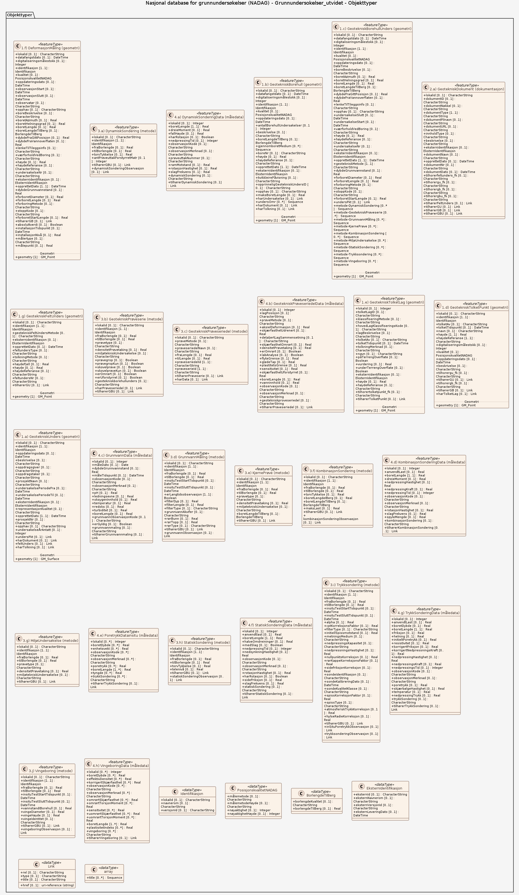
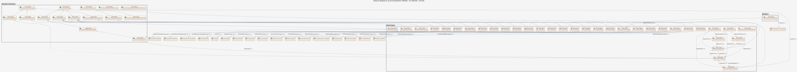

### Datamodell - Grunnundersokelser_utvidet

➡️ [Se full datamodell for omfang "Grunnundersokelser_utvidet" (diagram per pakke og objektkatalog)](grunnundersokelser-utvidet/objektkatalog.html)

### Datamodell - Ny datakilde

➡️ [Se full datamodell for omfang "Ny datakilde" (diagram per pakke og objektkatalog)](ny-datakilde/objektkatalog.html)
