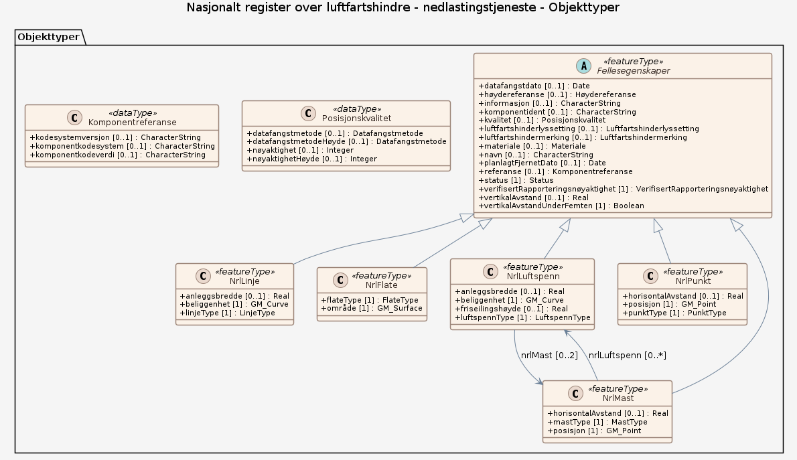

### Datamodell

#### NrlLinje

Objekt som er representert som ei linje i NRL. Luftspenn registreres ikke som NrlLinje, men som NrlLuftspenn.

Egenskaper

<table class="feature-attribute-table">
  <colgroup>
    <col style="width: 35%;" />
    <col style="width: 65%;" />
  </colgroup>
  <tbody>
    <tr>
      <th scope="row">Navn:</th>
      <td><strong>anleggsbredde</strong></td>
    </tr>
    <tr>
      <th scope="row">Definisjon:</th>
      <td>Luftfartshinderets maksimale bredde</td>
    </tr>
    <tr>
      <th scope="row">Multiplisitet:</th>
      <td>0..1</td>
    </tr>
    <tr>
      <th scope="row">Type:</th>
      <td>Real</td>
    </tr>
  </tbody>
</table>

<table class="feature-attribute-table">
  <colgroup>
    <col style="width: 35%;" />
    <col style="width: 65%;" />
  </colgroup>
  <tbody>
    <tr>
      <th scope="row">Navn:</th>
      <td><strong>beliggenhet</strong></td>
    </tr>
    <tr>
      <th scope="row">Definisjon:</th>
      <td>Geometri, linje/kurve</td>
    </tr>
    <tr>
      <th scope="row">Multiplisitet:</th>
      <td>1</td>
    </tr>
    <tr>
      <th scope="row">Type:</th>
      <td>GM_Curve</td>
    </tr>
  </tbody>
</table>

<table class="feature-attribute-table">
  <colgroup>
    <col style="width: 35%;" />
    <col style="width: 65%;" />
  </colgroup>
  <tbody>
    <tr>
      <th scope="row">Navn:</th>
      <td><strong>linjeType</strong></td>
    </tr>
    <tr>
      <th scope="row">Definisjon:</th>
      <td>Type linje</td>
    </tr>
    <tr>
      <th scope="row">Multiplisitet:</th>
      <td>1</td>
    </tr>
    <tr>
      <th scope="row">Type:</th>
      <td>LinjeType</td>
    </tr>
    <tr>
      <th scope="row">Tillatte verdier:</th>
      <td>- Kodeliste: <a href="https://register.geonorge.no/sosi-kodelister/luftfartshinder/nrl-rapportering/1.0/linjetype">https://register.geonorge.no/sosi-kodelister/luftfartshinder/nrl-rapportering/1.0/linjetype</a></td>
    </tr>
  </tbody>
</table>

Relasjoner

**Arv**
Fellesegenskaper

#### Fellesegenskaper (abstrakt)

Abstrakt objekttype (ikke instansierbar, dvs. ikke mulig å rapportere et objekt med objektnavn "Fellesegenskaper"), fungerer som et konteinerobjekt i UML-modellen. Denne objekttypen samler egenskaper som er felles for alle realiserbare objekttyper i NRL  Egenskapene "status", "datafangstdato", "kvalitet" og "informasjon" er en hentet fra SOSI del 1 - Generelle typer 5.1 og SOSI_Fellesegenskaper og SOSI_Objekt.

Egenskaper

<table class="feature-attribute-table">
  <colgroup>
    <col style="width: 35%;" />
    <col style="width: 65%;" />
  </colgroup>
  <tbody>
    <tr>
      <th scope="row">Navn:</th>
      <td><strong>datafangstdato</strong></td>
    </tr>
    <tr>
      <th scope="row">Definisjon:</th>
      <td>Dato sist gang objektet ble stedfestet.</td>
    </tr>
    <tr>
      <th scope="row">Multiplisitet:</th>
      <td>0..1</td>
    </tr>
    <tr>
      <th scope="row">Type:</th>
      <td>Date</td>
    </tr>
  </tbody>
</table>

<table class="feature-attribute-table">
  <colgroup>
    <col style="width: 35%;" />
    <col style="width: 65%;" />
  </colgroup>
  <tbody>
    <tr>
      <th scope="row">Navn:</th>
      <td><strong>høydereferanse</strong></td>
    </tr>
    <tr>
      <th scope="row">Definisjon:</th>
      <td>Angir hvilken del av objektet høydeverdien refererer til.  Må angis dersom objektet har høydeverdi ("høyde over havet")</td>
    </tr>
    <tr>
      <th scope="row">Multiplisitet:</th>
      <td>0..1</td>
    </tr>
    <tr>
      <th scope="row">Type:</th>
      <td>Høydereferanse</td>
    </tr>
    <tr>
      <th scope="row">Tillatte verdier:</th>
      <td>- Kodeliste: <a href="https://register.geonorge.no/sosi-kodelister/luftfartshinder/nrl-rapportering/1.0/h%C3%B8ydereferanse">https://register.geonorge.no/sosi-kodelister/luftfartshinder/nrl-rapportering/1.0/h%C3%B8ydereferanse</a></td>
    </tr>
  </tbody>
</table>

<table class="feature-attribute-table">
  <colgroup>
    <col style="width: 35%;" />
    <col style="width: 65%;" />
  </colgroup>
  <tbody>
    <tr>
      <th scope="row">Navn:</th>
      <td><strong>informasjon</strong></td>
    </tr>
    <tr>
      <th scope="row">Definisjon:</th>
      <td>Utfyllende tekst</td>
    </tr>
    <tr>
      <th scope="row">Multiplisitet:</th>
      <td>0..1</td>
    </tr>
    <tr>
      <th scope="row">Type:</th>
      <td>CharacterString</td>
    </tr>
  </tbody>
</table>

<table class="feature-attribute-table">
  <colgroup>
    <col style="width: 35%;" />
    <col style="width: 65%;" />
  </colgroup>
  <tbody>
    <tr>
      <th scope="row">Navn:</th>
      <td><strong>komponentident</strong></td>
    </tr>
    <tr>
      <th scope="row">Definisjon:</th>
      <td>Universell Unik Identifikasjon (UUID/GUID) for fysisk objekt, skal følge objektet i hele objektets "levetid".  Dersom komponentident ikke angis ved rapportering vil den bli automatisk generert og påført objektet. Ved endring av et objekt som allerede er rapportert til NRL må komponentident angis.</td>
    </tr>
    <tr>
      <th scope="row">Multiplisitet:</th>
      <td>0..1</td>
    </tr>
    <tr>
      <th scope="row">Type:</th>
      <td>CharacterString</td>
    </tr>
  </tbody>
</table>

<table class="feature-attribute-table">
  <colgroup>
    <col style="width: 35%;" />
    <col style="width: 65%;" />
  </colgroup>
  <tbody>
    <tr>
      <th scope="row">Navn:</th>
      <td><strong>kvalitet</strong></td>
    </tr>
    <tr>
      <th scope="row">Definisjon:</th>
      <td>Beskrivelse av kvaliteten på stedfestingen.</td>
    </tr>
    <tr>
      <th scope="row">Multiplisitet:</th>
      <td>0..1</td>
    </tr>
    <tr>
      <th scope="row">Type:</th>
      <td>Posisjonskvalitet</td>
    </tr>
  </tbody>
</table>

<table class="feature-attribute-table">
  <colgroup>
    <col style="width: 35%;" />
    <col style="width: 65%;" />
  </colgroup>
  <tbody>
    <tr>
      <th scope="row">Navn:</th>
      <td><strong>kvalitet.datafangstmetode</strong></td>
    </tr>
    <tr>
      <th scope="row">Definisjon:</th>
      <td>Metode for datafangst.  Egenskapen beskriver datafangstmetode for grunnrisskoordinater (x,y), eller for både grunnriss og høyde (x,y,z) dersom det ikke er oppgitt noen verdi for datafangstmetodeHøyde.</td>
    </tr>
    <tr>
      <th scope="row">Multiplisitet:</th>
      <td>0..1</td>
    </tr>
    <tr>
      <th scope="row">Type:</th>
      <td>Datafangstmetode</td>
    </tr>
    <tr>
      <th scope="row">Tillatte verdier:</th>
      <td>- Kodeliste: <a href="https://register.geonorge.no/sosi-kodelister/fkb/generell/5.0/datafangstmetode">https://register.geonorge.no/sosi-kodelister/fkb/generell/5.0/datafangstmetode</a></td>
    </tr>
  </tbody>
</table>

<table class="feature-attribute-table">
  <colgroup>
    <col style="width: 35%;" />
    <col style="width: 65%;" />
  </colgroup>
  <tbody>
    <tr>
      <th scope="row">Navn:</th>
      <td><strong>kvalitet.datafangstmetodeHøyde</strong></td>
    </tr>
    <tr>
      <th scope="row">Definisjon:</th>
      <td>Metoden brukt for høyderegistrering av posisjon.  Det er bare nødvending å angi en verdi for egenskapen dersom datafangstmetode for høyde avviker fra datafangstmetode for grunnriss.</td>
    </tr>
    <tr>
      <th scope="row">Multiplisitet:</th>
      <td>0..1</td>
    </tr>
    <tr>
      <th scope="row">Type:</th>
      <td>Datafangstmetode</td>
    </tr>
    <tr>
      <th scope="row">Tillatte verdier:</th>
      <td>- Kodeliste: <a href="https://register.geonorge.no/sosi-kodelister/fkb/generell/5.0/datafangstmetode">https://register.geonorge.no/sosi-kodelister/fkb/generell/5.0/datafangstmetode</a></td>
    </tr>
  </tbody>
</table>

<table class="feature-attribute-table">
  <colgroup>
    <col style="width: 35%;" />
    <col style="width: 65%;" />
  </colgroup>
  <tbody>
    <tr>
      <th scope="row">Navn:</th>
      <td><strong>kvalitet.nøyaktighet</strong></td>
    </tr>
    <tr>
      <th scope="row">Definisjon:</th>
      <td>Standardavviket til posisjoneringa av objektet oppgitt i cm.  I de aller fleste sammenhenger benyttes en anslått eller forventet verdi for standardavvik, men dersom man har en beregnet verdi skal denne benyttes.  For objekter med punktgeometri benyttes verdi for punktstandardavvik. For objekter med kurvegeometri benyttes standardavviket for tverravviket fra kurva. For objekter med overflate- eller volumgeometri er forståelsen at standardavviket beregnes ut fra (3D) avvikene mellom sann posisjon og nærmeste punkt på overflata.  Merknad: Verdien er ment å beskrive nøyaktigheten til objektet sammenlignet med sann verdi. Standardavvik er i utgangspunktet et mål på det tilfeldige avviket og det innebærer at vi forutsetter at det systematiske avviket i liten grad påvirker nøyaktigheten til posisjoneringa. For fotogrammetriske data settes som hovedregel verdien lik kravet til standardavvik ved datafangst. Se standarden Geodatakvalitet for nærmere definisjon av standardavvik og hvordan dette defineres, beregnes og kontrolleres.</td>
    </tr>
    <tr>
      <th scope="row">Multiplisitet:</th>
      <td>0..1</td>
    </tr>
    <tr>
      <th scope="row">Type:</th>
      <td>Integer</td>
    </tr>
  </tbody>
</table>

<table class="feature-attribute-table">
  <colgroup>
    <col style="width: 35%;" />
    <col style="width: 65%;" />
  </colgroup>
  <tbody>
    <tr>
      <th scope="row">Navn:</th>
      <td><strong>kvalitet.nøyaktighetHøyde</strong></td>
    </tr>
    <tr>
      <th scope="row">Definisjon:</th>
      <td>Standardavviket til posisjoneringa av objektet oppgitt i cm.  I de aller fleste sammenhenger benyttes en anslått eller forventet verdi for standardavviket, men dersom man faktisk har standardavviket til posisjoneringa av objektet oppgitt i cm.  I de aller fleste sammenhenger benyttes en anslått eller forventet verdi for standardavvik, men dersom man har en beregnet verdi skal denne benyttes.  Merknad: Verdien er ment å beskrive nøyaktigheten til objektet sammenlignet med sann verdi. Standardavvik er i utgangspunktet et mål på det tilfeldige avviket og det innebærer at vi forutsetter at det systematiske avviket i liten grad påvirker nøyaktigheten til posisjoneringa. For fotogrammetriske data settes som hovedregel verdien lik kravet til standardavvik ved datafangst. Se standarden Geodatakvalitet for nærmere definisjon av standardavvik og hvordan dette defineres, beregnes og kontrolleres.</td>
    </tr>
    <tr>
      <th scope="row">Multiplisitet:</th>
      <td>0..1</td>
    </tr>
    <tr>
      <th scope="row">Type:</th>
      <td>Integer</td>
    </tr>
  </tbody>
</table>

<table class="feature-attribute-table">
  <colgroup>
    <col style="width: 35%;" />
    <col style="width: 65%;" />
  </colgroup>
  <tbody>
    <tr>
      <th scope="row">Navn:</th>
      <td><strong>luftfartshinderlyssetting</strong></td>
    </tr>
    <tr>
      <th scope="row">Definisjon:</th>
      <td>Hinderlys benyttet ved merking av luftfartshinder.</td>
    </tr>
    <tr>
      <th scope="row">Multiplisitet:</th>
      <td>0..1</td>
    </tr>
    <tr>
      <th scope="row">Type:</th>
      <td>Luftfartshinderlyssetting</td>
    </tr>
    <tr>
      <th scope="row">Tillatte verdier:</th>
      <td>- Kodeliste: <a href="https://register.geonorge.no/sosi-kodelister/luftfartshinder/nrl-rapportering/1.0/luftfartshinderlyssetting">https://register.geonorge.no/sosi-kodelister/luftfartshinder/nrl-rapportering/1.0/luftfartshinderlyssetting</a></td>
    </tr>
  </tbody>
</table>

<table class="feature-attribute-table">
  <colgroup>
    <col style="width: 35%;" />
    <col style="width: 65%;" />
  </colgroup>
  <tbody>
    <tr>
      <th scope="row">Navn:</th>
      <td><strong>luftfartshindermerking</strong></td>
    </tr>
    <tr>
      <th scope="row">Definisjon:</th>
      <td>Visuell merking benyttet ved merking av luftfartshinder</td>
    </tr>
    <tr>
      <th scope="row">Multiplisitet:</th>
      <td>0..1</td>
    </tr>
    <tr>
      <th scope="row">Type:</th>
      <td>Luftfartshindermerking</td>
    </tr>
    <tr>
      <th scope="row">Tillatte verdier:</th>
      <td>- Kodeliste: <a href="https://register.geonorge.no/sosi-kodelister/luftfartshinder/nrl-rapportering/1.0/luftfartshindermerking">https://register.geonorge.no/sosi-kodelister/luftfartshinder/nrl-rapportering/1.0/luftfartshindermerking</a></td>
    </tr>
  </tbody>
</table>

<table class="feature-attribute-table">
  <colgroup>
    <col style="width: 35%;" />
    <col style="width: 65%;" />
  </colgroup>
  <tbody>
    <tr>
      <th scope="row">Navn:</th>
      <td><strong>materiale</strong></td>
    </tr>
    <tr>
      <th scope="row">Definisjon:</th>
      <td>Dominerende overflatemateriale for luftfartshinder</td>
    </tr>
    <tr>
      <th scope="row">Multiplisitet:</th>
      <td>0..1</td>
    </tr>
    <tr>
      <th scope="row">Type:</th>
      <td>Materiale</td>
    </tr>
    <tr>
      <th scope="row">Tillatte verdier:</th>
      <td>- Kodeliste: <a href="https://register.geonorge.no/sosi-kodelister/luftfartshinder/nrl-rapportering/1.0/materiale">https://register.geonorge.no/sosi-kodelister/luftfartshinder/nrl-rapportering/1.0/materiale</a></td>
    </tr>
  </tbody>
</table>

<table class="feature-attribute-table">
  <colgroup>
    <col style="width: 35%;" />
    <col style="width: 65%;" />
  </colgroup>
  <tbody>
    <tr>
      <th scope="row">Navn:</th>
      <td><strong>navn</strong></td>
    </tr>
    <tr>
      <th scope="row">Definisjon:</th>
      <td>Navn på objekt i de tilfeller hvor dette har relevans, f.eks. Tryvannstårnet, Gullfaks C, Stolheis Hafjell 360, Hardangerbrua, osv.</td>
    </tr>
    <tr>
      <th scope="row">Multiplisitet:</th>
      <td>0..1</td>
    </tr>
    <tr>
      <th scope="row">Type:</th>
      <td>CharacterString</td>
    </tr>
  </tbody>
</table>

<table class="feature-attribute-table">
  <colgroup>
    <col style="width: 35%;" />
    <col style="width: 65%;" />
  </colgroup>
  <tbody>
    <tr>
      <th scope="row">Navn:</th>
      <td><strong>planlagtFjernetDato</strong></td>
    </tr>
    <tr>
      <th scope="row">Definisjon:</th>
      <td>Dato for når luftfartshindret er planlagt revet/fjernet. Spesielt relevant for anlegg som kun står oppført i en begrenset periode, f.eks. kraner</td>
    </tr>
    <tr>
      <th scope="row">Multiplisitet:</th>
      <td>0..1</td>
    </tr>
    <tr>
      <th scope="row">Type:</th>
      <td>Date</td>
    </tr>
  </tbody>
</table>

<table class="feature-attribute-table">
  <colgroup>
    <col style="width: 35%;" />
    <col style="width: 65%;" />
  </colgroup>
  <tbody>
    <tr>
      <th scope="row">Navn:</th>
      <td><strong>referanse</strong></td>
    </tr>
    <tr>
      <th scope="row">Definisjon:</th>
      <td>Referanse til ID i eiers forvaltningssystem, evt. annet register.</td>
    </tr>
    <tr>
      <th scope="row">Multiplisitet:</th>
      <td>0..1</td>
    </tr>
    <tr>
      <th scope="row">Type:</th>
      <td>Komponentreferanse</td>
    </tr>
  </tbody>
</table>

<table class="feature-attribute-table">
  <colgroup>
    <col style="width: 35%;" />
    <col style="width: 65%;" />
  </colgroup>
  <tbody>
    <tr>
      <th scope="row">Navn:</th>
      <td><strong>referanse.kodesystemversjon</strong></td>
    </tr>
    <tr>
      <th scope="row">Definisjon:</th>
      <td>Angir versjon av system.</td>
    </tr>
    <tr>
      <th scope="row">Multiplisitet:</th>
      <td>0..1</td>
    </tr>
    <tr>
      <th scope="row">Type:</th>
      <td>CharacterString</td>
    </tr>
  </tbody>
</table>

<table class="feature-attribute-table">
  <colgroup>
    <col style="width: 35%;" />
    <col style="width: 65%;" />
  </colgroup>
  <tbody>
    <tr>
      <th scope="row">Navn:</th>
      <td><strong>referanse.komponentkodesystem</strong></td>
    </tr>
    <tr>
      <th scope="row">Definisjon:</th>
      <td>Angir hvilket system/register referansen er registrert i.</td>
    </tr>
    <tr>
      <th scope="row">Multiplisitet:</th>
      <td>0..1</td>
    </tr>
    <tr>
      <th scope="row">Type:</th>
      <td>CharacterString</td>
    </tr>
  </tbody>
</table>

<table class="feature-attribute-table">
  <colgroup>
    <col style="width: 35%;" />
    <col style="width: 65%;" />
  </colgroup>
  <tbody>
    <tr>
      <th scope="row">Navn:</th>
      <td><strong>referanse.komponentkodeverdi</strong></td>
    </tr>
    <tr>
      <th scope="row">Definisjon:</th>
      <td>Ekstern id av samme objekt i et annet register/system.</td>
    </tr>
    <tr>
      <th scope="row">Multiplisitet:</th>
      <td>0..1</td>
    </tr>
    <tr>
      <th scope="row">Type:</th>
      <td>CharacterString</td>
    </tr>
  </tbody>
</table>

<table class="feature-attribute-table">
  <colgroup>
    <col style="width: 35%;" />
    <col style="width: 65%;" />
  </colgroup>
  <tbody>
    <tr>
      <th scope="row">Navn:</th>
      <td><strong>status</strong></td>
    </tr>
    <tr>
      <th scope="row">Definisjon:</th>
      <td>Objektets tilstand</td>
    </tr>
    <tr>
      <th scope="row">Multiplisitet:</th>
      <td>1</td>
    </tr>
    <tr>
      <th scope="row">Type:</th>
      <td>Status</td>
    </tr>
    <tr>
      <th scope="row">Tillatte verdier:</th>
      <td>- Kodeliste: <a href="https://register.geonorge.no/sosi-kodelister/luftfartshinder/nrl-rapportering/1.0/status">https://register.geonorge.no/sosi-kodelister/luftfartshinder/nrl-rapportering/1.0/status</a></td>
    </tr>
  </tbody>
</table>

<table class="feature-attribute-table">
  <colgroup>
    <col style="width: 35%;" />
    <col style="width: 65%;" />
  </colgroup>
  <tbody>
    <tr>
      <th scope="row">Navn:</th>
      <td><strong>verifisertRapporteringsnøyaktighet</strong></td>
    </tr>
    <tr>
      <th scope="row">Definisjon:</th>
      <td>Verifikasjon av at objektet som er meldt inn til NRL oppfyller kravene til rapporteringsnøyaktighet angitt i luftfartshinderforskriften.</td>
    </tr>
    <tr>
      <th scope="row">Multiplisitet:</th>
      <td>1</td>
    </tr>
    <tr>
      <th scope="row">Type:</th>
      <td>VerifisertRapporteringsnøyaktighet</td>
    </tr>
    <tr>
      <th scope="row">Tillatte verdier:</th>
      <td>- Kodeliste: <a href="https://register.geonorge.no/sosi-kodelister/luftfartshinder/nrl-rapportering/1.0/verifisertrapporteringsn%C3%B8yaktighet">https://register.geonorge.no/sosi-kodelister/luftfartshinder/nrl-rapportering/1.0/verifisertrapporteringsn%C3%B8yaktighet</a></td>
    </tr>
  </tbody>
</table>

<table class="feature-attribute-table">
  <colgroup>
    <col style="width: 35%;" />
    <col style="width: 65%;" />
  </colgroup>
  <tbody>
    <tr>
      <th scope="row">Navn:</th>
      <td><strong>vertikalAvstand</strong></td>
    </tr>
    <tr>
      <th scope="row">Definisjon:</th>
      <td>Maksimal avstand i vertikalplanet fra objektet til underliggende terreng eller vannoverflate.  Må angis dersom vertikal avstand er større enn 15 meter.  Enhet: meter</td>
    </tr>
    <tr>
      <th scope="row">Multiplisitet:</th>
      <td>0..1</td>
    </tr>
    <tr>
      <th scope="row">Type:</th>
      <td>Real</td>
    </tr>
  </tbody>
</table>

<table class="feature-attribute-table">
  <colgroup>
    <col style="width: 35%;" />
    <col style="width: 65%;" />
  </colgroup>
  <tbody>
    <tr>
      <th scope="row">Navn:</th>
      <td><strong>vertikalAvstandUnderFemten</strong></td>
    </tr>
    <tr>
      <th scope="row">Definisjon:</th>
      <td>Er luftfartshindrets vertikalAvstand, maksimal høyde over terreng eller vann, under 15 meter?  Verifiserer at et luftfartshinder er lavere enn 15 meter og dermed at det ikke er krav til rapportering av ytterligere høydeinformasjon.</td>
    </tr>
    <tr>
      <th scope="row">Multiplisitet:</th>
      <td>1</td>
    </tr>
    <tr>
      <th scope="row">Type:</th>
      <td>Boolean</td>
    </tr>
  </tbody>
</table>

#### NrlFlate

Objekt som er representert som en flate i NRL

Egenskaper

<table class="feature-attribute-table">
  <colgroup>
    <col style="width: 35%;" />
    <col style="width: 65%;" />
  </colgroup>
  <tbody>
    <tr>
      <th scope="row">Navn:</th>
      <td><strong>flateType</strong></td>
    </tr>
    <tr>
      <th scope="row">Definisjon:</th>
      <td>Type, flate</td>
    </tr>
    <tr>
      <th scope="row">Multiplisitet:</th>
      <td>1</td>
    </tr>
    <tr>
      <th scope="row">Type:</th>
      <td>FlateType</td>
    </tr>
    <tr>
      <th scope="row">Tillatte verdier:</th>
      <td>- Kodeliste: <a href="https://register.geonorge.no/sosi-kodelister/luftfartshinder/nrl-rapportering/1.0/flatetype">https://register.geonorge.no/sosi-kodelister/luftfartshinder/nrl-rapportering/1.0/flatetype</a></td>
    </tr>
  </tbody>
</table>

<table class="feature-attribute-table">
  <colgroup>
    <col style="width: 35%;" />
    <col style="width: 65%;" />
  </colgroup>
  <tbody>
    <tr>
      <th scope="row">Navn:</th>
      <td><strong>område</strong></td>
    </tr>
    <tr>
      <th scope="row">Definisjon:</th>
      <td>Geometri, flate</td>
    </tr>
    <tr>
      <th scope="row">Multiplisitet:</th>
      <td>1</td>
    </tr>
    <tr>
      <th scope="row">Type:</th>
      <td>GM_Surface</td>
    </tr>
  </tbody>
</table>

Relasjoner

**Arv**
Fellesegenskaper

#### NrlLuftspenn

Objekt som er representert som et luftspenn i NRL

Egenskaper

<table class="feature-attribute-table">
  <colgroup>
    <col style="width: 35%;" />
    <col style="width: 65%;" />
  </colgroup>
  <tbody>
    <tr>
      <th scope="row">Navn:</th>
      <td><strong>anleggsbredde</strong></td>
    </tr>
    <tr>
      <th scope="row">Definisjon:</th>
      <td>Luftfartshinderets maksimale bredde</td>
    </tr>
    <tr>
      <th scope="row">Multiplisitet:</th>
      <td>0..1</td>
    </tr>
    <tr>
      <th scope="row">Type:</th>
      <td>Real</td>
    </tr>
  </tbody>
</table>

<table class="feature-attribute-table">
  <colgroup>
    <col style="width: 35%;" />
    <col style="width: 65%;" />
  </colgroup>
  <tbody>
    <tr>
      <th scope="row">Navn:</th>
      <td><strong>beliggenhet</strong></td>
    </tr>
    <tr>
      <th scope="row">Definisjon:</th>
      <td>Geometri, linje/kurve</td>
    </tr>
    <tr>
      <th scope="row">Multiplisitet:</th>
      <td>1</td>
    </tr>
    <tr>
      <th scope="row">Type:</th>
      <td>GM_Curve</td>
    </tr>
  </tbody>
</table>

<table class="feature-attribute-table">
  <colgroup>
    <col style="width: 35%;" />
    <col style="width: 65%;" />
  </colgroup>
  <tbody>
    <tr>
      <th scope="row">Navn:</th>
      <td><strong>friseilingshøyde</strong></td>
    </tr>
    <tr>
      <th scope="row">Definisjon:</th>
      <td>Minste seilingshøyde under luftspenn fra et gitt referansenivå  Merknad: Fra 1. januar 2000 er høyeste astronomiske tidevann (HAT) referansenivå for friseilingshøyde</td>
    </tr>
    <tr>
      <th scope="row">Multiplisitet:</th>
      <td>0..1</td>
    </tr>
    <tr>
      <th scope="row">Type:</th>
      <td>Real</td>
    </tr>
  </tbody>
</table>

<table class="feature-attribute-table">
  <colgroup>
    <col style="width: 35%;" />
    <col style="width: 65%;" />
  </colgroup>
  <tbody>
    <tr>
      <th scope="row">Navn:</th>
      <td><strong>luftspennType</strong></td>
    </tr>
    <tr>
      <th scope="row">Definisjon:</th>
      <td>Type luftspenn</td>
    </tr>
    <tr>
      <th scope="row">Multiplisitet:</th>
      <td>1</td>
    </tr>
    <tr>
      <th scope="row">Type:</th>
      <td>LuftspennType</td>
    </tr>
    <tr>
      <th scope="row">Tillatte verdier:</th>
      <td>- Kodeliste: <a href="https://register.geonorge.no/sosi-kodelister/luftfartshinder/nrl-rapportering/1.0/luftspenntype">https://register.geonorge.no/sosi-kodelister/luftfartshinder/nrl-rapportering/1.0/luftspenntype</a></td>
    </tr>
  </tbody>
</table>

Relasjoner

**Arv**
Fellesegenskaper

**Assosiasjoner**
NrlMast – rolle: nrlMast – kardinalitet: 0..2

#### NrlPunkt

Objekt som er representert som et punkt i NRL. Mast registreres ikke som NrlPunkt, men som NrlMast.

Egenskaper

<table class="feature-attribute-table">
  <colgroup>
    <col style="width: 35%;" />
    <col style="width: 65%;" />
  </colgroup>
  <tbody>
    <tr>
      <th scope="row">Navn:</th>
      <td><strong>horisontalAvstand</strong></td>
    </tr>
    <tr>
      <th scope="row">Definisjon:</th>
      <td>Maksimal avstand i horisontalplanet fra punkt til luftfartshinderets avgrensning</td>
    </tr>
    <tr>
      <th scope="row">Multiplisitet:</th>
      <td>0..1</td>
    </tr>
    <tr>
      <th scope="row">Type:</th>
      <td>Real</td>
    </tr>
  </tbody>
</table>

<table class="feature-attribute-table">
  <colgroup>
    <col style="width: 35%;" />
    <col style="width: 65%;" />
  </colgroup>
  <tbody>
    <tr>
      <th scope="row">Navn:</th>
      <td><strong>posisjon</strong></td>
    </tr>
    <tr>
      <th scope="row">Definisjon:</th>
      <td>Geometri, punkt</td>
    </tr>
    <tr>
      <th scope="row">Multiplisitet:</th>
      <td>1</td>
    </tr>
    <tr>
      <th scope="row">Type:</th>
      <td>GM_Point</td>
    </tr>
  </tbody>
</table>

<table class="feature-attribute-table">
  <colgroup>
    <col style="width: 35%;" />
    <col style="width: 65%;" />
  </colgroup>
  <tbody>
    <tr>
      <th scope="row">Navn:</th>
      <td><strong>punktType</strong></td>
    </tr>
    <tr>
      <th scope="row">Definisjon:</th>
      <td>Type punkt</td>
    </tr>
    <tr>
      <th scope="row">Multiplisitet:</th>
      <td>1</td>
    </tr>
    <tr>
      <th scope="row">Type:</th>
      <td>PunktType</td>
    </tr>
    <tr>
      <th scope="row">Tillatte verdier:</th>
      <td>- Kodeliste: <a href="https://register.geonorge.no/sosi-kodelister/luftfartshinder/nrl-rapportering/1.0/punkttype">https://register.geonorge.no/sosi-kodelister/luftfartshinder/nrl-rapportering/1.0/punkttype</a></td>
    </tr>
  </tbody>
</table>

Relasjoner

**Arv**
Fellesegenskaper

#### NrlMast

Objekt som er representert som ei mast i NRL

Egenskaper

<table class="feature-attribute-table">
  <colgroup>
    <col style="width: 35%;" />
    <col style="width: 65%;" />
  </colgroup>
  <tbody>
    <tr>
      <th scope="row">Navn:</th>
      <td><strong>horisontalAvstand</strong></td>
    </tr>
    <tr>
      <th scope="row">Definisjon:</th>
      <td>Maksimal avstand i horisontalplanet fra punkt til luftfartshinderets avgrensning</td>
    </tr>
    <tr>
      <th scope="row">Multiplisitet:</th>
      <td>0..1</td>
    </tr>
    <tr>
      <th scope="row">Type:</th>
      <td>Real</td>
    </tr>
  </tbody>
</table>

<table class="feature-attribute-table">
  <colgroup>
    <col style="width: 35%;" />
    <col style="width: 65%;" />
  </colgroup>
  <tbody>
    <tr>
      <th scope="row">Navn:</th>
      <td><strong>mastType</strong></td>
    </tr>
    <tr>
      <th scope="row">Definisjon:</th>
      <td>Type mast</td>
    </tr>
    <tr>
      <th scope="row">Multiplisitet:</th>
      <td>1</td>
    </tr>
    <tr>
      <th scope="row">Type:</th>
      <td>MastType</td>
    </tr>
    <tr>
      <th scope="row">Tillatte verdier:</th>
      <td>- Kodeliste: <a href="https://register.geonorge.no/sosi-kodelister/luftfartshinder/nrl-rapportering/1.0/masttype">https://register.geonorge.no/sosi-kodelister/luftfartshinder/nrl-rapportering/1.0/masttype</a></td>
    </tr>
  </tbody>
</table>

<table class="feature-attribute-table">
  <colgroup>
    <col style="width: 35%;" />
    <col style="width: 65%;" />
  </colgroup>
  <tbody>
    <tr>
      <th scope="row">Navn:</th>
      <td><strong>posisjon</strong></td>
    </tr>
    <tr>
      <th scope="row">Definisjon:</th>
      <td>Geometri, punkt</td>
    </tr>
    <tr>
      <th scope="row">Multiplisitet:</th>
      <td>1</td>
    </tr>
    <tr>
      <th scope="row">Type:</th>
      <td>GM_Point</td>
    </tr>
  </tbody>
</table>

Relasjoner

**Arv**
Fellesegenskaper

**Assosiasjoner**
NrlLuftspenn – rolle: nrlLuftspenn – kardinalitet: 0..*

### Kodelister

#### «CodeList» LinjeType

**Definisjon:** Kodeliste for NRL linjetyper.

Profilparametre i tagged values

<table class="feature-attribute-table">
  <colgroup>
    <col style="width: 35%;" />
    <col style="width: 65%;" />
  </colgroup>
  <tbody>
    <tr>
      <th scope="row">asDictionary</th>
      <td>true</td>
    </tr>
    <tr>
      <th scope="row">codeList</th>
      <td><a href="https://register.geonorge.no/sosi-kodelister/luftfartshinder/nrl-rapportering/1.0/linjetype">https://register.geonorge.no/sosi-kodelister/luftfartshinder/nrl-rapportering/1.0/linjetype</a></td>
    </tr>
  </tbody>
</table>

#### «CodeList» Høydereferanse

**Definisjon:** Angir hvilken del av objektet høydeverdien refererer til.

Profilparametre i tagged values

<table class="feature-attribute-table">
  <colgroup>
    <col style="width: 35%;" />
    <col style="width: 65%;" />
  </colgroup>
  <tbody>
    <tr>
      <th scope="row">asDictionary</th>
      <td>true</td>
    </tr>
    <tr>
      <th scope="row">codeList</th>
      <td><a href="https://register.geonorge.no/sosi-kodelister/luftfartshinder/nrl-rapportering/1.0/h%C3%B8ydereferanse">https://register.geonorge.no/sosi-kodelister/luftfartshinder/nrl-rapportering/1.0/h%C3%B8ydereferanse</a></td>
    </tr>
  </tbody>
</table>

#### «CodeList» Datafangstmetode

**Definisjon:** metode som ligger til grunn for registrering av posisjon

Profilparametre i tagged values

<table class="feature-attribute-table">
  <colgroup>
    <col style="width: 35%;" />
    <col style="width: 65%;" />
  </colgroup>
  <tbody>
    <tr>
      <th scope="row">asDictionary</th>
      <td>true</td>
    </tr>
    <tr>
      <th scope="row">codeList</th>
      <td><a href="https://register.geonorge.no/sosi-kodelister/fkb/generell/5.0/datafangstmetode">https://register.geonorge.no/sosi-kodelister/fkb/generell/5.0/datafangstmetode</a></td>
    </tr>
  </tbody>
</table>

#### «CodeList» Luftfartshinderlyssetting

**Definisjon:** Hinderlys benyttet ved merking av luftfartshinder. For informasjon om krav til merking, se forskrift om rapportering, registrering og merking av luftfartshinder.

Profilparametre i tagged values

<table class="feature-attribute-table">
  <colgroup>
    <col style="width: 35%;" />
    <col style="width: 65%;" />
  </colgroup>
  <tbody>
    <tr>
      <th scope="row">asDictionary</th>
      <td>true</td>
    </tr>
    <tr>
      <th scope="row">codeList</th>
      <td><a href="https://register.geonorge.no/sosi-kodelister/luftfartshinder/nrl-rapportering/1.0/luftfartshinderlyssetting">https://register.geonorge.no/sosi-kodelister/luftfartshinder/nrl-rapportering/1.0/luftfartshinderlyssetting</a></td>
    </tr>
  </tbody>
</table>

#### «CodeList» Luftfartshindermerking

**Definisjon:** Visuell merking benyttet ved merking av luftfartshinder. Gjelder ikke hinderlys. For informasjon om krav til merking, se forskrift om rapportering, registrering og merking av luftfartshinder.

Profilparametre i tagged values

<table class="feature-attribute-table">
  <colgroup>
    <col style="width: 35%;" />
    <col style="width: 65%;" />
  </colgroup>
  <tbody>
    <tr>
      <th scope="row">asDictionary</th>
      <td>true</td>
    </tr>
    <tr>
      <th scope="row">codeList</th>
      <td><a href="https://register.geonorge.no/sosi-kodelister/luftfartshinder/nrl-rapportering/1.0/luftfartshindermerking">https://register.geonorge.no/sosi-kodelister/luftfartshinder/nrl-rapportering/1.0/luftfartshindermerking</a></td>
    </tr>
  </tbody>
</table>

#### «CodeList» Materiale

**Definisjon:** Dominerende overflatemateriale for luftfartshinder

Profilparametre i tagged values

<table class="feature-attribute-table">
  <colgroup>
    <col style="width: 35%;" />
    <col style="width: 65%;" />
  </colgroup>
  <tbody>
    <tr>
      <th scope="row">asDictionary</th>
      <td>true</td>
    </tr>
    <tr>
      <th scope="row">codeList</th>
      <td><a href="https://register.geonorge.no/sosi-kodelister/luftfartshinder/nrl-rapportering/1.0/materiale">https://register.geonorge.no/sosi-kodelister/luftfartshinder/nrl-rapportering/1.0/materiale</a></td>
    </tr>
  </tbody>
</table>

#### «CodeList» Status

**Definisjon:** Objektets tilstand.

Profilparametre i tagged values

<table class="feature-attribute-table">
  <colgroup>
    <col style="width: 35%;" />
    <col style="width: 65%;" />
  </colgroup>
  <tbody>
    <tr>
      <th scope="row">asDictionary</th>
      <td>true</td>
    </tr>
    <tr>
      <th scope="row">codeList</th>
      <td><a href="https://register.geonorge.no/sosi-kodelister/luftfartshinder/nrl-rapportering/1.0/status">https://register.geonorge.no/sosi-kodelister/luftfartshinder/nrl-rapportering/1.0/status</a></td>
    </tr>
  </tbody>
</table>

#### «CodeList» VerifisertRapporteringsnøyaktighet

**Definisjon:** Verifikasjon av at objektet som er meldt inn til NRL oppfyller kravene til rapporteringsnøyaktighet angitt i luftfartshinderforskriften. Kravene til rapporteringsnøyaktighet kan endre seg fra en versjon av forskriften til neste. Hvilken versjon av luftfartshinderforskriften, med tilhørende §§, som rapporteringen er iht. må angis.
Merknad: Med rapporteringsnøyaktighet menes her innenfor hvilke nøyaktighetskrav i grunnriss og høyde (x, y, z), samt maksimal vertikal avstand (h) som gjelder ved rapportering til NRL.

Profilparametre i tagged values

<table class="feature-attribute-table">
  <colgroup>
    <col style="width: 35%;" />
    <col style="width: 65%;" />
  </colgroup>
  <tbody>
    <tr>
      <th scope="row">asDictionary</th>
      <td>true</td>
    </tr>
    <tr>
      <th scope="row">codeList</th>
      <td><a href="https://register.geonorge.no/sosi-kodelister/luftfartshinder/nrl-rapportering/1.0/verifisertrapporteringsn%C3%B8yaktighet">https://register.geonorge.no/sosi-kodelister/luftfartshinder/nrl-rapportering/1.0/verifisertrapporteringsn%C3%B8yaktighet</a></td>
    </tr>
  </tbody>
</table>

#### «CodeList» FlateType

**Definisjon:** Kodeliste for NRL flatetyper.

Profilparametre i tagged values

<table class="feature-attribute-table">
  <colgroup>
    <col style="width: 35%;" />
    <col style="width: 65%;" />
  </colgroup>
  <tbody>
    <tr>
      <th scope="row">asDictionary</th>
      <td>true</td>
    </tr>
    <tr>
      <th scope="row">codeList</th>
      <td><a href="https://register.geonorge.no/sosi-kodelister/luftfartshinder/nrl-rapportering/1.0/flatetype">https://register.geonorge.no/sosi-kodelister/luftfartshinder/nrl-rapportering/1.0/flatetype</a></td>
    </tr>
  </tbody>
</table>

#### «CodeList» LuftspennType

**Definisjon:** Kodeliste for NRL luftspenn.

Profilparametre i tagged values

<table class="feature-attribute-table">
  <colgroup>
    <col style="width: 35%;" />
    <col style="width: 65%;" />
  </colgroup>
  <tbody>
    <tr>
      <th scope="row">asDictionary</th>
      <td>true</td>
    </tr>
    <tr>
      <th scope="row">codeList</th>
      <td><a href="https://register.geonorge.no/sosi-kodelister/luftfartshinder/nrl-rapportering/1.0/luftspenntype">https://register.geonorge.no/sosi-kodelister/luftfartshinder/nrl-rapportering/1.0/luftspenntype</a></td>
    </tr>
  </tbody>
</table>

#### «CodeList» PunktType

**Definisjon:** Kodeliste for NRL punkttyper.

Profilparametre i tagged values

<table class="feature-attribute-table">
  <colgroup>
    <col style="width: 35%;" />
    <col style="width: 65%;" />
  </colgroup>
  <tbody>
    <tr>
      <th scope="row">asDictionary</th>
      <td>true</td>
    </tr>
    <tr>
      <th scope="row">codeList</th>
      <td><a href="https://register.geonorge.no/sosi-kodelister/luftfartshinder/nrl-rapportering/1.0/punkttype">https://register.geonorge.no/sosi-kodelister/luftfartshinder/nrl-rapportering/1.0/punkttype</a></td>
    </tr>
  </tbody>
</table>

#### «CodeList» MastType

**Definisjon:** Kodeliste for NRL mast.

Profilparametre i tagged values

<table class="feature-attribute-table">
  <colgroup>
    <col style="width: 35%;" />
    <col style="width: 65%;" />
  </colgroup>
  <tbody>
    <tr>
      <th scope="row">asDictionary</th>
      <td>true</td>
    </tr>
    <tr>
      <th scope="row">codeList</th>
      <td><a href="https://register.geonorge.no/sosi-kodelister/luftfartshinder/nrl-rapportering/1.0/masttype">https://register.geonorge.no/sosi-kodelister/luftfartshinder/nrl-rapportering/1.0/masttype</a></td>
    </tr>
  </tbody>
</table>
