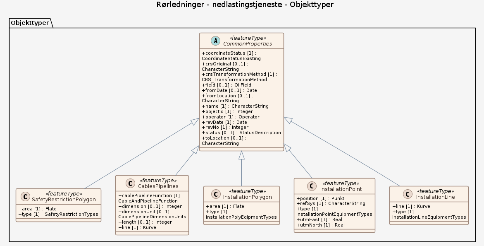

# Produktspesifikasjon: Rørledninger

*Rørledningssystem med tilhørende installasjoner, utgjør transportsystemene for petroleum fra Norsk kontinentalsokkel*

**Nøkkelord:** Rørledninger, Transportsystemer, olje, gass, Norsk kontinentalsokkel, Allmennyttige og offentlige tjenester, Inspire, geodataloven, Norge digitalt, modellbaserteVegprosjekter, fellesDatakatalog, Energi

**Emnekategorier:** Transport

**Geografisk utstrekning**:

- **Vest**: -1.825318
- **Øst**: 23.651189
- **Sør**: 51.046406
- **Nord**: 71.568704

**Tidsmessig utstrekning**:

- **Tidsperiode**:
  - **Fra**: 2020-05-07
  - **Til**: 2020-05-07

## Om spesifikasjonen

> **Denne versjonen av produktspesifikasjonen:**  
> **Opprettet dato:**  
> **Endret dato:** 2020-05-07 
> **Språk:** nor 
> **Kontaktinformasjon:** Sokkeldirektoratet, [factweb@sodir.no](mailto:factweb@sodir.no)

## Om produktet Rørledninger

> **Romlig representasjonstype:** Vektor 
> **Unik identifikator:** <https://data.geonorge.no/sosi/energi/petroleum/TUF> 
> **Kontaktinformasjon:** Sokkeldirektoratet, [factweb@sodir.no](mailto:factweb@sodir.no)
>
> **Romlig oppløsning:**
>
> **Ekvivalent målestokk**: 100000
>
> **Begrensninger:**
>
> **Ressursbegrensninger**:
>
> - **Bruksbegrensninger**: Legal.The contents on the website of the Norwegian Offshore Directorate may be copied and used free of charge as long as all material subject to copyright contains a reference to the source.
>
> **Juridiske begrensninger**:
>
> - **Tilgangsbegrensninger**: Åpne data
> - **Bruksbegrensninger**: Lisens
> - **Lisens**: Norsk lisens for offentlige data (NLOD)
> - **Lisenslenke**: <http://data.norge.no/nlod/no/1.0>
> - **Andre begrensninger**: Ingen begrensninger oppgitt.
>
> **Sikkerhetsbegrensninger**:
>
> - **Klassifisering**: Ugradert

## Omfang

### Hele datasettet

**Nivå**: dataset

**Nivåbeskrivelse**: Gjelder hele datasettet. Hvis omfang ikke er oppgitt under en overskrift, gjelder teksten for hele datasettet og alle leveranser

### nedlastingstjeneste

**Nivå**: dataset

**Nivåbeskrivelse**: Datamodellen beskriver et planlagt datasett for undersjøiske rørledninger.

## Datainnhold og struktur

### Datamodell - nedlastingstjeneste

➡️ [Se full datamodell for omfang "nedlastingstjeneste" (diagram per pakke og objektkatalog)](nedlastingstjeneste/objektkatalog.html)

## Referansesystem

| EPSG-kode | Navn på referansesystem |
| --- | --- |
| [EPSG:23032](https://epsg.io/23032) | [ED 50 UTM Sone 32N, 2D](https://register.geonorge.no/epsg-koder) |

## Datakvalitet

**Nivå**: dataset

- **Kvalitetsmål**: COMMISSION REGULATION (EU) No 1089/2010 of 23 November 2010 implementing Directive 2007/2/EC of the European Parliament and of the Council as regards interoperability of spatial data sets and services
  **Målebeskrivelse**: The dataset is established according to national specifications.
  **Beskrivende resultat**: The dataset is established according to national specifications.

## Datafangst og produksjon

**Datainnsamling og prosessering**:

- **Prosesstrinn**:
  - **Beskrivelse**: Datasettet genereres daglig fra Sokkeldirektoratets operasjonelle databaser.Detaljeringsgraden for de data som legges ut er +/- 50 meter. Traseene nærmere enn 500 meter fra innretningene og landfall er ikke inkludert

## Vedlikehold

**Vedlikeholdsfrekvens**: Etter behov

## Leveranse

| Tjeneste | Endepunkt | Type | Format | Leveranseenheter |
| --- | --- | --- | --- | --- |
| Egen nedlastningsside | [Lenke](https://factpages.sodir.no/downloads/shape/pipLine.zip) | WWW:DOWNLOAD-1.0-http--download | Shape | MB |
| WMS-tjeneste | [Lenke](https://factmaps.sodir.no/api/services/Factmaps/FactMapsED50UTM32/MapServer/WMSServer?request=GetCapabilities&service=WMS) | OGC:WMS | [{}] | MB |

## Metadata

**Metadatastandard**: ISO19115

**Metadatastandardversjon**: 2003

**Metadatadato**: 2025-06-05

**språk**: nor

**Kontakt**:

- **Organisasjon**: Sokkeldirektoratet
- **Kontaktperson**: Sigbjørn Dale
- **Logo**: <https://register.geonorge.no/data/organizations/870917732_Sokkeldepartementet_liten.png>
- **Epost**: factweb@sodir.no
- **rolle**: pointOfContact

**Metadataidentifikator**:

- **Utsteder**: Geonorge
- **kode**: 3a31a1f1-f836-4565-937f-731286fb8baa
- **koderom**: <https://kartkatalog.geonorge.no/metadata/>
- **Metadatalenke**: <https://kartkatalog.geonorge.no/metadata/3a31a1f1-f836-4565-937f-731286fb8baa>

